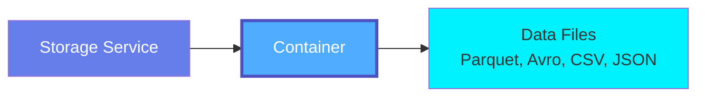

# Container

**Storage buckets and containers - organizing files in object storage**

---

## Overview

The **Container** entity represents storage buckets, containers, or directories within object storage and file systems. Containers organize data files, support partitioning schemes, and hold semi-structured and unstructured data in various file formats.

**Hierarchy**:



**Key Capabilities**:

- File format detection (Parquet, Avro, ORC, CSV, JSON, XML)
- Partition schema discovery (Hive-style, date-based, custom)
- Schema inference from files
- Prefix/folder organization
- Lifecycle policies and versioning

---

## Relationships

Container has comprehensive relationships with entities across the metadata platform:

```mermaid
graph TD
    subgraph Hierarchy
        SVC[StorageService<br/>s3_data_lake]
        SVC --> CONTAINER[Container<br/>raw-customer-data]
    end

    subgraph Files
        CONTAINER --> FILE1[DataFile<br/>customers_2024_01.parquet]
        CONTAINER --> FILE2[DataFile<br/>customers_2024_02.parquet]
        CONTAINER --> FILE3[DataFile<br/>customers_2024_03.parquet]
    end

    subgraph External Tables
        CONTAINER -.->|mapped to| TBL1[Table<br/>external_customers]
        CONTAINER -.->|mapped to| TBL2[Table<br/>athena_customers]
    end

    subgraph Pipelines
        PIPE1[Pipeline<br/>customer_ingestion] -.->|writes to| CONTAINER
        PIPE2[Pipeline<br/>data_transformation] -.->|reads from| CONTAINER
        CONTAINER -.->|consumed by| PIPE3[Pipeline<br/>analytics_etl]
    end

    subgraph Ownership
        CONTAINER -.->|owned by| TEAM[Team<br/>Data Engineering]
        CONTAINER -.->|owned by| USER[User<br/>data.admin]
    end

    subgraph Governance
        CONTAINER -.->|in domain| DOM[Domain<br/>Customer Data]
        CONTAINER -.->|tagged| TAG1[Tag<br/>Tier.Gold]
        CONTAINER -.->|tagged| TAG2[Tag<br/>PII.Sensitive]
        CONTAINER -.->|tagged| TAG3[Tag<br/>Encrypted]
        CONTAINER -.->|linked to| GT[GlossaryTerm<br/>Raw Data]
    end

    subgraph Lineage
        SRC[Database<br/>mongodb_customers] -.->|extracted to| CONTAINER
        CONTAINER -.->|feeds| DW[Table<br/>warehouse.customers]
        CONTAINER -.->|feeds| LAKE[Table<br/>lakehouse.customers]
    end

    subgraph Quality
        TC1[TestCase<br/>file_format_check] -.->|validates| FILE1
        TC2[TestCase<br/>schema_consistency] -.->|validates| CONTAINER
        TC3[TestCase<br/>data_freshness] -.->|monitors| CONTAINER
    end

    subgraph Access
        POLICY[Policy<br/>s3_bucket_policy] -.->|secures| CONTAINER
        ROLE[Role<br/>data_engineer_role] -.->|accesses| CONTAINER
    end

    style SVC fill:#667eea,color:#fff
    style CONTAINER fill:#4facfe,color:#fff,stroke:#4c51bf,stroke-width:3px
    style FILE1 fill:#00f2fe,color:#333
    style FILE2 fill:#00f2fe,color:#333
    style FILE3 fill:#00f2fe,color:#333
    style TBL1 fill:#764ba2,color:#fff
    style TBL2 fill:#764ba2,color:#fff
    style PIPE1 fill:#f5576c,color:#fff
    style PIPE2 fill:#f5576c,color:#fff
    style PIPE3 fill:#f5576c,color:#fff
    style TEAM fill:#43e97b,color:#fff
    style USER fill:#43e97b,color:#fff
    style DOM fill:#fa709a,color:#fff
    style TAG1 fill:#f093fb,color:#fff
    style TAG2 fill:#f093fb,color:#fff
    style TAG3 fill:#f093fb,color:#fff
    style GT fill:#ffd700,color:#333
    style SRC fill:#764ba2,color:#fff
    style DW fill:#764ba2,color:#fff
    style LAKE fill:#764ba2,color:#fff
    style TC1 fill:#9b59b6,color:#fff
    style TC2 fill:#9b59b6,color:#fff
    style TC3 fill:#9b59b6,color:#fff
    style POLICY fill:#ff6b6b,color:#fff
    style ROLE fill:#ff6b6b,color:#fff
```



**Relationship Types**:

- **Solid lines (→)**: Hierarchical containment (Service contains Container, Container contains Files)
- **Dashed lines (-.->)**: References and associations (ownership, governance, lineage)

### Parent Entities
- **StorageService**: The storage service hosting this container

### Child Entities
- **DataFile**: Files stored within this container (Parquet, Avro, CSV, JSON, etc.)

### Associated Entities
- **Owner**: User or team owning this container
- **Domain**: Business domain assignment
- **Tag**: Classification tags
- **GlossaryTerm**: Business terminology
- **Table**: External tables mapped to this container (Athena, Redshift Spectrum, BigQuery external tables)
- **Pipeline**: ETL pipelines reading from or writing to this container
- **TestCase**: Data quality tests for files and schema validation
- **Policy**: Access policies and security rules

---

## Schema Specifications

View the complete Container schema in your preferred format:

=== "JSON Schema"

    **Complete JSON Schema Definition**

    ```json
    {
      "$id": "https://open-metadata.org/schema/entity/data/container.json",
      "$schema": "http://json-schema.org/draft-07/schema#",
      "title": "Container",
      "$comment": "@om-entity-type",
      "description": "This schema defines the Container entity. A Container is an abstraction for any path(including the top level eg. bucket in S3) storing data in an Object store such as S3, GCP, Azure. It maps a tree-like structure, where each Container can have a parent and a list of sub-folders, and it can be structured - where it contains structured data, or unstructured where no schema for its data is defined.",
      "type": "object",
      "javaType": "org.openmetadata.schema.entity.data.Container",
      "javaInterfaces": [
        "org.openmetadata.schema.EntityInterface"
      ],

      "definitions": {
        "containerDataModel": {
          "description": "This captures information about how the container's data is modeled, if it has a schema.",
          "type": "object",
          "javaType": "org.openmetadata.schema.type.ContainerDataModel",
          "properties": {
            "isPartitioned": {
              "description": "Whether the data under this container is partitioned by some property, eg. eventTime=yyyy-mm-dd",
              "type": "boolean",
              "default": false
            },
            "columns": {
              "description": "Columns belonging to this container's schema",
              "type": "array",
              "items": {
                "$ref": "../data/table.json#/definitions/column"
              }
            }
          },
          "required": ["columns"],
          "additionalProperties": false
        },
        "fileFormat": {
          "javaType": "org.openmetadata.schema.type.ContainerFileFormat",
          "description": "This schema defines the file formats for the object/files within a container.",
          "javaInterfaces": [
            "org.openmetadata.schema.EnumInterface"
          ],
          "type": "string",
          "enum": [
            "zip",
            "gz",
            "zstd",
            "csv",
            "tsv",
            "json",
            "parquet",
            "avro",
            "MF4"
          ],
          "javaEnums": [
            {"name": "Zip"},
            {"name": "Gz"},
            {"name": "Zstd"},
            {"name": "Csv"},
            {"name": "Tsv"},
            {"name": "Json"},
            {"name": "Parquet"},
            {"name": "Avro"},
            {"name": "MF4"}
          ]
        }
      },

      "properties": {
        "id": {
          "description": "Unique identifier that identifies this container instance.",
          "$ref": "../../type/basic.json#/definitions/uuid"
        },
        "name": {
          "description": "Name that identifies the container.",
          "$ref": "../../type/basic.json#/definitions/entityName"
        },
        "fullyQualifiedName": {
          "description": "Name that uniquely identifies a container in the format 'ServiceName.ContainerName'.",
          "$ref": "../../type/basic.json#/definitions/fullyQualifiedEntityName"
        },
        "displayName": {
          "description": "Display Name that identifies this container.",
          "type": "string"
        },
        "description": {
          "description": "Description of the container instance.",
          "$ref": "../../type/basic.json#/definitions/markdown"
        },
        "version": {
          "description": "Metadata version of the entity.",
          "$ref": "../../type/entityHistory.json#/definitions/entityVersion"
        },
        "updatedAt": {
          "description": "Last update time corresponding to the new version of the entity in Unix epoch time milliseconds.",
          "$ref": "../../type/basic.json#/definitions/timestamp"
        },
        "updatedBy": {
          "description": "User who made the update.",
          "type": "string"
        },
        "impersonatedBy": {
          "description": "Bot user that performed the action on behalf of the actual user.",
          "$ref": "../../type/basic.json#/definitions/impersonatedBy"
        },
        "href": {
          "description": "Link to the resource corresponding to this entity.",
          "$ref": "../../type/basic.json#/definitions/href"
        },
        "owners": {
          "description": "Owners of this container.",
          "$ref": "../../type/entityReferenceList.json"
        },
        "service": {
          "description": "Link to the storage service where this container is hosted in.",
          "$ref": "../../type/entityReference.json"
        },
        "parent": {
          "description": "Link to the parent container under which this entity sits, if not top level.",
          "$ref": "../../type/entityReference.json"
        },
        "children": {
          "description": "References to child containers residing under this entity.",
          "$ref": "../../type/entityReferenceList.json"
        },
        "dataModel": {
          "description": "References to the container's data model, if data is structured, or null otherwise",
          "$ref": "#/definitions/containerDataModel",
          "default": null
        },
        "prefix": {
          "description": "Optional prefix path defined for this container",
          "type": "string",
          "default": null
        },
        "numberOfObjects": {
          "description": "The number of objects/files this container has.",
          "type": "number",
          "default": null
        },
        "size": {
          "description": "The total size in KB this container has.",
          "type": "number",
          "default": null
        },
        "fileFormats": {
          "description": "File & data formats identified for the container:  e.g. dataFormats=[csv, json]. These can be present both when the container has a dataModel or not",
          "type": "array",
          "items": {
            "$ref": "#/definitions/fileFormat"
          },
          "default": null
        },
        "serviceType": {
          "description": "Service type this table is hosted in.",
          "$ref": "../services/storageService.json#/definitions/storageServiceType"
        },
        "followers": {
          "description": "Followers of this container.",
          "$ref": "../../type/entityReferenceList.json"
        },
        "tags": {
          "description": "Tags for this container.",
          "type": "array",
          "items": {
            "$ref": "../../type/tagLabel.json"
          },
          "default": []
        },
        "changeDescription": {
          "description": "Change that lead to this version of the entity.",
          "$ref": "../../type/entityHistory.json#/definitions/changeDescription"
        },
        "incrementalChangeDescription": {
          "description": "Change that lead to this version of the entity.",
          "$ref": "../../type/entityHistory.json#/definitions/changeDescription"
        },
        "deleted": {
          "description": "When `true` indicates the entity has been soft deleted.",
          "type": "boolean",
          "default": false
        },
        "retentionPeriod": {
          "description": "Retention period of the data in the Container. Period is expressed as duration in ISO 8601 format in UTC. Example - `P23DT23H`.",
          "$ref": "../../type/basic.json#/definitions/duration"
        },
        "extension": {
          "description": "Entity extension data with custom attributes added to the entity.",
          "$ref": "../../type/basic.json#/definitions/entityExtension"
        },
        "sourceUrl": {
          "description": "Source URL of container.",
          "$ref": "../../type/basic.json#/definitions/sourceUrl"
        },
        "fullPath": {
          "description": "Full path of the container/file.",
          "type": "string"
        },
        "domains": {
          "description": "Domains the Container belongs to. When not set, the Container inherits the domain from the storage service it belongs to.",
          "$ref": "../../type/entityReferenceList.json"
        },
        "dataProducts": {
          "description": "List of data products this entity is part of.",
          "$ref": "../../type/entityReferenceList.json"
        },
        "votes": {
          "description": "Votes on the entity.",
          "$ref": "../../type/votes.json"
        },
        "lifeCycle": {
          "description": "Life Cycle properties of the entity",
          "$ref": "../../type/lifeCycle.json"
        },
        "certification": {
          "$ref": "../../type/assetCertification.json"
        },
        "sourceHash": {
          "description": "Source hash of the entity",
          "type": "string",
          "minLength": 1,
          "maxLength": 32
        },
        "entityStatus": {
          "description": "Status of the Container.",
          "$ref": "../../type/status.json"
        }
      },

      "required": ["id", "name", "service"],
      "additionalProperties": false
    }
    ```

    **[View Full JSON Schema →](https://github.com/open-metadata/OpenMetadataStandards/blob/main/schemas/entity/data/container.json)**

=== "RDF"

    **RDF/OWL Ontology Definition**

    ```turtle
    @prefix om: <https://open-metadata.org/schema/> .
    @prefix rdfs: <http://www.w3.org/2000/01/rdf-schema#> .
    @prefix owl: <http://www.w3.org/2001/XMLSchema#> .
    @prefix xsd: <http://www.w3.org/2001/XMLSchema#> .

    # Container Class Definition
    om:Container a owl:Class ;
        rdfs:subClassOf om:DataAsset ;
        rdfs:label "Container" ;
        rdfs:comment "A storage bucket or container holding data files in object storage" ;
        om:hierarchyLevel 2 .

    # Properties
    om:containerName a owl:DatatypeProperty ;
        rdfs:domain om:Container ;
        rdfs:range xsd:string ;
        rdfs:label "name" ;
        rdfs:comment "Name of the container/bucket" .

    om:fullyQualifiedName a owl:DatatypeProperty ;
        rdfs:domain om:Container ;
        rdfs:range xsd:string ;
        rdfs:label "fullyQualifiedName" ;
        rdfs:comment "Complete hierarchical name: service.container" .

    om:prefix a owl:DatatypeProperty ;
        rdfs:domain om:Container ;
        rdfs:range xsd:string ;
        rdfs:label "prefix" ;
        rdfs:comment "Path prefix within container" .

    om:numberOfObjects a owl:DatatypeProperty ;
        rdfs:domain om:Container ;
        rdfs:range xsd:integer ;
        rdfs:label "numberOfObjects" ;
        rdfs:comment "Number of objects/files in container" .

    om:containerSize a owl:DatatypeProperty ;
        rdfs:domain om:Container ;
        rdfs:range xsd:decimal ;
        rdfs:label "size" ;
        rdfs:comment "Total size in bytes" .

    om:hasFileFormat a owl:DatatypeProperty ;
        rdfs:domain om:Container ;
        rdfs:range om:FileFormat ;
        rdfs:label "fileFormats" ;
        rdfs:comment "File formats present in container" .

    om:belongsToStorageService a owl:ObjectProperty ;
        rdfs:domain om:Container ;
        rdfs:range om:StorageService ;
        rdfs:label "belongsToService" ;
        rdfs:comment "Parent storage service" .

    om:hasParentContainer a owl:ObjectProperty ;
        rdfs:domain om:Container ;
        rdfs:range om:Container ;
        rdfs:label "parent" ;
        rdfs:comment "Parent container for nested folders" .

    om:hasChildContainer a owl:ObjectProperty ;
        rdfs:domain om:Container ;
        rdfs:range om:Container ;
        rdfs:label "children" ;
        rdfs:comment "Child containers/folders" .

    om:containerOwnedBy a owl:ObjectProperty ;
        rdfs:domain om:Container ;
        rdfs:range om:Owner ;
        rdfs:label "owners" ;
        rdfs:comment "Users or teams that own this container" .

    om:containerHasTag a owl:ObjectProperty ;
        rdfs:domain om:Container ;
        rdfs:range om:Tag ;
        rdfs:label "hasTag" ;
        rdfs:comment "Classification tags applied to container" .

    # File Format Enumeration
    om:FileFormat a owl:Class ;
        owl:oneOf (
            om:ZipFormat
            om:GzFormat
            om:ZstdFormat
            om:CsvFormat
            om:TsvFormat
            om:JsonFormat
            om:ParquetFormat
            om:AvroFormat
            om:MF4Format
        ) .

    # Example Instance
    ex:rawDataBucket a om:Container ;
        om:containerName "raw-data" ;
        om:fullyQualifiedName "s3_prod.raw-data" ;
        om:displayName "Raw Data Lake Bucket" ;
        om:prefix "data/raw/" ;
        om:numberOfObjects 145230 ;
        om:containerSize 52428800000 ;
        om:hasFileFormat om:ParquetFormat ;
        om:hasFileFormat om:AvroFormat ;
        om:belongsToStorageService ex:s3ProdService ;
        om:containerOwnedBy ex:dataEngTeam ;
        om:containerHasTag ex:tierGold ;
        om:containerHasTag ex:data_layer_raw .
    ```

    **[View Full RDF Ontology →](https://github.com/open-metadata/OpenMetadataStandards/blob/main/rdf/ontology/openmetadata.ttl)**

=== "JSON-LD"

    **JSON-LD Context and Example**

    ```json
    {
      "@context": {
        "@vocab": "https://open-metadata.org/schema/",
        "om": "https://open-metadata.org/schema/",
        "rdfs": "http://www.w3.org/2000/01/rdf-schema#",
        "xsd": "http://www.w3.org/2001/XMLSchema#",

        "Container": "om:Container",
        "name": {
          "@id": "om:containerName",
          "@type": "xsd:string"
        },
        "fullyQualifiedName": {
          "@id": "om:fullyQualifiedName",
          "@type": "xsd:string"
        },
        "displayName": {
          "@id": "om:displayName",
          "@type": "xsd:string"
        },
        "description": {
          "@id": "om:description",
          "@type": "xsd:string"
        },
        "prefix": {
          "@id": "om:prefix",
          "@type": "xsd:string"
        },
        "numberOfObjects": {
          "@id": "om:numberOfObjects",
          "@type": "xsd:integer"
        },
        "size": {
          "@id": "om:containerSize",
          "@type": "xsd:decimal"
        },
        "fileFormats": {
          "@id": "om:hasFileFormat",
          "@type": "@vocab",
          "@container": "@set"
        },
        "dataModel": {
          "@id": "om:dataModel",
          "@type": "@id"
        },
        "service": {
          "@id": "om:belongsToStorageService",
          "@type": "@id"
        },
        "parent": {
          "@id": "om:hasParentContainer",
          "@type": "@id"
        },
        "children": {
          "@id": "om:hasChildContainer",
          "@type": "@id",
          "@container": "@set"
        },
        "owners": {
          "@id": "om:containerOwnedBy",
          "@type": "@id",
          "@container": "@set"
        },
        "domains": {
          "@id": "om:inDomain",
          "@type": "@id",
          "@container": "@set"
        },
        "tags": {
          "@id": "om:containerHasTag",
          "@type": "@id",
          "@container": "@set"
        }
      }
    }
    ```

    **Example JSON-LD Instance**:

    ```json
    {
      "@context": "https://open-metadata.org/context/container.jsonld",
      "@type": "Container",
      "@id": "https://example.com/storage/s3_prod/raw-data",

      "name": "raw-data",
      "fullyQualifiedName": "s3_prod.raw-data",
      "displayName": "Raw Data Lake Bucket",
      "description": "Contains raw ingested data files in Parquet format",
      "prefix": "data/raw/",
      "numberOfObjects": 145230,
      "size": 52428800000,
      "fileFormats": ["parquet", "avro"],

      "dataModel": {
        "isPartitioned": true,
        "columns": [
          {
            "@type": "Column",
            "name": "event_timestamp",
            "dataType": "TIMESTAMP"
          },
          {
            "@type": "Column",
            "name": "user_id",
            "dataType": "BIGINT"
          }
        ]
      },

      "service": {
        "@id": "https://example.com/services/s3_prod",
        "@type": "StorageService",
        "name": "s3_prod"
      },

      "owners": [
        {
          "@id": "https://example.com/teams/data-engineering",
          "@type": "Team",
          "name": "data-engineering",
          "displayName": "Data Engineering Team"
        }
      ],

      "tags": [
        {
          "@id": "https://open-metadata.org/tags/Tier/Gold",
          "tagFQN": "Tier.Gold"
        },
        {
          "@id": "https://open-metadata.org/tags/DataLayer/Raw",
          "tagFQN": "DataLayer.Raw"
        }
      ]
    }
    ```

    **[View Full JSON-LD Context →](https://github.com/open-metadata/OpenMetadataStandards/blob/main/rdf/contexts/container.jsonld)**

---

## Use Cases

- Catalog cloud storage buckets (S3, GCS, Azure Blob)
- Document data lake zones (raw, processed, curated)
- Track file formats and schemas
- Define partition strategies
- Monitor storage costs and growth
- Apply governance to file-based data
- Support data discovery across object storage
- Track data lineage from files to tables
- Manage lifecycle policies

---

## JSON Schema Specification

### Core Properties

#### `id` (uuid)
**Type**: `string` (UUID format)
**Required**: Yes (system-generated)
**Description**: Unique identifier for this container instance

```json
{
  "id": "2b3c4d5e-6f7a-8b9c-0d1e-2f3a4b5c6d7e"
}
```

---

#### `name` (entityName)
**Type**: `string`
**Required**: Yes
**Pattern**: `^[^.]*$` (no dots allowed)
**Min Length**: 1
**Max Length**: 256
**Description**: Name of the container/bucket (unqualified)

```json
{
  "name": "raw-data"
}
```

---

#### `fullyQualifiedName` (fullyQualifiedEntityName)
**Type**: `string`
**Required**: Yes (system-generated)
**Pattern**: `^((?!::).)*$`
**Description**: Fully qualified name in the format `service.container`

```json
{
  "fullyQualifiedName": "s3_prod.raw-data"
}
```

---

#### `displayName`
**Type**: `string`
**Required**: No
**Description**: Human-readable display name

```json
{
  "displayName": "Raw Data Lake Bucket"
}
```

---

#### `description` (markdown)
**Type**: `string` (Markdown format)
**Required**: No
**Description**: Rich text description of the container's purpose and contents

```json
{
  "description": "# Raw Data Lake Bucket\n\nContains raw ingested data files in Parquet format.\n\n## Structure\n- Partitioned by date (year/month/day)\n- Updated hourly via ingestion pipeline\n- Retention: 90 days\n\n## File Formats\n- Primary: Parquet (columnar)\n- Secondary: Avro (event streams)"
}
```

---

### Content Properties

#### `prefix`
**Type**: `string`
**Required**: No
**Description**: Path prefix or folder within the container

```json
{
  "prefix": "data/raw/events/"
}
```

---

#### `numberOfObjects`
**Type**: `integer`
**Required**: No (system-generated)
**Description**: Total number of objects/files in the container

```json
{
  "numberOfObjects": 145230
}
```

---

#### `size`
**Type**: `number`
**Required**: No (system-generated)
**Description**: The total size in KB this container has.

```json
{
  "size": 52428800000
}
```

---

#### `fileFormats[]` (FileFormat[])
**Type**: `array` of FileFormat enum
**Required**: No
**Allowed Values**:

- `zip` - ZIP archive
- `gz` - Gzip compressed
- `zstd` - Zstandard compressed
- `csv` - Comma-Separated Values
- `tsv` - Tab-Separated Values
- `json` - JSON format
- `parquet` - Apache Parquet columnar format
- `avro` - Apache Avro binary format
- `MF4` - MF4 file format

**Description**: File & data formats identified for the container (e.g. dataFormats=[csv, json]). These can be present both when the container has a dataModel or not

```json
{
  "fileFormats": ["parquet", "avro"]
}
```

---

### Schema Properties

#### `dataModel` (ContainerDataModel)
**Type**: `object`
**Required**: No
**Description**: Data model and schema extracted from files

**Properties**:

| Property | Type | Description |
|----------|------|-------------|
| `isPartitioned` | boolean | Whether data is partitioned |
| `columns` | Column[] | Schema columns extracted from files |

**Example**:

```json
{
  "dataModel": {
    "isPartitioned": true,
    "columns": [
      {
        "name": "event_timestamp",
        "dataType": "TIMESTAMP",
        "description": "Event occurrence time"
      },
      {
        "name": "user_id",
        "dataType": "BIGINT",
        "description": "Unique user identifier"
      },
      {
        "name": "event_type",
        "dataType": "VARCHAR",
        "dataLength": 100,
        "description": "Type of event"
      },
      {
        "name": "properties",
        "dataType": "STRUCT",
        "description": "Event properties as JSON"
      }
    ]
  }
}
```

---

### Location Properties

#### `service` (EntityReference)
**Type**: `object`
**Required**: Yes
**Description**: Reference to parent storage service

```json
{
  "service": {
    "id": "1a2b3c4d-5e6f-7a8b-9c0d-1e2f3a4b5c6d",
    "type": "storageService",
    "name": "s3_prod",
    "fullyQualifiedName": "s3_prod"
  }
}
```

---

#### `parent` (EntityReference)
**Type**: `object`
**Required**: No
**Description**: Parent container (for nested folder structures)

```json
{
  "parent": {
    "id": "3c4d5e6f-7a8b-9c0d-1e2f-3a4b5c6d7e8f",
    "type": "container",
    "name": "data-lake",
    "fullyQualifiedName": "s3_prod.data-lake"
  }
}
```

---

#### `children[]` (Container[])
**Type**: `array` of Container references
**Required**: No
**Description**: Child containers/folders (for hierarchical organization)

```json
{
  "children": [
    {
      "id": "4d5e6f7a-8b9c-0d1e-2f3a-4b5c6d7e8f9a",
      "type": "container",
      "name": "raw-data.events",
      "fullyQualifiedName": "s3_prod.raw-data.events"
    },
    {
      "id": "5e6f7a8b-9c0d-1e2f-3a4b-5c6d7e8f9a0b",
      "type": "container",
      "name": "raw-data.logs",
      "fullyQualifiedName": "s3_prod.raw-data.logs"
    }
  ]
}
```

---

### Governance Properties

#### `owners` (EntityReferenceList)
**Type**: `array` of EntityReference
**Required**: No
**Description**: Owners of this container.

```json
{
  "owners": [
    {
      "id": "6f7a8b9c-0d1e-2f3a-4b5c-6d7e8f9a0b1c",
      "type": "team",
      "name": "data-engineering",
      "displayName": "Data Engineering Team"
    }
  ]
}
```

---

#### `domains` (EntityReferenceList)
**Type**: `array` of EntityReference
**Required**: No
**Description**: Domains the Container belongs to. When not set, the Container inherits the domain from the storage service it belongs to.

```json
{
  "domains": [
    {
      "id": "7a8b9c0d-1e2f-3a4b-5c6d-7e8f9a0b1c2d",
      "type": "domain",
      "name": "Analytics",
      "fullyQualifiedName": "Analytics"
    }
  ]
}
```

---

#### `tags[]` (TagLabel[])
**Type**: `array`
**Required**: No
**Description**: Classification tags applied to the container

```json
{
  "tags": [
    {
      "tagFQN": "Tier.Gold",
      "description": "Critical data lake storage",
      "source": "Classification",
      "labelType": "Manual",
      "state": "Confirmed"
    },
    {
      "tagFQN": "DataLayer.Raw",
      "source": "Classification",
      "labelType": "Automated",
      "state": "Confirmed"
    },
    {
      "tagFQN": "Compliance.GDPR",
      "source": "Classification",
      "labelType": "Manual",
      "state": "Confirmed"
    }
  ]
}
```

---

### Additional Properties

#### `followers` (EntityReferenceList)
**Type**: `array` of EntityReference
**Required**: No
**Description**: Followers of this container.

```json
{
  "followers": [
    {
      "id": "8b9c0d1e-2f3a-4b5c-6d7e-8f9a0b1c2d3e",
      "type": "user",
      "name": "john.doe",
      "displayName": "John Doe"
    }
  ]
}
```

---

#### `votes` (Votes)
**Type**: `object`
**Required**: No
**Description**: Votes on the entity.

```json
{
  "votes": {
    "upVotes": 15,
    "downVotes": 2
  }
}
```

---

#### `lifeCycle` (LifeCycle)
**Type**: `object`
**Required**: No
**Description**: Life Cycle properties of the entity

```json
{
  "lifeCycle": {
    "created": {
      "timestamp": 1704240000000,
      "user": "data.engineer"
    },
    "updated": {
      "timestamp": 1704326400000,
      "user": "data.engineer"
    }
  }
}
```

---

#### `certification` (AssetCertification)
**Type**: `object`
**Required**: No
**Description**: Asset certification information

```json
{
  "certification": {
    "tagLabel": {
      "tagFQN": "Certification.Gold"
    }
  }
}
```

---

#### `dataProducts` (EntityReferenceList)
**Type**: `array` of EntityReference
**Required**: No
**Description**: List of data products this entity is part of.

```json
{
  "dataProducts": [
    {
      "id": "9c0d1e2f-3a4b-5c6d-7e8f-9a0b1c2d3e4f",
      "type": "dataProduct",
      "name": "customer-360",
      "fullyQualifiedName": "customer-360"
    }
  ]
}
```

---

#### `serviceType` (StorageServiceType)
**Type**: `string` (enum)
**Required**: No
**Description**: Service type this table is hosted in.

```json
{
  "serviceType": "S3"
}
```

---

#### `retentionPeriod` (Duration)
**Type**: `string` (ISO 8601 duration)
**Required**: No
**Description**: Retention period of the data in the Container. Period is expressed as duration in ISO 8601 format in UTC. Example - `P23DT23H`.

```json
{
  "retentionPeriod": "P90D"
}
```

---

#### `fullPath`
**Type**: `string`
**Required**: No
**Description**: Full path of the container/file.

```json
{
  "fullPath": "s3://my-bucket/data/raw/events/"
}
```

---

#### `sourceUrl` (SourceUrl)
**Type**: `string` (URL format)
**Required**: No
**Description**: Source URL of container.

```json
{
  "sourceUrl": "https://console.aws.amazon.com/s3/buckets/my-bucket"
}
```

---

#### `extension` (EntityExtension)
**Type**: `object`
**Required**: No
**Description**: Entity extension data with custom attributes added to the entity.

```json
{
  "extension": {
    "customProperty1": "value1",
    "customProperty2": "value2"
  }
}
```

---

#### `deleted`
**Type**: `boolean`
**Required**: No (system-managed)
**Default**: `false`
**Description**: When `true` indicates the entity has been soft deleted.

```json
{
  "deleted": false
}
```

---

#### `href` (Href)
**Type**: `string` (URL format)
**Required**: No (system-generated)
**Description**: Link to the resource corresponding to this entity.

```json
{
  "href": "http://localhost:8585/api/v1/containers/2b3c4d5e-6f7a-8b9c-0d1e-2f3a4b5c6d7e"
}
```

---

#### `changeDescription` (ChangeDescription)
**Type**: `object`
**Required**: No (system-managed)
**Description**: Change that lead to this version of the entity.

```json
{
  "changeDescription": {
    "fieldsAdded": [],
    "fieldsUpdated": [
      {
        "name": "description",
        "oldValue": "Old description",
        "newValue": "New description"
      }
    ],
    "fieldsDeleted": []
  }
}
```

---

#### `incrementalChangeDescription` (ChangeDescription)
**Type**: `object`
**Required**: No (system-managed)
**Description**: Change that lead to this version of the entity.

```json
{
  "incrementalChangeDescription": {
    "fieldsAdded": [],
    "fieldsUpdated": [],
    "fieldsDeleted": []
  }
}
```

---

#### `impersonatedBy` (ImpersonatedBy)
**Type**: `object`
**Required**: No
**Description**: Bot user that performed the action on behalf of the actual user.

```json
{
  "impersonatedBy": {
    "id": "0d1e2f3a-4b5c-6d7e-8f9a-0b1c2d3e4f5a",
    "type": "bot",
    "name": "ingestion-bot"
  }
}
```

---

#### `sourceHash`
**Type**: `string`
**Required**: No
**Min Length**: 1
**Max Length**: 32
**Description**: Source hash of the entity

```json
{
  "sourceHash": "abc123def456"
}
```

---

#### `entityStatus` (Status)
**Type**: `string` (enum)
**Required**: No
**Description**: Status of the Container.

```json
{
  "entityStatus": "Active"
}
```

---

### Versioning Properties

#### `version` (entityVersion)
**Type**: `number`
**Required**: Yes (system-managed)
**Description**: Metadata version number, incremented on changes

```json
{
  "version": 2.1
}
```

---

#### `updatedAt` (timestamp)
**Type**: `integer` (Unix epoch milliseconds)
**Required**: Yes (system-managed)
**Description**: Last update timestamp

```json
{
  "updatedAt": 1704240000000
}
```

---

#### `updatedBy` (string)
**Type**: `string`
**Required**: Yes (system-managed)
**Description**: User who made the update

```json
{
  "updatedBy": "data.engineer"
}
```

---

## Complete Examples

### Parquet Data Lake Bucket

```json
{
  "id": "2b3c4d5e-6f7a-8b9c-0d1e-2f3a4b5c6d7e",
  "name": "raw-data",
  "fullyQualifiedName": "s3_prod.raw-data",
  "displayName": "Raw Data Lake Bucket",
  "description": "# Raw Data Lake Bucket\n\nContains raw ingested data in Parquet format.",
  "prefix": "data/raw/",
  "numberOfObjects": 145230,
  "size": 52428800000,
  "fileFormats": ["parquet"],
  "dataModel": {
    "isPartitioned": true,
    "columns": [
      {
        "name": "event_timestamp",
        "dataType": "TIMESTAMP",
        "description": "Event occurrence time"
      },
      {
        "name": "user_id",
        "dataType": "BIGINT",
        "description": "Unique user identifier"
      },
      {
        "name": "event_type",
        "dataType": "VARCHAR",
        "dataLength": 100
      }
    ]
  },
  "service": {
    "id": "1a2b3c4d-5e6f-7a8b-9c0d-1e2f3a4b5c6d",
    "type": "storageService",
    "name": "s3_prod"
  },
  "owners": [
    {
      "id": "6f7a8b9c-0d1e-2f3a-4b5c-6d7e8f9a0b1c",
      "type": "team",
      "name": "data-engineering"
    }
  ],
  "domains": [
    {
      "id": "7a8b9c0d-1e2f-3a4b-5c6d-7e8f9a0b1c2d",
      "type": "domain",
      "name": "Analytics"
    }
  ],
  "tags": [
    {"tagFQN": "Tier.Gold"},
    {"tagFQN": "DataLayer.Raw"}
  ],
  "version": 2.1,
  "updatedAt": 1704240000000,
  "updatedBy": "data.engineer"
}
```

### CSV Archive Bucket

```json
{
  "id": "8b9c0d1e-2f3a-4b5c-6d7e-8f9a0b1c2d3e",
  "name": "historical-archives",
  "fullyQualifiedName": "s3_prod.historical-archives",
  "displayName": "Historical Data Archives",
  "description": "CSV archives of historical transaction data",
  "prefix": "archives/transactions/",
  "numberOfObjects": 52000,
  "size": 15728640000,
  "fileFormats": ["csv", "gz"],
  "dataModel": {
    "isPartitioned": true,
    "columns": [
      {
        "name": "transaction_id",
        "dataType": "VARCHAR",
        "dataLength": 50
      },
      {
        "name": "transaction_date",
        "dataType": "DATE"
      },
      {
        "name": "amount",
        "dataType": "DECIMAL",
        "precision": 10,
        "scale": 2
      },
      {
        "name": "currency",
        "dataType": "CHAR",
        "dataLength": 3
      }
    ]
  },
  "service": {
    "type": "storageService",
    "name": "s3_prod"
  },
  "owners": [
    {
      "type": "team",
      "name": "finance-analytics"
    }
  ],
  "tags": [
    {"tagFQN": "Tier.Silver"},
    {"tagFQN": "DataLayer.Archive"},
    {"tagFQN": "Compliance.SOX"}
  ],
  "version": 1.5,
  "updatedAt": 1704240000000,
  "updatedBy": "admin"
}
```

### Avro Event Streaming Bucket

```json
{
  "id": "9c0d1e2f-3a4b-5c6d-7e8f-9a0b1c2d3e4f",
  "name": "event-streams",
  "fullyQualifiedName": "gcs_datalake.event-streams",
  "displayName": "Real-time Event Streams",
  "description": "Avro files from Kafka event streams",
  "prefix": "streams/events/",
  "numberOfObjects": 325600,
  "size": 78643200000,
  "fileFormats": ["avro"],
  "dataModel": {
    "isPartitioned": true,
    "columns": [
      {
        "name": "event_id",
        "dataType": "VARCHAR",
        "dataLength": 36
      },
      {
        "name": "event_time",
        "dataType": "TIMESTAMP"
      },
      {
        "name": "event_data",
        "dataType": "STRUCT"
      }
    ]
  },
  "service": {
    "type": "storageService",
    "name": "gcs_datalake"
  },
  "owners": [
    {
      "type": "team",
      "name": "streaming-platform"
    }
  ],
  "tags": [
    {"tagFQN": "Tier.Gold"},
    {"tagFQN": "DataLayer.Streaming"},
    {"tagFQN": "RealTime"}
  ],
  "version": 3.2,
  "updatedAt": 1704240000000,
  "updatedBy": "streaming.admin"
}
```

### JSON Log Files

```json
{
  "id": "0d1e2f3a-4b5c-6d7e-8f9a-0b1c2d3e4f5a",
  "name": "application-logs",
  "fullyQualifiedName": "s3_prod.application-logs",
  "displayName": "Application Logs",
  "description": "JSON-formatted application logs",
  "prefix": "logs/applications/",
  "numberOfObjects": 892000,
  "size": 125829120000,
  "fileFormats": ["json", "gz"],
  "dataModel": {
    "isPartitioned": true,
    "columns": [
      {
        "name": "timestamp",
        "dataType": "TIMESTAMP"
      },
      {
        "name": "level",
        "dataType": "VARCHAR",
        "dataLength": 20
      },
      {
        "name": "message",
        "dataType": "TEXT"
      },
      {
        "name": "context",
        "dataType": "JSON"
      }
    ]
  },
  "service": {
    "type": "storageService",
    "name": "s3_prod"
  },
  "owners": [
    {
      "type": "team",
      "name": "platform-ops"
    }
  ],
  "tags": [
    {"tagFQN": "Tier.Bronze"},
    {"tagFQN": "DataType.Logs"}
  ],
  "version": 1.0,
  "updatedAt": 1704240000000,
  "updatedBy": "ops.admin"
}
```

---

## RDF Representation

### Ontology Class

```turtle
@prefix om: <https://open-metadata.org/schema/> .
@prefix rdfs: <http://www.w3.org/2000/01/rdf-schema#> .
@prefix owl: <http://www.w3.org/2001/XMLSchema#> .

om:Container a owl:Class ;
    rdfs:subClassOf om:DataAsset ;
    rdfs:label "Container" ;
    rdfs:comment "A storage bucket or container holding data files" ;
    om:hasProperties [
        om:name "string" ;
        om:prefix "string" ;
        om:numberOfObjects "integer" ;
        om:size "decimal" ;
        om:fileFormats "FileFormat[]" ;
        om:dataModel "ContainerDataModel" ;
        om:service "StorageService" ;
        om:owners "Owner[]" ;
        om:domains "Domain[]" ;
        om:tags "Tag[]" ;
        om:followers "User[]" ;
        om:votes "Votes" ;
        om:lifeCycle "LifeCycle" ;
        om:certification "AssetCertification" ;
        om:dataProducts "DataProduct[]" ;
    ] .
```

### Instance Example

```turtle
@prefix om: <https://open-metadata.org/schema/> .
@prefix ex: <https://example.com/storage/> .

ex:rawDataBucket a om:Container ;
    om:containerName "raw-data" ;
    om:fullyQualifiedName "s3_prod.raw-data" ;
    om:displayName "Raw Data Lake Bucket" ;
    om:prefix "data/raw/" ;
    om:numberOfObjects 145230 ;
    om:containerSize 52428800000 ;
    om:hasFileFormat om:ParquetFormat ;
    om:belongsToStorageService ex:s3ProdService ;
    om:containerOwnedBy ex:dataEngTeam ;
    om:containerHasTag ex:tier_gold ;
    om:containerHasTag ex:data_layer_raw .
```

---

## JSON-LD Context

```json
{
  "@context": {
    "@vocab": "https://open-metadata.org/schema/",
    "om": "https://open-metadata.org/schema/",
    "rdfs": "http://www.w3.org/2000/01/rdf-schema#",
    "Container": "om:Container",
    "name": "om:containerName",
    "fullyQualifiedName": "om:fullyQualifiedName",
    "displayName": "om:displayName",
    "description": "om:description",
    "prefix": "om:prefix",
    "numberOfObjects": "om:numberOfObjects",
    "size": "om:containerSize",
    "fileFormats": {
      "@id": "om:hasFileFormat",
      "@type": "@vocab",
      "@container": "@set"
    },
    "service": {
      "@id": "om:belongsToStorageService",
      "@type": "@id"
    },
    "owner": {
      "@id": "om:containerOwnedBy",
      "@type": "@id"
    },
    "tags": {
      "@id": "om:containerHasTag",
      "@type": "@id",
      "@container": "@set"
    }
  }
}
```

### JSON-LD Example

```json
{
  "@context": "https://open-metadata.org/context/container.jsonld",
  "@type": "Container",
  "@id": "https://example.com/storage/s3_prod/raw-data",
  "name": "raw-data",
  "fullyQualifiedName": "s3_prod.raw-data",
  "displayName": "Raw Data Lake Bucket",
  "fileFormats": ["parquet", "avro"],
  "service": {
    "@id": "https://example.com/services/s3_prod",
    "@type": "StorageService"
  },
  "owners": [
    {
      "@id": "https://example.com/teams/data-engineering",
      "@type": "Team"
    }
  ],
  "tags": [
    {"@id": "https://open-metadata.org/tags/Tier/Gold"},
    {"@id": "https://open-metadata.org/tags/DataLayer/Raw"}
  ]
}
```

---

## Relationships

### Parent Entities
- **StorageService**: The storage service this container belongs to
- **Container**: Parent container (for nested folder structures)

### Child Entities
- **Container**: Child containers/folders (for hierarchical organization)

### Associated Entities
- **Owner**: User or team owning this container
- **Domain**: Business domain assignment
- **Tag**: Classification tags
- **Table**: External tables reading from this container
- **Pipeline**: Pipelines reading/writing to this container
- **DataProduct**: Data products this container is part of

---

## Custom Properties

This entity supports custom properties through the `extension` field.
Common custom properties include:

- **Data Classification**: Sensitivity level
- **Cost Center**: Billing allocation
- **Retention Period**: Data retention requirements
- **Application Owner**: Owning application/team

See [Custom Properties](../../metadata-specifications/custom-properties.md)
for details on defining and using custom properties.

---

## Followers

Users can follow containers to receive notifications about new files, schema changes, and retention policy updates. See **[Followers](../../metadata-specifications/followers.md)** for details.

---

## API Operations

All Container operations are available under the `/v1/containers` endpoint.

### List Containers

Get a list of containers, optionally filtered by service.

```http
GET /v1/containers
Query Parameters:
  - fields: Fields to include (dataModel, owner, tags, fileFormats, etc.)
  - service: Filter by storage service name
  - limit: Number of results (1-1000000, default 10)
  - before/after: Cursor-based pagination
  - include: all | deleted | non-deleted (default: non-deleted)

Response: ContainerList
```

### Create Container

Create a new container (bucket) under a storage service.

```http
POST /v1/containers
Content-Type: application/json

{
  "name": "raw-events",
  "service": "s3_datalake",
  "description": "Raw event data storage",
  "prefix": "data/raw/events/",
  "fileFormats": ["parquet", "json"],
  "numberOfObjects": 150000,
  "size": 524288000,
  "dataModel": {
    "isPartitioned": true,
    "columns": [
      {
        "name": "event_timestamp",
        "dataType": "TIMESTAMP",
        "description": "Event occurrence time"
      },
      {
        "name": "user_id",
        "dataType": "BIGINT",
        "tags": [{"tagFQN": "PII.UserId"}]
      }
    ]
  }
}

Response: Container
```

### Get Container by Name

Get a container by its fully qualified name.

```http
GET /v1/containers/name/{fqn}
Query Parameters:
  - fields: Fields to include (dataModel, owner, tags, fileFormats, etc.)
  - include: all | deleted | non-deleted

Example:
GET /v1/containers/name/s3_datalake.raw-events?fields=dataModel,owner,tags,numberOfObjects

Response: Container
```

### Get Container by ID

Get a container by its unique identifier.

```http
GET /v1/containers/{id}
Query Parameters:
  - fields: Fields to include
  - include: all | deleted | non-deleted

Response: Container
```

### Update Container

Update a container using JSON Patch.

```http
PATCH /v1/containers/name/{fqn}
Content-Type: application/json-patch+json

[
  {"op": "add", "path": "/tags/-", "value": {"tagFQN": "Tier.Gold"}},
  {"op": "replace", "path": "/description", "value": "Updated container description"},
  {"op": "replace", "path": "/numberOfObjects", "value": 200000}
]

Response: Container
```

### Create or Update Container

Create a new container or update if it exists.

```http
PUT /v1/containers
Content-Type: application/json

{
  "name": "curated-data",
  "service": "gcs_analytics",
  "fileFormats": ["parquet"],
  "dataModel": {...}
}

Response: Container
```

### Delete Container

Delete a container by fully qualified name.

```http
DELETE /v1/containers/name/{fqn}
Query Parameters:
  - recursive: Delete children recursively (default: false)
  - hardDelete: Permanently delete (default: false)

Response: 200 OK
```

### Update Container Data Model

Update the schema/data model for files in the container.

```http
PUT /v1/containers/{id}/dataModel
Content-Type: application/json

{
  "dataModel": {
    "isPartitioned": true,
    "columns": [
      {
        "name": "partition_date",
        "dataType": "DATE",
        "description": "Partition key"
      },
      {
        "name": "event_type",
        "dataType": "VARCHAR",
        "dataLength": 100
      }
    ]
  }
}

Response: Container
```

### Get Container Versions

Get all versions of a container.

```http
GET /v1/containers/{id}/versions

Response: EntityHistory
```

### Follow Container

Add a follower to a container.

```http
PUT /v1/containers/{id}/followers/{userId}

Response: ChangeEvent
```

### Get Followers

Get all followers of a container.

```http
GET /v1/containers/{id}/followers

Response: EntityReference[]
```

### Bulk Operations

Create or update multiple containers.

```http
PUT /v1/containers/bulk
Content-Type: application/json

{
  "entities": [...]
}

Response: BulkOperationResult
```
```

---

## Related Documentation

- **[Storage Service](storage-service.md)** - Parent storage service specification
- **[External Tables](../databases/table.md)** - Tables on object storage
- **[Pipeline](../pipelines/pipeline.md)** - Pipelines using containers
- **[Data Lake Patterns](../../guides/data-lake-patterns.md)** - Best practices
- **[File Formats](../../guides/file-formats.md)** - Supported formats
- **[Partitioning](../../guides/partitioning.md)** - Partition strategies
