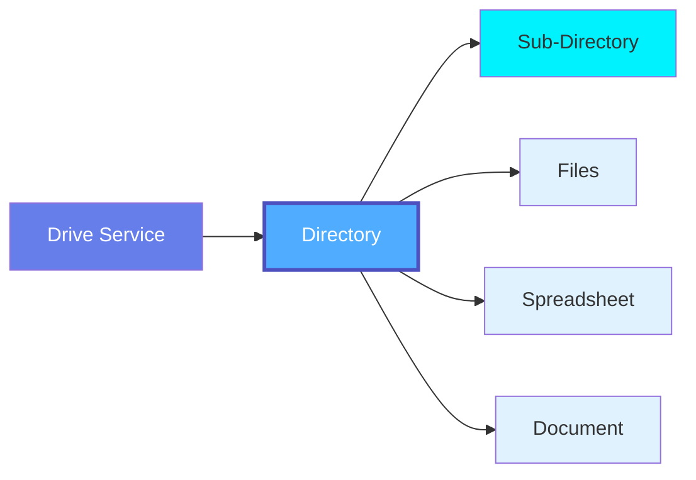

# Directory

**Folders in cloud drive services - organizing collaborative files and documents**

---

## Overview

The **Directory** (or Folder) entity represents a folder or directory within a Drive Service (Google Drive, OneDrive, SharePoint, Dropbox). Directories organize files hierarchically and provide namespace organization for collaborative documents, spreadsheets, presentations, and other files.

**Hierarchy**:



---

## Schema Specifications

View the complete Directory schema in your preferred format:

=== "JSON Schema"

    **Complete JSON Schema Definition**

    ```json
    {
      "$id": "https://open-metadata.org/schema/entity/data/directory.json",
      "$schema": "http://json-schema.org/draft-07/schema#",
      "title": "Directory",
      "description": "This schema defines the Directory entity. A Directory is a folder or organizational unit in a Drive Service that can contain files, worksheets, and other directories.",
      "type": "object",
      "javaType": "org.openmetadata.schema.entity.data.Directory",

      "definitions": {
        "directoryType": {
          "description": "Type of directory",
          "type": "string",
          "enum": [
            "Root",
            "MyDrive",
            "SharedDrive",
            "TeamDrive",
            "Folder",
            "SharePointSite",
            "SharePointLibrary"
          ]
        }
      },

      "properties": {
        "id": {
          "description": "Unique identifier of this directory instance.",
          "$ref": "../../type/basic.json#/definitions/uuid"
        },
        "name": {
          "description": "Name of the directory.",
          "$ref": "../../type/basic.json#/definitions/entityName"
        },
        "fullyQualifiedName": {
          "description": "Fully qualified name of the directory.",
          "$ref": "../../type/basic.json#/definitions/fullyQualifiedEntityName"
        },
        "displayName": {
          "description": "Display Name that identifies this directory.",
          "type": "string"
        },
        "description": {
          "description": "Description of the directory.",
          "$ref": "../../type/basic.json#/definitions/markdown"
        },
        "service": {
          "description": "Link to the drive service this directory belongs to",
          "$ref": "../../type/entityReference.json"
        },
        "serviceType": {
          "description": "Type of drive service",
          "$ref": "../../entity/services/driveService.json#/definitions/driveServiceType"
        },
        "parent": {
          "description": "Parent directory reference",
          "$ref": "../../type/entityReference.json"
        },
        "children": {
          "description": "Child directories and files",
          "$ref": "../../type/entityReferenceList.json"
        },
        "directoryType": {
          "$ref": "#/definitions/directoryType"
        },
        "path": {
          "description": "Full path to the directory",
          "type": "string"
        },
        "isShared": {
          "description": "Whether this directory is shared",
          "type": "boolean",
          "default": false
        },
        "numberOfFiles": {
          "description": "Number of files in this directory",
          "type": "integer"
        },
        "numberOfSubDirectories": {
          "description": "Number of subdirectories",
          "type": "integer"
        },
        "totalSize": {
          "description": "Total size of all files in bytes",
          "type": "integer"
        },
        "sourceUrl": {
          "description": "Link to this directory in the source system.",
          "$ref": "../../type/basic.json#/definitions/sourceUrl"
        },
        "href": {
          "description": "Link to the resource corresponding to this directory.",
          "$ref": "../../type/basic.json#/definitions/href"
        },
        "owners": {
          "description": "Owners of this directory.",
          "$ref": "../../type/entityReferenceList.json"
        },
        "followers": {
          "description": "Followers of this entity.",
          "$ref": "../../type/entityReferenceList.json"
        },
        "tags": {
          "description": "Tags associated with this directory.",
          "type": "array",
          "items": {
            "$ref": "../../type/tagLabel.json"
          },
          "default": null
        },
        "version": {
          "description": "Metadata version of the entity.",
          "$ref": "../../type/entityHistory.json#/definitions/entityVersion"
        },
        "updatedAt": {
          "description": "Last update time corresponding to the new version of the entity in Unix epoch time milliseconds.",
          "$ref": "../../type/basic.json#/definitions/timestamp"
        },
        "updatedBy": {
          "description": "User who made the update.",
          "type": "string"
        },
        "changeDescription": {
          "description": "Change that lead to this version of the entity.",
          "$ref": "../../type/entityHistory.json#/definitions/changeDescription"
        },
        "deleted": {
          "description": "When `true` indicates the entity has been soft deleted.",
          "type": "boolean",
          "default": false
        },
        "domains": {
          "description": "Domains the Directory belongs to.",
          "$ref": "../../type/entityReferenceList.json"
        },
        "dataProducts": {
          "description": "List of data products this entity is part of.",
          "$ref": "../../type/entityReferenceList.json"
        },
        "lifeCycle": {
          "description": "Life Cycle of the entity",
          "$ref": "../../type/lifeCycle.json"
        },
        "sourceHash": {
          "description": "Source hash of the entity",
          "type": "string",
          "minLength": 1,
          "maxLength": 32
        },
        "extension": {
          "description": "Entity extension data with custom attributes added to the entity.",
          "$ref": "../../type/basic.json#/definitions/entityExtension"
        },
        "votes": {
          "description": "Votes on the entity.",
          "$ref": "../../type/votes.json"
        },
        "certification": {
          "$ref": "../../type/assetCertification.json"
        },
        "usageSummary": {
          "description": "Latest usage information for this directory.",
          "$ref": "../../type/usageDetails.json",
          "default": null
        },
        "entityStatus": {
          "description": "Status of the Directory.",
          "$ref": "../../type/status.json"
        }
      },
      "required": ["id", "name", "service"],
      "additionalProperties": false
    }
    ```

=== "RDF (Turtle)"

    **RDF/OWL Ontology Representation**

    ```turtle
    @prefix om: <https://open-metadata.org/schema/> .
    @prefix om-dir: <https://open-metadata.org/schema/entity/data/> .
    @prefix rdf: <http://www.w3.org/1999/02/22-rdf-syntax-ns#> .
    @prefix rdfs: <http://www.w3.org/2000/01/rdf-schema#> .
    @prefix owl: <http://www.w3.org/2002/07/owl#> .
    @prefix xsd: <http://www.w3.org/2001/XMLSchema#> .

    # Directory Class
    om-dir:Directory a owl:Class ;
        rdfs:label "Directory" ;
        rdfs:comment "A Directory is a folder or organizational unit in a Drive Service that can contain files, worksheets, and other directories." ;
        rdfs:isDefinedBy om: .

    # Directory Type Class
    om-dir:DirectoryType a owl:Class ;
        rdfs:label "Directory Type" ;
        rdfs:comment "Type of directory" ;
        rdfs:isDefinedBy om: .

    # Directory Type Individuals
    om-dir:Root a om-dir:DirectoryType ;
        rdfs:label "Root" .
    om-dir:MyDrive a om-dir:DirectoryType ;
        rdfs:label "MyDrive" .
    om-dir:SharedDrive a om-dir:DirectoryType ;
        rdfs:label "SharedDrive" .
    om-dir:TeamDrive a om-dir:DirectoryType ;
        rdfs:label "TeamDrive" .
    om-dir:Folder a om-dir:DirectoryType ;
        rdfs:label "Folder" .
    om-dir:SharePointSite a om-dir:DirectoryType ;
        rdfs:label "SharePointSite" .
    om-dir:SharePointLibrary a om-dir:DirectoryType ;
        rdfs:label "SharePointLibrary" .

    # Object Properties
    om-dir:service a owl:ObjectProperty ;
        rdfs:label "service" ;
        rdfs:comment "Link to the drive service this directory belongs to" ;
        rdfs:domain om-dir:Directory ;
        rdfs:range om:DriveService .

    om-dir:parent a owl:ObjectProperty ;
        rdfs:label "parent" ;
        rdfs:comment "Parent directory reference" ;
        rdfs:domain om-dir:Directory ;
        rdfs:range om-dir:Directory .

    om-dir:children a owl:ObjectProperty ;
        rdfs:label "children" ;
        rdfs:comment "Child directories and files" ;
        rdfs:domain om-dir:Directory .

    om-dir:owners a owl:ObjectProperty ;
        rdfs:label "owners" ;
        rdfs:comment "Owners of this directory" ;
        rdfs:domain om-dir:Directory ;
        rdfs:range om:User .

    om-dir:domains a owl:ObjectProperty ;
        rdfs:label "domains" ;
        rdfs:comment "Domains the Directory belongs to" ;
        rdfs:domain om-dir:Directory ;
        rdfs:range om:Domain .

    om-dir:dataProducts a owl:ObjectProperty ;
        rdfs:label "data products" ;
        rdfs:comment "List of data products this entity is part of" ;
        rdfs:domain om-dir:Directory ;
        rdfs:range om:DataProduct .

    # Datatype Properties
    om-dir:path a owl:DatatypeProperty ;
        rdfs:label "path" ;
        rdfs:comment "Full path to the directory" ;
        rdfs:domain om-dir:Directory ;
        rdfs:range xsd:string .

    om-dir:directoryType a owl:ObjectProperty ;
        rdfs:label "directory type" ;
        rdfs:comment "Type of directory" ;
        rdfs:domain om-dir:Directory ;
        rdfs:range om-dir:DirectoryType .

    om-dir:isShared a owl:DatatypeProperty ;
        rdfs:label "is shared" ;
        rdfs:comment "Whether this directory is shared" ;
        rdfs:domain om-dir:Directory ;
        rdfs:range xsd:boolean .

    om-dir:numberOfFiles a owl:DatatypeProperty ;
        rdfs:label "number of files" ;
        rdfs:comment "Number of files in this directory" ;
        rdfs:domain om-dir:Directory ;
        rdfs:range xsd:integer .

    om-dir:numberOfSubDirectories a owl:DatatypeProperty ;
        rdfs:label "number of subdirectories" ;
        rdfs:comment "Number of subdirectories" ;
        rdfs:domain om-dir:Directory ;
        rdfs:range xsd:integer .

    om-dir:totalSize a owl:DatatypeProperty ;
        rdfs:label "total size" ;
        rdfs:comment "Total size of all files in bytes" ;
        rdfs:domain om-dir:Directory ;
        rdfs:range xsd:integer .

    om-dir:sourceUrl a owl:DatatypeProperty ;
        rdfs:label "source URL" ;
        rdfs:comment "Link to this directory in the source system" ;
        rdfs:domain om-dir:Directory ;
        rdfs:range xsd:anyURI .
    ```

=== "JSON-LD Context"

    **JSON-LD Context for Semantic Interoperability**

    ```json
    {
      "@context": {
        "@vocab": "https://open-metadata.org/schema/entity/data/",
        "om": "https://open-metadata.org/schema/",
        "xsd": "http://www.w3.org/2001/XMLSchema#",

        "Directory": {
          "@id": "om:Directory",
          "@type": "@id"
        },
        "id": {
          "@id": "@id",
          "@type": "@id"
        },
        "name": {
          "@id": "om:name",
          "@type": "xsd:string"
        },
        "fullyQualifiedName": {
          "@id": "om:fullyQualifiedName",
          "@type": "xsd:string"
        },
        "displayName": {
          "@id": "om:displayName",
          "@type": "xsd:string"
        },
        "description": {
          "@id": "om:description",
          "@type": "xsd:string"
        },
        "service": {
          "@id": "om:service",
          "@type": "@id"
        },
        "serviceType": {
          "@id": "om:serviceType",
          "@type": "@id"
        },
        "parent": {
          "@id": "om:parent",
          "@type": "@id"
        },
        "children": {
          "@id": "om:children",
          "@type": "@id",
          "@container": "@set"
        },
        "directoryType": {
          "@id": "om:directoryType",
          "@type": "@id"
        },
        "path": {
          "@id": "om:path",
          "@type": "xsd:string"
        },
        "isShared": {
          "@id": "om:isShared",
          "@type": "xsd:boolean"
        },
        "numberOfFiles": {
          "@id": "om:numberOfFiles",
          "@type": "xsd:integer"
        },
        "numberOfSubDirectories": {
          "@id": "om:numberOfSubDirectories",
          "@type": "xsd:integer"
        },
        "totalSize": {
          "@id": "om:totalSize",
          "@type": "xsd:integer"
        },
        "sourceUrl": {
          "@id": "om:sourceUrl",
          "@type": "xsd:anyURI"
        },
        "href": {
          "@id": "om:href",
          "@type": "xsd:anyURI"
        },
        "owners": {
          "@id": "om:owners",
          "@type": "@id",
          "@container": "@set"
        },
        "followers": {
          "@id": "om:followers",
          "@type": "@id",
          "@container": "@set"
        },
        "tags": {
          "@id": "om:tags",
          "@type": "@id",
          "@container": "@set"
        },
        "domains": {
          "@id": "om:domains",
          "@type": "@id",
          "@container": "@set"
        },
        "dataProducts": {
          "@id": "om:dataProducts",
          "@type": "@id",
          "@container": "@set"
        },
        "deleted": {
          "@id": "om:deleted",
          "@type": "xsd:boolean"
        },
        "extension": {
          "@id": "om:extension"
        },
        "votes": {
          "@id": "om:votes"
        },
        "certification": {
          "@id": "om:certification",
          "@type": "@id"
        },
        "usageSummary": {
          "@id": "om:usageSummary"
        },
        "entityStatus": {
          "@id": "om:entityStatus",
          "@type": "@id"
        }
      }
    }
    ```

---

## Use Cases

### Team Collaboration

Organize team files:

```json
{
  "name": "Marketing Campaigns",
  "service": {
    "id": "123e4567-e89b-12d3-a456-426614174000",
    "type": "driveService",
    "name": "google_drive_marketing"
  },
  "path": "/Marketing/Campaigns",
  "directoryType": "Folder",
  "numberOfFiles": 2,
  "numberOfSubDirectories": 4,
  "children": [
    {
      "id": "q1-2024-dir-id",
      "type": "directory",
      "name": "Q1 2024"
    },
    {
      "id": "q2-2024-dir-id",
      "type": "directory",
      "name": "Q2 2024"
    }
  ],
  "owners": [
    {
      "id": "marketing-team-id",
      "type": "team",
      "name": "marketing-team"
    }
  ],
  "tags": [
    {"tagFQN": "Marketing"},
    {"tagFQN": "Campaigns"}
  ]
}
```

### Data Analytics

Track data source folders:

```json
{
  "name": "Sales Data",
  "service": {
    "id": "456e7890-e89b-12d3-a456-426614174001",
    "type": "driveService",
    "name": "google_drive_analytics"
  },
  "path": "/Data/Sales",
  "directoryType": "Folder",
  "numberOfFiles": 3,
  "totalSize": 15728640,
  "isShared": true,
  "domains": [
    {
      "id": "sales-domain-id",
      "type": "domain",
      "name": "Sales"
    }
  ]
}
```

---

## Custom Properties

This entity supports custom properties through the `extension` field.
Common custom properties include:

- **Data Classification**: Sensitivity level
- **Cost Center**: Billing allocation
- **Retention Period**: Data retention requirements
- **Application Owner**: Owning application/team

See [Custom Properties](../../metadata-specifications/custom-properties.md)
for details on defining and using custom properties.

---

## Followers

Users can follow directories to receive notifications about new files, permission changes, and organizational structure updates. See **[Followers](../../metadata-specifications/followers.md)** for details.

---

## API Operations

All Directory operations are available under the `/v1/drives/directories` endpoint.

### List Directories

Get a list of directories, optionally filtered by service or parent directory.

```http
GET /v1/drives/directories
Query Parameters:
  - fields: Fields to include (owners, children, parent, tags, etc.)
  - service: Filter by drive service name (e.g., googleDrive)
  - parent: Filter by parent directory FQN
  - root: Include only root directories (boolean)
  - limit: Number of results (1-1000000, default 10)
  - before/after: Cursor-based pagination
  - include: all | deleted | non-deleted (default: non-deleted)

Response: DirectoryList
```

### Create Directory

Create a new directory under a drive service or parent directory.

```http
POST /v1/drives/directories
Content-Type: application/json

{
  "name": "Marketing",
  "service": "google_drive_workspace",
  "parent": "google_drive_workspace.Shared",
  "description": "Marketing team folder"
}

Response: Directory
```

### Get Directory by Name

Get a directory by its fully qualified name.

```http
GET /v1/drives/directories/name/{fqn}
Query Parameters:
  - fields: Fields to include
  - include: all | deleted | non-deleted

Example:
GET /v1/drives/directories/name/googleDrive.Marketing.Campaigns?fields=children,owners,tags

Response: Directory
```

### Get Directory by ID

Get a directory by its unique identifier.

```http
GET /v1/drives/directories/{id}
Query Parameters:
  - fields: Fields to include
  - include: all | deleted | non-deleted

Response: Directory
```

### Update Directory

Update a directory using JSON Patch.

```http
PATCH /v1/drives/directories/name/{fqn}
Content-Type: application/json-patch+json

[
  {"op": "add", "path": "/tags", "value": [{"tagFQN": "Tier.Gold"}]},
  {"op": "replace", "path": "/description", "value": "Updated description"}
]

Response: Directory
```

### Create or Update Directory

Create a new directory or update if it exists.

```http
PUT /v1/drives/directories
Content-Type: application/json

{
  "name": "Analytics",
  "service": "google_drive_workspace",
  "description": "Analytics team folder",
  "owners": [
    {
      "id": "data-team-id",
      "type": "team"
    }
  ]
}

Response: Directory
```

### Delete Directory

Delete a directory by fully qualified name.

```http
DELETE /v1/drives/directories/name/{fqn}
Query Parameters:
  - recursive: Delete children recursively (default: false)
  - hardDelete: Permanently delete (default: false)

Response: 200 OK
```

### Get Directory Versions

Get all versions of a directory.

```http
GET /v1/drives/directories/{id}/versions

Response: EntityHistory
```

### Get Specific Version

Get a specific version of a directory.

```http
GET /v1/drives/directories/{id}/versions/{version}

Response: Directory
```

### Follow Directory

Add a follower to a directory.

```http
PUT /v1/drives/directories/{id}/followers/{userId}

Response: ChangeEvent
```

### Get Followers

Get all followers of a directory.

```http
GET /v1/drives/directories/{id}/followers

Response: EntityReference[]
```

### Bulk Operations

Create or update multiple directories.

```http
PUT /v1/drives/directories/bulk
Content-Type: application/json

{
  "entities": [...]
}

Response: BulkOperationResult
```

---

## Related Documentation

- **[Drive Service](drive-service.md)** - Parent drive service
- **[Spreadsheet](spreadsheet.md)** - Spreadsheet files
- **[Worksheet](worksheet.md)** - Worksheets in spreadsheets
- **[File](file.md)** - Other files
- **[Pipeline](../pipelines/pipeline.md)** - Pipelines consuming drive files
