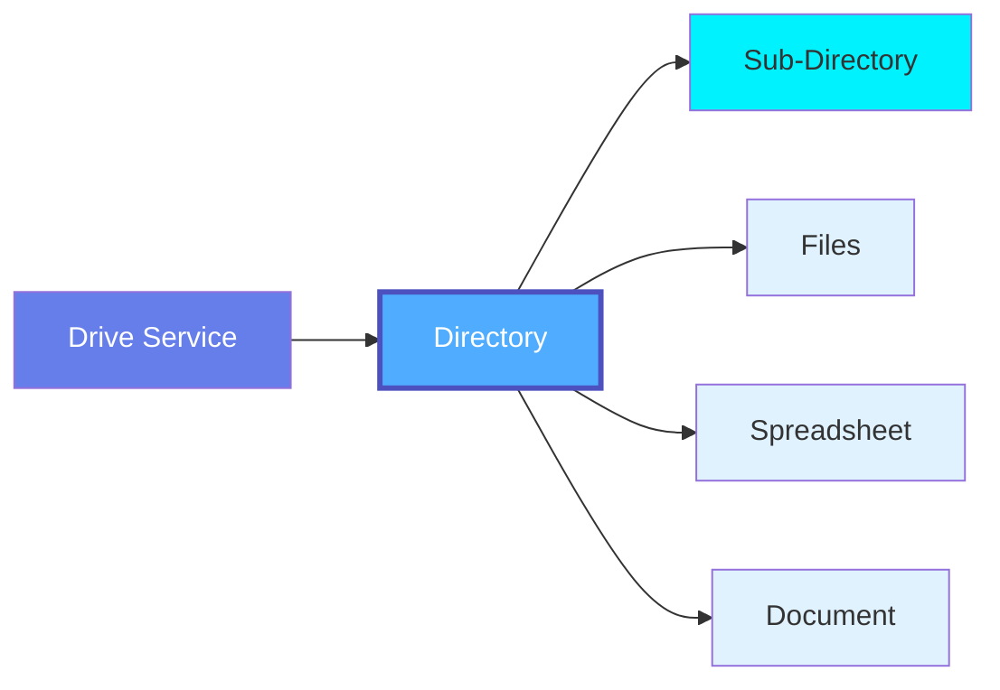

# Directory

**Folders in cloud drive services - organizing collaborative files and documents**

---

## Overview

The **Directory** (or Folder) entity represents a folder or directory within a Drive Service (Google Drive, OneDrive, SharePoint, Dropbox). Directories organize files hierarchically and provide namespace organization for collaborative documents, spreadsheets, presentations, and other files.

**Hierarchy**:



---

## Schema Specifications

View the complete Directory schema in your preferred format:

=== "JSON Schema"

    **Complete JSON Schema Definition**

    ```json
    {
      "$id": "https://open-metadata.org/schema/entity/data/directory.json",
      "$schema": "http://json-schema.org/draft-07/schema#",
      "title": "Directory",
      "description": "A folder or directory in a cloud drive service.",
      "type": "object",

      "properties": {
        "id": {
          "description": "Unique identifier",
          "$ref": "../../type/basic.json#/definitions/uuid"
        },
        "name": {
          "description": "Directory name",
          "$ref": "../../type/basic.json#/definitions/entityName"
        },
        "fullyQualifiedName": {
          "description": "Fully qualified path: driveService.parentDir.dirName",
          "$ref": "../../type/basic.json#/definitions/fullyQualifiedEntityName"
        },
        "displayName": {
          "description": "Display name",
          "type": "string"
        },
        "description": {
          "description": "Markdown description",
          "$ref": "../../type/basic.json#/definitions/markdown"
        },
        "driveService": {
          "description": "Reference to parent drive service",
          "$ref": "../../type/entityReference.json"
        },
        "parentDirectory": {
          "description": "Parent directory (null if root)",
          "$ref": "../../type/entityReference.json"
        },
        "path": {
          "description": "Full path from root",
          "type": "string",
          "example": "/Marketing/Campaigns/Q4 2024"
        },
        "directoryType": {
          "description": "Type of directory",
          "type": "string",
          "enum": ["Folder", "SharedDrive", "DocumentLibrary", "TeamFolder"]
        },
        "files": {
          "description": "Files in this directory",
          "type": "array",
          "items": {
            "$ref": "../../type/entityReference.json"
          }
        },
        "subdirectories": {
          "description": "Child directories",
          "type": "array",
          "items": {
            "$ref": "../../type/entityReference.json"
          }
        },
        "spreadsheets": {
          "description": "Spreadsheet files in directory",
          "type": "array",
          "items": {
            "$ref": "../../type/entityReference.json"
          }
        },
        "sharing": {
          "description": "Sharing settings",
          "type": "object",
          "properties": {
            "sharedWith": {
              "type": "array",
              "items": {
                "type": "object",
                "properties": {
                  "email": {"type": "string"},
                  "permission": {
                    "type": "string",
                    "enum": ["viewer", "commenter", "editor", "owner"]
                  }
                }
              }
            },
            "linkSharing": {
              "type": "string",
              "enum": ["private", "anyone_with_link", "public"]
            }
          }
        },
        "size": {
          "description": "Total size in bytes",
          "type": "integer"
        },
        "fileCount": {
          "description": "Number of files",
          "type": "integer"
        },
        "owner": {
          "description": "Owner of this directory",
          "$ref": "../../type/entityReference.json"
        },
        "domain": {
          "description": "Domain this directory belongs to",
          "$ref": "../../type/entityReference.json"
        },
        "tags": {
          "description": "Tags for this directory",
          "type": "array",
          "items": {
            "$ref": "../../type/tagLabel.json"
          }
        },
        "extension": {
          "description": "Custom properties",
          "$ref": "../../type/basic.json#/definitions/entityExtension"
        }
      },
      "required": ["id", "name", "driveService"],
      "additionalProperties": false
    }
    ```

=== "RDF (Turtle)"

    **RDF/OWL Ontology Representation**

    ```turtle
    @prefix om: <https://open-metadata.org/schema/> .
    @prefix om-dir: <https://open-metadata.org/schema/entity/data/> .
    @prefix rdf: <http://www.w3.org/1999/02/22-rdf-syntax-ns#> .
    @prefix rdfs: <http://www.w3.org/2000/01/rdf-schema#> .
    @prefix owl: <http://www.w3.org/2002/07/owl#> .
    @prefix xsd: <http://www.w3.org/2001/XMLSchema#> .

    # Directory Class
    om-dir:Directory a owl:Class ;
        rdfs:label "Directory" ;
        rdfs:comment "Folder or directory in cloud drive service" ;
        rdfs:isDefinedBy om: .

    # Properties
    om-dir:path a owl:DatatypeProperty ;
        rdfs:label "path" ;
        rdfs:comment "Full path from root directory" ;
        rdfs:domain om-dir:Directory ;
        rdfs:range xsd:string .

    om-dir:parentDirectory a owl:ObjectProperty ;
        rdfs:label "parent directory" ;
        rdfs:comment "Parent directory reference" ;
        rdfs:domain om-dir:Directory ;
        rdfs:range om-dir:Directory .

    om-dir:hasFile a owl:ObjectProperty ;
        rdfs:label "has file" ;
        rdfs:comment "Files contained in this directory" ;
        rdfs:domain om-dir:Directory ;
        rdfs:range om:File .

    om-dir:hasSpreadsheet a owl:ObjectProperty ;
        rdfs:label "has spreadsheet" ;
        rdfs:comment "Spreadsheets in this directory" ;
        rdfs:domain om-dir:Directory ;
        rdfs:range om:Spreadsheet .
    ```

=== "JSON-LD Context"

    **JSON-LD Context for Semantic Interoperability**

    ```json
    {
      "@context": {
        "@vocab": "https://open-metadata.org/schema/entity/data/",
        "om": "https://open-metadata.org/schema/",
        "xsd": "http://www.w3.org/2001/XMLSchema#",

        "Directory": {
          "@id": "om:Directory",
          "@type": "@id"
        },
        "path": {
          "@id": "om:path",
          "@type": "xsd:string"
        },
        "parentDirectory": {
          "@id": "om:parentDirectory",
          "@type": "@id"
        },
        "files": {
          "@id": "om:hasFile",
          "@type": "@id",
          "@container": "@set"
        },
        "spreadsheets": {
          "@id": "om:hasSpreadsheet",
          "@type": "@id",
          "@container": "@set"
        }
      }
    }
    ```

---

## Use Cases

### Team Collaboration

Organize team files:

```json
{
  "name": "Marketing Campaigns",
  "driveService": "google_drive_marketing",
  "path": "/Marketing/Campaigns",
  "directoryType": "Folder",
  "subdirectories": [
    "Q1 2024",
    "Q2 2024",
    "Q3 2024",
    "Q4 2024"
  ],
  "files": ["Campaign_Template.docx", "Brand_Guidelines.pdf"],
  "spreadsheets": ["Campaign_Metrics.gsheet"],
  "owner": "marketing-team",
  "tags": ["Marketing", "Campaigns"]
}
```

### Data Analytics

Track data source folders:

```json
{
  "name": "Sales Data",
  "driveService": "google_drive_analytics",
  "path": "/Data/Sales",
  "spreadsheets": [
    "Monthly_Sales_2024.gsheet",
    "Customer_Segments.gsheet",
    "Revenue_Forecast.xlsx"
  ],
  "lineage": {
    "downstream": ["pipeline.sales_etl", "table.sales_summary"]
  }
}
```

---

## Custom Properties

This entity supports custom properties through the `extension` field.
Common custom properties include:

- **Data Classification**: Sensitivity level
- **Cost Center**: Billing allocation
- **Retention Period**: Data retention requirements
- **Application Owner**: Owning application/team

See [Custom Properties](../../metadata-specifications/custom-properties.md)
for details on defining and using custom properties.

---

## API Operations

### List Directory Contents

```http
GET /api/v1/directories/{id}/files
GET /api/v1/directories/{id}/spreadsheets
```

### Get Directory Metadata

```http
GET /api/v1/directories/name/{fqn}?fields=files,spreadsheets,owner
```

---

## Related Documentation

- **[Drive Service](drive-service.md)** - Parent drive service
- **[Spreadsheet](spreadsheet.md)** - Spreadsheet files
- **[Worksheet](worksheet.md)** - Worksheets in spreadsheets
- **[File](file.md)** - Other files
- **[Pipeline](../pipelines/pipeline.md)** - Pipelines consuming drive files
