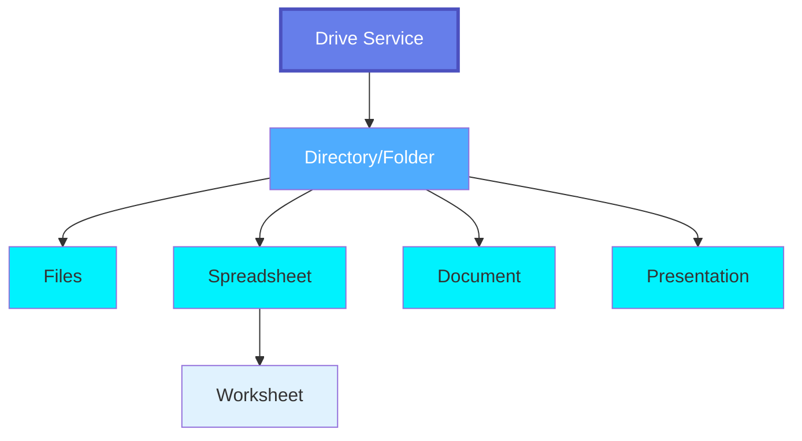
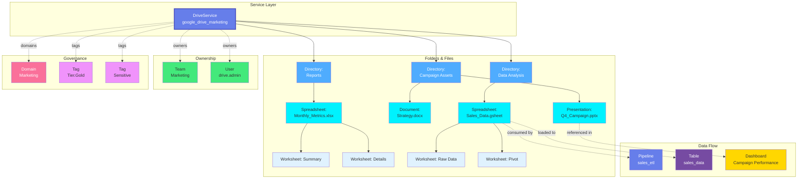

# Drive Service

**Cloud document management and file sharing platforms**

---

## Overview

The **DriveService** entity represents cloud-based document management and file sharing platforms like Google Drive, OneDrive, SharePoint, and Dropbox. Drive Services manage collaborative documents, spreadsheets, presentations, and files with sharing, versioning, and real-time collaboration features.

**Hierarchy**:



**Supported Drive Platforms**:

- **Google Drive** - Google Workspace cloud file storage and collaboration
- **SharePoint** - Microsoft SharePoint document libraries and sites
- **CustomDrive** - Custom drive service implementations

**Drive-Specific Features**:

- **Real-time Collaboration**: Multiple users editing simultaneously
- **Version History**: Track changes and restore previous versions
- **Sharing & Permissions**: Fine-grained access control
- **Comments & Discussions**: In-document collaboration
- **Native File Formats**: Google Docs, Sheets, Slides; Office 365 formats
- **File Conversion**: Convert between formats
- **Offline Access**: Sync for offline work
- **Third-party Integrations**: Apps and extensions

---

## Relationships

DriveService has comprehensive relationships with entities across the metadata platform:



---

## Schema Specifications

View the complete DriveService schema in your preferred format:

=== "JSON Schema"

    **Complete JSON Schema Definition**

    ```json
    {
      "$id": "https://open-metadata.org/schema/entity/services/driveService.json",
      "$schema": "http://json-schema.org/draft-07/schema#",
      "title": "Drive Service",
      "description": "This schema defines the Drive Service entity, such as Google Drive.",
      "type": "object",
      "javaType": "org.openmetadata.schema.entity.services.DriveService",
      "javaInterfaces": [
        "org.openmetadata.schema.EntityInterface",
        "org.openmetadata.schema.ServiceEntityInterface"
      ],
      "definitions": {
        "driveServiceType": {
          "description": "Type of drive service such as Google Drive...",
          "javaInterfaces": [
            "org.openmetadata.schema.EnumInterface"
          ],
          "type": "string",
          "enum": [
            "GoogleDrive",
            "SharePoint",
            "CustomDrive"
          ],
          "javaEnums": [
            {
              "name": "GoogleDrive"
            },
            {
              "name": "SharePoint"
            },
            {
              "name": "CustomDrive"
            }
          ]
        },
        "driveConnection": {
          "type": "object",
          "javaType": "org.openmetadata.schema.type.DriveConnection",
          "description": "Drive Connection.",
          "javaInterfaces": [
            "org.openmetadata.schema.ServiceConnectionEntityInterface"
          ],
          "properties": {
            "config": {
              "mask": true,
              "oneOf": [
                {
                  "$ref": "connections/drive/googleDriveConnection.json"
                },
                {
                  "$ref": "connections/drive/sharePointConnection.json"
                },
                {
                  "$ref": "connections/drive/customDriveConnection.json"
                }
              ]
            }
          },
          "additionalProperties": false
        }
      },
      "properties": {
        "id": {
          "description": "Unique identifier of this drive service instance.",
          "$ref": "../../type/basic.json#/definitions/uuid"
        },
        "name": {
          "description": "Name that identifies this drive service.",
          "$ref": "../../type/basic.json#/definitions/entityName"
        },
        "fullyQualifiedName": {
          "description": "FullyQualifiedName same as `name`.",
          "$ref": "../../type/basic.json#/definitions/fullyQualifiedEntityName"
        },
        "displayName": {
          "description": "Display Name that identifies this drive service.",
          "type": "string"
        },
        "serviceType": {
          "description": "Type of drive service such as Google Drive...",
          "$ref": "#/definitions/driveServiceType"
        },
        "description": {
          "description": "Description of a drive service instance.",
          "$ref": "../../type/basic.json#/definitions/markdown"
        },
        "connection": {
          "$ref": "#/definitions/driveConnection"
        },
        "pipelines": {
          "description": "References to pipelines deployed for this drive service to extract metadata, usage, lineage etc..",
          "$ref": "../../type/entityReferenceList.json"
        },
        "testConnectionResult": {
          "description": "Last test connection results for this service",
          "$ref": "connections/testConnectionResult.json"
        },
        "tags": {
          "description": "Tags for this drive Service.",
          "type": "array",
          "items": {
            "$ref": "../../type/tagLabel.json"
          },
          "default": []
        },
        "version": {
          "description": "Metadata version of the entity.",
          "$ref": "../../type/entityHistory.json#/definitions/entityVersion"
        },
        "updatedAt": {
          "description": "Last update time corresponding to the new version of the entity in Unix epoch time milliseconds.",
          "$ref": "../../type/basic.json#/definitions/timestamp"
        },
        "updatedBy": {
          "description": "User who made the update.",
          "type": "string"
        },
        "impersonatedBy": {
          "description": "Bot user that performed the action on behalf of the actual user.",
          "$ref": "../../type/basic.json#/definitions/impersonatedBy"
        },
        "href": {
          "description": "Link to the resource corresponding to this drive service.",
          "$ref": "../../type/basic.json#/definitions/href"
        },
        "owners": {
          "description": "Owners of this drive service.",
          "$ref": "../../type/entityReferenceList.json"
        },
        "changeDescription": {
          "description": "Change that lead to this version of the entity.",
          "$ref": "../../type/entityHistory.json#/definitions/changeDescription"
        },
        "incrementalChangeDescription": {
          "description": "Change that lead to this version of the entity.",
          "$ref": "../../type/entityHistory.json#/definitions/changeDescription"
        },
        "deleted": {
          "description": "When `true` indicates the entity has been soft deleted.",
          "type": "boolean",
          "default": false
        },
        "dataProducts": {
          "description": "List of data products this entity is part of.",
          "$ref": "../../type/entityReferenceList.json"
        },
        "followers": {
          "description": "Followers of this entity.",
          "$ref": "../../type/entityReferenceList.json"
        },
        "domains": {
          "description": "Domains the Drive service belongs to.",
          "$ref": "../../type/entityReferenceList.json"
        },
        "ingestionRunner": {
          "description": "The ingestion agent responsible for executing the ingestion pipeline.",
          "$ref": "../../type/entityReference.json"
        }
      },
      "required": ["id", "name", "serviceType"],
      "additionalProperties": false
    }
    ```

=== "RDF (Turtle)"

    **RDF/OWL Ontology Representation**

    ```turtle
    @prefix om: <https://open-metadata.org/schema/> .
    @prefix om-entity: <https://open-metadata.org/schema/entity/> .
    @prefix om-service: <https://open-metadata.org/schema/entity/services/> .
    @prefix rdf: <http://www.w3.org/1999/02/22-rdf-syntax-ns#> .
    @prefix rdfs: <http://www.w3.org/2000/01/rdf-schema#> .
    @prefix owl: <http://www.w3.org/2002/07/owl#> .
    @prefix xsd: <http://www.w3.org/2001/XMLSchema#> .

    # Drive Service Class
    om-service:DriveService a owl:Class ;
        rdfs:label "Drive Service" ;
        rdfs:comment "This schema defines the Drive Service entity, such as Google Drive." ;
        rdfs:subClassOf om:Service ;
        rdfs:isDefinedBy <https://open-metadata.org/schema/entity/services/driveService.json> .

    # Core Properties
    om:id a owl:DatatypeProperty ;
        rdfs:label "id" ;
        rdfs:comment "Unique identifier of this drive service instance." ;
        rdfs:domain om-service:DriveService ;
        rdfs:range xsd:string .

    om:name a owl:DatatypeProperty ;
        rdfs:label "name" ;
        rdfs:comment "Name that identifies this drive service." ;
        rdfs:domain om-service:DriveService ;
        rdfs:range xsd:string .

    om:fullyQualifiedName a owl:DatatypeProperty ;
        rdfs:label "fully qualified name" ;
        rdfs:comment "FullyQualifiedName same as `name`." ;
        rdfs:domain om-service:DriveService ;
        rdfs:range xsd:string .

    om:displayName a owl:DatatypeProperty ;
        rdfs:label "display name" ;
        rdfs:comment "Display Name that identifies this drive service." ;
        rdfs:domain om-service:DriveService ;
        rdfs:range xsd:string .

    om:serviceType a owl:DatatypeProperty ;
        rdfs:label "service type" ;
        rdfs:comment "Type of drive service such as Google Drive..." ;
        rdfs:domain om-service:DriveService ;
        rdfs:range xsd:string .

    om:description a owl:DatatypeProperty ;
        rdfs:label "description" ;
        rdfs:comment "Description of a drive service instance." ;
        rdfs:domain om-service:DriveService ;
        rdfs:range xsd:string .

    # Relationship Properties
    om:owners a owl:ObjectProperty ;
        rdfs:label "owners" ;
        rdfs:comment "Owners of this drive service." ;
        rdfs:domain om-service:DriveService ;
        rdfs:range om:EntityReference .

    om:domains a owl:ObjectProperty ;
        rdfs:label "domains" ;
        rdfs:comment "Domains the Drive service belongs to." ;
        rdfs:domain om-service:DriveService ;
        rdfs:range om:EntityReference .

    om:tags a owl:ObjectProperty ;
        rdfs:label "tags" ;
        rdfs:comment "Tags for this drive Service." ;
        rdfs:domain om-service:DriveService ;
        rdfs:range om:TagLabel .

    om:followers a owl:ObjectProperty ;
        rdfs:label "followers" ;
        rdfs:comment "Followers of this entity." ;
        rdfs:domain om-service:DriveService ;
        rdfs:range om:EntityReference .

    om:dataProducts a owl:ObjectProperty ;
        rdfs:label "data products" ;
        rdfs:comment "List of data products this entity is part of." ;
        rdfs:domain om-service:DriveService ;
        rdfs:range om:EntityReference .

    om:pipelines a owl:ObjectProperty ;
        rdfs:label "pipelines" ;
        rdfs:comment "References to pipelines deployed for this drive service to extract metadata, usage, lineage etc.." ;
        rdfs:domain om-service:DriveService ;
        rdfs:range om:EntityReference .

    om:ingestionRunner a owl:ObjectProperty ;
        rdfs:label "ingestion runner" ;
        rdfs:comment "The ingestion agent responsible for executing the ingestion pipeline." ;
        rdfs:domain om-service:DriveService ;
        rdfs:range om:EntityReference .

    # Metadata Properties
    om:version a owl:DatatypeProperty ;
        rdfs:label "version" ;
        rdfs:comment "Metadata version of the entity." ;
        rdfs:domain om-service:DriveService ;
        rdfs:range xsd:double .

    om:updatedAt a owl:DatatypeProperty ;
        rdfs:label "updated at" ;
        rdfs:comment "Last update time corresponding to the new version of the entity in Unix epoch time milliseconds." ;
        rdfs:domain om-service:DriveService ;
        rdfs:range xsd:long .

    om:updatedBy a owl:DatatypeProperty ;
        rdfs:label "updated by" ;
        rdfs:comment "User who made the update." ;
        rdfs:domain om-service:DriveService ;
        rdfs:range xsd:string .

    om:href a owl:DatatypeProperty ;
        rdfs:label "href" ;
        rdfs:comment "Link to the resource corresponding to this drive service." ;
        rdfs:domain om-service:DriveService ;
        rdfs:range xsd:anyURI .

    om:deleted a owl:DatatypeProperty ;
        rdfs:label "deleted" ;
        rdfs:comment "When `true` indicates the entity has been soft deleted." ;
        rdfs:domain om-service:DriveService ;
        rdfs:range xsd:boolean .

    # Connection Properties
    om:connection a owl:ObjectProperty ;
        rdfs:label "connection" ;
        rdfs:comment "Drive Connection configuration." ;
        rdfs:domain om-service:DriveService ;
        rdfs:range om:DriveConnection .

    om:testConnectionResult a owl:ObjectProperty ;
        rdfs:label "test connection result" ;
        rdfs:comment "Last test connection results for this service" ;
        rdfs:domain om-service:DriveService ;
        rdfs:range om:TestConnectionResult .
    ```

=== "JSON-LD Context"

    **JSON-LD Context for Semantic Interoperability**

    ```json
    {
      "@context": {
        "@vocab": "https://open-metadata.org/schema/",
        "om": "https://open-metadata.org/schema/",
        "om-service": "https://open-metadata.org/schema/entity/services/",
        "xsd": "http://www.w3.org/2001/XMLSchema#",

        "DriveService": {
          "@id": "om-service:DriveService",
          "@type": "@id"
        },
        "id": {
          "@id": "om:id",
          "@type": "xsd:string"
        },
        "name": {
          "@id": "om:name",
          "@type": "xsd:string"
        },
        "fullyQualifiedName": {
          "@id": "om:fullyQualifiedName",
          "@type": "xsd:string"
        },
        "displayName": {
          "@id": "om:displayName",
          "@type": "xsd:string"
        },
        "serviceType": {
          "@id": "om:serviceType",
          "@type": "xsd:string"
        },
        "description": {
          "@id": "om:description",
          "@type": "xsd:string"
        },
        "connection": {
          "@id": "om:connection",
          "@type": "@id"
        },
        "pipelines": {
          "@id": "om:pipelines",
          "@type": "@id",
          "@container": "@set"
        },
        "testConnectionResult": {
          "@id": "om:testConnectionResult",
          "@type": "@id"
        },
        "tags": {
          "@id": "om:tags",
          "@type": "@id",
          "@container": "@set"
        },
        "version": {
          "@id": "om:version",
          "@type": "xsd:double"
        },
        "updatedAt": {
          "@id": "om:updatedAt",
          "@type": "xsd:long"
        },
        "updatedBy": {
          "@id": "om:updatedBy",
          "@type": "xsd:string"
        },
        "impersonatedBy": {
          "@id": "om:impersonatedBy",
          "@type": "xsd:string"
        },
        "href": {
          "@id": "om:href",
          "@type": "xsd:anyURI"
        },
        "owners": {
          "@id": "om:owners",
          "@type": "@id",
          "@container": "@set"
        },
        "changeDescription": {
          "@id": "om:changeDescription",
          "@type": "@id"
        },
        "incrementalChangeDescription": {
          "@id": "om:incrementalChangeDescription",
          "@type": "@id"
        },
        "deleted": {
          "@id": "om:deleted",
          "@type": "xsd:boolean"
        },
        "dataProducts": {
          "@id": "om:dataProducts",
          "@type": "@id",
          "@container": "@set"
        },
        "followers": {
          "@id": "om:followers",
          "@type": "@id",
          "@container": "@set"
        },
        "domains": {
          "@id": "om:domains",
          "@type": "@id",
          "@container": "@set"
        },
        "ingestionRunner": {
          "@id": "om:ingestionRunner",
          "@type": "@id"
        }
      }
    }
    ```

---

## Drive Service Types

### Google Drive

**Configuration**:

```yaml
serviceType: GoogleDrive
connection:
  config:
    clientId: xxx
    clientSecret: xxx
    refreshToken: xxx
```

**Features**:
- Google Docs, Sheets, Slides native formats
- Shared Drives for team collaboration
- Real-time collaborative editing
- Version history and restore
- Google Workspace integration

### SharePoint

**Configuration**:

```yaml
serviceType: SharePoint
connection:
  config:
    tenantId: xxx
    clientId: xxx
    clientSecret: xxx
    hostPort: contoso.sharepoint.com
    siteName: Marketing
```

**Features**:
- Office 365 integration
- SharePoint document libraries
- Teams integration
- Co-authoring in Office apps
- Compliance and retention policies

### CustomDrive

**Configuration**:

```yaml
serviceType: CustomDrive
connection:
  config:
    # Custom configuration based on implementation
```

**Features**:
- Support for custom drive service implementations
- Flexible configuration options
- Extensible connector framework

---

## File Types in Drive Services

### Spreadsheets

Spreadsheet files with multiple worksheets:

**Formats**:
- Google Sheets (.gsheet)
- Microsoft Excel (.xlsx, .xls)
- LibreOffice Calc (.ods)
- CSV files (.csv)

**Hierarchy**:
```
Spreadsheet
  └── Worksheet (Sheet1, Sheet2, etc.)
        └── Columns & Rows
              └── Cells
```

**Metadata**:
- Worksheet names and count
- Column headers
- Data types
- Formulas and calculations
- Named ranges
- Pivot tables

### Documents

Text documents and PDFs:

**Formats**:
- Google Docs (.gdoc)
- Microsoft Word (.docx, .doc)
- PDF (.pdf)
- Plain Text (.txt, .md)

### Presentations

Slide decks:

**Formats**:
- Google Slides (.gslide)
- Microsoft PowerPoint (.pptx, .ppt)
- PDF presentations

### Other Files

- Images (.jpg, .png, .gif)
- Videos (.mp4, .mov)
- Audio (.mp3, .wav)
- Archives (.zip, .tar.gz)

---

## Use Cases

### Business Analytics

Track spreadsheets used for analysis:

```json
{
  "service": "google-drive-finance",
  "directory": "Financial Analysis",
  "spreadsheet": "Q4_Revenue_Analysis.gsheet",
  "worksheets": [
    {"name": "Raw Data", "columns": 25, "rows": 5000},
    {"name": "Monthly Summary", "columns": 12, "rows": 12},
    {"name": "Charts", "columns": 5, "rows": 100}
  ],
  "lineage": [
    {"source": "salesforce.opportunities", "type": "imports_from"},
    {"target": "tableau.revenue_dashboard", "type": "used_by"}
  ]
}
```

### Document Management

Track important documents:

```json
{
  "service": "sharepoint-legal",
  "directory": "Contracts/2024",
  "documents": [
    {
      "name": "Vendor_Agreement_ACME.docx",
      "type": "Contract",
      "tags": [
        {"tagFQN": "Legal", "labelType": "Manual"},
        {"tagFQN": "Confidential", "labelType": "Manual"}
      ],
      "owners": [
        {"id": "legal-team-uuid", "type": "team"}
      ],
      "updatedAt": 1700486400000
    }
  ]
}
```

### Collaborative Data Prep

Track shared data files:

```json
{
  "service": "dropbox-data-team",
  "directory": "Data Exports",
  "files": [
    {
      "name": "customer_export_2024.csv",
      "size": "150MB",
      "format": "CSV",
      "schema": {
        "columns": ["id", "name", "email", "created_date"],
        "delimiter": ",",
        "encoding": "UTF-8"
      },
      "lineage": {
        "source": "crm.customers",
        "target": "pipeline.customer_enrichment"
      }
    }
  ]
}
```

---

## Custom Properties

This entity supports custom properties through the `extension` field.
Common custom properties include:

- **Data Classification**: Sensitivity level
- **Cost Center**: Billing allocation
- **Retention Period**: Data retention requirements
- **Application Owner**: Owning application/team

See [Custom Properties](../../metadata-specifications/custom-properties.md)
for details on defining and using custom properties.

---

## API Operations

### Create Drive Service

```http
POST /api/v1/services/driveServices
Content-Type: application/json

{
  "name": "google_drive_marketing",
  "serviceType": "GoogleDrive",
  "displayName": "Google Drive - Marketing",
  "description": "Marketing team's Google Drive service",
  "connection": {
    "config": {
      "clientId": "xxx",
      "clientSecret": "xxx",
      "refreshToken": "xxx"
    }
  },
  "owners": [
    {
      "id": "user-uuid",
      "type": "user"
    }
  ],
  "domains": [
    {
      "id": "domain-uuid",
      "type": "domain"
    }
  ]
}
```

### Get Drive Service

```http
GET /api/v1/services/driveServices/{id}
```

### Update Drive Service

```http
PATCH /api/v1/services/driveServices/{id}
Content-Type: application/json

{
  "description": "Updated description",
  "tags": [
    {
      "tagFQN": "Tier.Gold",
      "labelType": "Manual"
    }
  ]
}
```

### Delete Drive Service

```http
DELETE /api/v1/services/driveServices/{id}
```

---

## Related Documentation

- **[Directory](directory.md)** - Folders and directories in drive services
- **[Spreadsheet](spreadsheet.md)** - Spreadsheet files (Excel, Google Sheets)
- **[Worksheet](worksheet.md)** - Individual worksheets/tabs within spreadsheets
- **[File](file.md)** - Individual file metadata
- **[Storage Service](storage-service.md)** - Object storage (S3, GCS, Azure Blob)
- **[Container](container.md)** - Storage buckets
- **[Table](../databases/table.md)** - Tables loaded from spreadsheets
- **[Pipeline](../pipelines/pipeline.md)** - Pipelines processing drive files
