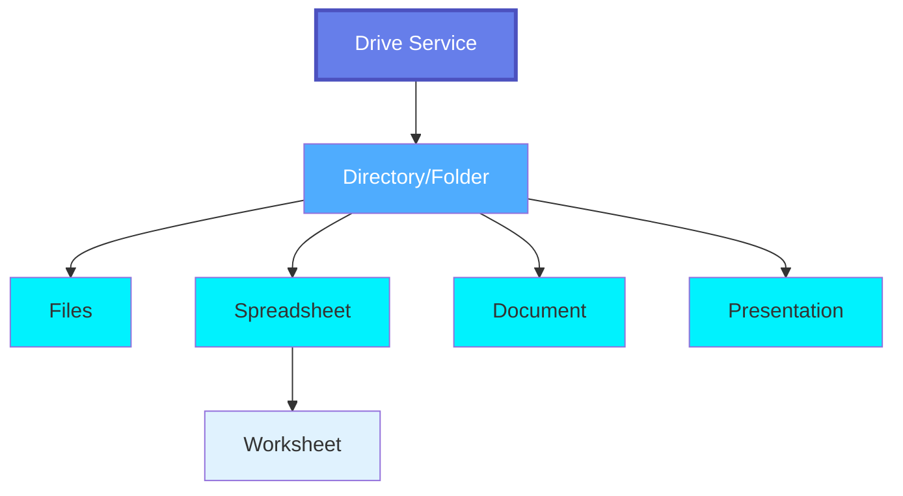
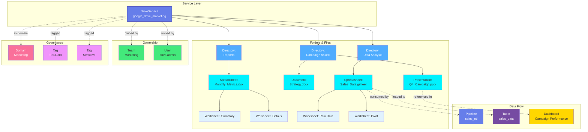

# Drive Service

**Cloud document management and file sharing platforms**

---

## Overview

The **DriveService** entity represents cloud-based document management and file sharing platforms like Google Drive, OneDrive, SharePoint, and Dropbox. Drive Services manage collaborative documents, spreadsheets, presentations, and files with sharing, versioning, and real-time collaboration features.

**Hierarchy**:



**Supported Drive Platforms**:

- **Google Drive** - Google Workspace cloud file storage and collaboration
- **Google Shared Drives** - Team drives with shared ownership
- **OneDrive** - Microsoft OneDrive personal and business cloud storage
- **OneDrive for Business** - Enterprise OneDrive with SharePoint integration
- **SharePoint** - Microsoft SharePoint document libraries and sites
- **Dropbox** - Dropbox cloud file storage and sharing
- **Dropbox Business** - Enterprise Dropbox with team folders
- **Box** - Box cloud content management
- **iCloud Drive** - Apple iCloud file storage

**Drive-Specific Features**:

- **Real-time Collaboration**: Multiple users editing simultaneously
- **Version History**: Track changes and restore previous versions
- **Sharing & Permissions**: Fine-grained access control
- **Comments & Discussions**: In-document collaboration
- **Native File Formats**: Google Docs, Sheets, Slides; Office 365 formats
- **File Conversion**: Convert between formats
- **Offline Access**: Sync for offline work
- **Third-party Integrations**: Apps and extensions

---

## Relationships

DriveService has comprehensive relationships with entities across the metadata platform:



---

## Schema Specifications

View the complete DriveService schema in your preferred format:

=== "JSON Schema"

    **Complete JSON Schema Definition**

    ```json
    {
      "$id": "https://open-metadata.org/schema/entity/services/driveService.json",
      "$schema": "http://json-schema.org/draft-07/schema#",
      "title": "DriveService",
      "description": "Drive service for cloud document management platforms.",
      "type": "object",

      "properties": {
        "id": {
          "description": "Unique identifier",
          "$ref": "../../type/basic.json#/definitions/uuid"
        },
        "name": {
          "description": "Service name",
          "$ref": "../../type/basic.json#/definitions/entityName"
        },
        "serviceType": {
          "description": "Type of drive service",
          "type": "string",
          "enum": [
            "GoogleDrive",
            "GoogleSharedDrive",
            "OneDrive",
            "OneDriveForBusiness",
            "SharePoint",
            "Dropbox",
            "DropboxBusiness",
            "Box",
            "iCloudDrive"
          ]
        },
        "description": {
          "description": "Service description",
          "$ref": "../../type/basic.json#/definitions/markdown"
        },
        "connection": {
          "description": "Connection configuration",
          "type": "object",
          "properties": {
            "type": {
              "type": "string",
              "enum": ["GoogleDrive", "OneDrive", "SharePoint", "Dropbox", "Box"]
            },
            "credentials": {
              "description": "OAuth2 or API credentials",
              "type": "object"
            },
            "organizationId": {
              "description": "Organization or tenant ID",
              "type": "string"
            },
            "rootPath": {
              "description": "Root folder path to index",
              "type": "string"
            }
          }
        },
        "directories": {
          "description": "Top-level directories in this drive",
          "type": "array",
          "items": {
            "$ref": "../../type/entityReference.json"
          }
        },
        "owner": {
          "description": "Owner of this service",
          "$ref": "../../type/entityReference.json"
        },
        "domain": {
          "description": "Domain this service belongs to",
          "$ref": "../../type/entityReference.json"
        },
        "tags": {
          "description": "Tags for this service",
          "type": "array",
          "items": {
            "$ref": "../../type/tagLabel.json"
          }
        }
      },
      "required": ["id", "name", "serviceType"],
      "additionalProperties": false
    }
    ```

=== "RDF (Turtle)"

    **RDF/OWL Ontology Representation**

    ```turtle
    @prefix om: <https://open-metadata.org/schema/> .
    @prefix om-drive: <https://open-metadata.org/schema/entity/services/> .
    @prefix rdf: <http://www.w3.org/1999/02/22-rdf-syntax-ns#> .
    @prefix rdfs: <http://www.w3.org/2000/01/rdf-schema#> .
    @prefix owl: <http://www.w3.org/2002/07/owl#> .
    @prefix xsd: <http://www.w3.org/2001/XMLSchema#> .

    # Drive Service Class
    om-drive:DriveService a owl:Class ;
        rdfs:label "Drive Service" ;
        rdfs:comment "Cloud document management and file sharing platform" ;
        rdfs:subClassOf om:Service ;
        rdfs:isDefinedBy om: .

    # Properties
    om-drive:serviceType a owl:DatatypeProperty ;
        rdfs:label "service type" ;
        rdfs:comment "Type of drive platform (GoogleDrive, OneDrive, etc.)" ;
        rdfs:domain om-drive:DriveService ;
        rdfs:range xsd:string .

    om-drive:hasDirectory a owl:ObjectProperty ;
        rdfs:label "has directory" ;
        rdfs:comment "Directories in this drive service" ;
        rdfs:domain om-drive:DriveService ;
        rdfs:range om-drive:Directory .

    om-drive:hasFile a owl:ObjectProperty ;
        rdfs:label "has file" ;
        rdfs:comment "Files in directories" ;
        rdfs:domain om-drive:Directory ;
        rdfs:range om-drive:File .

    om-drive:hasWorksheet a owl:ObjectProperty ;
        rdfs:label "has worksheet" ;
        rdfs:comment "Worksheets in a spreadsheet" ;
        rdfs:domain om-drive:Spreadsheet ;
        rdfs:range om-drive:Worksheet .

    # Directory Class
    om-drive:Directory a owl:Class ;
        rdfs:label "Directory" ;
        rdfs:comment "Folder or directory in drive service" ;
        rdfs:isDefinedBy om: .

    # File Classes
    om-drive:File a owl:Class ;
        rdfs:label "File" ;
        rdfs:comment "File in drive service" ;
        rdfs:isDefinedBy om: .

    om-drive:Spreadsheet a owl:Class ;
        rdfs:label "Spreadsheet" ;
        rdfs:comment "Spreadsheet file (Excel, Google Sheets)" ;
        rdfs:subClassOf om-drive:File ;
        rdfs:isDefinedBy om: .

    om-drive:Worksheet a owl:Class ;
        rdfs:label "Worksheet" ;
        rdfs:comment "Individual sheet/tab in a spreadsheet" ;
        rdfs:isDefinedBy om: .

    om-drive:Document a owl:Class ;
        rdfs:label "Document" ;
        rdfs:comment "Document file (Word, Google Docs, PDF)" ;
        rdfs:subClassOf om-drive:File ;
        rdfs:isDefinedBy om: .

    om-drive:Presentation a owl:Class ;
        rdfs:label "Presentation" ;
        rdfs:comment "Presentation file (PowerPoint, Google Slides)" ;
        rdfs:subClassOf om-drive:File ;
        rdfs:isDefinedBy om: .
    ```

=== "JSON-LD Context"

    **JSON-LD Context for Semantic Interoperability**

    ```json
    {
      "@context": {
        "@vocab": "https://open-metadata.org/schema/entity/services/",
        "om": "https://open-metadata.org/schema/",
        "xsd": "http://www.w3.org/2001/XMLSchema#",

        "DriveService": {
          "@id": "om:DriveService",
          "@type": "@id"
        },
        "serviceType": {
          "@id": "om:serviceType",
          "@type": "xsd:string"
        },
        "directories": {
          "@id": "om:hasDirectory",
          "@type": "@id",
          "@container": "@set"
        },
        "Directory": {
          "@id": "om:Directory",
          "@type": "@id"
        },
        "files": {
          "@id": "om:hasFile",
          "@type": "@id",
          "@container": "@set"
        },
        "Spreadsheet": {
          "@id": "om:Spreadsheet",
          "@type": "@id"
        },
        "worksheets": {
          "@id": "om:hasWorksheet",
          "@type": "@id",
          "@container": "@set"
        },
        "Worksheet": {
          "@id": "om:Worksheet",
          "@type": "@id"
        }
      }
    }
    ```

---

## Drive Service Types

### Google Drive

**Configuration**:

```yaml
serviceType: GoogleDrive
connection:
  type: GoogleDrive
  credentials:
    clientId: xxx
    clientSecret: xxx
    refreshToken: xxx
  organizationId: example.com
  rootPath: /Marketing
```

**Features**:
- Google Docs, Sheets, Slides native formats
- Shared Drives for team collaboration
- Real-time collaborative editing
- Version history and restore
- Google Workspace integration

### OneDrive / SharePoint

**Configuration**:

```yaml
serviceType: OneDriveForBusiness
connection:
  type: OneDrive
  credentials:
    tenantId: xxx
    clientId: xxx
    clientSecret: xxx
  organizationId: contoso.sharepoint.com
  rootPath: /sites/Marketing
```

**Features**:
- Office 365 integration
- SharePoint document libraries
- Teams integration
- Co-authoring in Office apps
- Compliance and retention policies

### Dropbox

**Configuration**:

```yaml
serviceType: DropboxBusiness
connection:
  type: Dropbox
  credentials:
    accessToken: xxx
  organizationId: example-team
  rootPath: /Marketing
```

**Features**:
- File sync and sharing
- Paper documents
- Team folders
- File requests
- Smart Sync

---

## File Types in Drive Services

### Spreadsheets

Spreadsheet files with multiple worksheets:

**Formats**:
- Google Sheets (.gsheet)
- Microsoft Excel (.xlsx, .xls)
- LibreOffice Calc (.ods)
- CSV files (.csv)

**Hierarchy**:
```
Spreadsheet
  └── Worksheet (Sheet1, Sheet2, etc.)
        └── Columns & Rows
              └── Cells
```

**Metadata**:
- Worksheet names and count
- Column headers
- Data types
- Formulas and calculations
- Named ranges
- Pivot tables

### Documents

Text documents and PDFs:

**Formats**:
- Google Docs (.gdoc)
- Microsoft Word (.docx, .doc)
- PDF (.pdf)
- Plain Text (.txt, .md)

### Presentations

Slide decks:

**Formats**:
- Google Slides (.gslide)
- Microsoft PowerPoint (.pptx, .ppt)
- PDF presentations

### Other Files

- Images (.jpg, .png, .gif)
- Videos (.mp4, .mov)
- Audio (.mp3, .wav)
- Archives (.zip, .tar.gz)

---

## Use Cases

### Business Analytics

Track spreadsheets used for analysis:

```json
{
  "service": "google-drive-finance",
  "directory": "Financial Analysis",
  "spreadsheet": "Q4_Revenue_Analysis.gsheet",
  "worksheets": [
    {"name": "Raw Data", "columns": 25, "rows": 5000},
    {"name": "Monthly Summary", "columns": 12, "rows": 12},
    {"name": "Charts", "columns": 5, "rows": 100}
  ],
  "lineage": [
    {"source": "salesforce.opportunities", "type": "imports_from"},
    {"target": "tableau.revenue_dashboard", "type": "used_by"}
  ]
}
```

### Document Management

Track important documents:

```json
{
  "service": "sharepoint-legal",
  "directory": "Contracts/2024",
  "documents": [
    {
      "name": "Vendor_Agreement_ACME.docx",
      "type": "Contract",
      "tags": ["Legal", "Confidential"],
      "owner": "legal-team",
      "lastModified": "2024-11-20"
    }
  ]
}
```

### Collaborative Data Prep

Track shared data files:

```json
{
  "service": "dropbox-data-team",
  "directory": "Data Exports",
  "files": [
    {
      "name": "customer_export_2024.csv",
      "size": "150MB",
      "format": "CSV",
      "schema": {
        "columns": ["id", "name", "email", "created_date"],
        "delimiter": ",",
        "encoding": "UTF-8"
      },
      "lineage": {
        "source": "crm.customers",
        "target": "pipeline.customer_enrichment"
      }
    }
  ]
}
```

---

## Custom Properties

This entity supports custom properties through the `extension` field.
Common custom properties include:

- **Data Classification**: Sensitivity level
- **Cost Center**: Billing allocation
- **Retention Period**: Data retention requirements
- **Application Owner**: Owning application/team

See [Custom Properties](../../metadata-specifications/custom-properties.md)
for details on defining and using custom properties.

---

## API Operations

### Create Drive Service

```http
POST /api/v1/services/driveServices
Content-Type: application/json

{
  "name": "google_drive_marketing",
  "serviceType": "GoogleDrive",
  "connection": {
    "type": "GoogleDrive",
    "credentials": {...},
    "organizationId": "example.com"
  }
}
```

### List Directories

```http
GET /api/v1/services/driveServices/{id}/directories
```

### Get Spreadsheet Metadata

```http
GET /api/v1/driveFiles/{id}/worksheets
```

---

## Related Documentation

- **[Directory](directory.md)** - Folders and directories in drive services
- **[Spreadsheet](spreadsheet.md)** - Spreadsheet files (Excel, Google Sheets)
- **[Worksheet](worksheet.md)** - Individual worksheets/tabs within spreadsheets
- **[File](file.md)** - Individual file metadata
- **[Storage Service](storage-service.md)** - Object storage (S3, GCS, Azure Blob)
- **[Container](container.md)** - Storage buckets
- **[Table](../databases/table.md)** - Tables loaded from spreadsheets
- **[Pipeline](../pipelines/pipeline.md)** - Pipelines processing drive files
