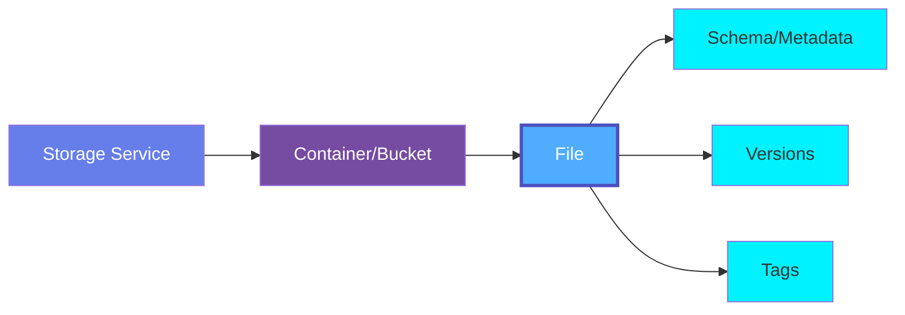

# File

A **File** represents an individual file stored in cloud storage systems (S3, GCS, Azure Blob), file shares (Google Drive, OneDrive), or data lakes. Files can contain structured, semi-structured, or unstructured data including documents, spreadsheets, images, videos, and raw data files.

## Overview

Files in OpenMetadata capture metadata about:

- **File Properties**: Name, path, size, format, modification dates
- **File Types**: CSV, JSON, Parquet, Avro, Images, Videos, Documents, Spreadsheets
- **Storage Location**: Bucket/container, full path, storage service
- **File Structure**: Schema for structured files (CSV, Parquet), metadata for documents
- **Access Information**: Permissions, ACLs, encryption status
- **File Relationships**: Part of datasets, referenced by pipelines, versioning

Files are essential for:
- Data lake organization and discovery
- Document management and collaboration
- Compliance and data governance
- Unstructured data analysis
- Machine learning dataset management

## Hierarchy



**Click on any node to learn more about that entity.**

## Relationships

Files have relationships with various entities in the metadata ecosystem:

```mermaid
graph TD
    subgraph File Structure
        A[File:<br/>customer_data.csv] --> B1[Schema:<br/>Columns]
        A --> B2[Format:<br/>CSV]
        A --> B3[Size:<br/>1.2 GB]
        A --> B4[Versions:<br/>v1, v2, v3]
    end

    subgraph Storage Location
        A -.->|stored in| C1[Container:<br/>data-lake]
        C1 -.->|in service| C2[StorageService:<br/>S3]
        A -.->|path| C3[Path:<br/>s3://bucket/path]
    end

    subgraph File Content
        A -.->|contains| D1[Column:<br/>customer_id]
        A -.->|contains| D2[Column:<br/>email]
        A -.->|contains| D3[Column:<br/>purchase_amount]
    end

    subgraph Data Processing
        A -.->|source for| E1[Pipeline:<br/>ETL Job]
        A -.->|loaded into| E2[Table:<br/>customers]
        A -.->|input for| E3[MLModel:<br/>Predictor]
    end

    subgraph Governance
        A -.->|owned by| F1[User:<br/>data.engineer]
        A -.->|tagged with| F2[Tag:<br/>PII]
        A -.->|in domain| F3[Domain:<br/>Customer Data]
        A -.->|mapped to| F4[GlossaryTerm:<br/>Customer]
    end

    subgraph Quality & Profiling
        A -.->|profiled by| G1[DataProfile]
        A -.->|tested by| G2[TestCase:<br/>Schema Check]
        A -.->|validated by| G3[TestCase:<br/>Format Check]
    end

    subgraph Access & Security
        A -.->|encrypted with| H1[Encryption:<br/>AES-256]
        A -.->|accessed by| H2[User:<br/>analyst]
        A -.->|permissions| H3[ACL]
    end

    style A fill:#4facfe,color:#fff,stroke:#4c51bf,stroke-width:3px
    style B1 fill:#00f2fe,color:#333
    style B2 fill:#00f2fe,color:#333
    style B3 fill:#00f2fe,color:#333
    style B4 fill:#00f2fe,color:#333
    style C1 fill:#764ba2,color:#fff
    style C2 fill:#667eea,color:#fff
    style C3 fill:#ffd700,color:#333
    style D1 fill:#00f2fe,color:#333
    style D2 fill:#00f2fe,color:#333
    style D3 fill:#00f2fe,color:#333
    style E1 fill:#667eea,color:#fff
    style E2 fill:#764ba2,color:#fff
    style E3 fill:#764ba2,color:#fff
    style F1 fill:#43e97b,color:#333
    style F2 fill:#fa709a,color:#fff
    style F3 fill:#f093fb,color:#333
    style F4 fill:#f093fb,color:#333
    style G1 fill:#ffd700,color:#333
    style G2 fill:#f5576c,color:#fff
    style G3 fill:#f5576c,color:#fff
    style H1 fill:#ffd700,color:#333
    style H2 fill:#43e97b,color:#333
    style H3 fill:#ffd700,color:#333

    click A "#file" "File"
    click C1 "./container/" "Container"
    click C2 "./storage-service/" "Storage Service"
    click D1 "../databases/column/" "Column"
    click E1 "../pipelines/pipeline/" "Pipeline"
    click E2 "../databases/table/" "Table"
    click E3 "../ml/mlmodel/" "ML Model"
    click F1 "../../teams-users/user/" "User"
    click F2 "../../governance/tag/" "Tag"
    click F3 "../../domains/domain/" "Domain"
    click F4 "../../governance/glossary-term/" "Glossary Term"
    click G1 "../../data-quality/data-profile/" "Data Profile"
    click G2 "../../data-quality/test-case/" "Test Case"
```



**Key Relationships:**

- **File Structure**: Schema, format, size, and versions
- **Storage Location**: Container, storage service, and full path
- **File Content**: Columns and data for structured files
- **Data Processing**: Pipelines, tables, and ML models using the file
- **Governance**: Ownership, tags, domain, and glossary mappings
- **Quality & Profiling**: Data profiles and test cases
- **Access & Security**: Encryption, user access, and permissions

## Schema Specifications

=== "JSON Schema"

    ```json
    {
      "$id": "https://open-metadata.org/schema/entity/data/file.json",
      "$schema": "http://json-schema.org/draft-07/schema#",
      "title": "File",
      "description": "A File represents an individual file in cloud storage or file shares.",
      "type": "object",
      "javaType": "org.openmetadata.schema.entity.data.File",
      "javaInterfaces": [
        "org.openmetadata.schema.EntityInterface"
      ],
      "definitions": {
        "fileType": {
          "description": "Type of file",
          "type": "string",
          "enum": [
            "CSV",
            "TSV",
            "JSON",
            "Parquet",
            "Avro",
            "ORC",
            "Excel",
            "PDF",
            "Image",
            "Video",
            "Audio",
            "Document",
            "Archive",
            "Other"
          ]
        },
        "compressionType": {
          "description": "Compression type",
          "type": "string",
          "enum": [
            "None",
            "Gzip",
            "Bzip2",
            "Snappy",
            "LZO",
            "Zstd"
          ]
        },
        "fileVersion": {
          "type": "object",
          "description": "A version of the file",
          "properties": {
            "versionId": {
              "description": "Version identifier",
              "type": "string"
            },
            "timestamp": {
              "description": "When this version was created",
              "$ref": "../../type/basic.json#/definitions/timestamp"
            },
            "size": {
              "description": "Size in bytes",
              "type": "number"
            },
            "modifiedBy": {
              "description": "User who modified this version",
              "type": "string"
            }
          }
        },
        "fileSchema": {
          "type": "object",
          "description": "Schema for structured files",
          "properties": {
            "columns": {
              "description": "Columns in the file",
              "type": "array",
              "items": {
                "$ref": "../databases/column.json"
              }
            },
            "delimiter": {
              "description": "Delimiter for CSV/TSV files",
              "type": "string"
            },
            "header": {
              "description": "Whether file has header row",
              "type": "boolean"
            },
            "encoding": {
              "description": "File encoding (UTF-8, ASCII, etc.)",
              "type": "string"
            }
          }
        }
      },
      "properties": {
        "id": {
          "description": "Unique identifier of the file",
          "$ref": "../../type/basic.json#/definitions/uuid"
        },
        "name": {
          "description": "Name of the file",
          "$ref": "../../type/basic.json#/definitions/entityName"
        },
        "fullyQualifiedName": {
          "description": "Fully qualified name of the file",
          "$ref": "../../type/basic.json#/definitions/fullyQualifiedEntityName"
        },
        "displayName": {
          "description": "Display name for the file",
          "type": "string"
        },
        "description": {
          "description": "Description of the file",
          "$ref": "../../type/basic.json#/definitions/markdown"
        },
        "fileType": {
          "$ref": "#/definitions/fileType"
        },
        "path": {
          "description": "Full path to the file (e.g., s3://bucket/path/file.csv)",
          "type": "string"
        },
        "size": {
          "description": "File size in bytes",
          "type": "number"
        },
        "compressionType": {
          "$ref": "#/definitions/compressionType"
        },
        "container": {
          "description": "Container/bucket where file is stored",
          "$ref": "../../type/entityReference.json"
        },
        "service": {
          "description": "Storage service where file is stored",
          "$ref": "../../type/entityReference.json"
        },
        "fileSchema": {
          "$ref": "#/definitions/fileSchema"
        },
        "versions": {
          "description": "File versions",
          "type": "array",
          "items": {
            "$ref": "#/definitions/fileVersion"
          }
        },
        "createdAt": {
          "description": "When the file was created",
          "$ref": "../../type/basic.json#/definitions/timestamp"
        },
        "modifiedAt": {
          "description": "When the file was last modified",
          "$ref": "../../type/basic.json#/definitions/timestamp"
        },
        "modifiedBy": {
          "description": "User who last modified the file",
          "type": "string"
        },
        "checksum": {
          "description": "Checksum/hash of the file (MD5, SHA256, etc.)",
          "type": "string"
        },
        "encryption": {
          "description": "Encryption information",
          "type": "object",
          "properties": {
            "encrypted": {
              "type": "boolean"
            },
            "algorithm": {
              "type": "string"
            }
          }
        },
        "owner": {
          "description": "Owner of this file",
          "$ref": "../../type/entityReference.json"
        },
        "tags": {
          "description": "Tags for this file",
          "type": "array",
          "items": {
            "$ref": "../../type/tagLabel.json"
          }
        },
        "version": {
          "description": "Metadata version of the entity",
          "$ref": "../../type/entityHistory.json#/definitions/entityVersion"
        },
        "updatedAt": {
          "description": "Last update time corresponding to the new version of the entity in Unix epoch time milliseconds",
          "$ref": "../../type/basic.json#/definitions/timestamp"
        },
        "updatedBy": {
          "description": "User who made the update",
          "type": "string"
        },
        "href": {
          "description": "Link to this file resource",
          "$ref": "../../type/basic.json#/definitions/href"
        },
        "changeDescription": {
          "description": "Change that led to this version of the entity",
          "$ref": "../../type/entityHistory.json#/definitions/changeDescription"
        },
        "deleted": {
          "description": "When true indicates the entity has been soft deleted",
          "type": "boolean",
          "default": false
        },
        "domain": {
          "description": "Domain the file belongs to",
          "$ref": "../../type/entityReference.json"
        }
      },
      "required": [
        "id",
        "name",
        "fileType",
        "path",
        "container"
      ],
      "additionalProperties": false
    }
    ```

=== "RDF (Turtle)"

    ```turtle
    @prefix om: <https://open-metadata.org/schema/> .
    @prefix om-entity: <https://open-metadata.org/schema/entity/> .
    @prefix om-file: <https://open-metadata.org/schema/entity/data/> .
    @prefix rdf: <http://www.w3.org/1999/02/22-rdf-syntax-ns#> .
    @prefix rdfs: <http://www.w3.org/2000/01/rdf-schema#> .
    @prefix owl: <http://www.w3.org/2002/07/owl#> .
    @prefix xsd: <http://www.w3.org/2001/XMLSchema#> .
    @prefix dcterms: <http://purl.org/dc/terms/> .
    @prefix skos: <http://www.w3.org/2004/02/skos/core#> .
    @prefix dcat: <http://www.w3.org/ns/dcat#> .

    # File Class Definition
    om-file:File a owl:Class ;
        rdfs:label "File" ;
        rdfs:comment "An individual file in cloud storage or file shares" ;
        rdfs:subClassOf dcat:Distribution ;
        rdfs:subClassOf om-entity:Entity ;
        rdfs:isDefinedBy om: .

    # File Type Class
    om-file:FileType a owl:Class ;
        rdfs:label "File Type" ;
        rdfs:comment "Type of file (CSV, JSON, Parquet, etc.)" ;
        rdfs:isDefinedBy om: .

    # Compression Type Class
    om-file:CompressionType a owl:Class ;
        rdfs:label "Compression Type" ;
        rdfs:comment "Type of compression applied to the file" ;
        rdfs:isDefinedBy om: .

    # Properties
    om-file:fileType a owl:ObjectProperty ;
        rdfs:label "file type" ;
        rdfs:comment "Type of the file" ;
        rdfs:domain om-file:File ;
        rdfs:range om-file:FileType .

    om-file:path a owl:DatatypeProperty ;
        rdfs:label "path" ;
        rdfs:comment "Full path to the file" ;
        rdfs:domain om-file:File ;
        rdfs:range xsd:anyURI ;
        rdfs:subPropertyOf dcat:accessURL .

    om-file:size a owl:DatatypeProperty ;
        rdfs:label "size" ;
        rdfs:comment "File size in bytes" ;
        rdfs:domain om-file:File ;
        rdfs:range xsd:integer ;
        rdfs:subPropertyOf dcat:byteSize .

    om-file:compressionType a owl:ObjectProperty ;
        rdfs:label "compression type" ;
        rdfs:comment "Type of compression" ;
        rdfs:domain om-file:File ;
        rdfs:range om-file:CompressionType .

    om-file:storedIn a owl:ObjectProperty ;
        rdfs:label "stored in" ;
        rdfs:comment "Container/bucket where file is stored" ;
        rdfs:domain om-file:File ;
        rdfs:range om-entity:Container .

    om-file:hasService a owl:ObjectProperty ;
        rdfs:label "has service" ;
        rdfs:comment "Storage service" ;
        rdfs:domain om-file:File ;
        rdfs:range om-entity:StorageService .

    om-file:hasSchema a owl:ObjectProperty ;
        rdfs:label "has schema" ;
        rdfs:comment "Schema for structured files" ;
        rdfs:domain om-file:File .

    om-file:checksum a owl:DatatypeProperty ;
        rdfs:label "checksum" ;
        rdfs:comment "Checksum/hash of the file" ;
        rdfs:domain om-file:File ;
        rdfs:range xsd:string .

    om-file:encrypted a owl:DatatypeProperty ;
        rdfs:label "encrypted" ;
        rdfs:comment "Whether the file is encrypted" ;
        rdfs:domain om-file:File ;
        rdfs:range xsd:boolean .

    om-file:modifiedAt a owl:DatatypeProperty ;
        rdfs:label "modified at" ;
        rdfs:comment "When file was last modified" ;
        rdfs:domain om-file:File ;
        rdfs:range xsd:dateTime ;
        rdfs:subPropertyOf dcterms:modified .

    om-file:modifiedBy a owl:DatatypeProperty ;
        rdfs:label "modified by" ;
        rdfs:comment "User who last modified the file" ;
        rdfs:domain om-file:File ;
        rdfs:range xsd:string .

    # File Type Individuals
    om-file:CSV a om-file:FileType ;
        rdfs:label "CSV" ;
        skos:definition "Comma-separated values file" .

    om-file:JSON a om-file:FileType ;
        rdfs:label "JSON" ;
        skos:definition "JavaScript Object Notation file" .

    om-file:Parquet a om-file:FileType ;
        rdfs:label "Parquet" ;
        skos:definition "Apache Parquet columnar storage file" .

    om-file:Avro a om-file:FileType ;
        rdfs:label "Avro" ;
        skos:definition "Apache Avro binary data file" .

    om-file:Excel a om-file:FileType ;
        rdfs:label "Excel" ;
        skos:definition "Microsoft Excel spreadsheet" .

    om-file:PDF a om-file:FileType ;
        rdfs:label "PDF" ;
        skos:definition "Portable Document Format file" .

    om-file:Image a om-file:FileType ;
        rdfs:label "Image" ;
        skos:definition "Image file (PNG, JPG, etc.)" .
    ```

=== "JSON-LD Context"

    ```json
    {
      "@context": {
        "@vocab": "https://open-metadata.org/schema/entity/data/",
        "rdf": "http://www.w3.org/1999/02/22-rdf-syntax-ns#",
        "rdfs": "http://www.w3.org/2000/01/rdf-schema#",
        "owl": "http://www.w3.org/2002/07/owl#",
        "xsd": "http://www.w3.org/2001/XMLSchema#",
        "dcterms": "http://purl.org/dc/terms/",
        "dcat": "http://www.w3.org/ns/dcat#",
        "skos": "http://www.w3.org/2004/02/skos/core#",
        "om": "https://open-metadata.org/schema/",

        "File": {
          "@id": "om:File",
          "@type": "@id"
        },
        "id": {
          "@id": "om:id",
          "@type": "xsd:string"
        },
        "name": {
          "@id": "om:name",
          "@type": "xsd:string"
        },
        "fullyQualifiedName": {
          "@id": "om:fullyQualifiedName",
          "@type": "xsd:string"
        },
        "description": {
          "@id": "dcterms:description",
          "@type": "xsd:string"
        },
        "fileType": {
          "@id": "om:fileType",
          "@type": "@id"
        },
        "path": {
          "@id": "dcat:accessURL",
          "@type": "xsd:anyURI"
        },
        "size": {
          "@id": "dcat:byteSize",
          "@type": "xsd:integer"
        },
        "compressionType": {
          "@id": "om:compressionType",
          "@type": "@id"
        },
        "container": {
          "@id": "om:storedIn",
          "@type": "@id"
        },
        "service": {
          "@id": "om:hasService",
          "@type": "@id"
        },
        "fileSchema": {
          "@id": "om:hasSchema",
          "@type": "@id"
        },
        "checksum": {
          "@id": "om:checksum",
          "@type": "xsd:string"
        },
        "modifiedAt": {
          "@id": "dcterms:modified",
          "@type": "xsd:dateTime"
        },
        "modifiedBy": {
          "@id": "om:modifiedBy",
          "@type": "xsd:string"
        },
        "owner": {
          "@id": "om:owner",
          "@type": "@id"
        },
        "tags": {
          "@id": "om:tags",
          "@type": "@id",
          "@container": "@set"
        },
        "domain": {
          "@id": "om:domain",
          "@type": "@id"
        }
      }
    }
    ```

## Use Cases

### CSV File in S3

```json
{
  "id": "123e4567-e89b-12d3-a456-426614174000",
  "name": "customer_data_2024.csv",
  "fullyQualifiedName": "s3_prod.data-lake.raw/customer_data_2024.csv",
  "displayName": "Customer Data 2024",
  "description": "Daily customer data export for 2024",
  "fileType": "CSV",
  "path": "s3://data-lake/raw/customer_data_2024.csv",
  "size": 1258291200,
  "compressionType": "Gzip",
  "container": {
    "type": "container",
    "name": "data-lake"
  },
  "service": {
    "type": "storageService",
    "name": "S3Production"
  },
  "fileSchema": {
    "delimiter": ",",
    "header": true,
    "encoding": "UTF-8",
    "columns": [
      {
        "name": "customer_id",
        "dataType": "BIGINT",
        "ordinalPosition": 1
      },
      {
        "name": "email",
        "dataType": "VARCHAR",
        "ordinalPosition": 2
      },
      {
        "name": "purchase_amount",
        "dataType": "DECIMAL",
        "precision": 10,
        "scale": 2,
        "ordinalPosition": 3
      }
    ]
  },
  "checksum": "md5:abc123def456...",
  "encryption": {
    "encrypted": true,
    "algorithm": "AES-256"
  },
  "createdAt": 1705320000000,
  "modifiedAt": 1705406400000,
  "modifiedBy": "etl-service",
  "owner": {
    "type": "team",
    "name": "DataEngineering"
  },
  "tags": [
    {
      "tagFQN": "PII.Email"
    }
  ],
  "domain": {
    "type": "domain",
    "name": "CustomerData"
  }
}
```

### Parquet File in GCS

```json
{
  "id": "456e7890-e89b-12d3-a456-426614174111",
  "name": "sales_2024_q1.parquet",
  "fullyQualifiedName": "gcs_prod.analytics-bucket.processed/sales_2024_q1.parquet",
  "fileType": "Parquet",
  "path": "gs://analytics-bucket/processed/sales_2024_q1.parquet",
  "size": 524288000,
  "compressionType": "Snappy",
  "container": {
    "type": "container",
    "name": "analytics-bucket"
  },
  "service": {
    "type": "storageService",
    "name": "GCSProduction"
  },
  "checksum": "sha256:xyz789abc123...",
  "encryption": {
    "encrypted": true,
    "algorithm": "Google-managed"
  },
  "versions": [
    {
      "versionId": "v3",
      "timestamp": 1705406400000,
      "size": 524288000,
      "modifiedBy": "spark-job"
    },
    {
      "versionId": "v2",
      "timestamp": 1705320000000,
      "size": 520000000,
      "modifiedBy": "spark-job"
    }
  ],
  "owner": {
    "type": "user",
    "name": "data.engineer"
  }
}
```

### Excel Spreadsheet in Google Drive

```json
{
  "id": "789e0123-e89b-12d3-a456-426614174222",
  "name": "Sales_Report_Q4.xlsx",
  "fullyQualifiedName": "google_drive.shared_drive.reports/Sales_Report_Q4.xlsx",
  "displayName": "Q4 Sales Report",
  "description": "Quarterly sales analysis and forecasting",
  "fileType": "Excel",
  "path": "https://drive.google.com/file/d/abc123xyz789/view",
  "size": 15728640,
  "compressionType": "None",
  "container": {
    "type": "container",
    "name": "Shared Drive - Reports"
  },
  "service": {
    "type": "storageService",
    "name": "GoogleDrive"
  },
  "modifiedAt": 1705492800000,
  "modifiedBy": "analyst@company.com",
  "owner": {
    "type": "team",
    "name": "SalesAnalytics"
  },
  "tags": [
    {
      "tagFQN": "Confidential"
    },
    {
      "tagFQN": "QuarterlyReport"
    }
  ]
}
```

### PDF Document

```json
{
  "id": "abc12345-e89b-12d3-a456-426614174333",
  "name": "Data_Governance_Policy_v2.pdf",
  "fullyQualifiedName": "sharepoint.documents.policies/Data_Governance_Policy_v2.pdf",
  "displayName": "Data Governance Policy v2.0",
  "description": "Company-wide data governance policy and procedures",
  "fileType": "PDF",
  "path": "https://company.sharepoint.com/documents/policies/Data_Governance_Policy_v2.pdf",
  "size": 2097152,
  "compressionType": "None",
  "container": {
    "type": "container",
    "name": "Policies"
  },
  "service": {
    "type": "storageService",
    "name": "SharePoint"
  },
  "createdAt": 1705320000000,
  "modifiedAt": 1705579200000,
  "modifiedBy": "compliance.officer@company.com",
  "owner": {
    "type": "user",
    "name": "compliance.officer"
  },
  "tags": [
    {
      "tagFQN": "Governance.Policy"
    },
    {
      "tagFQN": "Official"
    }
  ],
  "domain": {
    "type": "domain",
    "name": "Governance"
  }
}
```

### Image File for ML Training

```json
{
  "id": "def45678-e89b-12d3-a456-426614174444",
  "name": "product_image_12345.jpg",
  "fullyQualifiedName": "s3_ml.ml-datasets.product-images/product_image_12345.jpg",
  "fileType": "Image",
  "path": "s3://ml-datasets/product-images/product_image_12345.jpg",
  "size": 2048576,
  "compressionType": "None",
  "container": {
    "type": "container",
    "name": "ml-datasets"
  },
  "service": {
    "type": "storageService",
    "name": "S3ML"
  },
  "checksum": "sha256:image123hash456...",
  "encryption": {
    "encrypted": true,
    "algorithm": "AES-256"
  },
  "owner": {
    "type": "team",
    "name": "MLEngineering"
  },
  "tags": [
    {
      "tagFQN": "ML.TrainingData"
    },
    {
      "tagFQN": "ProductImage"
    }
  ]
}
```

## File Types

| Type | Extension | Description | Use Case |
|------|-----------|-------------|----------|
| **CSV** | .csv | Comma-separated values | Data exports, logs |
| **TSV** | .tsv | Tab-separated values | Data exports |
| **JSON** | .json | JavaScript Object Notation | API data, configs |
| **Parquet** | .parquet | Columnar storage | Data lakes, analytics |
| **Avro** | .avro | Binary data serialization | Data pipelines |
| **ORC** | .orc | Optimized Row Columnar | Big data analytics |
| **Excel** | .xlsx, .xls | Spreadsheets | Business reports |
| **PDF** | .pdf | Documents | Reports, contracts |
| **Image** | .jpg, .png | Images | ML training, assets |
| **Video** | .mp4, .mov | Videos | Media assets |
| **Audio** | .mp3, .wav | Audio | Voice data |

## Best Practices

### 1. Consistent Naming Conventions
Use descriptive, consistent file names:

```
customer_data_2024_01_15.csv
sales_report_q4_2023.xlsx
ml_model_v2_training_data.parquet
```

### 2. Include Metadata
Add comprehensive metadata for discoverability:

```json
{
  "description": "Daily customer transaction data including purchases and returns",
  "tags": ["PII", "Financial", "DailyExport"],
  "owner": "DataEngineering",
  "domain": "CustomerData"
}
```

### 3. Track Versions
Maintain version history for important files:

```json
{
  "versions": [
    {"versionId": "v3", "timestamp": 1705406400000},
    {"versionId": "v2", "timestamp": 1705320000000},
    {"versionId": "v1", "timestamp": 1705233600000}
  ]
}
```

### 4. Encrypt Sensitive Data
Always encrypt files containing sensitive information:

```json
{
  "encryption": {
    "encrypted": true,
    "algorithm": "AES-256"
  },
  "tags": [{"tagFQN": "PII.Sensitive"}]
}
```

### 5. Document Schema
For structured files, document the schema:

```json
{
  "fileSchema": {
    "columns": [...],
    "delimiter": ",",
    "header": true,
    "encoding": "UTF-8"
  }
}
```

## Custom Properties

This entity supports custom properties through the `extension` field.
Common custom properties include:

- **Data Classification**: Sensitivity level
- **Cost Center**: Billing allocation
- **Retention Period**: Data retention requirements
- **Application Owner**: Owning application/team

See [Custom Properties](../../metadata-specifications/custom-properties.md)
for details on defining and using custom properties.

---

## Related Entities

- **[Container](./container.md)**: Bucket or folder containing the file
- **[Storage Service](./storage-service.md)**: Storage service (S3, GCS, etc.)
- **[Column](../databases/column.md)**: Columns in structured files
- **[Pipeline](../pipelines/pipeline.md)**: Pipelines processing the file
- **[Table](../databases/table.md)**: Tables loaded from files
- **[MLModel](../ml/mlmodel.md)**: ML models trained on file data
- **[User](../../teams-users/user.md)**: File owners and modifiers
- **[Tag](../../governance/tag.md)**: File classifications
- **[Domain](../../domains/domain.md)**: Domain organization
