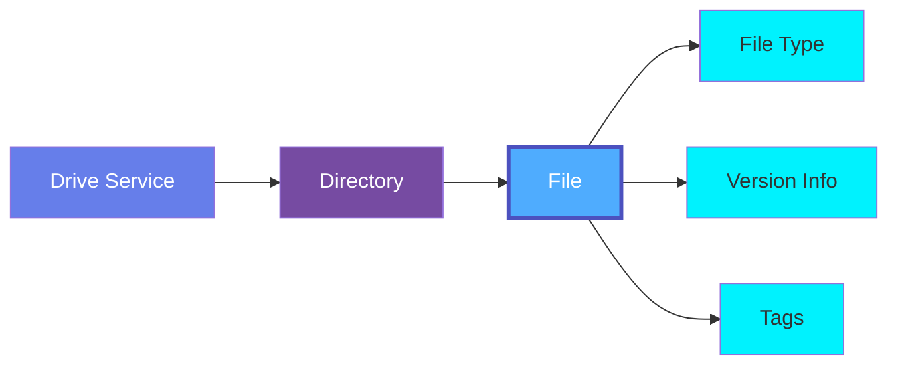

# File

A **File** represents a document or resource stored in a Drive Service such as Google Drive, OneDrive, or other file sharing platforms. Files can be documents, spreadsheets, presentations, images, videos, PDFs, and other content types.

## Overview

Files in OpenMetadata capture metadata about:

- **File Properties**: Name, path, size, MIME type, file extension
- **File Types**: Documents, Spreadsheets, Presentations, Images, Videos, Audio, PDF, CSV, Code, Data
- **Storage Location**: Drive service, parent directory, full path
- **Access Information**: Sharing status, web view links, download links
- **Version Information**: File version, modification timestamps
- **File Metadata**: Checksum, creation/modification times, last modified by user

Files are essential for:
- Document management and collaboration
- File sharing and access control
- Compliance and data governance
- Knowledge management
- Content organization and discovery

## Hierarchy



**Click on any node to learn more about that entity.**

## Relationships

Files have relationships with various entities in the metadata ecosystem:

```mermaid
graph TD
    subgraph File Properties
        A[File:<br/>Q4_Report.xlsx] --> B1[FileType:<br/>Spreadsheet]
        A --> B2[Size:<br/>15 MB]
        A --> B3[MimeType:<br/>application/xlsx]
        A --> B4[Version:<br/>v2.1]
    end

    subgraph Storage Location
        A -.->|stored in| C1[Directory:<br/>Reports/Q4]
        C1 -.->|in service| C2[DriveService:<br/>Google Drive]
        A -.->|path| C3[Path:<br/>/shared/reports/Q4_Report.xlsx]
    end

    subgraph Access & Sharing
        A -.->|web view| D1[WebViewLink]
        A -.->|download| D2[DownloadLink]
        A -.->|shared| D3[IsShared:<br/>true]
    end

    subgraph Governance
        A -.->|owned by| E1[User:<br/>analyst]
        A -.->|tagged with| E2[Tag:<br/>Confidential]
        A -.->|in domain| E3[Domain:<br/>Finance]
        A -.->|followed by| E4[Followers]
    end

    subgraph Metadata & Version
        A -.->|created at| F1[CreatedTime]
        A -.->|modified at| F2[ModifiedTime]
        A -.->|modified by| F3[User:<br/>editor]
        A -.->|checksum| F4[Hash:<br/>abc123...]
    end

    subgraph Lifecycle
        A -.->|status| G1[EntityStatus]
        A -.->|lifecycle| G2[LifeCycle]
        A -.->|certification| G3[Certification]
        A -.->|usage| G4[UsageSummary]
    end

    style A fill:#4facfe,color:#fff,stroke:#4c51bf,stroke-width:3px
    style B1 fill:#00f2fe,color:#333
    style B2 fill:#00f2fe,color:#333
    style B3 fill:#00f2fe,color:#333
    style B4 fill:#00f2fe,color:#333
    style C1 fill:#764ba2,color:#fff
    style C2 fill:#667eea,color:#fff
    style C3 fill:#ffd700,color:#333
    style D1 fill:#00f2fe,color:#333
    style D2 fill:#00f2fe,color:#333
    style D3 fill:#00f2fe,color:#333
    style E1 fill:#43e97b,color:#333
    style E2 fill:#fa709a,color:#fff
    style E3 fill:#f093fb,color:#333
    style E4 fill:#43e97b,color:#333
    style F1 fill:#ffd700,color:#333
    style F2 fill:#ffd700,color:#333
    style F3 fill:#43e97b,color:#333
    style F4 fill:#ffd700,color:#333
    style G1 fill:#f5576c,color:#fff
    style G2 fill:#f5576c,color:#fff
    style G3 fill:#f5576c,color:#fff
    style G4 fill:#ffd700,color:#333

    click A "#file" "File"
    click C1 "./directory/" "Directory"
    click C2 "./drive-service/" "Drive Service"
    click E1 "../../teams-users/user/" "User"
    click E2 "../../governance/tag/" "Tag"
    click E3 "../../domains/domain/" "Domain"
```



**Key Relationships:**

- **File Properties**: File type, MIME type, size, and version information
- **Storage Location**: Directory, drive service, and full path
- **Access & Sharing**: Web view links, download links, and sharing status
- **Governance**: Ownership, tags, domains, and followers
- **Metadata & Version**: Creation/modification timestamps, modified by user, checksum
- **Lifecycle**: Entity status, lifecycle stages, certification, and usage tracking

## Schema Specifications

=== "JSON Schema"

    ```json
    {
      "$id": "https://open-metadata.org/schema/entity/data/file.json",
      "$schema": "http://json-schema.org/draft-07/schema#",
      "title": "File",
      "$comment": "@om-entity-type",
      "description": "This schema defines the File entity. A File is a document or resource stored in a Drive Service.",
      "type": "object",
      "javaType": "org.openmetadata.schema.entity.data.File",
      "javaInterfaces": [
        "org.openmetadata.schema.EntityInterface"
      ],
      "definitions": {
        "fileType": {
          "javaType": "org.openmetadata.schema.type.FileType",
          "description": "Type of file based on content",
          "type": "string",
          "enum": [
            "Document",
            "Spreadsheet",
            "Presentation",
            "Image",
            "Video",
            "Audio",
            "PDF",
            "Archive",
            "Code",
            "Data",
            "CSV",
            "Text",
            "Other"
          ]
        }
      },
      "properties": {
        "id": {
          "description": "Unique identifier of this file instance.",
          "$ref": "../../type/basic.json#/definitions/uuid"
        },
        "name": {
          "description": "Name of the file.",
          "$ref": "../../type/basic.json#/definitions/entityName"
        },
        "fullyQualifiedName": {
          "description": "Fully qualified name of the file.",
          "$ref": "../../type/basic.json#/definitions/fullyQualifiedEntityName"
        },
        "displayName": {
          "description": "Display Name that identifies this file.",
          "type": "string"
        },
        "description": {
          "description": "Description of the file.",
          "$ref": "../../type/basic.json#/definitions/markdown"
        },
        "service": {
          "description": "Link to the drive service",
          "$ref": "../../type/entityReference.json"
        },
        "serviceType": {
          "description": "Type of drive service",
          "$ref": "../../entity/services/driveService.json#/definitions/driveServiceType"
        },
        "directory": {
          "description": "Parent directory containing this file",
          "$ref": "../../type/entityReference.json"
        },
        "fileType": {
          "$ref": "#/definitions/fileType"
        },
        "mimeType": {
          "description": "MIME type of the file",
          "type": "string"
        },
        "fileExtension": {
          "description": "File extension",
          "type": "string"
        },
        "path": {
          "description": "Full path to the file",
          "type": "string"
        },
        "size": {
          "description": "File size in bytes",
          "type": "integer"
        },
        "checksum": {
          "description": "File checksum/hash",
          "type": "string"
        },
        "webViewLink": {
          "description": "Web link to view the file",
          "type": "string",
          "format": "uri"
        },
        "downloadLink": {
          "description": "Direct download link",
          "type": "string",
          "format": "uri"
        },
        "isShared": {
          "description": "Whether this file is shared",
          "type": "boolean",
          "default": false
        },
        "fileVersion": {
          "description": "File version information",
          "type": "string"
        },
        "createdTime": {
          "description": "File creation timestamp",
          "$ref": "../../type/basic.json#/definitions/timestamp"
        },
        "modifiedTime": {
          "description": "Last modification timestamp",
          "$ref": "../../type/basic.json#/definitions/timestamp"
        },
        "lastModifiedBy": {
          "description": "User who last modified the file",
          "$ref": "../../type/entityReference.json"
        },
        "sourceUrl": {
          "description": "Link to this file in the source system.",
          "$ref": "../../type/basic.json#/definitions/sourceUrl"
        },
        "href": {
          "description": "Link to the resource corresponding to this file.",
          "$ref": "../../type/basic.json#/definitions/href"
        },
        "owners": {
          "description": "Owners of this file.",
          "$ref": "../../type/entityReferenceList.json"
        },
        "followers": {
          "description": "Followers of this entity.",
          "$ref": "../../type/entityReferenceList.json"
        },
        "tags": {
          "description": "Tags associated with this file.",
          "type": "array",
          "items": {
            "$ref": "../../type/tagLabel.json"
          },
          "default": null
        },
        "version": {
          "description": "Metadata version of the entity.",
          "$ref": "../../type/entityHistory.json#/definitions/entityVersion"
        },
        "updatedAt": {
          "description": "Last update time corresponding to the new version of the entity in Unix epoch time milliseconds.",
          "$ref": "../../type/basic.json#/definitions/timestamp"
        },
        "updatedBy": {
          "description": "User who made the update.",
          "type": "string"
        },
        "impersonatedBy": {
          "description": "Bot user that performed the action on behalf of the actual user.",
          "$ref": "../../type/basic.json#/definitions/impersonatedBy"
        },
        "changeDescription": {
          "description": "Change that lead to this version of the entity.",
          "$ref": "../../type/entityHistory.json#/definitions/changeDescription"
        },
        "incrementalChangeDescription": {
          "description": "Change that lead to this version of the entity.",
          "$ref": "../../type/entityHistory.json#/definitions/changeDescription"
        },
        "deleted": {
          "description": "When `true` indicates the entity has been soft deleted.",
          "type": "boolean",
          "default": false
        },
        "domains": {
          "description": "Domains the File belongs to.",
          "$ref": "../../type/entityReferenceList.json"
        },
        "dataProducts": {
          "description": "List of data products this entity is part of.",
          "$ref": "../../type/entityReferenceList.json"
        },
        "lifeCycle": {
          "description": "Life Cycle of the entity",
          "$ref": "../../type/lifeCycle.json"
        },
        "sourceHash": {
          "description": "Source hash of the entity",
          "type": "string",
          "minLength": 1,
          "maxLength": 32
        },
        "extension": {
          "description": "Entity extension data with custom attributes added to the entity.",
          "$ref": "../../type/basic.json#/definitions/entityExtension"
        },
        "votes": {
          "description": "Votes on the entity.",
          "$ref": "../../type/votes.json"
        },
        "certification": {
          "$ref": "../../type/assetCertification.json"
        },
        "usageSummary": {
          "description": "Latest usage information for this file.",
          "$ref": "../../type/usageDetails.json",
          "default": null
        },
        "entityStatus": {
          "description": "Status of the File.",
          "$ref": "../../type/status.json"
        }
      },
      "required": ["id", "name", "service"],
      "additionalProperties": false
    }
    ```

=== "RDF (Turtle)"

    ```turtle
    @prefix om: <https://open-metadata.org/schema/> .
    @prefix om-entity: <https://open-metadata.org/schema/entity/> .
    @prefix om-file: <https://open-metadata.org/schema/entity/data/> .
    @prefix rdf: <http://www.w3.org/1999/02/22-rdf-syntax-ns#> .
    @prefix rdfs: <http://www.w3.org/2000/01/rdf-schema#> .
    @prefix owl: <http://www.w3.org/2002/07/owl#> .
    @prefix xsd: <http://www.w3.org/2001/XMLSchema#> .
    @prefix dcterms: <http://purl.org/dc/terms/> .
    @prefix skos: <http://www.w3.org/2004/02/skos/core#> .
    @prefix dcat: <http://www.w3.org/ns/dcat#> .

    # File Class Definition
    om-file:File a owl:Class ;
        rdfs:label "File" ;
        rdfs:comment "A document or resource stored in a Drive Service" ;
        rdfs:subClassOf dcat:Distribution ;
        rdfs:subClassOf om-entity:Entity ;
        rdfs:isDefinedBy om: .

    # File Type Class
    om-file:FileType a owl:Class ;
        rdfs:label "File Type" ;
        rdfs:comment "Type of file based on content (Document, Spreadsheet, etc.)" ;
        rdfs:isDefinedBy om: .

    # Properties
    om-file:fileType a owl:ObjectProperty ;
        rdfs:label "file type" ;
        rdfs:comment "Type of the file" ;
        rdfs:domain om-file:File ;
        rdfs:range om-file:FileType .

    om-file:mimeType a owl:DatatypeProperty ;
        rdfs:label "MIME type" ;
        rdfs:comment "MIME type of the file" ;
        rdfs:domain om-file:File ;
        rdfs:range xsd:string ;
        rdfs:subPropertyOf dcat:mediaType .

    om-file:fileExtension a owl:DatatypeProperty ;
        rdfs:label "file extension" ;
        rdfs:comment "File extension" ;
        rdfs:domain om-file:File ;
        rdfs:range xsd:string .

    om-file:path a owl:DatatypeProperty ;
        rdfs:label "path" ;
        rdfs:comment "Full path to the file" ;
        rdfs:domain om-file:File ;
        rdfs:range xsd:string .

    om-file:size a owl:DatatypeProperty ;
        rdfs:label "size" ;
        rdfs:comment "File size in bytes" ;
        rdfs:domain om-file:File ;
        rdfs:range xsd:integer ;
        rdfs:subPropertyOf dcat:byteSize .

    om-file:checksum a owl:DatatypeProperty ;
        rdfs:label "checksum" ;
        rdfs:comment "File checksum/hash" ;
        rdfs:domain om-file:File ;
        rdfs:range xsd:string .

    om-file:webViewLink a owl:DatatypeProperty ;
        rdfs:label "web view link" ;
        rdfs:comment "Web link to view the file" ;
        rdfs:domain om-file:File ;
        rdfs:range xsd:anyURI ;
        rdfs:subPropertyOf dcat:accessURL .

    om-file:downloadLink a owl:DatatypeProperty ;
        rdfs:label "download link" ;
        rdfs:comment "Direct download link" ;
        rdfs:domain om-file:File ;
        rdfs:range xsd:anyURI ;
        rdfs:subPropertyOf dcat:downloadURL .

    om-file:isShared a owl:DatatypeProperty ;
        rdfs:label "is shared" ;
        rdfs:comment "Whether this file is shared" ;
        rdfs:domain om-file:File ;
        rdfs:range xsd:boolean .

    om-file:fileVersion a owl:DatatypeProperty ;
        rdfs:label "file version" ;
        rdfs:comment "File version information" ;
        rdfs:domain om-file:File ;
        rdfs:range xsd:string .

    om-file:hasService a owl:ObjectProperty ;
        rdfs:label "has service" ;
        rdfs:comment "Drive service storing the file" ;
        rdfs:domain om-file:File ;
        rdfs:range om-entity:DriveService .

    om-file:hasDirectory a owl:ObjectProperty ;
        rdfs:label "has directory" ;
        rdfs:comment "Parent directory containing the file" ;
        rdfs:domain om-file:File ;
        rdfs:range om-entity:Directory .

    om-file:createdTime a owl:DatatypeProperty ;
        rdfs:label "created time" ;
        rdfs:comment "File creation timestamp" ;
        rdfs:domain om-file:File ;
        rdfs:range xsd:dateTime ;
        rdfs:subPropertyOf dcterms:created .

    om-file:modifiedTime a owl:DatatypeProperty ;
        rdfs:label "modified time" ;
        rdfs:comment "Last modification timestamp" ;
        rdfs:domain om-file:File ;
        rdfs:range xsd:dateTime ;
        rdfs:subPropertyOf dcterms:modified .

    om-file:lastModifiedBy a owl:ObjectProperty ;
        rdfs:label "last modified by" ;
        rdfs:comment "User who last modified the file" ;
        rdfs:domain om-file:File ;
        rdfs:range om-entity:User .

    # File Type Individuals
    om-file:Document a om-file:FileType ;
        rdfs:label "Document" ;
        skos:definition "Text document file" .

    om-file:Spreadsheet a om-file:FileType ;
        rdfs:label "Spreadsheet" ;
        skos:definition "Spreadsheet file" .

    om-file:Presentation a om-file:FileType ;
        rdfs:label "Presentation" ;
        skos:definition "Presentation file" .

    om-file:Image a om-file:FileType ;
        rdfs:label "Image" ;
        skos:definition "Image file" .

    om-file:Video a om-file:FileType ;
        rdfs:label "Video" ;
        skos:definition "Video file" .

    om-file:Audio a om-file:FileType ;
        rdfs:label "Audio" ;
        skos:definition "Audio file" .

    om-file:PDF a om-file:FileType ;
        rdfs:label "PDF" ;
        skos:definition "Portable Document Format file" .

    om-file:CSV a om-file:FileType ;
        rdfs:label "CSV" ;
        skos:definition "Comma-separated values file" .

    om-file:Code a om-file:FileType ;
        rdfs:label "Code" ;
        skos:definition "Source code file" .

    om-file:Data a om-file:FileType ;
        rdfs:label "Data" ;
        skos:definition "Data file" .
    ```

=== "JSON-LD Context"

    ```json
    {
      "@context": {
        "@vocab": "https://open-metadata.org/schema/entity/data/",
        "rdf": "http://www.w3.org/1999/02/22-rdf-syntax-ns#",
        "rdfs": "http://www.w3.org/2000/01/rdf-schema#",
        "owl": "http://www.w3.org/2002/07/owl#",
        "xsd": "http://www.w3.org/2001/XMLSchema#",
        "dcterms": "http://purl.org/dc/terms/",
        "dcat": "http://www.w3.org/ns/dcat#",
        "skos": "http://www.w3.org/2004/02/skos/core#",
        "om": "https://open-metadata.org/schema/",

        "File": {
          "@id": "om:File",
          "@type": "@id"
        },
        "id": {
          "@id": "om:id",
          "@type": "xsd:string"
        },
        "name": {
          "@id": "om:name",
          "@type": "xsd:string"
        },
        "fullyQualifiedName": {
          "@id": "om:fullyQualifiedName",
          "@type": "xsd:string"
        },
        "displayName": {
          "@id": "om:displayName",
          "@type": "xsd:string"
        },
        "description": {
          "@id": "dcterms:description",
          "@type": "xsd:string"
        },
        "service": {
          "@id": "om:hasService",
          "@type": "@id"
        },
        "serviceType": {
          "@id": "om:serviceType",
          "@type": "xsd:string"
        },
        "directory": {
          "@id": "om:hasDirectory",
          "@type": "@id"
        },
        "fileType": {
          "@id": "om:fileType",
          "@type": "@id"
        },
        "mimeType": {
          "@id": "dcat:mediaType",
          "@type": "xsd:string"
        },
        "fileExtension": {
          "@id": "om:fileExtension",
          "@type": "xsd:string"
        },
        "path": {
          "@id": "om:path",
          "@type": "xsd:string"
        },
        "size": {
          "@id": "dcat:byteSize",
          "@type": "xsd:integer"
        },
        "checksum": {
          "@id": "om:checksum",
          "@type": "xsd:string"
        },
        "webViewLink": {
          "@id": "dcat:accessURL",
          "@type": "xsd:anyURI"
        },
        "downloadLink": {
          "@id": "dcat:downloadURL",
          "@type": "xsd:anyURI"
        },
        "isShared": {
          "@id": "om:isShared",
          "@type": "xsd:boolean"
        },
        "fileVersion": {
          "@id": "om:fileVersion",
          "@type": "xsd:string"
        },
        "createdTime": {
          "@id": "dcterms:created",
          "@type": "xsd:dateTime"
        },
        "modifiedTime": {
          "@id": "dcterms:modified",
          "@type": "xsd:dateTime"
        },
        "lastModifiedBy": {
          "@id": "om:lastModifiedBy",
          "@type": "@id"
        },
        "sourceUrl": {
          "@id": "om:sourceUrl",
          "@type": "xsd:anyURI"
        },
        "href": {
          "@id": "om:href",
          "@type": "xsd:anyURI"
        },
        "owners": {
          "@id": "om:owners",
          "@type": "@id",
          "@container": "@set"
        },
        "followers": {
          "@id": "om:followers",
          "@type": "@id",
          "@container": "@set"
        },
        "tags": {
          "@id": "om:tags",
          "@type": "@id",
          "@container": "@set"
        },
        "domains": {
          "@id": "om:domains",
          "@type": "@id",
          "@container": "@set"
        },
        "dataProducts": {
          "@id": "om:dataProducts",
          "@type": "@id",
          "@container": "@set"
        },
        "lifeCycle": {
          "@id": "om:lifeCycle",
          "@type": "@id"
        },
        "certification": {
          "@id": "om:certification",
          "@type": "@id"
        },
        "usageSummary": {
          "@id": "om:usageSummary",
          "@type": "@id"
        },
        "entityStatus": {
          "@id": "om:entityStatus",
          "@type": "xsd:string"
        }
      }
    }
    ```

## Use Cases

### Spreadsheet in Google Drive

```json
{
  "id": "123e4567-e89b-12d3-a456-426614174000",
  "name": "Q4_Sales_Report.xlsx",
  "fullyQualifiedName": "google_drive.Finance/Reports/Q4_Sales_Report.xlsx",
  "displayName": "Q4 Sales Report",
  "description": "Quarterly sales report for Q4 2024",
  "service": {
    "id": "abc-123",
    "type": "driveService",
    "name": "GoogleDrive"
  },
  "serviceType": "GoogleDrive",
  "directory": {
    "id": "dir-456",
    "type": "directory",
    "name": "Finance/Reports"
  },
  "fileType": "Spreadsheet",
  "mimeType": "application/vnd.openxmlformats-officedocument.spreadsheetml.sheet",
  "fileExtension": "xlsx",
  "path": "/Finance/Reports/Q4_Sales_Report.xlsx",
  "size": 15728640,
  "checksum": "md5:abc123def456...",
  "webViewLink": "https://docs.google.com/spreadsheets/d/abc123/edit",
  "downloadLink": "https://docs.google.com/spreadsheets/d/abc123/export",
  "isShared": true,
  "fileVersion": "v2.1",
  "createdTime": 1705320000000,
  "modifiedTime": 1705406400000,
  "lastModifiedBy": {
    "id": "user-789",
    "type": "user",
    "name": "finance.analyst"
  },
  "owners": [
    {
      "id": "team-456",
      "type": "team",
      "name": "Finance"
    }
  ],
  "tags": [
    {
      "tagFQN": "Confidential"
    },
    {
      "tagFQN": "QuarterlyReport"
    }
  ],
  "domains": [
    {
      "id": "domain-123",
      "type": "domain",
      "name": "Finance"
    }
  ]
}
```

### Document in OneDrive

```json
{
  "id": "456e7890-e89b-12d3-a456-426614174111",
  "name": "Product_Requirements.docx",
  "fullyQualifiedName": "onedrive.Engineering/Product/Product_Requirements.docx",
  "displayName": "Product Requirements Document",
  "description": "Detailed requirements for the new product launch",
  "service": {
    "id": "onedrive-001",
    "type": "driveService",
    "name": "OneDrive"
  },
  "serviceType": "OneDrive",
  "directory": {
    "id": "dir-789",
    "type": "directory",
    "name": "Engineering/Product"
  },
  "fileType": "Document",
  "mimeType": "application/vnd.openxmlformats-officedocument.wordprocessingml.document",
  "fileExtension": "docx",
  "path": "/Engineering/Product/Product_Requirements.docx",
  "size": 2097152,
  "checksum": "sha256:xyz789abc123...",
  "webViewLink": "https://onedrive.live.com/view.aspx?id=xyz789",
  "downloadLink": "https://onedrive.live.com/download?id=xyz789",
  "isShared": false,
  "fileVersion": "3.0",
  "createdTime": 1705233600000,
  "modifiedTime": 1705492800000,
  "lastModifiedBy": {
    "id": "user-456",
    "type": "user",
    "name": "product.manager"
  },
  "owners": [
    {
      "id": "user-456",
      "type": "user",
      "name": "product.manager"
    }
  ],
  "tags": [
    {
      "tagFQN": "ProductManagement"
    }
  ]
}
```

### Presentation in Google Drive

```json
{
  "id": "789e0123-e89b-12d3-a456-426614174222",
  "name": "Company_Overview_2024.pptx",
  "fullyQualifiedName": "google_drive.Marketing/Presentations/Company_Overview_2024.pptx",
  "displayName": "Company Overview 2024",
  "description": "Annual company overview presentation for stakeholders",
  "service": {
    "id": "gdrive-123",
    "type": "driveService",
    "name": "GoogleDrive"
  },
  "serviceType": "GoogleDrive",
  "directory": {
    "id": "dir-marketing",
    "type": "directory",
    "name": "Marketing/Presentations"
  },
  "fileType": "Presentation",
  "mimeType": "application/vnd.openxmlformats-officedocument.presentationml.presentation",
  "fileExtension": "pptx",
  "path": "/Marketing/Presentations/Company_Overview_2024.pptx",
  "size": 8388608,
  "webViewLink": "https://docs.google.com/presentation/d/xyz789/edit",
  "downloadLink": "https://docs.google.com/presentation/d/xyz789/export",
  "isShared": true,
  "fileVersion": "1.5",
  "createdTime": 1705233600000,
  "modifiedTime": 1705492800000,
  "lastModifiedBy": {
    "id": "user-marketing",
    "type": "user",
    "name": "marketing.lead"
  },
  "owners": [
    {
      "id": "team-marketing",
      "type": "team",
      "name": "Marketing"
    }
  ],
  "followers": [
    {
      "id": "user-ceo",
      "type": "user",
      "name": "ceo"
    }
  ],
  "tags": [
    {
      "tagFQN": "Public"
    },
    {
      "tagFQN": "AnnualReport"
    }
  ]
}
```

### PDF Document in SharePoint

```json
{
  "id": "abc12345-e89b-12d3-a456-426614174333",
  "name": "Data_Governance_Policy_v2.pdf",
  "fullyQualifiedName": "sharepoint.Governance/Policies/Data_Governance_Policy_v2.pdf",
  "displayName": "Data Governance Policy v2.0",
  "description": "Company-wide data governance policy and procedures",
  "service": {
    "id": "sharepoint-001",
    "type": "driveService",
    "name": "SharePoint"
  },
  "serviceType": "SharePoint",
  "directory": {
    "id": "dir-policies",
    "type": "directory",
    "name": "Governance/Policies"
  },
  "fileType": "PDF",
  "mimeType": "application/pdf",
  "fileExtension": "pdf",
  "path": "/Governance/Policies/Data_Governance_Policy_v2.pdf",
  "size": 2097152,
  "checksum": "sha256:policy123hash456...",
  "webViewLink": "https://company.sharepoint.com/sites/governance/Data_Governance_Policy_v2.pdf",
  "downloadLink": "https://company.sharepoint.com/sites/governance/_layouts/download.aspx?SourceUrl=Data_Governance_Policy_v2.pdf",
  "isShared": true,
  "fileVersion": "2.0",
  "createdTime": 1705320000000,
  "modifiedTime": 1705579200000,
  "lastModifiedBy": {
    "id": "user-compliance",
    "type": "user",
    "name": "compliance.officer"
  },
  "owners": [
    {
      "id": "user-compliance",
      "type": "user",
      "name": "compliance.officer"
    }
  ],
  "tags": [
    {
      "tagFQN": "Governance.Policy"
    },
    {
      "tagFQN": "Official"
    }
  ],
  "domains": [
    {
      "id": "domain-governance",
      "type": "domain",
      "name": "Governance"
    }
  ],
  "certification": {
    "tagLabel": "Certified"
  }
}
```

### CSV Data File in Google Drive

```json
{
  "id": "def45678-e89b-12d3-a456-426614174444",
  "name": "customer_export_2024.csv",
  "fullyQualifiedName": "google_drive.Data/Exports/customer_export_2024.csv",
  "displayName": "Customer Data Export 2024",
  "description": "Customer data export for analysis",
  "service": {
    "id": "gdrive-data",
    "type": "driveService",
    "name": "GoogleDrive"
  },
  "serviceType": "GoogleDrive",
  "directory": {
    "id": "dir-exports",
    "type": "directory",
    "name": "Data/Exports"
  },
  "fileType": "CSV",
  "mimeType": "text/csv",
  "fileExtension": "csv",
  "path": "/Data/Exports/customer_export_2024.csv",
  "size": 5242880,
  "checksum": "md5:csv123hash456...",
  "webViewLink": "https://drive.google.com/file/d/csv789/view",
  "downloadLink": "https://drive.google.com/uc?export=download&id=csv789",
  "isShared": false,
  "fileVersion": "1.0",
  "createdTime": 1705492800000,
  "modifiedTime": 1705492800000,
  "lastModifiedBy": {
    "id": "user-data-eng",
    "type": "user",
    "name": "data.engineer"
  },
  "owners": [
    {
      "id": "team-data",
      "type": "team",
      "name": "DataEngineering"
    }
  ],
  "tags": [
    {
      "tagFQN": "PII.Sensitive"
    },
    {
      "tagFQN": "CustomerData"
    }
  ],
  "domains": [
    {
      "id": "domain-customer",
      "type": "domain",
      "name": "CustomerData"
    }
  ]
}
```

## File Types

| Type | Extension | Description | Use Case |
|------|-----------|-------------|----------|
| **Document** | .doc, .docx, .txt | Text documents | Requirements, reports, documentation |
| **Spreadsheet** | .xlsx, .xls, .gsheet | Spreadsheets | Data analysis, financial reports |
| **Presentation** | .pptx, .ppt, .gslides | Presentations | Slides, pitches, overviews |
| **Image** | .jpg, .png, .gif | Images | Graphics, photos, diagrams |
| **Video** | .mp4, .mov, .avi | Videos | Training videos, recordings |
| **Audio** | .mp3, .wav, .m4a | Audio files | Podcasts, voice recordings |
| **PDF** | .pdf | Portable documents | Reports, contracts, policies |
| **Archive** | .zip, .tar, .rar | Compressed archives | Backups, file collections |
| **Code** | .py, .js, .java | Source code | Scripts, programs |
| **Data** | .dat, .bin | Data files | Binary data, datasets |
| **CSV** | .csv | Comma-separated values | Data exports, tabular data |
| **Text** | .txt, .md | Plain text | Notes, markdown files |
| **Other** | various | Other file types | Miscellaneous files |

## Best Practices

### 1. Consistent Naming Conventions
Use descriptive, consistent file names:

```
Q4_Sales_Report_2024.xlsx
Product_Requirements_v2.docx
Company_Overview_2024.pptx
```

### 2. Include Metadata
Add comprehensive metadata for discoverability:

```json
{
  "displayName": "Q4 Sales Report 2024",
  "description": "Quarterly sales analysis and forecasting for Q4 2024",
  "tags": [{"tagFQN": "Confidential"}, {"tagFQN": "QuarterlyReport"}],
  "owners": [{"type": "team", "name": "Finance"}],
  "domains": [{"type": "domain", "name": "Finance"}]
}
```

### 3. Track File Versions
Maintain version information for important documents:

```json
{
  "fileVersion": "v2.1",
  "createdTime": 1705320000000,
  "modifiedTime": 1705406400000,
  "lastModifiedBy": {
    "type": "user",
    "name": "finance.analyst"
  }
}
```

### 4. Manage Sharing and Access
Control file sharing appropriately:

```json
{
  "isShared": true,
  "webViewLink": "https://docs.google.com/spreadsheets/d/abc123/edit",
  "downloadLink": "https://docs.google.com/spreadsheets/d/abc123/export",
  "tags": [{"tagFQN": "Confidential"}]
}
```

### 5. Use Proper File Types
Classify files correctly for better organization:

```json
{
  "fileType": "Spreadsheet",
  "mimeType": "application/vnd.openxmlformats-officedocument.spreadsheetml.sheet",
  "fileExtension": "xlsx"
}
```

### 6. Organize with Directories
Use proper directory structures:

```json
{
  "directory": {
    "type": "directory",
    "name": "Finance/Reports/Quarterly"
  },
  "path": "/Finance/Reports/Quarterly/Q4_Sales_Report.xlsx"
}
```

## Custom Properties

This entity supports custom properties through the `extension` field.
Common custom properties include:

- **Document Classification**: Sensitivity level, compliance category
- **Review Cycle**: Review frequency and next review date
- **Approval Status**: Document approval workflow status
- **Related Projects**: Associated projects or initiatives

See [Custom Properties](../../metadata-specifications/custom-properties.md)
for details on defining and using custom properties.

---

## Related Entities

- **[Drive Service](./drive-service.md)**: Service hosting the file (Google Drive, OneDrive, SharePoint)
- **[Directory](./directory.md)**: Parent directory containing the file
- **[User](../../teams-users/user.md)**: File owners, modifiers, and followers
- **[Team](../../teams-users/team.md)**: Teams owning or collaborating on files
- **[Tag](../../governance/tag.md)**: File classifications and labels
- **[Domain](../../domains/domain.md)**: Domain organization
- **[Data Product](../../data-products/data-product.md)**: Data products including the file
- **[Glossary Term](../../governance/glossary-term.md)**: Business terms associated with the file
