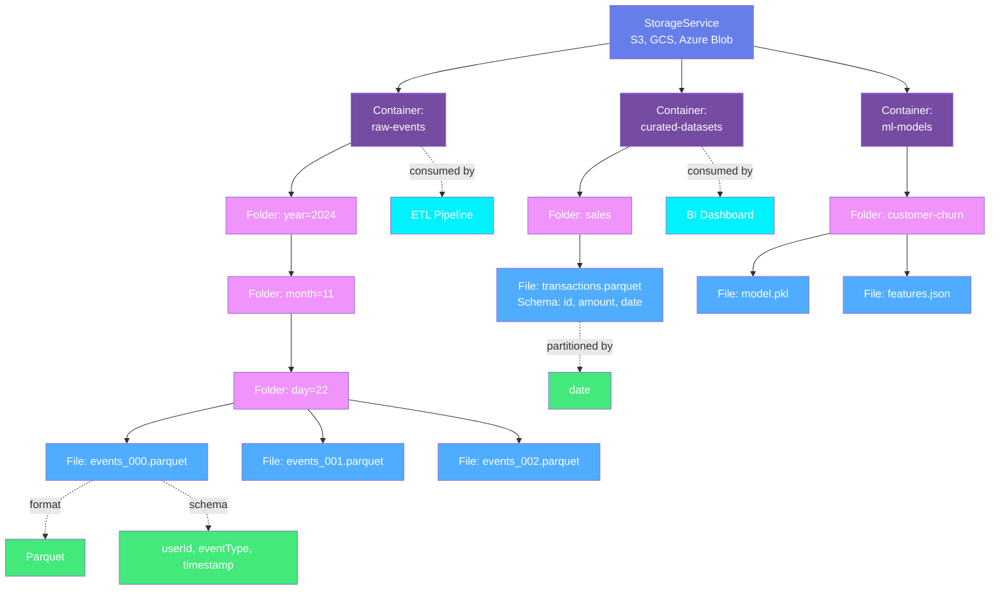
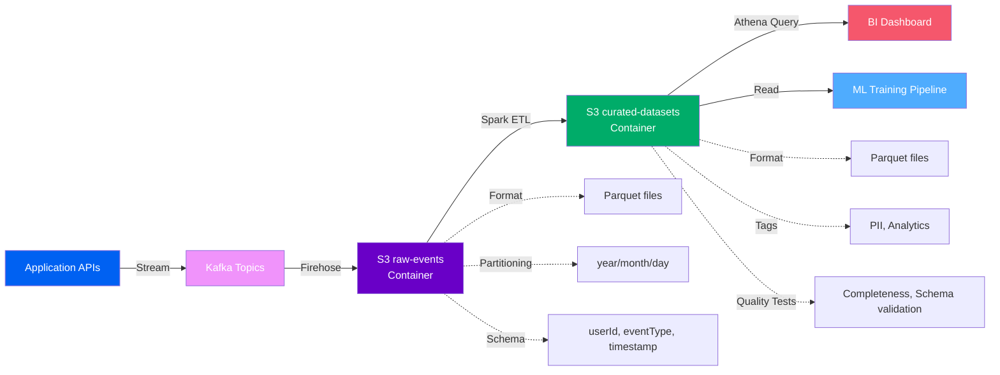
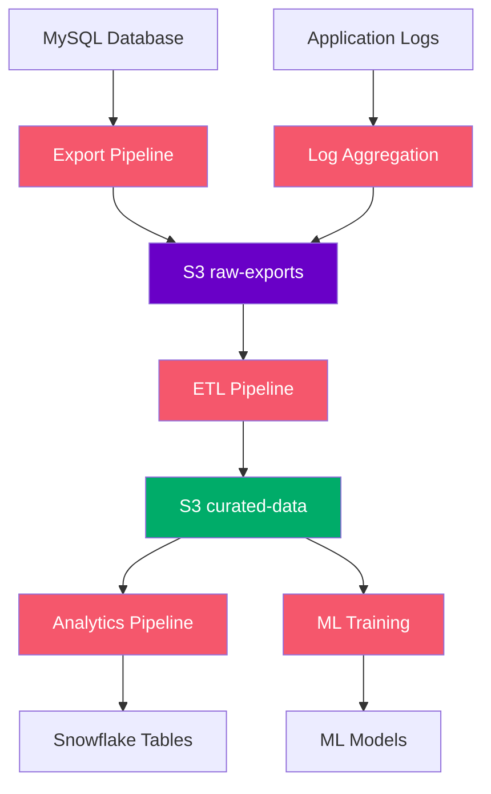
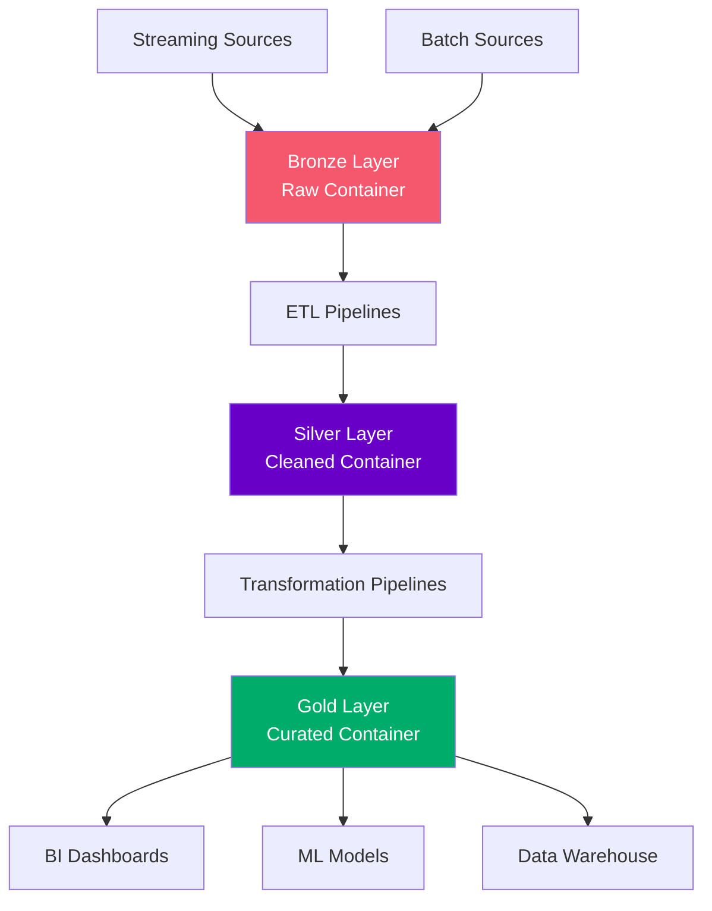

# Storage Assets

**Object storage, file systems, and cloud document services**

Storage assets represent two distinct types of storage systems:

1. **Storage Services**: Object storage (S3, GCS, Azure Blob) and distributed file systems (HDFS, NFS) for data lakes and large-scale data storage
2. **Drive Services**: Cloud document management platforms (Google Drive, OneDrive, SharePoint) for collaborative documents, spreadsheets, and files

Both types organize data hierarchically but serve different purposes.

---

## Hierarchy Overview



---

## Why This Hierarchy?

### Storage Service
**Purpose**: Represents the cloud storage platform or account

A Storage Service is the platform that hosts object storage containers and buckets. It contains configuration for connecting to the storage provider and discovering containers.

**Examples**:

- `s3-data-lake` - AWS S3 for data lake
- `azure-blob-analytics` - Azure Blob Storage for analytics
- `gcs-archive` - Google Cloud Storage for archival
- `minio-local` - MinIO for local object storage
- `hdfs-production` - HDFS cluster for big data processing

**Why needed**: Organizations use multiple storage platforms across cloud providers (AWS S3, Azure Blob, GCS) and have multiple accounts or regions for different purposes. The service level groups containers by platform and account, making it easy to manage connections and understand storage organization.

**Supported Platforms**:

- **Object Storage**: AWS S3, Azure Blob Storage, Azure Data Lake Storage (ADLS), Google Cloud Storage, MinIO, Alibaba Cloud OSS, IBM Cloud Object Storage
- **Distributed File Systems**: HDFS, NFS, Ceph

**Note**: Cloud document platforms (Google Drive, OneDrive, SharePoint) are modeled separately as [Drive Services](drive-service.md).

[**View Storage Service Specification →**](storage-service.md){ .md-button }

---

### Container
**Purpose**: Represents a bucket or container holding files and folders

A Container (called a "bucket" in S3, "container" in Azure Blob, "bucket" in GCS) is a top-level namespace that holds objects organized in a hierarchical folder structure.

**Examples**:

- `raw-events` - Raw event data from applications
- `curated-datasets` - Cleaned and processed datasets
- `ml-models` - Machine learning model artifacts
- `data-warehouse-staging` - Staging area for warehouse loads
- `logs-archive` - Historical log files
- `backup-snapshots` - Database backups and snapshots

**Key Metadata**:

- **Structure**: Folder hierarchy and file organization
- **File Types**: Parquet, CSV, JSON, Avro, images, videos, etc.
- **Schema**: Detected schema for structured files (Parquet, Avro)
- **Size**: Total storage size and object count
- **Partitioning**: Date-based or custom partitioning schemes
- **Lifecycle Policies**: Retention, archival, deletion rules
- **Access Control**: Permissions and encryption settings
- **Lineage**: Source → Container → Processing pipelines
- **Tags**: Department, sensitivity, compliance classifications

**Why needed**: Containers are the primary organizational unit in object storage. Tracking them enables:
- Understanding data lake organization and structure
- Schema discovery for structured file formats
- Impact analysis (which pipelines read from this container?)
- Data governance (PII detection, compliance)
- Cost optimization (storage usage patterns)
- Data quality monitoring

[**View Container Specification →**](container.md){ .md-button }

---

## Drive Service
**Purpose**: Cloud document management and file sharing platforms

Drive Services represent cloud-based document platforms like Google Drive, OneDrive, and SharePoint. Unlike object storage (S3, GCS), Drive Services are designed for collaborative documents, spreadsheets, and presentations with features like real-time editing, version history, and sharing.

**Examples**:

- `google-drive-marketing` - Google Drive for marketing team
- `onedrive-finance` - OneDrive for finance documents
- `sharepoint-hr` - SharePoint for HR document libraries
- `dropbox-engineering` - Dropbox for engineering team

**Key Metadata**:

- **Directories/Folders**: Top-level folders and nested structure
- **Files**: Documents, Spreadsheets, Presentations
- **Spreadsheets**: Excel/Google Sheets with multiple worksheets
- **Worksheets**: Individual sheets/tabs in spreadsheets with schemas
- **Sharing & Permissions**: Access control and collaboration
- **Version History**: Track changes and revisions
- **Lineage**: Spreadsheet → Data Pipeline → Table
- **Tags**: Department, sensitivity, compliance

**Hierarchy**:

```
Drive Service (Google Drive, OneDrive, SharePoint)
  └── Directory/Folder
        ├── Spreadsheet
        │     └── Worksheet (Sheet1, Sheet2, etc.)
        ├── Document (Word, Google Docs, PDF)
        ├── Presentation (PowerPoint, Slides)
        └── Other Files (CSV, Images, etc.)
```

**Why needed**: Many organizations use spreadsheets in Google Drive or SharePoint as data sources for analytics. Tracking these enables:
- **Lineage**: Track which dashboards and pipelines consume spreadsheet data
- **Schema Discovery**: Understand worksheet structure and columns
- **Data Governance**: Tag PII in collaborative documents
- **Impact Analysis**: Know which teams use which shared files

**Drive Service Entities**:

[**Drive Service →**](drive-service.md){ .md-button }
[**Directory →**](directory.md){ .md-button }
[**Spreadsheet →**](spreadsheet.md){ .md-button }
[**Worksheet →**](worksheet.md){ .md-button }

---

## File Organization Patterns

Storage containers typically organize files in hierarchical folder structures:

### Date-Partitioned Events
```
raw-events/
├── year=2024/
│   ├── month=01/
│   │   ├── day=01/
│   │   │   ├── events_000.parquet
│   │   │   ├── events_001.parquet
│   │   ├── day=02/
│   ├── month=02/
```

### Domain-Based Organization
```
data-lake/
├── sales/
│   ├── transactions/
│   ├── customers/
├── marketing/
│   ├── campaigns/
│   ├── analytics/
├── operations/
```

### Processing Stage Organization
```
analytics/
├── raw/
│   ├── source_system_1/
│   ├── source_system_2/
├── staging/
│   ├── cleaned_data/
├── curated/
│   ├── aggregated_metrics/
```

---

## Common Patterns

### Pattern 1: S3 Data Lake
```
S3 Service → raw-events Container → year=2024/month=11/day=22/events.parquet
                                   → File Format: Parquet
                                   → Schema: userId, eventType, timestamp
                                   → Partitioning: Date-based (year/month/day)
```

Event data organized by date with automatic schema detection.

### Pattern 2: Azure Blob Analytics Storage
```
Azure Blob Service → curated-datasets Container → sales/
                                                 → marketing/
                                                 → operations/
                                                → File Format: CSV, Parquet
                                                → Lifecycle: Archive after 90 days
```

Departmental data organization with lifecycle management.

### Pattern 3: GCS ML Artifacts
```
GCS Service → ml-models Container → customer-churn/
                                  │   ├── model.pkl
                                  │   ├── features.json
                                  │   └── metrics.json
                                  → fraud-detection/
                                  → recommendation-engine/
```

ML model artifacts organized by model name with metadata.

---

## Real-World Example

Here's how a data platform team uses object storage for their data lake:



**Flow**:
1. **Ingestion**: Application events stream to Kafka, then land in S3 `raw-events` container
2. **Raw Storage**: Events stored as Parquet files, partitioned by date
3. **Schema Detection**: Automatic schema inference from Parquet metadata
4. **Processing**: Spark ETL reads from raw, writes to `curated-datasets` container
5. **Consumption**: BI tools query curated data with Athena, ML pipelines read for training
6. **Governance**: PII tags applied, quality tests validate schema and completeness

**Benefits**:

- **Lineage**: Trace data from application → Kafka → S3 → ETL → Curated → Analytics
- **Schema Management**: Automatic schema detection for Parquet/Avro files
- **Impact Analysis**: Know which ETL jobs and BI tools depend on container data
- **Cost Optimization**: Track storage usage, apply lifecycle policies
- **Data Quality**: Monitor schema drift, validate data completeness

---

## Storage Lineage

Storage containers create lineage connections across data pipelines:



**Source → Raw Storage → Processing → Curated Storage → Consumption**

---

## File Format Support

OpenMetadata detects schemas and metadata from various file formats:

### Structured Formats (Schema Detection)
- **Parquet**: Columnar format with embedded schema
- **Avro**: Row-based format with schema
- **ORC**: Optimized columnar format
- **Delta Lake**: ACID transactions on Parquet
- **Iceberg**: Table format for big data

### Semi-Structured Formats
- **JSON**: Nested data structures
- **JSONL/NDJSON**: Line-delimited JSON
- **CSV**: Tabular data with headers
- **TSV**: Tab-separated values
- **XML**: Hierarchical markup

### Unstructured Formats
- **Images**: PNG, JPEG, TIFF
- **Videos**: MP4, AVI, MOV
- **Audio**: MP3, WAV, FLAC
- **Documents**: PDF, DOCX, TXT
- **Archives**: ZIP, TAR, GZIP

**Schema Inference**: For structured formats (Parquet, Avro, ORC), OpenMetadata automatically extracts:
- Column names and data types
- Nested structures
- Partitioning schemes
- Statistics (row counts, null counts)

---

## Partitioning Strategies

Storage containers often use partitioning for performance and organization:

### Time-Based Partitioning
```
s3://events/year=2024/month=11/day=22/hour=14/data.parquet
```
- **Use Case**: Event data, logs, time-series
- **Benefits**: Efficient date range queries, lifecycle management
- **Format**: Hive-style partitioning (key=value)

### Geography-Based Partitioning
```
s3://sales/region=us-east/state=ny/sales.parquet
s3://sales/region=eu-west/country=uk/sales.parquet
```
- **Use Case**: Distributed operations, compliance (data residency)
- **Benefits**: Regional queries, GDPR compliance

### Entity-Based Partitioning
```
s3://data-lake/entity=customers/version=v2/customers.parquet
s3://data-lake/entity=orders/version=v2/orders.parquet
```
- **Use Case**: Data warehouse staging, entity organization
- **Benefits**: Clear data organization, version management

---

## Storage Security and Governance

Track important security and compliance metadata:

### Access Control
- **IAM Policies**: Who can read/write to containers
- **Bucket Policies**: Resource-based permissions
- **Encryption**: At-rest (SSE-S3, SSE-KMS) and in-transit (TLS)
- **Versioning**: Object version history

### Data Classification
- **PII Detection**: Automatically tag sensitive data
- **Compliance Tags**: GDPR, HIPAA, PCI-DSS classifications
- **Data Retention**: Lifecycle policies for deletion and archival
- **Access Logs**: Track who accessed which objects

### Cost Management
- **Storage Class**: Standard, Infrequent Access, Glacier, Archive
- **Lifecycle Transitions**: Automatic tiering based on age
- **Storage Analytics**: Usage patterns and optimization opportunities

---

## Container Types

Different container configurations for different use cases:

### Data Lake Raw Zone
```json
{
  "name": "raw-events",
  "purpose": "Landing zone for raw ingestion",
  "fileFormat": ["Parquet", "JSON"],
  "partitioning": "year/month/day/hour",
  "retention": "90 days",
  "encryption": "SSE-KMS"
}
```

### Data Lake Curated Zone
```json
{
  "name": "curated-datasets",
  "purpose": "Cleaned and transformed data",
  "fileFormat": ["Parquet", "Delta Lake"],
  "partitioning": "entity/version/date",
  "retention": "7 years",
  "dataQuality": ["Schema validation", "Completeness checks"]
}
```

### ML Artifacts Storage
```json
{
  "name": "ml-models",
  "purpose": "Model artifacts and metadata",
  "fileFormat": ["PKL", "ONNX", "JSON"],
  "versioning": "Enabled",
  "encryption": "SSE-KMS"
}
```

---

## Entity Specifications

### Storage Services (Object Storage)

| Entity | Description | Specification |
|--------|-------------|---------------|
| **Storage Service** | Cloud storage platform (S3, GCS, Azure Blob) | [View Spec](storage-service.md) |
| **Container** | Bucket or container | [View Spec](container.md) |
| **File** | Individual files in containers | [View Spec](file.md) |

### Drive Services (Document Platforms)

| Entity | Description | Specification |
|--------|-------------|---------------|
| **Drive Service** | Cloud document platform (Google Drive, OneDrive, SharePoint) | [View Spec](drive-service.md) |
| **Directory** | Folders and directories | [View Spec](directory.md) |
| **Spreadsheet** | Spreadsheet files (Excel, Google Sheets) | [View Spec](spreadsheet.md) |
| **Worksheet** | Individual sheets/tabs within spreadsheets | [View Spec](worksheet.md) |

Each specification includes:
- Complete field reference
- JSON Schema definition
- RDF/OWL ontology representation
- JSON-LD context and examples
- Integration with storage/drive platforms

---

## Supported Storage Platforms

OpenMetadata supports metadata extraction from:

- **Amazon S3** - Scalable object storage
- **Azure Blob Storage** - Object storage for Azure
- **Azure Data Lake Storage (ADLS)** - Hierarchical data lake storage
- **Google Cloud Storage** - Unified object storage for Google Cloud
- **MinIO** - High-performance S3-compatible storage
- **Alibaba Cloud OSS** - Object storage service
- **IBM Cloud Object Storage** - Distributed storage system
- **Oracle Cloud Object Storage** - Object storage for Oracle Cloud
- **Cloudflare R2** - S3-compatible edge storage
- **Wasabi** - Hot cloud storage

---

## Storage Integration Patterns

### Pattern: S3 + AWS Glue Data Catalog
```
S3 Service → raw-events Container → AWS Glue Crawler discovers schema
                                   → Glue Data Catalog stores metadata
                                   → Athena queries using catalog
```

Serverless architecture with automatic schema discovery.

### Pattern: Azure Blob + Databricks
```
Azure Blob Service → curated-data Container → Databricks mounts container
                                            → Delta Lake tables on blob storage
                                            → Unity Catalog manages metadata
```

Lakehouse architecture with unified governance.

### Pattern: GCS + BigQuery External Tables
```
GCS Service → analytics-data Container → BigQuery external tables reference GCS
                                       → Query Parquet/Avro without loading
                                       → Materialize to BigQuery for performance
```

Hybrid architecture querying data in place.

---

## Data Lake Architecture

Storage containers are central to modern data lake architectures:



**Multi-Hop Architecture**:
1. **Bronze**: Raw data, minimal processing
2. **Silver**: Cleaned, validated, deduplicated
3. **Gold**: Business-level aggregates, ready for consumption

---

## Next Steps

1. **Explore specifications** - Click through each entity above
2. **See storage lineage** - Check out [lineage from storage to analytics](../../lineage/overview.md)
3. **Data lake patterns** - Learn about modern data lake architectures
