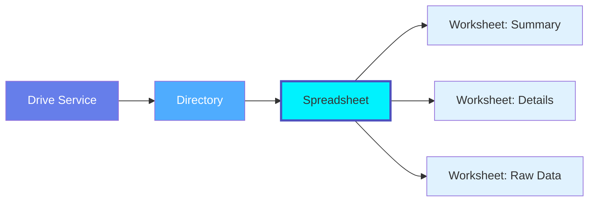
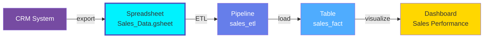

# Spreadsheet

**Spreadsheet files with multiple worksheets - Excel, Google Sheets, and collaborative data sources**

---

## Overview

The **Spreadsheet** entity represents spreadsheet files (Excel .xlsx, Google Sheets .gsheet, LibreOffice Calc .ods) that contain one or more worksheets with tabular data. Spreadsheets are common data sources for analytics pipelines and often serve as collaborative data management tools.

**Hierarchy**:



---

## Schema Specifications

View the complete Spreadsheet schema in your preferred format:

=== "JSON Schema"

    **Complete JSON Schema Definition**

    ```json
    {
      "$id": "https://open-metadata.org/schema/entity/data/spreadsheet.json",
      "$schema": "http://json-schema.org/draft-07/schema#",
      "title": "Spreadsheet",
      "$comment": "@om-entity-type",
      "description": "This schema defines the Spreadsheet entity. A Spreadsheet is a file containing multiple worksheets/tabs, such as Google Sheets or Excel files.",
      "type": "object",
      "javaType": "org.openmetadata.schema.entity.data.Spreadsheet",
      "javaInterfaces": ["org.openmetadata.schema.EntityInterface"],

      "definitions": {
        "spreadsheetMimeType": {
          "description": "MIME type for spreadsheet files",
          "javaInterfaces": ["org.openmetadata.schema.EnumInterface"],
          "type": "string",
          "enum": [
            "application/vnd.google-apps.spreadsheet",
            "application/vnd.openxmlformats-officedocument.spreadsheetml.sheet",
            "application/vnd.ms-excel",
            "application/vnd.oasis.opendocument.spreadsheet",
            "text/csv",
            "text/tab-separated-values",
            "Other"
          ],
          "javaEnums": [
            { "name": "GoogleSheets" },
            { "name": "ExcelXlsx" },
            { "name": "ExcelXls" },
            { "name": "OpenDocument" },
            { "name": "Csv" },
            { "name": "Tsv" },
            { "name": "Other" }
          ]
        }
      },

      "properties": {
        "id": {
          "description": "Unique identifier that identifies this spreadsheet instance.",
          "$ref": "../../type/basic.json#/definitions/uuid"
        },
        "name": {
          "description": "Name that identifies the spreadsheet.",
          "$ref": "../../type/basic.json#/definitions/entityName"
        },
        "fullyQualifiedName": {
          "description": "Name that uniquely identifies a spreadsheet in the format 'ServiceName.DirectoryPath.SpreadsheetName'.",
          "$ref": "../../type/basic.json#/definitions/fullyQualifiedEntityName"
        },
        "displayName": {
          "description": "Display Name that identifies this spreadsheet.",
          "type": "string"
        },
        "description": {
          "description": "Description of the spreadsheet instance.",
          "$ref": "../../type/basic.json#/definitions/markdown"
        },
        "service": {
          "description": "Link to the drive service where this spreadsheet is hosted.",
          "$ref": "../../type/entityReference.json"
        },
        "serviceType": {
          "description": "Service type where this spreadsheet is hosted.",
          "$ref": "../../entity/services/driveService.json#/definitions/driveServiceType"
        },
        "directory": {
          "description": "Reference to Directory that contains this spreadsheet.",
          "$ref": "../../type/entityReference.json"
        },
        "worksheets": {
          "description": "References to worksheets/tabs in the spreadsheet.",
          "$ref": "../../type/entityReferenceList.json"
        },
        "mimeType": {
          "description": "MIME type of the spreadsheet file",
          "$ref": "#/definitions/spreadsheetMimeType"
        },
        "path": {
          "description": "Full path to the spreadsheet file",
          "type": "string"
        },
        "driveFileId": {
          "description": "Native file ID in the source system",
          "type": "string"
        },
        "size": {
          "description": "File size in bytes (may be null for cloud-native files like Google Sheets)",
          "type": "integer"
        },
        "fileVersion": {
          "description": "File version information",
          "type": "string"
        },
        "createdTime": {
          "description": "Spreadsheet creation timestamp",
          "$ref": "../../type/basic.json#/definitions/timestamp"
        },
        "modifiedTime": {
          "description": "Last modification timestamp",
          "$ref": "../../type/basic.json#/definitions/timestamp"
        },
        "lastModifiedBy": {
          "description": "User who last modified the spreadsheet",
          "$ref": "../../type/entityReference.json"
        },
        "usageSummary": {
          "description": "Latest usage information for this spreadsheet.",
          "$ref": "../../type/usageDetails.json",
          "default": null
        },
        "sourceUrl": {
          "description": "Link to view/edit this spreadsheet in the source system (e.g., Google Sheets URL, SharePoint URL).",
          "$ref": "../../type/basic.json#/definitions/sourceUrl"
        },
        "href": {
          "description": "Link to the resource corresponding to this spreadsheet.",
          "$ref": "../../type/basic.json#/definitions/href"
        },
        "owners": {
          "description": "Owners of this spreadsheet.",
          "$ref": "../../type/entityReferenceList.json"
        },
        "followers": {
          "description": "Followers of this entity.",
          "$ref": "../../type/entityReferenceList.json"
        },
        "tags": {
          "description": "Tags associated with this spreadsheet.",
          "type": "array",
          "items": {
            "$ref": "../../type/tagLabel.json"
          },
          "default": null
        },
        "version": {
          "description": "Metadata version of the entity.",
          "$ref": "../../type/entityHistory.json#/definitions/entityVersion"
        },
        "updatedAt": {
          "description": "Last update time corresponding to the new version of the entity in Unix epoch time milliseconds.",
          "$ref": "../../type/basic.json#/definitions/timestamp"
        },
        "updatedBy": {
          "description": "User who made the update.",
          "type": "string"
        },
        "impersonatedBy": {
          "description": "Bot user that performed the action on behalf of the actual user.",
          "$ref": "../../type/basic.json#/definitions/impersonatedBy"
        },
        "changeDescription": {
          "description": "Change that lead to this version of the entity.",
          "$ref": "../../type/entityHistory.json#/definitions/changeDescription"
        },
        "incrementalChangeDescription": {
          "description": "Change that lead to this version of the entity.",
          "$ref": "../../type/entityHistory.json#/definitions/changeDescription"
        },
        "deleted": {
          "description": "When `true` indicates the entity has been soft deleted.",
          "type": "boolean",
          "default": false
        },
        "domains": {
          "description": "Domains the Spreadsheet belongs to.",
          "$ref": "../../type/entityReferenceList.json"
        },
        "dataProducts": {
          "description": "List of data products this entity is part of.",
          "$ref": "../../type/entityReferenceList.json"
        },
        "lifeCycle": {
          "description": "Life Cycle of the entity",
          "$ref": "../../type/lifeCycle.json"
        },
        "sourceHash": {
          "description": "Source hash of the entity",
          "type": "string",
          "minLength": 1,
          "maxLength": 32
        },
        "extension": {
          "description": "Entity extension data with custom attributes added to the entity.",
          "$ref": "../../type/basic.json#/definitions/entityExtension"
        },
        "votes": {
          "description": "Votes on the entity.",
          "$ref": "../../type/votes.json"
        },
        "certification": {
          "$ref": "../../type/assetCertification.json"
        },
        "entityStatus": {
          "description": "Status of the Spreadsheet.",
          "$ref": "../../type/status.json"
        }
      },
      "required": ["id", "name", "service"],
      "additionalProperties": false
    }
    ```

=== "RDF (Turtle)"

    **RDF/OWL Ontology Representation**

    ```turtle
    @prefix om: <https://open-metadata.org/schema/> .
    @prefix om-sheet: <https://open-metadata.org/schema/entity/data/> .
    @prefix rdf: <http://www.w3.org/1999/02/22-rdf-syntax-ns#> .
    @prefix rdfs: <http://www.w3.org/2000/01/rdf-schema#> .
    @prefix owl: <http://www.w3.org/2002/07/owl#> .
    @prefix xsd: <http://www.w3.org/2001/XMLSchema#> .

    # Spreadsheet Class
    om-sheet:Spreadsheet a owl:Class ;
        rdfs:label "Spreadsheet" ;
        rdfs:comment "A spreadsheet file containing multiple worksheets/tabs, such as Google Sheets or Excel files." ;
        rdfs:isDefinedBy om: .

    # Object Properties
    om-sheet:service a owl:ObjectProperty ;
        rdfs:label "service" ;
        rdfs:comment "Link to the drive service where this spreadsheet is hosted" ;
        rdfs:domain om-sheet:Spreadsheet ;
        rdfs:range om:DriveService .

    om-sheet:directory a owl:ObjectProperty ;
        rdfs:label "directory" ;
        rdfs:comment "Reference to Directory that contains this spreadsheet" ;
        rdfs:domain om-sheet:Spreadsheet ;
        rdfs:range om-sheet:Directory .

    om-sheet:hasWorksheet a owl:ObjectProperty ;
        rdfs:label "has worksheet" ;
        rdfs:comment "References to worksheets/tabs in the spreadsheet" ;
        rdfs:domain om-sheet:Spreadsheet ;
        rdfs:range om-sheet:Worksheet .

    om-sheet:lastModifiedBy a owl:ObjectProperty ;
        rdfs:label "last modified by" ;
        rdfs:comment "User who last modified the spreadsheet" ;
        rdfs:domain om-sheet:Spreadsheet ;
        rdfs:range om:User .

    om-sheet:owners a owl:ObjectProperty ;
        rdfs:label "owners" ;
        rdfs:comment "Owners of this spreadsheet" ;
        rdfs:domain om-sheet:Spreadsheet ;
        rdfs:range om:EntityReference .

    om-sheet:followers a owl:ObjectProperty ;
        rdfs:label "followers" ;
        rdfs:comment "Followers of this entity" ;
        rdfs:domain om-sheet:Spreadsheet ;
        rdfs:range om:EntityReference .

    om-sheet:domains a owl:ObjectProperty ;
        rdfs:label "domains" ;
        rdfs:comment "Domains the Spreadsheet belongs to" ;
        rdfs:domain om-sheet:Spreadsheet ;
        rdfs:range om:Domain .

    om-sheet:dataProducts a owl:ObjectProperty ;
        rdfs:label "data products" ;
        rdfs:comment "List of data products this entity is part of" ;
        rdfs:domain om-sheet:Spreadsheet ;
        rdfs:range om:DataProduct .

    # Datatype Properties
    om-sheet:mimeType a owl:DatatypeProperty ;
        rdfs:label "MIME type" ;
        rdfs:comment "MIME type of the spreadsheet file" ;
        rdfs:domain om-sheet:Spreadsheet ;
        rdfs:range xsd:string .

    om-sheet:path a owl:DatatypeProperty ;
        rdfs:label "path" ;
        rdfs:comment "Full path to the spreadsheet file" ;
        rdfs:domain om-sheet:Spreadsheet ;
        rdfs:range xsd:string .

    om-sheet:driveFileId a owl:DatatypeProperty ;
        rdfs:label "drive file ID" ;
        rdfs:comment "Native file ID in the source system" ;
        rdfs:domain om-sheet:Spreadsheet ;
        rdfs:range xsd:string .

    om-sheet:size a owl:DatatypeProperty ;
        rdfs:label "size" ;
        rdfs:comment "File size in bytes (may be null for cloud-native files like Google Sheets)" ;
        rdfs:domain om-sheet:Spreadsheet ;
        rdfs:range xsd:integer .

    om-sheet:fileVersion a owl:DatatypeProperty ;
        rdfs:label "file version" ;
        rdfs:comment "File version information" ;
        rdfs:domain om-sheet:Spreadsheet ;
        rdfs:range xsd:string .

    om-sheet:createdTime a owl:DatatypeProperty ;
        rdfs:label "created time" ;
        rdfs:comment "Spreadsheet creation timestamp" ;
        rdfs:domain om-sheet:Spreadsheet ;
        rdfs:range xsd:dateTime .

    om-sheet:modifiedTime a owl:DatatypeProperty ;
        rdfs:label "modified time" ;
        rdfs:comment "Last modification timestamp" ;
        rdfs:domain om-sheet:Spreadsheet ;
        rdfs:range xsd:dateTime .

    om-sheet:sourceUrl a owl:DatatypeProperty ;
        rdfs:label "source URL" ;
        rdfs:comment "Link to view/edit this spreadsheet in the source system (e.g., Google Sheets URL, SharePoint URL)" ;
        rdfs:domain om-sheet:Spreadsheet ;
        rdfs:range xsd:anyURI .
    ```

=== "JSON-LD Context"

    **JSON-LD Context for Semantic Interoperability**

    ```json
    {
      "@context": {
        "@vocab": "https://open-metadata.org/schema/entity/data/",
        "om": "https://open-metadata.org/schema/",
        "xsd": "http://www.w3.org/2001/XMLSchema#",

        "Spreadsheet": {
          "@id": "om:Spreadsheet",
          "@type": "@id"
        },
        "service": {
          "@id": "om:service",
          "@type": "@id"
        },
        "serviceType": {
          "@id": "om:serviceType",
          "@type": "xsd:string"
        },
        "directory": {
          "@id": "om:directory",
          "@type": "@id"
        },
        "worksheets": {
          "@id": "om:hasWorksheet",
          "@type": "@id",
          "@container": "@set"
        },
        "mimeType": {
          "@id": "om:mimeType",
          "@type": "xsd:string"
        },
        "path": {
          "@id": "om:path",
          "@type": "xsd:string"
        },
        "driveFileId": {
          "@id": "om:driveFileId",
          "@type": "xsd:string"
        },
        "size": {
          "@id": "om:size",
          "@type": "xsd:integer"
        },
        "fileVersion": {
          "@id": "om:fileVersion",
          "@type": "xsd:string"
        },
        "createdTime": {
          "@id": "om:createdTime",
          "@type": "xsd:dateTime"
        },
        "modifiedTime": {
          "@id": "om:modifiedTime",
          "@type": "xsd:dateTime"
        },
        "lastModifiedBy": {
          "@id": "om:lastModifiedBy",
          "@type": "@id"
        },
        "usageSummary": {
          "@id": "om:usageSummary",
          "@type": "@id"
        },
        "sourceUrl": {
          "@id": "om:sourceUrl",
          "@type": "xsd:anyURI"
        },
        "href": {
          "@id": "om:href",
          "@type": "xsd:anyURI"
        },
        "owners": {
          "@id": "om:owners",
          "@type": "@id",
          "@container": "@set"
        },
        "followers": {
          "@id": "om:followers",
          "@type": "@id",
          "@container": "@set"
        },
        "domains": {
          "@id": "om:domains",
          "@type": "@id",
          "@container": "@set"
        },
        "dataProducts": {
          "@id": "om:dataProducts",
          "@type": "@id",
          "@container": "@set"
        },
        "lifeCycle": {
          "@id": "om:lifeCycle",
          "@type": "@id"
        },
        "votes": {
          "@id": "om:votes",
          "@type": "@id"
        },
        "certification": {
          "@id": "om:certification",
          "@type": "@id"
        },
        "entityStatus": {
          "@id": "om:entityStatus",
          "@type": "@id"
        }
      }
    }
    ```

---

## Spreadsheet Types

### Google Sheets

**Key Features**:
- Real-time collaboration
- Cloud-native (always latest version)
- Google Apps Script automation
- Native sharing and permissions
- Integrations with Google Workspace

**Example**:

```json
{
  "name": "Monthly_Sales_Report",
  "mimeType": "application/vnd.google-apps.spreadsheet",
  "service": {"id": "...", "type": "driveService"},
  "sourceUrl": "https://docs.google.com/spreadsheets/d/abc123",
  "driveFileId": "abc123def456",
  "worksheets": [
    {"id": "...", "type": "worksheet", "name": "Summary"},
    {"id": "...", "type": "worksheet", "name": "Details"},
    {"id": "...", "type": "worksheet", "name": "Charts"}
  ]
}
```

### Microsoft Excel

**Key Features**:
- Desktop and web versions
- Advanced formulas and macros
- Power Query and Power Pivot
- OneDrive/SharePoint integration
- Co-authoring support

**Example**:

```json
{
  "name": "Budget_2024.xlsx",
  "mimeType": "application/vnd.openxmlformats-officedocument.spreadsheetml.sheet",
  "service": {"id": "...", "type": "driveService"},
  "directory": {"id": "...", "type": "directory", "fullyQualifiedName": "onedrive-finance.Budgets"},
  "path": "/Budgets/Budget_2024.xlsx",
  "worksheets": [
    {"id": "...", "type": "worksheet", "name": "Income"},
    {"id": "...", "type": "worksheet", "name": "Expenses"},
    {"id": "...", "type": "worksheet", "name": "Summary"}
  ],
  "size": 2457600,
  "fileVersion": "16.0"
}
```

---

## Use Cases

### Analytics Data Source

Spreadsheet as pipeline input:

```json
{
  "name": "Customer_Data_Export",
  "mimeType": "application/vnd.google-apps.spreadsheet",
  "service": {"id": "...", "type": "driveService", "name": "google_drive_analytics"},
  "directory": {"id": "...", "type": "directory", "name": "Data Exports"},
  "worksheets": [
    {"id": "...", "type": "worksheet", "name": "Customers"},
    {"id": "...", "type": "worksheet", "name": "Orders"},
    {"id": "...", "type": "worksheet", "name": "Products"}
  ],
  "tags": [
    {"tagFQN": "SourceData", "labelType": "Manual"},
    {"tagFQN": "CRMExport", "labelType": "Manual"}
  ]
}
```

### Collaborative Data Management

Shared business data:

```json
{
  "name": "Product_Catalog",
  "mimeType": "application/vnd.google-apps.spreadsheet",
  "service": {"id": "...", "type": "driveService"},
  "worksheets": [
    {"id": "...", "type": "worksheet", "name": "Active Products"},
    {"id": "...", "type": "worksheet", "name": "Discontinued"},
    {"id": "...", "type": "worksheet", "name": "Pricing"}
  ],
  "owners": [
    {"id": "...", "type": "team", "name": "product-team"},
    {"id": "...", "type": "team", "name": "marketing"}
  ]
}
```

### Financial Reporting

Multi-worksheet financial model:

```json
{
  "name": "Q4_Financial_Model",
  "mimeType": "application/vnd.openxmlformats-officedocument.spreadsheetml.sheet",
  "service": {"id": "...", "type": "driveService"},
  "worksheets": [
    {"id": "...", "type": "worksheet", "name": "Assumptions"},
    {"id": "...", "type": "worksheet", "name": "Revenue Forecast"},
    {"id": "...", "type": "worksheet", "name": "Expense Budget"},
    {"id": "...", "type": "worksheet", "name": "Cash Flow"},
    {"id": "...", "type": "worksheet", "name": "P&L Statement"},
    {"id": "...", "type": "worksheet", "name": "Balance Sheet"}
  ],
  "owners": [{"id": "...", "type": "team", "name": "finance-team"}],
  "tags": [
    {"tagFQN": "Financial", "labelType": "Manual"},
    {"tagFQN": "Confidential", "labelType": "Manual"},
    {"tagFQN": "Q4_2024", "labelType": "Manual"}
  ]
}
```

---

## Lineage Tracking

Track data flow from spreadsheets to analytics:



---

## Custom Properties

This entity supports custom properties through the `extension` field.
Common custom properties include:

- **Data Classification**: Sensitivity level
- **Cost Center**: Billing allocation
- **Retention Period**: Data retention requirements
- **Application Owner**: Owning application/team

See [Custom Properties](../../metadata-specifications/custom-properties.md)
for details on defining and using custom properties.

---

## Followers

Users can follow spreadsheets to receive notifications about worksheet additions, structural changes, and sharing updates. See **[Followers](../../metadata-specifications/followers.md)** for details.

---

## API Operations

All Spreadsheet operations are available under the `/v1/drives/spreadsheets` endpoint.

### List Spreadsheets

Get a list of spreadsheets, optionally filtered by service or directory.

```http
GET /v1/drives/spreadsheets
Query Parameters:
  - fields: Fields to include (worksheets, owners, directory, tags, etc.)
  - service: Filter by drive service name
  - directory: Filter by parent directory FQN
  - mimeType: Filter by MIME type
  - limit: Number of results (1-1000000, default 10)
  - before/after: Cursor-based pagination
  - include: all | deleted | non-deleted (default: non-deleted)

Response: SpreadsheetList
```

### Create Spreadsheet

Create a new spreadsheet in a drive service.

```http
POST /v1/drives/spreadsheets
Content-Type: application/json

{
  "name": "Sales_Report_2024",
  "mimeType": "application/vnd.google-apps.spreadsheet",
  "service": {"id": "...", "type": "driveService"},
  "directory": {"id": "...", "type": "directory"},
  "description": "Monthly sales report",
  "worksheets": [
    {"id": "...", "type": "worksheet"},
    {"id": "...", "type": "worksheet"}
  ]
}

Response: Spreadsheet
```

### Get Spreadsheet by Name

Get a spreadsheet by its fully qualified name.

```http
GET /v1/drives/spreadsheets/name/{fqn}
Query Parameters:
  - fields: Fields to include (worksheets, owners, tags, etc.)
  - include: all | deleted | non-deleted

Example:
GET /v1/drives/spreadsheets/name/googleDrive.Reports.Sales_Report_2024?fields=worksheets,owners,tags

Response: Spreadsheet
```

### Get Spreadsheet by ID

Get a spreadsheet by its unique identifier.

```http
GET /v1/drives/spreadsheets/{id}
Query Parameters:
  - fields: Fields to include
  - include: all | deleted | non-deleted

Response: Spreadsheet
```

### Update Spreadsheet

Update a spreadsheet using JSON Patch.

```http
PATCH /v1/drives/spreadsheets/name/{fqn}
Content-Type: application/json-patch+json

[
  {"op": "add", "path": "/tags", "value": [{"tagFQN": "Tier.Gold"}]},
  {"op": "replace", "path": "/description", "value": "Updated Q4 2024 sales report"},
  {"op": "add", "path": "/owners/0", "value": {"id": "...", "type": "team"}}
]

Response: Spreadsheet
```

### Create or Update Spreadsheet

Create a new spreadsheet or update if it exists.

```http
PUT /v1/drives/spreadsheets
Content-Type: application/json

{
  "name": "Budget_2024",
  "mimeType": "application/vnd.openxmlformats-officedocument.spreadsheetml.sheet",
  "service": {"id": "...", "type": "driveService"},
  "worksheets": [{"id": "...", "type": "worksheet"}]
}

Response: Spreadsheet
```

### Delete Spreadsheet

Delete a spreadsheet by fully qualified name.

```http
DELETE /v1/drives/spreadsheets/name/{fqn}
Query Parameters:
  - recursive: Delete worksheets recursively (default: false)
  - hardDelete: Permanently delete (default: false)

Response: 200 OK
```

### Get Spreadsheet Versions

Get all versions of a spreadsheet.

```http
GET /v1/drives/spreadsheets/{id}/versions

Response: EntityHistory
```

### Get Specific Version

Get a specific version of a spreadsheet.

```http
GET /v1/drives/spreadsheets/{id}/versions/{version}

Response: Spreadsheet
```

### Follow Spreadsheet

Add a follower to a spreadsheet.

```http
PUT /v1/drives/spreadsheets/{id}/followers/{userId}

Response: ChangeEvent
```

### Get Followers

Get all followers of a spreadsheet.

```http
GET /v1/drives/spreadsheets/{id}/followers

Response: EntityReference[]
```

### Vote on Spreadsheet

Upvote or downvote a spreadsheet.

```http
PUT /v1/drives/spreadsheets/{id}/vote
Content-Type: application/json

{
  "vote": "upvote"
}

Response: ChangeEvent
```

### Bulk Operations

Create or update multiple spreadsheets.

```http
PUT /v1/drives/spreadsheets/bulk
Content-Type: application/json

{
  "entities": [...]
}

Response: BulkOperationResult
```

---

## Related Documentation

- **[Drive Service](drive-service.md)** - Parent drive service
- **[Directory](directory.md)** - Containing folder
- **[Worksheet](worksheet.md)** - Individual worksheets
- **[Pipeline](../pipelines/pipeline.md)** - Pipelines consuming spreadsheets
- **[Table](../databases/table.md)** - Tables loaded from spreadsheets
- **[Dashboard](../dashboards/dashboard.md)** - Dashboards using spreadsheet data
