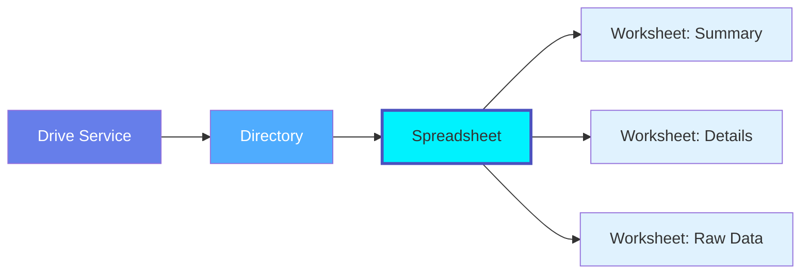

# Spreadsheet

**Spreadsheet files with multiple worksheets - Excel, Google Sheets, and collaborative data sources**

---

## Overview

The **Spreadsheet** entity represents spreadsheet files (Excel .xlsx, Google Sheets .gsheet, LibreOffice Calc .ods) that contain one or more worksheets with tabular data. Spreadsheets are common data sources for analytics pipelines and often serve as collaborative data management tools.

**Hierarchy**:



---

## Schema Specifications

View the complete Spreadsheet schema in your preferred format:

=== "JSON Schema"

    **Complete JSON Schema Definition**

    ```json
    {
      "$id": "https://open-metadata.org/schema/entity/data/spreadsheet.json",
      "$schema": "http://json-schema.org/draft-07/schema#",
      "title": "Spreadsheet",
      "description": "A spreadsheet file containing one or more worksheets.",
      "type": "object",

      "definitions": {
        "spreadsheetType": {
          "description": "Type of spreadsheet file",
          "type": "string",
          "enum": [
            "GoogleSheets",
            "Excel",
            "LibreOfficeCalc",
            "CSV",
            "Numbers"
          ]
        }
      },

      "properties": {
        "id": {
          "description": "Unique identifier",
          "$ref": "../../type/basic.json#/definitions/uuid"
        },
        "name": {
          "description": "Spreadsheet file name",
          "$ref": "../../type/basic.json#/definitions/entityName"
        },
        "fullyQualifiedName": {
          "description": "Fully qualified path: driveService.directory.spreadsheetName",
          "$ref": "../../type/basic.json#/definitions/fullyQualifiedEntityName"
        },
        "displayName": {
          "description": "Display name",
          "type": "string"
        },
        "description": {
          "description": "Markdown description",
          "$ref": "../../type/basic.json#/definitions/markdown"
        },
        "spreadsheetType": {
          "$ref": "#/definitions/spreadsheetType"
        },
        "driveService": {
          "description": "Reference to parent drive service",
          "$ref": "../../type/entityReference.json"
        },
        "directory": {
          "description": "Directory containing this spreadsheet",
          "$ref": "../../type/entityReference.json"
        },
        "fileUrl": {
          "description": "Direct URL to the spreadsheet file",
          "type": "string",
          "format": "uri"
        },
        "worksheets": {
          "description": "Worksheets/sheets in this spreadsheet",
          "type": "array",
          "items": {
            "$ref": "../../type/entityReference.json"
          }
        },
        "worksheetCount": {
          "description": "Number of worksheets",
          "type": "integer"
        },
        "fileSize": {
          "description": "File size in bytes",
          "type": "integer"
        },
        "version": {
          "description": "Current version number",
          "type": "string"
        },
        "versionHistory": {
          "description": "Version history",
          "type": "array",
          "items": {
            "type": "object",
            "properties": {
              "versionId": {"type": "string"},
              "timestamp": {"type": "integer"},
              "modifiedBy": {"type": "string"},
              "changes": {"type": "string"}
            }
          }
        },
        "sharing": {
          "description": "Sharing settings",
          "type": "object",
          "properties": {
            "sharedWith": {
              "type": "array",
              "items": {
                "type": "object",
                "properties": {
                  "email": {"type": "string"},
                  "permission": {
                    "type": "string",
                    "enum": ["viewer", "commenter", "editor"]
                  }
                }
              }
            },
            "linkSharing": {
              "type": "string",
              "enum": ["private", "anyone_with_link", "public"]
            }
          }
        },
        "lastModified": {
          "description": "Last modification timestamp",
          "type": "integer"
        },
        "createdAt": {
          "description": "Creation timestamp",
          "type": "integer"
        },
        "createdBy": {
          "description": "User who created the spreadsheet",
          "type": "string"
        },
        "modifiedBy": {
          "description": "User who last modified",
          "type": "string"
        },
        "owner": {
          "description": "Owner of this spreadsheet",
          "$ref": "../../type/entityReference.json"
        },
        "domain": {
          "description": "Domain this spreadsheet belongs to",
          "$ref": "../../type/entityReference.json"
        },
        "tags": {
          "description": "Tags for this spreadsheet",
          "type": "array",
          "items": {
            "$ref": "../../type/tagLabel.json"
          }
        },
        "glossaryTerms": {
          "description": "Glossary terms",
          "type": "array",
          "items": {
            "$ref": "../../type/entityReference.json"
          }
        },
        "usedBy": {
          "description": "Pipelines, dashboards using this spreadsheet",
          "type": "array",
          "items": {
            "$ref": "../../type/entityReference.json"
          }
        },
        "extension": {
          "description": "Custom properties",
          "$ref": "../../type/basic.json#/definitions/entityExtension"
        }
      },
      "required": ["id", "name", "spreadsheetType", "driveService"],
      "additionalProperties": false
    }
    ```

=== "RDF (Turtle)"

    **RDF/OWL Ontology Representation**

    ```turtle
    @prefix om: <https://open-metadata.org/schema/> .
    @prefix om-sheet: <https://open-metadata.org/schema/entity/data/> .
    @prefix rdf: <http://www.w3.org/1999/02/22-rdf-syntax-ns#> .
    @prefix rdfs: <http://www.w3.org/2000/01/rdf-schema#> .
    @prefix owl: <http://www.w3.org/2002/07/owl#> .
    @prefix xsd: <http://www.w3.org/2001/XMLSchema#> .

    # Spreadsheet Class
    om-sheet:Spreadsheet a owl:Class ;
        rdfs:label "Spreadsheet" ;
        rdfs:comment "Spreadsheet file with multiple worksheets" ;
        rdfs:isDefinedBy om: .

    # Properties
    om-sheet:spreadsheetType a owl:DatatypeProperty ;
        rdfs:label "spreadsheet type" ;
        rdfs:comment "Type of spreadsheet (Google Sheets, Excel, etc.)" ;
        rdfs:domain om-sheet:Spreadsheet ;
        rdfs:range xsd:string .

    om-sheet:hasWorksheet a owl:ObjectProperty ;
        rdfs:label "has worksheet" ;
        rdfs:comment "Worksheets in this spreadsheet" ;
        rdfs:domain om-sheet:Spreadsheet ;
        rdfs:range om-sheet:Worksheet .

    om-sheet:worksheetCount a owl:DatatypeProperty ;
        rdfs:label "worksheet count" ;
        rdfs:comment "Number of worksheets" ;
        rdfs:domain om-sheet:Spreadsheet ;
        rdfs:range xsd:integer .

    om-sheet:usedBy a owl:ObjectProperty ;
        rdfs:label "used by" ;
        rdfs:comment "Pipelines or dashboards consuming this spreadsheet" ;
        rdfs:domain om-sheet:Spreadsheet ;
        rdfs:range om:Pipeline .
    ```

=== "JSON-LD Context"

    **JSON-LD Context for Semantic Interoperability**

    ```json
    {
      "@context": {
        "@vocab": "https://open-metadata.org/schema/entity/data/",
        "om": "https://open-metadata.org/schema/",
        "xsd": "http://www.w3.org/2001/XMLSchema#",

        "Spreadsheet": {
          "@id": "om:Spreadsheet",
          "@type": "@id"
        },
        "spreadsheetType": {
          "@id": "om:spreadsheetType",
          "@type": "xsd:string"
        },
        "worksheets": {
          "@id": "om:hasWorksheet",
          "@type": "@id",
          "@container": "@set"
        },
        "worksheetCount": {
          "@id": "om:worksheetCount",
          "@type": "xsd:integer"
        },
        "usedBy": {
          "@id": "om:usedBy",
          "@type": "@id",
          "@container": "@set"
        }
      }
    }
    ```

---

## Spreadsheet Types

### Google Sheets

**Key Features**:
- Real-time collaboration
- Cloud-native (always latest version)
- Google Apps Script automation
- Native sharing and permissions
- Integrations with Google Workspace

**Example**:

```json
{
  "name": "Monthly_Sales_Report",
  "spreadsheetType": "GoogleSheets",
  "fileUrl": "https://docs.google.com/spreadsheets/d/abc123",
  "worksheets": ["Summary", "Details", "Charts"],
  "worksheetCount": 3,
  "sharing": {
    "sharedWith": [
      {"email": "sales@company.com", "permission": "viewer"}
    ],
    "linkSharing": "anyone_with_link"
  }
}
```

### Microsoft Excel

**Key Features**:
- Desktop and web versions
- Advanced formulas and macros
- Power Query and Power Pivot
- OneDrive/SharePoint integration
- Co-authoring support

**Example**:

```json
{
  "name": "Budget_2024.xlsx",
  "spreadsheetType": "Excel",
  "directory": "onedrive-finance/Budgets",
  "worksheets": ["Income", "Expenses", "Summary"],
  "fileSize": 2457600,
  "version": "16.0"
}
```

---

## Use Cases

### Analytics Data Source

Spreadsheet as pipeline input:

```json
{
  "name": "Customer_Data_Export",
  "spreadsheetType": "GoogleSheets",
  "driveService": "google_drive_analytics",
  "directory": "Data Exports",
  "worksheets": ["Customers", "Orders", "Products"],
  "lineage": {
    "upstream": ["crm.salesforce.accounts"],
    "downstream": ["pipeline.customer_etl", "table.dim_customers"]
  },
  "tags": ["Source Data", "CRM Export"]
}
```

### Collaborative Data Management

Shared business data:

```json
{
  "name": "Product_Catalog",
  "spreadsheetType": "GoogleSheets",
  "worksheets": ["Active Products", "Discontinued", "Pricing"],
  "sharing": {
    "sharedWith": [
      {"email": "product-team@company.com", "permission": "editor"},
      {"email": "marketing@company.com", "permission": "viewer"}
    ]
  },
  "usedBy": ["dashboard.product_dashboard", "pipeline.product_sync"]
}
```

### Financial Reporting

Multi-worksheet financial model:

```json
{
  "name": "Q4_Financial_Model",
  "spreadsheetType": "Excel",
  "worksheets": [
    "Assumptions",
    "Revenue Forecast",
    "Expense Budget",
    "Cash Flow",
    "P&L Statement",
    "Balance Sheet"
  ],
  "worksheetCount": 6,
  "owner": "finance-team",
  "tags": ["Financial", "Confidential", "Q4 2024"]
}
```

---

## Lineage Tracking

Track data flow from spreadsheets to analytics:


---

## Custom Properties

This entity supports custom properties through the `extension` field.
Common custom properties include:

- **Data Classification**: Sensitivity level
- **Cost Center**: Billing allocation
- **Retention Period**: Data retention requirements
- **Application Owner**: Owning application/team

See [Custom Properties](../../metadata-specifications/custom-properties.md)
for details on defining and using custom properties.

---

## API Operations

### Get Spreadsheet Metadata

```http
GET /api/v1/spreadsheets/{id}?fields=worksheets,owner,tags,lineage
```

### List Worksheets

```http
GET /api/v1/spreadsheets/{id}/worksheets
```

### Get Lineage

```http
GET /api/v1/spreadsheets/{id}/lineage?depth=2
```

---

## Related Documentation

- **[Drive Service](drive-service.md)** - Parent drive service
- **[Directory](directory.md)** - Containing folder
- **[Worksheet](worksheet.md)** - Individual worksheets
- **[Pipeline](../pipelines/pipeline.md)** - Pipelines consuming spreadsheets
- **[Table](../databases/table.md)** - Tables loaded from spreadsheets
- **[Dashboard](../dashboards/dashboard.md)** - Dashboards using spreadsheet data
