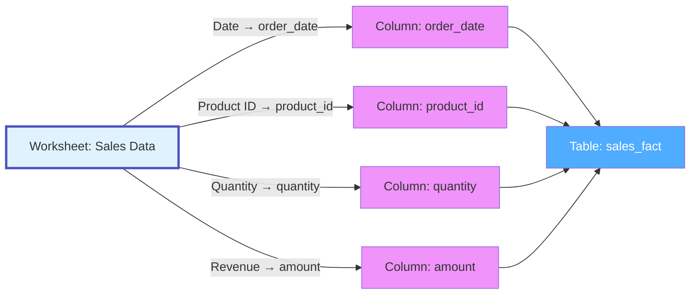

# Worksheet

**Individual sheets/tabs within spreadsheets - structured data with columns and rows**

---

## Overview

The **Worksheet** (or Sheet) entity represents an individual worksheet/tab within a spreadsheet file. Worksheets contain structured tabular data with named columns, typed values, formulas, and formatting. They are analogous to database tables but in collaborative spreadsheet form.

**Hierarchy**:


---

## Schema Specifications

View the complete Worksheet schema in your preferred format:

=== "JSON Schema"

    **Complete JSON Schema Definition**

    ```json
    {
      "$id": "https://open-metadata.org/schema/entity/data/worksheet.json",
      "$schema": "http://json-schema.org/draft-07/schema#",
      "title": "Worksheet",
      "description": "Individual worksheet/sheet within a spreadsheet file.",
      "type": "object",

      "definitions": {
        "columnDefinition": {
          "type": "object",
          "properties": {
            "name": {
              "type": "string",
              "description": "Column header name"
            },
            "dataType": {
              "type": "string",
              "enum": ["string", "number", "date", "boolean", "formula", "mixed"]
            },
            "columnIndex": {
              "type": "integer",
              "description": "Zero-based column index"
            },
            "columnLetter": {
              "type": "string",
              "description": "Excel-style column letter (A, B, C, etc.)"
            },
            "description": {
              "type": "string"
            },
            "tags": {
              "type": "array",
              "items": {
                "$ref": "../../type/tagLabel.json"
              }
            }
          }
        }
      },

      "properties": {
        "id": {
          "description": "Unique identifier",
          "$ref": "../../type/basic.json#/definitions/uuid"
        },
        "name": {
          "description": "Worksheet name",
          "$ref": "../../type/basic.json#/definitions/entityName"
        },
        "fullyQualifiedName": {
          "description": "Fully qualified path: driveService.directory.spreadsheet.worksheetName",
          "$ref": "../../type/basic.json#/definitions/fullyQualifiedEntityName"
        },
        "displayName": {
          "description": "Display name",
          "type": "string"
        },
        "description": {
          "description": "Markdown description",
          "$ref": "../../type/basic.json#/definitions/markdown"
        },
        "spreadsheet": {
          "description": "Reference to parent spreadsheet",
          "$ref": "../../type/entityReference.json"
        },
        "sheetIndex": {
          "description": "Zero-based index of this worksheet",
          "type": "integer"
        },
        "columns": {
          "description": "Column definitions",
          "type": "array",
          "items": {
            "$ref": "#/definitions/columnDefinition"
          }
        },
        "columnCount": {
          "description": "Number of columns with data",
          "type": "integer"
        },
        "rowCount": {
          "description": "Number of rows with data",
          "type": "integer"
        },
        "hasHeader": {
          "description": "Whether first row contains column headers",
          "type": "boolean",
          "default": true
        },
        "headerRow": {
          "description": "Row index containing headers (usually 0 or 1)",
          "type": "integer",
          "default": 0
        },
        "dataStartRow": {
          "description": "Row index where data starts",
          "type": "integer",
          "default": 1
        },
        "namedRanges": {
          "description": "Named cell ranges in this worksheet",
          "type": "array",
          "items": {
            "type": "object",
            "properties": {
              "name": {"type": "string"},
              "range": {"type": "string", "example": "A1:D10"},
              "description": {"type": "string"}
            }
          }
        },
        "formulas": {
          "description": "Number of cells with formulas",
          "type": "integer"
        },
        "pivotTables": {
          "description": "Pivot tables in this worksheet",
          "type": "array",
          "items": {
            "type": "object",
            "properties": {
              "name": {"type": "string"},
              "sourceRange": {"type": "string"},
              "location": {"type": "string"}
            }
          }
        },
        "charts": {
          "description": "Charts/visualizations in worksheet",
          "type": "array",
          "items": {
            "type": "object",
            "properties": {
              "type": {
                "type": "string",
                "enum": ["line", "bar", "pie", "scatter", "area"]
              },
              "dataRange": {"type": "string"}
            }
          }
        },
        "owner": {
          "description": "Owner of this worksheet",
          "$ref": "../../type/entityReference.json"
        },
        "domain": {
          "description": "Domain this worksheet belongs to",
          "$ref": "../../type/entityReference.json"
        },
        "tags": {
          "description": "Tags for this worksheet",
          "type": "array",
          "items": {
            "$ref": "../../type/tagLabel.json"
          }
        },
        "glossaryTerms": {
          "description": "Glossary terms for columns",
          "type": "array",
          "items": {
            "$ref": "../../type/entityReference.json"
          }
        },
        "usedBy": {
          "description": "Pipelines using this worksheet as source",
          "type": "array",
          "items": {
            "$ref": "../../type/entityReference.json"
          }
        },
        "extension": {
          "description": "Custom properties",
          "$ref": "../../type/basic.json#/definitions/entityExtension"
        }
      },
      "required": ["id", "name", "spreadsheet"],
      "additionalProperties": false
    }
    ```

=== "RDF (Turtle)"

    **RDF/OWL Ontology Representation**

    ```turtle
    @prefix om: <https://open-metadata.org/schema/> .
    @prefix om-ws: <https://open-metadata.org/schema/entity/data/> .
    @prefix rdf: <http://www.w3.org/1999/02/22-rdf-syntax-ns#> .
    @prefix rdfs: <http://www.w3.org/2000/01/rdf-schema#> .
    @prefix owl: <http://www.w3.org/2002/07/owl#> .
    @prefix xsd: <http://www.w3.org/2001/XMLSchema#> .

    # Worksheet Class
    om-ws:Worksheet a owl:Class ;
        rdfs:label "Worksheet" ;
        rdfs:comment "Individual worksheet/sheet within a spreadsheet" ;
        rdfs:isDefinedBy om: .

    # Properties
    om-ws:sheetIndex a owl:DatatypeProperty ;
        rdfs:label "sheet index" ;
        rdfs:comment "Zero-based index of worksheet in spreadsheet" ;
        rdfs:domain om-ws:Worksheet ;
        rdfs:range xsd:integer .

    om-ws:columnCount a owl:DatatypeProperty ;
        rdfs:label "column count" ;
        rdfs:comment "Number of columns with data" ;
        rdfs:domain om-ws:Worksheet ;
        rdfs:range xsd:integer .

    om-ws:rowCount a owl:DatatypeProperty ;
        rdfs:label "row count" ;
        rdfs:comment "Number of rows with data" ;
        rdfs:domain om-ws:Worksheet ;
        rdfs:range xsd:integer .

    om-ws:hasColumn a owl:ObjectProperty ;
        rdfs:label "has column" ;
        rdfs:comment "Columns in this worksheet" ;
        rdfs:domain om-ws:Worksheet ;
        rdfs:range om-ws:Column .

    om-ws:usedBy a owl:ObjectProperty ;
        rdfs:label "used by" ;
        rdfs:comment "Pipelines consuming this worksheet" ;
        rdfs:domain om-ws:Worksheet ;
        rdfs:range om:Pipeline .
    ```

=== "JSON-LD Context"

    **JSON-LD Context for Semantic Interoperability**

    ```json
    {
      "@context": {
        "@vocab": "https://open-metadata.org/schema/entity/data/",
        "om": "https://open-metadata.org/schema/",
        "xsd": "http://www.w3.org/2001/XMLSchema#",

        "Worksheet": {
          "@id": "om:Worksheet",
          "@type": "@id"
        },
        "sheetIndex": {
          "@id": "om:sheetIndex",
          "@type": "xsd:integer"
        },
        "columnCount": {
          "@id": "om:columnCount",
          "@type": "xsd:integer"
        },
        "rowCount": {
          "@id": "om:rowCount",
          "@type": "xsd:integer"
        },
        "columns": {
          "@id": "om:hasColumn",
          "@type": "@id",
          "@container": "@set"
        }
      }
    }
    ```

---

## Worksheet Schema

Worksheets have structured schemas similar to database tables:

### Example: Sales Data Worksheet

```json
{
  "name": "Daily Sales",
  "spreadsheet": "Sales_Report_2024.gsheet",
  "sheetIndex": 0,
  "columns": [
    {
      "name": "Date",
      "dataType": "date",
      "columnIndex": 0,
      "columnLetter": "A",
      "description": "Transaction date"
    },
    {
      "name": "Product ID",
      "dataType": "string",
      "columnIndex": 1,
      "columnLetter": "B",
      "tags": [{"tagFQN": "PII.ProductIdentifier"}]
    },
    {
      "name": "Quantity",
      "dataType": "number",
      "columnIndex": 2,
      "columnLetter": "C"
    },
    {
      "name": "Revenue",
      "dataType": "formula",
      "columnIndex": 3,
      "columnLetter": "D",
      "description": "Calculated as Quantity * Price"
    }
  ],
  "columnCount": 4,
  "rowCount": 1500,
  "hasHeader": true,
  "headerRow": 0,
  "dataStartRow": 1
}
```

---

## Use Cases

### Data Pipeline Source

Worksheet as ETL source:

```json
{
  "name": "Customer Master",
  "spreadsheet": "CRM_Export.gsheet",
  "columns": [
    {"name": "customer_id", "dataType": "string"},
    {"name": "name", "dataType": "string"},
    {"name": "email", "dataType": "string"},
    {"name": "created_date", "dataType": "date"}
  ],
  "rowCount": 50000,
  "lineage": {
    "downstream": ["pipeline.customer_sync", "table.dim_customers"]
  },
  "tags": ["CRM", "Source Data"]
}
```

### Reference Data

Worksheet as lookup table:

```json
{
  "name": "Country Codes",
  "spreadsheet": "Reference_Data.xlsx",
  "columns": [
    {"name": "country_code", "dataType": "string"},
    {"name": "country_name", "dataType": "string"},
    {"name": "region", "dataType": "string"}
  ],
  "rowCount": 195,
  "namedRanges": [
    {"name": "CountryList", "range": "A2:A196"}
  ],
  "usedBy": ["pipeline.address_validation"]
}
```

### Financial Model

Complex worksheet with formulas:

```json
{
  "name": "Revenue Forecast",
  "spreadsheet": "Q4_Model.xlsx",
  "columns": [
    {"name": "Month", "dataType": "date"},
    {"name": "Base Revenue", "dataType": "number"},
    {"name": "Growth Rate", "dataType": "number"},
    {"name": "Forecasted Revenue", "dataType": "formula"}
  ],
  "formulas": 36,
  "charts": [
    {"type": "line", "dataRange": "A1:D13"}
  ],
  "owner": "finance-team",
  "tags": ["Financial", "Forecast", "Q4 2024"]
}
```

---

## Column-Level Lineage

Track which worksheet columns map to table columns:



---

## Custom Properties

This entity supports custom properties through the `extension` field.
Common custom properties include:

- **Data Classification**: Sensitivity level
- **Cost Center**: Billing allocation
- **Retention Period**: Data retention requirements
- **Application Owner**: Owning application/team

See [Custom Properties](../../metadata-specifications/custom-properties.md)
for details on defining and using custom properties.

---

## API Operations

All Worksheet operations are available under the `/v1/drives/worksheets` endpoint.

### List Worksheets

Get a list of worksheets, optionally filtered by spreadsheet.

```http
GET /v1/drives/worksheets
Query Parameters:
  - fields: Fields to include (columns, spreadsheet, owners, tags, etc.)
  - spreadsheet: Filter by parent spreadsheet FQN
  - limit: Number of results (1-1000000, default 10)
  - before/after: Cursor-based pagination
  - include: all | deleted | non-deleted (default: non-deleted)

Response: WorksheetList
```

### Create Worksheet

Create a new worksheet in a spreadsheet.

```http
POST /v1/drives/worksheets
Content-Type: application/json

{
  "name": "Daily Sales",
  "spreadsheet": "googleDrive.Reports.Sales_Report_2024",
  "sheetIndex": 0,
  "columns": [
    {
      "name": "Date",
      "dataType": "date",
      "columnIndex": 0,
      "columnLetter": "A"
    },
    {
      "name": "Amount",
      "dataType": "number",
      "columnIndex": 1,
      "columnLetter": "B"
    }
  ],
  "hasHeader": true,
  "headerRow": 0,
  "dataStartRow": 1
}

Response: Worksheet
```

### Get Worksheet by Name

Get a worksheet by its fully qualified name.

```http
GET /v1/drives/worksheets/name/{fqn}
Query Parameters:
  - fields: Fields to include (columns, owner, tags, spreadsheet, etc.)
  - include: all | deleted | non-deleted

Example:
GET /v1/drives/worksheets/name/googleDrive.Sales_Report.Daily_Sales?fields=columns,owner,tags

Response: Worksheet
```

### Get Worksheet by ID

Get a worksheet by its unique identifier.

```http
GET /v1/drives/worksheets/{id}
Query Parameters:
  - fields: Fields to include
  - include: all | deleted | non-deleted

Response: Worksheet
```

### Update Worksheet

Update a worksheet using JSON Patch.

```http
PATCH /v1/drives/worksheets/name/{fqn}
Content-Type: application/json-patch+json

[
  {"op": "add", "path": "/tags", "value": [{"tagFQN": "PII.Sensitive"}]},
  {"op": "replace", "path": "/description", "value": "Updated worksheet description"},
  {"op": "add", "path": "/columns/-", "value": {
    "name": "Region",
    "dataType": "string",
    "columnIndex": 2,
    "columnLetter": "C"
  }}
]

Response: Worksheet
```

### Create or Update Worksheet

Create a new worksheet or update if it exists.

```http
PUT /v1/drives/worksheets
Content-Type: application/json

{
  "name": "Monthly Summary",
  "spreadsheet": "googleDrive.Reports.Sales_2024",
  "sheetIndex": 1,
  "columns": [...]
}

Response: Worksheet
```

### Delete Worksheet

Delete a worksheet by fully qualified name.

```http
DELETE /v1/drives/worksheets/name/{fqn}
Query Parameters:
  - hardDelete: Permanently delete (default: false)

Response: 200 OK
```

### Get Worksheet Versions

Get all versions of a worksheet.

```http
GET /v1/drives/worksheets/{id}/versions

Response: EntityHistory
```

### Get Specific Version

Get a specific version of a worksheet.

```http
GET /v1/drives/worksheets/{id}/versions/{version}

Response: Worksheet
```

### Follow Worksheet

Add a follower to a worksheet.

```http
PUT /v1/drives/worksheets/{id}/followers/{userId}

Response: ChangeEvent
```

### Get Followers

Get all followers of a worksheet.

```http
GET /v1/drives/worksheets/{id}/followers

Response: EntityReference[]
```

### Vote on Worksheet

Upvote or downvote a worksheet.

```http
PUT /v1/drives/worksheets/{id}/vote
Content-Type: application/json

{
  "vote": "upvote"
}

Response: ChangeEvent
```

### Bulk Operations

Create or update multiple worksheets.

```http
PUT /v1/drives/worksheets/bulk
Content-Type: application/json

{
  "entities": [...]
}

Response: BulkOperationResult
```

---

## Related Documentation

- **[Spreadsheet](spreadsheet.md)** - Parent spreadsheet file
- **[Directory](directory.md)** - Containing folder
- **[Drive Service](drive-service.md)** - Drive service
- **[Column](../databases/column.md)** - Similar to table columns
- **[Table](../databases/table.md)** - Database tables loaded from worksheets
- **[Pipeline](../pipelines/pipeline.md)** - Pipelines consuming worksheets
