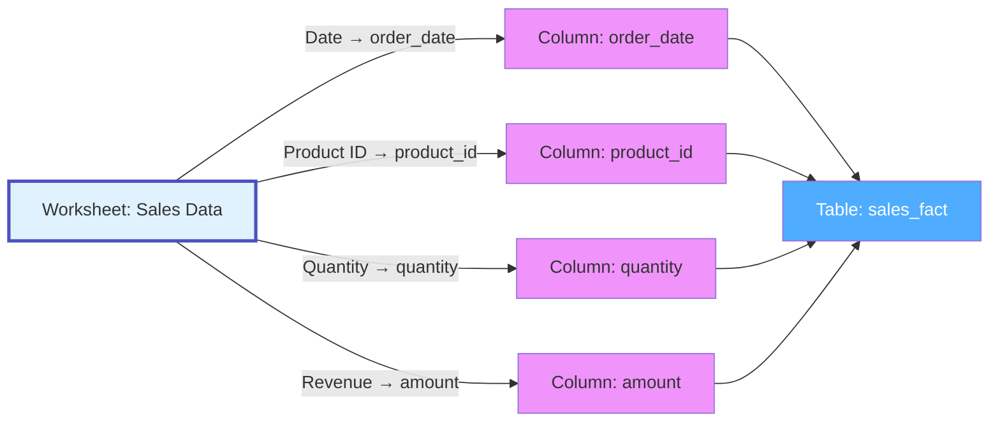

# Worksheet

**Individual sheets/tabs within spreadsheets - structured data with columns and rows**

---

## Overview

The **Worksheet** (or Sheet) entity represents an individual worksheet/tab within a spreadsheet file. Worksheets contain structured tabular data with named columns, typed values, formulas, and formatting. They are analogous to database tables but in collaborative spreadsheet form.

**Hierarchy**:


---

## Schema Specifications

View the complete Worksheet schema in your preferred format:

=== "JSON Schema"

    **Complete JSON Schema Definition**

    ```json
    {
      "$id": "https://open-metadata.org/schema/entity/data/worksheet.json",
      "$schema": "http://json-schema.org/draft-07/schema#",
      "title": "Worksheet",
      "$comment": "@om-entity-type",
      "description": "This schema defines the Worksheet entity. A Worksheet is a tab or sheet within a spreadsheet file (Google Sheets, Excel) that contains structured data.",
      "type": "object",
      "javaType": "org.openmetadata.schema.entity.data.Worksheet",
      "javaInterfaces": [
        "org.openmetadata.schema.EntityInterface"
      ],
      "properties": {
        "id": {
          "description": "Unique identifier of this worksheet instance.",
          "$ref": "../../type/basic.json#/definitions/uuid"
        },
        "name": {
          "description": "Name of the worksheet.",
          "$ref": "../../type/basic.json#/definitions/entityName"
        },
        "fullyQualifiedName": {
          "description": "Fully qualified name of the worksheet.",
          "$ref": "../../type/basic.json#/definitions/fullyQualifiedEntityName"
        },
        "displayName": {
          "description": "Display Name that identifies this worksheet.",
          "type": "string"
        },
        "description": {
          "description": "Description of the worksheet.",
          "$ref": "../../type/basic.json#/definitions/markdown"
        },
        "spreadsheet": {
          "description": "Reference to the parent File entity (with fileType=Spreadsheet)",
          "$ref": "../../type/entityReference.json"
        },
        "service": {
          "description": "Link to the drive service",
          "$ref": "../../type/entityReference.json"
        },
        "serviceType": {
          "description": "Type of drive service",
          "$ref": "../../entity/services/driveService.json#/definitions/driveServiceType"
        },
        "worksheetId": {
          "description": "Native worksheet/tab ID",
          "type": "string"
        },
        "index": {
          "description": "Position/index of the worksheet in the spreadsheet",
          "type": "integer"
        },
        "rowCount": {
          "description": "Number of rows in the worksheet",
          "type": "integer"
        },
        "columnCount": {
          "description": "Number of columns in the worksheet",
          "type": "integer"
        },
        "columns": {
          "description": "Column definitions if structured data",
          "type": "array",
          "items": {
            "$ref": "../data/table.json#/definitions/column"
          },
          "default": []
        },
        "sampleData": {
          "description": "Sample data from the worksheet",
          "$ref": "../data/table.json#/definitions/tableData"
        },
        "isHidden": {
          "description": "Whether the worksheet is hidden",
          "type": "boolean",
          "default": false
        },
        "sourceUrl": {
          "description": "Link to this worksheet in the source system.",
          "$ref": "../../type/basic.json#/definitions/sourceUrl"
        },
        "href": {
          "description": "Link to the resource corresponding to this worksheet.",
          "$ref": "../../type/basic.json#/definitions/href"
        },
        "owners": {
          "description": "Owners of this worksheet.",
          "$ref": "../../type/entityReferenceList.json"
        },
        "followers": {
          "description": "Followers of this entity.",
          "$ref": "../../type/entityReferenceList.json"
        },
        "tags": {
          "description": "Tags associated with this worksheet.",
          "type": "array",
          "items": {
            "$ref": "../../type/tagLabel.json"
          },
          "default": null
        },
        "version": {
          "description": "Metadata version of the entity.",
          "$ref": "../../type/entityHistory.json#/definitions/entityVersion"
        },
        "updatedAt": {
          "description": "Last update time corresponding to the new version of the entity in Unix epoch time milliseconds.",
          "$ref": "../../type/basic.json#/definitions/timestamp"
        },
        "updatedBy": {
          "description": "User who made the update.",
          "type": "string"
        },
        "impersonatedBy": {
          "description": "Bot user that performed the action on behalf of the actual user.",
          "$ref": "../../type/basic.json#/definitions/impersonatedBy"
        },
        "changeDescription": {
          "description": "Change that lead to this version of the entity.",
          "$ref": "../../type/entityHistory.json#/definitions/changeDescription"
        },
        "incrementalChangeDescription": {
          "description": "Change that lead to this version of the entity.",
          "$ref": "../../type/entityHistory.json#/definitions/changeDescription"
        },
        "deleted": {
          "description": "When `true` indicates the entity has been soft deleted.",
          "type": "boolean",
          "default": false
        },
        "domains": {
          "description": "Domains the Worksheet belongs to.",
          "$ref": "../../type/entityReferenceList.json"
        },
        "dataProducts": {
          "description": "List of data products this entity is part of.",
          "$ref": "../../type/entityReferenceList.json"
        },
        "lifeCycle": {
          "description": "Life Cycle of the entity",
          "$ref": "../../type/lifeCycle.json"
        },
        "sourceHash": {
          "description": "Source hash of the entity",
          "type": "string",
          "minLength": 1,
          "maxLength": 32
        },
        "extension": {
          "description": "Entity extension data with custom attributes added to the entity.",
          "$ref": "../../type/basic.json#/definitions/entityExtension"
        },
        "votes": {
          "description": "Votes on the entity.",
          "$ref": "../../type/votes.json"
        },
        "certification": {
          "$ref": "../../type/assetCertification.json"
        },
        "usageSummary": {
          "description": "Latest usage information for this worksheet.",
          "$ref": "../../type/usageDetails.json",
          "default": null
        },
        "entityStatus": {
          "description": "Status of the Worksheet.",
          "$ref": "../../type/status.json"
        }
      },
      "required": ["id", "name", "spreadsheet", "service"],
      "additionalProperties": false
    }
    ```

=== "RDF (Turtle)"

    **RDF/OWL Ontology Representation**

    ```turtle
    @prefix om: <https://open-metadata.org/schema/> .
    @prefix om-entity: <https://open-metadata.org/schema/entity/data/> .
    @prefix rdf: <http://www.w3.org/1999/02/22-rdf-syntax-ns#> .
    @prefix rdfs: <http://www.w3.org/2000/01/rdf-schema#> .
    @prefix owl: <http://www.w3.org/2002/07/owl#> .
    @prefix xsd: <http://www.w3.org/2001/XMLSchema#> .
    @prefix dcterms: <http://purl.org/dc/terms/> .

    # Worksheet Class Definition
    om-entity:Worksheet a owl:Class ;
        rdfs:label "Worksheet" ;
        rdfs:comment "A tab or sheet within a spreadsheet file (Google Sheets, Excel) that contains structured data." ;
        rdfs:subClassOf om:Entity ;
        rdfs:isDefinedBy <https://open-metadata.org/schema/entity/data/worksheet.json> .

    # Core Identity Properties
    om-entity:worksheetId a owl:DatatypeProperty ;
        rdfs:label "worksheet id" ;
        rdfs:comment "Native worksheet/tab ID from the source system" ;
        rdfs:domain om-entity:Worksheet ;
        rdfs:range xsd:string .

    om-entity:index a owl:DatatypeProperty ;
        rdfs:label "index" ;
        rdfs:comment "Position/index of the worksheet in the spreadsheet" ;
        rdfs:domain om-entity:Worksheet ;
        rdfs:range xsd:integer .

    # Structural Properties
    om-entity:rowCount a owl:DatatypeProperty ;
        rdfs:label "row count" ;
        rdfs:comment "Number of rows in the worksheet" ;
        rdfs:domain om-entity:Worksheet ;
        rdfs:range xsd:integer .

    om-entity:columnCount a owl:DatatypeProperty ;
        rdfs:label "column count" ;
        rdfs:comment "Number of columns in the worksheet" ;
        rdfs:domain om-entity:Worksheet ;
        rdfs:range xsd:integer .

    om-entity:isHidden a owl:DatatypeProperty ;
        rdfs:label "is hidden" ;
        rdfs:comment "Whether the worksheet is hidden in the spreadsheet" ;
        rdfs:domain om-entity:Worksheet ;
        rdfs:range xsd:boolean .

    # Relationships
    om-entity:spreadsheet a owl:ObjectProperty ;
        rdfs:label "spreadsheet" ;
        rdfs:comment "Reference to the parent File entity (with fileType=Spreadsheet)" ;
        rdfs:domain om-entity:Worksheet ;
        rdfs:range om-entity:File .

    om-entity:service a owl:ObjectProperty ;
        rdfs:label "service" ;
        rdfs:comment "Link to the drive service" ;
        rdfs:domain om-entity:Worksheet ;
        rdfs:range om:Service .

    om-entity:hasColumn a owl:ObjectProperty ;
        rdfs:label "has column" ;
        rdfs:comment "Column definitions if structured data" ;
        rdfs:domain om-entity:Worksheet ;
        rdfs:range om-entity:Column .

    om-entity:sampleData a owl:ObjectProperty ;
        rdfs:label "sample data" ;
        rdfs:comment "Sample data from the worksheet" ;
        rdfs:domain om-entity:Worksheet ;
        rdfs:range om:TableData .

    # Metadata Properties
    om-entity:sourceUrl a owl:DatatypeProperty ;
        rdfs:label "source URL" ;
        rdfs:comment "Link to this worksheet in the source system" ;
        rdfs:domain om-entity:Worksheet ;
        rdfs:range xsd:anyURI .

    om-entity:usageSummary a owl:ObjectProperty ;
        rdfs:label "usage summary" ;
        rdfs:comment "Latest usage information for this worksheet" ;
        rdfs:domain om-entity:Worksheet ;
        rdfs:range om:UsageDetails .
    ```

=== "JSON-LD Context"

    **JSON-LD Context for Semantic Interoperability**

    ```json
    {
      "@context": {
        "@vocab": "https://open-metadata.org/schema/entity/data/",
        "om": "https://open-metadata.org/schema/",
        "xsd": "http://www.w3.org/2001/XMLSchema#",
        "rdf": "http://www.w3.org/1999/02/22-rdf-syntax-ns#",
        "rdfs": "http://www.w3.org/2000/01/rdf-schema#",

        "Worksheet": {
          "@id": "Worksheet",
          "@type": "@id"
        },
        "id": {
          "@id": "@id",
          "@type": "@id"
        },
        "name": {
          "@id": "om:name",
          "@type": "xsd:string"
        },
        "fullyQualifiedName": {
          "@id": "om:fullyQualifiedName",
          "@type": "xsd:string"
        },
        "displayName": {
          "@id": "om:displayName",
          "@type": "xsd:string"
        },
        "description": {
          "@id": "om:description",
          "@type": "xsd:string"
        },
        "spreadsheet": {
          "@id": "spreadsheet",
          "@type": "@id"
        },
        "service": {
          "@id": "service",
          "@type": "@id"
        },
        "serviceType": {
          "@id": "om:serviceType",
          "@type": "xsd:string"
        },
        "worksheetId": {
          "@id": "worksheetId",
          "@type": "xsd:string"
        },
        "index": {
          "@id": "index",
          "@type": "xsd:integer"
        },
        "rowCount": {
          "@id": "rowCount",
          "@type": "xsd:integer"
        },
        "columnCount": {
          "@id": "columnCount",
          "@type": "xsd:integer"
        },
        "columns": {
          "@id": "hasColumn",
          "@type": "@id",
          "@container": "@set"
        },
        "sampleData": {
          "@id": "sampleData",
          "@type": "@id"
        },
        "isHidden": {
          "@id": "isHidden",
          "@type": "xsd:boolean"
        },
        "sourceUrl": {
          "@id": "sourceUrl",
          "@type": "xsd:anyURI"
        },
        "href": {
          "@id": "om:href",
          "@type": "xsd:anyURI"
        },
        "owners": {
          "@id": "om:owner",
          "@type": "@id",
          "@container": "@set"
        },
        "followers": {
          "@id": "om:follower",
          "@type": "@id",
          "@container": "@set"
        },
        "tags": {
          "@id": "om:tag",
          "@type": "@id",
          "@container": "@set"
        },
        "domains": {
          "@id": "om:domain",
          "@type": "@id",
          "@container": "@set"
        },
        "dataProducts": {
          "@id": "om:dataProduct",
          "@type": "@id",
          "@container": "@set"
        },
        "version": {
          "@id": "om:version",
          "@type": "xsd:string"
        },
        "updatedAt": {
          "@id": "om:updatedAt",
          "@type": "xsd:dateTime"
        },
        "updatedBy": {
          "@id": "om:updatedBy",
          "@type": "xsd:string"
        },
        "deleted": {
          "@id": "om:deleted",
          "@type": "xsd:boolean"
        },
        "usageSummary": {
          "@id": "usageSummary",
          "@type": "@id"
        },
        "entityStatus": {
          "@id": "om:entityStatus",
          "@type": "xsd:string"
        }
      }
    }
    ```

---

## Worksheet Schema

Worksheets have structured schemas similar to database tables:

### Example: Sales Data Worksheet

```json
{
  "id": "a1b2c3d4-e5f6-7890-abcd-ef1234567890",
  "name": "Daily_Sales",
  "fullyQualifiedName": "googleDrive.Reports.Sales_Report_2024.Daily_Sales",
  "displayName": "Daily Sales",
  "spreadsheet": {
    "id": "b2c3d4e5-f6a7-8901-bcde-f12345678901",
    "type": "file",
    "name": "Sales_Report_2024",
    "fullyQualifiedName": "googleDrive.Reports.Sales_Report_2024"
  },
  "service": {
    "id": "c3d4e5f6-a7b8-9012-cdef-123456789012",
    "type": "driveService",
    "name": "googleDrive"
  },
  "worksheetId": "123456789",
  "index": 0,
  "columns": [
    {
      "name": "Date",
      "dataType": "DATE",
      "ordinalPosition": 1,
      "description": "Transaction date"
    },
    {
      "name": "Product_ID",
      "dataType": "VARCHAR",
      "ordinalPosition": 2,
      "tags": [{"tagFQN": "PII.ProductIdentifier"}]
    },
    {
      "name": "Quantity",
      "dataType": "INT",
      "ordinalPosition": 3
    },
    {
      "name": "Revenue",
      "dataType": "DECIMAL",
      "ordinalPosition": 4,
      "description": "Calculated as Quantity * Price"
    }
  ],
  "columnCount": 4,
  "rowCount": 1500,
  "isHidden": false
}
```

---

## Use Cases

### Data Pipeline Source

Worksheet as ETL source:

```json
{
  "id": "d4e5f6a7-b8c9-0123-def4-56789abcdef0",
  "name": "Customer_Master",
  "fullyQualifiedName": "googleDrive.CRM.CRM_Export.Customer_Master",
  "displayName": "Customer Master",
  "spreadsheet": {
    "id": "e5f6a7b8-c9d0-1234-ef56-789abcdef012",
    "type": "file",
    "name": "CRM_Export",
    "fullyQualifiedName": "googleDrive.CRM.CRM_Export"
  },
  "service": {
    "id": "f6a7b8c9-d0e1-2345-f678-9abcdef01234",
    "type": "driveService",
    "name": "googleDrive"
  },
  "worksheetId": "987654321",
  "index": 0,
  "columns": [
    {"name": "customer_id", "dataType": "VARCHAR", "ordinalPosition": 1},
    {"name": "name", "dataType": "VARCHAR", "ordinalPosition": 2},
    {"name": "email", "dataType": "VARCHAR", "ordinalPosition": 3},
    {"name": "created_date", "dataType": "DATE", "ordinalPosition": 4}
  ],
  "rowCount": 50000,
  "columnCount": 4,
  "tags": [
    {"tagFQN": "CRM"},
    {"tagFQN": "SourceData"}
  ]
}
```

### Reference Data

Worksheet as lookup table:

```json
{
  "id": "a7b8c9d0-e1f2-3456-7890-abcdef123456",
  "name": "Country_Codes",
  "fullyQualifiedName": "oneDrive.Reference.Reference_Data.Country_Codes",
  "displayName": "Country Codes",
  "spreadsheet": {
    "id": "b8c9d0e1-f2a3-4567-890a-bcdef1234567",
    "type": "file",
    "name": "Reference_Data",
    "fullyQualifiedName": "oneDrive.Reference.Reference_Data"
  },
  "service": {
    "id": "c9d0e1f2-a3b4-5678-90ab-cdef12345678",
    "type": "driveService",
    "name": "oneDrive"
  },
  "worksheetId": "111222333",
  "index": 0,
  "columns": [
    {"name": "country_code", "dataType": "VARCHAR", "ordinalPosition": 1},
    {"name": "country_name", "dataType": "VARCHAR", "ordinalPosition": 2},
    {"name": "region", "dataType": "VARCHAR", "ordinalPosition": 3}
  ],
  "rowCount": 195,
  "columnCount": 3
}
```

### Financial Model

Complex worksheet with formulas:

```json
{
  "id": "d0e1f2a3-b4c5-6789-0abc-def123456789",
  "name": "Revenue_Forecast",
  "fullyQualifiedName": "googleDrive.Finance.Q4_Model.Revenue_Forecast",
  "displayName": "Revenue Forecast",
  "spreadsheet": {
    "id": "e1f2a3b4-c5d6-7890-abcd-ef1234567890",
    "type": "file",
    "name": "Q4_Model",
    "fullyQualifiedName": "googleDrive.Finance.Q4_Model"
  },
  "service": {
    "id": "f2a3b4c5-d6e7-8901-bcde-f12345678901",
    "type": "driveService",
    "name": "googleDrive"
  },
  "worksheetId": "444555666",
  "index": 0,
  "columns": [
    {"name": "Month", "dataType": "DATE", "ordinalPosition": 1},
    {"name": "Base_Revenue", "dataType": "DECIMAL", "ordinalPosition": 2},
    {"name": "Growth_Rate", "dataType": "DECIMAL", "ordinalPosition": 3},
    {"name": "Forecasted_Revenue", "dataType": "DECIMAL", "ordinalPosition": 4}
  ],
  "rowCount": 12,
  "columnCount": 4,
  "owners": [
    {
      "id": "a3b4c5d6-e7f8-9012-3456-789abcdef012",
      "type": "team",
      "name": "finance-team"
    }
  ],
  "tags": [
    {"tagFQN": "Financial"},
    {"tagFQN": "Forecast"},
    {"tagFQN": "Q4_2024"}
  ]
}
```

---

## Column-Level Lineage

Track which worksheet columns map to table columns:



---

## Custom Properties

This entity supports custom properties through the `extension` field.
Common custom properties include:

- **Data Classification**: Sensitivity level
- **Cost Center**: Billing allocation
- **Retention Period**: Data retention requirements
- **Application Owner**: Owning application/team

See [Custom Properties](../../metadata-specifications/custom-properties.md)
for details on defining and using custom properties.

---

## Followers

Users can follow worksheets to receive notifications about data updates, column changes, and formula modifications. See **[Followers](../../metadata-specifications/followers.md)** for details.

---

## API Operations

All Worksheet operations are available under the `/v1/drives/worksheets` endpoint.

### List Worksheets

Get a list of worksheets, optionally filtered by spreadsheet.

```http
GET /v1/drives/worksheets
Query Parameters:
  - fields: Fields to include (columns, spreadsheet, owners, tags, etc.)
  - spreadsheet: Filter by parent spreadsheet FQN
  - limit: Number of results (1-1000000, default 10)
  - before/after: Cursor-based pagination
  - include: all | deleted | non-deleted (default: non-deleted)

Response: WorksheetList
```

### Create Worksheet

Create a new worksheet in a spreadsheet.

```http
POST /v1/drives/worksheets
Content-Type: application/json

{
  "name": "Daily_Sales",
  "displayName": "Daily Sales",
  "spreadsheet": {
    "id": "b2c3d4e5-f6a7-8901-bcde-f12345678901",
    "type": "file"
  },
  "service": {
    "id": "c3d4e5f6-a7b8-9012-cdef-123456789012",
    "type": "driveService"
  },
  "worksheetId": "123456789",
  "index": 0,
  "columns": [
    {
      "name": "Date",
      "dataType": "DATE",
      "ordinalPosition": 1
    },
    {
      "name": "Amount",
      "dataType": "DECIMAL",
      "ordinalPosition": 2
    }
  ],
  "isHidden": false
}

Response: Worksheet
```

### Get Worksheet by Name

Get a worksheet by its fully qualified name.

```http
GET /v1/drives/worksheets/name/{fqn}
Query Parameters:
  - fields: Fields to include (columns, owner, tags, spreadsheet, etc.)
  - include: all | deleted | non-deleted

Example:
GET /v1/drives/worksheets/name/googleDrive.Sales_Report.Daily_Sales?fields=columns,owner,tags

Response: Worksheet
```

### Get Worksheet by ID

Get a worksheet by its unique identifier.

```http
GET /v1/drives/worksheets/{id}
Query Parameters:
  - fields: Fields to include
  - include: all | deleted | non-deleted

Response: Worksheet
```

### Update Worksheet

Update a worksheet using JSON Patch.

```http
PATCH /v1/drives/worksheets/name/{fqn}
Content-Type: application/json-patch+json

[
  {"op": "add", "path": "/tags/-", "value": {"tagFQN": "PII.Sensitive"}},
  {"op": "replace", "path": "/description", "value": "Updated worksheet description"},
  {"op": "add", "path": "/columns/-", "value": {
    "name": "Region",
    "dataType": "VARCHAR",
    "ordinalPosition": 3
  }}
]

Response: Worksheet
```

### Create or Update Worksheet

Create a new worksheet or update if it exists.

```http
PUT /v1/drives/worksheets
Content-Type: application/json

{
  "name": "Monthly_Summary",
  "displayName": "Monthly Summary",
  "spreadsheet": {
    "id": "f3a4b5c6-d7e8-9012-3456-789abcdef012",
    "type": "file"
  },
  "service": {
    "id": "a4b5c6d7-e8f9-0123-4567-89abcdef0123",
    "type": "driveService"
  },
  "worksheetId": "777888999",
  "index": 1,
  "columns": [...]
}

Response: Worksheet
```

### Delete Worksheet

Delete a worksheet by fully qualified name.

```http
DELETE /v1/drives/worksheets/name/{fqn}
Query Parameters:
  - hardDelete: Permanently delete (default: false)

Response: 200 OK
```

### Get Worksheet Versions

Get all versions of a worksheet.

```http
GET /v1/drives/worksheets/{id}/versions

Response: EntityHistory
```

### Get Specific Version

Get a specific version of a worksheet.

```http
GET /v1/drives/worksheets/{id}/versions/{version}

Response: Worksheet
```

### Follow Worksheet

Add a follower to a worksheet.

```http
PUT /v1/drives/worksheets/{id}/followers/{userId}

Response: ChangeEvent
```

### Get Followers

Get all followers of a worksheet.

```http
GET /v1/drives/worksheets/{id}/followers

Response: EntityReference[]
```

### Vote on Worksheet

Upvote or downvote a worksheet.

```http
PUT /v1/drives/worksheets/{id}/vote
Content-Type: application/json

{
  "vote": "upvote"
}

Response: ChangeEvent
```

### Bulk Operations

Create or update multiple worksheets.

```http
PUT /v1/drives/worksheets/bulk
Content-Type: application/json

{
  "entities": [...]
}

Response: BulkOperationResult
```

---

## Related Documentation

- **[Spreadsheet](spreadsheet.md)** - Parent spreadsheet file
- **[Directory](directory.md)** - Containing folder
- **[Drive Service](drive-service.md)** - Drive service
- **[Column](../databases/column.md)** - Similar to table columns
- **[Table](../databases/table.md)** - Database tables loaded from worksheets
- **[Pipeline](../pipelines/pipeline.md)** - Pipelines consuming worksheets
