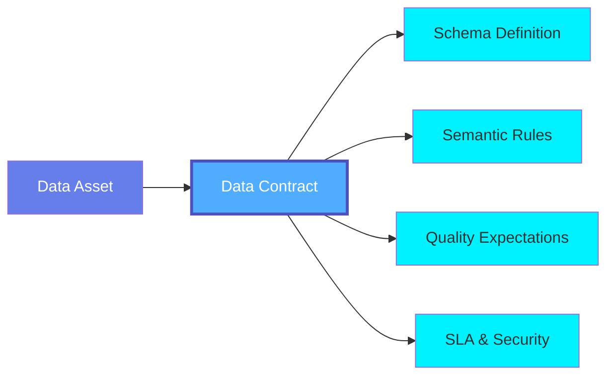
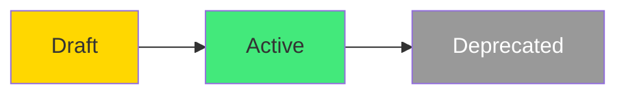

# Data Contract

A **Data Contract** is a formal agreement that defines the structure, quality, semantics, and SLAs for a data asset. Data contracts establish clear expectations between data producers and consumers, ensuring data reliability, compliance, and trust across the organization.

## Overview

Data Contracts in OpenMetadata provide:

- **Schema Definition**: Explicit schema with data types, constraints, and validation rules
- **Semantic Rules**: Business logic and data validation rules
- **Quality Expectations**: Test cases and quality checks to validate data
- **SLA Definitions**: Service level agreements for refresh frequency, latency, and retention
- **Security Policies**: Data classification, access policies, and row-level filters
- **Terms of Use**: Clear guidelines for human and AI agent consumption
- **Ownership & Review**: Clear ownership and reviewer assignments
- **Version Tracking**: History of contract updates and changes
- **Validation Results**: Latest contract validation status and results

Data contracts enable:
- Preventing breaking changes
- Ensuring data quality
- Building trust in data
- Enabling self-service analytics
- Meeting regulatory requirements
- Reducing data incidents

## Hierarchy



**Click on any node to learn more about that entity.**

## Relationships

Data Contracts have relationships with various entities in the metadata ecosystem:

```mermaid
graph TD
    subgraph Contract Structure
        A[DataContract:<br/>Customer Data] --> B1[Schema:<br/>Columns & Types]
        A --> B2[Semantics:<br/>Business Rules]
        A --> B3[SLA:<br/>Refresh & Latency]
        A --> B4[Security:<br/>Access Policies]
    end

    subgraph Applied To
        A -.->|entity| C1[Table:<br/>customers]
        A -.->|entity| C2[Topic:<br/>customer-events]
    end

    subgraph Schema Definition
        B1 -.->|defines| D1[Column:<br/>customer_id INT]
        B1 -.->|defines| D2[Column:<br/>email VARCHAR]
        B1 -.->|defines| D3[Constraint:<br/>NOT NULL]
    end

    subgraph Quality & Testing
        A -.->|qualityExpectations| E1[TestCase:<br/>Null Check]
        A -.->|qualityExpectations| E2[TestCase:<br/>Uniqueness Check]
        A -.->|testSuite| E3[TestSuite:<br/>Customer Tests]
    end

    subgraph Ownership & Review
        A -.->|owners| F1[Team:<br/>Data Engineering]
        A -.->|reviewers| F2[User:<br/>Data Lead]
    end

    subgraph Security & Access
        B4 -.->|policies| G1[Policy:<br/>Access Control]
        B4 -.->|rowFilters| G2[Filter:<br/>Region Filter]
    end

    subgraph Validation
        A -.->|latestResult| H1[Result:<br/>Validation Status]
        A -.->|contractUpdates| H2[History:<br/>Update Log]
    end

    style A fill:#4facfe,color:#fff,stroke:#4c51bf,stroke-width:3px
    style B1 fill:#00f2fe,color:#333
    style B2 fill:#00f2fe,color:#333
    style B3 fill:#00f2fe,color:#333
    style B4 fill:#00f2fe,color:#333
    style C1 fill:#764ba2,color:#fff
    style C2 fill:#764ba2,color:#fff
    style D1 fill:#ffd700,color:#333
    style D2 fill:#ffd700,color:#333
    style D3 fill:#ffd700,color:#333
    style E1 fill:#f5576c,color:#fff
    style E2 fill:#f5576c,color:#fff
    style E3 fill:#f5576c,color:#fff
    style F1 fill:#43e97b,color:#333
    style F2 fill:#43e97b,color:#333
    style G1 fill:#fa709a,color:#fff
    style G2 fill:#fa709a,color:#fff
    style H1 fill:#f093fb,color:#333
    style H2 fill:#f093fb,color:#333

    click A "#data-contract" "Data Contract"
    click C1 "../data-assets/databases/table/" "Table"
    click C2 "../data-assets/messaging/topic/" "Topic"
    click D1 "../data-assets/databases/column/" "Column"
    click E1 "../data-quality/test-case/" "Test Case"
    click E3 "../data-quality/test-suite/" "Test Suite"
    click F1 "../teams-users/team/" "Team"
    click F2 "../teams-users/user/" "User"
    click G1 "../governance/policy/" "Policy"
```



**Key Relationships:**

- **Contract Structure**: Schema, semantics, SLA, and security definitions
- **Applied To**: Tables, topics, and other data assets governed by the contract
- **Schema Definition**: Column definitions, data types, and constraints
- **Quality & Testing**: Test cases, test suites, and quality expectations
- **Ownership & Review**: Owners and reviewers responsible for the contract
- **Security & Access**: Access policies and row-level filtering
- **Validation**: Latest validation results and contract update history

## Schema Specifications

=== "JSON Schema"

    ```json
    {
      "$id": "https://open-metadata.org/schema/entity/data/dataContract.json",
      "$schema": "http://json-schema.org/draft-07/schema#",
      "title": "DataContract",
      "description": "A `DataContract` entity defines the schema and quality guarantees for a data asset.",
      "type": "object",
      "javaType": "org.openmetadata.schema.entity.data.DataContract",
      "javaInterfaces": ["org.openmetadata.schema.EntityInterface"],
      "definitions": {
        "contractStatus": {
          "javaType": "org.openmetadata.schema.type.ContractStatus",
          "description": "Status of the data contract.",
          "type": "string",
          "enum": ["Draft", "Active", "Deprecated"]
        },
        "contractUpdate": {
          "type": "object",
          "javaType": "org.openmetadata.schema.type.ContractUpdate",
          "description": "Record of updates to the data contract.",
          "properties": {
            "timestamp": {
              "description": "Timestamp when the contract was updated.",
              "$ref": "../../type/basic.json#/definitions/timestamp"
            },
            "updatedBy": {
              "description": "User who updated the contract.",
              "type": "string"
            },
            "impersonatedBy": {
              "description": "Bot user that performed the action on behalf of the actual user.",
              "$ref": "../../type/basic.json#/definitions/impersonatedBy"
            },
            "changeDescription": {
              "description": "Description of changes made to the contract.",
              "$ref": "../../type/basic.json#/definitions/markdown"
            },
            "version": {
              "description": "Version number of the contract after the update.",
              "type": "string"
            }
          },
          "required": ["timestamp", "updatedBy", "version"]
        },
        "rowFilter": {
          "type": "object",
          "description": "Filter that defines what subset of the data is accessible to certain consumers",
          "properties": {
            "columnName": {
              "type": "string",
              "description": "Column to apply the filter"
            },
            "values": {
              "type": "array",
              "description": "Values applied to the filter",
              "items": {
                "type": "string"
              }
            }
          }
        },
        "policy": {
          "type": "object",
          "description": "Intended consumers of the data (e.g. internal teams, external partners, etc.)",
          "properties": {
            "accessPolicy": {
              "type": "string",
              "description": "Reference to an access policy ID or name that should govern this data"
            },
            "identities": {
              "type": "array",
              "description": "List of groups that are intended consumers of the data",
              "items": {
                "type": "string"
              }
            },
            "rowFilters": {
              "type": "array",
              "description": "List of filters that define what subset of the data is accessible to the consumers",
              "items": {
                "$ref": "#/definitions/rowFilter"
              }
            }
          }
        },
        "contractSecurity": {
          "type": "object",
          "description": "Security and access policy expectations",
          "properties": {
            "dataClassification": {
              "type": "string",
              "description": "Expected data classification (e.g. Confidential, PII, etc.)"
            },
            "policies": {
              "type": "array",
              "description": "Intended consumers of the data (e.g. internal teams, external partners, etc.)",
              "items": {
                "$ref": "#/definitions/policy"
              }
            }
          }
        },
        "contractSLA": {
          "type": "object",
          "description": "Service Level Agreement expectations (timeliness, availability, etc.)",
          "properties": {
            "refreshFrequency": {
              "type": "object",
              "description": "Expected frequency of data updates (e.g. every 1 day)",
              "properties": {
                "interval": { "type": "integer" },
                "unit": { "type": "string", "enum": ["hour", "day", "week", "month", "year"] }
              },
              "required": ["interval", "unit"]
            },
            "maxLatency": {
              "type": "object",
              "description": "Maximum acceptable latency between data generation and availability (e.g. 4 hours)",
              "properties": {
                "value": { "type": "integer" },
                "unit": { "type": "string", "enum": ["minute", "hour", "day"] }
              },
              "required": ["value", "unit"]
            },
            "availabilityTime": {
              "type": "string",
              "description": "Time of day by which data is expected to be available (e.g. \"09:00 UTC\")"
            },
            "timezone": {
              "type": "string",
              "description": "Timezone for the availability time. UTC by default.",
              "enum": ["GMT-11:00 (Pacific/Niue)", "GMT-10:00 (Pacific/Honolulu)", "GMT+00:00 (Europe/London)", "..."]
            },
            "retention": {
              "type": "object",
              "description": "How long the data is retained (if relevant)",
              "properties": {
                "period": { "type": "integer" },
                "unit": { "type": "string", "enum": ["day", "week", "month", "year"] }
              },
              "required": ["period", "unit"]
            },
            "columnName": {
              "type": "string",
              "description": "Column that represents the refresh time of the data (if applicable)"
            }
          }
        }
      },
      "properties": {
        "id": {
          "description": "Unique identifier of this data contract instance.",
          "$ref": "../../type/basic.json#/definitions/uuid"
        },
        "name": {
          "description": "Name of the data contract.",
          "$ref": "../../type/basic.json#/definitions/entityName"
        },
        "displayName": {
          "description": "Display name of the data contract.",
          "type": "string"
        },
        "fullyQualifiedName": {
          "description": "Fully qualified name of the data contract.",
          "$ref": "../../type/basic.json#/definitions/fullyQualifiedEntityName"
        },
        "description": {
          "description": "Description of the data contract.",
          "$ref": "../../type/basic.json#/definitions/markdown"
        },
        "version": {
          "description": "Metadata version of the entity.",
          "$ref": "../../type/entityHistory.json#/definitions/entityVersion"
        },
        "updatedAt": {
          "description": "Last update time corresponding to the new version of the entity in Unix epoch time milliseconds.",
          "$ref": "../../type/basic.json#/definitions/timestamp"
        },
        "updatedBy": {
          "description": "User who made the update.",
          "type": "string"
        },
        "impersonatedBy": {
          "description": "Bot user that performed the action on behalf of the actual user.",
          "$ref": "../../type/basic.json#/definitions/impersonatedBy"
        },
        "createdAt": {
          "description": "Timestamp in Unix epoch time milliseconds corresponding to when the data contract was created.",
          "$ref": "../../type/basic.json#/definitions/timestamp"
        },
        "createdBy": {
          "description": "User or Bot who created the data contract.",
          "type": "string"
        },
        "href": {
          "description": "Link to this data contract resource.",
          "$ref": "../../type/basic.json#/definitions/href"
        },
        "entityStatus": {
          "description": "Approval status of the data contract.",
          "$ref": "../../type/status.json",
          "default": "Draft"
        },
        "entity": {
          "description": "Reference to the data entity (table, topic, etc.) this contract applies to.",
          "$ref": "../../type/entityReference.json"
        },
        "testSuite": {
          "description": "Reference to the test suite that contains tests related to this data contract.",
          "$ref": "../../type/entityReference.json"
        },
        "schema": {
          "description": "Schema definition for the data contract.",
          "type": "array",
          "items": {
            "$ref": "./table.json#/definitions/column"
          }
        },
        "semantics": {
          "description": "Semantics rules defined in the data contract.",
          "type": "array",
          "items": {
            "$ref": "../../type/basic.json#/definitions/semanticsRule"
          }
        },
        "termsOfUse": {
          "description": "Terms of use for the data contract for both human and AI agents consumption.",
          "$ref": "../../type/basic.json#/definitions/markdown"
        },
        "security": {
          "description": "Security and access policy expectations defined in the data contract.",
          "$ref": "#/definitions/contractSecurity"
        },
        "sla": {
          "description": "Service Level Agreement expectations defined in the data contract.",
          "$ref": "#/definitions/contractSLA"
        },
        "qualityExpectations": {
          "description": "Quality expectations defined in the data contract.",
          "type": "array",
          "items": {
            "$ref": "../../type/entityReference.json"
          }
        },
        "contractUpdates": {
          "description": "History of updates to the data contract.",
          "type": "array",
          "items": {
            "$ref": "#/definitions/contractUpdate"
          }
        },
        "owners": {
          "description": "Owners of this data contract.",
          "$ref": "../../type/entityReferenceList.json"
        },
        "reviewers": {
          "description": "User references of the reviewers for this data contract.",
          "$ref": "../../type/entityReferenceList.json"
        },
        "effectiveFrom": {
          "description": "Date from which this data contract is effective.",
          "$ref": "../../type/basic.json#/definitions/dateTime"
        },
        "effectiveUntil": {
          "description": "Date until which this data contract is effective.",
          "$ref": "../../type/basic.json#/definitions/dateTime"
        },
        "changeDescription": {
          "description": "Change that led to this version of the entity.",
          "$ref": "../../type/entityHistory.json#/definitions/changeDescription"
        },
        "incrementalChangeDescription": {
          "description": "Incremental change description of the entity.",
          "$ref": "../../type/entityHistory.json#/definitions/changeDescription"
        },
        "deleted": {
          "description": "When `true` indicates the entity has been soft deleted.",
          "type": "boolean",
          "default": false
        },
        "sourceUrl": {
          "description": "Source URL of the data contract.",
          "$ref": "../../type/basic.json#/definitions/sourceUrl"
        },
        "latestResult": {
          "description": "Latest validation result for this data contract.",
          "type": "object",
          "properties": {
            "timestamp": {
              "$ref": "../../type/basic.json#/definitions/timestamp"
            },
            "status": {
              "$ref": "../../type/contractExecutionStatus.json"
            },
            "message": {
              "type": "string"
            },
            "resultId": {
              "$ref": "../../type/basic.json#/definitions/uuid"
            }
          }
        },
        "extension": {
          "description": "Entity extension data with custom attributes added to the entity.",
          "$ref": "../../type/basic.json#/definitions/entityExtension"
        }
      },
      "required": ["id", "name", "entity"],
      "additionalProperties": false
    }
    ```

=== "RDF (Turtle)"

    ```turtle
    @prefix om: <https://open-metadata.org/schema/> .
    @prefix om-entity: <https://open-metadata.org/schema/entity/> .
    @prefix om-contract: <https://open-metadata.org/schema/entity/data/> .
    @prefix rdf: <http://www.w3.org/1999/02/22-rdf-syntax-ns#> .
    @prefix rdfs: <http://www.w3.org/2000/01/rdf-schema#> .
    @prefix owl: <http://www.w3.org/2002/07/owl#> .
    @prefix xsd: <http://www.w3.org/2001/XMLSchema#> .
    @prefix dcterms: <http://purl.org/dc/terms/> .
    @prefix skos: <http://www.w3.org/2004/02/skos/core#> .
    @prefix prov: <http://www.w3.org/ns/prov#> .

    # Data Contract Class Definition
    om-contract:DataContract a owl:Class ;
        rdfs:label "Data Contract" ;
        rdfs:comment "A DataContract entity defines the schema and quality guarantees for a data asset" ;
        rdfs:subClassOf om-entity:Entity ;
        rdfs:isDefinedBy om: .

    # Contract Status Class
    om-contract:ContractStatus a owl:Class ;
        rdfs:label "Contract Status" ;
        rdfs:comment "Status of the data contract" ;
        rdfs:isDefinedBy om: .

    # Contract Security Class
    om-contract:ContractSecurity a owl:Class ;
        rdfs:label "Contract Security" ;
        rdfs:comment "Security and access policy expectations" ;
        rdfs:isDefinedBy om: .

    # Contract SLA Class
    om-contract:ContractSLA a owl:Class ;
        rdfs:label "Contract SLA" ;
        rdfs:comment "Service Level Agreement expectations (timeliness, availability, etc.)" ;
        rdfs:isDefinedBy om: .

    # Contract Update Class
    om-contract:ContractUpdate a owl:Class ;
        rdfs:label "Contract Update" ;
        rdfs:comment "Record of updates to the data contract" ;
        rdfs:isDefinedBy om: .

    # Object Properties
    om-contract:entity a owl:ObjectProperty ;
        rdfs:label "entity" ;
        rdfs:comment "Reference to the data entity (table, topic, etc.) this contract applies to" ;
        rdfs:domain om-contract:DataContract ;
        rdfs:range om-entity:Entity .

    om-contract:testSuite a owl:ObjectProperty ;
        rdfs:label "test suite" ;
        rdfs:comment "Reference to the test suite that contains tests related to this data contract" ;
        rdfs:domain om-contract:DataContract ;
        rdfs:range om-entity:TestSuite .

    om-contract:hasSecurity a owl:ObjectProperty ;
        rdfs:label "has security" ;
        rdfs:comment "Security and access policy expectations defined in the data contract" ;
        rdfs:domain om-contract:DataContract ;
        rdfs:range om-contract:ContractSecurity .

    om-contract:hasSLA a owl:ObjectProperty ;
        rdfs:label "has SLA" ;
        rdfs:comment "Service Level Agreement expectations defined in the data contract" ;
        rdfs:domain om-contract:DataContract ;
        rdfs:range om-contract:ContractSLA .

    om-contract:hasQualityExpectation a owl:ObjectProperty ;
        rdfs:label "has quality expectation" ;
        rdfs:comment "Quality expectations defined in the data contract" ;
        rdfs:domain om-contract:DataContract .

    om-contract:hasContractUpdate a owl:ObjectProperty ;
        rdfs:label "has contract update" ;
        rdfs:comment "History of updates to the data contract" ;
        rdfs:domain om-contract:DataContract ;
        rdfs:range om-contract:ContractUpdate .

    om-contract:hasOwner a owl:ObjectProperty ;
        rdfs:label "has owner" ;
        rdfs:comment "Owners of this data contract" ;
        rdfs:domain om-contract:DataContract .

    om-contract:hasReviewer a owl:ObjectProperty ;
        rdfs:label "has reviewer" ;
        rdfs:comment "Reviewers for this data contract" ;
        rdfs:domain om-contract:DataContract .

    # Datatype Properties
    om-contract:effectiveFrom a owl:DatatypeProperty ;
        rdfs:label "effective from" ;
        rdfs:comment "Date from which this data contract is effective" ;
        rdfs:domain om-contract:DataContract ;
        rdfs:range xsd:dateTime .

    om-contract:effectiveUntil a owl:DatatypeProperty ;
        rdfs:label "effective until" ;
        rdfs:comment "Date until which this data contract is effective" ;
        rdfs:domain om-contract:DataContract ;
        rdfs:range xsd:dateTime .

    om-contract:termsOfUse a owl:DatatypeProperty ;
        rdfs:label "terms of use" ;
        rdfs:comment "Terms of use for the data contract for both human and AI agents consumption" ;
        rdfs:domain om-contract:DataContract ;
        rdfs:range xsd:string .

    om-contract:entityStatus a owl:DatatypeProperty ;
        rdfs:label "entity status" ;
        rdfs:comment "Approval status of the data contract" ;
        rdfs:domain om-contract:DataContract ;
        rdfs:range xsd:string .

    om-contract:sourceUrl a owl:DatatypeProperty ;
        rdfs:label "source URL" ;
        rdfs:comment "Source URL of the data contract" ;
        rdfs:domain om-contract:DataContract ;
        rdfs:range xsd:anyURI .

    # Contract Status Individuals
    om-contract:Draft a om-contract:ContractStatus ;
        rdfs:label "Draft" ;
        skos:definition "Contract is in draft state" .

    om-contract:Active a om-contract:ContractStatus ;
        rdfs:label "Active" ;
        skos:definition "Contract is active and being enforced" .

    om-contract:Deprecated a om-contract:ContractStatus ;
        rdfs:label "Deprecated" ;
        skos:definition "Contract is deprecated" .
    ```

=== "JSON-LD Context"

    ```json
    {
      "@context": {
        "@vocab": "https://open-metadata.org/schema/entity/data/",
        "rdf": "http://www.w3.org/1999/02/22-rdf-syntax-ns#",
        "rdfs": "http://www.w3.org/2000/01/rdf-schema#",
        "owl": "http://www.w3.org/2002/07/owl#",
        "xsd": "http://www.w3.org/2001/XMLSchema#",
        "dcterms": "http://purl.org/dc/terms/",
        "skos": "http://www.w3.org/2004/02/skos/core#",
        "prov": "http://www.w3.org/ns/prov#",
        "om": "https://open-metadata.org/schema/",

        "DataContract": {
          "@id": "om:DataContract",
          "@type": "@id"
        },
        "id": {
          "@id": "om:id",
          "@type": "xsd:string"
        },
        "name": {
          "@id": "om:name",
          "@type": "xsd:string"
        },
        "displayName": {
          "@id": "om:displayName",
          "@type": "xsd:string"
        },
        "fullyQualifiedName": {
          "@id": "om:fullyQualifiedName",
          "@type": "xsd:string"
        },
        "description": {
          "@id": "dcterms:description",
          "@type": "xsd:string"
        },
        "version": {
          "@id": "om:version",
          "@type": "xsd:string"
        },
        "updatedAt": {
          "@id": "om:updatedAt",
          "@type": "xsd:dateTime"
        },
        "updatedBy": {
          "@id": "om:updatedBy",
          "@type": "xsd:string"
        },
        "createdAt": {
          "@id": "om:createdAt",
          "@type": "xsd:dateTime"
        },
        "createdBy": {
          "@id": "om:createdBy",
          "@type": "xsd:string"
        },
        "entityStatus": {
          "@id": "om:entityStatus",
          "@type": "xsd:string"
        },
        "entity": {
          "@id": "om:entity",
          "@type": "@id"
        },
        "testSuite": {
          "@id": "om:testSuite",
          "@type": "@id"
        },
        "schema": {
          "@id": "om:schema",
          "@type": "@id",
          "@container": "@set"
        },
        "semantics": {
          "@id": "om:semantics",
          "@type": "@id",
          "@container": "@set"
        },
        "termsOfUse": {
          "@id": "om:termsOfUse",
          "@type": "xsd:string"
        },
        "security": {
          "@id": "om:hasSecurity",
          "@type": "@id"
        },
        "sla": {
          "@id": "om:hasSLA",
          "@type": "@id"
        },
        "qualityExpectations": {
          "@id": "om:hasQualityExpectation",
          "@type": "@id",
          "@container": "@set"
        },
        "contractUpdates": {
          "@id": "om:hasContractUpdate",
          "@type": "@id",
          "@container": "@set"
        },
        "owners": {
          "@id": "om:hasOwner",
          "@type": "@id",
          "@container": "@set"
        },
        "reviewers": {
          "@id": "om:hasReviewer",
          "@type": "@id",
          "@container": "@set"
        },
        "effectiveFrom": {
          "@id": "om:effectiveFrom",
          "@type": "xsd:dateTime"
        },
        "effectiveUntil": {
          "@id": "om:effectiveUntil",
          "@type": "xsd:dateTime"
        },
        "deleted": {
          "@id": "om:deleted",
          "@type": "xsd:boolean"
        },
        "sourceUrl": {
          "@id": "om:sourceUrl",
          "@type": "xsd:anyURI"
        },
        "latestResult": {
          "@id": "om:latestResult",
          "@type": "@id"
        }
      }
    }
    ```

## Use Cases

### Customer Table Data Contract

```json
{
  "id": "123e4567-e89b-12d3-a456-426614174000",
  "name": "CustomerDataContract",
  "displayName": "Customer Data Contract v2.1",
  "description": "Data contract for customer master table ensuring high quality and freshness",
  "entityStatus": "Draft",
  "entity": {
    "type": "table",
    "name": "customers",
    "fullyQualifiedName": "postgres.sales.public.customers"
  },
  "schema": [
    {
      "name": "customer_id",
      "dataType": "BIGINT",
      "constraint": "PRIMARY_KEY",
      "description": "Unique customer identifier"
    },
    {
      "name": "email",
      "dataType": "VARCHAR",
      "dataLength": 255,
      "constraint": "NOT_NULL",
      "description": "Customer email address"
    },
    {
      "name": "created_at",
      "dataType": "TIMESTAMP",
      "constraint": "NOT_NULL",
      "description": "Account creation timestamp"
    }
  ],
  "semantics": [
    {
      "columnName": "email",
      "semanticType": "email"
    }
  ],
  "termsOfUse": "This customer data is governed by our data privacy policy and should only be accessed by authorized personnel.",
  "security": {
    "dataClassification": "PII",
    "policies": [
      {
        "accessPolicy": "customer_data_access_policy",
        "identities": ["DataEngineering", "Analytics"],
        "rowFilters": [
          {
            "columnName": "region",
            "values": ["US", "EU"]
          }
        ]
      }
    ]
  },
  "sla": {
    "refreshFrequency": {
      "interval": 1,
      "unit": "hour"
    },
    "maxLatency": {
      "value": 60,
      "unit": "minute"
    },
    "retention": {
      "period": 7,
      "unit": "year"
    },
    "columnName": "created_at"
  },
  "qualityExpectations": [
    {
      "type": "testCase",
      "name": "customer_email_uniqueness"
    },
    {
      "type": "testCase",
      "name": "customer_id_not_null"
    }
  ],
  "owners": [
    {
      "type": "team",
      "name": "DataEngineering"
    }
  ],
  "reviewers": [
    {
      "type": "user",
      "name": "data.lead"
    }
  ],
  "effectiveFrom": "2024-01-15T00:00:00Z",
  "effectiveUntil": "2025-01-15T00:00:00Z"
}
```

### Event Stream Data Contract

```json
{
  "name": "OrderEventsContract",
  "displayName": "Order Events Stream Contract",
  "description": "Real-time order events stream with strict schema and freshness requirements",
  "entityStatus": "Draft",
  "entity": {
    "type": "topic",
    "name": "order-events"
  },
  "schema": [
    {
      "name": "order_id",
      "dataType": "STRING",
      "constraint": "NOT_NULL"
    },
    {
      "name": "customer_id",
      "dataType": "STRING",
      "constraint": "NOT_NULL"
    },
    {
      "name": "amount",
      "dataType": "DECIMAL",
      "precision": 10,
      "scale": 2,
      "constraint": "NOT_NULL"
    },
    {
      "name": "timestamp",
      "dataType": "TIMESTAMP",
      "constraint": "NOT_NULL"
    }
  ],
  "sla": {
    "refreshFrequency": {
      "interval": 1,
      "unit": "hour"
    },
    "maxLatency": {
      "value": 5,
      "unit": "minute"
    }
  },
  "qualityExpectations": [
    {
      "type": "testCase",
      "name": "order_completeness_check"
    },
    {
      "type": "testCase",
      "name": "order_validity_check"
    }
  ],
  "effectiveFrom": "2024-01-15T00:00:00Z"
}
```

### Data Lake File Contract

```json
{
  "name": "SalesDataLakeContract",
  "displayName": "Sales Data Lake Contract",
  "description": "Daily sales data files in data lake with quality and format requirements",
  "entityStatus": "Draft",
  "entity": {
    "type": "file",
    "name": "sales_YYYYMMDD.parquet"
  },
  "schema": [
    {
      "name": "transaction_id",
      "dataType": "STRING",
      "constraint": "NOT_NULL"
    },
    {
      "name": "product_id",
      "dataType": "STRING",
      "constraint": "NOT_NULL"
    },
    {
      "name": "quantity",
      "dataType": "INT",
      "constraint": "NOT_NULL"
    },
    {
      "name": "price",
      "dataType": "DECIMAL",
      "precision": 10,
      "scale": 2
    },
    {
      "name": "sale_date",
      "dataType": "DATE",
      "constraint": "NOT_NULL"
    }
  ],
  "sla": {
    "refreshFrequency": {
      "interval": 1,
      "unit": "day"
    },
    "maxLatency": {
      "value": 24,
      "unit": "hour"
    },
    "retention": {
      "period": 10,
      "unit": "year"
    },
    "columnName": "sale_date"
  },
  "qualityExpectations": [
    {
      "type": "testCase",
      "name": "sales_completeness_check"
    },
    {
      "type": "testCase",
      "name": "sales_validity_check"
    }
  ],
  "owners": [
    {
      "type": "pipeline",
      "name": "SalesETL"
    }
  ]
}
```

## Contract Validation Results

Data contract validation results are tracked through the `latestResult` property, which contains:

```json
{
  "latestResult": {
    "timestamp": 1705406400000,
    "status": "Success",
    "message": "All validation checks passed",
    "resultId": "123e4567-e89b-12d3-a456-426614174001"
  }
}
```

The validation status can be one of: `Success`, `Failed`, `Aborted`.

## Contract Lifecycle



| Status | Description | Actions |
|--------|-------------|---------|
| **Draft** | Contract being developed | Edit, review, approve |
| **Active** | Contract is active and enforced | Monitor compliance |
| **Deprecated** | Contract no longer active | Migrate to new version |

## Best Practices

### 1. Start Simple
Begin with essential schema and quality requirements, then expand.

### 2. Version Contracts
Maintain versions for backward compatibility and migration paths.

### 3. Clear Ownership
Define clear ownership and reviewer responsibilities.

### 4. Realistic SLAs
Set achievable SLAs based on actual capabilities.

### 5. Monitor Compliance
Continuously monitor and track contract validation results.

### 6. Document Changes
Track all contract changes with reasons and approvals.

### 7. Automated Testing
Automate test cases to validate contract compliance.

### 8. Use Semantic Rules
Leverage semantic rules to define business logic and data validation.

## Custom Properties

This entity supports custom properties through the `extension` field.
Common custom properties include:

- **Data Classification**: Sensitivity level
- **Cost Center**: Billing allocation
- **Retention Period**: Data retention requirements
- **Application Owner**: Owning application/team

See [Custom Properties](../metadata-specifications/custom-properties.md)
for details on defining and using custom properties.

---

## API Operations

### Create Data Contract

```http
POST /api/v1/dataContracts
Content-Type: application/json

{
  "name": "CustomerContract",
  "entity": {...},
  "schema": [...],
  "sla": {...},
  "qualityExpectations": [...]
}
```

### Get Data Contract

```http
GET /api/v1/dataContracts/{id}
```

### Update Data Contract

```http
PATCH /api/v1/dataContracts/{id}
Content-Type: application/json-patch+json

[
  {
    "op": "add",
    "path": "/qualityExpectations/-",
    "value": {
      "type": "testCase",
      "name": "new_quality_check"
    }
  }
]
```

### Validate Contract Compliance

```http
POST /api/v1/dataContracts/{id}/validate
```

### Get Contract Validation Results

```http
GET /api/v1/dataContracts/{id}/validationResults
```

## Related Entities

- **[Table](../data-assets/databases/table.md)**: Tables governed by contracts
- **[Topic](../data-assets/messaging/topic.md)**: Event streams with contracts
- **[TestCase](../data-quality/test-case.md)**: Tests validating contract quality expectations
- **[TestSuite](../data-quality/test-suite.md)**: Test suites referenced by contracts
- **[Policy](../governance/policy.md)**: Policies enforcing contracts
- **[Team](../teams-users/team.md)**: Contract owners and reviewers
- **[User](../teams-users/user.md)**: Individual owners and reviewers
