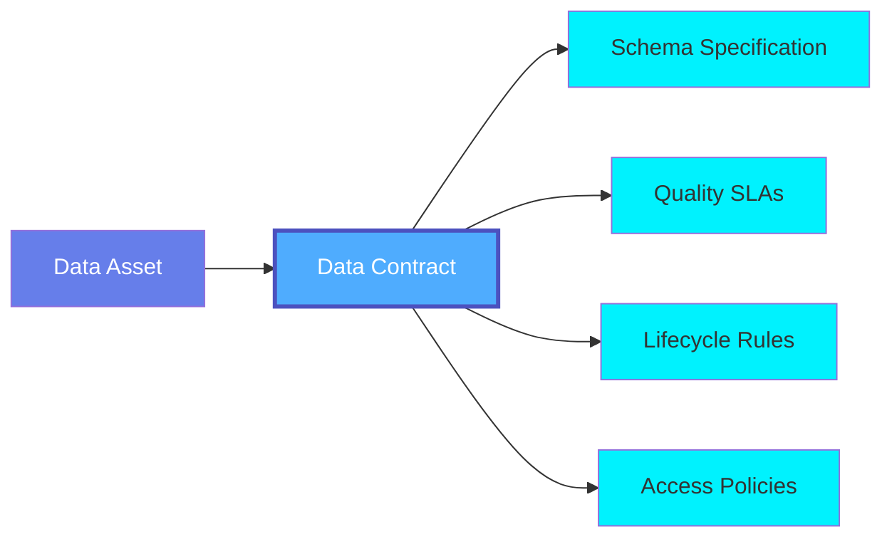
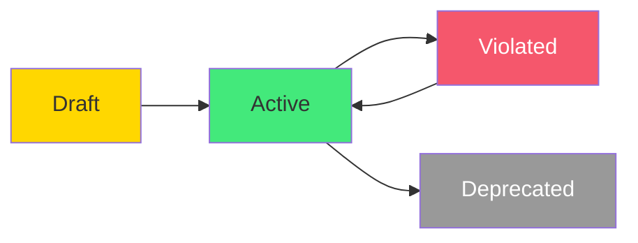

# Data Contract

A **Data Contract** is a formal agreement that defines the structure, quality, semantics, and SLAs for a data asset. Data contracts establish clear expectations between data producers and consumers, ensuring data reliability, compliance, and trust across the organization.

## Overview

Data Contracts in OpenMetadata provide:

- **Schema Definition**: Explicit schema with data types, constraints, and validation rules
- **Quality Guarantees**: SLAs for data quality, freshness, and completeness
- **Semantic Meaning**: Business definitions, glossary term mappings, and domain context
- **Ownership & Accountability**: Clear ownership and escalation paths
- **Change Management**: Schema evolution rules and versioning policies
- **Access Controls**: Who can read, write, or modify the data
- **Lifecycle Policies**: Retention, archival, and deletion rules
- **Compliance Requirements**: Regulatory and policy compliance specifications

Data contracts enable:
- Preventing breaking changes
- Ensuring data quality
- Building trust in data
- Enabling self-service analytics
- Meeting regulatory requirements
- Reducing data incidents

## Hierarchy



**Click on any node to learn more about that entity.**

## Relationships

Data Contracts have relationships with various entities in the metadata ecosystem:

```mermaid
graph TD
    subgraph Contract Structure
        A[DataContract:<br/>Customer Data] --> B1[Schema:<br/>Columns & Types]
        A --> B2[Quality SLA:<br/>99.9% Complete]
        A --> B3[Freshness SLA:<br/>< 1 hour]
        A --> B4[Version:<br/>v2.1]
    end

    subgraph Applied To
        A -.->|governs| C1[Table:<br/>customers]
        A -.->|governs| C2[Topic:<br/>customer-events]
        A -.->|governs| C3[File:<br/>customer_data.csv]
    end

    subgraph Schema Definition
        B1 -.->|defines| D1[Column:<br/>customer_id INT]
        B1 -.->|defines| D2[Column:<br/>email VARCHAR]
        B1 -.->|defines| D3[Constraint:<br/>NOT NULL]
    end

    subgraph Quality Requirements
        A -.->|requires| E1[TestCase:<br/>Null Check]
        A -.->|requires| E2[TestCase:<br/>Uniqueness Check]
        A -.->|measured by| E3[Metric:<br/>Data Quality Score]
    end

    subgraph Ownership & Accountability
        A -.->|owned by| F1[Team:<br/>Data Engineering]
        A -.->|consumer| F2[Team:<br/>Analytics]
        A -.->|escalation to| F3[User:<br/>Data Lead]
    end

    subgraph Governance
        A -.->|enforces| G1[Policy:<br/>Access Control]
        A -.->|requires| G2[Tag:<br/>PII]
        A -.->|in domain| G3[Domain:<br/>Customer Data]
        A -.->|mapped to| G4[GlossaryTerm:<br/>Customer]
    end

    subgraph Monitoring
        A -.->|triggers| H1[Alert:<br/>SLA Violation]
        A -.->|tracked in| H2[Dashboard:<br/>Contract Metrics]
        A -.->|logged in| H3[AuditLog]
    end

    style A fill:#4facfe,color:#fff,stroke:#4c51bf,stroke-width:3px
    style B1 fill:#00f2fe,color:#333
    style B2 fill:#00f2fe,color:#333
    style B3 fill:#00f2fe,color:#333
    style B4 fill:#00f2fe,color:#333
    style C1 fill:#764ba2,color:#fff
    style C2 fill:#764ba2,color:#fff
    style C3 fill:#764ba2,color:#fff
    style D1 fill:#ffd700,color:#333
    style D2 fill:#ffd700,color:#333
    style D3 fill:#ffd700,color:#333
    style E1 fill:#f5576c,color:#fff
    style E2 fill:#f5576c,color:#fff
    style E3 fill:#f093fb,color:#333
    style F1 fill:#43e97b,color:#333
    style F2 fill:#43e97b,color:#333
    style F3 fill:#43e97b,color:#333
    style G1 fill:#fa709a,color:#fff
    style G2 fill:#fa709a,color:#fff
    style G3 fill:#f093fb,color:#333
    style G4 fill:#f093fb,color:#333
    style H1 fill:#f5576c,color:#fff
    style H2 fill:#764ba2,color:#fff
    style H3 fill:#ffd700,color:#333

    click A "#data-contract" "Data Contract"
    click C1 "../data-assets/databases/table/" "Table"
    click C2 "../data-assets/messaging/topic/" "Topic"
    click C3 "../data-assets/storage/file/" "File"
    click D1 "../data-assets/databases/column/" "Column"
    click E1 "../data-quality/test-case/" "Test Case"
    click E3 "../governance/metric/" "Metric"
    click F1 "../teams-users/team/" "Team"
    click F3 "../teams-users/user/" "User"
    click G1 "../governance/policy/" "Policy"
    click G2 "../governance/tag/" "Tag"
    click G3 "../domains/domain/" "Domain"
    click G4 "../governance/glossary-term/" "Glossary Term"
    click H1 "../data-quality/alert/" "Alert"
    click H2 "../data-assets/dashboards/dashboard/" "Dashboard"
```



**Key Relationships:**

- **Contract Structure**: Schema, quality SLAs, freshness SLAs, versioning
- **Applied To**: Tables, topics, files, and other data assets governed by the contract
- **Schema Definition**: Column definitions, data types, and constraints
- **Quality Requirements**: Test cases and metrics measuring contract compliance
- **Ownership & Accountability**: Producers, consumers, and escalation contacts
- **Governance**: Policies, tags, domains, and glossary terms
- **Monitoring**: Alerts, dashboards, and audit logs for contract compliance

## Schema Specifications

=== "JSON Schema"

    ```json
    {
      "$id": "https://open-metadata.org/schema/entity/data/dataContract.json",
      "$schema": "http://json-schema.org/draft-07/schema#",
      "title": "DataContract",
      "description": "A Data Contract defines agreements about data structure, quality, and SLAs.",
      "type": "object",
      "javaType": "org.openmetadata.schema.entity.data.DataContract",
      "javaInterfaces": [
        "org.openmetadata.schema.EntityInterface"
      ],
      "definitions": {
        "contractStatus": {
          "description": "Status of the data contract",
          "type": "string",
          "enum": [
            "Draft",
            "Active",
            "Violated",
            "Deprecated"
          ]
        },
        "schemaContract": {
          "type": "object",
          "description": "Schema definition and constraints",
          "properties": {
            "columns": {
              "description": "Column specifications",
              "type": "array",
              "items": {
                "$ref": "../databases/column.json"
              }
            },
            "primaryKey": {
              "description": "Primary key columns",
              "type": "array",
              "items": {
                "type": "string"
              }
            },
            "foreignKeys": {
              "description": "Foreign key definitions",
              "type": "array",
              "items": {
                "type": "object",
                "properties": {
                  "columns": {
                    "type": "array",
                    "items": {
                      "type": "string"
                    }
                  },
                  "referencedTable": {
                    "type": "string"
                  },
                  "referencedColumns": {
                    "type": "array",
                    "items": {
                      "type": "string"
                    }
                  }
                }
              }
            },
            "schemaEvolution": {
              "description": "Schema evolution policy",
              "type": "object",
              "properties": {
                "allowAddColumns": {
                  "type": "boolean",
                  "default": true
                },
                "allowDeleteColumns": {
                  "type": "boolean",
                  "default": false
                },
                "allowTypeChanges": {
                  "type": "boolean",
                  "default": false
                },
                "allowNullabilityChanges": {
                  "type": "boolean",
                  "default": false
                }
              }
            }
          }
        },
        "qualitySLA": {
          "type": "object",
          "description": "Data quality service level agreement",
          "properties": {
            "completeness": {
              "description": "Minimum completeness percentage (0-100)",
              "type": "number",
              "minimum": 0,
              "maximum": 100
            },
            "accuracy": {
              "description": "Minimum accuracy percentage (0-100)",
              "type": "number",
              "minimum": 0,
              "maximum": 100
            },
            "validity": {
              "description": "Minimum validity percentage (0-100)",
              "type": "number",
              "minimum": 0,
              "maximum": 100
            },
            "uniqueness": {
              "description": "Minimum uniqueness percentage (0-100)",
              "type": "number",
              "minimum": 0,
              "maximum": 100
            },
            "consistency": {
              "description": "Minimum consistency percentage (0-100)",
              "type": "number",
              "minimum": 0,
              "maximum": 100
            },
            "testCases": {
              "description": "Test cases that must pass",
              "type": "array",
              "items": {
                "$ref": "../../type/entityReference.json"
              }
            }
          }
        },
        "freshnessSLA": {
          "type": "object",
          "description": "Data freshness service level agreement",
          "properties": {
            "maxAgeMinutes": {
              "description": "Maximum age of data in minutes",
              "type": "number"
            },
            "updateFrequency": {
              "description": "Expected update frequency",
              "type": "string",
              "enum": [
                "RealTime",
                "Hourly",
                "Daily",
                "Weekly",
                "Monthly"
              ]
            },
            "lastUpdatedThreshold": {
              "description": "Threshold for last updated timestamp",
              "$ref": "../../type/basic.json#/definitions/timestamp"
            }
          }
        },
        "lifecyclePolicy": {
          "type": "object",
          "description": "Data lifecycle management policy",
          "properties": {
            "retentionDays": {
              "description": "Number of days to retain data",
              "type": "number"
            },
            "archivalDays": {
              "description": "Number of days before archiving",
              "type": "number"
            },
            "deletionDays": {
              "description": "Number of days before permanent deletion",
              "type": "number"
            },
            "partitioning": {
              "description": "Partitioning strategy",
              "type": "object",
              "properties": {
                "type": {
                  "type": "string",
                  "enum": [
                    "Time",
                    "Range",
                    "List",
                    "Hash"
                  ]
                },
                "columns": {
                  "type": "array",
                  "items": {
                    "type": "string"
                  }
                }
              }
            }
          }
        },
        "stakeholder": {
          "type": "object",
          "description": "Contract stakeholder",
          "properties": {
            "role": {
              "type": "string",
              "enum": [
                "Producer",
                "Consumer",
                "Owner",
                "Steward",
                "Approver"
              ]
            },
            "entity": {
              "$ref": "../../type/entityReference.json"
            }
          },
          "required": [
            "role",
            "entity"
          ]
        }
      },
      "properties": {
        "id": {
          "description": "Unique identifier of the data contract",
          "$ref": "../../type/basic.json#/definitions/uuid"
        },
        "name": {
          "description": "Name of the data contract",
          "$ref": "../../type/basic.json#/definitions/entityName"
        },
        "fullyQualifiedName": {
          "description": "Fully qualified name of the data contract",
          "$ref": "../../type/basic.json#/definitions/fullyQualifiedEntityName"
        },
        "displayName": {
          "description": "Display name for the contract",
          "type": "string"
        },
        "description": {
          "description": "Description of the data contract",
          "$ref": "../../type/basic.json#/definitions/markdown"
        },
        "status": {
          "$ref": "#/definitions/contractStatus"
        },
        "entity": {
          "description": "Entity governed by this contract",
          "$ref": "../../type/entityReference.json"
        },
        "schemaContract": {
          "$ref": "#/definitions/schemaContract"
        },
        "qualitySLA": {
          "$ref": "#/definitions/qualitySLA"
        },
        "freshnessSLA": {
          "$ref": "#/definitions/freshnessSLA"
        },
        "lifecyclePolicy": {
          "$ref": "#/definitions/lifecyclePolicy"
        },
        "stakeholders": {
          "description": "Contract stakeholders",
          "type": "array",
          "items": {
            "$ref": "#/definitions/stakeholder"
          }
        },
        "effectiveDate": {
          "description": "When the contract becomes effective",
          "$ref": "../../type/basic.json#/definitions/timestamp"
        },
        "expirationDate": {
          "description": "When the contract expires",
          "$ref": "../../type/basic.json#/definitions/timestamp"
        },
        "complianceScore": {
          "description": "Current compliance score (0-100)",
          "type": "number",
          "minimum": 0,
          "maximum": 100
        },
        "violations": {
          "description": "Recent contract violations",
          "type": "array",
          "items": {
            "type": "object",
            "properties": {
              "timestamp": {
                "$ref": "../../type/basic.json#/definitions/timestamp"
              },
              "type": {
                "type": "string",
                "enum": [
                  "SchemaViolation",
                  "QualityViolation",
                  "FreshnessViolation",
                  "AccessViolation"
                ]
              },
              "description": {
                "type": "string"
              },
              "severity": {
                "type": "string",
                "enum": [
                  "Critical",
                  "High",
                  "Medium",
                  "Low"
                ]
              }
            }
          }
        },
        "owner": {
          "description": "Owner of this contract",
          "$ref": "../../type/entityReference.json"
        },
        "tags": {
          "description": "Tags for this contract",
          "type": "array",
          "items": {
            "$ref": "../../type/tagLabel.json"
          }
        },
        "version": {
          "description": "Contract version",
          "$ref": "../../type/entityHistory.json#/definitions/entityVersion"
        },
        "updatedAt": {
          "description": "Last update time",
          "$ref": "../../type/basic.json#/definitions/timestamp"
        },
        "updatedBy": {
          "description": "User who made the update",
          "type": "string"
        },
        "href": {
          "description": "Link to this contract resource",
          "$ref": "../../type/basic.json#/definitions/href"
        },
        "changeDescription": {
          "description": "Change that led to this version",
          "$ref": "../../type/entityHistory.json#/definitions/changeDescription"
        },
        "deleted": {
          "description": "When true indicates the entity has been soft deleted",
          "type": "boolean",
          "default": false
        },
        "domain": {
          "description": "Domain the contract belongs to",
          "$ref": "../../type/entityReference.json"
        }
      },
      "required": [
        "id",
        "name",
        "status",
        "entity"
      ],
      "additionalProperties": false
    }
    ```

=== "RDF (Turtle)"

    ```turtle
    @prefix om: <https://open-metadata.org/schema/> .
    @prefix om-entity: <https://open-metadata.org/schema/entity/> .
    @prefix om-contract: <https://open-metadata.org/schema/entity/data/> .
    @prefix rdf: <http://www.w3.org/1999/02/22-rdf-syntax-ns#> .
    @prefix rdfs: <http://www.w3.org/2000/01/rdf-schema#> .
    @prefix owl: <http://www.w3.org/2002/07/owl#> .
    @prefix xsd: <http://www.w3.org/2001/XMLSchema#> .
    @prefix dcterms: <http://purl.org/dc/terms/> .
    @prefix skos: <http://www.w3.org/2004/02/skos/core#> .
    @prefix prov: <http://www.w3.org/ns/prov#> .

    # Data Contract Class Definition
    om-contract:DataContract a owl:Class ;
        rdfs:label "Data Contract" ;
        rdfs:comment "Formal agreement defining data structure, quality, and SLAs" ;
        rdfs:subClassOf om-entity:Entity ;
        rdfs:isDefinedBy om: .

    # Contract Status Class
    om-contract:ContractStatus a owl:Class ;
        rdfs:label "Contract Status" ;
        rdfs:comment "Status of the data contract" ;
        rdfs:isDefinedBy om: .

    # Schema Contract Class
    om-contract:SchemaContract a owl:Class ;
        rdfs:label "Schema Contract" ;
        rdfs:comment "Schema definition and constraints" ;
        rdfs:isDefinedBy om: .

    # Quality SLA Class
    om-contract:QualitySLA a owl:Class ;
        rdfs:label "Quality SLA" ;
        rdfs:comment "Data quality service level agreement" ;
        rdfs:isDefinedBy om: .

    # Freshness SLA Class
    om-contract:FreshnessSLA a owl:Class ;
        rdfs:label "Freshness SLA" ;
        rdfs:comment "Data freshness service level agreement" ;
        rdfs:isDefinedBy om: .

    # Properties
    om-contract:status a owl:ObjectProperty ;
        rdfs:label "status" ;
        rdfs:comment "Current status of the contract" ;
        rdfs:domain om-contract:DataContract ;
        rdfs:range om-contract:ContractStatus .

    om-contract:governs a owl:ObjectProperty ;
        rdfs:label "governs" ;
        rdfs:comment "Entity governed by this contract" ;
        rdfs:domain om-contract:DataContract ;
        rdfs:range om-entity:Entity .

    om-contract:hasSchemaContract a owl:ObjectProperty ;
        rdfs:label "has schema contract" ;
        rdfs:comment "Schema definition and constraints" ;
        rdfs:domain om-contract:DataContract ;
        rdfs:range om-contract:SchemaContract .

    om-contract:hasQualitySLA a owl:ObjectProperty ;
        rdfs:label "has quality SLA" ;
        rdfs:comment "Quality service level agreement" ;
        rdfs:domain om-contract:DataContract ;
        rdfs:range om-contract:QualitySLA .

    om-contract:hasFreshnessSLA a owl:ObjectProperty ;
        rdfs:label "has freshness SLA" ;
        rdfs:comment "Freshness service level agreement" ;
        rdfs:domain om-contract:DataContract ;
        rdfs:range om-contract:FreshnessSLA .

    om-contract:effectiveDate a owl:DatatypeProperty ;
        rdfs:label "effective date" ;
        rdfs:comment "When contract becomes effective" ;
        rdfs:domain om-contract:DataContract ;
        rdfs:range xsd:dateTime .

    om-contract:expirationDate a owl:DatatypeProperty ;
        rdfs:label "expiration date" ;
        rdfs:comment "When contract expires" ;
        rdfs:domain om-contract:DataContract ;
        rdfs:range xsd:dateTime .

    om-contract:complianceScore a owl:DatatypeProperty ;
        rdfs:label "compliance score" ;
        rdfs:comment "Current compliance score (0-100)" ;
        rdfs:domain om-contract:DataContract ;
        rdfs:range xsd:decimal .

    om-contract:hasStakeholder a owl:ObjectProperty ;
        rdfs:label "has stakeholder" ;
        rdfs:comment "Stakeholder in the contract" ;
        rdfs:domain om-contract:DataContract .

    om-contract:completeness a owl:DatatypeProperty ;
        rdfs:label "completeness" ;
        rdfs:comment "Completeness percentage requirement" ;
        rdfs:domain om-contract:QualitySLA ;
        rdfs:range xsd:decimal .

    om-contract:accuracy a owl:DatatypeProperty ;
        rdfs:label "accuracy" ;
        rdfs:comment "Accuracy percentage requirement" ;
        rdfs:domain om-contract:QualitySLA ;
        rdfs:range xsd:decimal .

    om-contract:maxAgeMinutes a owl:DatatypeProperty ;
        rdfs:label "max age minutes" ;
        rdfs:comment "Maximum age of data in minutes" ;
        rdfs:domain om-contract:FreshnessSLA ;
        rdfs:range xsd:integer .

    # Contract Status Individuals
    om-contract:Draft a om-contract:ContractStatus ;
        rdfs:label "Draft" ;
        skos:definition "Contract is in draft state" .

    om-contract:Active a om-contract:ContractStatus ;
        rdfs:label "Active" ;
        skos:definition "Contract is active and being enforced" .

    om-contract:Violated a om-contract:ContractStatus ;
        rdfs:label "Violated" ;
        skos:definition "Contract has been violated" .

    om-contract:Deprecated a om-contract:ContractStatus ;
        rdfs:label "Deprecated" ;
        skos:definition "Contract is deprecated" .
    ```

=== "JSON-LD Context"

    ```json
    {
      "@context": {
        "@vocab": "https://open-metadata.org/schema/entity/data/",
        "rdf": "http://www.w3.org/1999/02/22-rdf-syntax-ns#",
        "rdfs": "http://www.w3.org/2000/01/rdf-schema#",
        "owl": "http://www.w3.org/2002/07/owl#",
        "xsd": "http://www.w3.org/2001/XMLSchema#",
        "dcterms": "http://purl.org/dc/terms/",
        "skos": "http://www.w3.org/2004/02/skos/core#",
        "prov": "http://www.w3.org/ns/prov#",
        "om": "https://open-metadata.org/schema/",

        "DataContract": {
          "@id": "om:DataContract",
          "@type": "@id"
        },
        "id": {
          "@id": "om:id",
          "@type": "xsd:string"
        },
        "name": {
          "@id": "om:name",
          "@type": "xsd:string"
        },
        "fullyQualifiedName": {
          "@id": "om:fullyQualifiedName",
          "@type": "xsd:string"
        },
        "description": {
          "@id": "dcterms:description",
          "@type": "xsd:string"
        },
        "status": {
          "@id": "om:status",
          "@type": "@id"
        },
        "entity": {
          "@id": "om:governs",
          "@type": "@id"
        },
        "schemaContract": {
          "@id": "om:hasSchemaContract",
          "@type": "@id"
        },
        "qualitySLA": {
          "@id": "om:hasQualitySLA",
          "@type": "@id"
        },
        "freshnessSLA": {
          "@id": "om:hasFreshnessSLA",
          "@type": "@id"
        },
        "effectiveDate": {
          "@id": "om:effectiveDate",
          "@type": "xsd:dateTime"
        },
        "expirationDate": {
          "@id": "om:expirationDate",
          "@type": "xsd:dateTime"
        },
        "complianceScore": {
          "@id": "om:complianceScore",
          "@type": "xsd:decimal"
        },
        "stakeholders": {
          "@id": "om:hasStakeholder",
          "@type": "@id",
          "@container": "@set"
        },
        "owner": {
          "@id": "om:owner",
          "@type": "@id"
        },
        "tags": {
          "@id": "om:tags",
          "@type": "@id",
          "@container": "@set"
        },
        "domain": {
          "@id": "om:domain",
          "@type": "@id"
        }
      }
    }
    ```

## Use Cases

### Customer Table Data Contract

```json
{
  "id": "123e4567-e89b-12d3-a456-426614174000",
  "name": "CustomerDataContract",
  "displayName": "Customer Data Contract v2.1",
  "description": "Data contract for customer master table ensuring high quality and freshness",
  "status": "Active",
  "entity": {
    "type": "table",
    "name": "customers",
    "fullyQualifiedName": "postgres.sales.public.customers"
  },
  "schemaContract": {
    "columns": [
      {
        "name": "customer_id",
        "dataType": "BIGINT",
        "constraint": "PRIMARY_KEY",
        "description": "Unique customer identifier"
      },
      {
        "name": "email",
        "dataType": "VARCHAR",
        "dataLength": 255,
        "constraint": "NOT_NULL",
        "description": "Customer email address"
      },
      {
        "name": "created_at",
        "dataType": "TIMESTAMP",
        "constraint": "NOT_NULL",
        "description": "Account creation timestamp"
      }
    ],
    "primaryKey": ["customer_id"],
    "schemaEvolution": {
      "allowAddColumns": true,
      "allowDeleteColumns": false,
      "allowTypeChanges": false,
      "allowNullabilityChanges": false
    }
  },
  "qualitySLA": {
    "completeness": 99.9,
    "accuracy": 99.0,
    "validity": 98.0,
    "uniqueness": 100.0,
    "testCases": [
      {
        "type": "testCase",
        "name": "customer_email_uniqueness"
      },
      {
        "type": "testCase",
        "name": "customer_id_not_null"
      }
    ]
  },
  "freshnessSLA": {
    "maxAgeMinutes": 60,
    "updateFrequency": "Hourly"
  },
  "lifecyclePolicy": {
    "retentionDays": 2555,
    "archivalDays": 2190,
    "partitioning": {
      "type": "Time",
      "columns": ["created_at"]
    }
  },
  "stakeholders": [
    {
      "role": "Producer",
      "entity": {
        "type": "team",
        "name": "DataEngineering"
      }
    },
    {
      "role": "Consumer",
      "entity": {
        "type": "team",
        "name": "Analytics"
      }
    },
    {
      "role": "Owner",
      "entity": {
        "type": "user",
        "name": "data.lead"
      }
    }
  ],
  "effectiveDate": 1705320000000,
  "complianceScore": 98.5,
  "owner": {
    "type": "team",
    "name": "DataEngineering"
  },
  "tags": [
    {
      "tagFQN": "PII"
    },
    {
      "tagFQN": "Critical"
    }
  ],
  "domain": {
    "type": "domain",
    "name": "CustomerData"
  }
}
```

### Event Stream Data Contract

```json
{
  "name": "OrderEventsContract",
  "displayName": "Order Events Stream Contract",
  "description": "Real-time order events stream with strict schema and freshness requirements",
  "status": "Active",
  "entity": {
    "type": "topic",
    "name": "order-events"
  },
  "schemaContract": {
    "columns": [
      {
        "name": "order_id",
        "dataType": "STRING",
        "constraint": "NOT_NULL"
      },
      {
        "name": "customer_id",
        "dataType": "STRING",
        "constraint": "NOT_NULL"
      },
      {
        "name": "amount",
        "dataType": "DECIMAL",
        "precision": 10,
        "scale": 2,
        "constraint": "NOT_NULL"
      },
      {
        "name": "timestamp",
        "dataType": "TIMESTAMP",
        "constraint": "NOT_NULL"
      }
    ],
    "schemaEvolution": {
      "allowAddColumns": true,
      "allowDeleteColumns": false,
      "allowTypeChanges": false
    }
  },
  "qualitySLA": {
    "completeness": 100.0,
    "validity": 99.9
  },
  "freshnessSLA": {
    "maxAgeMinutes": 5,
    "updateFrequency": "RealTime"
  },
  "stakeholders": [
    {
      "role": "Producer",
      "entity": {
        "type": "application",
        "name": "OrderService"
      }
    },
    {
      "role": "Consumer",
      "entity": {
        "type": "pipeline",
        "name": "OrderProcessingPipeline"
      }
    }
  ],
  "effectiveDate": 1705320000000
}
```

### Data Lake File Contract

```json
{
  "name": "SalesDataLakeContract",
  "displayName": "Sales Data Lake Contract",
  "description": "Daily sales data files in data lake with quality and format requirements",
  "status": "Active",
  "entity": {
    "type": "file",
    "name": "sales_YYYYMMDD.parquet"
  },
  "schemaContract": {
    "columns": [
      {
        "name": "transaction_id",
        "dataType": "STRING",
        "constraint": "NOT_NULL"
      },
      {
        "name": "product_id",
        "dataType": "STRING",
        "constraint": "NOT_NULL"
      },
      {
        "name": "quantity",
        "dataType": "INT",
        "constraint": "NOT_NULL"
      },
      {
        "name": "price",
        "dataType": "DECIMAL",
        "precision": 10,
        "scale": 2
      },
      {
        "name": "sale_date",
        "dataType": "DATE",
        "constraint": "NOT_NULL"
      }
    ],
    "schemaEvolution": {
      "allowAddColumns": true,
      "allowDeleteColumns": false,
      "allowTypeChanges": false
    }
  },
  "qualitySLA": {
    "completeness": 99.0,
    "validity": 98.0
  },
  "freshnessSLA": {
    "maxAgeMinutes": 1440,
    "updateFrequency": "Daily"
  },
  "lifecyclePolicy": {
    "retentionDays": 3650,
    "archivalDays": 365
  },
  "stakeholders": [
    {
      "role": "Producer",
      "entity": {
        "type": "pipeline",
        "name": "SalesETL"
      }
    },
    {
      "role": "Consumer",
      "entity": {
        "type": "team",
        "name": "SalesAnalytics"
      }
    }
  ]
}
```

## Contract Violations

### Schema Violation

```json
{
  "violations": [
    {
      "timestamp": 1705406400000,
      "type": "SchemaViolation",
      "description": "Column 'phone_number' was deleted violating schema evolution policy",
      "severity": "Critical"
    }
  ],
  "status": "Violated",
  "complianceScore": 45.0
}
```

### Quality Violation

```json
{
  "violations": [
    {
      "timestamp": 1705492800000,
      "type": "QualityViolation",
      "description": "Completeness dropped to 95.2% below SLA of 99.9%",
      "severity": "High"
    }
  ],
  "complianceScore": 82.3
}
```

### Freshness Violation

```json
{
  "violations": [
    {
      "timestamp": 1705579200000,
      "type": "FreshnessViolation",
      "description": "Data is 125 minutes old exceeding maxAge of 60 minutes",
      "severity": "Medium"
    }
  ],
  "complianceScore": 91.5
}
```

## Contract Lifecycle



| Status | Description | Actions |
|--------|-------------|---------|
| **Draft** | Contract being developed | Edit, review, approve |
| **Active** | Contract is enforced | Monitor compliance |
| **Violated** | Contract violations detected | Fix issues, update contract |
| **Deprecated** | Contract no longer active | Migrate to new version |

## Best Practices

### 1. Start Simple
Begin with essential schema and quality requirements, then expand.

### 2. Version Contracts
Maintain versions for backward compatibility and migration paths.

### 3. Clear Stakeholders
Define clear producer, consumer, and owner responsibilities.

### 4. Realistic SLAs
Set achievable SLAs based on actual capabilities.

### 5. Monitor Compliance
Continuously monitor and alert on contract violations.

### 6. Document Changes
Track all contract changes with reasons and approvals.

### 7. Automated Testing
Automate test cases to validate contract compliance.

### 8. Graceful Evolution
Define clear schema evolution policies that prevent breaking changes.

## Custom Properties

This entity supports custom properties through the `extension` field.
Common custom properties include:

- **Data Classification**: Sensitivity level
- **Cost Center**: Billing allocation
- **Retention Period**: Data retention requirements
- **Application Owner**: Owning application/team

See [Custom Properties](../metadata-specifications/custom-properties.md)
for details on defining and using custom properties.

---

## API Operations

### Create Data Contract

```http
POST /api/v1/dataContracts
Content-Type: application/json

{
  "name": "CustomerContract",
  "entity": {...},
  "schemaContract": {...},
  "qualitySLA": {...}
}
```

### Get Data Contract

```http
GET /api/v1/dataContracts/{id}
```

### Update Data Contract

```http
PATCH /api/v1/dataContracts/{id}
Content-Type: application/json-patch+json

[
  {
    "op": "replace",
    "path": "/qualitySLA/completeness",
    "value": 99.5
  }
]
```

### Validate Contract Compliance

```http
POST /api/v1/dataContracts/{id}/validate
```

### Get Contract Violations

```http
GET /api/v1/dataContracts/{id}/violations?days=30
```

### Approve Contract

```http
POST /api/v1/dataContracts/{id}/approve
```

## Related Entities

- **[Table](../data-assets/databases/table.md)**: Tables governed by contracts
- **[Topic](../data-assets/messaging/topic.md)**: Event streams with contracts
- **[File](../data-assets/storage/file.md)**: Data lake files with contracts
- **[TestCase](../data-quality/test-case.md)**: Tests validating contract SLAs
- **[Policy](../governance/policy.md)**: Policies enforcing contracts
- **[Domain](../domains/domain.md)**: Domain-specific contracts
- **[Team](../teams-users/team.md)**: Contract stakeholders
