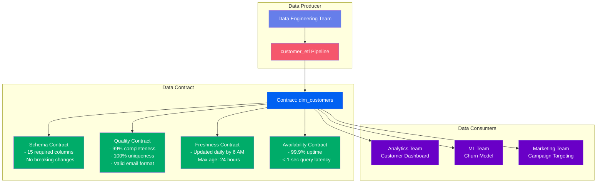
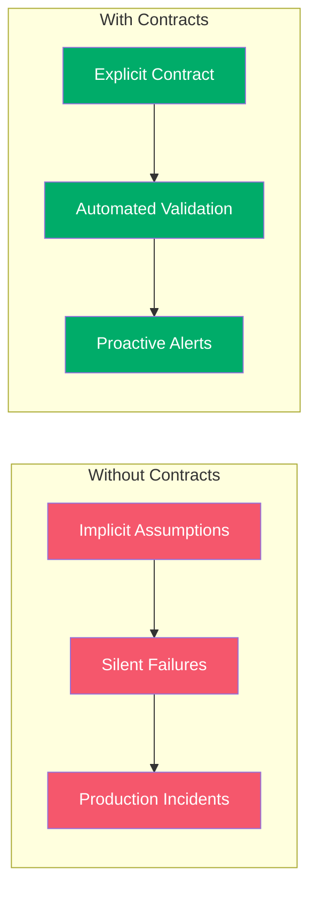
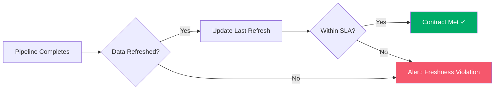
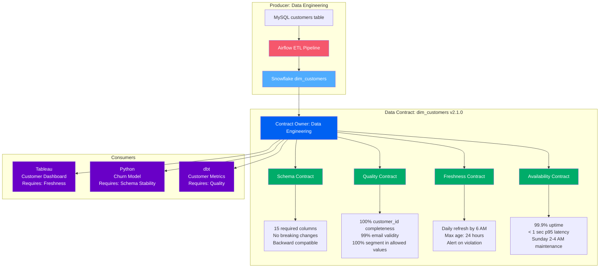
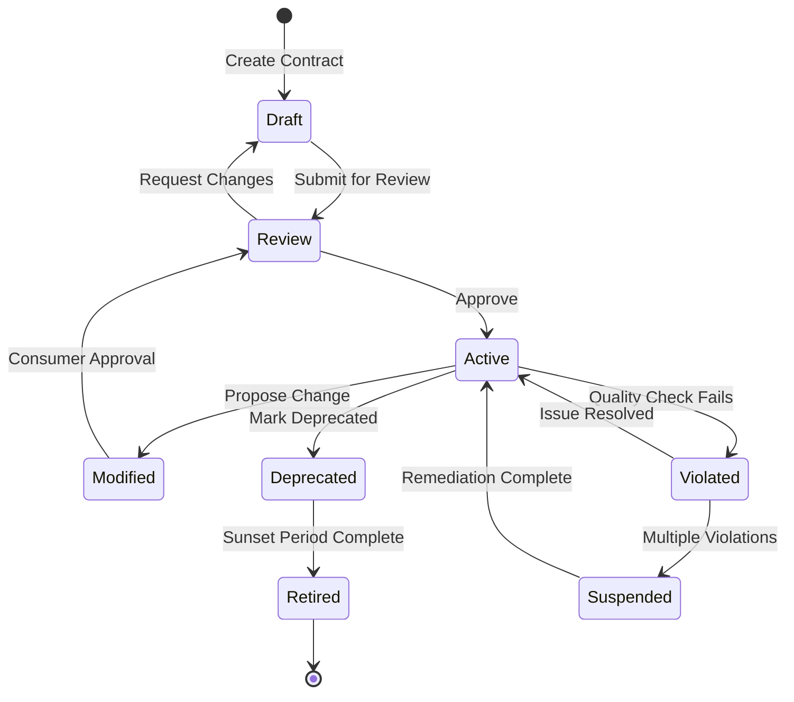
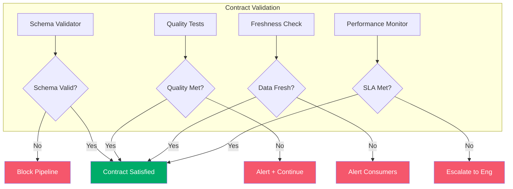

# Data Contracts

**Formal agreements ensuring data quality, schema stability, and SLA compliance**

Data Contracts in OpenMetadata establish formal agreements between data producers and consumers, defining expectations for schema, quality, freshness, and availability. Contracts enable proactive data governance by preventing breaking changes, ensuring quality standards, and guaranteeing SLAs for critical data assets.

---

## Overview

Data Contracts provide a framework for:

- **Schema Contracts**: Guarantees about data structure and types
- **Quality Contracts**: SLAs for data quality dimensions
- **Freshness Contracts**: Guarantees about data update frequency
- **Availability Contracts**: SLAs for data availability and uptime



---

## Why Data Contracts?

### Problem: Implicit Expectations

Without contracts, data consumers make assumptions:
- "This column will always have values"
- "Email addresses will be valid"
- "Data refreshes daily before 8 AM"
- "The schema won't change without notice"

**When these assumptions break, downstream systems fail.**

### Solution: Explicit Contracts

Data contracts make expectations explicit and enforceable:



**Benefits**:

- **Prevent Breaking Changes**: Schema changes require consumer approval
- **Guarantee Quality**: SLAs for completeness, accuracy, validity
- **Ensure Timeliness**: Freshness guarantees for time-sensitive use cases
- **Enforce Accountability**: Clear ownership and responsibilities
- **Enable Trust**: Consumers can rely on contracted data

---

## Contract Types

### 1. Schema Contracts

**Guarantees about data structure, types, and constraints**

```yaml
schemaContract:
  entity: dim_customers
  version: 2.1.0

  guarantees:
    - type: COLUMN_PRESENCE
      columns:
        - customer_id (required, primary key)
        - email (required, unique)
        - name (required)
        - created_at (required)
        - segment (optional)

    - type: DATA_TYPE_STABILITY
      columns:
        - customer_id: INTEGER (no changes allowed)
        - email: STRING (no changes allowed)
        - created_at: TIMESTAMP (no changes allowed)

    - type: NO_BREAKING_CHANGES
      policy: REQUIRE_APPROVAL
      approvers:
        - analytics-team
        - ml-team

    - type: BACKWARD_COMPATIBILITY
      rules:
        - New columns can be added
        - Optional columns can be removed
        - Required columns cannot be removed
        - Data types cannot change
```

**Schema Contract Checks**:

- ✅ Required columns exist
- ✅ Data types match specification
- ✅ Primary keys are unique and not null
- ✅ Foreign key relationships valid
- ✅ No breaking changes without approval

---

### 2. Quality Contracts

**SLAs for data quality dimensions**

```yaml
qualityContract:
  entity: dim_customers

  completeness:
    - column: customer_id
      threshold: 100%
      description: "Every row must have customer_id"

    - column: email
      threshold: 100%
      description: "Every row must have email"

    - column: name
      threshold: 95%
      description: "At least 95% of rows have name"

  uniqueness:
    - column: customer_id
      threshold: 100%
      description: "No duplicate customer_ids"

    - column: email
      threshold: 99%
      description: "Less than 1% duplicate emails"

  validity:
    - column: email
      rule: REGEX_MATCH
      pattern: "^[a-zA-Z0-9._%+-]+@[a-zA-Z0-9.-]+\\.[a-zA-Z]{2,}$"
      threshold: 99%
      description: "Valid email format"

    - column: segment
      rule: IN_SET
      values: ["enterprise", "smb", "individual"]
      threshold: 100%
      description: "Valid segment values"

  accuracy:
    - column: created_at
      rule: DATE_RANGE
      min: "2020-01-01"
      max: "NOW()"
      threshold: 100%
      description: "Created date is realistic"

  consistency:
    - rule: REFERENTIAL_INTEGRITY
      foreign_key: customer_id
      references: fact_orders.customer_id
      threshold: 100%
      description: "All customer_ids in orders exist in dim_customers"
```

**Quality Contract Monitoring**:

- Daily automated test execution
- Alert on threshold violations
- Track quality trends over time
- Escalation for critical failures

---

### 3. Freshness Contracts

**Guarantees about data update frequency and recency**

```yaml
freshnessContract:
  entity: dim_customers

  updateSchedule:
    frequency: DAILY
    expectedTime: "06:00 UTC"
    window: "+/- 30 minutes"
    description: "Table refreshes daily at 6 AM UTC"

  maxAge:
    value: 24
    unit: HOURS
    description: "Data is never more than 24 hours old"

  partitionFreshness:
    - partition: created_date
      latestPartition: "TODAY - 1"
      description: "Yesterday's partition available by 6 AM"

  monitoring:
    checkInterval: HOURLY
    alertOnViolation: true
    alertChannels:
      - slack: "#data-alerts"
      - email: "data-eng-oncall@company.com"
```

**Freshness Monitoring**:


---

### 4. Availability Contracts

**SLAs for data availability and performance**

```yaml
availabilityContract:
  entity: dim_customers

  uptime:
    sla: 99.9%
    measurement: MONTHLY
    description: "Table available 99.9% of time"

  performance:
    - metric: QUERY_LATENCY
      percentile: p95
      threshold: 1.0
      unit: SECONDS
      description: "95% of queries return in < 1 second"

    - metric: SCAN_EFFICIENCY
      threshold: 10
      unit: PERCENT
      description: "Queries scan < 10% of table data"

  maintenanceWindows:
    - day: SUNDAY
      start: "02:00 UTC"
      end: "04:00 UTC"
      description: "Weekly maintenance window"

  disasterRecovery:
    rpo: 1
    rto: 2
    unit: HOURS
    description: "Max 1 hour data loss, 2 hour recovery time"
```

---

## Real-World Example: Customer Data Contract

Complete contract for a critical customer dimension table:



**Contract Implementation**:

1. **Schema Contract**:
   - Schema changes require approval from consumer teams
   - New columns can be added (backward compatible)
   - Existing columns cannot be removed or changed

2. **Quality Contract**:
   - 100% completeness for `customer_id`, `email`
   - 99% valid email formats
   - 100% segments must be in ["enterprise", "smb", "individual"]
   - Daily automated quality tests

3. **Freshness Contract**:
   - Data refreshes daily at 6 AM UTC
   - Maximum age: 24 hours
   - Alert if refresh is late or fails

4. **Availability Contract**:
   - 99.9% uptime (< 45 minutes downtime/month)
   - Query latency < 1 second (p95)
   - Scheduled maintenance: Sunday 2-4 AM UTC

---

## Contract Lifecycle



**Lifecycle Stages**:

1. **Draft**: Contract being defined by producer
2. **Review**: Consumers review and provide feedback
3. **Active**: Contract in effect, monitored automatically
4. **Modified**: Proposed changes pending approval
5. **Violated**: Contract terms not met, alerts triggered
6. **Suspended**: Critical violations, consumers warned
7. **Deprecated**: Contract scheduled for retirement
8. **Retired**: Contract no longer in effect

---

## Contract Enforcement

### Automated Monitoring



**Enforcement Levels**:

| Violation Type | Enforcement | Impact |
|----------------|-------------|---------|
| **Schema Breaking Change** | BLOCK | Pipeline cannot proceed |
| **Quality Failure (Critical)** | ALERT + BLOCK | Alert sent, pipeline blocked |
| **Quality Failure (Warning)** | ALERT + CONTINUE | Alert sent, pipeline continues |
| **Freshness Violation** | ALERT | Notify consumers of stale data |
| **Availability Violation** | ESCALATE | Page on-call engineer |

---

## Contract Examples by Asset Type

### Tables

```yaml
contract:
  type: TABLE
  entity: dim_customers

  schema:
    columns:
      - customer_id: INTEGER NOT NULL PRIMARY KEY
      - email: STRING NOT NULL
      - name: STRING
    changePolicy: REQUIRE_APPROVAL

  quality:
    completeness: 100% on customer_id, email
    uniqueness: 100% on customer_id

  freshness:
    schedule: DAILY at 06:00 UTC
    maxAge: 24 HOURS
```

### Topics (Streaming)

```yaml
contract:
  type: TOPIC
  entity: customer_events

  schema:
    format: AVRO
    registry: confluent
    changePolicy: BACKWARD_COMPATIBLE

  quality:
    completeness: 99% on event_id, customer_id, timestamp
    lateness: < 5 MINUTES p99

  freshness:
    frequency: REAL_TIME
    maxLag: 1 MINUTE

  throughput:
    expected: 1000 messages/second
    peak: 5000 messages/second
```

### APIs

```yaml
contract:
  type: API
  entity: customer_api

  schema:
    openapi: 3.0
    version: 2.1.0
    changePolicy: VERSIONED

  availability:
    uptime: 99.99%
    latency_p95: 100 MILLISECONDS
    latency_p99: 500 MILLISECONDS

  rateLimit:
    requests: 1000 per MINUTE
    burst: 2000
```

### Dashboards

```yaml
contract:
  type: DASHBOARD
  entity: customer_executive_dashboard

  freshness:
    dataAge: < 1 HOUR
    refreshSchedule: HOURLY

  availability:
    uptime: 99.9%
    loadTime: < 3 SECONDS

  accuracy:
    dataReconciliation: WEEKLY
    sourceOfTruth: dim_customers, fact_orders
```

---

## Benefits of Data Contracts

### For Producers

- **Clear Expectations**: Know exactly what consumers need
- **Controlled Changes**: Plan breaking changes with consumer approval
- **Quality Metrics**: Track contract compliance over time
- **Reduced Support**: Fewer consumer complaints about data issues

### For Consumers

- **Guaranteed Quality**: SLAs for completeness, accuracy, freshness
- **Schema Stability**: No surprise breaking changes
- **Trust**: Confidence in data reliability
- **Proactive Alerts**: Know immediately when contract violated

### For Organizations

- **Data Reliability**: Higher quality data across the organization
- **Faster Development**: Consumers trust data, build faster
- **Better Collaboration**: Clear producer-consumer agreements
- **Reduced Incidents**: Prevent issues before they reach production

---

## Best Practices

### 1. Start with Critical Assets
Implement contracts for tier-1 tables first (those powering critical dashboards and reports).

### 2. Involve Consumers in Contract Definition
Consumer input ensures contracts address actual needs.

### 3. Set Realistic Thresholds
Don't aim for 100% on everything - balance quality with operational reality.

### 4. Monitor and Iterate
Review contract violations regularly and adjust thresholds as needed.

### 5. Automate Enforcement
Use automated testing and CI/CD checks to enforce contracts.

### 6. Version Contracts
Maintain contract versions and migration plans for breaking changes.

### 7. Document Business Context
Explain why each contract term matters and what happens if violated.

### 8. Establish Ownership
Assign clear ownership for contract maintenance and violation resolution.

---

## Getting Started

### Step 1: Identify Critical Assets
List your most important tables, topics, and APIs that need contracts.

### Step 2: Define Initial Contract
Start simple with schema and basic quality checks.

```yaml
contract:
  entity: dim_customers
  schema:
    required_columns: [customer_id, email, name]
  quality:
    completeness: 99% on customer_id, email
  freshness:
    schedule: DAILY
```

### Step 3: Implement Validation
Add automated tests to validate contract terms.

### Step 4: Monitor and Alert
Set up alerting for contract violations.

### Step 5: Iterate and Expand
Add more contract terms as you learn what matters most.

---

## Next Steps

1. **Explore examples** - See [contract examples](../examples/data-contracts/index.md)
2. **Implementation guide** - Learn [how to create contracts](../getting-started/data-contracts.md)
3. **API reference** - Review [contract API documentation](../reference/api/contracts.md)
4. **Best practices** - Read [contract design patterns](../developer/contract-patterns.md)
