# Data Product

**Packaged data assets ready for consumption**

---

## Overview

The **Data Product** entity represents a cohesive package of data assets designed for specific business use cases. Data products apply product-thinking principles to data, combining tables, dashboards, ML models, APIs, and other assets into a discoverable, documented, and governed product with clear ownership, SLAs, and value propositions.

A data product is more than a collection of assets - it's a complete solution with defined consumers, quality guarantees, access interfaces, and lifecycle management. Each data product has a product owner who is accountable for its quality, evolution, and consumer satisfaction.

---

## Relationship Diagram

```mermaid
graph TB
    subgraph "Domain Context"
        DOM[Domain<br/>Sales<br/><i>Parent Domain</i>]
        SUBDOM[Domain<br/>B2B Sales<br/><i>Sub-domain</i>]

        DOM -->|contains| SUBDOM
        SUBDOM -->|publishes| DP
    end

    subgraph "Data Product"
        DP[Data Product<br/>Customer360<br/><i>Active Product</i>]
    end

    subgraph "Ownership"
        OWNER[Team<br/>Customer Analytics<br/><i>Product Owner</i>]
        EXPERT1[User<br/>alice.smith<br/><i>Product Manager</i>]
        EXPERT2[User<br/>bob.jones<br/><i>Technical Lead</i>]

        DP -->|owned by| OWNER
        DP -->|has expert| EXPERT1
        DP -->|has expert| EXPERT2
    end

    subgraph "Core Assets - Tables"
        TBL1[Table<br/>customer_unified<br/><i>Source of Truth</i>]
        TBL2[Table<br/>customer_interactions<br/><i>Event History</i>]
        TBL3[Table<br/>customer_segments<br/><i>ML Output</i>]
        VIEW1[View<br/>customer_summary<br/><i>Analytics View</i>]

        DP -->|includes| TBL1
        DP -->|includes| TBL2
        DP -->|includes| TBL3
        DP -->|includes| VIEW1
    end

    subgraph "Analytics Assets"
        DASH1[Dashboard<br/>Customer Insights<br/><i>Tableau</i>]
        DASH2[Dashboard<br/>Segment Analysis<br/><i>Looker</i>]
        DASH3[Dashboard<br/>Churn Monitor<br/><i>PowerBI</i>]

        DP -->|includes| DASH1
        DP -->|includes| DASH2
        DP -->|includes| DASH3
    end

    subgraph "ML Assets"
        ML1[ML Model<br/>churn_predictor<br/><i>Production v2.1</i>]
        ML2[ML Model<br/>segment_classifier<br/><i>Production v1.3</i>]
        ML3[ML Model<br/>ltv_estimator<br/><i>Staging v3.0</i>]

        DP -->|includes| ML1
        DP -->|includes| ML2
        DP -->|includes| ML3
    end

    subgraph "Data Pipeline Assets"
        PIPE1[Pipeline<br/>customer_etl<br/><i>Airflow Daily</i>]
        PIPE2[Pipeline<br/>interaction_stream<br/><i>Kafka Stream</i>]
        PIPE3[Pipeline<br/>segment_batch<br/><i>Spark Hourly</i>]

        DP -->|includes| PIPE1
        DP -->|includes| PIPE2
        DP -->|includes| PIPE3
    end

    subgraph "Access Interfaces"
        API1[API Endpoint<br/>customer_api<br/><i>REST v2</i>]
        API2[API Collection<br/>segments_api<br/><i>GraphQL</i>]
        TOPIC1[Topic<br/>customer_events<br/><i>Kafka</i>]
        CONT1[Container<br/>customer_exports<br/><i>S3 Bucket</i>]

        DP -->|exposes| API1
        DP -->|exposes| API2
        DP -->|exposes| TOPIC1
        DP -->|exposes| CONT1
    end

    subgraph "Consumers"
        TEAM1[Team<br/>Marketing<br/><i>Campaign Targeting</i>]
        TEAM2[Team<br/>Sales Ops<br/><i>Account Health</i>]
        TEAM3[Team<br/>Customer Support<br/><i>Customer Context</i>]
        USER1[User<br/>jane.doe<br/><i>Data Scientist</i>]

        DP -.->|consumed by| TEAM1
        DP -.->|consumed by| TEAM2
        DP -.->|consumed by| TEAM3
        DP -.->|consumed by| USER1
    end

    subgraph "Quality & Testing"
        TS1[Test Suite<br/>Customer360 Quality<br/><i>Daily Validation</i>]
        TC1[Test Case<br/>Completeness Check<br/><i>99.5% threshold</i>]
        TC2[Test Case<br/>Freshness Check<br/><i>< 1 hour</i>]
        TC3[Test Case<br/>Accuracy Check<br/><i>Schema validation</i>]

        DP -->|has test suite| TS1
        TS1 -->|contains| TC1
        TS1 -->|contains| TC2
        TS1 -->|contains| TC3
    end

    subgraph "SLA & Contracts"
        SLA1[SLA<br/>Freshness: < 1 hour<br/>Quality: > 99.5%<br/>Availability: 99.9%]
        CONTRACT1[Contract<br/>Marketing Team Agreement<br/><i>Support SLA</i>]
        CONTRACT2[Contract<br/>Sales Team Agreement<br/><i>API Rate Limits</i>]

        DP -->|has SLA| SLA1
        DP -->|has contract| CONTRACT1
        DP -->|has contract| CONTRACT2
    end

    subgraph "Dependencies - Input Products"
        DPIN1[Data Product<br/>CRM Master Data<br/><i>Upstream</i>]
        DPIN2[Data Product<br/>Web Analytics<br/><i>Upstream</i>]
        DPIN3[Data Product<br/>Transaction History<br/><i>Upstream</i>]

        DPIN1 -.->|feeds| DP
        DPIN2 -.->|feeds| DP
        DPIN3 -.->|feeds| DP
    end

    subgraph "Dependencies - Output Products"
        DPOUT1[Data Product<br/>Marketing Analytics<br/><i>Downstream</i>]
        DPOUT2[Data Product<br/>Revenue Forecasting<br/><i>Downstream</i>]

        DP -.->|feeds| DPOUT1
        DP -.->|feeds| DPOUT2
    end

    subgraph "Governance"
        GLOSS1[Glossary<br/>Customer Domain Terms<br/><i>Business Definitions</i>]
        GT1[Glossary Term<br/>Customer]
        GT2[Glossary Term<br/>Customer Segment]
        GT3[Glossary Term<br/>Lifetime Value]

        TAG1[Tag<br/>PII.Sensitive]
        TAG2[Tag<br/>GDPR.Personal]
        TAG3[Tag<br/>Tier1.Critical]

        DP -.->|uses glossary| GLOSS1
        GLOSS1 -->|contains| GT1
        GLOSS1 -->|contains| GT2
        GLOSS1 -->|contains| GT3

        DP -.->|has tag| TAG1
        DP -.->|has tag| TAG2
        DP -.->|has tag| TAG3
    end

    %% Styling
    classDef domainStyle fill:#8B5CF6,stroke:#7C3AED,color:#fff,stroke-width:2px
    classDef productStyle fill:#F59E0B,stroke:#D97706,color:#000,stroke-width:3px
    classDef ownerStyle fill:#00ac69,stroke:#047857,color:#fff,stroke-width:2px
    classDef expertStyle fill:#10B981,stroke:#059669,color:#fff,stroke-width:2px
    classDef tableStyle fill:#2563EB,stroke:#1E40AF,color:#fff,stroke-width:2px
    classDef dashboardStyle fill:#6900c7,stroke:#5a00a3,color:#fff,stroke-width:2px
    classDef mlStyle fill:#f5576c,stroke:#c4465a,color:#fff,stroke-width:2px
    classDef pipelineStyle fill:#4facfe,stroke:#3b8bcc,color:#fff,stroke-width:2px
    classDef apiStyle fill:#06B6D4,stroke:#0891B2,color:#fff,stroke-width:2px
    classDef consumerStyle fill:#94A3B8,stroke:#64748B,color:#fff,stroke-width:2px
    classDef testStyle fill:#10B981,stroke:#059669,color:#fff,stroke-width:2px
    classDef slaStyle fill:#8B5CF6,stroke:#7C3AED,color:#fff,stroke-width:2px
    classDef depStyle fill:#F3F4F6,stroke:#9CA3AF,color:#000,stroke-width:2px
    classDef governanceStyle fill:#764ba2,stroke:#5e3b82,color:#fff,stroke-width:2px

    class DOM,SUBDOM domainStyle
    class DP productStyle
    class OWNER ownerStyle
    class EXPERT1,EXPERT2 expertStyle
    class TBL1,TBL2,TBL3,VIEW1 tableStyle
    class DASH1,DASH2,DASH3 dashboardStyle
    class ML1,ML2,ML3 mlStyle
    class PIPE1,PIPE2,PIPE3 pipelineStyle
    class API1,API2,TOPIC1,CONT1 apiStyle
    class TEAM1,TEAM2,TEAM3,USER1 consumerStyle
    class TS1,TC1,TC2,TC3 testStyle
    class SLA1,CONTRACT1,CONTRACT2 slaStyle
    class DPIN1,DPIN2,DPIN3,DPOUT1,DPOUT2 depStyle
    class GLOSS1,GT1,GT2,GT3,TAG1,TAG2,TAG3 governanceStyle
```



**Key Relationships:**

- **Domain Context**: Data products belong to domains and inherit domain governance
- **Ownership**: Product owner team and individual experts (product manager, technical lead)
- **Included Assets**:
  - **Tables & Views**: Core data tables and analytics views
  - **Dashboards**: BI dashboards and visualizations
  - **ML Models**: Machine learning models and predictions
  - **Pipelines**: Data pipelines and transformations
  - **APIs**: REST/GraphQL endpoints for programmatic access
  - **Topics**: Streaming data topics
  - **Containers**: Storage locations for bulk exports
- **Consumers**: Teams and users who consume the product
- **Quality Assurance**: Test suites and test cases validating product quality
- **SLA & Contracts**: Service level agreements and consumer contracts
- **Dependencies**:
  - **Input Products**: Upstream data products this product depends on
  - **Output Products**: Downstream products that consume this product
- **Governance**: Glossary terms defining business concepts and tags for classification

---

## Schema Specifications

View the complete Data Product schema in your preferred format:

=== "JSON Schema"

    **Complete JSON Schema Definition**

    ```json
    {
      "$id": "https://open-metadata.org/schema/entity/domains/dataProduct.json",
      "$schema": "http://json-schema.org/draft-07/schema#",
      "title": "DataProduct",
      "description": "A `Data Product` or `Data as a Product` is a logical unit that contains all components to process and store data for analytical or data-intensive use cases made available to data consumers.",
      "type": "object",
      "javaType": "org.openmetadata.schema.entity.domains.DataProduct",

      "definitions": {
        "lifecycleStage": {
          "description": "Lifecycle stage of the data product",
          "type": "string",
          "enum": [
            "IDEATION",
            "DESIGN",
            "DEVELOPMENT",
            "TESTING",
            "PRODUCTION",
            "DEPRECATED",
            "RETIRED"
          ],
          "default": "DEVELOPMENT"
        },
        "portType": {
          "description": "Type of the data product port",
          "type": "string",
          "enum": ["INPUT", "OUTPUT"]
        },
        "portProtocol": {
          "description": "Protocol used by the port for data access",
          "type": "string",
          "enum": [
            "REST",
            "GRPC",
            "GRAPHQL",
            "JDBC",
            "KAFKA",
            "FILE",
            "S3",
            "AZURE_BLOB",
            "GCS",
            "WEBHOOK",
            "CUSTOM"
          ],
          "default": "REST"
        },
        "portFormat": {
          "description": "Data format supported by the port",
          "type": "string",
          "enum": [
            "JSON",
            "CSV",
            "PARQUET",
            "AVRO",
            "ORC",
            "XML",
            "PROTOBUF",
            "DELTA",
            "ICEBERG",
            "CUSTOM"
          ],
          "default": "JSON"
        },
        "dataProductPort": {
          "description": "Port definition for data product input/output",
          "type": "object",
          "properties": {
            "name": {
              "description": "Name of the port",
              "type": "string"
            },
            "displayName": {
              "description": "Display name of the port",
              "type": "string"
            },
            "description": {
              "description": "Description of the port",
              "type": "string"
            },
            "portType": {
              "$ref": "#/definitions/portType"
            },
            "protocol": {
              "$ref": "#/definitions/portProtocol"
            },
            "format": {
              "$ref": "#/definitions/portFormat"
            },
            "endpoint": {
              "description": "Endpoint URL or connection string",
              "type": "string"
            },
            "dataAsset": {
              "description": "Reference to the data asset exposed through this port",
              "$ref": "../../type/entityReference.json"
            }
          },
          "required": ["name", "portType"]
        },
        "slaDefinition": {
          "description": "Service Level Agreement definition",
          "type": "object",
          "properties": {
            "tier": {
              "description": "SLA tier (e.g., GOLD, SILVER, BRONZE)",
              "type": "string",
              "enum": ["GOLD", "SILVER", "BRONZE", "CUSTOM"]
            },
            "availability": {
              "description": "Expected availability percentage (e.g., 99.9)",
              "type": "number",
              "minimum": 0,
              "maximum": 100
            },
            "responseTime": {
              "description": "Expected response time in milliseconds",
              "type": "integer"
            },
            "dataFreshness": {
              "description": "Maximum data staleness in minutes",
              "type": "integer"
            },
            "dataQuality": {
              "description": "Minimum data quality score",
              "type": "number",
              "minimum": 0,
              "maximum": 100
            }
          }
        }
      },

      "properties": {
        "id": {
          "description": "Unique ID of the Data Product",
          "$ref": "../../type/basic.json#/definitions/uuid"
        },
        "name": {
          "description": "A unique name of the Data Product",
          "$ref": "../../type/basic.json#/definitions/entityName"
        },
        "fullyQualifiedName": {
          "description": "FullyQualifiedName is `domain.dataProductName` or `sub-domain.dataProductName`.",
          "$ref": "../../type/basic.json#/definitions/fullyQualifiedEntityName"
        },
        "displayName": {
          "description": "Name used for display purposes. Example 'Marketing', 'Payments', etc.",
          "type": "string"
        },
        "description": {
          "description": "Description of the Data Product.",
          "$ref": "../../type/basic.json#/definitions/markdown"
        },
        "style": {
          "$ref": "../../type/basic.json#/definitions/style"
        },
        "version": {
          "description": "Metadata version of the entity.",
          "$ref": "../../type/entityHistory.json#/definitions/entityVersion"
        },
        "updatedAt": {
          "description": "Last update time corresponding to the new version of the entity in Unix epoch time milliseconds.",
          "$ref": "../../type/basic.json#/definitions/timestamp"
        },
        "updatedBy": {
          "description": "User who made the update.",
          "type": "string"
        },
        "impersonatedBy": {
          "description": "Bot user that performed the action on behalf of the actual user.",
          "$ref": "../../type/basic.json#/definitions/impersonatedBy"
        },
        "href": {
          "description": "Link to the resource corresponding to this entity.",
          "$ref": "../../type/basic.json#/definitions/href"
        },
        "owners": {
          "description": "Owners of this Data Product.",
          "$ref": "../../type/entityReferenceList.json"
        },
        "experts": {
          "description": "List of users who are experts for this Data Product.",
          "$ref": "../../type/entityReferenceList.json",
          "default": null
        },
        "reviewers": {
          "description": "User references of the reviewers for this Data Product.",
          "$ref": "../../type/entityReferenceList.json"
        },
        "domains": {
          "description": "Domains or sub-domains to which this Data Product belongs to.",
          "$ref": "../../type/entityReferenceList.json"
        },
        "assets": {
          "description": "Data assets collection that is part of this data product.",
          "$ref": "../../type/entityReferenceList.json",
          "deprecated": true
        },
        "inputPorts": {
          "description": "Input ports for consuming data into this data product",
          "type": "array",
          "items": {
            "$ref": "#/definitions/dataProductPort"
          },
          "default": []
        },
        "outputPorts": {
          "description": "Output ports for exposing data from this data product",
          "type": "array",
          "items": {
            "$ref": "#/definitions/dataProductPort"
          },
          "default": []
        },
        "lifecycleStage": {
          "description": "Current lifecycle stage of the data product",
          "$ref": "#/definitions/lifecycleStage"
        },
        "sla": {
          "description": "Service Level Agreement for this data product",
          "$ref": "#/definitions/slaDefinition"
        },
        "consumesFrom": {
          "description": "Other data products that this product consumes data from",
          "$ref": "../../type/entityReferenceList.json",
          "default": []
        },
        "providesTo": {
          "description": "Other data products that consume data from this product",
          "$ref": "../../type/entityReferenceList.json",
          "default": []
        },
        "tags": {
          "description": "Tags associated with the Data Product.",
          "type": "array",
          "items": {
            "$ref": "../../type/tagLabel.json"
          },
          "default": []
        },
        "changeDescription": {
          "description": "Change that lead to this version of the entity.",
          "$ref": "../../type/entityHistory.json#/definitions/changeDescription"
        },
        "incrementalChangeDescription": {
          "description": "Change that lead to this version of the entity.",
          "$ref": "../../type/entityHistory.json#/definitions/changeDescription"
        },
        "extension": {
          "description": "Entity extension data with custom attributes added to the entity.",
          "$ref": "../../type/basic.json#/definitions/entityExtension"
        },
        "followers": {
          "description": "Followers of this entity.",
          "$ref": "../../type/entityReferenceList.json"
        },
        "entityStatus": {
          "description": "Status of the Data Product.",
          "$ref": "../../type/status.json"
        }
      },

      "required": ["id", "name", "description"]
    }
    ```

    **[View Full JSON Schema →](https://github.com/open-metadata/OpenMetadataStandards/blob/main/schemas/entity/domains/dataProduct.json)**

=== "RDF"

    **RDF/OWL Ontology Definition**

    ```turtle
    @prefix om: <https://open-metadata.org/schema/> .
    @prefix rdfs: <http://www.w3.org/2000/01/rdf-schema#> .
    @prefix owl: <http://www.w3.org/2002/07/owl#> .
    @prefix xsd: <http://www.w3.org/2001/XMLSchema#> .

    # Data Product Class Definition
    om:DataProduct a owl:Class ;
        rdfs:subClassOf om:Entity ;
        rdfs:label "Data Product" ;
        rdfs:comment "A logical unit that contains all components to process and store data for analytical or data-intensive use cases made available to data consumers" ;
        om:hasProductCharacteristics [
            om:discoverable true ;
            om:addressable true ;
            om:trustworthy true ;
            om:selfDescribing true ;
            om:secure true ;
            om:interoperable true
        ] .

    # Properties - Identity
    om:dataProductName a owl:DatatypeProperty ;
        rdfs:domain om:DataProduct ;
        rdfs:range xsd:string ;
        rdfs:label "name" ;
        rdfs:comment "A unique name of the Data Product" .

    om:dataProductFullyQualifiedName a owl:DatatypeProperty ;
        rdfs:domain om:DataProduct ;
        rdfs:range xsd:string ;
        rdfs:label "fullyQualifiedName" ;
        rdfs:comment "FullyQualifiedName is `domain.dataProductName` or `sub-domain.dataProductName`" .

    om:lifecycleStage a owl:DatatypeProperty ;
        rdfs:domain om:DataProduct ;
        rdfs:range om:LifecycleStage ;
        rdfs:label "lifecycleStage" ;
        rdfs:comment "Lifecycle stage: IDEATION, DESIGN, DEVELOPMENT, TESTING, PRODUCTION, DEPRECATED, RETIRED" .

    # Properties - Domain Context
    om:belongsToDomains a owl:ObjectProperty ;
        rdfs:domain om:DataProduct ;
        rdfs:range om:Domain ;
        rdfs:label "domains" ;
        rdfs:comment "Domains or sub-domains to which this Data Product belongs to" .

    # Properties - Ownership
    om:dataProductOwnedBy a owl:ObjectProperty ;
        rdfs:domain om:DataProduct ;
        rdfs:range [
            a owl:Class ;
            owl:unionOf (om:Team om:User)
        ] ;
        rdfs:label "owners" ;
        rdfs:comment "Owners of this Data Product" .

    om:hasExpert a owl:ObjectProperty ;
        rdfs:domain om:DataProduct ;
        rdfs:range om:User ;
        rdfs:label "experts" ;
        rdfs:comment "List of users who are experts for this Data Product" .

    om:hasReviewer a owl:ObjectProperty ;
        rdfs:domain om:DataProduct ;
        rdfs:range om:User ;
        rdfs:label "reviewers" ;
        rdfs:comment "User references of the reviewers for this Data Product" .

    # Properties - Assets
    om:hasAsset a owl:ObjectProperty ;
        rdfs:domain om:DataProduct ;
        rdfs:range om:DataAsset ;
        rdfs:label "assets" ;
        rdfs:comment "Data assets collection that is part of this data product (deprecated)" .

    # Properties - Ports
    om:hasInputPort a owl:ObjectProperty ;
        rdfs:domain om:DataProduct ;
        rdfs:range om:DataProductPort ;
        rdfs:label "inputPorts" ;
        rdfs:comment "Input ports for consuming data into this data product" .

    om:hasOutputPort a owl:ObjectProperty ;
        rdfs:domain om:DataProduct ;
        rdfs:range om:DataProductPort ;
        rdfs:label "outputPorts" ;
        rdfs:comment "Output ports for exposing data from this data product" .

    # Data Product Port Class
    om:DataProductPort a owl:Class ;
        rdfs:label "Data Product Port" ;
        rdfs:comment "Port definition for data product input/output" .

    om:portName a owl:DatatypeProperty ;
        rdfs:domain om:DataProductPort ;
        rdfs:range xsd:string ;
        rdfs:label "name" ;
        rdfs:comment "Name of the port" .

    om:portType a owl:DatatypeProperty ;
        rdfs:domain om:DataProductPort ;
        rdfs:range om:PortType ;
        rdfs:label "portType" ;
        rdfs:comment "Type of the data product port: INPUT or OUTPUT" .

    om:portProtocol a owl:DatatypeProperty ;
        rdfs:domain om:DataProductPort ;
        rdfs:range om:PortProtocol ;
        rdfs:label "protocol" ;
        rdfs:comment "Protocol used by the port: REST, GRPC, GRAPHQL, JDBC, KAFKA, FILE, S3, AZURE_BLOB, GCS, WEBHOOK, CUSTOM" .

    om:portFormat a owl:DatatypeProperty ;
        rdfs:domain om:DataProductPort ;
        rdfs:range om:PortFormat ;
        rdfs:label "format" ;
        rdfs:comment "Data format: JSON, CSV, PARQUET, AVRO, ORC, XML, PROTOBUF, DELTA, ICEBERG, CUSTOM" .

    om:portEndpoint a owl:DatatypeProperty ;
        rdfs:domain om:DataProductPort ;
        rdfs:range xsd:string ;
        rdfs:label "endpoint" ;
        rdfs:comment "Endpoint URL or connection string" .

    # Properties - Dependencies
    om:consumesFrom a owl:ObjectProperty ;
        rdfs:domain om:DataProduct ;
        rdfs:range om:DataProduct ;
        rdfs:label "consumesFrom" ;
        rdfs:comment "Other data products that this product consumes data from" .

    om:providesTo a owl:ObjectProperty ;
        rdfs:domain om:DataProduct ;
        rdfs:range om:DataProduct ;
        rdfs:label "providesTo" ;
        rdfs:comment "Other data products that consume data from this product" ;
        owl:inverseOf om:consumesFrom .

    # Properties - Quality
    om:hasSLA a owl:ObjectProperty ;
        rdfs:domain om:DataProduct ;
        rdfs:range om:SLADefinition ;
        rdfs:label "sla" ;
        rdfs:comment "Service Level Agreement for this data product" .

    # Properties - Social
    om:hasFollower a owl:ObjectProperty ;
        rdfs:domain om:DataProduct ;
        rdfs:range om:User ;
        rdfs:label "followers" ;
        rdfs:comment "Followers of this entity" .

    # SLA Definition Class
    om:SLADefinition a owl:Class ;
        rdfs:label "SLA Definition" ;
        rdfs:comment "Service Level Agreement definition" .

    om:slaTier a owl:DatatypeProperty ;
        rdfs:domain om:SLADefinition ;
        rdfs:range om:SLATier ;
        rdfs:label "tier" ;
        rdfs:comment "SLA tier: GOLD, SILVER, BRONZE, CUSTOM" .

    om:slaAvailability a owl:DatatypeProperty ;
        rdfs:domain om:SLADefinition ;
        rdfs:range xsd:decimal ;
        rdfs:label "availability" ;
        rdfs:comment "Expected availability percentage (e.g., 99.9)" .

    om:slaResponseTime a owl:DatatypeProperty ;
        rdfs:domain om:SLADefinition ;
        rdfs:range xsd:integer ;
        rdfs:label "responseTime" ;
        rdfs:comment "Expected response time in milliseconds" .

    om:slaDataFreshness a owl:DatatypeProperty ;
        rdfs:domain om:SLADefinition ;
        rdfs:range xsd:integer ;
        rdfs:label "dataFreshness" ;
        rdfs:comment "Maximum data staleness in minutes" .

    om:slaDataQuality a owl:DatatypeProperty ;
        rdfs:domain om:SLADefinition ;
        rdfs:range xsd:decimal ;
        rdfs:label "dataQuality" ;
        rdfs:comment "Minimum data quality score (0-100)" .

    # Lifecycle Stage Enumeration
    om:LifecycleStage a owl:Class ;
        owl:oneOf (
            om:LifecycleStage_IDEATION
            om:LifecycleStage_DESIGN
            om:LifecycleStage_DEVELOPMENT
            om:LifecycleStage_TESTING
            om:LifecycleStage_PRODUCTION
            om:LifecycleStage_DEPRECATED
            om:LifecycleStage_RETIRED
        ) .

    # Port Type Enumeration
    om:PortType a owl:Class ;
        owl:oneOf (
            om:PortType_INPUT
            om:PortType_OUTPUT
        ) .

    # SLA Tier Enumeration
    om:SLATier a owl:Class ;
        owl:oneOf (
            om:SLATier_GOLD
            om:SLATier_SILVER
            om:SLATier_BRONZE
            om:SLATier_CUSTOM
        ) .

    # Example Instance
    ex:customer360Product a om:DataProduct ;
        om:dataProductName "Customer360" ;
        om:dataProductFullyQualifiedName "Sales.Customer360" ;
        om:displayName "Customer 360 Data Product" ;
        om:description "Unified customer view for analytics" ;
        om:lifecycleStage om:LifecycleStage_PRODUCTION ;
        om:belongsToDomains ex:salesDomain ;
        om:dataProductOwnedBy ex:customerAnalyticsTeam ;
        om:hasExpert ex:aliceSmith ;
        om:hasExpert ex:bobJones ;
        om:hasReviewer ex:dataGovernanceTeam ;
        om:hasInputPort ex:crmInputPort ;
        om:hasOutputPort ex:apiOutputPort ;
        om:hasOutputPort ex:tableOutputPort ;
        om:consumesFrom ex:crmMasterDataProduct ;
        om:providesTo ex:marketingAnalyticsProduct ;
        om:hasFollower ex:janeDoe ;
        om:hasSLA ex:customer360SLA .

    ex:crmInputPort a om:DataProductPort ;
        om:portName "crm_input" ;
        om:portType om:PortType_INPUT ;
        om:portProtocol om:PortProtocol_JDBC ;
        om:portFormat om:PortFormat_JSON ;
        om:portEndpoint "jdbc:postgresql://crm-db.example.com:5432/crm" .

    ex:apiOutputPort a om:DataProductPort ;
        om:portName "customer_api" ;
        om:portType om:PortType_OUTPUT ;
        om:portProtocol om:PortProtocol_REST ;
        om:portFormat om:PortFormat_JSON ;
        om:portEndpoint "https://api.example.com/v2/customers" .

    ex:customer360SLA a om:SLADefinition ;
        om:slaTier om:SLATier_GOLD ;
        om:slaAvailability 99.9 ;
        om:slaResponseTime 100 ;
        om:slaDataFreshness 60 ;
        om:slaDataQuality 99.5 .
    ```

    **[View Full RDF Ontology →](https://github.com/open-metadata/OpenMetadataStandards/blob/main/rdf/ontology/openmetadata.ttl)**

=== "JSON-LD"

    **JSON-LD Context and Example**

    ```json
    {
      "@context": {
        "@vocab": "https://open-metadata.org/schema/",
        "om": "https://open-metadata.org/schema/",
        "rdfs": "http://www.w3.org/2000/01/rdf-schema#",
        "xsd": "http://www.w3.org/2001/XMLSchema#",

        "DataProduct": "om:DataProduct",
        "name": {
          "@id": "om:dataProductName",
          "@type": "xsd:string"
        },
        "fullyQualifiedName": {
          "@id": "om:dataProductFullyQualifiedName",
          "@type": "xsd:string"
        },
        "displayName": {
          "@id": "om:displayName",
          "@type": "xsd:string"
        },
        "description": {
          "@id": "om:description",
          "@type": "xsd:string"
        },
        "lifecycleStage": {
          "@id": "om:lifecycleStage",
          "@type": "@vocab"
        },
        "domains": {
          "@id": "om:belongsToDomains",
          "@type": "@id",
          "@container": "@set"
        },
        "owners": {
          "@id": "om:dataProductOwnedBy",
          "@type": "@id",
          "@container": "@set"
        },
        "experts": {
          "@id": "om:hasExpert",
          "@type": "@id",
          "@container": "@set"
        },
        "reviewers": {
          "@id": "om:hasReviewer",
          "@type": "@id",
          "@container": "@set"
        },
        "assets": {
          "@id": "om:hasAsset",
          "@type": "@id",
          "@container": "@set"
        },
        "inputPorts": {
          "@id": "om:hasInputPort",
          "@type": "@id",
          "@container": "@set"
        },
        "outputPorts": {
          "@id": "om:hasOutputPort",
          "@type": "@id",
          "@container": "@set"
        },
        "consumesFrom": {
          "@id": "om:consumesFrom",
          "@type": "@id",
          "@container": "@set"
        },
        "providesTo": {
          "@id": "om:providesTo",
          "@type": "@id",
          "@container": "@set"
        },
        "followers": {
          "@id": "om:hasFollower",
          "@type": "@id",
          "@container": "@set"
        },
        "tags": {
          "@id": "om:hasTag",
          "@type": "@id",
          "@container": "@set"
        },
        "sla": {
          "@id": "om:hasSLA",
          "@type": "@id"
        }
      }
    }
    ```

    **Example JSON-LD Instance**:

    ```json
    {
      "@context": "https://open-metadata.org/context/dataProduct.jsonld",
      "@type": "DataProduct",
      "@id": "https://example.com/dataproducts/customer360",

      "name": "Customer360",
      "fullyQualifiedName": "Sales.Customer360",
      "displayName": "Customer 360 Data Product",
      "description": "# Customer 360\n\nUnified customer view combining CRM, behavioral, and transactional data.\n\n## Purpose\nProvide comprehensive customer insights for marketing, sales, and support.\n\n## Key Features\n- Real-time customer profiles\n- ML-based segmentation\n- Churn prediction\n- Lifetime value estimates",
      "lifecycleStage": "PRODUCTION",

      "domains": [
        {
          "@id": "https://example.com/domains/sales",
          "@type": "Domain",
          "name": "Sales"
        }
      ],

      "owners": [
        {
          "@id": "https://example.com/teams/customer-analytics",
          "@type": "Team",
          "name": "CustomerAnalytics",
          "displayName": "Customer Analytics Team"
        }
      ],

      "experts": [
        {
          "@id": "https://example.com/users/alice.smith",
          "@type": "User",
          "name": "alice.smith",
          "displayName": "Alice Smith"
        },
        {
          "@id": "https://example.com/users/bob.jones",
          "@type": "User",
          "name": "bob.jones",
          "displayName": "Bob Jones"
        }
      ],

      "reviewers": [
        {
          "@id": "https://example.com/teams/data-governance",
          "@type": "Team",
          "name": "DataGovernance",
          "displayName": "Data Governance Team"
        }
      ],

      "inputPorts": [
        {
          "@type": "DataProductPort",
          "name": "crm_input",
          "displayName": "CRM Data Input",
          "portType": "INPUT",
          "protocol": "JDBC",
          "format": "JSON",
          "endpoint": "jdbc:postgresql://crm-db.example.com:5432/crm"
        },
        {
          "@type": "DataProductPort",
          "name": "events_input",
          "displayName": "Event Stream Input",
          "portType": "INPUT",
          "protocol": "KAFKA",
          "format": "AVRO",
          "endpoint": "kafka://events.example.com:9092/customer-events"
        }
      ],

      "outputPorts": [
        {
          "@type": "DataProductPort",
          "name": "customer_api",
          "displayName": "Customer API",
          "portType": "OUTPUT",
          "protocol": "REST",
          "format": "JSON",
          "endpoint": "https://api.example.com/v2/customers"
        },
        {
          "@type": "DataProductPort",
          "name": "customer_table",
          "displayName": "Customer Table",
          "portType": "OUTPUT",
          "protocol": "JDBC",
          "format": "PARQUET",
          "endpoint": "jdbc:postgresql://analytics.example.com:5432/customer360"
        }
      ],

      "consumesFrom": [
        {
          "@id": "https://example.com/dataproducts/crm-master",
          "@type": "DataProduct",
          "name": "CRMMasterData"
        },
        {
          "@id": "https://example.com/dataproducts/web-analytics",
          "@type": "DataProduct",
          "name": "WebAnalytics"
        }
      ],

      "providesTo": [
        {
          "@id": "https://example.com/dataproducts/marketing-analytics",
          "@type": "DataProduct",
          "name": "MarketingAnalytics"
        }
      ],

      "followers": [
        {
          "@id": "https://example.com/users/jane.doe",
          "@type": "User",
          "name": "jane.doe",
          "displayName": "Jane Doe"
        }
      ],

      "sla": {
        "@type": "SLADefinition",
        "tier": "GOLD",
        "availability": 99.9,
        "responseTime": 100,
        "dataFreshness": 60,
        "dataQuality": 99.5
      },

      "tags": [
        {
          "tagFQN": "PII.Sensitive",
          "description": "Contains sensitive PII data"
        },
        {
          "tagFQN": "Tier.Tier1",
          "description": "Critical business data"
        }
      ]
    }
    ```

    **[View Full JSON-LD Context →](https://github.com/open-metadata/OpenMetadataStandards/blob/main/rdf/contexts/dataProduct.jsonld)**

---

## Use Cases

- Package related assets into consumable products (Customer360, Sales Analytics)
- Define product ownership and accountability
- Establish SLAs for data freshness, quality, and availability
- Enable self-service data consumption through APIs, SQL, and dashboards
- Track product consumers and usage patterns
- Manage data product lifecycle from development to deprecation
- Document data products with business context and technical details
- Create product dependencies and lineage across the organization

---

## JSON Schema Specification

### Core Properties

#### `id` (uuid)
**Type**: `string` (UUID format)
**Required**: Yes (system-generated)
**Description**: Unique identifier for this data product

```json
{
  "id": "a1b2c3d4-e5f6-7a8b-9c0d-1e2f3a4b5c6d"
}
```

---

#### `name` (entityName)
**Type**: `string`
**Required**: Yes
**Pattern**: `^[^.]*$` (no dots allowed)
**Min Length**: 1
**Max Length**: 256
**Description**: Data product name (unique within domain)

```json
{
  "name": "Customer360"
}
```

---

#### `fullyQualifiedName` (fullyQualifiedEntityName)
**Type**: `string`
**Required**: Yes (system-generated)
**Description**: Fully qualified name: `domain.dataProduct`

```json
{
  "fullyQualifiedName": "Sales.Customer360"
}
```

---

#### `displayName`
**Type**: `string`
**Required**: No
**Description**: Human-readable display name

```json
{
  "displayName": "Customer 360 Data Product"
}
```

---

#### `description` (markdown)
**Type**: `string` (Markdown format)
**Required**: Yes
**Description**: Rich text description of product purpose, features, and usage

```json
{
  "description": "# Customer 360\n\nUnified customer view combining CRM, behavioral, and transactional data.\n\n## Purpose\nProvide comprehensive customer insights for marketing, sales, and support.\n\n## Key Features\n- Real-time customer profiles\n- ML-based segmentation\n- Churn prediction\n- Lifetime value estimates\n\n## Access Methods\n- REST API: `https://api.example.com/v2/customers`\n- SQL: `data_products.customer360.*`\n- Dashboard: Customer Insights Dashboard\n\n## Support\nSlack: #customer360-support\nEmail: customer-analytics@example.com"
}
```

---

### Lifecycle Properties

#### `lifecycleStage` (LifecycleStage enum)
**Type**: `string` enum
**Required**: No
**Default**: `DEVELOPMENT`
**Allowed Values**:

- `IDEATION` - Initial concept and planning phase
- `DESIGN` - Design and architecture phase
- `DEVELOPMENT` - Active development phase
- `TESTING` - Testing and validation phase
- `PRODUCTION` - Live and available for consumption
- `DEPRECATED` - Marked for retirement
- `RETIRED` - No longer available

```json
{
  "lifecycleStage": "PRODUCTION"
}
```

---

#### `style` (Style)
**Type**: `object`
**Required**: No
**Description**: UI styling for product display

```json
{
  "style": {
    "color": "#F59E0B",
    "iconURL": "https://example.com/icons/customer360.svg"
  }
}
```

---

### Domain Properties

#### `domains[]` (EntityReferenceList)
**Type**: `array` of Domain references
**Required**: No
**Description**: Domains or sub-domains to which this Data Product belongs to

```json
{
  "domains": [
    {
      "id": "domain-uuid",
      "type": "domain",
      "name": "Sales",
      "fullyQualifiedName": "Sales"
    }
  ]
}
```

---

### Ownership Properties

#### `owners[]` (EntityReferenceList)
**Type**: `array` of Team or User references
**Required**: No
**Description**: Owners of this Data Product

```json
{
  "owners": [
    {
      "id": "team-uuid",
      "type": "team",
      "name": "CustomerAnalytics",
      "displayName": "Customer Analytics Team"
    }
  ]
}
```

---

#### `experts[]` (EntityReferenceList)
**Type**: `array` of User references
**Required**: No
**Default**: `null`
**Description**: List of users who are experts for this Data Product

```json
{
  "experts": [
    {
      "id": "user-uuid-1",
      "type": "user",
      "name": "alice.smith",
      "displayName": "Alice Smith"
    },
    {
      "id": "user-uuid-2",
      "type": "user",
      "name": "bob.jones",
      "displayName": "Bob Jones"
    }
  ]
}
```

---

#### `reviewers[]` (EntityReferenceList)
**Type**: `array` of User references
**Required**: No
**Description**: User references of the reviewers for this Data Product

```json
{
  "reviewers": [
    {
      "id": "user-uuid",
      "type": "user",
      "name": "jane.reviewer",
      "displayName": "Jane Reviewer"
    }
  ]
}
```

---

### Asset Properties

#### `assets[]` (EntityReferenceList)
**Type**: `array` of asset references
**Required**: No
**Deprecated**: Yes
**Description**: Data assets collection that is part of this data product. Use GET /v1/dataProducts/{id}/assets API endpoint for paginated access to data product assets.

```json
{
  "assets": [
    {
      "id": "table-uuid",
      "type": "table",
      "name": "customer_unified",
      "fullyQualifiedName": "postgres.sales.public.customer_unified"
    }
  ]
}
```

**Note**: This property is deprecated. Use the `/v1/dataProducts/{id}/assets` API endpoint instead.

---

### Port Properties

#### `inputPorts[]` (DataProductPort[])
**Type**: `array` of DataProductPort objects
**Required**: No
**Default**: `[]`
**Description**: Input ports for consuming data into this data product

```json
{
  "inputPorts": [
    {
      "name": "crm_input",
      "displayName": "CRM Data Input",
      "description": "Input port for CRM data",
      "portType": "INPUT",
      "protocol": "JDBC",
      "format": "JSON",
      "endpoint": "jdbc:postgresql://crm-db.example.com:5432/crm",
      "dataAsset": {
        "id": "table-uuid",
        "type": "table",
        "name": "crm_customers"
      }
    }
  ]
}
```

**Port Properties**:
- `name` (string, required): Name of the port
- `displayName` (string): Display name of the port
- `description` (string): Description of the port
- `portType` (enum, required): Type of port - `INPUT` or `OUTPUT`
- `protocol` (enum): Protocol - `REST`, `GRPC`, `GRAPHQL`, `JDBC`, `KAFKA`, `FILE`, `S3`, `AZURE_BLOB`, `GCS`, `WEBHOOK`, `CUSTOM`
- `format` (enum): Data format - `JSON`, `CSV`, `PARQUET`, `AVRO`, `ORC`, `XML`, `PROTOBUF`, `DELTA`, `ICEBERG`, `CUSTOM`
- `endpoint` (string): Endpoint URL or connection string
- `dataAsset` (EntityReference): Reference to the data asset exposed through this port

---

#### `outputPorts[]` (DataProductPort[])
**Type**: `array` of DataProductPort objects
**Required**: No
**Default**: `[]`
**Description**: Output ports for exposing data from this data product

```json
{
  "outputPorts": [
    {
      "name": "customer_api",
      "displayName": "Customer API",
      "description": "REST API for customer data access",
      "portType": "OUTPUT",
      "protocol": "REST",
      "format": "JSON",
      "endpoint": "https://api.example.com/v2/customers"
    },
    {
      "name": "customer_table",
      "displayName": "Customer Data Table",
      "portType": "OUTPUT",
      "protocol": "JDBC",
      "format": "PARQUET",
      "endpoint": "jdbc:postgresql://analytics.example.com:5432/customer360",
      "dataAsset": {
        "id": "table-uuid",
        "type": "table",
        "name": "customer_unified"
      }
    }
  ]
}
```

---

### Dependency Properties

#### `consumesFrom[]` (EntityReferenceList)
**Type**: `array` of DataProduct references
**Required**: No
**Default**: `[]`
**Description**: Other data products that this product consumes data from

```json
{
  "consumesFrom": [
    {
      "id": "product-uuid-1",
      "type": "dataProduct",
      "name": "CRMMasterData",
      "displayName": "CRM Master Data"
    },
    {
      "id": "product-uuid-2",
      "type": "dataProduct",
      "name": "WebAnalytics",
      "displayName": "Web Analytics"
    }
  ]
}
```

---

#### `providesTo[]` (EntityReferenceList)
**Type**: `array` of DataProduct references
**Required**: No
**Default**: `[]`
**Description**: Other data products that consume data from this product

```json
{
  "providesTo": [
    {
      "id": "product-uuid-3",
      "type": "dataProduct",
      "name": "MarketingAnalytics",
      "displayName": "Marketing Analytics"
    }
  ]
}
```

---

### Quality Properties

#### `sla` (SLADefinition)
**Type**: `object`
**Required**: No
**Description**: Service Level Agreement for this data product

```json
{
  "sla": {
    "tier": "GOLD",
    "availability": 99.9,
    "responseTime": 100,
    "dataFreshness": 60,
    "dataQuality": 99.5
  }
}
```

**SLA Properties**:

- `tier` (enum): SLA tier - `GOLD`, `SILVER`, `BRONZE`, `CUSTOM`
- `availability` (number): Expected availability percentage (e.g., 99.9), range 0-100
- `responseTime` (integer): Expected response time in milliseconds
- `dataFreshness` (integer): Maximum data staleness in minutes
- `dataQuality` (number): Minimum data quality score, range 0-100

---

### Governance Properties

#### `tags[]` (TagLabel[])
**Type**: `array`
**Required**: No
**Default**: `[]`
**Description**: Tags associated with the Data Product

```json
{
  "tags": [
    {
      "tagFQN": "PII.Sensitive",
      "description": "Contains sensitive PII data",
      "source": "Classification",
      "labelType": "Automated",
      "state": "Confirmed"
    },
    {
      "tagFQN": "Tier.Tier1",
      "description": "Critical business data",
      "source": "Classification",
      "labelType": "Manual",
      "state": "Confirmed"
    }
  ]
}
```

---

### Social Properties

#### `followers[]` (EntityReferenceList)
**Type**: `array` of User references
**Required**: No
**Description**: Followers of this entity

```json
{
  "followers": [
    {
      "id": "user-uuid",
      "type": "user",
      "name": "jane.doe",
      "displayName": "Jane Doe"
    }
  ]
}
```

---

### Status Properties

#### `entityStatus` (Status)
**Type**: `object`
**Required**: No
**Description**: Status of the Data Product

```json
{
  "entityStatus": {
    "state": "ACTIVE"
  }
}
```

---

### System Properties

#### `href` (href)
**Type**: `string`
**Required**: No (system-managed)
**Description**: Link to the resource corresponding to this entity

```json
{
  "href": "https://example.com/api/v1/dataProducts/a1b2c3d4-e5f6-7a8b-9c0d-1e2f3a4b5c6d"
}
```

---

#### `impersonatedBy` (impersonatedBy)
**Type**: `object`
**Required**: No (system-managed)
**Description**: Bot user that performed the action on behalf of the actual user

```json
{
  "impersonatedBy": {
    "id": "bot-uuid",
    "type": "bot",
    "name": "ingestion-bot"
  }
}
```

---

### Versioning Properties

#### `version` (entityVersion)
**Type**: `number`
**Required**: Yes (system-managed)
**Description**: Metadata version number

```json
{
  "version": 2.4
}
```

---

#### `updatedAt` (timestamp)
**Type**: `integer` (Unix epoch milliseconds)
**Required**: Yes (system-managed)
**Description**: Last update timestamp

```json
{
  "updatedAt": 1704240000000
}
```

---

#### `updatedBy` (string)
**Type**: `string`
**Required**: Yes (system-managed)
**Description**: User who made the update

```json
{
  "updatedBy": "alice.smith"
}
```

---

#### `changeDescription` (changeDescription)
**Type**: `object`
**Required**: No (system-managed)
**Description**: Change that lead to this version of the entity

```json
{
  "changeDescription": {
    "fieldsAdded": [],
    "fieldsUpdated": [
      {
        "name": "lifecycleStage",
        "oldValue": "DEVELOPMENT",
        "newValue": "PRODUCTION"
      }
    ],
    "fieldsDeleted": [],
    "previousVersion": 1.0
  }
}
```

---

#### `incrementalChangeDescription` (changeDescription)
**Type**: `object`
**Required**: No (system-managed)
**Description**: Change that lead to this version of the entity

```json
{
  "incrementalChangeDescription": {
    "fieldsAdded": [
      {
        "name": "outputPorts[0]",
        "newValue": "{\"name\":\"customer_api\",\"portType\":\"OUTPUT\"}"
      }
    ],
    "fieldsUpdated": [],
    "fieldsDeleted": []
  }
}
```

---

#### `extension` (entityExtension)
**Type**: `object`
**Required**: No
**Description**: Entity extension data with custom attributes added to the entity

```json
{
  "extension": {
    "customProperty1": "value1",
    "customProperty2": 123
  }
}
```

---

## Complete Examples

### Example 1: Customer360 Data Product

```json
{
  "id": "a1b2c3d4-e5f6-7a8b-9c0d-1e2f3a4b5c6d",
  "name": "Customer360",
  "fullyQualifiedName": "Sales.Customer360",
  "displayName": "Customer 360 Data Product",
  "description": "# Customer 360\n\nUnified customer view combining CRM, behavioral, and transactional data for comprehensive customer analytics.\n\n## Purpose\nProvide 360-degree customer insights for marketing segmentation, sales prioritization, and support personalization.\n\n## Key Features\n- Real-time customer profiles updated hourly\n- ML-based customer segmentation (10 segments)\n- Churn prediction with 85% accuracy\n- Lifetime value estimates\n- Interaction history across all channels\n\n## Data Sources\n- Salesforce CRM (customer master)\n- Google Analytics (web behavior)\n- Zendesk (support tickets)\n- Stripe (transaction history)\n\n## Access Methods\n- **REST API**: `https://api.example.com/v2/customers`\n- **SQL**: `SELECT * FROM data_products.customer360.customer_unified`\n- **Dashboard**: Customer Insights Dashboard in Tableau\n\n## Support\n- **Slack**: #customer360-support\n- **Email**: customer-analytics@example.com\n- **SLA**: 4-hour response time during business hours",
  "lifecycleStage": "PRODUCTION",
  "style": {
    "color": "#F59E0B",
    "iconURL": "https://example.com/icons/customer360.svg"
  },
  "domains": [
    {
      "id": "domain-uuid",
      "type": "domain",
      "name": "Sales",
      "fullyQualifiedName": "Sales"
    }
  ],
  "owners": [
    {
      "id": "team-uuid",
      "type": "team",
      "name": "CustomerAnalytics",
      "displayName": "Customer Analytics Team"
    }
  ],
  "experts": [
    {
      "id": "expert-uuid-1",
      "type": "user",
      "name": "alice.smith",
      "displayName": "Alice Smith"
    },
    {
      "id": "expert-uuid-2",
      "type": "user",
      "name": "bob.jones",
      "displayName": "Bob Jones"
    }
  ],
  "reviewers": [
    {
      "id": "user-uuid-3",
      "type": "user",
      "name": "review.lead",
      "displayName": "Review Lead"
    }
  ],
  "inputPorts": [
    {
      "name": "crm_input",
      "displayName": "CRM Data Input",
      "description": "Input port for CRM customer data",
      "portType": "INPUT",
      "protocol": "JDBC",
      "format": "JSON",
      "endpoint": "jdbc:postgresql://crm-db.example.com:5432/crm"
    },
    {
      "name": "events_input",
      "displayName": "Event Stream Input",
      "description": "Real-time customer events from Kafka",
      "portType": "INPUT",
      "protocol": "KAFKA",
      "format": "AVRO",
      "endpoint": "kafka://events.example.com:9092/customer-events"
    }
  ],
  "outputPorts": [
    {
      "name": "customer_api",
      "displayName": "Customer REST API",
      "description": "REST API for customer data access",
      "portType": "OUTPUT",
      "protocol": "REST",
      "format": "JSON",
      "endpoint": "https://api.example.com/v2/customers"
    },
    {
      "name": "customer_table",
      "displayName": "Customer Unified Table",
      "description": "Unified customer table in data warehouse",
      "portType": "OUTPUT",
      "protocol": "JDBC",
      "format": "PARQUET",
      "endpoint": "jdbc:postgresql://analytics.example.com:5432/customer360"
    }
  ],
  "consumesFrom": [
    {
      "id": "product-uuid-1",
      "type": "dataProduct",
      "name": "CRMMasterData",
      "displayName": "CRM Master Data"
    },
    {
      "id": "product-uuid-2",
      "type": "dataProduct",
      "name": "WebAnalytics",
      "displayName": "Web Analytics"
    }
  ],
  "providesTo": [
    {
      "id": "product-uuid-3",
      "type": "dataProduct",
      "name": "MarketingAnalytics",
      "displayName": "Marketing Analytics"
    }
  ],
  "tags": [
    {
      "tagFQN": "PII.Sensitive",
      "description": "Contains sensitive PII data"
    },
    {
      "tagFQN": "GDPR.Personal",
      "description": "Subject to GDPR regulations"
    },
    {
      "tagFQN": "Tier.Tier1",
      "description": "Critical business data"
    }
  ],
  "sla": {
    "tier": "GOLD",
    "availability": 99.9,
    "responseTime": 100,
    "dataFreshness": 60,
    "dataQuality": 99.5
  },
  "followers": [
    {
      "id": "user-uuid-4",
      "type": "user",
      "name": "jane.follower",
      "displayName": "Jane Follower"
    }
  ],
  "version": 2.1,
  "updatedAt": 1704240000000,
  "updatedBy": "alice.smith"
}
```

---

## Custom Properties

This entity supports custom properties through the `extension` field.
Common custom properties include:

- **Data Classification**: Sensitivity level
- **Cost Center**: Billing allocation
- **Retention Period**: Data retention requirements
- **Application Owner**: Owning application/team

See [Custom Properties](../metadata-specifications/custom-properties.md)
for details on defining and using custom properties.

---

## API Operations

### Create Data Product

```http
POST /api/v1/dataProducts
Content-Type: application/json

{
  "name": "Customer360",
  "displayName": "Customer 360 Data Product",
  "description": "Unified customer view for analytics",
  "dataProductType": "Data",
  "domain": "Sales",
  "owners": [
    {
      "type": "team",
      "id": "team-uuid"
    }
  ],
  "experts": [
    {
      "type": "user",
      "id": "user-uuid"
    }
  ]
}
```

### Get Data Product

```http
GET /api/v1/dataProducts/name/Customer360?fields=owners,experts,assets,consumers,testSuites
```

### Update Data Product

```http
PATCH /api/v1/dataProducts/{id}
Content-Type: application/json-patch+json

[
  {
    "op": "add",
    "path": "/assets/tables/-",
    "value": {
      "type": "table",
      "id": "new-table-uuid"
    }
  },
  {
    "op": "replace",
    "path": "/productVersion",
    "value": "2.2.0"
  }
]
```

### List Data Products

```http
GET /api/v1/dataProducts?domain=Sales&fields=owners,assets&limit=25
```

### Add Asset to Data Product

```http
PUT /api/v1/dataProducts/{id}/assets
Content-Type: application/json

{
  "assetType": "table",
  "asset": {
    "id": "table-uuid",
    "type": "table"
  }
}
```

### Add Consumer to Data Product

```http
PUT /api/v1/dataProducts/{id}/consumers
Content-Type: application/json

{
  "consumer": {
    "id": "team-uuid",
    "type": "team"
  }
}
```

### Get Data Product Assets

```http
GET /api/v1/dataProducts/{id}/assets?assetType=table
```

### Get Data Product Consumers

```http
GET /api/v1/dataProducts/{id}/consumers
```

### Update SLA

```http
PATCH /api/v1/dataProducts/{id}
Content-Type: application/json-patch+json

[
  {
    "op": "replace",
    "path": "/sla/freshnessThreshold",
    "value": 1800
  }
]
```

---

## Related Documentation

- **[Domain](../domains/domain.md)** - Parent domains
- **[Table](../data-assets/databases/table.md)** - Tables in product
- **[Dashboard](../data-assets/dashboards/dashboard.md)** - Dashboards in product
- **[ML Model](../data-assets/ml/mlmodel.md)** - ML models in product
- **[Pipeline](../data-assets/pipelines/pipeline.md)** - Pipelines in product
- **[API Endpoint](../data-assets/apis/api-endpoint.md)** - APIs in product
- **[Test Suite](../data-quality/test-suite.md)** - Quality validation
- **[Team](../teams-users/team.md)** - Product owners and consumers
- **[User](../teams-users/user.md)** - Product experts
- **[Glossary Term](../governance/glossary-term.md)** - Business terminology
