# Data Product

**Packaged data assets ready for consumption**

---

## Overview

The **Data Product** entity represents a cohesive package of data assets designed for specific business use cases. Data products apply product-thinking principles to data, combining tables, dashboards, ML models, APIs, and other assets into a discoverable, documented, and governed product with clear ownership, SLAs, and value propositions.

A data product is more than a collection of assets - it's a complete solution with defined consumers, quality guarantees, access interfaces, and lifecycle management. Each data product has a product owner who is accountable for its quality, evolution, and consumer satisfaction.

---

## Relationship Diagram

```mermaid
graph TB
    subgraph "Domain Context"
        DOM[Domain<br/>Sales<br/><i>Parent Domain</i>]
        SUBDOM[Domain<br/>B2B Sales<br/><i>Sub-domain</i>]

        DOM -->|contains| SUBDOM
        SUBDOM -->|publishes| DP
    end

    subgraph "Data Product"
        DP[Data Product<br/>Customer360<br/><i>Active Product</i>]
    end

    subgraph "Ownership"
        OWNER[Team<br/>Customer Analytics<br/><i>Product Owner</i>]
        EXPERT1[User<br/>alice.smith<br/><i>Product Manager</i>]
        EXPERT2[User<br/>bob.jones<br/><i>Technical Lead</i>]

        DP -->|owned by| OWNER
        DP -->|has expert| EXPERT1
        DP -->|has expert| EXPERT2
    end

    subgraph "Core Assets - Tables"
        TBL1[Table<br/>customer_unified<br/><i>Source of Truth</i>]
        TBL2[Table<br/>customer_interactions<br/><i>Event History</i>]
        TBL3[Table<br/>customer_segments<br/><i>ML Output</i>]
        VIEW1[View<br/>customer_summary<br/><i>Analytics View</i>]

        DP -->|includes| TBL1
        DP -->|includes| TBL2
        DP -->|includes| TBL3
        DP -->|includes| VIEW1
    end

    subgraph "Analytics Assets"
        DASH1[Dashboard<br/>Customer Insights<br/><i>Tableau</i>]
        DASH2[Dashboard<br/>Segment Analysis<br/><i>Looker</i>]
        DASH3[Dashboard<br/>Churn Monitor<br/><i>PowerBI</i>]

        DP -->|includes| DASH1
        DP -->|includes| DASH2
        DP -->|includes| DASH3
    end

    subgraph "ML Assets"
        ML1[ML Model<br/>churn_predictor<br/><i>Production v2.1</i>]
        ML2[ML Model<br/>segment_classifier<br/><i>Production v1.3</i>]
        ML3[ML Model<br/>ltv_estimator<br/><i>Staging v3.0</i>]

        DP -->|includes| ML1
        DP -->|includes| ML2
        DP -->|includes| ML3
    end

    subgraph "Data Pipeline Assets"
        PIPE1[Pipeline<br/>customer_etl<br/><i>Airflow Daily</i>]
        PIPE2[Pipeline<br/>interaction_stream<br/><i>Kafka Stream</i>]
        PIPE3[Pipeline<br/>segment_batch<br/><i>Spark Hourly</i>]

        DP -->|includes| PIPE1
        DP -->|includes| PIPE2
        DP -->|includes| PIPE3
    end

    subgraph "Access Interfaces"
        API1[API Endpoint<br/>customer_api<br/><i>REST v2</i>]
        API2[API Collection<br/>segments_api<br/><i>GraphQL</i>]
        TOPIC1[Topic<br/>customer_events<br/><i>Kafka</i>]
        CONT1[Container<br/>customer_exports<br/><i>S3 Bucket</i>]

        DP -->|exposes| API1
        DP -->|exposes| API2
        DP -->|exposes| TOPIC1
        DP -->|exposes| CONT1
    end

    subgraph "Consumers"
        TEAM1[Team<br/>Marketing<br/><i>Campaign Targeting</i>]
        TEAM2[Team<br/>Sales Ops<br/><i>Account Health</i>]
        TEAM3[Team<br/>Customer Support<br/><i>Customer Context</i>]
        USER1[User<br/>jane.doe<br/><i>Data Scientist</i>]

        DP -.->|consumed by| TEAM1
        DP -.->|consumed by| TEAM2
        DP -.->|consumed by| TEAM3
        DP -.->|consumed by| USER1
    end

    subgraph "Quality & Testing"
        TS1[Test Suite<br/>Customer360 Quality<br/><i>Daily Validation</i>]
        TC1[Test Case<br/>Completeness Check<br/><i>99.5% threshold</i>]
        TC2[Test Case<br/>Freshness Check<br/><i>< 1 hour</i>]
        TC3[Test Case<br/>Accuracy Check<br/><i>Schema validation</i>]

        DP -->|has test suite| TS1
        TS1 -->|contains| TC1
        TS1 -->|contains| TC2
        TS1 -->|contains| TC3
    end

    subgraph "SLA & Contracts"
        SLA1[SLA<br/>Freshness: < 1 hour<br/>Quality: > 99.5%<br/>Availability: 99.9%]
        CONTRACT1[Contract<br/>Marketing Team Agreement<br/><i>Support SLA</i>]
        CONTRACT2[Contract<br/>Sales Team Agreement<br/><i>API Rate Limits</i>]

        DP -->|has SLA| SLA1
        DP -->|has contract| CONTRACT1
        DP -->|has contract| CONTRACT2
    end

    subgraph "Dependencies - Input Products"
        DPIN1[Data Product<br/>CRM Master Data<br/><i>Upstream</i>]
        DPIN2[Data Product<br/>Web Analytics<br/><i>Upstream</i>]
        DPIN3[Data Product<br/>Transaction History<br/><i>Upstream</i>]

        DPIN1 -.->|feeds| DP
        DPIN2 -.->|feeds| DP
        DPIN3 -.->|feeds| DP
    end

    subgraph "Dependencies - Output Products"
        DPOUT1[Data Product<br/>Marketing Analytics<br/><i>Downstream</i>]
        DPOUT2[Data Product<br/>Revenue Forecasting<br/><i>Downstream</i>]

        DP -.->|feeds| DPOUT1
        DP -.->|feeds| DPOUT2
    end

    subgraph "Governance"
        GLOSS1[Glossary<br/>Customer Domain Terms<br/><i>Business Definitions</i>]
        GT1[Glossary Term<br/>Customer]
        GT2[Glossary Term<br/>Customer Segment]
        GT3[Glossary Term<br/>Lifetime Value]

        TAG1[Tag<br/>PII.Sensitive]
        TAG2[Tag<br/>GDPR.Personal]
        TAG3[Tag<br/>Tier1.Critical]

        DP -.->|uses glossary| GLOSS1
        GLOSS1 -->|contains| GT1
        GLOSS1 -->|contains| GT2
        GLOSS1 -->|contains| GT3

        DP -.->|has tag| TAG1
        DP -.->|has tag| TAG2
        DP -.->|has tag| TAG3
    end

    %% Styling
    classDef domainStyle fill:#8B5CF6,stroke:#7C3AED,color:#fff,stroke-width:2px
    classDef productStyle fill:#F59E0B,stroke:#D97706,color:#000,stroke-width:3px
    classDef ownerStyle fill:#00ac69,stroke:#047857,color:#fff,stroke-width:2px
    classDef expertStyle fill:#10B981,stroke:#059669,color:#fff,stroke-width:2px
    classDef tableStyle fill:#2563EB,stroke:#1E40AF,color:#fff,stroke-width:2px
    classDef dashboardStyle fill:#6900c7,stroke:#5a00a3,color:#fff,stroke-width:2px
    classDef mlStyle fill:#f5576c,stroke:#c4465a,color:#fff,stroke-width:2px
    classDef pipelineStyle fill:#4facfe,stroke:#3b8bcc,color:#fff,stroke-width:2px
    classDef apiStyle fill:#06B6D4,stroke:#0891B2,color:#fff,stroke-width:2px
    classDef consumerStyle fill:#94A3B8,stroke:#64748B,color:#fff,stroke-width:2px
    classDef testStyle fill:#10B981,stroke:#059669,color:#fff,stroke-width:2px
    classDef slaStyle fill:#8B5CF6,stroke:#7C3AED,color:#fff,stroke-width:2px
    classDef depStyle fill:#F3F4F6,stroke:#9CA3AF,color:#000,stroke-width:2px
    classDef governanceStyle fill:#764ba2,stroke:#5e3b82,color:#fff,stroke-width:2px

    class DOM,SUBDOM domainStyle
    class DP productStyle
    class OWNER ownerStyle
    class EXPERT1,EXPERT2 expertStyle
    class TBL1,TBL2,TBL3,VIEW1 tableStyle
    class DASH1,DASH2,DASH3 dashboardStyle
    class ML1,ML2,ML3 mlStyle
    class PIPE1,PIPE2,PIPE3 pipelineStyle
    class API1,API2,TOPIC1,CONT1 apiStyle
    class TEAM1,TEAM2,TEAM3,USER1 consumerStyle
    class TS1,TC1,TC2,TC3 testStyle
    class SLA1,CONTRACT1,CONTRACT2 slaStyle
    class DPIN1,DPIN2,DPIN3,DPOUT1,DPOUT2 depStyle
    class GLOSS1,GT1,GT2,GT3,TAG1,TAG2,TAG3 governanceStyle
```



**Key Relationships:**

- **Domain Context**: Data products belong to domains and inherit domain governance
- **Ownership**: Product owner team and individual experts (product manager, technical lead)
- **Included Assets**:
  - **Tables & Views**: Core data tables and analytics views
  - **Dashboards**: BI dashboards and visualizations
  - **ML Models**: Machine learning models and predictions
  - **Pipelines**: Data pipelines and transformations
  - **APIs**: REST/GraphQL endpoints for programmatic access
  - **Topics**: Streaming data topics
  - **Containers**: Storage locations for bulk exports
- **Consumers**: Teams and users who consume the product
- **Quality Assurance**: Test suites and test cases validating product quality
- **SLA & Contracts**: Service level agreements and consumer contracts
- **Dependencies**:
  - **Input Products**: Upstream data products this product depends on
  - **Output Products**: Downstream products that consume this product
- **Governance**: Glossary terms defining business concepts and tags for classification

---

## Schema Specifications

View the complete Data Product schema in your preferred format:

=== "JSON Schema"

    **Complete JSON Schema Definition**

    ```json
    {
      "$id": "https://open-metadata.org/schema/entity/data/dataProduct.json",
      "$schema": "http://json-schema.org/draft-07/schema#",
      "title": "Data Product",
      "description": "A `Data Product` is a logical unit that contains all components to process and store data for analytical or data-intensive use cases.",
      "type": "object",
      "javaType": "org.openmetadata.schema.entity.data.DataProduct",

      "definitions": {
        "dataProductType": {
          "description": "Type of data product",
          "type": "string",
          "enum": [
            "Data",
            "Insights",
            "Models",
            "APIs"
          ]
        },
        "assetCollection": {
          "description": "Collection of data assets",
          "type": "object",
          "properties": {
            "tables": {
              "type": "array",
              "items": {"$ref": "../../type/entityReference.json"}
            },
            "dashboards": {
              "type": "array",
              "items": {"$ref": "../../type/entityReference.json"}
            },
            "mlmodels": {
              "type": "array",
              "items": {"$ref": "../../type/entityReference.json"}
            },
            "pipelines": {
              "type": "array",
              "items": {"$ref": "../../type/entityReference.json"}
            },
            "topics": {
              "type": "array",
              "items": {"$ref": "../../type/entityReference.json"}
            },
            "containers": {
              "type": "array",
              "items": {"$ref": "../../type/entityReference.json"}
            },
            "apiEndpoints": {
              "type": "array",
              "items": {"$ref": "../../type/entityReference.json"}
            },
            "apiCollections": {
              "type": "array",
              "items": {"$ref": "../../type/entityReference.json"}
            }
          }
        }
      },

      "properties": {
        "id": {
          "description": "Unique identifier",
          "$ref": "../../type/basic.json#/definitions/uuid"
        },
        "name": {
          "description": "Name of the data product",
          "$ref": "../../type/basic.json#/definitions/entityName"
        },
        "fullyQualifiedName": {
          "description": "Fully qualified name: domain.dataProduct",
          "$ref": "../../type/basic.json#/definitions/fullyQualifiedEntityName"
        },
        "displayName": {
          "description": "Display name",
          "type": "string"
        },
        "description": {
          "description": "Markdown description",
          "$ref": "../../type/basic.json#/definitions/markdown"
        },
        "dataProductType": {
          "$ref": "#/definitions/dataProductType"
        },
        "style": {
          "description": "UI style (color, icon)",
          "$ref": "../../type/basic.json#/definitions/style"
        },
        "domain": {
          "description": "Parent domain",
          "$ref": "../../type/entityReference.json"
        },
        "owners": {
          "description": "Product owners (teams or users)",
          "type": "array",
          "items": {
            "$ref": "../../type/entityReference.json"
          }
        },
        "experts": {
          "description": "Product experts (users)",
          "type": "array",
          "items": {
            "$ref": "../../type/entityReference.json"
          }
        },
        "assets": {
          "description": "Data assets included in product",
          "$ref": "#/definitions/assetCollection"
        },
        "consumers": {
          "description": "Teams and users consuming this product",
          "type": "array",
          "items": {
            "$ref": "../../type/entityReference.json"
          }
        },
        "inputDataProducts": {
          "description": "Upstream data products this depends on",
          "type": "array",
          "items": {
            "$ref": "../../type/entityReference.json"
          }
        },
        "outputDataProducts": {
          "description": "Downstream data products that consume this",
          "type": "array",
          "items": {
            "$ref": "../../type/entityReference.json"
          }
        },
        "testSuites": {
          "description": "Test suites validating product quality",
          "type": "array",
          "items": {
            "$ref": "../../type/entityReference.json"
          }
        },
        "glossaryTerms": {
          "description": "Glossary terms used in this product",
          "type": "array",
          "items": {
            "$ref": "../../type/entityReference.json"
          }
        },
        "tags": {
          "description": "Tags for classification",
          "type": "array",
          "items": {
            "$ref": "../../type/tagLabel.json"
          }
        },
        "version": {
          "description": "Metadata version",
          "$ref": "../../type/entityHistory.json#/definitions/entityVersion"
        },
        "productVersion": {
          "description": "Product semantic version (e.g., 2.1.0)",
          "type": "string",
          "pattern": "^\\d+\\.\\d+\\.\\d+$"
        },
        "status": {
          "description": "Product lifecycle status",
          "type": "string",
          "enum": [
            "Draft",
            "Development",
            "Published",
            "Deprecated"
          ]
        },
        "sla": {
          "description": "Service level agreement",
          "type": "object",
          "properties": {
            "freshnessThreshold": {
              "description": "Maximum data age (in seconds)",
              "type": "integer"
            },
            "qualityThreshold": {
              "description": "Minimum quality score (0-100)",
              "type": "number",
              "minimum": 0,
              "maximum": 100
            },
            "availabilityTarget": {
              "description": "Availability percentage (e.g., 99.9)",
              "type": "number",
              "minimum": 0,
              "maximum": 100
            },
            "supportResponseTime": {
              "description": "Support response time (in hours)",
              "type": "number"
            }
          }
        },
        "accessMethods": {
          "description": "Ways to access this product",
          "type": "array",
          "items": {
            "type": "string",
            "enum": ["API", "SQL", "Dashboard", "Export", "Streaming"]
          }
        }
      },

      "required": ["id", "name", "description", "domain"]
    }
    ```

    **[View Full JSON Schema →](https://github.com/open-metadata/OpenMetadataStandards/blob/main/schemas/entity/data/dataProduct.json)**

=== "RDF"

    **RDF/OWL Ontology Definition**

    ```turtle
    @prefix om: <https://open-metadata.org/schema/> .
    @prefix rdfs: <http://www.w3.org/2000/01/rdf-schema#> .
    @prefix owl: <http://www.w3.org/2001/XMLSchema#> .
    @prefix xsd: <http://www.w3.org/2001/XMLSchema#> .

    # Data Product Class Definition
    om:DataProduct a owl:Class ;
        rdfs:subClassOf om:DataEntity ;
        rdfs:label "Data Product" ;
        rdfs:comment "A packaged collection of data assets designed for specific use cases" ;
        om:hasProductCharacteristics [
            om:discoverable true ;
            om:addressable true ;
            om:trustworthy true ;
            om:selfDescribing true ;
            om:secure true ;
            om:interoperable true
        ] .

    # Properties - Identity
    om:productName a owl:DatatypeProperty ;
        rdfs:domain om:DataProduct ;
        rdfs:range xsd:string ;
        rdfs:label "name" ;
        rdfs:comment "Name of the data product" .

    om:productType a owl:DatatypeProperty ;
        rdfs:domain om:DataProduct ;
        rdfs:range om:DataProductType ;
        rdfs:label "dataProductType" ;
        rdfs:comment "Type: Data, Insights, Models, or APIs" .

    om:productVersion a owl:DatatypeProperty ;
        rdfs:domain om:DataProduct ;
        rdfs:range xsd:string ;
        rdfs:label "productVersion" ;
        rdfs:comment "Semantic version (e.g., 2.1.0)" .

    om:productStatus a owl:DatatypeProperty ;
        rdfs:domain om:DataProduct ;
        rdfs:range om:ProductStatus ;
        rdfs:label "status" ;
        rdfs:comment "Lifecycle status: Draft, Development, Published, Deprecated" .

    # Properties - Domain Context
    om:belongsToDomain a owl:ObjectProperty ;
        rdfs:domain om:DataProduct ;
        rdfs:range om:Domain ;
        rdfs:label "domain" ;
        rdfs:comment "Parent domain of this product" .

    # Properties - Ownership
    om:productOwnedBy a owl:ObjectProperty ;
        rdfs:domain om:DataProduct ;
        rdfs:range [
            a owl:Class ;
            owl:unionOf (om:Team om:User)
        ] ;
        rdfs:label "productOwnedBy" ;
        rdfs:comment "Product owner teams or users" .

    om:hasProductExpert a owl:ObjectProperty ;
        rdfs:domain om:DataProduct ;
        rdfs:range om:User ;
        rdfs:label "hasProductExpert" ;
        rdfs:comment "Product experts and specialists" .

    # Properties - Assets
    om:includesTable a owl:ObjectProperty ;
        rdfs:domain om:DataProduct ;
        rdfs:range om:Table ;
        rdfs:label "includesTable" ;
        rdfs:comment "Tables included in product" .

    om:includesDashboard a owl:ObjectProperty ;
        rdfs:domain om:DataProduct ;
        rdfs:range om:Dashboard ;
        rdfs:label "includesDashboard" ;
        rdfs:comment "Dashboards included in product" .

    om:includesMLModel a owl:ObjectProperty ;
        rdfs:domain om:DataProduct ;
        rdfs:range om:MlModel ;
        rdfs:label "includesMLModel" ;
        rdfs:comment "ML models included in product" .

    om:includesPipeline a owl:ObjectProperty ;
        rdfs:domain om:DataProduct ;
        rdfs:range om:Pipeline ;
        rdfs:label "includesPipeline" ;
        rdfs:comment "Pipelines included in product" .

    om:includesTopic a owl:ObjectProperty ;
        rdfs:domain om:DataProduct ;
        rdfs:range om:Topic ;
        rdfs:label "includesTopic" ;
        rdfs:comment "Topics included in product" .

    om:includesContainer a owl:ObjectProperty ;
        rdfs:domain om:DataProduct ;
        rdfs:range om:Container ;
        rdfs:label "includesContainer" ;
        rdfs:comment "Containers included in product" .

    om:includesAPIEndpoint a owl:ObjectProperty ;
        rdfs:domain om:DataProduct ;
        rdfs:range om:APIEndpoint ;
        rdfs:label "includesAPIEndpoint" ;
        rdfs:comment "API endpoints included in product" .

    om:includesAPICollection a owl:ObjectProperty ;
        rdfs:domain om:DataProduct ;
        rdfs:range om:APICollection ;
        rdfs:label "includesAPICollection" ;
        rdfs:comment "API collections included in product" .

    # Properties - Consumers
    om:consumedBy a owl:ObjectProperty ;
        rdfs:domain om:DataProduct ;
        rdfs:range [
            a owl:Class ;
            owl:unionOf (om:Team om:User)
        ] ;
        rdfs:label "consumedBy" ;
        rdfs:comment "Teams and users consuming this product" .

    # Properties - Dependencies
    om:dependsOnDataProduct a owl:ObjectProperty ;
        rdfs:domain om:DataProduct ;
        rdfs:range om:DataProduct ;
        rdfs:label "inputDataProducts" ;
        rdfs:comment "Upstream data products" .

    om:feedsDataProduct a owl:ObjectProperty ;
        rdfs:domain om:DataProduct ;
        rdfs:range om:DataProduct ;
        rdfs:label "outputDataProducts" ;
        rdfs:comment "Downstream data products" ;
        owl:inverseOf om:dependsOnDataProduct .

    # Properties - Quality
    om:hasTestSuite a owl:ObjectProperty ;
        rdfs:domain om:DataProduct ;
        rdfs:range om:TestSuite ;
        rdfs:label "hasTestSuite" ;
        rdfs:comment "Test suites validating product" .

    om:hasSLA a owl:ObjectProperty ;
        rdfs:domain om:DataProduct ;
        rdfs:range om:ServiceLevelAgreement ;
        rdfs:label "hasSLA" ;
        rdfs:comment "Service level agreement" .

    # Properties - Governance
    om:usesGlossaryTerm a owl:ObjectProperty ;
        rdfs:domain om:DataProduct ;
        rdfs:range om:GlossaryTerm ;
        rdfs:label "usesGlossaryTerm" ;
        rdfs:comment "Glossary terms used in product" .

    # SLA Class
    om:ServiceLevelAgreement a owl:Class ;
        rdfs:label "Service Level Agreement" ;
        rdfs:comment "SLA defining quality and performance guarantees" .

    om:freshnessThreshold a owl:DatatypeProperty ;
        rdfs:domain om:ServiceLevelAgreement ;
        rdfs:range xsd:integer ;
        rdfs:label "freshnessThreshold" ;
        rdfs:comment "Maximum data age in seconds" .

    om:qualityThreshold a owl:DatatypeProperty ;
        rdfs:domain om:ServiceLevelAgreement ;
        rdfs:range xsd:decimal ;
        rdfs:label "qualityThreshold" ;
        rdfs:comment "Minimum quality score (0-100)" .

    om:availabilityTarget a owl:DatatypeProperty ;
        rdfs:domain om:ServiceLevelAgreement ;
        rdfs:range xsd:decimal ;
        rdfs:label "availabilityTarget" ;
        rdfs:comment "Availability percentage" .

    # Product Type Enumeration
    om:DataProductType a owl:Class ;
        owl:oneOf (
            om:DataProduct_Data
            om:DataProduct_Insights
            om:DataProduct_Models
            om:DataProduct_APIs
        ) .

    # Product Status Enumeration
    om:ProductStatus a owl:Class ;
        owl:oneOf (
            om:ProductStatus_Draft
            om:ProductStatus_Development
            om:ProductStatus_Published
            om:ProductStatus_Deprecated
        ) .

    # Example Instance
    ex:customer360Product a om:DataProduct ;
        om:productName "Customer360" ;
        om:fullyQualifiedName "Sales.Customer360" ;
        om:displayName "Customer 360 Data Product" ;
        om:description "Unified customer view for analytics" ;
        om:productType om:DataProduct_Data ;
        om:productVersion "2.1.0" ;
        om:productStatus om:ProductStatus_Published ;
        om:belongsToDomain ex:salesDomain ;
        om:productOwnedBy ex:customerAnalyticsTeam ;
        om:hasProductExpert ex:aliceSmith ;
        om:includesTable ex:customerUnifiedTable ;
        om:includesTable ex:customerInteractionsTable ;
        om:includesDashboard ex:customerInsightsDashboard ;
        om:includesMLModel ex:churnPredictorModel ;
        om:includesAPIEndpoint ex:customerAPI ;
        om:consumedBy ex:marketingTeam ;
        om:consumedBy ex:salesOpsTeam ;
        om:dependsOnDataProduct ex:crmMasterDataProduct ;
        om:hasTestSuite ex:customer360TestSuite ;
        om:hasSLA ex:customer360SLA .

    ex:customer360SLA a om:ServiceLevelAgreement ;
        om:freshnessThreshold 3600 ;
        om:qualityThreshold 99.5 ;
        om:availabilityTarget 99.9 .
    ```

    **[View Full RDF Ontology →](https://github.com/open-metadata/OpenMetadataStandards/blob/main/rdf/ontology/openmetadata.ttl)**

=== "JSON-LD"

    **JSON-LD Context and Example**

    ```json
    {
      "@context": {
        "@vocab": "https://open-metadata.org/schema/",
        "om": "https://open-metadata.org/schema/",
        "rdfs": "http://www.w3.org/2000/01/rdf-schema#",
        "xsd": "http://www.w3.org/2001/XMLSchema#",

        "DataProduct": "om:DataProduct",
        "name": {
          "@id": "om:productName",
          "@type": "xsd:string"
        },
        "fullyQualifiedName": {
          "@id": "om:fullyQualifiedName",
          "@type": "xsd:string"
        },
        "displayName": {
          "@id": "om:displayName",
          "@type": "xsd:string"
        },
        "description": {
          "@id": "om:description",
          "@type": "xsd:string"
        },
        "dataProductType": {
          "@id": "om:productType",
          "@type": "@vocab"
        },
        "productVersion": {
          "@id": "om:productVersion",
          "@type": "xsd:string"
        },
        "status": {
          "@id": "om:productStatus",
          "@type": "@vocab"
        },
        "domain": {
          "@id": "om:belongsToDomain",
          "@type": "@id"
        },
        "owners": {
          "@id": "om:productOwnedBy",
          "@type": "@id",
          "@container": "@set"
        },
        "experts": {
          "@id": "om:hasProductExpert",
          "@type": "@id",
          "@container": "@set"
        },
        "consumers": {
          "@id": "om:consumedBy",
          "@type": "@id",
          "@container": "@set"
        },
        "inputDataProducts": {
          "@id": "om:dependsOnDataProduct",
          "@type": "@id",
          "@container": "@set"
        },
        "outputDataProducts": {
          "@id": "om:feedsDataProduct",
          "@type": "@id",
          "@container": "@set"
        },
        "testSuites": {
          "@id": "om:hasTestSuite",
          "@type": "@id",
          "@container": "@set"
        },
        "glossaryTerms": {
          "@id": "om:usesGlossaryTerm",
          "@type": "@id",
          "@container": "@set"
        },
        "tags": {
          "@id": "om:hasTag",
          "@type": "@id",
          "@container": "@set"
        }
      }
    }
    ```

    **Example JSON-LD Instance**:

    ```json
    {
      "@context": "https://open-metadata.org/context/dataProduct.jsonld",
      "@type": "DataProduct",
      "@id": "https://example.com/dataproducts/customer360",

      "name": "Customer360",
      "fullyQualifiedName": "Sales.Customer360",
      "displayName": "Customer 360 Data Product",
      "description": "# Customer 360\n\nUnified customer view combining CRM, behavioral, and transactional data.\n\n## Purpose\nProvide comprehensive customer insights for marketing, sales, and support.\n\n## Key Features\n- Real-time customer profiles\n- ML-based segmentation\n- Churn prediction\n- Lifetime value estimates",
      "dataProductType": "Data",
      "productVersion": "2.1.0",
      "status": "Published",

      "domain": {
        "@id": "https://example.com/domains/sales",
        "@type": "Domain",
        "name": "Sales"
      },

      "owners": [
        {
          "@id": "https://example.com/teams/customer-analytics",
          "@type": "Team",
          "name": "CustomerAnalytics",
          "displayName": "Customer Analytics Team"
        }
      ],

      "experts": [
        {
          "@id": "https://example.com/users/alice.smith",
          "@type": "User",
          "name": "alice.smith",
          "displayName": "Alice Smith",
          "role": "Product Manager"
        },
        {
          "@id": "https://example.com/users/bob.jones",
          "@type": "User",
          "name": "bob.jones",
          "displayName": "Bob Jones",
          "role": "Technical Lead"
        }
      ],

      "assets": {
        "tables": [
          {
            "@id": "https://example.com/tables/customer_unified",
            "@type": "Table",
            "name": "customer_unified",
            "description": "Unified customer master table"
          },
          {
            "@id": "https://example.com/tables/customer_interactions",
            "@type": "Table",
            "name": "customer_interactions",
            "description": "Customer interaction event history"
          }
        ],
        "dashboards": [
          {
            "@id": "https://example.com/dashboards/customer-insights",
            "@type": "Dashboard",
            "name": "CustomerInsights",
            "displayName": "Customer Insights Dashboard"
          }
        ],
        "mlmodels": [
          {
            "@id": "https://example.com/mlmodels/churn-predictor",
            "@type": "MlModel",
            "name": "churn_predictor",
            "displayName": "Churn Prediction Model"
          }
        ],
        "apiEndpoints": [
          {
            "@id": "https://example.com/apis/customer-api",
            "@type": "APIEndpoint",
            "name": "customer_api",
            "endpointURL": "https://api.example.com/v2/customers"
          }
        ]
      },

      "consumers": [
        {
          "@id": "https://example.com/teams/marketing",
          "@type": "Team",
          "name": "Marketing"
        },
        {
          "@id": "https://example.com/teams/sales-ops",
          "@type": "Team",
          "name": "SalesOps"
        }
      ],

      "inputDataProducts": [
        {
          "@id": "https://example.com/dataproducts/crm-master",
          "@type": "DataProduct",
          "name": "CRMMasterData"
        }
      ],

      "sla": {
        "freshnessThreshold": 3600,
        "qualityThreshold": 99.5,
        "availabilityTarget": 99.9,
        "supportResponseTime": 4
      },

      "accessMethods": ["API", "SQL", "Dashboard"]
    }
    ```

    **[View Full JSON-LD Context →](https://github.com/open-metadata/OpenMetadataStandards/blob/main/rdf/contexts/dataProduct.jsonld)**

---

## Use Cases

- Package related assets into consumable products (Customer360, Sales Analytics)
- Define product ownership and accountability
- Establish SLAs for data freshness, quality, and availability
- Enable self-service data consumption through APIs, SQL, and dashboards
- Track product consumers and usage patterns
- Manage data product lifecycle from development to deprecation
- Document data products with business context and technical details
- Create product dependencies and lineage across the organization

---

## JSON Schema Specification

### Core Properties

#### `id` (uuid)
**Type**: `string` (UUID format)
**Required**: Yes (system-generated)
**Description**: Unique identifier for this data product

```json
{
  "id": "a1b2c3d4-e5f6-7a8b-9c0d-1e2f3a4b5c6d"
}
```

---

#### `name` (entityName)
**Type**: `string`
**Required**: Yes
**Pattern**: `^[^.]*$` (no dots allowed)
**Min Length**: 1
**Max Length**: 256
**Description**: Data product name (unique within domain)

```json
{
  "name": "Customer360"
}
```

---

#### `fullyQualifiedName` (fullyQualifiedEntityName)
**Type**: `string`
**Required**: Yes (system-generated)
**Description**: Fully qualified name: `domain.dataProduct`

```json
{
  "fullyQualifiedName": "Sales.Customer360"
}
```

---

#### `displayName`
**Type**: `string`
**Required**: No
**Description**: Human-readable display name

```json
{
  "displayName": "Customer 360 Data Product"
}
```

---

#### `description` (markdown)
**Type**: `string` (Markdown format)
**Required**: Yes
**Description**: Rich text description of product purpose, features, and usage

```json
{
  "description": "# Customer 360\n\nUnified customer view combining CRM, behavioral, and transactional data.\n\n## Purpose\nProvide comprehensive customer insights for marketing, sales, and support.\n\n## Key Features\n- Real-time customer profiles\n- ML-based segmentation\n- Churn prediction\n- Lifetime value estimates\n\n## Access Methods\n- REST API: `https://api.example.com/v2/customers`\n- SQL: `data_products.customer360.*`\n- Dashboard: Customer Insights Dashboard\n\n## Support\nSlack: #customer360-support\nEmail: customer-analytics@example.com"
}
```

---

### Product Type Properties

#### `dataProductType` (DataProductType enum)
**Type**: `string` enum
**Required**: No
**Allowed Values**:

- `Data` - Core data tables and datasets
- `Insights` - Analytics dashboards and reports
- `Models` - ML models and predictions
- `APIs` - API-first data products

```json
{
  "dataProductType": "Data"
}
```

---

#### `productVersion` (semantic version)
**Type**: `string`
**Required**: No
**Pattern**: `^\d+\.\d+\.\d+$`
**Description**: Product semantic version (e.g., 2.1.0)

```json
{
  "productVersion": "2.1.0"
}
```

---

#### `status` (ProductStatus enum)
**Type**: `string` enum
**Required**: No
**Default**: `Draft`
**Allowed Values**:

- `Draft` - Product design in progress
- `Development` - Product being built
- `Published` - Product available for consumption
- `Deprecated` - Product scheduled for retirement

```json
{
  "status": "Published"
}
```

---

#### `style` (Style)
**Type**: `object`
**Required**: No
**Description**: UI styling for product display

```json
{
  "style": {
    "color": "#F59E0B",
    "iconURL": "https://example.com/icons/customer360.svg"
  }
}
```

---

### Domain Properties

#### `domain` (EntityReference)
**Type**: `object`
**Required**: Yes
**Description**: Parent domain of this product

```json
{
  "domain": {
    "id": "domain-uuid",
    "type": "domain",
    "name": "Sales",
    "fullyQualifiedName": "Sales"
  }
}
```

---

### Ownership Properties

#### `owners[]` (EntityReference[])
**Type**: `array` of Team or User references
**Required**: No
**Description**: Product owner teams or users

```json
{
  "owners": [
    {
      "id": "team-uuid",
      "type": "team",
      "name": "CustomerAnalytics",
      "displayName": "Customer Analytics Team"
    }
  ]
}
```

---

#### `experts[]` (EntityReference[])
**Type**: `array` of User references
**Required**: No
**Description**: Product experts (product managers, technical leads)

```json
{
  "experts": [
    {
      "id": "user-uuid-1",
      "type": "user",
      "name": "alice.smith",
      "displayName": "Alice Smith"
    },
    {
      "id": "user-uuid-2",
      "type": "user",
      "name": "bob.jones",
      "displayName": "Bob Jones"
    }
  ]
}
```

---

### Asset Properties

#### `assets` (AssetCollection)
**Type**: `object`
**Required**: No
**Description**: Data assets included in this product

```json
{
  "assets": {
    "tables": [
      {
        "id": "table-uuid-1",
        "type": "table",
        "name": "customer_unified",
        "fullyQualifiedName": "postgres.sales.public.customer_unified"
      },
      {
        "id": "table-uuid-2",
        "type": "table",
        "name": "customer_interactions",
        "fullyQualifiedName": "postgres.sales.public.customer_interactions"
      }
    ],
    "dashboards": [
      {
        "id": "dashboard-uuid",
        "type": "dashboard",
        "name": "CustomerInsights",
        "fullyQualifiedName": "tableau.sales.customer_insights"
      }
    ],
    "mlmodels": [
      {
        "id": "mlmodel-uuid",
        "type": "mlmodel",
        "name": "churn_predictor",
        "fullyQualifiedName": "mlflow.customer.churn_predictor"
      }
    ],
    "pipelines": [
      {
        "id": "pipeline-uuid",
        "type": "pipeline",
        "name": "customer_etl",
        "fullyQualifiedName": "airflow.customer_etl"
      }
    ],
    "topics": [
      {
        "id": "topic-uuid",
        "type": "topic",
        "name": "customer_events",
        "fullyQualifiedName": "kafka.customer_events"
      }
    ],
    "containers": [
      {
        "id": "container-uuid",
        "type": "container",
        "name": "customer_exports",
        "fullyQualifiedName": "s3.sales.customer_exports"
      }
    ],
    "apiEndpoints": [
      {
        "id": "api-uuid",
        "type": "apiEndpoint",
        "name": "customer_api",
        "fullyQualifiedName": "rest.v2.customers"
      }
    ]
  }
}
```

---

### Consumer Properties

#### `consumers[]` (EntityReference[])
**Type**: `array` of Team or User references
**Required**: No
**Description**: Teams and users consuming this product

```json
{
  "consumers": [
    {
      "id": "team-uuid-1",
      "type": "team",
      "name": "Marketing",
      "displayName": "Marketing Team"
    },
    {
      "id": "team-uuid-2",
      "type": "team",
      "name": "SalesOps",
      "displayName": "Sales Operations"
    },
    {
      "id": "user-uuid",
      "type": "user",
      "name": "jane.doe",
      "displayName": "Jane Doe"
    }
  ]
}
```

---

### Dependency Properties

#### `inputDataProducts[]` (EntityReference[])
**Type**: `array` of DataProduct references
**Required**: No
**Description**: Upstream data products this product depends on

```json
{
  "inputDataProducts": [
    {
      "id": "product-uuid-1",
      "type": "dataProduct",
      "name": "CRMMasterData",
      "displayName": "CRM Master Data"
    },
    {
      "id": "product-uuid-2",
      "type": "dataProduct",
      "name": "WebAnalytics",
      "displayName": "Web Analytics"
    }
  ]
}
```

---

#### `outputDataProducts[]` (EntityReference[])
**Type**: `array` of DataProduct references
**Required**: No
**Description**: Downstream products that consume this product

```json
{
  "outputDataProducts": [
    {
      "id": "product-uuid-3",
      "type": "dataProduct",
      "name": "MarketingAnalytics",
      "displayName": "Marketing Analytics"
    }
  ]
}
```

---

### Quality Properties

#### `testSuites[]` (EntityReference[])
**Type**: `array` of TestSuite references
**Required**: No
**Description**: Test suites validating product quality

```json
{
  "testSuites": [
    {
      "id": "testsuite-uuid",
      "type": "testSuite",
      "name": "Customer360Quality",
      "displayName": "Customer360 Quality Validation"
    }
  ]
}
```

---

#### `sla` (ServiceLevelAgreement)
**Type**: `object`
**Required**: No
**Description**: Service level agreement for this product

```json
{
  "sla": {
    "freshnessThreshold": 3600,
    "qualityThreshold": 99.5,
    "availabilityTarget": 99.9,
    "supportResponseTime": 4
  }
}
```

**SLA Properties**:

- `freshnessThreshold` (integer): Maximum data age in seconds
- `qualityThreshold` (number): Minimum quality score (0-100)
- `availabilityTarget` (number): Availability percentage (e.g., 99.9)
- `supportResponseTime` (number): Support response time in hours

---

### Access Properties

#### `accessMethods[]` (AccessMethod[])
**Type**: `array` of strings
**Required**: No
**Allowed Values**: `API`, `SQL`, `Dashboard`, `Export`, `Streaming`
**Description**: Ways consumers can access this product

```json
{
  "accessMethods": ["API", "SQL", "Dashboard"]
}
```

---

### Governance Properties

#### `glossaryTerms[]` (EntityReference[])
**Type**: `array` of GlossaryTerm references
**Required**: No
**Description**: Glossary terms used in this product

```json
{
  "glossaryTerms": [
    {
      "id": "term-uuid-1",
      "type": "glossaryTerm",
      "name": "Customer",
      "fullyQualifiedName": "BusinessGlossary.Customer"
    },
    {
      "id": "term-uuid-2",
      "type": "glossaryTerm",
      "name": "Churn",
      "fullyQualifiedName": "BusinessGlossary.Churn"
    }
  ]
}
```

---

#### `tags[]` (TagLabel[])
**Type**: `array`
**Required**: No
**Description**: Tags for classification

```json
{
  "tags": [
    {
      "tagFQN": "PII.Sensitive",
      "description": "Contains sensitive PII data",
      "source": "Classification",
      "labelType": "Automated",
      "state": "Confirmed"
    },
    {
      "tagFQN": "Tier.Tier1",
      "description": "Critical business data",
      "source": "Classification",
      "labelType": "Manual",
      "state": "Confirmed"
    }
  ]
}
```

---

### Versioning Properties

#### `version` (entityVersion)
**Type**: `number`
**Required**: Yes (system-managed)
**Description**: Metadata version number

```json
{
  "version": 2.4
}
```

---

#### `updatedAt` (timestamp)
**Type**: `integer` (Unix epoch milliseconds)
**Required**: Yes (system-managed)
**Description**: Last update timestamp

```json
{
  "updatedAt": 1704240000000
}
```

---

#### `updatedBy` (string)
**Type**: `string`
**Required**: Yes (system-managed)
**Description**: User who made the update

```json
{
  "updatedBy": "alice.smith"
}
```

---

## Complete Examples

### Example 1: Customer360 Data Product

```json
{
  "id": "a1b2c3d4-e5f6-7a8b-9c0d-1e2f3a4b5c6d",
  "name": "Customer360",
  "fullyQualifiedName": "Sales.Customer360",
  "displayName": "Customer 360 Data Product",
  "description": "# Customer 360\n\nUnified customer view combining CRM, behavioral, and transactional data for comprehensive customer analytics.\n\n## Purpose\nProvide 360-degree customer insights for marketing segmentation, sales prioritization, and support personalization.\n\n## Key Features\n- Real-time customer profiles updated hourly\n- ML-based customer segmentation (10 segments)\n- Churn prediction with 85% accuracy\n- Lifetime value estimates\n- Interaction history across all channels\n\n## Data Sources\n- Salesforce CRM (customer master)\n- Google Analytics (web behavior)\n- Zendesk (support tickets)\n- Stripe (transaction history)\n\n## Access Methods\n- **REST API**: `https://api.example.com/v2/customers`\n- **SQL**: `SELECT * FROM data_products.customer360.customer_unified`\n- **Dashboard**: Customer Insights Dashboard in Tableau\n\n## Support\n- **Slack**: #customer360-support\n- **Email**: customer-analytics@example.com\n- **SLA**: 4-hour response time during business hours",
  "dataProductType": "Data",
  "productVersion": "2.1.0",
  "status": "Published",
  "style": {
    "color": "#F59E0B",
    "iconURL": "https://example.com/icons/customer360.svg"
  },
  "domain": {
    "id": "domain-uuid",
    "type": "domain",
    "name": "Sales",
    "fullyQualifiedName": "Sales"
  },
  "owners": [
    {
      "id": "team-uuid",
      "type": "team",
      "name": "CustomerAnalytics",
      "displayName": "Customer Analytics Team"
    }
  ],
  "experts": [
    {
      "id": "expert-uuid-1",
      "type": "user",
      "name": "alice.smith",
      "displayName": "Alice Smith"
    },
    {
      "id": "expert-uuid-2",
      "type": "user",
      "name": "bob.jones",
      "displayName": "Bob Jones"
    }
  ],
  "assets": {
    "tables": [
      {
        "id": "table-uuid-1",
        "type": "table",
        "name": "customer_unified",
        "fullyQualifiedName": "postgres.sales.public.customer_unified"
      },
      {
        "id": "table-uuid-2",
        "type": "table",
        "name": "customer_interactions",
        "fullyQualifiedName": "postgres.sales.public.customer_interactions"
      },
      {
        "id": "table-uuid-3",
        "type": "table",
        "name": "customer_segments",
        "fullyQualifiedName": "postgres.sales.public.customer_segments"
      }
    ],
    "dashboards": [
      {
        "id": "dashboard-uuid",
        "type": "dashboard",
        "name": "CustomerInsights",
        "fullyQualifiedName": "tableau.sales.customer_insights"
      }
    ],
    "mlmodels": [
      {
        "id": "mlmodel-uuid-1",
        "type": "mlmodel",
        "name": "churn_predictor",
        "fullyQualifiedName": "mlflow.customer.churn_predictor"
      },
      {
        "id": "mlmodel-uuid-2",
        "type": "mlmodel",
        "name": "segment_classifier",
        "fullyQualifiedName": "mlflow.customer.segment_classifier"
      }
    ],
    "pipelines": [
      {
        "id": "pipeline-uuid",
        "type": "pipeline",
        "name": "customer_etl",
        "fullyQualifiedName": "airflow.customer_etl"
      }
    ],
    "apiEndpoints": [
      {
        "id": "api-uuid",
        "type": "apiEndpoint",
        "name": "customer_api",
        "fullyQualifiedName": "rest.v2.customers"
      }
    ]
  },
  "consumers": [
    {
      "id": "team-uuid-1",
      "type": "team",
      "name": "Marketing",
      "displayName": "Marketing Team"
    },
    {
      "id": "team-uuid-2",
      "type": "team",
      "name": "SalesOps",
      "displayName": "Sales Operations"
    },
    {
      "id": "team-uuid-3",
      "type": "team",
      "name": "CustomerSupport",
      "displayName": "Customer Support"
    }
  ],
  "inputDataProducts": [
    {
      "id": "product-uuid-1",
      "type": "dataProduct",
      "name": "CRMMasterData",
      "displayName": "CRM Master Data"
    },
    {
      "id": "product-uuid-2",
      "type": "dataProduct",
      "name": "WebAnalytics",
      "displayName": "Web Analytics"
    }
  ],
  "outputDataProducts": [
    {
      "id": "product-uuid-3",
      "type": "dataProduct",
      "name": "MarketingAnalytics",
      "displayName": "Marketing Analytics"
    }
  ],
  "testSuites": [
    {
      "id": "testsuite-uuid",
      "type": "testSuite",
      "name": "Customer360Quality",
      "displayName": "Customer360 Quality Validation"
    }
  ],
  "glossaryTerms": [
    {
      "id": "term-uuid-1",
      "type": "glossaryTerm",
      "name": "Customer",
      "fullyQualifiedName": "BusinessGlossary.Customer"
    },
    {
      "id": "term-uuid-2",
      "type": "glossaryTerm",
      "name": "Churn",
      "fullyQualifiedName": "BusinessGlossary.Churn"
    },
    {
      "id": "term-uuid-3",
      "type": "glossaryTerm",
      "name": "LifetimeValue",
      "fullyQualifiedName": "BusinessGlossary.LifetimeValue"
    }
  ],
  "tags": [
    {
      "tagFQN": "PII.Sensitive",
      "description": "Contains sensitive PII data"
    },
    {
      "tagFQN": "GDPR.Personal",
      "description": "Subject to GDPR regulations"
    },
    {
      "tagFQN": "Tier.Tier1",
      "description": "Critical business data"
    }
  ],
  "sla": {
    "freshnessThreshold": 3600,
    "qualityThreshold": 99.5,
    "availabilityTarget": 99.9,
    "supportResponseTime": 4
  },
  "accessMethods": ["API", "SQL", "Dashboard"],
  "version": 2.1,
  "updatedAt": 1704240000000,
  "updatedBy": "alice.smith"
}
```

---

### Example 2: Sales Analytics Data Product

```json
{
  "id": "b2c3d4e5-f6a7-8b9c-0d1e-2f3a4b5c6d7e",
  "name": "SalesAnalytics",
  "fullyQualifiedName": "Sales.SalesAnalytics",
  "displayName": "Sales Analytics Data Product",
  "description": "# Sales Analytics\n\nComprehensive sales performance analytics and forecasting.\n\n## Purpose\nProvide real-time and historical sales metrics for leadership, operations, and individual reps.\n\n## Key Features\n- Real-time sales transactions\n- Daily aggregated metrics\n- Territory and rep performance\n- ML-based sales forecasting\n- Pipeline health monitoring\n\n## Dashboards\n- Executive Sales Performance\n- Territory Analysis\n- Individual Rep Scorecard",
  "dataProductType": "Insights",
  "productVersion": "1.5.2",
  "status": "Published",
  "domain": {
    "id": "domain-uuid",
    "type": "domain",
    "name": "Sales",
    "fullyQualifiedName": "Sales"
  },
  "owners": [
    {
      "id": "team-uuid",
      "type": "team",
      "name": "SalesOperations",
      "displayName": "Sales Operations Team"
    }
  ],
  "experts": [
    {
      "id": "expert-uuid",
      "type": "user",
      "name": "charlie.brown",
      "displayName": "Charlie Brown"
    }
  ],
  "assets": {
    "tables": [
      {
        "id": "table-uuid-1",
        "type": "table",
        "name": "sales_metrics",
        "fullyQualifiedName": "postgres.sales.public.sales_metrics"
      },
      {
        "id": "table-uuid-2",
        "type": "table",
        "name": "sales_transactions",
        "fullyQualifiedName": "postgres.sales.public.sales_transactions"
      },
      {
        "id": "table-uuid-3",
        "type": "table",
        "name": "sales_forecast",
        "fullyQualifiedName": "postgres.sales.public.sales_forecast"
      }
    ],
    "dashboards": [
      {
        "id": "dashboard-uuid-1",
        "type": "dashboard",
        "name": "SalesPerformance",
        "fullyQualifiedName": "tableau.sales.performance"
      },
      {
        "id": "dashboard-uuid-2",
        "type": "dashboard",
        "name": "TerritoryAnalysis",
        "fullyQualifiedName": "looker.sales.territory"
      }
    ],
    "pipelines": [
      {
        "id": "pipeline-uuid-1",
        "type": "pipeline",
        "name": "sales_etl",
        "fullyQualifiedName": "airflow.sales_etl"
      },
      {
        "id": "pipeline-uuid-2",
        "type": "pipeline",
        "name": "real_time_sync",
        "fullyQualifiedName": "airflow.sales_stream"
      }
    ]
  },
  "consumers": [
    {
      "id": "team-uuid-1",
      "type": "team",
      "name": "SalesLeadership",
      "displayName": "Sales Leadership"
    },
    {
      "id": "team-uuid-2",
      "type": "team",
      "name": "SalesReps",
      "displayName": "Sales Representatives"
    }
  ],
  "sla": {
    "freshnessThreshold": 300,
    "qualityThreshold": 99.9,
    "availabilityTarget": 99.95
  },
  "accessMethods": ["Dashboard", "SQL"],
  "version": 1.5,
  "updatedAt": 1704150000000,
  "updatedBy": "charlie.brown"
}
```

---

### Example 3: Real-time Pricing Data Product

```json
{
  "id": "c3d4e5f6-a7b8-9c0d-1e2f-3a4b5c6d7e8f",
  "name": "RealtimePricing",
  "fullyQualifiedName": "Product.RealtimePricing",
  "displayName": "Real-time Pricing Data Product",
  "description": "# Real-time Pricing\n\nDynamic product pricing engine with real-time updates.\n\n## Purpose\nProvide real-time product prices across all sales channels with ML-based dynamic pricing.\n\n## Key Features\n- Sub-second price updates\n- Competitor price monitoring\n- Dynamic pricing algorithms\n- Multi-currency support\n- Channel-specific pricing\n\n## Performance\n- Latency: < 100ms API response\n- Throughput: 10,000+ requests/second\n- Uptime: 99.99%",
  "dataProductType": "APIs",
  "productVersion": "3.2.1",
  "status": "Published",
  "domain": {
    "id": "domain-uuid",
    "type": "domain",
    "name": "Product",
    "fullyQualifiedName": "Product"
  },
  "owners": [
    {
      "id": "team-uuid",
      "type": "team",
      "name": "PricingTeam",
      "displayName": "Pricing Team"
    }
  ],
  "assets": {
    "topics": [
      {
        "id": "topic-uuid-1",
        "type": "topic",
        "name": "pricing_events",
        "fullyQualifiedName": "kafka.pricing_events"
      },
      {
        "id": "topic-uuid-2",
        "type": "topic",
        "name": "competitor_prices",
        "fullyQualifiedName": "kafka.competitor_prices"
      }
    ],
    "pipelines": [
      {
        "id": "pipeline-uuid",
        "type": "pipeline",
        "name": "price_aggregator",
        "fullyQualifiedName": "flink.price_aggregator"
      }
    ],
    "mlmodels": [
      {
        "id": "mlmodel-uuid",
        "type": "mlmodel",
        "name": "dynamic_pricing",
        "fullyQualifiedName": "mlflow.pricing.dynamic_pricing"
      }
    ],
    "tables": [
      {
        "id": "table-uuid",
        "type": "table",
        "name": "current_prices",
        "fullyQualifiedName": "postgres.product.public.current_prices"
      }
    ],
    "apiEndpoints": [
      {
        "id": "api-uuid",
        "type": "apiEndpoint",
        "name": "pricing_api",
        "fullyQualifiedName": "rest.v3.pricing"
      }
    ]
  },
  "consumers": [
    {
      "id": "team-uuid-1",
      "type": "team",
      "name": "Ecommerce",
      "displayName": "E-commerce Platform"
    },
    {
      "id": "team-uuid-2",
      "type": "team",
      "name": "MobileApp",
      "displayName": "Mobile App Team"
    }
  ],
  "sla": {
    "freshnessThreshold": 1,
    "qualityThreshold": 100.0,
    "availabilityTarget": 99.99,
    "supportResponseTime": 0.5
  },
  "accessMethods": ["API", "Streaming"],
  "version": 3.2,
  "updatedAt": 1704200000000,
  "updatedBy": "pricing-service"
}
```

---

## Custom Properties

This entity supports custom properties through the `extension` field.
Common custom properties include:

- **Data Classification**: Sensitivity level
- **Cost Center**: Billing allocation
- **Retention Period**: Data retention requirements
- **Application Owner**: Owning application/team

See [Custom Properties](../metadata-specifications/custom-properties.md)
for details on defining and using custom properties.

---

## API Operations

### Create Data Product

```http
POST /api/v1/dataProducts
Content-Type: application/json

{
  "name": "Customer360",
  "displayName": "Customer 360 Data Product",
  "description": "Unified customer view for analytics",
  "dataProductType": "Data",
  "domain": "Sales",
  "owners": [
    {
      "type": "team",
      "id": "team-uuid"
    }
  ],
  "experts": [
    {
      "type": "user",
      "id": "user-uuid"
    }
  ]
}
```

### Get Data Product

```http
GET /api/v1/dataProducts/name/Customer360?fields=owners,experts,assets,consumers,testSuites
```

### Update Data Product

```http
PATCH /api/v1/dataProducts/{id}
Content-Type: application/json-patch+json

[
  {
    "op": "add",
    "path": "/assets/tables/-",
    "value": {
      "type": "table",
      "id": "new-table-uuid"
    }
  },
  {
    "op": "replace",
    "path": "/productVersion",
    "value": "2.2.0"
  }
]
```

### List Data Products

```http
GET /api/v1/dataProducts?domain=Sales&fields=owners,assets&limit=25
```

### Add Asset to Data Product

```http
PUT /api/v1/dataProducts/{id}/assets
Content-Type: application/json

{
  "assetType": "table",
  "asset": {
    "id": "table-uuid",
    "type": "table"
  }
}
```

### Add Consumer to Data Product

```http
PUT /api/v1/dataProducts/{id}/consumers
Content-Type: application/json

{
  "consumer": {
    "id": "team-uuid",
    "type": "team"
  }
}
```

### Get Data Product Assets

```http
GET /api/v1/dataProducts/{id}/assets?assetType=table
```

### Get Data Product Consumers

```http
GET /api/v1/dataProducts/{id}/consumers
```

### Update SLA

```http
PATCH /api/v1/dataProducts/{id}
Content-Type: application/json-patch+json

[
  {
    "op": "replace",
    "path": "/sla/freshnessThreshold",
    "value": 1800
  }
]
```

---

## Related Documentation

- **[Domain](../domains/domain.md)** - Parent domains
- **[Table](../data-assets/databases/table.md)** - Tables in product
- **[Dashboard](../data-assets/dashboards/dashboard.md)** - Dashboards in product
- **[ML Model](../data-assets/ml/mlmodel.md)** - ML models in product
- **[Pipeline](../data-assets/pipelines/pipeline.md)** - Pipelines in product
- **[API Endpoint](../data-assets/apis/api-endpoint.md)** - APIs in product
- **[Test Suite](../data-quality/test-suite.md)** - Quality validation
- **[Team](../teams-users/team.md)** - Product owners and consumers
- **[User](../teams-users/user.md)** - Product experts
- **[Glossary Term](../governance/glossary-term.md)** - Business terminology
