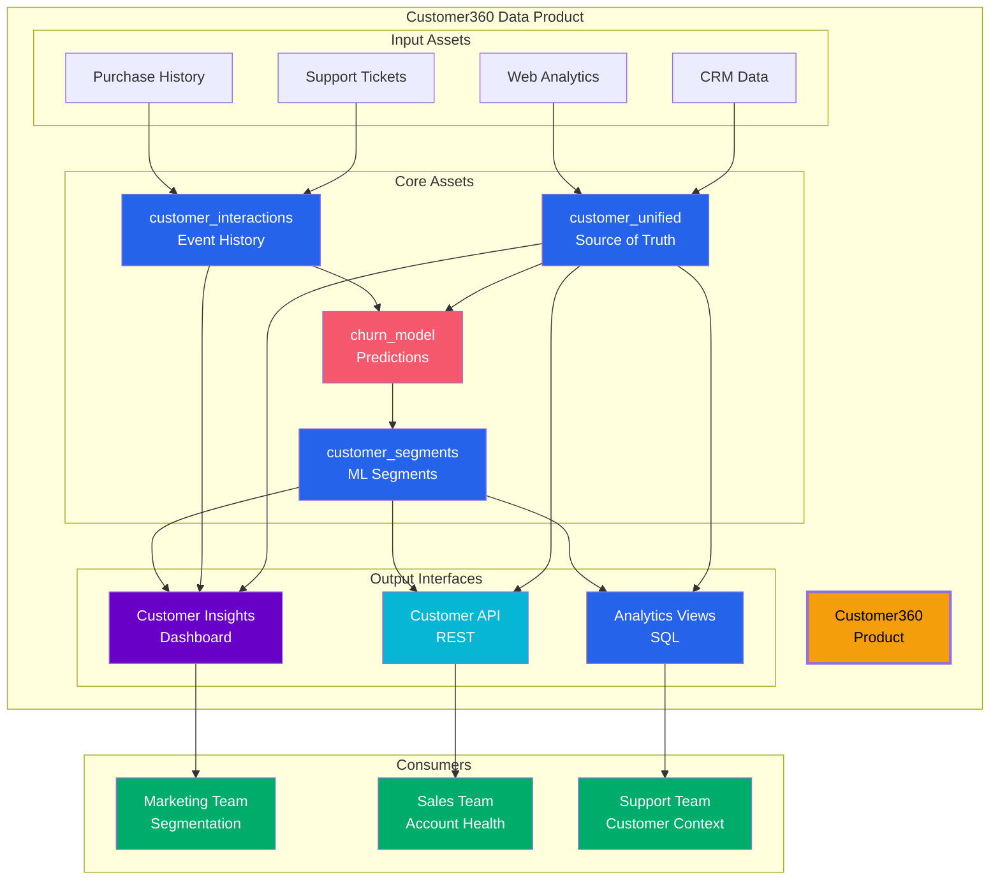
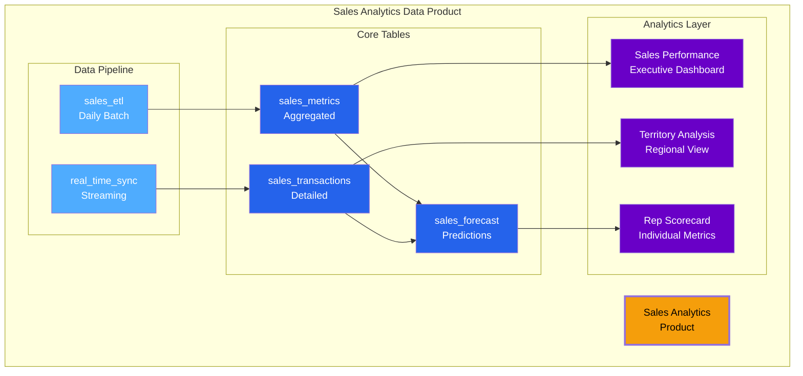
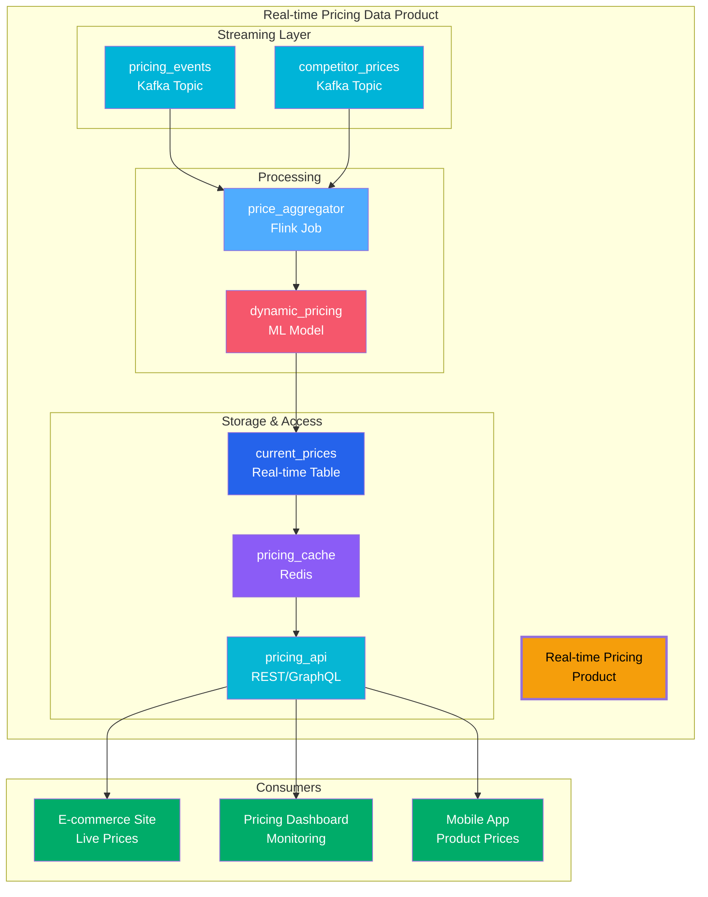

# Data Products

**Productizing data assets for consumption and sharing**

Data Products in OpenMetadata provide a framework for packaging related data assets into cohesive, discoverable, and consumable products. This product-thinking approach enables organizations to treat data as a product with defined ownership, SLAs, quality metrics, and clear value propositions for consumers.

---

## Hierarchy Overview

OpenMetadata's data product structure enables packaging of data assets within business domains:

```mermaid
graph TB
    subgraph "Domain Structure"
        DOM[Domain: Sales]

        DP1[Data Product<br/>Customer360]
        DP2[Data Product<br/>Sales Analytics]
        DP3[Data Product<br/>Real-time Pricing]

        DOM --> DP1
        DOM --> DP2
        DOM --> DP3
    end

    subgraph "Data Product Assets"
        DP1 --> TBL1[Table: customer_unified]
        DP1 --> TBL2[Table: customer_interactions]
        DP1 --> DASH1[Dashboard: Customer Insights]
        DP1 --> ML1[ML Model: churn_predictor]
        DP1 --> API1[API: customer_api]

        DP2 --> TBL3[Table: sales_metrics]
        DP2 --> DASH2[Dashboard: Sales Performance]
        DP2 --> PIPE1[Pipeline: sales_aggregation]

        DP3 --> TBL4[Table: pricing_data]
        DP3 --> TOPIC1[Topic: pricing_events]
        DP3 --> API2[API: pricing_api]
    end

    subgraph "Ownership"
        TEAM1[Team: Customer Analytics]
        USR1[User: Alice Smith]

        TEAM1 -.->|owns| DP1
        USR1 -.->|product owner| DP1
    end

    subgraph "Consumers"
        TEAM2[Team: Marketing]
        TEAM3[Team: Sales Ops]

        TEAM2 -.->|consumes| DP1
        TEAM3 -.->|consumes| DP1
    end

    style DOM fill:#8B5CF6,color:#fff
    style DP1 fill:#F59E0B,color:#000
    style DP2 fill:#F59E0B,color:#000
    style DP3 fill:#F59E0B,color:#000
    style TBL1 fill:#2563EB,color:#fff
    style TBL2 fill:#2563EB,color:#fff
    style TBL3 fill:#2563EB,color:#fff
    style TBL4 fill:#2563EB,color:#fff
    style DASH1 fill:#6900c7,color:#fff
    style DASH2 fill:#6900c7,color:#fff
    style PIPE1 fill:#4facfe,color:#fff
    style ML1 fill:#f5576c,color:#fff
    style TOPIC1 fill:#00B4D8,color:#fff
    style API1 fill:#06B6D4,color:#fff
    style API2 fill:#06B6D4,color:#fff
    style TEAM1 fill:#00ac69,color:#fff
    style USR1 fill:#0061f2,color:#fff
    style TEAM2 fill:#94A3B8,color:#fff
    style TEAM3 fill:#94A3B8,color:#fff
```



---

## Why Use Data Products?

### Product-Thinking for Data

Data products apply product management principles to data assets. Instead of fragmented tables and dashboards, users discover complete, well-documented products designed for specific use cases.

**Traditional Approach**:
```
Database: sales_db
├── customers (what is this?)
├── customer_interactions (how fresh?)
├── customer_segments (who owns this?)
└── customer_scores (can I use this?)
```

**Data Product Approach**:
```
Customer360 Data Product
├── Purpose: Unified customer view for analytics
├── Owner: Customer Analytics Team
├── SLA: Updated hourly, 99.9% quality
├── Assets:
│   ├── customer_unified (source of truth)
│   ├── customer_interactions (behavioral data)
│   ├── customer_segments (ML-based segments)
│   └── customer_insights dashboard
├── Access: API + Direct query
├── Documentation: Complete user guide
└── Consumers: Marketing, Sales, Support teams
```

### Clear Value Proposition

Each data product has a defined purpose, target consumers, and value proposition. Users understand what the product provides and why it exists.

### Ownership and Accountability

Data products have designated product owners who are accountable for quality, freshness, documentation, and evolution of the product.

### Service Level Agreements

Data products include SLAs for freshness, quality, availability, and support, setting clear expectations for consumers.

---

## Data Product Characteristics

### Discoverable

Data products are easily found through search, catalog browsing, and domain navigation. Rich metadata and documentation make them understandable.

**Example**: Marketing team searches for "customer segmentation" and finds Customer360 product with complete documentation and usage examples.

---

### Addressable

Each data product has a unique identifier and can be accessed through consistent interfaces (APIs, SQL, dashboards).

**Example**:

- API: `https://api.company.com/data-products/customer360`
- SQL: `SELECT * FROM data_products.customer360.customer_unified`
- Dashboard: `https://tableau.company.com/products/customer360`

---

### Trustworthy

Quality metrics, test results, and SLA compliance build trust. Consumers know they can rely on the data.

**Example**: Customer360 shows 99.7% quality score, last updated 15 minutes ago, all tests passing.

---

### Self-Describing

Complete documentation, schema information, lineage, and usage examples make data products self-service.

**Example**: Customer360 includes:
- Business purpose and use cases
- Data dictionary for all fields
- Sample queries and API examples
- Known limitations and caveats
- Contact information for support

---

### Secure

Access control policies ensure only authorized consumers can use the product. Sensitive data is properly classified and protected.

**Example**: Customer360 PII fields are automatically masked for most users; full access requires data privacy training and approval.

---

### Interoperable

Data products integrate with existing tools and workflows. Consumers access them through their preferred interfaces.

**Example**: Customer360 can be accessed via:
- REST API for applications
- SQL interface for analysts
- Python SDK for data scientists
- Pre-built dashboards for executives

---

## Real-World Examples

### Example 1: Customer360 Data Product



**Product Details**:

- **Owner**: Customer Analytics Team
- **Purpose**: Unified customer view for marketing, sales, and support
- **Assets**: 3 tables, 1 ML model, 1 dashboard, 1 API
- **SLA**:
  - Freshness: Updated hourly
  - Quality: > 99.5% completeness
  - Availability: 99.9% uptime
- **Consumers**: 150+ users across 12 teams
- **Access**: API, SQL, Dashboard

---

### Example 2: Sales Analytics Data Product



**Product Details**:

- **Owner**: Sales Operations Team
- **Purpose**: Comprehensive sales performance analytics
- **Assets**: 2 pipelines, 3 tables, 3 dashboards
- **SLA**:
  - Freshness: Real-time for transactions, daily for aggregations
  - Quality: > 99.9% accuracy
  - Support: 24/7 Slack channel
- **Consumers**: Sales leadership, operations, individual reps
- **Access**: Dashboards (primary), SQL (advanced users)

---

### Example 3: Real-time Pricing Data Product



**Product Details**:

- **Owner**: Pricing Team
- **Purpose**: Real-time product pricing for all channels
- **Assets**: 2 Kafka topics, 1 streaming job, 1 ML model, 1 table, 1 API
- **SLA**:
  - Latency: < 100ms API response
  - Freshness: Real-time (< 1 second)
  - Availability: 99.99% uptime
- **Consumers**: E-commerce platform, mobile apps, pricing analysts
- **Access**: REST API (primary), GraphQL (advanced)

---

## Benefits

### 1. Simplified Discovery

Users find complete data products instead of individual tables. "Customer360" is easier to discover than "dim_customer_v3_final".

### 2. Clear Ownership

Product owners are accountable for quality, documentation, and evolution. Consumers know who to contact for support.

### 3. Quality Assurance

Built-in quality metrics, automated tests, and SLA monitoring ensure trustworthy data.

### 4. Self-Service

Complete documentation and multiple access methods enable self-service consumption without constant support requests.

### 5. Reusability

Well-packaged products are reused across teams, reducing duplicate data pipelines and inconsistent metrics.

### 6. Governance

Domain-scoped products inherit governance policies. Access control, classification, and compliance are centrally managed.

### 7. Lifecycle Management

Products have clear versioning, deprecation policies, and evolution paths. Consumers understand when changes will occur.

### 8. Value Tracking

Track product adoption, usage patterns, and consumer satisfaction. Measure ROI of data investments.

---

## Data Product Lifecycle

### 1. Discovery

**Identify Opportunity**: Recognize repeated data needs across teams

**Example**: Multiple teams building their own customer segmentation models

**Activities**:

- Stakeholder interviews
- Use case analysis
- Value assessment
- Feasibility study

---

### 2. Development

**Build the Product**: Create assets, pipelines, and interfaces

**Example**: Build Customer360 with unified customer table, ML models, and API

**Activities**:

- Data pipeline development
- Quality testing
- Documentation
- Access interface creation
- SLA definition

---

### 3. Publishing

**Make Available**: Release product to consumers

**Example**: Publish Customer360 to catalog with complete documentation

**Activities**:

- Catalog registration
- Access provisioning
- Consumer onboarding
- Training materials
- Launch announcement

---

### 4. Consumption

**Active Use**: Consumers use the product

**Example**: Marketing team uses Customer360 API for campaign targeting

**Activities**:

- Monitoring usage
- Collecting feedback
- Providing support
- SLA monitoring
- Quality reporting

---

### 5. Evolution

**Continuous Improvement**: Enhance based on feedback and new requirements

**Example**: Add social media data to Customer360 based on user requests

**Activities**:

- Feature requests
- Performance optimization
- Schema evolution
- New interfaces
- Deprecation of old versions

---

## Entity Specifications

Explore the complete data product entity specification:

| Entity | Description | Specification |
|--------|-------------|---------------|
| **Data Product** | Packaged data assets ready for consumption | [View Spec](data-product.md) |

The data product specification includes:
- Complete field reference
- JSON Schema definition
- RDF/OWL ontology representation
- JSON-LD context and examples
- Relationship mappings
- API operations

[**View Data Product Entity Specification →**](data-product.md){ .md-button }

---

## Best Practices

### 1. Start with Consumer Needs

Design data products based on actual consumer use cases, not just available data.

### 2. Clear Product Owner

Assign a dedicated product owner who is accountable for the product's success.

### 3. Define SLAs

Set explicit expectations for freshness, quality, availability, and support response times.

### 4. Comprehensive Documentation

Include business context, technical details, usage examples, and limitations.

### 5. Multiple Access Methods

Support different consumption patterns (API, SQL, dashboards) for different user types.

### 6. Quality First

Implement automated quality checks and publish quality metrics transparently.

### 7. Version Management

Use semantic versioning and communicate breaking changes well in advance.

### 8. Monitor Usage

Track who's using the product and how to inform prioritization and investment decisions.

---

## Next Steps

1. **Explore Data Product Entity** - See [complete data product specification](data-product.md)
2. **Identify Opportunities** - Find repeated data needs that could become products
3. **Define Product Vision** - Articulate purpose, consumers, and value proposition
4. **Assign Ownership** - Designate product owner and team
5. **Build Assets** - Create tables, pipelines, models, and interfaces
6. **Publish to Catalog** - Register product with complete metadata
7. **Onboard Consumers** - Train users and enable self-service
8. **Iterate and Improve** - Collect feedback and continuously enhance
