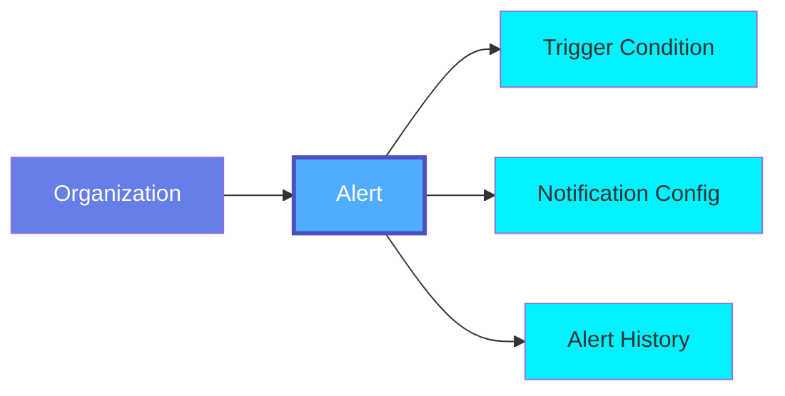

# Alert

An **Alert** is a notification mechanism in OpenMetadata that triggers when specific conditions are met, such as data quality test failures, schema changes, policy violations, or unusual activity. Alerts enable proactive monitoring and help data teams respond quickly to issues.

## Overview

Alerts in OpenMetadata provide real-time notifications for:

- **Data Quality Issues**: Test failures, data anomalies, and quality degradation
- **Schema Changes**: Unexpected changes to table schemas or column definitions
- **Policy Violations**: Breaches of access control or compliance policies
- **Operational Events**: Pipeline failures, ingestion errors, or service disruptions
- **Usage Anomalies**: Unusual query patterns or access attempts
- **Metadata Changes**: Modifications to critical metadata elements

Alerts can be configured with:
- Trigger conditions (when to fire)
- Severity levels (Critical, High, Medium, Low)
- Notification channels (Email, Slack, Webhook, MS Teams)
- Recipients (Users, Teams, or external systems)
- Throttling rules (to prevent alert fatigue)

## Hierarchy



**Click on any node to learn more about that entity.**

## Relationships

Alerts have relationships with various entities in the metadata ecosystem:

```mermaid
graph TD
    subgraph Alert Configuration
        A[Alert:<br/>Quality Test Failure] --> B1[Trigger:<br/>Test Status = Failed]
        A --> B2[Notification:<br/>Slack Channel]
        A --> B3[Notification:<br/>Email]
    end

    subgraph Monitoring Targets
        A -.->|monitors| C1[TestCase:<br/>Null Check]
        A -.->|monitors| C2[Table:<br/>customer_data]
        A -.->|monitors| C3[Pipeline:<br/>Daily ETL]
        A -.->|monitors| C4[Policy:<br/>Access Policy]
    end

    subgraph Recipients
        A -.->|notifies| D1[User:<br/>data.engineer]
        A -.->|notifies| D2[Team:<br/>Data Quality]
        A -.->|sends to| D3[Webhook:<br/>PagerDuty]
    end

    subgraph Governance
        A -.->|owned by| E1[User:<br/>Quality Lead]
        A -.->|tagged with| E2[Tag:<br/>Critical]
        A -.->|in domain| E3[Domain:<br/>Data Quality]
    end

    subgraph Alert History
        A -.->|generates| F1[AlertEvent:<br/>2024-01-15 10:30]
        A -.->|generates| F2[AlertEvent:<br/>2024-01-16 14:45]
        F1 -.->|resolves| G1[Incident:<br/>INC-001]
    end

    subgraph Related Alerts
        A -.->|depends on| H1[Alert:<br/>Upstream Failure]
        A -.->|triggers| H2[Alert:<br/>Downstream Impact]
    end

    style A fill:#4facfe,color:#fff,stroke:#4c51bf,stroke-width:3px
    style B1 fill:#00f2fe,color:#333
    style B2 fill:#00f2fe,color:#333
    style B3 fill:#00f2fe,color:#333
    style C1 fill:#764ba2,color:#fff
    style C2 fill:#764ba2,color:#fff
    style C3 fill:#764ba2,color:#fff
    style C4 fill:#764ba2,color:#fff
    style D1 fill:#43e97b,color:#333
    style D2 fill:#43e97b,color:#333
    style D3 fill:#f5576c,color:#fff
    style E1 fill:#43e97b,color:#333
    style E2 fill:#fa709a,color:#fff
    style E3 fill:#f093fb,color:#333
    style F1 fill:#ffd700,color:#333
    style F2 fill:#ffd700,color:#333
    style G1 fill:#f5576c,color:#fff
    style H1 fill:#667eea,color:#fff
    style H2 fill:#667eea,color:#fff

    click A "#alert" "Alert"
    click B1 "#trigger-condition" "Trigger"
    click C1 "../../data-quality/test-case/" "Test Case"
    click C2 "../../data-assets/databases/table/" "Table"
    click C3 "../../data-assets/pipelines/pipeline/" "Pipeline"
    click C4 "../../governance/policy/" "Policy"
    click D1 "../../teams-users/user/" "User"
    click D2 "../../teams-users/team/" "Team"
    click E1 "../../teams-users/user/" "Owner"
    click E2 "../../governance/tag/" "Tag"
    click E3 "../../domains/domain/" "Domain"
```



**Key Relationships:**

- **Alert Configuration**: Includes trigger conditions and notification channels
- **Monitoring Targets**: Test Cases, Tables, Pipelines, Policies being monitored
- **Recipients**: Users, Teams, and external systems receiving notifications
- **Governance**: Ownership, tags, and domain assignment
- **Alert History**: Events generated by the alert and resulting incidents
- **Related Alerts**: Dependencies and cascading alert relationships

## Schema Specifications

=== "JSON Schema"

    ```json
    {
      "$id": "https://open-metadata.org/schema/entity/alerts/alert.json",
      "$schema": "http://json-schema.org/draft-07/schema#",
      "title": "Alert",
      "description": "An Alert is a notification mechanism that triggers when specific conditions are met.",
      "type": "object",
      "javaType": "org.openmetadata.schema.entity.alerts.Alert",
      "javaInterfaces": [
        "org.openmetadata.schema.EntityInterface"
      ],
      "definitions": {
        "alertType": {
          "description": "Type of alert",
          "type": "string",
          "enum": [
            "DataQuality",
            "SchemaChange",
            "PolicyViolation",
            "PipelineFailure",
            "UsageAnomaly",
            "MetadataChange",
            "Custom"
          ],
          "javaEnums": [
            {
              "name": "DataQuality"
            },
            {
              "name": "SchemaChange"
            },
            {
              "name": "PolicyViolation"
            },
            {
              "name": "PipelineFailure"
            },
            {
              "name": "UsageAnomaly"
            },
            {
              "name": "MetadataChange"
            },
            {
              "name": "Custom"
            }
          ]
        },
        "severity": {
          "description": "Severity level of the alert",
          "type": "string",
          "enum": [
            "Critical",
            "High",
            "Medium",
            "Low",
            "Info"
          ]
        },
        "triggerConfig": {
          "type": "object",
          "description": "Configuration for alert trigger conditions",
          "properties": {
            "type": {
              "description": "Type of trigger",
              "type": "string",
              "enum": [
                "TestResult",
                "SchemaChange",
                "PolicyViolation",
                "PipelineStatus",
                "MetricThreshold",
                "Custom"
              ]
            },
            "condition": {
              "description": "Condition expression to evaluate",
              "type": "string"
            },
            "entities": {
              "description": "Entities being monitored",
              "type": "array",
              "items": {
                "$ref": "../../type/entityReference.json"
              }
            },
            "metrics": {
              "description": "Metrics to monitor",
              "type": "object",
              "additionalProperties": {
                "type": "number"
              }
            }
          },
          "required": [
            "type"
          ],
          "additionalProperties": false
        },
        "notificationConfig": {
          "type": "object",
          "description": "Configuration for alert notifications",
          "properties": {
            "channels": {
              "description": "Notification channels",
              "type": "array",
              "items": {
                "type": "object",
                "properties": {
                  "type": {
                    "type": "string",
                    "enum": [
                      "Email",
                      "Slack",
                      "MSTeams",
                      "Webhook",
                      "PagerDuty",
                      "Custom"
                    ]
                  },
                  "config": {
                    "description": "Channel-specific configuration",
                    "type": "object"
                  }
                },
                "required": [
                  "type"
                ]
              }
            },
            "recipients": {
              "description": "Users or teams to notify",
              "type": "array",
              "items": {
                "$ref": "../../type/entityReference.json"
              }
            },
            "throttle": {
              "description": "Throttle configuration to prevent alert fatigue",
              "type": "object",
              "properties": {
                "enabled": {
                  "type": "boolean",
                  "default": false
                },
                "duration": {
                  "description": "Throttle duration in seconds",
                  "type": "integer"
                }
              }
            }
          },
          "required": [
            "channels"
          ],
          "additionalProperties": false
        },
        "alertEvent": {
          "type": "object",
          "description": "A single alert event/occurrence",
          "properties": {
            "id": {
              "description": "Unique identifier for the event",
              "$ref": "../../type/basic.json#/definitions/uuid"
            },
            "timestamp": {
              "description": "When the alert was triggered",
              "$ref": "../../type/basic.json#/definitions/timestamp"
            },
            "status": {
              "description": "Status of the alert event",
              "type": "string",
              "enum": [
                "New",
                "Acknowledged",
                "Resolved",
                "Ignored"
              ]
            },
            "message": {
              "description": "Alert message",
              "type": "string"
            },
            "details": {
              "description": "Additional details about the event",
              "type": "object"
            },
            "resolvedBy": {
              "description": "User who resolved the alert",
              "$ref": "../../type/entityReference.json"
            },
            "resolvedAt": {
              "description": "When the alert was resolved",
              "$ref": "../../type/basic.json#/definitions/timestamp"
            }
          },
          "required": [
            "id",
            "timestamp",
            "status"
          ]
        }
      },
      "properties": {
        "id": {
          "description": "Unique identifier of the alert",
          "$ref": "../../type/basic.json#/definitions/uuid"
        },
        "name": {
          "description": "Name that identifies this alert",
          "$ref": "../../type/basic.json#/definitions/entityName"
        },
        "fullyQualifiedName": {
          "description": "Fully qualified name of the alert",
          "$ref": "../../type/basic.json#/definitions/fullyQualifiedEntityName"
        },
        "displayName": {
          "description": "Display name for the alert",
          "type": "string"
        },
        "description": {
          "description": "Description of the alert",
          "$ref": "../../type/basic.json#/definitions/markdown"
        },
        "alertType": {
          "$ref": "#/definitions/alertType"
        },
        "severity": {
          "$ref": "#/definitions/severity"
        },
        "enabled": {
          "description": "Is the alert enabled",
          "type": "boolean",
          "default": true
        },
        "triggerConfig": {
          "$ref": "#/definitions/triggerConfig"
        },
        "notificationConfig": {
          "$ref": "#/definitions/notificationConfig"
        },
        "events": {
          "description": "History of alert events",
          "type": "array",
          "items": {
            "$ref": "#/definitions/alertEvent"
          }
        },
        "owner": {
          "description": "Owner of this alert",
          "$ref": "../../type/entityReference.json"
        },
        "tags": {
          "description": "Tags for this alert",
          "type": "array",
          "items": {
            "$ref": "../../type/tagLabel.json"
          },
          "default": null
        },
        "version": {
          "description": "Metadata version of the entity",
          "$ref": "../../type/entityHistory.json#/definitions/entityVersion"
        },
        "updatedAt": {
          "description": "Last update time corresponding to the new version of the entity in Unix epoch time milliseconds",
          "$ref": "../../type/basic.json#/definitions/timestamp"
        },
        "updatedBy": {
          "description": "User who made the update",
          "type": "string"
        },
        "href": {
          "description": "Link to this alert resource",
          "$ref": "../../type/basic.json#/definitions/href"
        },
        "changeDescription": {
          "description": "Change that led to this version of the entity",
          "$ref": "../../type/entityHistory.json#/definitions/changeDescription"
        },
        "deleted": {
          "description": "When true indicates the entity has been soft deleted",
          "type": "boolean",
          "default": false
        },
        "domain": {
          "description": "Domain the alert belongs to",
          "$ref": "../../type/entityReference.json"
        }
      },
      "required": [
        "id",
        "name",
        "alertType",
        "triggerConfig",
        "notificationConfig"
      ],
      "additionalProperties": false
    }
    ```

=== "RDF (Turtle)"

    ```turtle
    @prefix om: <https://open-metadata.org/schema/> .
    @prefix om-entity: <https://open-metadata.org/schema/entity/> .
    @prefix om-alert: <https://open-metadata.org/schema/entity/alerts/> .
    @prefix rdf: <http://www.w3.org/1999/02/22-rdf-syntax-ns#> .
    @prefix rdfs: <http://www.w3.org/2000/01/rdf-schema#> .
    @prefix owl: <http://www.w3.org/2002/07/owl#> .
    @prefix xsd: <http://www.w3.org/2001/XMLSchema#> .
    @prefix dcterms: <http://purl.org/dc/terms/> .
    @prefix skos: <http://www.w3.org/2004/02/skos/core#> .
    @prefix prov: <http://www.w3.org/ns/prov#> .

    # Alert Class Definition
    om-alert:Alert a owl:Class ;
        rdfs:label "Alert" ;
        rdfs:comment "A notification mechanism that triggers when specific conditions are met" ;
        rdfs:subClassOf om-entity:Entity ;
        rdfs:isDefinedBy om: .

    # Alert Type Class
    om-alert:AlertType a owl:Class ;
        rdfs:label "Alert Type" ;
        rdfs:comment "Type of alert (DataQuality, SchemaChange, PolicyViolation, etc.)" ;
        rdfs:isDefinedBy om: .

    # Severity Class
    om-alert:Severity a owl:Class ;
        rdfs:label "Severity" ;
        rdfs:comment "Severity level of the alert" ;
        rdfs:isDefinedBy om: .

    # Trigger Config Class
    om-alert:TriggerConfig a owl:Class ;
        rdfs:label "Trigger Config" ;
        rdfs:comment "Configuration for alert trigger conditions" ;
        rdfs:isDefinedBy om: .

    # Notification Config Class
    om-alert:NotificationConfig a owl:Class ;
        rdfs:label "Notification Config" ;
        rdfs:comment "Configuration for alert notifications" ;
        rdfs:isDefinedBy om: .

    # Alert Event Class
    om-alert:AlertEvent a owl:Class ;
        rdfs:label "Alert Event" ;
        rdfs:comment "A single occurrence of an alert being triggered" ;
        rdfs:isDefinedBy om: .

    # Properties
    om-alert:alertType a owl:ObjectProperty ;
        rdfs:label "alert type" ;
        rdfs:comment "Type of the alert" ;
        rdfs:domain om-alert:Alert ;
        rdfs:range om-alert:AlertType .

    om-alert:severity a owl:ObjectProperty ;
        rdfs:label "severity" ;
        rdfs:comment "Severity level of the alert" ;
        rdfs:domain om-alert:Alert ;
        rdfs:range om-alert:Severity .

    om-alert:enabled a owl:DatatypeProperty ;
        rdfs:label "enabled" ;
        rdfs:comment "Indicates if the alert is enabled" ;
        rdfs:domain om-alert:Alert ;
        rdfs:range xsd:boolean .

    om-alert:triggerConfig a owl:ObjectProperty ;
        rdfs:label "trigger config" ;
        rdfs:comment "Configuration for when the alert should trigger" ;
        rdfs:domain om-alert:Alert ;
        rdfs:range om-alert:TriggerConfig .

    om-alert:notificationConfig a owl:ObjectProperty ;
        rdfs:label "notification config" ;
        rdfs:comment "Configuration for how notifications are sent" ;
        rdfs:domain om-alert:Alert ;
        rdfs:range om-alert:NotificationConfig .

    om-alert:monitors a owl:ObjectProperty ;
        rdfs:label "monitors" ;
        rdfs:comment "Entities being monitored by the alert" ;
        rdfs:domain om-alert:Alert ;
        rdfs:range om-entity:Entity .

    om-alert:notifies a owl:ObjectProperty ;
        rdfs:label "notifies" ;
        rdfs:comment "Users or teams to notify when alert triggers" ;
        rdfs:domain om-alert:Alert .

    om-alert:generatesEvent a owl:ObjectProperty ;
        rdfs:label "generates event" ;
        rdfs:comment "Alert events generated when triggered" ;
        rdfs:domain om-alert:Alert ;
        rdfs:range om-alert:AlertEvent .

    om-alert:eventTimestamp a owl:DatatypeProperty ;
        rdfs:label "event timestamp" ;
        rdfs:comment "When the alert event occurred" ;
        rdfs:domain om-alert:AlertEvent ;
        rdfs:range xsd:dateTime .

    om-alert:eventStatus a owl:DatatypeProperty ;
        rdfs:label "event status" ;
        rdfs:comment "Status of the alert event" ;
        rdfs:domain om-alert:AlertEvent ;
        rdfs:range xsd:string .

    om-alert:resolvedBy a owl:ObjectProperty ;
        rdfs:label "resolved by" ;
        rdfs:comment "User who resolved the alert event" ;
        rdfs:domain om-alert:AlertEvent .

    # Alert Type Individuals
    om-alert:DataQuality a om-alert:AlertType ;
        rdfs:label "Data Quality" ;
        skos:definition "Alert for data quality test failures or anomalies" .

    om-alert:SchemaChange a om-alert:AlertType ;
        rdfs:label "Schema Change" ;
        skos:definition "Alert for unexpected schema changes" .

    om-alert:PolicyViolation a om-alert:AlertType ;
        rdfs:label "Policy Violation" ;
        skos:definition "Alert for policy or compliance violations" .

    om-alert:PipelineFailure a om-alert:AlertType ;
        rdfs:label "Pipeline Failure" ;
        skos:definition "Alert for pipeline or ingestion failures" .

    om-alert:UsageAnomaly a om-alert:AlertType ;
        rdfs:label "Usage Anomaly" ;
        skos:definition "Alert for unusual usage patterns" .

    om-alert:MetadataChange a om-alert:AlertType ;
        rdfs:label "Metadata Change" ;
        skos:definition "Alert for metadata modifications" .

    # Severity Individuals
    om-alert:Critical a om-alert:Severity ;
        rdfs:label "Critical" ;
        skos:definition "Critical severity - immediate action required" .

    om-alert:High a om-alert:Severity ;
        rdfs:label "High" ;
        skos:definition "High severity - prompt action needed" .

    om-alert:Medium a om-alert:Severity ;
        rdfs:label "Medium" ;
        skos:definition "Medium severity - should be addressed soon" .

    om-alert:Low a om-alert:Severity ;
        rdfs:label "Low" ;
        skos:definition "Low severity - minor issue" .

    om-alert:Info a om-alert:Severity ;
        rdfs:label "Info" ;
        skos:definition "Informational - no action required" .
    ```

=== "JSON-LD Context"

    ```json
    {
      "@context": {
        "@vocab": "https://open-metadata.org/schema/entity/alerts/",
        "rdf": "http://www.w3.org/1999/02/22-rdf-syntax-ns#",
        "rdfs": "http://www.w3.org/2000/01/rdf-schema#",
        "owl": "http://www.w3.org/2002/07/owl#",
        "xsd": "http://www.w3.org/2001/XMLSchema#",
        "dcterms": "http://purl.org/dc/terms/",
        "skos": "http://www.w3.org/2004/02/skos/core#",
        "prov": "http://www.w3.org/ns/prov#",
        "om": "https://open-metadata.org/schema/",

        "Alert": {
          "@id": "om:Alert",
          "@type": "@id"
        },
        "id": {
          "@id": "om:id",
          "@type": "xsd:string"
        },
        "name": {
          "@id": "om:name",
          "@type": "xsd:string"
        },
        "fullyQualifiedName": {
          "@id": "om:fullyQualifiedName",
          "@type": "xsd:string"
        },
        "displayName": {
          "@id": "om:displayName",
          "@type": "xsd:string"
        },
        "description": {
          "@id": "dcterms:description",
          "@type": "xsd:string"
        },
        "alertType": {
          "@id": "om:alertType",
          "@type": "@id"
        },
        "severity": {
          "@id": "om:severity",
          "@type": "@id"
        },
        "enabled": {
          "@id": "om:enabled",
          "@type": "xsd:boolean"
        },
        "triggerConfig": {
          "@id": "om:triggerConfig",
          "@type": "@id"
        },
        "notificationConfig": {
          "@id": "om:notificationConfig",
          "@type": "@id"
        },
        "monitors": {
          "@id": "om:monitors",
          "@type": "@id",
          "@container": "@set"
        },
        "notifies": {
          "@id": "om:notifies",
          "@type": "@id",
          "@container": "@set"
        },
        "events": {
          "@id": "om:generatesEvent",
          "@type": "@id",
          "@container": "@set"
        },
        "owner": {
          "@id": "om:owner",
          "@type": "@id"
        },
        "tags": {
          "@id": "om:tags",
          "@type": "@id",
          "@container": "@set"
        },
        "domain": {
          "@id": "om:domain",
          "@type": "@id"
        },
        "version": {
          "@id": "om:version",
          "@type": "xsd:string"
        },
        "updatedAt": {
          "@id": "dcterms:modified",
          "@type": "xsd:dateTime"
        },
        "updatedBy": {
          "@id": "prov:wasAttributedTo",
          "@type": "xsd:string"
        },
        "href": {
          "@id": "om:href",
          "@type": "xsd:anyURI"
        }
      }
    }
    ```

## Use Cases

### Data Quality Alert

Alert when data quality tests fail:

```json
{
  "name": "CustomerDataQualityAlert",
  "displayName": "Customer Data Quality Alert",
  "alertType": "DataQuality",
  "severity": "High",
  "description": "Alerts when customer data quality tests fail",
  "enabled": true,
  "triggerConfig": {
    "type": "TestResult",
    "condition": "testStatus == 'Failed'",
    "entities": [
      {
        "type": "testCase",
        "name": "customer_data.null_check"
      },
      {
        "type": "testCase",
        "name": "customer_data.uniqueness_check"
      }
    ]
  },
  "notificationConfig": {
    "channels": [
      {
        "type": "Slack",
        "config": {
          "webhook": "https://hooks.slack.com/services/XXX/YYY/ZZZ",
          "channel": "#data-quality"
        }
      },
      {
        "type": "Email",
        "config": {
          "subject": "Data Quality Alert: Customer Data",
          "template": "quality_failure_template"
        }
      }
    ],
    "recipients": [
      {
        "type": "team",
        "name": "DataQuality"
      }
    ],
    "throttle": {
      "enabled": true,
      "duration": 3600
    }
  },
  "owner": {
    "type": "user",
    "name": "quality.lead"
  },
  "domain": {
    "type": "domain",
    "name": "DataQuality"
  },
  "tags": [
    {
      "tagFQN": "Alert.Critical"
    }
  ]
}
```

### Schema Change Alert

Alert when table schemas change unexpectedly:

```json
{
  "name": "ProductionSchemaChangeAlert",
  "displayName": "Production Schema Change Alert",
  "alertType": "SchemaChange",
  "severity": "Critical",
  "description": "Alerts on unexpected schema changes in production tables",
  "enabled": true,
  "triggerConfig": {
    "type": "SchemaChange",
    "condition": "columnAdded OR columnRemoved OR columnTypeChanged",
    "entities": [
      {
        "type": "table",
        "name": "production.sales.orders"
      },
      {
        "type": "table",
        "name": "production.sales.customers"
      }
    ]
  },
  "notificationConfig": {
    "channels": [
      {
        "type": "PagerDuty",
        "config": {
          "integrationKey": "XXX",
          "severity": "critical"
        }
      },
      {
        "type": "MSTeams",
        "config": {
          "webhook": "https://outlook.office.com/webhook/XXX"
        }
      }
    ],
    "recipients": [
      {
        "type": "user",
        "name": "data.engineer"
      },
      {
        "type": "team",
        "name": "DataEngineering"
      }
    ]
  },
  "owner": {
    "type": "user",
    "name": "chief.data.officer"
  },
  "tags": [
    {
      "tagFQN": "Alert.SchemaChange"
    },
    {
      "tagFQN": "Production"
    }
  ]
}
```

### Policy Violation Alert

Alert when access policies are violated:

```json
{
  "name": "PIIAccessViolationAlert",
  "displayName": "PII Access Violation Alert",
  "alertType": "PolicyViolation",
  "severity": "Critical",
  "description": "Alerts when unauthorized access to PII data is attempted",
  "enabled": true,
  "triggerConfig": {
    "type": "PolicyViolation",
    "condition": "policyViolated AND hasTag('PII.Sensitive')",
    "entities": [
      {
        "type": "policy",
        "name": "PIIMaskingPolicy"
      }
    ]
  },
  "notificationConfig": {
    "channels": [
      {
        "type": "Webhook",
        "config": {
          "endpoint": "https://api.company.com/security/alerts",
          "headers": {
            "Authorization": "Bearer XXX"
          }
        }
      },
      {
        "type": "Email",
        "config": {
          "to": "security@company.com",
          "subject": "URGENT: PII Access Violation Detected"
        }
      }
    ],
    "recipients": [
      {
        "type": "user",
        "name": "security.officer"
      },
      {
        "type": "team",
        "name": "SecurityTeam"
      }
    ]
  },
  "owner": {
    "type": "user",
    "name": "compliance.officer"
  },
  "domain": {
    "type": "domain",
    "name": "Governance"
  },
  "tags": [
    {
      "tagFQN": "Compliance.GDPR"
    },
    {
      "tagFQN": "Security.Critical"
    }
  ]
}
```

### Pipeline Failure Alert

Alert when critical pipelines fail:

```json
{
  "name": "ETLPipelineFailureAlert",
  "displayName": "ETL Pipeline Failure Alert",
  "alertType": "PipelineFailure",
  "severity": "High",
  "description": "Alerts when daily ETL pipelines fail",
  "enabled": true,
  "triggerConfig": {
    "type": "PipelineStatus",
    "condition": "status == 'Failed' OR status == 'Timeout'",
    "entities": [
      {
        "type": "pipeline",
        "name": "DailySalesETL"
      },
      {
        "type": "pipeline",
        "name": "DailyCustomerETL"
      }
    ]
  },
  "notificationConfig": {
    "channels": [
      {
        "type": "Slack",
        "config": {
          "webhook": "https://hooks.slack.com/services/XXX",
          "channel": "#data-ops",
          "mentionUsers": ["@oncall"]
        }
      }
    ],
    "recipients": [
      {
        "type": "team",
        "name": "DataOps"
      }
    ],
    "throttle": {
      "enabled": true,
      "duration": 1800
    }
  },
  "owner": {
    "type": "team",
    "name": "DataEngineering"
  }
}
```

### Metric Threshold Alert

Alert when business metrics exceed thresholds:

```json
{
  "name": "RevenueAnomalyAlert",
  "displayName": "Revenue Anomaly Alert",
  "alertType": "UsageAnomaly",
  "severity": "Medium",
  "description": "Alerts when daily revenue drops below threshold",
  "enabled": true,
  "triggerConfig": {
    "type": "MetricThreshold",
    "condition": "value < threshold",
    "metrics": {
      "daily_revenue": 100000,
      "transaction_count": 1000
    }
  },
  "notificationConfig": {
    "channels": [
      {
        "type": "Email",
        "config": {
          "to": "finance@company.com",
          "subject": "Revenue Anomaly Detected"
        }
      }
    ],
    "recipients": [
      {
        "type": "team",
        "name": "Finance"
      },
      {
        "type": "team",
        "name": "BusinessIntelligence"
      }
    ]
  },
  "owner": {
    "type": "user",
    "name": "finance.director"
  },
  "domain": {
    "type": "domain",
    "name": "Finance"
  }
}
```

## Alert Severity Levels

| Severity | Description | Response Time | Notification |
|----------|-------------|---------------|--------------|
| **Critical** | System-wide impact, immediate action required | < 15 minutes | PagerDuty, Phone, Email |
| **High** | Significant impact, prompt action needed | < 1 hour | Slack, Email |
| **Medium** | Moderate impact, should be addressed soon | < 4 hours | Slack, Email |
| **Low** | Minor impact, can be scheduled | < 1 day | Email |
| **Info** | Informational only, no action required | N/A | Email (optional) |

## Notification Channels

### Email
```json
{
  "type": "Email",
  "config": {
    "to": "team@company.com",
    "cc": "manager@company.com",
    "subject": "Alert: ${alertName}",
    "template": "alert_template",
    "includeDetails": true
  }
}
```

### Slack
```json
{
  "type": "Slack",
  "config": {
    "webhook": "https://hooks.slack.com/services/XXX/YYY/ZZZ",
    "channel": "#data-alerts",
    "mentionUsers": ["@oncall"],
    "mentionChannel": false
  }
}
```

### Microsoft Teams
```json
{
  "type": "MSTeams",
  "config": {
    "webhook": "https://outlook.office.com/webhook/XXX",
    "title": "${alertName}",
    "themeColor": "FF0000"
  }
}
```

### Webhook
```json
{
  "type": "Webhook",
  "config": {
    "endpoint": "https://api.company.com/alerts",
    "method": "POST",
    "headers": {
      "Authorization": "Bearer ${token}",
      "Content-Type": "application/json"
    },
    "body": "${alertPayload}"
  }
}
```

### PagerDuty
```json
{
  "type": "PagerDuty",
  "config": {
    "integrationKey": "XXX",
    "severity": "critical",
    "component": "data-platform"
  }
}
```

## Alert Throttling

To prevent alert fatigue, configure throttling:

```json
{
  "throttle": {
    "enabled": true,
    "duration": 3600,
    "maxAlerts": 5,
    "aggregation": "count"
  }
}
```

- **duration**: Throttle window in seconds
- **maxAlerts**: Maximum alerts to send in the window
- **aggregation**: How to aggregate (count, first, last)

## Best Practices

### 1. Set Appropriate Severity
Use severity levels that match the actual business impact.

### 2. Avoid Alert Fatigue
Use throttling and aggregation to prevent overwhelming teams with notifications.

### 3. Clear Alert Messages
Include context and actionable information in alert messages.

### 4. Route to Right Team
Send alerts to teams who can actually respond and fix issues.

### 5. Monitor Alert Effectiveness
Track alert resolution times and false positive rates.

### 6. Use Alert Dependencies
Configure alert dependencies to avoid cascading alerts.

### 7. Test Alerts
Test alert configurations before enabling in production.

### 8. Document Runbooks
Link alerts to runbooks with resolution procedures.

## Custom Properties

This entity supports custom properties through the `extension` field.
Common custom properties include:

- **Data Classification**: Sensitivity level
- **Cost Center**: Billing allocation
- **Retention Period**: Data retention requirements
- **Application Owner**: Owning application/team

See [Custom Properties](../metadata-specifications/custom-properties.md)
for details on defining and using custom properties.

---

## API Operations

### Create Alert

```http
POST /api/v1/alerts
Content-Type: application/json

{
  "name": "SampleAlert",
  "alertType": "DataQuality",
  "severity": "High",
  "triggerConfig": {...},
  "notificationConfig": {...}
}
```

### Get Alert by ID

```http
GET /api/v1/alerts/{id}
```

### Update Alert

```http
PATCH /api/v1/alerts/{id}
Content-Type: application/json-patch+json

[
  {
    "op": "replace",
    "path": "/enabled",
    "value": false
  }
]
```

### Delete Alert

```http
DELETE /api/v1/alerts/{id}
```

### List Alerts

```http
GET /api/v1/alerts?alertType=DataQuality&severity=Critical
```

### Get Alert Events

```http
GET /api/v1/alerts/{id}/events?status=New
```

### Acknowledge Alert Event

```http
POST /api/v1/alerts/{id}/events/{eventId}/acknowledge
```

### Resolve Alert Event

```http
POST /api/v1/alerts/{id}/events/{eventId}/resolve
Content-Type: application/json

{
  "resolution": "Fixed data quality issue in source system"
}
```

## Related Entities

- **[TestCase](./test-case.md)**: Test cases that can trigger quality alerts
- **[Policy](../governance/policy.md)**: Policies that trigger violation alerts
- **[Pipeline](../data-assets/pipelines/pipeline.md)**: Pipelines that trigger failure alerts
- **[Table](../data-assets/databases/table.md)**: Tables monitored for schema changes
- **[User](../teams-users/user.md)**: Users receiving alert notifications
- **[Team](../teams-users/team.md)**: Teams receiving alert notifications
- **[Domain](../domains/domain.md)**: Domains for organizing alerts
- **[Webhook](../operations/webhook.md)**: Webhooks for alert delivery
