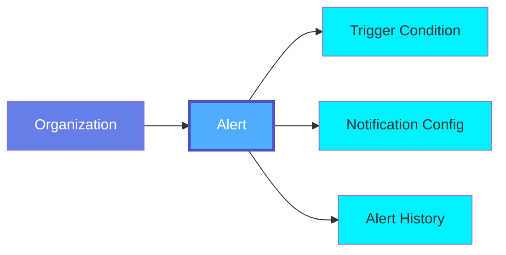

# Alert

An **Alert** in OpenMetadata is implemented through **Event Subscriptions**, which are notification mechanisms that trigger when specific conditions are met. Event Subscriptions enable proactive monitoring by sending alerts for data quality test failures, schema changes, policy violations, or unusual activity, helping data teams respond quickly to issues.

## Overview

Event Subscriptions in OpenMetadata provide notifications for:

- **Data Quality Issues**: Test failures, data anomalies, and quality degradation (Observability alerts)
- **Schema Changes**: Unexpected changes to table schemas or column definitions (Notification alerts)
- **Policy Violations**: Breaches of access control or compliance policies (Notification alerts)
- **Operational Events**: Pipeline failures, ingestion errors, or service disruptions (Observability alerts)
- **Activity Feed**: User activity and collaboration events (ActivityFeed alerts)
- **Governance Workflows**: Policy changes and approval workflows (GovernanceWorkflowChangeEvent alerts)
- **Metadata Changes**: Modifications to critical metadata elements (Notification alerts)

Event Subscriptions can be configured with:
- **Alert Types**: Notification, Observability, ActivityFeed, GovernanceWorkflowChangeEvent, or Custom
- **Triggers**: Real-time or scheduled (daily, weekly, monthly, custom cron)
- **Filtering Rules**: Conditional rules to filter events based on resources and event properties
- **Destinations**: Multiple notification channels (Email, Slack, Webhook, MS Teams, Google Chat)
- **Subscription Categories**: Target specific recipients (Users, Teams, Owners, Followers, Admins, External)
- **Batch Processing**: Configurable batch size and retry logic
- **Downstream Notifications**: Notify stakeholders of dependent downstream entities

## Hierarchy



**Click on any node to learn more about that entity.**

## Relationships

Alerts have relationships with various entities in the metadata ecosystem:

```mermaid
graph TD
    subgraph Alert Configuration
        A[Alert:<br/>Quality Test Failure] --> B1[Trigger:<br/>Test Status = Failed]
        A --> B2[Notification:<br/>Slack Channel]
        A --> B3[Notification:<br/>Email]
    end

    subgraph Monitoring Targets
        A -.->|monitors| C1[TestCase:<br/>Null Check]
        A -.->|monitors| C2[Table:<br/>customer_data]
        A -.->|monitors| C3[Pipeline:<br/>Daily ETL]
        A -.->|monitors| C4[Policy:<br/>Access Policy]
    end

    subgraph Recipients
        A -.->|notifies| D1[User:<br/>data.engineer]
        A -.->|notifies| D2[Team:<br/>Data Quality]
        A -.->|sends to| D3[Webhook:<br/>PagerDuty]
    end

    subgraph Governance
        A -.->|owned by| E1[User:<br/>Quality Lead]
        A -.->|tagged with| E2[Tag:<br/>Critical]
        A -.->|in domain| E3[Domain:<br/>Data Quality]
    end

    subgraph Alert History
        A -.->|generates| F1[AlertEvent:<br/>2024-01-15 10:30]
        A -.->|generates| F2[AlertEvent:<br/>2024-01-16 14:45]
        F1 -.->|resolves| G1[Incident:<br/>INC-001]
    end

    subgraph Related Alerts
        A -.->|depends on| H1[Alert:<br/>Upstream Failure]
        A -.->|triggers| H2[Alert:<br/>Downstream Impact]
    end

    style A fill:#4facfe,color:#fff,stroke:#4c51bf,stroke-width:3px
    style B1 fill:#00f2fe,color:#333
    style B2 fill:#00f2fe,color:#333
    style B3 fill:#00f2fe,color:#333
    style C1 fill:#764ba2,color:#fff
    style C2 fill:#764ba2,color:#fff
    style C3 fill:#764ba2,color:#fff
    style C4 fill:#764ba2,color:#fff
    style D1 fill:#43e97b,color:#333
    style D2 fill:#43e97b,color:#333
    style D3 fill:#f5576c,color:#fff
    style E1 fill:#43e97b,color:#333
    style E2 fill:#fa709a,color:#fff
    style E3 fill:#f093fb,color:#333
    style F1 fill:#ffd700,color:#333
    style F2 fill:#ffd700,color:#333
    style G1 fill:#f5576c,color:#fff
    style H1 fill:#667eea,color:#fff
    style H2 fill:#667eea,color:#fff

    click A "#alert" "Alert"
    click B1 "#trigger-condition" "Trigger"
    click C1 "../../data-quality/test-case/" "Test Case"
    click C2 "../../data-assets/databases/table/" "Table"
    click C3 "../../data-assets/pipelines/pipeline/" "Pipeline"
    click C4 "../../governance/policy/" "Policy"
    click D1 "../../teams-users/user/" "User"
    click D2 "../../teams-users/team/" "Team"
    click E1 "../../teams-users/user/" "Owner"
    click E2 "../../governance/tag/" "Tag"
    click E3 "../../domains/domain/" "Domain"
```



**Key Relationships:**

- **Alert Configuration**: Includes trigger conditions and notification channels
- **Monitoring Targets**: Test Cases, Tables, Pipelines, Policies being monitored
- **Recipients**: Users, Teams, and external systems receiving notifications
- **Governance**: Ownership, tags, and domain assignment
- **Alert History**: Events generated by the alert and resulting incidents
- **Related Alerts**: Dependencies and cascading alert relationships

## Schema Specifications

=== "JSON Schema"

    ```json
    {
      "$id": "https://open-metadata.org/schema/events/eventSubscription.json",
      "$schema": "http://json-schema.org/draft-07/schema#",
      "title": "EventSubscription",
      "description": "This schema defines the EventSubscription entity. An Event Subscription has trigger, filters and Subscription",
      "type": "object",
      "javaType": "org.openmetadata.schema.entity.events.EventSubscription",
      "javaInterfaces": ["org.openmetadata.schema.EntityInterface"],
      "definitions": {
        "alertType": {
          "description": "Type of Alerts supported.",
          "type": "string",
          "enum": ["Notification", "Observability", "ActivityFeed", "GovernanceWorkflowChangeEvent", "Custom"],
          "default": "Notification"
        },
        "triggerType": {
          "description": "Trigger Configuration for Alerts.",
          "type": "string",
          "enum": ["RealTime", "Scheduled"],
          "default": "RealTime"
        },
        "subscriptionCategory": {
          "description": "Subscription Endpoint Type.",
          "type": "string",
          "enum": [
            "Users",
            "Teams",
            "Admins",
            "Assignees",
            "Owners",
            "Mentions",
            "Followers",
            "External"
          ]
        },
        "subscriptionType": {
          "description": "Subscription Endpoint Type.",
          "type": "string",
          "enum": [
            "Webhook",
            "Slack",
            "MsTeams",
            "GChat",
            "Email",
            "ActivityFeed",
            "GovernanceWorkflowChangeEvent"
          ]
        },
        "trigger": {
          "description": "Trigger Configuration for Alerts.",
          "type": "object",
          "javaType": "org.openmetadata.schema.entity.events.TriggerConfig",
          "properties": {
            "triggerType": {
              "$ref": "#/definitions/triggerType"
            },
            "scheduleInfo": {
              "description": "Schedule Info",
              "type": "string",
              "enum": ["Daily", "Weekly", "Monthly", "Custom"],
              "default": "Weekly"
            },
            "cronExpression": {
              "description": "Cron Expression in case of Custom scheduled Trigger",
              "type": "string"
            }
          },
          "required": ["triggerType"],
          "additionalProperties": false
        },
        "filteringRules": {
          "description": "Filtering Rules for Event Subscription.",
          "type": "object",
          "javaType": "org.openmetadata.schema.entity.events.FilteringRules",
          "properties": {
            "resources": {
              "description": "Defines a list of resources that triggers the Event Subscription, Eg All, User, Teams etc.",
              "type": "array",
              "items": {
                "type": "string"
              }
            },
            "rules": {
              "description": "A set of filter rules associated with the Alert.",
              "type": "array",
              "items": {
                "$ref": "./eventFilterRule.json"
              }
            },
            "actions": {
              "description": "A set of filter rules associated with the Alert.",
              "type": "array",
              "items": {
                "$ref": "./eventFilterRule.json"
              }
            }
          },
          "required": ["resources"],
          "additionalProperties": false
        },
        "destination": {
          "description": "Subscription which has a type and the config.",
          "type": "object",
          "javaType": "org.openmetadata.schema.entity.events.SubscriptionDestination",
          "properties": {
            "id": {
              "description": "Unique identifier that identifies this Event Subscription.",
              "$ref": "../type/basic.json#/definitions/uuid"
            },
            "category": {
              "$ref": "#/definitions/subscriptionCategory"
            },
            "type": {
              "$ref": "#/definitions/subscriptionType"
            },
            "statusDetails": {
              "oneOf": [
                {
                  "$ref": "../events/subscriptionStatus.json"
                },
                {
                  "$ref": "../events/testDestinationStatus.json"
                }
              ]
            },
            "timeout": {
              "description": "Connection timeout in seconds. (Default 10s).",
              "type": "integer",
              "default": 10
            },
            "readTimeout": {
              "description": "Read timeout in seconds. (Default 12s).",
              "type": "integer",
              "default": 12
            },
            "enabled": {
              "description": "Is the subscription enabled.",
              "type": "boolean",
              "default": true
            },
            "config": {
              "oneOf": [
                {
                  "$ref": "../entity/events/webhook.json"
                },
                {
                  "$ref": "./emailAlertConfig.json"
                },
                {
                  "$ref": "../type/basic.json#/definitions/map"
                }
              ]
            },
            "notifyDownstream": {
              "description": "Enable notification of downstream entity stakeholders. When true, notifications will traverse lineage to include stakeholders of entities that consume data from the affected entity.",
              "type": "boolean",
              "default": false
            },
            "downstreamDepth": {
              "description": "Maximum depth for downstream stakeholder notification traversal. If null, traverses without depth limit (with cycle protection).",
              "type": ["integer", "null"],
              "minimum": 1,
              "default": null
            }
          },
          "required": ["category", "type"],
          "additionalProperties": false
        },
        "status": {
          "description": "Status is `disabled`, when eventSubscription was created with `enabled` set to false and it never started publishing events. Status is `active` when eventSubscription is normally functioning and 200 OK response was received for callback notification. Status is `failed` on bad callback URL, connection failures, `1xx`, and `3xx` response was received for callback notification. Status is `awaitingRetry` when previous attempt at callback timed out or received `4xx`, `5xx` response. Status is `retryLimitReached` after all retries fail.",
          "type": "string",
          "enum": [
            "disabled",
            "failed",
            "retryLimitReached",
            "awaitingRetry",
            "active"
          ]
        }
      },
      "properties": {
        "id": {
          "description": "Unique identifier that identifies this Event Subscription.",
          "$ref": "../type/basic.json#/definitions/uuid"
        },
        "className": {
          "description": "Java class for the Event Subscription.",
          "type": "string"
        },
        "name": {
          "description": "Name that uniquely identifies this Event Subscription.",
          "$ref": "../type/basic.json#/definitions/entityName"
        },
        "fullyQualifiedName": {
          "description": "FullyQualifiedName that uniquely identifies a Event Subscription.",
          "$ref": "../type/basic.json#/definitions/fullyQualifiedEntityName"
        },
        "displayName": {
          "description": "Display name for this Event Subscription.",
          "type": "string"
        },
        "description": {
          "description": "A short description of the Event Subscription, comprehensible to regular users.",
          "$ref": "../type/basic.json#/definitions/markdown"
        },
        "owners": {
          "description": "Owners of this Event Subscription.",
          "$ref": "../type/entityReferenceList.json",
          "default": null
        },
        "href": {
          "description": "Link to the resource corresponding to this entity.",
          "$ref": "../type/basic.json#/definitions/href"
        },
        "version": {
          "description": "Metadata version of the Event Subscription.",
          "$ref": "../type/entityHistory.json#/definitions/entityVersion"
        },
        "updatedAt": {
          "description": "Last update time corresponding to the new version of the Event Subscription in Unix epoch time milliseconds.",
          "$ref": "../type/basic.json#/definitions/timestamp"
        },
        "updatedBy": {
          "description": "User who made the update.",
          "type": "string"
        },
        "changeDescription": {
          "description": "Change that led to this version of the Event Subscription.",
          "$ref": "../type/entityHistory.json#/definitions/changeDescription"
        },
        "incrementalChangeDescription": {
          "description": "Change that lead to this version of the entity.",
          "$ref": "../type/entityHistory.json#/definitions/changeDescription"
        },
        "alertType": {
          "description": "Type of Alert",
          "$ref": "#/definitions/alertType"
        },
        "trigger": {
          "description": "Trigger information for Alert.",
          "$ref": "#/definitions/trigger"
        },
        "filteringRules": {
          "description": "Set of rules that the Event Subscription Contains to allow conditional control for alerting.",
          "$ref": "#/definitions/filteringRules"
        },
        "destinations": {
          "description": "Destination Config.",
          "type": "array",
          "items": {
            "$ref": "#/definitions/destination"
          }
        },
        "notificationTemplate": {
          "description": "Optional custom notification template for this subscription. When not set, system default template will be used. Only USER templates can be assigned.",
          "$ref": "../type/entityReference.json"
        },
        "enabled": {
          "description": "Is the event Subscription enabled.",
          "type": "boolean",
          "default": true
        },
        "batchSize": {
          "description": "Maximum number of events sent in a batch (Default 100).",
          "type": "integer",
          "default": 100
        },
        "provider": {
          "$ref": "../type/basic.json#/definitions/providerType"
        },
        "retries": {
          "description": "Number of times to retry callback on failure. (Default 3).",
          "type": "integer",
          "default": 3
        },
        "pollInterval": {
          "description": "Poll Interval in seconds.",
          "type": "integer",
          "default": 60
        },
        "input": {
          "description": "Input for the Filters.",
          "$ref": "#/definitions/alertFilteringInput"
        },
        "domains": {
          "description": "Domains the asset belongs to. When not set, the asset inherits the domain from the parent it belongs to.",
          "$ref": "../type/entityReferenceList.json"
        },
        "config": {
          "$ref": "../type/basic.json#/definitions/map"
        }
      },
      "required": ["id", "name", "alertType", "destinations"],
      "additionalProperties": false
    }
    ```

=== "RDF (Turtle)"

    ```turtle
    @prefix om: <https://open-metadata.org/schema/> .
    @prefix om-entity: <https://open-metadata.org/schema/entity/> .
    @prefix om-events: <https://open-metadata.org/schema/events/> .
    @prefix rdf: <http://www.w3.org/1999/02/22-rdf-syntax-ns#> .
    @prefix rdfs: <http://www.w3.org/2000/01/rdf-schema#> .
    @prefix owl: <http://www.w3.org/2002/07/owl#> .
    @prefix xsd: <http://www.w3.org/2001/XMLSchema#> .
    @prefix dcterms: <http://purl.org/dc/terms/> .
    @prefix skos: <http://www.w3.org/2004/02/skos/core#> .
    @prefix prov: <http://www.w3.org/ns/prov#> .

    # EventSubscription Class Definition
    om-events:EventSubscription a owl:Class ;
        rdfs:label "Event Subscription" ;
        rdfs:comment "An Event Subscription has trigger, filters and subscription destinations for alerts and notifications" ;
        rdfs:subClassOf om-entity:Entity ;
        rdfs:isDefinedBy om: .

    # Alert Type Class
    om-events:AlertType a owl:Class ;
        rdfs:label "Alert Type" ;
        rdfs:comment "Type of alerts supported (Notification, Observability, ActivityFeed, etc.)" ;
        rdfs:isDefinedBy om: .

    # Trigger Type Class
    om-events:TriggerType a owl:Class ;
        rdfs:label "Trigger Type" ;
        rdfs:comment "Type of trigger (RealTime or Scheduled)" ;
        rdfs:isDefinedBy om: .

    # Subscription Category Class
    om-events:SubscriptionCategory a owl:Class ;
        rdfs:label "Subscription Category" ;
        rdfs:comment "Category of subscription recipients" ;
        rdfs:isDefinedBy om: .

    # Subscription Type Class
    om-events:SubscriptionType a owl:Class ;
        rdfs:label "Subscription Type" ;
        rdfs:comment "Type of subscription channel" ;
        rdfs:isDefinedBy om: .

    # Trigger Config Class
    om-events:TriggerConfig a owl:Class ;
        rdfs:label "Trigger Config" ;
        rdfs:comment "Configuration for alert trigger conditions" ;
        rdfs:isDefinedBy om: .

    # Filtering Rules Class
    om-events:FilteringRules a owl:Class ;
        rdfs:label "Filtering Rules" ;
        rdfs:comment "Filtering rules for event subscription" ;
        rdfs:isDefinedBy om: .

    # Subscription Destination Class
    om-events:SubscriptionDestination a owl:Class ;
        rdfs:label "Subscription Destination" ;
        rdfs:comment "Destination configuration for notifications" ;
        rdfs:isDefinedBy om: .

    # Status Class
    om-events:Status a owl:Class ;
        rdfs:label "Status" ;
        rdfs:comment "Status of the event subscription" ;
        rdfs:isDefinedBy om: .

    # Properties
    om-events:alertType a owl:ObjectProperty ;
        rdfs:label "alert type" ;
        rdfs:comment "Type of the alert" ;
        rdfs:domain om-events:EventSubscription ;
        rdfs:range om-events:AlertType .

    om-events:enabled a owl:DatatypeProperty ;
        rdfs:label "enabled" ;
        rdfs:comment "Indicates if the event subscription is enabled" ;
        rdfs:domain om-events:EventSubscription ;
        rdfs:range xsd:boolean .

    om-events:trigger a owl:ObjectProperty ;
        rdfs:label "trigger" ;
        rdfs:comment "Trigger configuration for the alert" ;
        rdfs:domain om-events:EventSubscription ;
        rdfs:range om-events:TriggerConfig .

    om-events:filteringRules a owl:ObjectProperty ;
        rdfs:label "filtering rules" ;
        rdfs:comment "Set of rules for conditional control" ;
        rdfs:domain om-events:EventSubscription ;
        rdfs:range om-events:FilteringRules .

    om-events:destinations a owl:ObjectProperty ;
        rdfs:label "destinations" ;
        rdfs:comment "Destination configurations for notifications" ;
        rdfs:domain om-events:EventSubscription ;
        rdfs:range om-events:SubscriptionDestination .

    om-events:batchSize a owl:DatatypeProperty ;
        rdfs:label "batch size" ;
        rdfs:comment "Maximum number of events sent in a batch" ;
        rdfs:domain om-events:EventSubscription ;
        rdfs:range xsd:integer .

    om-events:retries a owl:DatatypeProperty ;
        rdfs:label "retries" ;
        rdfs:comment "Number of times to retry callback on failure" ;
        rdfs:domain om-events:EventSubscription ;
        rdfs:range xsd:integer .

    om-events:pollInterval a owl:DatatypeProperty ;
        rdfs:label "poll interval" ;
        rdfs:comment "Poll interval in seconds" ;
        rdfs:domain om-events:EventSubscription ;
        rdfs:range xsd:integer .

    om-events:notifyDownstream a owl:DatatypeProperty ;
        rdfs:label "notify downstream" ;
        rdfs:comment "Enable notification of downstream entity stakeholders" ;
        rdfs:domain om-events:SubscriptionDestination ;
        rdfs:range xsd:boolean .

    om-events:downstreamDepth a owl:DatatypeProperty ;
        rdfs:label "downstream depth" ;
        rdfs:comment "Maximum depth for downstream stakeholder notification traversal" ;
        rdfs:domain om-events:SubscriptionDestination ;
        rdfs:range xsd:integer .

    # Alert Type Individuals
    om-events:Notification a om-events:AlertType ;
        rdfs:label "Notification" ;
        skos:definition "General notification alert" .

    om-events:Observability a om-events:AlertType ;
        rdfs:label "Observability" ;
        skos:definition "Observability and monitoring alert" .

    om-events:ActivityFeed a om-events:AlertType ;
        rdfs:label "Activity Feed" ;
        skos:definition "Activity feed notification" .

    om-events:GovernanceWorkflowChangeEvent a om-events:AlertType ;
        rdfs:label "Governance Workflow Change Event" ;
        skos:definition "Governance workflow change notification" .

    om-events:Custom a om-events:AlertType ;
        rdfs:label "Custom" ;
        skos:definition "Custom alert type" .

    # Trigger Type Individuals
    om-events:RealTime a om-events:TriggerType ;
        rdfs:label "Real Time" ;
        skos:definition "Real-time trigger" .

    om-events:Scheduled a om-events:TriggerType ;
        rdfs:label "Scheduled" ;
        skos:definition "Scheduled trigger" .

    # Subscription Type Individuals
    om-events:Webhook a om-events:SubscriptionType ;
        rdfs:label "Webhook" ;
        skos:definition "Webhook notification channel" .

    om-events:Slack a om-events:SubscriptionType ;
        rdfs:label "Slack" ;
        skos:definition "Slack notification channel" .

    om-events:MsTeams a om-events:SubscriptionType ;
        rdfs:label "MS Teams" ;
        skos:definition "Microsoft Teams notification channel" .

    om-events:GChat a om-events:SubscriptionType ;
        rdfs:label "Google Chat" ;
        skos:definition "Google Chat notification channel" .

    om-events:Email a om-events:SubscriptionType ;
        rdfs:label "Email" ;
        skos:definition "Email notification channel" .
    ```

=== "JSON-LD Context"

    ```json
    {
      "@context": {
        "@vocab": "https://open-metadata.org/schema/events/",
        "rdf": "http://www.w3.org/1999/02/22-rdf-syntax-ns#",
        "rdfs": "http://www.w3.org/2000/01/rdf-schema#",
        "owl": "http://www.w3.org/2002/07/owl#",
        "xsd": "http://www.w3.org/2001/XMLSchema#",
        "dcterms": "http://purl.org/dc/terms/",
        "skos": "http://www.w3.org/2004/02/skos/core#",
        "prov": "http://www.w3.org/ns/prov#",
        "om": "https://open-metadata.org/schema/",

        "EventSubscription": {
          "@id": "om:EventSubscription",
          "@type": "@id"
        },
        "id": {
          "@id": "om:id",
          "@type": "xsd:string"
        },
        "className": {
          "@id": "om:className",
          "@type": "xsd:string"
        },
        "name": {
          "@id": "om:name",
          "@type": "xsd:string"
        },
        "fullyQualifiedName": {
          "@id": "om:fullyQualifiedName",
          "@type": "xsd:string"
        },
        "displayName": {
          "@id": "om:displayName",
          "@type": "xsd:string"
        },
        "description": {
          "@id": "dcterms:description",
          "@type": "xsd:string"
        },
        "owners": {
          "@id": "om:owners",
          "@type": "@id",
          "@container": "@set"
        },
        "alertType": {
          "@id": "om:alertType",
          "@type": "@id"
        },
        "enabled": {
          "@id": "om:enabled",
          "@type": "xsd:boolean"
        },
        "trigger": {
          "@id": "om:trigger",
          "@type": "@id"
        },
        "filteringRules": {
          "@id": "om:filteringRules",
          "@type": "@id"
        },
        "destinations": {
          "@id": "om:destinations",
          "@type": "@id",
          "@container": "@set"
        },
        "notificationTemplate": {
          "@id": "om:notificationTemplate",
          "@type": "@id"
        },
        "batchSize": {
          "@id": "om:batchSize",
          "@type": "xsd:integer"
        },
        "provider": {
          "@id": "om:provider",
          "@type": "xsd:string"
        },
        "retries": {
          "@id": "om:retries",
          "@type": "xsd:integer"
        },
        "pollInterval": {
          "@id": "om:pollInterval",
          "@type": "xsd:integer"
        },
        "input": {
          "@id": "om:input",
          "@type": "@id"
        },
        "domains": {
          "@id": "om:domains",
          "@type": "@id",
          "@container": "@set"
        },
        "config": {
          "@id": "om:config",
          "@type": "@id"
        },
        "version": {
          "@id": "om:version",
          "@type": "xsd:string"
        },
        "updatedAt": {
          "@id": "dcterms:modified",
          "@type": "xsd:dateTime"
        },
        "updatedBy": {
          "@id": "prov:wasAttributedTo",
          "@type": "xsd:string"
        },
        "href": {
          "@id": "om:href",
          "@type": "xsd:anyURI"
        },
        "changeDescription": {
          "@id": "om:changeDescription",
          "@type": "@id"
        },
        "incrementalChangeDescription": {
          "@id": "om:incrementalChangeDescription",
          "@type": "@id"
        }
      }
    }
    ```

## Use Cases

### Data Quality Alert

Alert when data quality tests fail:

```json
{
  "name": "CustomerDataQualityAlert",
  "displayName": "Customer Data Quality Alert",
  "alertType": "Observability",
  "description": "Alerts when customer data quality tests fail",
  "enabled": true,
  "trigger": {
    "triggerType": "RealTime"
  },
  "filteringRules": {
    "resources": ["testCase"],
    "rules": [
      {
        "name": "testFailureFilter",
        "effect": "include",
        "condition": "testStatus == 'Failed'"
      }
    ]
  },
  "destinations": [
    {
      "category": "External",
      "type": "Slack",
      "enabled": true,
      "config": {
        "endpoint": "https://hooks.slack.com/services/XXX/YYY/ZZZ"
      }
    },
    {
      "category": "Teams",
      "type": "Email",
      "enabled": true,
      "config": {
        "receivers": ["dataquality@company.com"],
        "sendToOwners": true,
        "sendToFollowers": false
      }
    }
  ],
  "owners": [
    {
      "type": "user",
      "name": "quality.lead"
    }
  ],
  "domains": [
    {
      "type": "domain",
      "name": "DataQuality"
    }
  ],
  "batchSize": 100,
  "retries": 3
}
```

### Schema Change Alert

Alert when table schemas change unexpectedly:

```json
{
  "name": "ProductionSchemaChangeAlert",
  "displayName": "Production Schema Change Alert",
  "alertType": "Notification",
  "description": "Alerts on unexpected schema changes in production tables",
  "enabled": true,
  "trigger": {
    "triggerType": "RealTime"
  },
  "filteringRules": {
    "resources": ["table"],
    "rules": [
      {
        "name": "schemaChangeFilter",
        "effect": "include",
        "condition": "eventType == 'entityUpdated' && fieldChanged == 'columns'"
      }
    ]
  },
  "destinations": [
    {
      "category": "External",
      "type": "MsTeams",
      "enabled": true,
      "config": {
        "endpoint": "https://outlook.office.com/webhook/XXX"
      }
    },
    {
      "category": "Owners",
      "type": "Email",
      "enabled": true,
      "config": {
        "sendToOwners": true,
        "sendToFollowers": true
      }
    }
  ],
  "owners": [
    {
      "type": "user",
      "name": "chief.data.officer"
    }
  ],
  "batchSize": 50,
  "retries": 3
}
```

### Policy Violation Alert

Alert when access policies are violated:

```json
{
  "name": "PIIAccessViolationAlert",
  "displayName": "PII Access Violation Alert",
  "alertType": "Notification",
  "description": "Alerts when unauthorized access to PII data is attempted",
  "enabled": true,
  "trigger": {
    "triggerType": "RealTime"
  },
  "filteringRules": {
    "resources": ["policy"],
    "rules": [
      {
        "name": "piiViolationFilter",
        "effect": "include",
        "condition": "eventType == 'policyViolation' && tags.contains('PII.Sensitive')"
      }
    ]
  },
  "destinations": [
    {
      "category": "External",
      "type": "Webhook",
      "enabled": true,
      "config": {
        "endpoint": "https://api.company.com/security/alerts",
        "headers": {
          "Authorization": "Bearer XXX"
        }
      }
    },
    {
      "category": "Admins",
      "type": "Email",
      "enabled": true,
      "config": {
        "receivers": ["security@company.com"],
        "sendToAdmins": true
      }
    }
  ],
  "owners": [
    {
      "type": "user",
      "name": "compliance.officer"
    }
  ],
  "domains": [
    {
      "type": "domain",
      "name": "Governance"
    }
  ],
  "batchSize": 10,
  "retries": 5
}
```

### Pipeline Failure Alert

Alert when critical pipelines fail:

```json
{
  "name": "ETLPipelineFailureAlert",
  "displayName": "ETL Pipeline Failure Alert",
  "alertType": "Observability",
  "description": "Alerts when daily ETL pipelines fail",
  "enabled": true,
  "trigger": {
    "triggerType": "RealTime"
  },
  "filteringRules": {
    "resources": ["pipeline"],
    "rules": [
      {
        "name": "pipelineFailureFilter",
        "effect": "include",
        "condition": "pipelineStatus == 'Failed' || pipelineStatus == 'PartialSuccess'"
      }
    ]
  },
  "destinations": [
    {
      "category": "External",
      "type": "Slack",
      "enabled": true,
      "config": {
        "endpoint": "https://hooks.slack.com/services/XXX"
      }
    },
    {
      "category": "Owners",
      "type": "Email",
      "enabled": true,
      "config": {
        "sendToOwners": true,
        "sendToFollowers": true
      }
    }
  ],
  "owners": [
    {
      "type": "team",
      "name": "DataEngineering"
    }
  ],
  "batchSize": 25,
  "retries": 3,
  "pollInterval": 60
}
```

### Scheduled Metric Alert

Alert when business metrics exceed thresholds (scheduled check):

```json
{
  "name": "RevenueAnomalyAlert",
  "displayName": "Revenue Anomaly Alert",
  "alertType": "Observability",
  "description": "Alerts when daily revenue drops below threshold",
  "enabled": true,
  "trigger": {
    "triggerType": "Scheduled",
    "scheduleInfo": "Daily",
    "cronExpression": "0 0 8 * * ?"
  },
  "filteringRules": {
    "resources": ["table"],
    "rules": [
      {
        "name": "revenueThresholdFilter",
        "effect": "include",
        "condition": "testCase.testCaseResult.testCaseStatus == 'Failed' && testCase.name == 'revenue_threshold_check'"
      }
    ]
  },
  "destinations": [
    {
      "category": "Teams",
      "type": "Email",
      "enabled": true,
      "config": {
        "receivers": ["finance@company.com"],
        "sendToOwners": true
      }
    }
  ],
  "owners": [
    {
      "type": "user",
      "name": "finance.director"
    }
  ],
  "domains": [
    {
      "type": "domain",
      "name": "Finance"
    }
  ],
  "batchSize": 50,
  "retries": 2
}
```

## Alert Types

OpenMetadata supports the following alert types:

| Alert Type | Description | Use Case |
|----------|-------------|----------|
| **Notification** | General notifications for entity changes | Schema changes, metadata updates, ownership changes |
| **Observability** | Monitoring and quality alerts | Data quality test failures, pipeline failures, metric thresholds |
| **ActivityFeed** | Activity feed notifications | User activity, collaboration events |
| **GovernanceWorkflowChangeEvent** | Governance workflow notifications | Policy changes, approval workflows |
| **Custom** | Custom alert types | Organization-specific requirements |

## Subscription Categories

Event subscriptions can target different categories of recipients:

| Category | Description |
|----------|-------------|
| **Users** | Specific individual users |
| **Teams** | Entire teams |
| **Admins** | System administrators |
| **Assignees** | Users assigned to tasks or workflows |
| **Owners** | Entity owners |
| **Mentions** | Users mentioned in discussions |
| **Followers** | Users following specific entities |
| **External** | External systems via webhooks |

## Notification Channels

### Email
```json
{
  "category": "Teams",
  "type": "Email",
  "enabled": true,
  "timeout": 10,
  "readTimeout": 12,
  "config": {
    "receivers": ["team@company.com", "manager@company.com"],
    "sendToAdmins": false,
    "sendToOwners": true,
    "sendToFollowers": false
  }
}
```

### Slack
```json
{
  "category": "External",
  "type": "Slack",
  "enabled": true,
  "timeout": 10,
  "readTimeout": 12,
  "config": {
    "endpoint": "https://hooks.slack.com/services/XXX/YYY/ZZZ"
  }
}
```

### Microsoft Teams
```json
{
  "category": "External",
  "type": "MsTeams",
  "enabled": true,
  "timeout": 10,
  "readTimeout": 12,
  "config": {
    "endpoint": "https://outlook.office.com/webhook/XXX"
  }
}
```

### Google Chat
```json
{
  "category": "External",
  "type": "GChat",
  "enabled": true,
  "timeout": 10,
  "readTimeout": 12,
  "config": {
    "endpoint": "https://chat.googleapis.com/v1/spaces/XXX/messages"
  }
}
```

### Webhook
```json
{
  "category": "External",
  "type": "Webhook",
  "enabled": true,
  "timeout": 10,
  "readTimeout": 12,
  "config": {
    "endpoint": "https://api.company.com/alerts",
    "secretKey": "your-secret-key",
    "headers": {
      "Authorization": "Bearer XXX",
      "Content-Type": "application/json"
    },
    "httpMethod": "POST"
  }
}
```

## Downstream Notifications

Event subscriptions support notifying stakeholders of downstream entities that depend on the affected entity:

```json
{
  "category": "Owners",
  "type": "Email",
  "enabled": true,
  "notifyDownstream": true,
  "downstreamDepth": 3,
  "config": {
    "sendToOwners": true,
    "sendToFollowers": true
  }
}
```

- **notifyDownstream**: Enable notification of downstream entity stakeholders
- **downstreamDepth**: Maximum depth for downstream traversal (null = unlimited with cycle protection)

## Batch Processing and Retries

Event subscriptions support configurable batch processing and retry logic:

- **batchSize**: Maximum number of events sent in a batch (default: 100)
- **retries**: Number of times to retry callback on failure (default: 3)
- **pollInterval**: Poll interval in seconds (default: 60)

## Best Practices

### 1. Choose the Right Alert Type
Use `Notification` for general entity changes, `Observability` for data quality and monitoring, and `Custom` for specialized use cases.

### 2. Use Filtering Rules Effectively
Create specific filtering rules to reduce noise and target relevant events. Use the `effect` field to include or exclude events based on conditions.

### 3. Configure Appropriate Destinations
Route alerts to the right teams using subscription categories (Owners, Followers, Teams) and channels (Email, Slack, Webhook).

### 4. Enable Downstream Notifications
For critical entities, enable downstream notifications to alert stakeholders of dependent systems.

### 5. Optimize Batch Size and Retries
Adjust `batchSize` and `retries` based on the volume of events and criticality of notifications.

### 6. Use Real-Time vs Scheduled Triggers
Use `RealTime` triggers for immediate notifications and `Scheduled` triggers for periodic reports or batch checks.

### 7. Test Event Subscriptions
Test subscription configurations before enabling in production to ensure notifications are working correctly.

### 8. Monitor Subscription Status
Track subscription status (active, failed, retryLimitReached) to identify and fix delivery issues.

## Custom Properties

This entity supports custom properties through the `extension` field.
Common custom properties include:

- **Data Classification**: Sensitivity level
- **Cost Center**: Billing allocation
- **Retention Period**: Data retention requirements
- **Application Owner**: Owning application/team

See [Custom Properties](../metadata-specifications/custom-properties.md)
for details on defining and using custom properties.

---

## API Operations

### Create Event Subscription

```http
POST /api/v1/events/subscriptions
Content-Type: application/json

{
  "name": "SampleSubscription",
  "alertType": "Observability",
  "trigger": {
    "triggerType": "RealTime"
  },
  "filteringRules": {
    "resources": ["table"]
  },
  "destinations": [
    {
      "category": "Owners",
      "type": "Email",
      "config": {
        "sendToOwners": true
      }
    }
  ]
}
```

### Get Event Subscription by ID

```http
GET /api/v1/events/subscriptions/{id}
```

### Get Event Subscription by Name

```http
GET /api/v1/events/subscriptions/name/{name}
```

### Update Event Subscription

```http
PATCH /api/v1/events/subscriptions/{id}
Content-Type: application/json-patch+json

[
  {
    "op": "replace",
    "path": "/enabled",
    "value": false
  }
]
```

### Delete Event Subscription

```http
DELETE /api/v1/events/subscriptions/{id}
```

### List Event Subscriptions

```http
GET /api/v1/events/subscriptions?alertType=Observability&limit=10
```

### Test Destination

```http
POST /api/v1/events/subscriptions/validation/destination
Content-Type: application/json

{
  "destination": {
    "category": "External",
    "type": "Slack",
    "config": {
      "endpoint": "https://hooks.slack.com/services/XXX"
    }
  }
}
```

### Get Subscription Status

```http
GET /api/v1/events/subscriptions/{id}/status
```

### Get Subscription Logs

```http
GET /api/v1/events/subscriptions/{id}/logs?startDate=2024-01-01&endDate=2024-01-31
```

## Related Entities

- **[TestCase](./test-case.md)**: Test cases that can trigger quality alerts
- **[Policy](../governance/policy.md)**: Policies that trigger violation alerts
- **[Pipeline](../data-assets/pipelines/pipeline.md)**: Pipelines that trigger failure alerts
- **[Table](../data-assets/databases/table.md)**: Tables monitored for schema changes
- **[User](../teams-users/user.md)**: Users receiving alert notifications
- **[Team](../teams-users/team.md)**: Teams receiving alert notifications
- **[Domain](../domains/domain.md)**: Domains for organizing alerts
- **[Webhook](../operations/webhook.md)**: Webhooks for alert delivery
