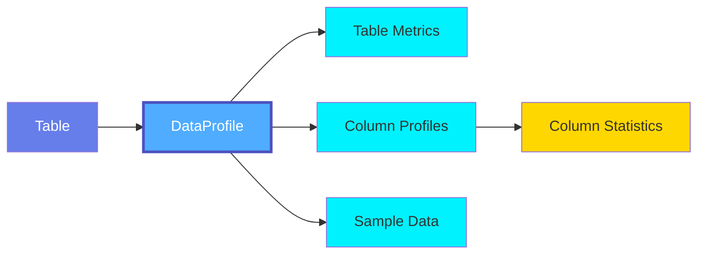

# Data Profile

A **Data Profile** captures comprehensive statistical information about tables and columns in a database. Data profiling helps understand data distributions, identify quality issues, and establish baselines for data quality monitoring.

## Overview

Data Profiles in OpenMetadata provide:

- **Table-Level Metrics**: Row counts, column counts, table size
- **Column-Level Statistics**: Distributions, min/max values, null counts, uniqueness
- **Data Quality Insights**: Data completeness, validity, consistency
- **Trend Analysis**: Historical profiling to track changes over time
- **Sample Data**: Representative sample rows for data exploration
- **Performance Metrics**: Profiling execution time and resource usage

Data profiling enables:
- Data quality assessment
- Data discovery and understanding
- Anomaly detection
- Compliance verification
- Query optimization
- Schema validation

## Hierarchy



**Click on any node to learn more about that entity.**

## Relationships

Data Profiles have relationships with various entities in the metadata ecosystem:

```mermaid
graph TD
    subgraph Profile Structure
        A[DataProfile:<br/>customers_profile] --> B1[TableProfile:<br/>Row Count Stats]
        A --> B2[ColumnProfile:<br/>email stats]
        A --> B3[ColumnProfile:<br/>age stats]
        A --> B4[SampleData:<br/>100 rows]
    end

    subgraph Target Entity
        A -.->|profiles| C1[Table:<br/>customers]
        C1 -.->|in schema| C2[Schema:<br/>public]
        C2 -.->|in database| C3[Database:<br/>production]
    end

    subgraph Column Profiles
        B2 -.->|profiles column| D1[Column:<br/>email]
        B3 -.->|profiles column| D2[Column:<br/>age]
        D1 -.->|in table| C1
        D2 -.->|in table| C1
    end

    subgraph Quality Insights
        A -.->|identifies| E1[Issue:<br/>High Null Rate]
        A -.->|identifies| E2[Issue:<br/>Duplicate Values]
        A -.->|baseline for| E3[TestCase:<br/>Row Count Check]
    end

    subgraph Governance
        A -.->|created by| F1[IngestionPipeline:<br/>Profiler Job]
        A -.->|owned by| F2[Team:<br/>Data Quality]
        A -.->|in domain| F3[Domain:<br/>Customer Data]
    end

    subgraph Trends
        A -.->|previous| G1[DataProfile:<br/>2024-01-08]
        G1 -.->|previous| G2[DataProfile:<br/>2024-01-01]
        A -.->|shows trend| G3[Trend:<br/>Growing Nulls]
    end

    subgraph Monitoring
        A -.->|triggers| H1[Alert:<br/>Quality Degradation]
        A -.->|displayed in| H2[Dashboard:<br/>Data Quality]
        A -.->|logged in| H3[AuditLog]
    end

    style A fill:#4facfe,color:#fff,stroke:#4c51bf,stroke-width:3px
    style B1 fill:#00f2fe,color:#333
    style B2 fill:#00f2fe,color:#333
    style B3 fill:#00f2fe,color:#333
    style B4 fill:#00f2fe,color:#333
    style C1 fill:#764ba2,color:#fff
    style C2 fill:#764ba2,color:#fff
    style C3 fill:#764ba2,color:#fff
    style D1 fill:#ffd700,color:#333
    style D2 fill:#ffd700,color:#333
    style E1 fill:#f5576c,color:#fff
    style E2 fill:#f5576c,color:#fff
    style E3 fill:#f5576c,color:#fff
    style F1 fill:#667eea,color:#fff
    style F2 fill:#43e97b,color:#333
    style F3 fill:#f093fb,color:#333
    style G1 fill:#ffd700,color:#333
    style G2 fill:#ffd700,color:#333
    style G3 fill:#ffd700,color:#333
    style H1 fill:#f5576c,color:#fff
    style H2 fill:#764ba2,color:#fff
    style H3 fill:#ffd700,color:#333

    click A "#data-profile" "Data Profile"
    click C1 "../../data-assets/databases/table/" "Table"
    click C2 "../../data-assets/databases/database-schema/" "Schema"
    click C3 "../../data-assets/databases/database/" "Database"
    click D1 "../../data-assets/databases/column/" "Column"
    click E3 "./test-case/" "Test Case"
    click F1 "../../operations/ingestion-pipeline/" "Ingestion Pipeline"
    click F2 "../../teams-users/team/" "Team"
    click F3 "../../domains/domain/" "Domain"
    click H1 "./alert/" "Alert"
    click H2 "../../data-assets/dashboards/dashboard/" "Dashboard"
```



**Key Relationships:**

- **Profile Structure**: Table profile, column profiles, and sample data
- **Target Entity**: Table being profiled and its schema/database hierarchy
- **Column Profiles**: Individual statistical profiles for each column
- **Quality Insights**: Issues identified and test cases using profile baselines
- **Governance**: Created by profiler pipelines, owned by teams, organized by domain
- **Trends**: Historical profiles showing data quality trends over time
- **Monitoring**: Alerts triggered by profile anomalies, displayed in dashboards

## Schema Specifications

=== "JSON Schema"

    ```json
    {
      "$id": "https://open-metadata.org/schema/entity/data/dataProfile.json",
      "$schema": "http://json-schema.org/draft-07/schema#",
      "title": "DataProfile",
      "description": "A Data Profile contains statistical information about a table.",
      "type": "object",
      "javaType": "org.openmetadata.schema.entity.data.DataProfile",
      "javaInterfaces": [
        "org.openmetadata.schema.EntityInterface"
      ],
      "definitions": {
        "tableProfile": {
          "type": "object",
          "description": "Table-level profile metrics",
          "properties": {
            "profileDate": {
              "description": "Date and time when the profile was generated",
              "$ref": "../../type/basic.json#/definitions/date-time"
            },
            "columnCount": {
              "description": "Number of columns in the table",
              "type": "number"
            },
            "rowCount": {
              "description": "Number of rows in the table",
              "type": "number"
            },
            "sizeInByte": {
              "description": "Table size in bytes",
              "type": "number"
            },
            "createDateTime": {
              "description": "Date and time when the table was created",
              "$ref": "../../type/basic.json#/definitions/timestamp"
            },
            "timestamp": {
              "description": "Timestamp of the profile",
              "$ref": "../../type/basic.json#/definitions/timestamp"
            }
          }
        },
        "columnProfile": {
          "type": "object",
          "description": "Column-level profile statistics",
          "properties": {
            "name": {
              "description": "Column name",
              "type": "string"
            },
            "timestamp": {
              "description": "Timestamp of the profile",
              "$ref": "../../type/basic.json#/definitions/timestamp"
            },
            "valuesCount": {
              "description": "Total count of values in the column",
              "type": "number"
            },
            "valuesPercentage": {
              "description": "Percentage of values in the column",
              "type": "number"
            },
            "validCount": {
              "description": "Count of valid values",
              "type": "number"
            },
            "duplicateCount": {
              "description": "Count of duplicate values",
              "type": "number"
            },
            "nullCount": {
              "description": "Count of null values",
              "type": "number"
            },
            "nullProportion": {
              "description": "Proportion of null values (0-1)",
              "type": "number",
              "minimum": 0,
              "maximum": 1
            },
            "missingPercentage": {
              "description": "Percentage of missing/null values",
              "type": "number"
            },
            "missingCount": {
              "description": "Count of missing values",
              "type": "number"
            },
            "uniqueCount": {
              "description": "Count of unique values",
              "type": "number"
            },
            "uniqueProportion": {
              "description": "Proportion of unique values (0-1)",
              "type": "number",
              "minimum": 0,
              "maximum": 1
            },
            "distinctCount": {
              "description": "Count of distinct values",
              "type": "number"
            },
            "distinctProportion": {
              "description": "Proportion of distinct values (0-1)",
              "type": "number",
              "minimum": 0,
              "maximum": 1
            },
            "min": {
              "description": "Minimum value",
              "oneOf": [
                {
                  "type": "number"
                },
                {
                  "type": "string"
                }
              ]
            },
            "max": {
              "description": "Maximum value",
              "oneOf": [
                {
                  "type": "number"
                },
                {
                  "type": "string"
                }
              ]
            },
            "minLength": {
              "description": "Minimum string length",
              "type": "number"
            },
            "maxLength": {
              "description": "Maximum string length",
              "type": "number"
            },
            "mean": {
              "description": "Mean value for numeric columns",
              "type": "number"
            },
            "median": {
              "description": "Median value",
              "oneOf": [
                {
                  "type": "number"
                },
                {
                  "type": "string"
                }
              ]
            },
            "sum": {
              "description": "Sum of values for numeric columns",
              "type": "number"
            },
            "stddev": {
              "description": "Standard deviation",
              "type": "number"
            },
            "variance": {
              "description": "Variance",
              "type": "number"
            },
            "firstQuartile": {
              "description": "First quartile (25th percentile)",
              "type": "number"
            },
            "thirdQuartile": {
              "description": "Third quartile (75th percentile)",
              "type": "number"
            },
            "interQuartileRange": {
              "description": "Interquartile range",
              "type": "number"
            },
            "nonParametricSkew": {
              "description": "Non-parametric skew",
              "type": "number"
            },
            "histogram": {
              "description": "Histogram of value distribution",
              "$ref": "#/definitions/histogram"
            },
            "customMetrics": {
              "description": "Custom metrics for the column",
              "type": "array",
              "items": {
                "$ref": "../../type/customMetric.json"
              }
            }
          },
          "required": [
            "name"
          ]
        },
        "histogram": {
          "type": "object",
          "description": "Histogram showing value distribution",
          "properties": {
            "boundaries": {
              "description": "Bin boundaries",
              "type": "array",
              "items": {
                "oneOf": [
                  {
                    "type": "number"
                  },
                  {
                    "type": "string"
                  }
                ]
              }
            },
            "frequencies": {
              "description": "Frequency count for each bin",
              "type": "array",
              "items": {
                "type": "number"
              }
            }
          }
        },
        "systemProfile": {
          "type": "object",
          "description": "System metrics for the profiling operation",
          "properties": {
            "timestamp": {
              "description": "When the profile was generated",
              "$ref": "../../type/basic.json#/definitions/timestamp"
            },
            "operation": {
              "description": "Type of profiling operation",
              "type": "string",
              "enum": [
                "insert",
                "update"
              ]
            },
            "query": {
              "description": "Query used for profiling",
              "type": "string"
            },
            "executionTime": {
              "description": "Execution time in milliseconds",
              "type": "number"
            },
            "rowsProcessed": {
              "description": "Number of rows processed",
              "type": "number"
            }
          }
        }
      },
      "properties": {
        "id": {
          "description": "Unique identifier of the data profile",
          "$ref": "../../type/basic.json#/definitions/uuid"
        },
        "table": {
          "description": "Reference to the table being profiled",
          "$ref": "../../type/entityReference.json"
        },
        "profileDate": {
          "description": "Date when the profile was generated",
          "$ref": "../../type/basic.json#/definitions/date-time"
        },
        "tableProfile": {
          "$ref": "#/definitions/tableProfile"
        },
        "columnProfile": {
          "description": "Profiles for individual columns",
          "type": "array",
          "items": {
            "$ref": "#/definitions/columnProfile"
          }
        },
        "sampleData": {
          "description": "Sample data rows",
          "type": "object",
          "properties": {
            "columns": {
              "type": "array",
              "items": {
                "type": "string"
              }
            },
            "rows": {
              "type": "array",
              "items": {
                "type": "array",
                "items": {
                  "oneOf": [
                    {
                      "type": "string"
                    },
                    {
                      "type": "number"
                    },
                    {
                      "type": "boolean"
                    },
                    {
                      "type": "null"
                    }
                  ]
                }
              }
            }
          }
        },
        "systemProfile": {
          "$ref": "#/definitions/systemProfile"
        },
        "version": {
          "description": "Metadata version of the entity",
          "$ref": "../../type/entityHistory.json#/definitions/entityVersion"
        },
        "updatedAt": {
          "description": "Last update time corresponding to the new version of the entity in Unix epoch time milliseconds",
          "$ref": "../../type/basic.json#/definitions/timestamp"
        },
        "updatedBy": {
          "description": "User who made the update",
          "type": "string"
        },
        "href": {
          "description": "Link to this data profile resource",
          "$ref": "../../type/basic.json#/definitions/href"
        },
        "deleted": {
          "description": "When true indicates the entity has been soft deleted",
          "type": "boolean",
          "default": false
        }
      },
      "required": [
        "id",
        "table",
        "profileDate"
      ],
      "additionalProperties": false
    }
    ```

=== "RDF (Turtle)"

    ```turtle
    @prefix om: <https://open-metadata.org/schema/> .
    @prefix om-entity: <https://open-metadata.org/schema/entity/> .
    @prefix om-profile: <https://open-metadata.org/schema/entity/data/> .
    @prefix rdf: <http://www.w3.org/1999/02/22-rdf-syntax-ns#> .
    @prefix rdfs: <http://www.w3.org/2000/01/rdf-schema#> .
    @prefix owl: <http://www.w3.org/2002/07/owl#> .
    @prefix xsd: <http://www.w3.org/2001/XMLSchema#> .
    @prefix dcterms: <http://purl.org/dc/terms/> .
    @prefix skos: <http://www.w3.org/2004/02/skos/core#> .

    # Data Profile Class Definition
    om-profile:DataProfile a owl:Class ;
        rdfs:label "Data Profile" ;
        rdfs:comment "Statistical profile of a database table" ;
        rdfs:subClassOf om-entity:Entity ;
        rdfs:isDefinedBy om: .

    # Table Profile Class
    om-profile:TableProfile a owl:Class ;
        rdfs:label "Table Profile" ;
        rdfs:comment "Table-level profile metrics" ;
        rdfs:isDefinedBy om: .

    # Column Profile Class
    om-profile:ColumnProfile a owl:Class ;
        rdfs:label "Column Profile" ;
        rdfs:comment "Column-level profile statistics" ;
        rdfs:isDefinedBy om: .

    # Histogram Class
    om-profile:Histogram a owl:Class ;
        rdfs:label "Histogram" ;
        rdfs:comment "Histogram showing value distribution" ;
        rdfs:isDefinedBy om: .

    # Properties
    om-profile:profilesTable a owl:ObjectProperty ;
        rdfs:label "profiles table" ;
        rdfs:comment "Table being profiled" ;
        rdfs:domain om-profile:DataProfile ;
        rdfs:range om-entity:Table .

    om-profile:profileDate a owl:DatatypeProperty ;
        rdfs:label "profile date" ;
        rdfs:comment "Date when profile was generated" ;
        rdfs:domain om-profile:DataProfile ;
        rdfs:range xsd:dateTime .

    om-profile:hasTableProfile a owl:ObjectProperty ;
        rdfs:label "has table profile" ;
        rdfs:comment "Table-level profile metrics" ;
        rdfs:domain om-profile:DataProfile ;
        rdfs:range om-profile:TableProfile .

    om-profile:hasColumnProfile a owl:ObjectProperty ;
        rdfs:label "has column profile" ;
        rdfs:comment "Column-level profile statistics" ;
        rdfs:domain om-profile:DataProfile ;
        rdfs:range om-profile:ColumnProfile .

    om-profile:profilesColumn a owl:ObjectProperty ;
        rdfs:label "profiles column" ;
        rdfs:comment "Column being profiled" ;
        rdfs:domain om-profile:ColumnProfile ;
        rdfs:range om-entity:Column .

    om-profile:rowCount a owl:DatatypeProperty ;
        rdfs:label "row count" ;
        rdfs:comment "Number of rows in the table" ;
        rdfs:domain om-profile:TableProfile ;
        rdfs:range xsd:integer .

    om-profile:columnCount a owl:DatatypeProperty ;
        rdfs:label "column count" ;
        rdfs:comment "Number of columns in the table" ;
        rdfs:domain om-profile:TableProfile ;
        rdfs:range xsd:integer .

    om-profile:sizeInByte a owl:DatatypeProperty ;
        rdfs:label "size in bytes" ;
        rdfs:comment "Table size in bytes" ;
        rdfs:domain om-profile:TableProfile ;
        rdfs:range xsd:integer .

    om-profile:valuesCount a owl:DatatypeProperty ;
        rdfs:label "values count" ;
        rdfs:comment "Total count of values" ;
        rdfs:domain om-profile:ColumnProfile ;
        rdfs:range xsd:integer .

    om-profile:nullCount a owl:DatatypeProperty ;
        rdfs:label "null count" ;
        rdfs:comment "Count of null values" ;
        rdfs:domain om-profile:ColumnProfile ;
        rdfs:range xsd:integer .

    om-profile:uniqueCount a owl:DatatypeProperty ;
        rdfs:label "unique count" ;
        rdfs:comment "Count of unique values" ;
        rdfs:domain om-profile:ColumnProfile ;
        rdfs:range xsd:integer .

    om-profile:distinctCount a owl:DatatypeProperty ;
        rdfs:label "distinct count" ;
        rdfs:comment "Count of distinct values" ;
        rdfs:domain om-profile:ColumnProfile ;
        rdfs:range xsd:integer .

    om-profile:min a owl:DatatypeProperty ;
        rdfs:label "minimum" ;
        rdfs:comment "Minimum value" ;
        rdfs:domain om-profile:ColumnProfile .

    om-profile:max a owl:DatatypeProperty ;
        rdfs:label "maximum" ;
        rdfs:comment "Maximum value" ;
        rdfs:domain om-profile:ColumnProfile .

    om-profile:mean a owl:DatatypeProperty ;
        rdfs:label "mean" ;
        rdfs:comment "Mean value for numeric columns" ;
        rdfs:domain om-profile:ColumnProfile ;
        rdfs:range xsd:double .

    om-profile:median a owl:DatatypeProperty ;
        rdfs:label "median" ;
        rdfs:comment "Median value" ;
        rdfs:domain om-profile:ColumnProfile .

    om-profile:stddev a owl:DatatypeProperty ;
        rdfs:label "standard deviation" ;
        rdfs:comment "Standard deviation" ;
        rdfs:domain om-profile:ColumnProfile ;
        rdfs:range xsd:double .

    om-profile:hasHistogram a owl:ObjectProperty ;
        rdfs:label "has histogram" ;
        rdfs:comment "Histogram of value distribution" ;
        rdfs:domain om-profile:ColumnProfile ;
        rdfs:range om-profile:Histogram .

    om-profile:identifiesIssue a owl:ObjectProperty ;
        rdfs:label "identifies issue" ;
        rdfs:comment "Data quality issue identified by profile" ;
        rdfs:domain om-profile:DataProfile .

    om-profile:baselineFor a owl:ObjectProperty ;
        rdfs:label "baseline for" ;
        rdfs:comment "Test case using this profile as baseline" ;
        rdfs:domain om-profile:DataProfile ;
        rdfs:range om-entity:TestCase .

    om-profile:previousProfile a owl:ObjectProperty ;
        rdfs:label "previous profile" ;
        rdfs:comment "Previous profile for trend analysis" ;
        rdfs:domain om-profile:DataProfile ;
        rdfs:range om-profile:DataProfile .
    ```

=== "JSON-LD Context"

    ```json
    {
      "@context": {
        "@vocab": "https://open-metadata.org/schema/entity/data/",
        "rdf": "http://www.w3.org/1999/02/22-rdf-syntax-ns#",
        "rdfs": "http://www.w3.org/2000/01/rdf-schema#",
        "owl": "http://www.w3.org/2002/07/owl#",
        "xsd": "http://www.w3.org/2001/XMLSchema#",
        "dcterms": "http://purl.org/dc/terms/",
        "skos": "http://www.w3.org/2004/02/skos/core#",
        "om": "https://open-metadata.org/schema/",

        "DataProfile": {
          "@id": "om:DataProfile",
          "@type": "@id"
        },
        "id": {
          "@id": "om:id",
          "@type": "xsd:string"
        },
        "table": {
          "@id": "om:profilesTable",
          "@type": "@id"
        },
        "profileDate": {
          "@id": "om:profileDate",
          "@type": "xsd:dateTime"
        },
        "tableProfile": {
          "@id": "om:hasTableProfile",
          "@type": "@id"
        },
        "columnProfile": {
          "@id": "om:hasColumnProfile",
          "@type": "@id",
          "@container": "@set"
        },
        "rowCount": {
          "@id": "om:rowCount",
          "@type": "xsd:integer"
        },
        "columnCount": {
          "@id": "om:columnCount",
          "@type": "xsd:integer"
        },
        "sizeInByte": {
          "@id": "om:sizeInByte",
          "@type": "xsd:integer"
        },
        "valuesCount": {
          "@id": "om:valuesCount",
          "@type": "xsd:integer"
        },
        "nullCount": {
          "@id": "om:nullCount",
          "@type": "xsd:integer"
        },
        "uniqueCount": {
          "@id": "om:uniqueCount",
          "@type": "xsd:integer"
        },
        "min": {
          "@id": "om:min"
        },
        "max": {
          "@id": "om:max"
        },
        "mean": {
          "@id": "om:mean",
          "@type": "xsd:double"
        },
        "median": {
          "@id": "om:median"
        },
        "stddev": {
          "@id": "om:stddev",
          "@type": "xsd:double"
        },
        "version": {
          "@id": "om:version",
          "@type": "xsd:string"
        },
        "updatedAt": {
          "@id": "dcterms:modified",
          "@type": "xsd:dateTime"
        },
        "updatedBy": {
          "@id": "prov:wasAttributedTo",
          "@type": "xsd:string"
        },
        "href": {
          "@id": "om:href",
          "@type": "xsd:anyURI"
        }
      }
    }
    ```

## Use Cases

### Basic Table Profile

Profile with table-level metrics:

```json
{
  "id": "123e4567-e89b-12d3-a456-426614174000",
  "table": {
    "type": "table",
    "name": "customers",
    "fullyQualifiedName": "postgres.sales.public.customers"
  },
  "profileDate": "2024-01-15T02:00:00Z",
  "tableProfile": {
    "profileDate": "2024-01-15T02:00:00Z",
    "columnCount": 12,
    "rowCount": 1000000,
    "sizeInByte": 524288000,
    "timestamp": 1705291200000
  }
}
```

### Column Profile with Statistics

Detailed column-level statistics:

```json
{
  "id": "456e7890-e89b-12d3-a456-426614174111",
  "table": {
    "type": "table",
    "name": "customers"
  },
  "profileDate": "2024-01-15T02:00:00Z",
  "columnProfile": [
    {
      "name": "age",
      "timestamp": 1705291200000,
      "valuesCount": 1000000,
      "validCount": 995000,
      "nullCount": 5000,
      "nullProportion": 0.005,
      "uniqueCount": 80,
      "distinctCount": 80,
      "duplicateCount": 915000,
      "min": 18,
      "max": 95,
      "mean": 42.5,
      "median": 41,
      "stddev": 15.2,
      "firstQuartile": 30,
      "thirdQuartile": 55,
      "interQuartileRange": 25
    },
    {
      "name": "email",
      "timestamp": 1705291200000,
      "valuesCount": 1000000,
      "validCount": 998000,
      "nullCount": 2000,
      "nullProportion": 0.002,
      "uniqueCount": 998000,
      "uniqueProportion": 0.998,
      "distinctCount": 998000,
      "minLength": 10,
      "maxLength": 120
    }
  ]
}
```

### Profile with Histogram

Column profile including value distribution:

```json
{
  "columnProfile": [
    {
      "name": "purchase_amount",
      "valuesCount": 500000,
      "min": 1.99,
      "max": 9999.99,
      "mean": 150.50,
      "median": 89.99,
      "stddev": 200.25,
      "histogram": {
        "boundaries": [0, 50, 100, 250, 500, 1000, 10000],
        "frequencies": [125000, 200000, 100000, 50000, 20000, 5000]
      }
    }
  ]
}
```

### Profile with Sample Data

Profile including sample rows:

```json
{
  "id": "789e4567-e89b-12d3-a456-426614174222",
  "table": {
    "type": "table",
    "name": "customers"
  },
  "profileDate": "2024-01-15T02:00:00Z",
  "tableProfile": {
    "rowCount": 1000000,
    "columnCount": 5
  },
  "sampleData": {
    "columns": ["id", "name", "email", "age", "country"],
    "rows": [
      [1, "John Doe", "john@example.com", 35, "USA"],
      [2, "Jane Smith", "jane@example.com", 28, "UK"],
      [3, "Bob Johnson", "bob@example.com", 42, "Canada"],
      [4, "Alice Williams", "alice@example.com", 31, "Australia"],
      [5, "Charlie Brown", "charlie@example.com", 55, "USA"]
    ]
  }
}
```

### String Column Profile

Profile for text columns:

```json
{
  "columnProfile": [
    {
      "name": "description",
      "valuesCount": 100000,
      "nullCount": 500,
      "nullProportion": 0.005,
      "minLength": 10,
      "maxLength": 5000,
      "mean": null,
      "median": null,
      "distinctCount": 95000,
      "distinctProportion": 0.95
    }
  ]
}
```

### Categorical Column Profile

Profile for categorical/enum columns:

```json
{
  "columnProfile": [
    {
      "name": "status",
      "valuesCount": 1000000,
      "nullCount": 0,
      "distinctCount": 5,
      "histogram": {
        "boundaries": ["active", "pending", "suspended", "closed", "deleted"],
        "frequencies": [600000, 150000, 100000, 120000, 30000]
      }
    }
  ]
}
```

## Profile Metrics

### Table-Level Metrics

| Metric | Description | Use Case |
|--------|-------------|----------|
| **rowCount** | Total number of rows | Track table growth |
| **columnCount** | Number of columns | Detect schema changes |
| **sizeInByte** | Table size in bytes | Monitor storage usage |
| **createDateTime** | When table was created | Audit table age |

### Column-Level Metrics

| Metric | Description | Use Case |
|--------|-------------|----------|
| **valuesCount** | Total values (including nulls) | Completeness check |
| **nullCount** | Number of null values | Data quality assessment |
| **uniqueCount** | Unique value count | Cardinality analysis |
| **distinctCount** | Distinct value count | Duplicate detection |
| **min/max** | Minimum and maximum values | Range validation |
| **mean/median** | Central tendency | Outlier detection |
| **stddev** | Standard deviation | Variability analysis |
| **histogram** | Value distribution | Distribution analysis |

## Profiling Strategies

### Full Table Profile

Profile all rows and columns:
```sql
SELECT COUNT(*) as row_count,
       COUNT(DISTINCT column1) as col1_distinct,
       MIN(column1) as col1_min,
       MAX(column1) as col1_max
FROM table_name
```

### Sampled Profile

Profile a percentage of rows:
```sql
SELECT ... FROM table_name
TABLESAMPLE SYSTEM(10) -- 10% sample
```

### Incremental Profile

Profile only new/changed data:
```sql
SELECT ... FROM table_name
WHERE updated_at > last_profile_date
```

## Best Practices

### 1. Schedule Regular Profiling
Profile tables on a regular schedule (daily, weekly) based on data volatility.

### 2. Use Sampling for Large Tables
For very large tables, use sampling to reduce profiling time.

### 3. Profile Critical Columns First
Prioritize profiling of business-critical columns.

### 4. Track Trends Over Time
Maintain historical profiles to identify data quality degradation.

### 5. Set Baseline Thresholds
Use profile metrics to establish quality thresholds for monitoring.

### 6. Combine with Test Cases
Create test cases based on profile statistics (e.g., null rate < 5%).

### 7. Monitor Profile Execution
Track profiling execution time and resource usage.

### 8. Alert on Anomalies
Set up alerts for significant changes in profile metrics.

## Quality Insights from Profiles

Data profiles can reveal quality issues:

### High Null Rate
```json
{
  "name": "phone_number",
  "nullCount": 250000,
  "nullProportion": 0.25,
  "issue": "25% null rate exceeds threshold"
}
```

### Low Cardinality
```json
{
  "name": "customer_id",
  "uniqueCount": 500,
  "distinctCount": 500,
  "valuesCount": 1000000,
  "issue": "Low cardinality suggests duplicates"
}
```

### Unexpected Range
```json
{
  "name": "age",
  "min": -5,
  "max": 250,
  "issue": "Values outside expected range [0, 120]"
}
```

### Skewed Distribution
```json
{
  "name": "account_balance",
  "mean": 5000,
  "median": 250,
  "stddev": 50000,
  "issue": "High stddev indicates outliers"
}
```

## Custom Properties

This entity supports custom properties through the `extension` field.
Common custom properties include:

- **Data Classification**: Sensitivity level
- **Cost Center**: Billing allocation
- **Retention Period**: Data retention requirements
- **Application Owner**: Owning application/team

See [Custom Properties](../metadata-specifications/custom-properties.md)
for details on defining and using custom properties.

---

## API Operations

### Get Table Profile

```http
GET /api/v1/tables/{tableId}/tableProfile?startDate=2024-01-01&endDate=2024-01-31
```

### Get Column Profile

```http
GET /api/v1/tables/{tableId}/columnProfile?columnName=email&startDate=2024-01-01
```

### Get Sample Data

```http
GET /api/v1/tables/{tableId}/sampleData
```

### Get Profile Metrics

```http
GET /api/v1/tables/{tableId}/tableProfile/metrics?metric=rowCount&days=30
```

### Delete Profile

```http
DELETE /api/v1/tables/{tableId}/tableProfile?date=2024-01-15
```

## Related Entities

- **[Table](../data-assets/databases/table.md)**: Table being profiled
- **[Column](../data-assets/databases/column.md)**: Columns included in profile
- **[TestCase](./test-case.md)**: Test cases using profile baselines
- **[IngestionPipeline](../operations/ingestion-pipeline.md)**: Profiler pipelines generating profiles
- **[Alert](./alert.md)**: Alerts triggered by profile anomalies
- **[Dashboard](../data-assets/dashboards/dashboard.md)**: Dashboards displaying profile metrics
- **[Domain](../domains/domain.md)**: Domains organizing profiled tables
