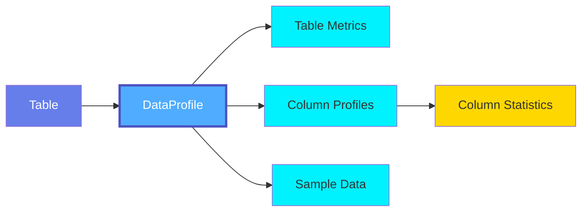

# Data Profile

A **Data Profile** captures comprehensive statistical information about tables and columns in a database. Data profiling helps understand data distributions, identify quality issues, and establish baselines for data quality monitoring.

## Overview

Data Profiles in OpenMetadata provide:

- **Table-Level Metrics**: Row counts, column counts, table size
- **Column-Level Statistics**: Distributions, min/max values, null counts, uniqueness
- **Data Quality Insights**: Data completeness, validity, consistency
- **Trend Analysis**: Historical profiling to track changes over time
- **Sample Data**: Representative sample rows for data exploration
- **Performance Metrics**: Profiling execution time and resource usage

Data profiling enables:
- Data quality assessment
- Data discovery and understanding
- Anomaly detection
- Compliance verification
- Query optimization
- Schema validation

## Hierarchy



**Click on any node to learn more about that entity.**

## Relationships

Data Profiles have relationships with various entities in the metadata ecosystem:

```mermaid
graph TD
    subgraph Profile Structure
        A[DataProfile:<br/>customers_profile] --> B1[TableProfile:<br/>Row Count Stats]
        A --> B2[ColumnProfile:<br/>email stats]
        A --> B3[ColumnProfile:<br/>age stats]
        A --> B4[SampleData:<br/>100 rows]
    end

    subgraph Target Entity
        A -.->|profiles| C1[Table:<br/>customers]
        C1 -.->|in schema| C2[Schema:<br/>public]
        C2 -.->|in database| C3[Database:<br/>production]
    end

    subgraph Column Profiles
        B2 -.->|profiles column| D1[Column:<br/>email]
        B3 -.->|profiles column| D2[Column:<br/>age]
        D1 -.->|in table| C1
        D2 -.->|in table| C1
    end

    subgraph Quality Insights
        A -.->|identifies| E1[Issue:<br/>High Null Rate]
        A -.->|identifies| E2[Issue:<br/>Duplicate Values]
        A -.->|baseline for| E3[TestCase:<br/>Row Count Check]
    end

    subgraph Governance
        A -.->|created by| F1[IngestionPipeline:<br/>Profiler Job]
        A -.->|owned by| F2[Team:<br/>Data Quality]
        A -.->|in domain| F3[Domain:<br/>Customer Data]
    end

    subgraph Trends
        A -.->|previous| G1[DataProfile:<br/>2024-01-08]
        G1 -.->|previous| G2[DataProfile:<br/>2024-01-01]
        A -.->|shows trend| G3[Trend:<br/>Growing Nulls]
    end

    subgraph Monitoring
        A -.->|triggers| H1[Alert:<br/>Quality Degradation]
        A -.->|displayed in| H2[Dashboard:<br/>Data Quality]
        A -.->|logged in| H3[AuditLog]
    end

    style A fill:#4facfe,color:#fff,stroke:#4c51bf,stroke-width:3px
    style B1 fill:#00f2fe,color:#333
    style B2 fill:#00f2fe,color:#333
    style B3 fill:#00f2fe,color:#333
    style B4 fill:#00f2fe,color:#333
    style C1 fill:#764ba2,color:#fff
    style C2 fill:#764ba2,color:#fff
    style C3 fill:#764ba2,color:#fff
    style D1 fill:#ffd700,color:#333
    style D2 fill:#ffd700,color:#333
    style E1 fill:#f5576c,color:#fff
    style E2 fill:#f5576c,color:#fff
    style E3 fill:#f5576c,color:#fff
    style F1 fill:#667eea,color:#fff
    style F2 fill:#43e97b,color:#333
    style F3 fill:#f093fb,color:#333
    style G1 fill:#ffd700,color:#333
    style G2 fill:#ffd700,color:#333
    style G3 fill:#ffd700,color:#333
    style H1 fill:#f5576c,color:#fff
    style H2 fill:#764ba2,color:#fff
    style H3 fill:#ffd700,color:#333

    click A "#data-profile" "Data Profile"
    click C1 "../../data-assets/databases/table/" "Table"
    click C2 "../../data-assets/databases/database-schema/" "Schema"
    click C3 "../../data-assets/databases/database/" "Database"
    click D1 "../../data-assets/databases/column/" "Column"
    click E3 "./test-case/" "Test Case"
    click F1 "../../operations/ingestion-pipeline/" "Ingestion Pipeline"
    click F2 "../../teams-users/team/" "Team"
    click F3 "../../domains/domain/" "Domain"
    click H1 "./alert/" "Alert"
    click H2 "../../data-assets/dashboards/dashboard/" "Dashboard"
```



**Key Relationships:**

- **Profile Structure**: Table profile, column profiles, and sample data
- **Target Entity**: Table being profiled and its schema/database hierarchy
- **Column Profiles**: Individual statistical profiles for each column
- **Quality Insights**: Issues identified and test cases using profile baselines
- **Governance**: Created by profiler pipelines, owned by teams, organized by domain
- **Trends**: Historical profiles showing data quality trends over time
- **Monitoring**: Alerts triggered by profile anomalies, displayed in dashboards

## Schema Specifications

=== "JSON Schema"

    ```json
    {
      "$id": "https://open-metadata.org/schema/entity/data/table.json#/definitions/tableProfile",
      "$schema": "http://json-schema.org/draft-07/schema#",
      "title": "Table Profile Definitions",
      "description": "This schema defines the types to capture table and column profile data.",
      "type": "object",
      "javaType": "org.openmetadata.schema.type.TableProfile",
      "definitions": {
        "tableProfile": {
          "type": "object",
          "javaType": "org.openmetadata.schema.type.TableProfile",
          "description": "This schema defines the type to capture the table's data profile.",
          "properties": {
            "timestamp": {
              "description": "Timestamp on which profile is taken.",
              "$ref": "../../type/basic.json#/definitions/timestamp"
            },
            "profileSample": {
              "description": "Percentage of data or no. of rows we want to execute the profiler and tests on",
              "type": "number",
              "default": null
            },
            "profileSampleType": {
              "description": "Type of Profile Sample (percentage or rows)",
              "type": "string",
              "enum": ["PERCENTAGE", "ROWS"],
              "default": "PERCENTAGE"
            },
            "samplingMethodType": {
              "description": "Type of Sampling Method (BERNOULLI or SYSTEM)",
              "type": "string",
              "enum": ["BERNOULLI", "SYSTEM"]
            },
            "columnCount": {
              "description": "No.of columns in the table.",
              "type": "number"
            },
            "rowCount": {
              "description": "No.of rows in the table. This is always executed on the whole table.",
              "type": "number"
            },
            "sizeInByte": {
              "description": "Table size in GB",
              "type": "number"
            },
            "createDateTime": {
              "description": "Table creation time.",
              "type": "string",
              "format": "date-time"
            },
            "customMetrics": {
              "description": "Custom Metrics profile list bound to a table.",
              "type": "array",
              "items": {
                "$ref": "#/definitions/customMetricProfile"
              },
              "default": null
            }
          },
          "required": ["timestamp"],
          "additionalProperties": false
        },
        "columnProfile": {
          "type": "object",
          "javaType": "org.openmetadata.schema.type.ColumnProfile",
          "description": "This schema defines the type to capture the table's column profile.",
          "properties": {
            "name": {
              "description": "Column Name.",
              "type": "string"
            },
            "timestamp": {
              "description": "Timestamp on which profile is taken.",
              "$ref": "../../type/basic.json#/definitions/timestamp"
            },
            "valuesCount": {
              "description": "Total count of the values in this column.",
              "type": "number"
            },
            "valuesPercentage": {
              "description": "Percentage of values in this column with respect to row count.",
              "type": "number"
            },
            "validCount": {
              "description": "Total count of valid values in this column.",
              "type": "number"
            },
            "duplicateCount": {
              "description": "No.of Rows that contain duplicates in a column.",
              "type": "number"
            },
            "nullCount": {
              "description": "No.of null values in a column.",
              "type": "number"
            },
            "nullProportion": {
              "description": "No.of null value proportion in columns.",
              "type": "number"
            },
            "missingPercentage": {
              "description": "Missing Percentage is calculated by taking percentage of validCount/valuesCount.",
              "type": "number"
            },
            "missingCount": {
              "description": "Missing count is calculated by subtracting valuesCount - validCount.",
              "type": "number"
            },
            "uniqueCount": {
              "description": "No. of unique values in the column.",
              "type": "number"
            },
            "uniqueProportion": {
              "description": "Proportion of number of unique values in a column.",
              "type": "number"
            },
            "distinctCount": {
              "description": "Number of values that contain distinct values.",
              "type": "number"
            },
            "distinctProportion": {
              "description": "Proportion of distinct values in a column.",
              "type": "number"
            },
            "min": {
              "description": "Minimum value in a column.",
              "oneOf": [
                {"type": "number"},
                {"type": "integer"},
                {"$ref": "../../type/basic.json#/definitions/dateTime"},
                {"$ref": "../../type/basic.json#/definitions/time"},
                {"$ref": "../../type/basic.json#/definitions/date"},
                {"type": "string"}
              ]
            },
            "max": {
              "description": "Maximum value in a column.",
              "oneOf": [
                {"type": "number"},
                {"type": "integer"},
                {"$ref": "../../type/basic.json#/definitions/dateTime"},
                {"$ref": "../../type/basic.json#/definitions/time"},
                {"$ref": "../../type/basic.json#/definitions/date"},
                {"type": "string"}
              ]
            },
            "minLength": {
              "description": "Minimum string length in a column.",
              "type": "number"
            },
            "maxLength": {
              "description": "Maximum string length in a column.",
              "type": "number"
            },
            "mean": {
              "description": "Avg value in a column.",
              "type": "number"
            },
            "sum": {
              "description": "Sum value in a column.",
              "type": "number"
            },
            "stddev": {
              "description": "Standard deviation of a column.",
              "type": "number"
            },
            "variance": {
              "description": "Variance of a column.",
              "type": "number"
            },
            "median": {
              "description": "Median of a column.",
              "type": "number"
            },
            "firstQuartile": {
              "description": "First quartile of a column.",
              "type": "number"
            },
            "thirdQuartile": {
              "description": "Third quartile of a column.",
              "type": "number"
            },
            "interQuartileRange": {
              "description": "Inter quartile range of a column.",
              "type": "number"
            },
            "nonParametricSkew": {
              "description": "Non parametric skew of a column.",
              "type": "number"
            },
            "histogram": {
              "description": "Histogram of a column.",
              "properties": {
                "boundaries": {
                  "description": "Boundaries of Histogram.",
                  "type": "array"
                },
                "frequencies": {
                  "description": "Frequencies of Histogram.",
                  "type": "array"
                }
              },
              "additionalProperties": false
            },
            "customMetrics": {
              "description": "Custom Metrics profile list bound to a column.",
              "type": "array",
              "items": {
                "$ref": "#/definitions/customMetricProfile"
              },
              "default": null
            },
            "cardinalityDistribution": {
              "description": "Cardinality distribution showing top categories with an 'Others' bucket.",
              "type": "object",
              "properties": {
                "categories": {
                  "description": "List of category names including 'Others'.",
                  "type": "array",
                  "items": {"type": "string"}
                },
                "counts": {
                  "description": "List of counts corresponding to each category.",
                  "type": "array",
                  "items": {"type": "integer"}
                },
                "percentages": {
                  "description": "List of percentages corresponding to each category.",
                  "type": "array",
                  "items": {"type": "number"}
                },
                "allValuesUnique": {
                  "description": "Flag indicating that all values in the column are unique, so no distribution is calculated.",
                  "type": "boolean"
                }
              },
              "additionalProperties": false
            }
          },
          "required": ["name", "timestamp"],
          "additionalProperties": false
        },
        "customMetricProfile": {
          "type": "object",
          "javaType": "org.openmetadata.schema.type.CustomMetricProfile",
          "description": "Profiling results of a Custom Metric.",
          "properties": {
            "name": {
              "description": "Custom metric name.",
              "type": "string"
            },
            "value": {
              "description": "Profiling results for the metric.",
              "type": "number"
            }
          },
          "additionalProperties": false
        },
        "systemProfile": {
          "description": "This schema defines the System Profile object holding profile data from system tables.",
          "type": "object",
          "javaType": "org.openmetadata.schema.type.SystemProfile",
          "properties": {
            "timestamp": {
              "description": "Timestamp on which profile is taken.",
              "$ref": "../../type/basic.json#/definitions/timestamp"
            },
            "operation": {
              "description": "Operation performed.",
              "type": "string",
              "enum": ["UPDATE", "INSERT", "DELETE", "WRITE"]
            },
            "rowsAffected": {
              "description": "Number of rows affected.",
              "type": "integer"
            }
          }
        }
      }
    }
    ```

=== "RDF (Turtle)"

    ```turtle
    @prefix om: <https://open-metadata.org/schema/> .
    @prefix om-entity: <https://open-metadata.org/schema/entity/> .
    @prefix om-type: <https://open-metadata.org/schema/type/> .
    @prefix om-table: <https://open-metadata.org/schema/entity/data/table/> .
    @prefix rdf: <http://www.w3.org/1999/02/22-rdf-syntax-ns#> .
    @prefix rdfs: <http://www.w3.org/2000/01/rdf-schema#> .
    @prefix owl: <http://www.w3.org/2002/07/owl#> .
    @prefix xsd: <http://www.w3.org/2001/XMLSchema#> .
    @prefix dcterms: <http://purl.org/dc/terms/> .

    # Table Profile Class Definition
    om-type:TableProfile a owl:Class ;
        rdfs:label "Table Profile" ;
        rdfs:comment "This schema defines the type to capture the table's data profile." ;
        rdfs:isDefinedBy om: .

    # Column Profile Class Definition
    om-type:ColumnProfile a owl:Class ;
        rdfs:label "Column Profile" ;
        rdfs:comment "This schema defines the type to capture the table's column profile." ;
        rdfs:isDefinedBy om: .

    # Custom Metric Profile Class Definition
    om-type:CustomMetricProfile a owl:Class ;
        rdfs:label "Custom Metric Profile" ;
        rdfs:comment "Profiling results of a Custom Metric." ;
        rdfs:isDefinedBy om: .

    # System Profile Class Definition
    om-type:SystemProfile a owl:Class ;
        rdfs:label "System Profile" ;
        rdfs:comment "This schema defines the System Profile object holding profile data from system tables." ;
        rdfs:isDefinedBy om: .

    # Table Profile Properties
    om-type:timestamp a owl:DatatypeProperty ;
        rdfs:label "timestamp" ;
        rdfs:comment "Timestamp on which profile is taken." ;
        rdfs:domain om-type:TableProfile, om-type:ColumnProfile, om-type:SystemProfile ;
        rdfs:range xsd:long .

    om-type:profileSample a owl:DatatypeProperty ;
        rdfs:label "profile sample" ;
        rdfs:comment "Percentage of data or no. of rows we want to execute the profiler and tests on" ;
        rdfs:domain om-type:TableProfile ;
        rdfs:range xsd:double .

    om-type:profileSampleType a owl:DatatypeProperty ;
        rdfs:label "profile sample type" ;
        rdfs:comment "Type of Profile Sample (percentage or rows)" ;
        rdfs:domain om-type:TableProfile ;
        rdfs:range xsd:string .

    om-type:samplingMethodType a owl:DatatypeProperty ;
        rdfs:label "sampling method type" ;
        rdfs:comment "Type of Sampling Method (BERNOULLI or SYSTEM)" ;
        rdfs:domain om-type:TableProfile ;
        rdfs:range xsd:string .

    om-type:columnCount a owl:DatatypeProperty ;
        rdfs:label "column count" ;
        rdfs:comment "No.of columns in the table." ;
        rdfs:domain om-type:TableProfile ;
        rdfs:range xsd:double .

    om-type:rowCount a owl:DatatypeProperty ;
        rdfs:label "row count" ;
        rdfs:comment "No.of rows in the table. This is always executed on the whole table." ;
        rdfs:domain om-type:TableProfile ;
        rdfs:range xsd:double .

    om-type:sizeInByte a owl:DatatypeProperty ;
        rdfs:label "size in bytes" ;
        rdfs:comment "Table size in GB" ;
        rdfs:domain om-type:TableProfile ;
        rdfs:range xsd:double .

    om-type:createDateTime a owl:DatatypeProperty ;
        rdfs:label "create date time" ;
        rdfs:comment "Table creation time." ;
        rdfs:domain om-type:TableProfile ;
        rdfs:range xsd:dateTime .

    # Column Profile Properties
    om-type:name a owl:DatatypeProperty ;
        rdfs:label "name" ;
        rdfs:comment "Column Name or Custom Metric name." ;
        rdfs:domain om-type:ColumnProfile, om-type:CustomMetricProfile ;
        rdfs:range xsd:string .

    om-type:valuesCount a owl:DatatypeProperty ;
        rdfs:label "values count" ;
        rdfs:comment "Total count of the values in this column." ;
        rdfs:domain om-type:ColumnProfile ;
        rdfs:range xsd:double .

    om-type:valuesPercentage a owl:DatatypeProperty ;
        rdfs:label "values percentage" ;
        rdfs:comment "Percentage of values in this column with respect to row count." ;
        rdfs:domain om-type:ColumnProfile ;
        rdfs:range xsd:double .

    om-type:validCount a owl:DatatypeProperty ;
        rdfs:label "valid count" ;
        rdfs:comment "Total count of valid values in this column." ;
        rdfs:domain om-type:ColumnProfile ;
        rdfs:range xsd:double .

    om-type:duplicateCount a owl:DatatypeProperty ;
        rdfs:label "duplicate count" ;
        rdfs:comment "No.of Rows that contain duplicates in a column." ;
        rdfs:domain om-type:ColumnProfile ;
        rdfs:range xsd:double .

    om-type:nullCount a owl:DatatypeProperty ;
        rdfs:label "null count" ;
        rdfs:comment "No.of null values in a column." ;
        rdfs:domain om-type:ColumnProfile ;
        rdfs:range xsd:double .

    om-type:nullProportion a owl:DatatypeProperty ;
        rdfs:label "null proportion" ;
        rdfs:comment "No.of null value proportion in columns." ;
        rdfs:domain om-type:ColumnProfile ;
        rdfs:range xsd:double .

    om-type:missingPercentage a owl:DatatypeProperty ;
        rdfs:label "missing percentage" ;
        rdfs:comment "Missing Percentage is calculated by taking percentage of validCount/valuesCount." ;
        rdfs:domain om-type:ColumnProfile ;
        rdfs:range xsd:double .

    om-type:missingCount a owl:DatatypeProperty ;
        rdfs:label "missing count" ;
        rdfs:comment "Missing count is calculated by subtracting valuesCount - validCount." ;
        rdfs:domain om-type:ColumnProfile ;
        rdfs:range xsd:double .

    om-type:uniqueCount a owl:DatatypeProperty ;
        rdfs:label "unique count" ;
        rdfs:comment "No. of unique values in the column." ;
        rdfs:domain om-type:ColumnProfile ;
        rdfs:range xsd:double .

    om-type:uniqueProportion a owl:DatatypeProperty ;
        rdfs:label "unique proportion" ;
        rdfs:comment "Proportion of number of unique values in a column." ;
        rdfs:domain om-type:ColumnProfile ;
        rdfs:range xsd:double .

    om-type:distinctCount a owl:DatatypeProperty ;
        rdfs:label "distinct count" ;
        rdfs:comment "Number of values that contain distinct values." ;
        rdfs:domain om-type:ColumnProfile ;
        rdfs:range xsd:double .

    om-type:distinctProportion a owl:DatatypeProperty ;
        rdfs:label "distinct proportion" ;
        rdfs:comment "Proportion of distinct values in a column." ;
        rdfs:domain om-type:ColumnProfile ;
        rdfs:range xsd:double .

    om-type:minLength a owl:DatatypeProperty ;
        rdfs:label "minimum length" ;
        rdfs:comment "Minimum string length in a column." ;
        rdfs:domain om-type:ColumnProfile ;
        rdfs:range xsd:double .

    om-type:maxLength a owl:DatatypeProperty ;
        rdfs:label "maximum length" ;
        rdfs:comment "Maximum string length in a column." ;
        rdfs:domain om-type:ColumnProfile ;
        rdfs:range xsd:double .

    om-type:mean a owl:DatatypeProperty ;
        rdfs:label "mean" ;
        rdfs:comment "Avg value in a column." ;
        rdfs:domain om-type:ColumnProfile ;
        rdfs:range xsd:double .

    om-type:sum a owl:DatatypeProperty ;
        rdfs:label "sum" ;
        rdfs:comment "Sum value in a column." ;
        rdfs:domain om-type:ColumnProfile ;
        rdfs:range xsd:double .

    om-type:stddev a owl:DatatypeProperty ;
        rdfs:label "standard deviation" ;
        rdfs:comment "Standard deviation of a column." ;
        rdfs:domain om-type:ColumnProfile ;
        rdfs:range xsd:double .

    om-type:variance a owl:DatatypeProperty ;
        rdfs:label "variance" ;
        rdfs:comment "Variance of a column." ;
        rdfs:domain om-type:ColumnProfile ;
        rdfs:range xsd:double .

    om-type:median a owl:DatatypeProperty ;
        rdfs:label "median" ;
        rdfs:comment "Median of a column." ;
        rdfs:domain om-type:ColumnProfile ;
        rdfs:range xsd:double .

    om-type:firstQuartile a owl:DatatypeProperty ;
        rdfs:label "first quartile" ;
        rdfs:comment "First quartile of a column." ;
        rdfs:domain om-type:ColumnProfile ;
        rdfs:range xsd:double .

    om-type:thirdQuartile a owl:DatatypeProperty ;
        rdfs:label "third quartile" ;
        rdfs:comment "Third quartile of a column." ;
        rdfs:domain om-type:ColumnProfile ;
        rdfs:range xsd:double .

    om-type:interQuartileRange a owl:DatatypeProperty ;
        rdfs:label "inter quartile range" ;
        rdfs:comment "Inter quartile range of a column." ;
        rdfs:domain om-type:ColumnProfile ;
        rdfs:range xsd:double .

    om-type:nonParametricSkew a owl:DatatypeProperty ;
        rdfs:label "non parametric skew" ;
        rdfs:comment "Non parametric skew of a column." ;
        rdfs:domain om-type:ColumnProfile ;
        rdfs:range xsd:double .

    # System Profile Properties
    om-type:operation a owl:DatatypeProperty ;
        rdfs:label "operation" ;
        rdfs:comment "Operation performed." ;
        rdfs:domain om-type:SystemProfile ;
        rdfs:range xsd:string .

    om-type:rowsAffected a owl:DatatypeProperty ;
        rdfs:label "rows affected" ;
        rdfs:comment "Number of rows affected." ;
        rdfs:domain om-type:SystemProfile ;
        rdfs:range xsd:integer .

    # Custom Metric Profile Properties
    om-type:value a owl:DatatypeProperty ;
        rdfs:label "value" ;
        rdfs:comment "Profiling results for the metric." ;
        rdfs:domain om-type:CustomMetricProfile ;
        rdfs:range xsd:double .
    ```

=== "JSON-LD Context"

    ```json
    {
      "@context": {
        "@vocab": "https://open-metadata.org/schema/type/",
        "rdf": "http://www.w3.org/1999/02/22-rdf-syntax-ns#",
        "rdfs": "http://www.w3.org/2000/01/rdf-schema#",
        "owl": "http://www.w3.org/2002/07/owl#",
        "xsd": "http://www.w3.org/2001/XMLSchema#",
        "om": "https://open-metadata.org/schema/type/",

        "TableProfile": {
          "@id": "om:TableProfile",
          "@type": "@id"
        },
        "ColumnProfile": {
          "@id": "om:ColumnProfile",
          "@type": "@id"
        },
        "CustomMetricProfile": {
          "@id": "om:CustomMetricProfile",
          "@type": "@id"
        },
        "SystemProfile": {
          "@id": "om:SystemProfile",
          "@type": "@id"
        },
        "timestamp": {
          "@id": "om:timestamp",
          "@type": "xsd:long"
        },
        "profileSample": {
          "@id": "om:profileSample",
          "@type": "xsd:double"
        },
        "profileSampleType": {
          "@id": "om:profileSampleType",
          "@type": "xsd:string"
        },
        "samplingMethodType": {
          "@id": "om:samplingMethodType",
          "@type": "xsd:string"
        },
        "columnCount": {
          "@id": "om:columnCount",
          "@type": "xsd:double"
        },
        "rowCount": {
          "@id": "om:rowCount",
          "@type": "xsd:double"
        },
        "sizeInByte": {
          "@id": "om:sizeInByte",
          "@type": "xsd:double"
        },
        "createDateTime": {
          "@id": "om:createDateTime",
          "@type": "xsd:dateTime"
        },
        "name": {
          "@id": "om:name",
          "@type": "xsd:string"
        },
        "valuesCount": {
          "@id": "om:valuesCount",
          "@type": "xsd:double"
        },
        "valuesPercentage": {
          "@id": "om:valuesPercentage",
          "@type": "xsd:double"
        },
        "validCount": {
          "@id": "om:validCount",
          "@type": "xsd:double"
        },
        "duplicateCount": {
          "@id": "om:duplicateCount",
          "@type": "xsd:double"
        },
        "nullCount": {
          "@id": "om:nullCount",
          "@type": "xsd:double"
        },
        "nullProportion": {
          "@id": "om:nullProportion",
          "@type": "xsd:double"
        },
        "missingPercentage": {
          "@id": "om:missingPercentage",
          "@type": "xsd:double"
        },
        "missingCount": {
          "@id": "om:missingCount",
          "@type": "xsd:double"
        },
        "uniqueCount": {
          "@id": "om:uniqueCount",
          "@type": "xsd:double"
        },
        "uniqueProportion": {
          "@id": "om:uniqueProportion",
          "@type": "xsd:double"
        },
        "distinctCount": {
          "@id": "om:distinctCount",
          "@type": "xsd:double"
        },
        "distinctProportion": {
          "@id": "om:distinctProportion",
          "@type": "xsd:double"
        },
        "minLength": {
          "@id": "om:minLength",
          "@type": "xsd:double"
        },
        "maxLength": {
          "@id": "om:maxLength",
          "@type": "xsd:double"
        },
        "mean": {
          "@id": "om:mean",
          "@type": "xsd:double"
        },
        "sum": {
          "@id": "om:sum",
          "@type": "xsd:double"
        },
        "stddev": {
          "@id": "om:stddev",
          "@type": "xsd:double"
        },
        "variance": {
          "@id": "om:variance",
          "@type": "xsd:double"
        },
        "median": {
          "@id": "om:median",
          "@type": "xsd:double"
        },
        "firstQuartile": {
          "@id": "om:firstQuartile",
          "@type": "xsd:double"
        },
        "thirdQuartile": {
          "@id": "om:thirdQuartile",
          "@type": "xsd:double"
        },
        "interQuartileRange": {
          "@id": "om:interQuartileRange",
          "@type": "xsd:double"
        },
        "nonParametricSkew": {
          "@id": "om:nonParametricSkew",
          "@type": "xsd:double"
        },
        "operation": {
          "@id": "om:operation",
          "@type": "xsd:string"
        },
        "rowsAffected": {
          "@id": "om:rowsAffected",
          "@type": "xsd:integer"
        },
        "value": {
          "@id": "om:value",
          "@type": "xsd:double"
        },
        "customMetrics": {
          "@id": "om:customMetrics",
          "@type": "@id",
          "@container": "@set"
        }
      }
    }
    ```

## Use Cases

### Basic Table Profile

Profile with table-level metrics (attached to Table entity):

```json
{
  "timestamp": 1705291200000,
  "profileSample": 100,
  "profileSampleType": "PERCENTAGE",
  "columnCount": 12,
  "rowCount": 1000000,
  "sizeInByte": 524288000,
  "createDateTime": "2024-01-15T02:00:00Z"
}
```

This profile would be attached to a Table entity via the `profile` property.

### Column Profile with Statistics

Detailed column-level statistics (attached to Column entity):

```json
[
  {
    "name": "age",
    "timestamp": 1705291200000,
    "valuesCount": 1000000,
    "validCount": 995000,
    "nullCount": 5000,
    "nullProportion": 0.005,
    "uniqueCount": 80,
    "distinctCount": 80,
    "duplicateCount": 915000,
    "min": 18,
    "max": 95,
    "mean": 42.5,
    "median": 41,
    "stddev": 15.2,
    "firstQuartile": 30,
    "thirdQuartile": 55,
    "interQuartileRange": 25
  },
  {
    "name": "email",
    "timestamp": 1705291200000,
    "valuesCount": 1000000,
    "validCount": 998000,
    "nullCount": 2000,
    "nullProportion": 0.002,
    "uniqueCount": 998000,
    "uniqueProportion": 0.998,
    "distinctCount": 998000,
    "minLength": 10,
    "maxLength": 120
  }
]
```

Column profiles are stored in the Column entity's `profile` property.

### Profile with Histogram

Column profile including value distribution:

```json
{
  "name": "purchase_amount",
  "timestamp": 1705291200000,
  "valuesCount": 500000,
  "min": 1.99,
  "max": 9999.99,
  "mean": 150.50,
  "median": 89.99,
  "stddev": 200.25,
  "histogram": {
    "boundaries": [0, 50, 100, 250, 500, 1000, 10000],
    "frequencies": [125000, 200000, 100000, 50000, 20000, 5000]
  }
}
```

### Profile with Sample Data

Sample data is stored separately on the Table entity:

```json
{
  "columns": ["id", "name", "email", "age", "country"],
  "rows": [
    [1, "John Doe", "john@example.com", 35, "USA"],
    [2, "Jane Smith", "jane@example.com", 28, "UK"],
    [3, "Bob Johnson", "bob@example.com", 42, "Canada"],
    [4, "Alice Williams", "alice@example.com", 31, "Australia"],
    [5, "Charlie Brown", "charlie@example.com", 55, "USA"]
  ]
}
```

Sample data is stored in the Table entity's `sampleData` property.

### String Column Profile

Profile for text columns:

```json
{
  "name": "description",
  "timestamp": 1705291200000,
  "valuesCount": 100000,
  "nullCount": 500,
  "nullProportion": 0.005,
  "minLength": 10,
  "maxLength": 5000,
  "distinctCount": 95000,
  "distinctProportion": 0.95
}
```

### Categorical Column Profile

Profile for categorical/enum columns with cardinality distribution:

```json
{
  "name": "status",
  "timestamp": 1705291200000,
  "valuesCount": 1000000,
  "nullCount": 0,
  "distinctCount": 5,
  "cardinalityDistribution": {
    "categories": ["active", "pending", "suspended", "closed", "deleted"],
    "counts": [600000, 150000, 100000, 120000, 30000],
    "percentages": [60.0, 15.0, 10.0, 12.0, 3.0],
    "allValuesUnique": false
  }
}
```

## Profile Metrics

### Table-Level Metrics

| Metric | Description | Use Case |
|--------|-------------|----------|
| **timestamp** | Timestamp on which profile is taken | Profile versioning |
| **profileSample** | Percentage of data or no. of rows used | Understanding sampling |
| **profileSampleType** | Type of Profile Sample (PERCENTAGE or ROWS) | Sampling method |
| **samplingMethodType** | Sampling Method (BERNOULLI or SYSTEM) | Statistical validity |
| **rowCount** | Total number of rows | Track table growth |
| **columnCount** | Number of columns | Detect schema changes |
| **sizeInByte** | Table size in GB | Monitor storage usage |
| **createDateTime** | When table was created | Audit table age |
| **customMetrics** | Custom metrics for the table | Business-specific metrics |

### Column-Level Metrics

| Metric | Description | Use Case |
|--------|-------------|----------|
| **name** | Column Name | Identification |
| **timestamp** | Timestamp on which profile is taken | Profile versioning |
| **valuesCount** | Total count of the values | Completeness check |
| **valuesPercentage** | Percentage of values with respect to row count | Proportion analysis |
| **validCount** | Total count of valid values | Validity check |
| **duplicateCount** | No.of rows that contain duplicates | Duplicate detection |
| **nullCount** | No.of null values | Data quality assessment |
| **nullProportion** | Proportion of null values | Null rate analysis |
| **missingPercentage** | Percentage of missing/null values | Missing data check |
| **missingCount** | Count of missing values | Completeness tracking |
| **uniqueCount** | No. of unique values | Cardinality analysis |
| **uniqueProportion** | Proportion of unique values | Uniqueness ratio |
| **distinctCount** | Number of distinct values | Cardinality tracking |
| **distinctProportion** | Proportion of distinct values | Distribution analysis |
| **min/max** | Minimum and maximum values | Range validation |
| **minLength/maxLength** | String length bounds | Text field validation |
| **mean** | Average value | Central tendency |
| **sum** | Sum of values | Aggregate analysis |
| **median** | Median value | Central tendency |
| **stddev** | Standard deviation | Variability analysis |
| **variance** | Variance | Spread analysis |
| **firstQuartile** | First quartile (25th percentile) | Distribution analysis |
| **thirdQuartile** | Third quartile (75th percentile) | Distribution analysis |
| **interQuartileRange** | Inter quartile range | Outlier detection |
| **nonParametricSkew** | Non parametric skew | Distribution shape |
| **histogram** | Histogram boundaries and frequencies | Distribution visualization |
| **cardinalityDistribution** | Category distribution with counts | Categorical analysis |
| **customMetrics** | Custom metrics for the column | Business-specific metrics |

## Profiling Strategies

### Full Table Profile

Profile all rows and columns:
```sql
SELECT COUNT(*) as row_count,
       COUNT(DISTINCT column1) as col1_distinct,
       MIN(column1) as col1_min,
       MAX(column1) as col1_max
FROM table_name
```

### Sampled Profile

Profile a percentage of rows:
```sql
SELECT ... FROM table_name
TABLESAMPLE SYSTEM(10) -- 10% sample
```

### Incremental Profile

Profile only new/changed data:
```sql
SELECT ... FROM table_name
WHERE updated_at > last_profile_date
```

## Best Practices

### 1. Schedule Regular Profiling
Profile tables on a regular schedule (daily, weekly) based on data volatility.

### 2. Use Sampling for Large Tables
For very large tables, use sampling to reduce profiling time.

### 3. Profile Critical Columns First
Prioritize profiling of business-critical columns.

### 4. Track Trends Over Time
Maintain historical profiles to identify data quality degradation.

### 5. Set Baseline Thresholds
Use profile metrics to establish quality thresholds for monitoring.

### 6. Combine with Test Cases
Create test cases based on profile statistics (e.g., null rate < 5%).

### 7. Monitor Profile Execution
Track profiling execution time and resource usage.

### 8. Alert on Anomalies
Set up alerts for significant changes in profile metrics.

## Quality Insights from Profiles

Data profiles can reveal quality issues:

### High Null Rate
```json
{
  "name": "phone_number",
  "nullCount": 250000,
  "nullProportion": 0.25,
  "issue": "25% null rate exceeds threshold"
}
```

### Low Cardinality
```json
{
  "name": "customer_id",
  "uniqueCount": 500,
  "distinctCount": 500,
  "valuesCount": 1000000,
  "issue": "Low cardinality suggests duplicates"
}
```

### Unexpected Range
```json
{
  "name": "age",
  "min": -5,
  "max": 250,
  "issue": "Values outside expected range [0, 120]"
}
```

### Skewed Distribution
```json
{
  "name": "account_balance",
  "mean": 5000,
  "median": 250,
  "stddev": 50000,
  "issue": "High stddev indicates outliers"
}
```

## Custom Properties

This entity supports custom properties through the `extension` field.
Common custom properties include:

- **Data Classification**: Sensitivity level
- **Cost Center**: Billing allocation
- **Retention Period**: Data retention requirements
- **Application Owner**: Owning application/team

See [Custom Properties](../metadata-specifications/custom-properties.md)
for details on defining and using custom properties.

---

## API Operations

### Get Table Profile

```http
GET /api/v1/tables/{tableId}/tableProfile?startDate=2024-01-01&endDate=2024-01-31
```

### Get Column Profile

```http
GET /api/v1/tables/{tableId}/columnProfile?columnName=email&startDate=2024-01-01
```

### Get Sample Data

```http
GET /api/v1/tables/{tableId}/sampleData
```

### Get Profile Metrics

```http
GET /api/v1/tables/{tableId}/tableProfile/metrics?metric=rowCount&days=30
```

### Delete Profile

```http
DELETE /api/v1/tables/{tableId}/tableProfile?date=2024-01-15
```

## Related Entities

- **[Table](../data-assets/databases/table.md)**: Table being profiled
- **[Column](../data-assets/databases/column.md)**: Columns included in profile
- **[TestCase](./test-case.md)**: Test cases using profile baselines
- **[IngestionPipeline](../operations/ingestion-pipeline.md)**: Profiler pipelines generating profiles
- **[Alert](./alert.md)**: Alerts triggered by profile anomalies
- **[Dashboard](../data-assets/dashboards/dashboard.md)**: Dashboards displaying profile metrics
- **[Domain](../domains/domain.md)**: Domains organizing profiled tables
