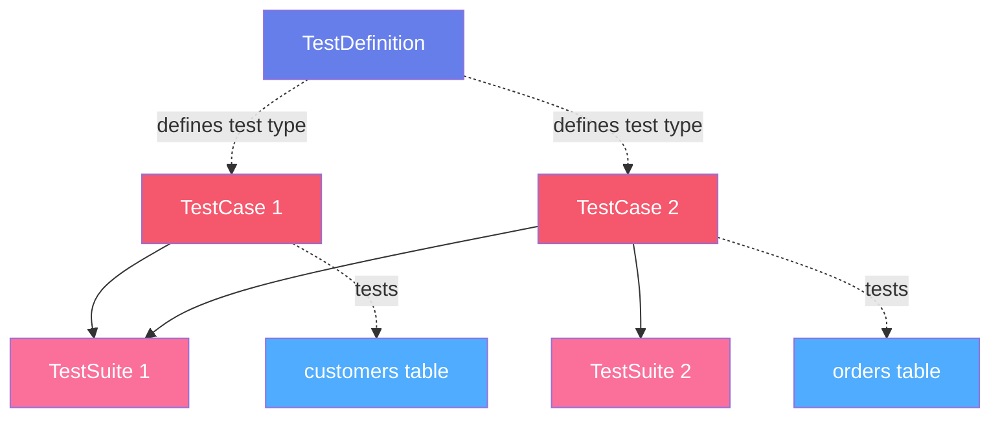
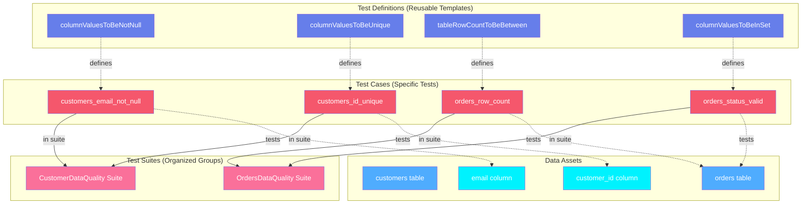
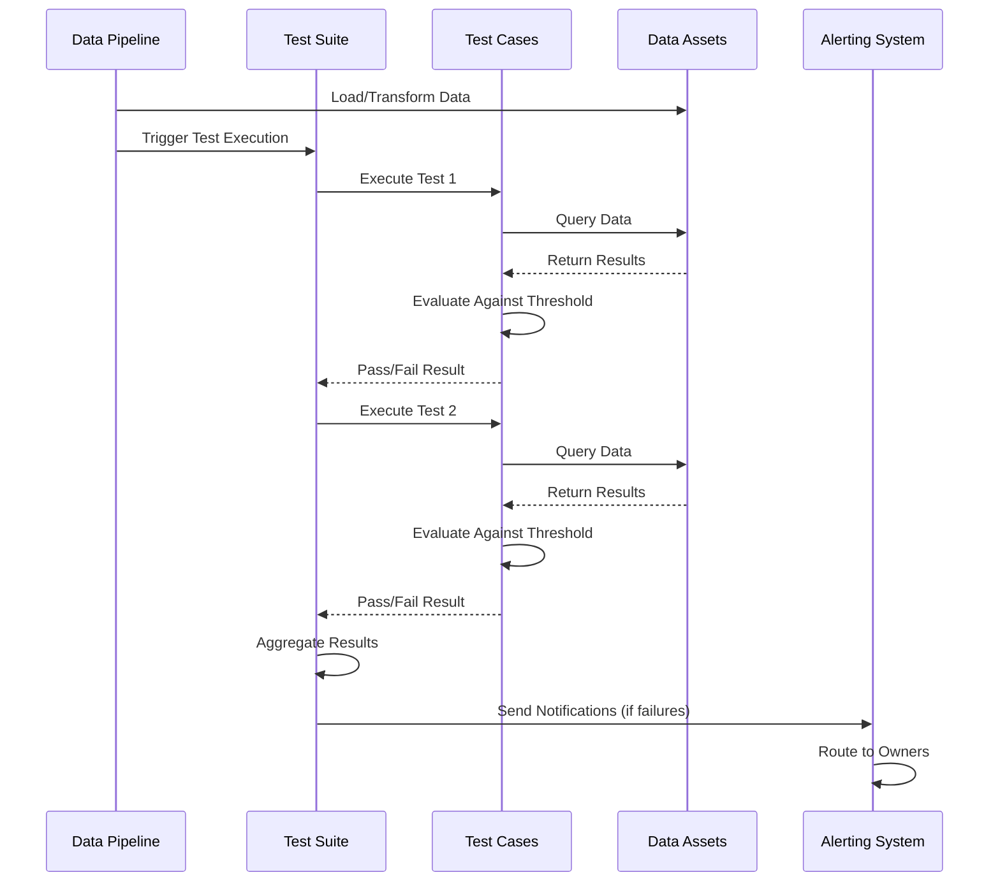

# Data Quality Assets

**Comprehensive testing framework for ensuring data reliability and trustworthiness**

Data Quality assets in OpenMetadata provide a structured framework for defining, executing, and tracking data quality tests across all your data assets. The quality framework follows a three-level hierarchy: TestDefinitions define test types, TestCases apply tests to specific data assets, and TestSuites group related tests for comprehensive validation.

---

## Hierarchy Overview



---

## Why This Hierarchy?

### TestDefinition
**Purpose**: Template defining a type of data quality test

A TestDefinition is a reusable test template that specifies what kind of quality check to perform. It defines the test logic, parameters, and expected behavior without being tied to any specific data asset.

**Examples**:

- `columnValuesToBeNotNull` - Checks that a column has no null values
- `columnValuesToBeBetween` - Validates values are within a range
- `tableRowCountToBeBetween` - Verifies row count is within expected bounds
- `tableColumnCountToEqual` - Ensures table has expected number of columns
- `columnValuesToMatchRegex` - Validates values match a pattern

**Why needed**:

Test definitions enable:

- **Reusability**: Define once, apply to many assets
- **Standardization**: Consistent quality checks across the organization
- **Parameterization**: Customize behavior with parameters (min, max, regex pattern)
- **Extensibility**: Add custom test definitions for specific needs

**Built-in Test Types**:

- **Column Tests**: Null checks, range validation, regex matching, uniqueness
- **Table Tests**: Row count, column count, freshness
- **Custom SQL**: Define custom validation logic
- **Cross-table Tests**: Compare values across tables

[**View TestDefinition Specification →**](test-definition.md){ .md-button }

---

### TestCase
**Purpose**: Specific test instance applied to a data asset

A TestCase applies a TestDefinition to a specific table, column, or other data asset with concrete parameters. It represents an actual quality check that gets executed and produces pass/fail results.

**Examples**:

- `customers_email_not_null` - Check email column in customers table is not null
- `orders_amount_positive` - Verify order amount is greater than zero
- `daily_revenue_row_count` - Ensure daily revenue table has expected row count
- `product_sku_format` - Validate product SKU matches pattern

**Why needed**:

Test cases provide:

- **Specificity**: Test definition + target asset + parameters
- **Execution History**: Track results over time
- **Alerting**: Notify stakeholders when tests fail
- **Ownership**: Assign responsibility for data quality
- **Documentation**: Explain why this test matters

**Test Case Components**:

- **Test Definition**: Which test type to use
- **Entity Reference**: What to test (table, column, etc.)
- **Parameters**: Test-specific configuration (min=0, max=100, regex pattern)
- **Threshold**: When to fail (critical, warning thresholds)
- **Compute**: SQL query that implements the test logic

[**View TestCase Specification →**](test-case.md){ .md-button }

---

### TestSuite
**Purpose**: Logical grouping of related test cases

A TestSuite organizes test cases into meaningful collections for batch execution, reporting, and monitoring. Test suites enable comprehensive validation of entire data pipelines or business domains.

**Examples**:

- `CustomerDataQuality` - All tests for customer data assets
- `DailySalesValidation` - Tests for daily sales processing
- `PIIComplianceChecks` - Ensure PII columns are properly handled
- `CriticalTableMonitoring` - Monitor tier-1 production tables

**Why needed**: Test suites enable:
- **Organization**: Group related tests logically
- **Batch Execution**: Run all tests in a suite together
- **Reporting**: Aggregate results across multiple tests
- **Scheduling**: Run suites on a schedule (hourly, daily, weekly)
- **Ownership**: Assign team responsibility for a domain

**Suite Types**:

- **Logical Suite**: Manual grouping of related tests
- **Pipeline Suite**: Tests for a specific pipeline's outputs
- **Asset Suite**: All tests for tables in a schema or database
- **Domain Suite**: Tests for a business domain (sales, finance, etc.)

[**View TestSuite Specification →**](test-suite.md){ .md-button }

---

## Common Patterns

### Pattern 1: Column Validation
```
TestDefinition: columnValuesToBeNotNull
    ↓
TestCase: customers_email_not_null (on customers.email)
    ↓
TestSuite: CustomerDataQuality
```

Reusable test definition applied to specific column with results tracked in a suite.

### Pattern 2: Table Health Check
```
TestDefinition: tableRowCountToBeBetween
    ↓
TestCase: daily_orders_row_count (min=100, max=10000)
    ↓
TestSuite: DailyPipelineValidation
```

Ensure table has expected number of rows after pipeline execution.

### Pattern 3: Comprehensive Asset Testing
```
TestSuite: OrdersTableQuality
    ├── orders_id_unique (uniqueness test)
    ├── orders_amount_positive (range test)
    ├── orders_date_not_null (null check)
    ├── orders_status_valid (allowed values test)
    └── orders_freshness (freshness test)
```

Multiple test cases grouped to validate all aspects of a critical table.

---

## Real-World Example

Here's how a data team ensures quality in their customer analytics pipeline:



**Example Quality Implementation Workflow**:

This example shows how Test Definitions, Test Cases, Test Suites, and Execution work together for an e-commerce platform:

**Step 1: Define Reusable Test Templates** (Test Definitions)

Standard test types available to all teams:

- Not null checks
- Uniqueness validation
- Row count monitoring
- Allowed values checking

**Step 2: Apply Tests to Specific Assets** (Test Cases)

Specific tests on customer and order tables:

- `customers.email` must not be null
- `customers.customer_id` must be unique
- `orders` table should have 1,000-50,000 rows daily
- `orders.status` must be in ["pending", "completed", "cancelled"]

**Step 3: Organize Tests by Domain** (Test Suites)

- **Customer Suite**: Runs all customer data quality checks
- **Orders Suite**: Validates transactional data integrity

**Step 4: Execute and Monitor** (Execution)

- Pipeline completes → Test suite executes → Results reported
- Failed tests trigger alerts to data engineering team

---

## Comprehensive Quality Framework

A complete data quality implementation for an e-commerce platform:

```mermaid
graph TB
    subgraph "Test Definitions Library"
        direction LR
        TDG1[Column Tests]
        TDG2[Table Tests]
        TDG3[Custom SQL Tests]

        TDG1 --> TD1[NotNull]
        TDG1 --> TD2[Unique]
        TDG1 --> TD3[InRange]
        TDG1 --> TD4[MatchRegex]

        TDG2 --> TD5[RowCount]
        TDG2 --> TD6[Freshness]
        TDG2 --> TD7[ColumnCount]

        TDG3 --> TD8[CustomQuery]
    end

    subgraph "Applied Test Cases"
        direction TB
        TC1[email_not_null]
        TC2[customer_id_unique]
        TC3[age_in_range]
        TC4[phone_format_valid]
        TC5[orders_daily_count]
        TC6[revenue_freshness]
        TC7[products_column_count]
        TC8[revenue_reconciliation]
    end

    subgraph "Test Suite Organization"
        TS1[Critical Data Quality<br/>Runs: Every Hour]
        TS2[Daily Pipeline Validation<br/>Runs: After ETL]
        TS3[Weekly Health Check<br/>Runs: Sunday 2 AM]
    end

    subgraph "Data Assets"
        DB1[(Production Database)]
        DB2[(Analytics Warehouse)]

        DB1 --> T1[customers]
        DB1 --> T2[orders]
        DB2 --> T3[daily_revenue]
        DB2 --> T4[products]
    end

    TD1 -.-> TC1
    TD2 -.-> TC2
    TD3 -.-> TC3
    TD4 -.-> TC4
    TD5 -.-> TC5
    TD6 -.-> TC6
    TD7 -.-> TC7
    TD8 -.-> TC8

    TC1 --> TS1
    TC2 --> TS1
    TC5 --> TS1

    TC3 --> TS2
    TC4 --> TS2
    TC6 --> TS2
    TC8 --> TS2

    TC7 --> TS3

    TC1 -.-> T1
    TC2 -.-> T1
    TC3 -.-> T1
    TC5 -.-> T2
    TC6 -.-> T3
    TC7 -.-> T4
    TC8 -.-> T3

    style TD1 fill:#667eea,color:#fff
    style TD2 fill:#667eea,color:#fff
    style TD3 fill:#667eea,color:#fff
    style TD4 fill:#667eea,color:#fff
    style TD5 fill:#667eea,color:#fff
    style TD6 fill:#667eea,color:#fff
    style TD7 fill:#667eea,color:#fff
    style TD8 fill:#667eea,color:#fff
    style TS1 fill:#fa709a,color:#fff
    style TS2 fill:#fa709a,color:#fff
    style TS3 fill:#fa709a,color:#fff
```



**Implementation Details**:

1. **Test Definition Library**:
   - 50+ built-in test definitions
   - Custom SQL tests for complex validation
   - Parameterized for flexibility

2. **Test Case Strategy**:
   - Critical columns: Not null, uniqueness, format validation
   - Tables: Row count, freshness, schema stability
   - Business rules: Custom reconciliation queries

3. **Test Suite Scheduling**:
   - **Hourly**: Critical quality checks on production tables
   - **Pipeline**: Run after each ETL completion
   - **Weekly**: Comprehensive health checks and drift detection

4. **Alerting and Remediation**:
   - Critical failures → Page on-call engineer
   - Warnings → Slack notification to data team
   - Trends → Weekly quality report to leadership

---

## Test Execution Flow

Understanding how tests execute in practice:



**Execution Steps**:

1. **Trigger**: Pipeline completion or schedule
2. **Execution**: Test suite runs all test cases
3. **Evaluation**: Compare results against thresholds
4. **Recording**: Store results and history
5. **Alerting**: Notify owners of failures
6. **Remediation**: Teams investigate and fix issues

---

## Data Quality Dimensions

OpenMetadata test definitions cover all quality dimensions:

| Dimension | Description | Test Examples |
|-----------|-------------|---------------|
| **Completeness** | No missing or null values | `columnValuesToBeNotNull` |
| **Uniqueness** | No duplicate records | `columnValuesToBeUnique` |
| **Validity** | Values conform to rules | `columnValuesToMatchRegex`, `columnValuesToBeInSet` |
| **Accuracy** | Values are correct | Custom SQL comparing to source of truth |
| **Consistency** | Values consistent across systems | Cross-table comparison tests |
| **Timeliness** | Data is fresh and up-to-date | `tableFreshnessCheck` |
| **Integrity** | Referential integrity maintained | Foreign key validation tests |

---

## Entity Specifications

Each entity in the data quality framework has complete specifications:

| Entity | Description | Specification |
|--------|-------------|---------------|
| **TestDefinition** | Reusable test template | [View Spec](test-definition.md) |
| **TestCase** | Specific test instance | [View Spec](test-case.md) |
| **TestSuite** | Grouped test collection | [View Spec](test-suite.md) |

Each specification includes:
- Complete field reference
- JSON Schema definition
- RDF/OWL ontology representation
- JSON-LD context and examples
- Execution semantics
- API operations

---

## Best Practices

### 1. Start with Critical Assets
Focus first on tier-1 tables that power critical dashboards and reports. Expand coverage gradually.

### 2. Use Meaningful Test Names
Name test cases descriptively: `customers_email_not_null` is better than `test_1`.

### 3. Set Appropriate Thresholds
- **Critical**: Data cannot be used (100% null rate)
- **Warning**: Quality degrading (>5% null rate)

### 4. Organize by Domain
Create test suites by business domain (sales, finance, marketing) for clear ownership.

### 5. Monitor Test Trends
Track pass rates over time to identify quality degradation before it becomes critical.

### 6. Document Test Rationale
Explain why each test matters and what failure indicates.

### 7. Integrate with Pipelines
Run test suites automatically after pipeline execution to catch issues immediately.

### 8. Establish Ownership
Assign data asset owners who are responsible for fixing quality issues.

---

## Next Steps

1. **Explore specifications** - Click through each entity above
2. **See test examples** - Check out [data quality examples](../examples/data-quality/index.md)
3. **Integration guide** - Learn [how to implement quality tests](../getting-started/data-quality.md)
4. **Built-in tests** - Review the [complete test definition library](test-definition.md#built-in-tests)
