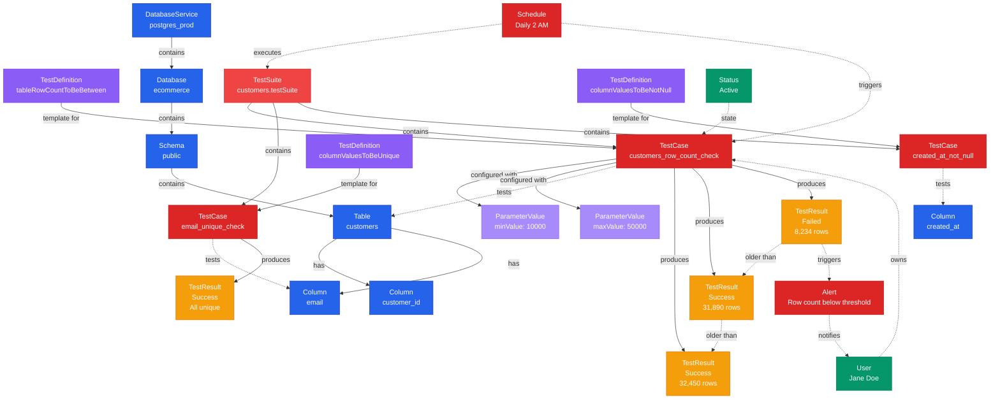
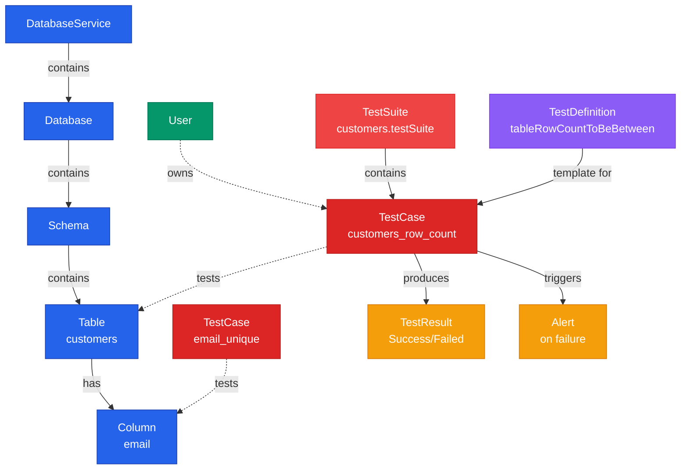

# Test Case

**Specific test instances applied to data assets with parameters and results**

---

## Overview

The **TestCase** entity represents a specific instance of a test applied to a table or column. Test cases are created from test definitions and include configured parameters, execution results, and historical test run data.

## Relationship Diagram



---

## Schema Specifications

View the complete TestCase schema in your preferred format:

=== "JSON Schema"

    **Complete JSON Schema Definition**

    ```json
    {
      "$id": "https://open-metadata.org/schema/entity/data/testCase.json",
      "$schema": "http://json-schema.org/draft-07/schema#",
      "title": "TestCase",
      "description": "A `TestCase` is a specific instance of a test applied to a table or column with configured parameters.",
      "type": "object",
      "javaType": "org.openmetadata.schema.entity.data.TestCase",

      "definitions": {
        "testCaseStatus": {
          "description": "Status of the test case",
          "type": "string",
          "enum": ["Success", "Failed", "Aborted", "Queued"]
        },
        "testCaseResult": {
          "type": "object",
          "properties": {
            "timestamp": {
              "description": "Test execution timestamp",
              "type": "integer",
              "format": "int64"
            },
            "testCaseStatus": {
              "$ref": "#/definitions/testCaseStatus"
            },
            "result": {
              "description": "Test result value",
              "type": "string"
            },
            "sampleData": {
              "description": "Sample failing data",
              "type": "string"
            },
            "testResultValue": {
              "description": "Array of result values",
              "type": "array",
              "items": {
                "type": "object",
                "properties": {
                  "name": {"type": "string"},
                  "value": {"type": "string"}
                }
              }
            },
            "passedRows": {
              "type": "integer"
            },
            "failedRows": {
              "type": "integer"
            }
          },
          "required": ["timestamp", "testCaseStatus"]
        },
        "testCaseParameterValue": {
          "type": "object",
          "properties": {
            "name": {
              "type": "string"
            },
            "value": {
              "type": "string"
            }
          },
          "required": ["name"]
        }
      },

      "properties": {
        "id": {
          "description": "Unique identifier",
          "$ref": "../../type/basic.json#/definitions/uuid"
        },
        "name": {
          "description": "Test case name",
          "$ref": "../../type/basic.json#/definitions/entityName"
        },
        "fullyQualifiedName": {
          "description": "Fully qualified name",
          "$ref": "../../type/basic.json#/definitions/fullyQualifiedEntityName"
        },
        "displayName": {
          "description": "Display name",
          "type": "string"
        },
        "description": {
          "description": "Markdown description",
          "$ref": "../../type/basic.json#/definitions/markdown"
        },
        "testDefinition": {
          "description": "Test definition reference",
          "$ref": "../../type/entityReference.json"
        },
        "entityLink": {
          "description": "Link to table or column",
          "type": "string",
          "format": "uri"
        },
        "entityFQN": {
          "description": "FQN of the entity being tested",
          "type": "string"
        },
        "testSuite": {
          "description": "Parent test suite",
          "$ref": "../../type/entityReference.json"
        },
        "parameterValues": {
          "description": "Parameter values for this test",
          "type": "array",
          "items": {
            "$ref": "#/definitions/testCaseParameterValue"
          }
        },
        "testCaseResult": {
          "description": "Latest test result",
          "$ref": "#/definitions/testCaseResult"
        },
        "testCaseResults": {
          "description": "Historical test results",
          "type": "array",
          "items": {
            "$ref": "#/definitions/testCaseResult"
          }
        },
        "owner": {
          "description": "Owner (user or team)",
          "$ref": "../../type/entityReference.json"
        },
        "version": {
          "description": "Metadata version",
          "$ref": "../../type/entityHistory.json#/definitions/entityVersion"
        }
      },

      "required": ["id", "name", "testDefinition", "entityLink"]
    }
    ```

    **[View Full JSON Schema →](https://github.com/open-metadata/OpenMetadataStandards/blob/main/schemas/entity/data/testCase.json)**

=== "RDF"

    **RDF/OWL Ontology Definition**

    ```turtle
    @prefix om: <https://open-metadata.org/schema/> .
    @prefix rdfs: <http://www.w3.org/2000/01/rdf-schema#> .
    @prefix owl: <http://www.w3.org/2001/XMLSchema#> .
    @prefix xsd: <http://www.w3.org/2001/XMLSchema#> .

    # TestCase Class Definition
    om:TestCase a owl:Class ;
        rdfs:subClassOf om:DataQualityAsset ;
        rdfs:label "TestCase" ;
        rdfs:comment "A specific test instance applied to a table or column" ;
        om:hierarchyLevel 2 .

    # Properties
    om:testCaseName a owl:DatatypeProperty ;
        rdfs:domain om:TestCase ;
        rdfs:range xsd:string ;
        rdfs:label "name" ;
        rdfs:comment "Name of the test case" .

    om:entityLink a owl:DatatypeProperty ;
        rdfs:domain om:TestCase ;
        rdfs:range xsd:anyURI ;
        rdfs:label "entityLink" ;
        rdfs:comment "Link to the entity being tested" .

    om:basedOnDefinition a owl:ObjectProperty ;
        rdfs:domain om:TestCase ;
        rdfs:range om:TestDefinition ;
        rdfs:label "testDefinition" ;
        rdfs:comment "Test definition this case is based on" .

    om:belongsToTestSuite a owl:ObjectProperty ;
        rdfs:domain om:TestCase ;
        rdfs:range om:TestSuite ;
        rdfs:label "testSuite" ;
        rdfs:comment "Parent test suite" .

    om:hasParameterValue a owl:ObjectProperty ;
        rdfs:domain om:TestCase ;
        rdfs:range om:ParameterValue ;
        rdfs:label "parameterValues" ;
        rdfs:comment "Configured parameter values" .

    om:hasTestResult a owl:ObjectProperty ;
        rdfs:domain om:TestCase ;
        rdfs:range om:TestCaseResult ;
        rdfs:label "testCaseResult" ;
        rdfs:comment "Latest test execution result" .

    om:testStatus a owl:DatatypeProperty ;
        rdfs:domain om:TestCaseResult ;
        rdfs:range om:TestCaseStatus ;
        rdfs:label "testCaseStatus" ;
        rdfs:comment "Status of test execution" .

    # TestCaseStatus Enumeration
    om:TestCaseStatus a owl:Class ;
        owl:oneOf (
            om:SuccessStatus
            om:FailedStatus
            om:AbortedStatus
            om:QueuedStatus
        ) .

    # Example Instance
    ex:customersRowCountTest a om:TestCase ;
        om:testCaseName "customers_row_count_check" ;
        om:displayName "Customers Table Row Count Validation" ;
        om:basedOnDefinition ex:tableRowCountToBeBetween ;
        om:entityLink "table://postgres_prod.ecommerce.public.customers" ;
        om:belongsToTestSuite ex:customersTestSuite ;
        om:hasParameterValue ex:minValue10000 ;
        om:hasParameterValue ex:maxValue50000 ;
        om:hasTestResult ex:latestResult .
    ```

    **[View Full RDF Ontology →](https://github.com/open-metadata/OpenMetadataStandards/blob/main/rdf/ontology/openmetadata.ttl)**

=== "JSON-LD"

    **JSON-LD Context and Example**

    ```json
    {
      "@context": {
        "@vocab": "https://open-metadata.org/schema/",
        "om": "https://open-metadata.org/schema/",
        "rdfs": "http://www.w3.org/2000/01/rdf-schema#",
        "xsd": "http://www.w3.org/2001/XMLSchema#",

        "TestCase": "om:TestCase",
        "name": {
          "@id": "om:testCaseName",
          "@type": "xsd:string"
        },
        "fullyQualifiedName": {
          "@id": "om:fullyQualifiedName",
          "@type": "xsd:string"
        },
        "displayName": {
          "@id": "om:displayName",
          "@type": "xsd:string"
        },
        "description": {
          "@id": "om:description",
          "@type": "xsd:string"
        },
        "testDefinition": {
          "@id": "om:basedOnDefinition",
          "@type": "@id"
        },
        "entityLink": {
          "@id": "om:entityLink",
          "@type": "xsd:anyURI"
        },
        "testSuite": {
          "@id": "om:belongsToTestSuite",
          "@type": "@id"
        },
        "parameterValues": {
          "@id": "om:hasParameterValue",
          "@type": "@id",
          "@container": "@list"
        },
        "testCaseResult": {
          "@id": "om:hasTestResult",
          "@type": "@id"
        },
        "owner": {
          "@id": "om:ownedBy",
          "@type": "@id"
        }
      }
    }
    ```

    **Example JSON-LD Instance**:

    ```json
    {
      "@context": "https://open-metadata.org/context/testCase.jsonld",
      "@type": "TestCase",
      "@id": "https://example.com/testCases/customers_row_count",

      "name": "customers_row_count_check",
      "fullyQualifiedName": "postgres_prod.ecommerce.public.customers.testSuite.customers_row_count_check",
      "displayName": "Customers Table Row Count Validation",
      "description": "Ensures the customers table has between 10K-50K rows",

      "testDefinition": {
        "@id": "https://open-metadata.org/testDefinitions/tableRowCountToBeBetween",
        "@type": "TestDefinition",
        "name": "tableRowCountToBeBetween"
      },

      "entityLink": "table://postgres_prod.ecommerce.public.customers",
      "entityFQN": "postgres_prod.ecommerce.public.customers",

      "testSuite": {
        "@id": "https://example.com/testSuites/customers_suite",
        "@type": "TestSuite",
        "name": "customers.testSuite"
      },

      "parameterValues": [
        {
          "name": "minValue",
          "value": "10000"
        },
        {
          "name": "maxValue",
          "value": "50000"
        }
      ],

      "testCaseResult": {
        "timestamp": 1704240000000,
        "testCaseStatus": "Success",
        "result": "Row count: 32450",
        "testResultValue": [
          {
            "name": "actualRowCount",
            "value": "32450"
          }
        ]
      }
    }
    ```

    **[View Full JSON-LD Context →](https://github.com/open-metadata/OpenMetadataStandards/blob/main/rdf/contexts/testCase.jsonld)**

---

## Use Cases

- Validate data quality on specific tables and columns
- Monitor data quality trends over time
- Alert on test failures
- Track data quality SLAs
- Implement data contracts with quality gates
- Profile data quality metrics
- Compare test results across environments
- Schedule automated test execution

---

## JSON Schema Specification

### Core Properties

#### `id` (uuid)
**Type**: `string` (UUID format)
**Required**: Yes (system-generated)
**Description**: Unique identifier for this test case

```json
{
  "id": "f6a7b8c9-d0e1-4f2a-3b4c-5d6e7f8a9b0c"
}
```

---

#### `name` (entityName)
**Type**: `string`
**Required**: Yes
**Pattern**: `^[^.]*$` (no dots allowed)
**Description**: Name of the test case

```json
{
  "name": "customers_row_count_check"
}
```

---

#### `fullyQualifiedName` (fullyQualifiedEntityName)
**Type**: `string`
**Required**: Yes (system-generated)
**Description**: Fully qualified name including test suite

```json
{
  "fullyQualifiedName": "postgres_prod.ecommerce.public.customers.testSuite.customers_row_count_check"
}
```

---

#### `displayName`
**Type**: `string`
**Required**: No
**Description**: Human-readable display name

```json
{
  "displayName": "Customers Table Row Count Validation"
}
```

---

#### `description` (markdown)
**Type**: `string` (Markdown format)
**Required**: No
**Description**: Description of what this test validates

```json
{
  "description": "# Row Count Validation\n\nEnsures the customers table maintains between 10,000 and 50,000 rows.\n\n## Alert Conditions\n- Below 10K: Data pipeline issue\n- Above 50K: Unexpected data growth"
}
```

---

### Test Configuration Properties

#### `testDefinition` (EntityReference)
**Type**: `object`
**Required**: Yes
**Description**: Reference to the test definition this case is based on

```json
{
  "testDefinition": {
    "id": "a1b2c3d4-e5f6-4a7b-8c9d-0e1f2a3b4c5d",
    "type": "testDefinition",
    "name": "tableRowCountToBeBetween",
    "fullyQualifiedName": "tableRowCountToBeBetween"
  }
}
```

---

#### `entityLink` (uri)
**Type**: `string` (URI format)
**Required**: Yes
**Description**: Link to the table or column being tested

**Format**: `<entityType>://<fullyQualifiedName>`

```json
{
  "entityLink": "table://postgres_prod.ecommerce.public.customers"
}
```

**Column Example**:
```json
{
  "entityLink": "column://postgres_prod.ecommerce.public.customers.email"
}
```

---

#### `entityFQN` (string)
**Type**: `string`
**Required**: No
**Description**: Fully qualified name of the entity being tested

```json
{
  "entityFQN": "postgres_prod.ecommerce.public.customers"
}
```

---

#### `testSuite` (EntityReference)
**Type**: `object`
**Required**: No
**Description**: Parent test suite this test belongs to

```json
{
  "testSuite": {
    "id": "e5f6a7b8-c9d0-4e1f-2a3b-4c5d6e7f8a9b",
    "type": "testSuite",
    "name": "customers.testSuite",
    "fullyQualifiedName": "postgres_prod.ecommerce.public.customers.testSuite"
  }
}
```

---

#### `parameterValues[]` (TestCaseParameterValue[])
**Type**: `array` of TestCaseParameterValue objects
**Required**: No
**Description**: Configured parameter values for this test

**TestCaseParameterValue Object**:

```json
{
  "parameterValues": [
    {
      "name": "minValue",
      "value": "10000"
    },
    {
      "name": "maxValue",
      "value": "50000"
    }
  ]
}
```

---

### Test Results Properties

#### `testCaseResult` (TestCaseResult)
**Type**: `object`
**Required**: No (populated after execution)
**Description**: Latest test execution result

**TestCaseResult Object Properties**:

| Property | Type | Required | Description |
|----------|------|----------|-------------|
| `timestamp` | integer | Yes | Execution timestamp (epoch milliseconds) |
| `testCaseStatus` | TestCaseStatus enum | Yes | Success, Failed, Aborted, Queued |
| `result` | string | No | Human-readable result message |
| `sampleData` | string | No | Sample failing data (for failed tests) |
| `testResultValue` | array | No | Array of name-value result pairs |
| `passedRows` | integer | No | Number of rows that passed |
| `failedRows` | integer | No | Number of rows that failed |

**Example - Success**:

```json
{
  "testCaseResult": {
    "timestamp": 1704240000000,
    "testCaseStatus": "Success",
    "result": "Row count 32,450 is within range [10000-50000]",
    "testResultValue": [
      {
        "name": "actualRowCount",
        "value": "32450"
      },
      {
        "name": "minValue",
        "value": "10000"
      },
      {
        "name": "maxValue",
        "value": "50000"
      }
    ]
  }
}
```

**Example - Failed**:

```json
{
  "testCaseResult": {
    "timestamp": 1704243600000,
    "testCaseStatus": "Failed",
    "result": "Row count 8,234 is below minimum threshold of 10,000",
    "testResultValue": [
      {
        "name": "actualRowCount",
        "value": "8234"
      },
      {
        "name": "minValue",
        "value": "10000"
      },
      {
        "name": "difference",
        "value": "-1766"
      }
    ]
  }
}
```

**Example - Column Values Failed**:

```json
{
  "testCaseResult": {
    "timestamp": 1704247200000,
    "testCaseStatus": "Failed",
    "result": "342 rows contain email values outside allowed domain",
    "sampleData": "user@invalid-domain.xyz, test@bad-email.com, ...",
    "testResultValue": [
      {
        "name": "totalRows",
        "value": "10000"
      }
    ],
    "passedRows": 9658,
    "failedRows": 342
  }
}
```

---

#### `testCaseResults[]` (TestCaseResult[])
**Type**: `array`
**Required**: No
**Description**: Historical test execution results

```json
{
  "testCaseResults": [
    {
      "timestamp": 1704240000000,
      "testCaseStatus": "Success",
      "result": "Row count: 32450"
    },
    {
      "timestamp": 1704153600000,
      "testCaseStatus": "Success",
      "result": "Row count: 31890"
    },
    {
      "timestamp": 1704067200000,
      "testCaseStatus": "Failed",
      "result": "Row count: 8234"
    }
  ]
}
```

---

### Governance Properties

#### `owner` (EntityReference)
**Type**: `object`
**Required**: No
**Description**: User or team that owns this test case

```json
{
  "owner": {
    "id": "d4e5f6a7-b8c9-4d0e-1f2a-3b4c5d6e7f8a",
    "type": "user",
    "name": "jane.doe",
    "displayName": "Jane Doe"
  }
}
```

---

### Versioning Properties

#### `version` (entityVersion)
**Type**: `number`
**Required**: Yes (system-managed)
**Description**: Metadata version number

```json
{
  "version": 1.5
}
```

---

## Complete Examples

### Table-Level Test Case

```json
{
  "id": "f6a7b8c9-d0e1-4f2a-3b4c-5d6e7f8a9b0c",
  "name": "customers_row_count_check",
  "fullyQualifiedName": "postgres_prod.ecommerce.public.customers.testSuite.customers_row_count_check",
  "displayName": "Customers Table Row Count Validation",
  "description": "Ensures the customers table has between 10,000 and 50,000 rows",
  "testDefinition": {
    "id": "a1b2c3d4-e5f6-4a7b-8c9d-0e1f2a3b4c5d",
    "type": "testDefinition",
    "name": "tableRowCountToBeBetween"
  },
  "entityLink": "table://postgres_prod.ecommerce.public.customers",
  "entityFQN": "postgres_prod.ecommerce.public.customers",
  "testSuite": {
    "id": "e5f6a7b8-c9d0-4e1f-2a3b-4c5d6e7f8a9b",
    "type": "testSuite",
    "name": "customers.testSuite"
  },
  "parameterValues": [
    {
      "name": "minValue",
      "value": "10000"
    },
    {
      "name": "maxValue",
      "value": "50000"
    }
  ],
  "testCaseResult": {
    "timestamp": 1704240000000,
    "testCaseStatus": "Success",
    "result": "Row count 32,450 is within range [10000-50000]",
    "testResultValue": [
      {
        "name": "actualRowCount",
        "value": "32450"
      }
    ]
  },
  "owner": {
    "id": "d4e5f6a7-b8c9-4d0e-1f2a-3b4c5d6e7f8a",
    "type": "user",
    "name": "jane.doe"
  },
  "version": 1.5
}
```

### Column-Level Test Case

```json
{
  "id": "a7b8c9d0-e1f2-4a3b-4c5d-6e7f8a9b0c1d",
  "name": "email_unique_check",
  "fullyQualifiedName": "postgres_prod.ecommerce.public.customers.email.testSuite.email_unique_check",
  "displayName": "Email Column Uniqueness Check",
  "description": "Validates that all email addresses are unique",
  "testDefinition": {
    "id": "b2c3d4e5-f6a7-4b8c-9d0e-1f2a3b4c5d6e",
    "type": "testDefinition",
    "name": "columnValuesToBeUnique"
  },
  "entityLink": "column://postgres_prod.ecommerce.public.customers.email",
  "entityFQN": "postgres_prod.ecommerce.public.customers.email",
  "testSuite": {
    "id": "e5f6a7b8-c9d0-4e1f-2a3b-4c5d6e7f8a9b",
    "type": "testSuite",
    "name": "customers.testSuite"
  },
  "parameterValues": [],
  "testCaseResult": {
    "timestamp": 1704240000000,
    "testCaseStatus": "Success",
    "result": "All 32,450 email values are unique",
    "testResultValue": [
      {
        "name": "totalRows",
        "value": "32450"
      },
      {
        "name": "uniqueCount",
        "value": "32450"
      },
      {
        "name": "duplicateCount",
        "value": "0"
      }
    ]
  },
  "version": 1.0
}
```

---

## RDF Representation

### Instance Example

```turtle
@prefix om: <https://open-metadata.org/schema/> .
@prefix ex: <https://example.com/data/> .

ex:customersRowCountTest a om:TestCase ;
    om:name "customers_row_count_check" ;
    om:displayName "Customers Table Row Count Validation" ;
    om:basedOnDefinition ex:tableRowCountToBeBetween ;
    om:entityLink "table://postgres_prod.ecommerce.public.customers" ;
    om:belongsToTestSuite ex:customersTestSuite ;
    om:hasParameterValue [
        om:name "minValue" ;
        om:value "10000"
    ] ;
    om:hasParameterValue [
        om:name "maxValue" ;
        om:value "50000"
    ] ;
    om:hasTestResult ex:latestResult .

ex:latestResult a om:TestCaseResult ;
    om:timestamp "1704240000000"^^xsd:long ;
    om:testStatus om:SuccessStatus ;
    om:result "Row count: 32450" .
```

---

## Relationships

### Parent Entities
- **TestDefinition**: The template this test is based on
- **TestSuite**: The suite containing this test
- **Table or Column**: The entity being tested

### Associated Entities
- **Owner**: User or team owning this test

### Relationship Diagram



---

## Custom Properties

This entity supports custom properties through the `extension` field.
Common custom properties include:

- **Data Classification**: Sensitivity level
- **Cost Center**: Billing allocation
- **Retention Period**: Data retention requirements
- **Application Owner**: Owning application/team

See [Custom Properties](../metadata-specifications/custom-properties.md)
for details on defining and using custom properties.

---

## API Operations

### Create Test Case

```http
POST /api/v1/testCases
Content-Type: application/json

{
  "name": "customers_row_count_check",
  "testDefinition": "tableRowCountToBeBetween",
  "entityLink": "table://postgres_prod.ecommerce.public.customers",
  "testSuite": "postgres_prod.ecommerce.public.customers.testSuite",
  "parameterValues": [
    {"name": "minValue", "value": "10000"},
    {"name": "maxValue", "value": "50000"}
  ]
}
```

### Get Test Case

```http
GET /api/v1/testCases/name/postgres_prod.ecommerce.public.customers.testSuite.customers_row_count_check?fields=testCaseResult,testSuite,owner
```

### Update Test Case

```http
PATCH /api/v1/testCases/{id}
Content-Type: application/json-patch+json

[
  {
    "op": "replace",
    "path": "/parameterValues/0/value",
    "value": "15000"
  }
]
```

### Execute Test Case

```http
POST /api/v1/testCases/{id}/execute
```

### Add Test Result

```http
PUT /api/v1/testCases/{id}/testCaseResult
Content-Type: application/json

{
  "timestamp": 1704240000000,
  "testCaseStatus": "Success",
  "result": "Row count: 32450",
  "testResultValue": [
    {
      "name": "actualRowCount",
      "value": "32450"
    }
  ]
}
```

### Get Test Results History

```http
GET /api/v1/testCases/{id}/testCaseResults?startTs=1704067200000&endTs=1704240000000
```

---

## Related Documentation

- **[Test Definition](test-definition.md)** - Test templates
- **[Test Suite](test-suite.md)** - Test collections
- **[Table](../data-assets/databases/table.md)** - Table entity
- **[Data Quality Overview](overview.md)** - Quality framework
