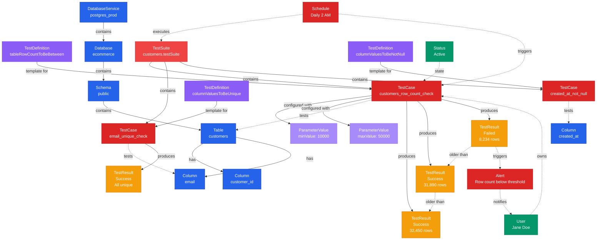
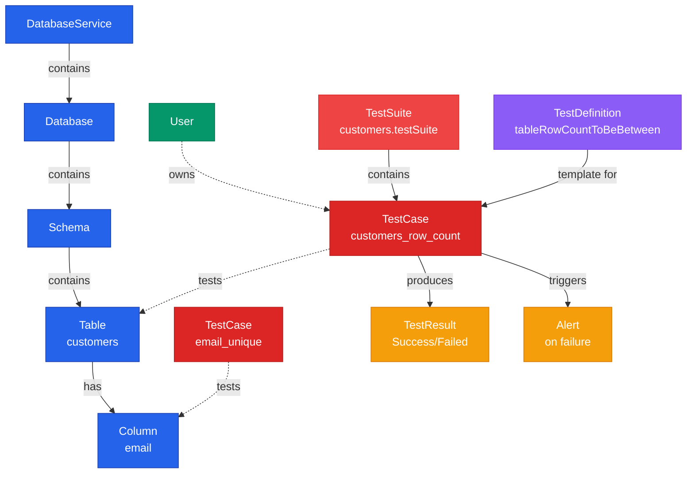

# Test Case

**Specific test instances applied to data assets with parameters and results**

---

## Overview

The **TestCase** entity represents a specific instance of a test applied to a table or column. Test cases are created from test definitions and include configured parameters, execution results, and historical test run data.

## Relationship Diagram



---

## Schema Specifications

View the complete TestCase schema in your preferred format:

=== "JSON Schema"

    **Complete JSON Schema Definition**

    ```json
    {
      "$id": "https://open-metadata.org/schema/tests/testCase.json",
      "$schema": "http://json-schema.org/draft-07/schema#",
      "title": "TestCase",
      "description": "Test case is a test definition to capture data quality tests against tables, columns, and other data assets.",
      "type": "object",
      "javaType": "org.openmetadata.schema.tests.TestCase",
      "javaInterfaces": ["org.openmetadata.schema.EntityInterface"],

      "definitions": {
        "testCaseParameterValue": {
          "type": "object",
          "javaType": "org.openmetadata.schema.tests.TestCaseParameterValue",
          "description": "This schema defines the parameter values that can be passed for a Test Case.",
          "properties": {
            "name": {
              "description": "name of the parameter. Must match the parameter names in testCaseParameterDefinition",
              "type": "string"
            },
            "value": {
              "description": "value to be passed for the Parameters. These are input from Users. We capture this in string and convert during the runtime.",
              "type": "string"
            }
          }
        }
      },

      "properties": {
        "id": {
          "description": "Unique identifier of this table instance.",
          "$ref": "../type/basic.json#/definitions/uuid"
        },
        "name": {
          "description": "Name that identifies this test case.",
          "$ref": "../type/basic.json#/definitions/testCaseEntityName"
        },
        "displayName": {
          "description": "Display Name that identifies this test.",
          "type": "string"
        },
        "fullyQualifiedName": {
          "description": "FullyQualifiedName same as `name`.",
          "$ref": "../type/basic.json#/definitions/fullyQualifiedEntityName"
        },
        "description": {
          "description": "Description of the testcase.",
          "$ref": "../type/basic.json#/definitions/markdown"
        },
        "testDefinition": {
          "description": "Test definition that this test case is based on.",
          "$ref": "../type/entityReference.json"
        },
        "entityLink": {
          "description": "Link to the entity that this test case is testing.",
          "$ref": "../type/basic.json#/definitions/entityLink"
        },
        "entityFQN": {
          "type": "string"
        },
        "testSuite": {
          "description": "Basic Test Suite that this test case belongs to.",
          "$ref": "../type/entityReference.json"
        },
        "testSuites": {
          "type": "array",
          "description": "Basic and Logical Test Suites this test case belongs to",
          "items": {
            "$ref": "./testSuite.json"
          }
        },
        "parameterValues": {
          "type": "array",
          "items": {
            "$ref": "#/definitions/testCaseParameterValue"
          }
        },
        "testCaseResult": {
          "description": "Latest test case result obtained for this test case.",
          "$ref": "./basic.json#/definitions/testCaseResult"
        },
        "testCaseStatus": {
          "description": "Status of Test Case run.",
          "$ref": "./basic.json#/definitions/testCaseStatus"
        },
        "version": {
          "description": "Metadata version of the entity.",
          "$ref": "../type/entityHistory.json#/definitions/entityVersion"
        },
        "owners": {
          "description": "Owners of this Pipeline.",
          "$ref": "../type/entityReferenceList.json",
          "default": null
        },
        "createdBy": {
          "description": "User who made the update.",
          "type": "string"
        },
        "updatedAt": {
          "description": "Last update time corresponding to the new version of the entity in Unix epoch time milliseconds.",
          "$ref": "../type/basic.json#/definitions/timestamp"
        },
        "updatedBy": {
          "description": "User who made the update.",
          "type": "string"
        },
        "href": {
          "description": "Link to the resource corresponding to this entity.",
          "$ref": "../type/basic.json#/definitions/href"
        },
        "changeDescription": {
          "description": "Change that lead to this version of the entity.",
          "$ref": "../type/entityHistory.json#/definitions/changeDescription"
        },
        "incrementalChangeDescription": {
          "description": "Change that lead to this version of the entity.",
          "$ref": "../type/entityHistory.json#/definitions/changeDescription"
        },
        "deleted": {
          "description": "When `true` indicates the entity has been soft deleted.",
          "type": "boolean",
          "default": false
        },
        "computePassedFailedRowCount": {
          "description": "Compute the passed and failed row count for the test case.",
          "type": "boolean",
          "default": false
        },
        "incidentId": {
          "description": "Reference to an ongoing Incident ID (stateId) for this test case.",
          "$ref": "../type/basic.json#/definitions/uuid"
        },
        "failedRowsSample": {
          "description": "Sample of failed rows for this test case.",
          "$ref": "../entity/data/table.json#/definitions/tableData"
        },
        "inspectionQuery": {
          "description": "SQL query to retrieve the failed rows for this test case.",
          "$ref": "../type/basic.json#/definitions/sqlQuery"
        },
        "domains": {
          "description": "Domains the test case belongs to. When not set, the test case inherits the domain from the table it belongs to.",
          "$ref": "../type/entityReferenceList.json"
        },
        "followers": {
          "description": "Followers of this test case. When not set, the test case inherits the followers from the table it belongs to.",
          "$ref": "../type/entityReferenceList.json"
        },
        "useDynamicAssertion": {
          "description": "If the test definition supports it, use dynamic assertion to evaluate the test case.",
          "type": "boolean",
          "default": false
        },
        "tags": {
          "description": "Tags for this test case. This is an inherited field from the parent entity and is not set directly on the test case.",
          "type": "array",
          "items": {
            "$ref": "../type/tagLabel.json"
          },
          "default": []
        },
        "dimensionColumns": {
          "description": "List of columns to group test results by dimensions. When specified, the test will be executed both overall and grouped by these columns to provide fine-grained data quality insights.",
          "type": "array",
          "items": {
            "type": "string"
          },
          "default": []
        },
        "entityStatus": {
          "description": "Current status of the test case.",
          "$ref": "../type/status.json",
          "default": "Approved"
        },
        "reviewers": {
          "description": "List of reviewers for this entity.",
          "$ref": "../type/entityReferenceList.json",
          "default": null
        }
      },

      "required": ["name", "testDefinition", "entityLink", "testSuite"],
      "additionalProperties": false
    }
    ```

    **[View Full JSON Schema →](https://github.com/open-metadata/OpenMetadataStandards/blob/main/schemas/tests/testCase.json)**

=== "RDF"

    **RDF/OWL Ontology Definition**

    ```turtle
    @prefix om: <https://open-metadata.org/schema/> .
    @prefix rdfs: <http://www.w3.org/2000/01/rdf-schema#> .
    @prefix owl: <http://www.w3.org/2002/07/owl#> .
    @prefix xsd: <http://www.w3.org/2001/XMLSchema#> .

    # TestCase Class Definition
    om:TestCase a owl:Class ;
        rdfs:label "TestCase" ;
        rdfs:comment "Test case is a test definition to capture data quality tests against tables, columns, and other data assets." .

    # Core Properties
    om:testCaseName a owl:DatatypeProperty ;
        rdfs:domain om:TestCase ;
        rdfs:range xsd:string ;
        rdfs:label "name" ;
        rdfs:comment "Name that identifies this test case" .

    om:displayName a owl:DatatypeProperty ;
        rdfs:domain om:TestCase ;
        rdfs:range xsd:string ;
        rdfs:label "displayName" ;
        rdfs:comment "Display Name that identifies this test" .

    om:fullyQualifiedName a owl:DatatypeProperty ;
        rdfs:domain om:TestCase ;
        rdfs:range xsd:string ;
        rdfs:label "fullyQualifiedName" ;
        rdfs:comment "FullyQualifiedName same as name" .

    om:description a owl:DatatypeProperty ;
        rdfs:domain om:TestCase ;
        rdfs:range xsd:string ;
        rdfs:label "description" ;
        rdfs:comment "Description of the testcase" .

    om:entityLink a owl:DatatypeProperty ;
        rdfs:domain om:TestCase ;
        rdfs:range xsd:anyURI ;
        rdfs:label "entityLink" ;
        rdfs:comment "Link to the entity that this test case is testing" .

    om:entityFQN a owl:DatatypeProperty ;
        rdfs:domain om:TestCase ;
        rdfs:range xsd:string ;
        rdfs:label "entityFQN" ;
        rdfs:comment "Fully qualified name of the entity being tested" .

    # Relationships
    om:basedOnDefinition a owl:ObjectProperty ;
        rdfs:domain om:TestCase ;
        rdfs:range om:TestDefinition ;
        rdfs:label "testDefinition" ;
        rdfs:comment "Test definition that this test case is based on" .

    om:belongsToTestSuite a owl:ObjectProperty ;
        rdfs:domain om:TestCase ;
        rdfs:range om:TestSuite ;
        rdfs:label "testSuite" ;
        rdfs:comment "Basic Test Suite that this test case belongs to" .

    om:belongsToTestSuites a owl:ObjectProperty ;
        rdfs:domain om:TestCase ;
        rdfs:range om:TestSuite ;
        rdfs:label "testSuites" ;
        rdfs:comment "Basic and Logical Test Suites this test case belongs to" .

    om:hasParameterValue a owl:ObjectProperty ;
        rdfs:domain om:TestCase ;
        rdfs:range om:TestCaseParameterValue ;
        rdfs:label "parameterValues" ;
        rdfs:comment "Configured parameter values" .

    om:hasTestResult a owl:ObjectProperty ;
        rdfs:domain om:TestCase ;
        rdfs:range om:TestCaseResult ;
        rdfs:label "testCaseResult" ;
        rdfs:comment "Latest test case result obtained for this test case" .

    om:hasTestCaseStatus a owl:ObjectProperty ;
        rdfs:domain om:TestCase ;
        rdfs:range om:TestCaseStatus ;
        rdfs:label "testCaseStatus" ;
        rdfs:comment "Status of Test Case run" .

    om:hasOwners a owl:ObjectProperty ;
        rdfs:domain om:TestCase ;
        rdfs:range om:EntityReference ;
        rdfs:label "owners" ;
        rdfs:comment "Owners of this test case" .

    om:hasDomains a owl:ObjectProperty ;
        rdfs:domain om:TestCase ;
        rdfs:range om:EntityReference ;
        rdfs:label "domains" ;
        rdfs:comment "Domains the test case belongs to" .

    om:hasFollowers a owl:ObjectProperty ;
        rdfs:domain om:TestCase ;
        rdfs:range om:EntityReference ;
        rdfs:label "followers" ;
        rdfs:comment "Followers of this test case" .

    om:hasReviewers a owl:ObjectProperty ;
        rdfs:domain om:TestCase ;
        rdfs:range om:EntityReference ;
        rdfs:label "reviewers" ;
        rdfs:comment "List of reviewers for this entity" .

    # Additional Properties
    om:computePassedFailedRowCount a owl:DatatypeProperty ;
        rdfs:domain om:TestCase ;
        rdfs:range xsd:boolean ;
        rdfs:label "computePassedFailedRowCount" ;
        rdfs:comment "Compute the passed and failed row count for the test case" .

    om:useDynamicAssertion a owl:DatatypeProperty ;
        rdfs:domain om:TestCase ;
        rdfs:range xsd:boolean ;
        rdfs:label "useDynamicAssertion" ;
        rdfs:comment "If the test definition supports it, use dynamic assertion to evaluate the test case" .

    om:deleted a owl:DatatypeProperty ;
        rdfs:domain om:TestCase ;
        rdfs:range xsd:boolean ;
        rdfs:label "deleted" ;
        rdfs:comment "When true indicates the entity has been soft deleted" .

    # TestCaseStatus Enumeration
    om:TestCaseStatus a owl:Class ;
        owl:oneOf (
            om:SuccessStatus
            om:FailedStatus
            om:AbortedStatus
            om:QueuedStatus
        ) .

    # Example Instance
    ex:customersRowCountTest a om:TestCase ;
        om:testCaseName "customers_row_count_check" ;
        om:displayName "Customers Table Row Count Validation" ;
        om:basedOnDefinition ex:tableRowCountToBeBetween ;
        om:entityLink "table://postgres_prod.ecommerce.public.customers" ;
        om:belongsToTestSuite ex:customersTestSuite ;
        om:hasParameterValue ex:minValue10000 ;
        om:hasParameterValue ex:maxValue50000 ;
        om:hasTestResult ex:latestResult ;
        om:computePassedFailedRowCount false ;
        om:useDynamicAssertion false ;
        om:deleted false .
    ```

    **[View Full RDF Ontology →](https://github.com/open-metadata/OpenMetadataStandards/blob/main/rdf/ontology/openmetadata.ttl)**

=== "JSON-LD"

    **JSON-LD Context and Example**

    ```json
    {
      "@context": {
        "@vocab": "https://open-metadata.org/schema/",
        "om": "https://open-metadata.org/schema/",
        "rdfs": "http://www.w3.org/2000/01/rdf-schema#",
        "xsd": "http://www.w3.org/2001/XMLSchema#",

        "TestCase": "om:TestCase",
        "name": {
          "@id": "om:testCaseName",
          "@type": "xsd:string"
        },
        "displayName": {
          "@id": "om:displayName",
          "@type": "xsd:string"
        },
        "fullyQualifiedName": {
          "@id": "om:fullyQualifiedName",
          "@type": "xsd:string"
        },
        "description": {
          "@id": "om:description",
          "@type": "xsd:string"
        },
        "testDefinition": {
          "@id": "om:basedOnDefinition",
          "@type": "@id"
        },
        "entityLink": {
          "@id": "om:entityLink",
          "@type": "xsd:anyURI"
        },
        "entityFQN": {
          "@id": "om:entityFQN",
          "@type": "xsd:string"
        },
        "testSuite": {
          "@id": "om:belongsToTestSuite",
          "@type": "@id"
        },
        "testSuites": {
          "@id": "om:belongsToTestSuites",
          "@type": "@id",
          "@container": "@list"
        },
        "parameterValues": {
          "@id": "om:hasParameterValue",
          "@type": "@id",
          "@container": "@list"
        },
        "testCaseResult": {
          "@id": "om:hasTestResult",
          "@type": "@id"
        },
        "testCaseStatus": {
          "@id": "om:hasTestCaseStatus",
          "@type": "@id"
        },
        "owners": {
          "@id": "om:hasOwners",
          "@type": "@id",
          "@container": "@list"
        },
        "domains": {
          "@id": "om:hasDomains",
          "@type": "@id",
          "@container": "@list"
        },
        "followers": {
          "@id": "om:hasFollowers",
          "@type": "@id",
          "@container": "@list"
        },
        "reviewers": {
          "@id": "om:hasReviewers",
          "@type": "@id",
          "@container": "@list"
        },
        "computePassedFailedRowCount": {
          "@id": "om:computePassedFailedRowCount",
          "@type": "xsd:boolean"
        },
        "useDynamicAssertion": {
          "@id": "om:useDynamicAssertion",
          "@type": "xsd:boolean"
        },
        "deleted": {
          "@id": "om:deleted",
          "@type": "xsd:boolean"
        }
      }
    }
    ```

    **Example JSON-LD Instance**:

    ```json
    {
      "@context": "https://open-metadata.org/context/testCase.jsonld",
      "@type": "TestCase",
      "@id": "https://example.com/testCases/customers_row_count",

      "name": "customers_row_count_check",
      "fullyQualifiedName": "postgres_prod.ecommerce.public.customers.testSuite.customers_row_count_check",
      "displayName": "Customers Table Row Count Validation",
      "description": "Ensures the customers table has between 10K-50K rows",

      "testDefinition": {
        "@id": "https://open-metadata.org/testDefinitions/tableRowCountToBeBetween",
        "@type": "TestDefinition",
        "name": "tableRowCountToBeBetween"
      },

      "entityLink": "table://postgres_prod.ecommerce.public.customers",
      "entityFQN": "postgres_prod.ecommerce.public.customers",

      "testSuite": {
        "@id": "https://example.com/testSuites/customers_suite",
        "@type": "TestSuite",
        "name": "customers.testSuite"
      },

      "parameterValues": [
        {
          "name": "minValue",
          "value": "10000"
        },
        {
          "name": "maxValue",
          "value": "50000"
        }
      ],

      "testCaseResult": {
        "timestamp": 1704240000000,
        "testCaseStatus": "Success",
        "result": "Row count: 32450",
        "testResultValue": [
          {
            "name": "actualRowCount",
            "value": "32450"
          }
        ]
      }
    }
    ```

    **[View Full JSON-LD Context →](https://github.com/open-metadata/OpenMetadataStandards/blob/main/rdf/contexts/testCase.jsonld)**

---

## Use Cases

- Validate data quality on specific tables and columns
- Monitor data quality trends over time
- Alert on test failures
- Track data quality SLAs
- Implement data contracts with quality gates
- Profile data quality metrics
- Compare test results across environments
- Schedule automated test execution

---

## JSON Schema Specification

### Core Properties

#### `id` (uuid)
**Type**: `string` (UUID format)
**Required**: No (system-generated)
**Description**: Unique identifier of this table instance

```json
{
  "id": "f6a7b8c9-d0e1-4f2a-3b4c-5d6e7f8a9b0c"
}
```

---

#### `name` (testCaseEntityName)
**Type**: `string`
**Required**: Yes
**Description**: Name that identifies this test case

```json
{
  "name": "customers_row_count_check"
}
```

---

#### `displayName` (string)
**Type**: `string`
**Required**: No
**Description**: Display Name that identifies this test

```json
{
  "displayName": "Customers Table Row Count Validation"
}
```

---

#### `fullyQualifiedName` (fullyQualifiedEntityName)
**Type**: `string`
**Required**: No (system-generated)
**Description**: FullyQualifiedName same as `name`

```json
{
  "fullyQualifiedName": "postgres_prod.ecommerce.public.customers.testSuite.customers_row_count_check"
}
```

---

#### `description` (markdown)
**Type**: `string` (Markdown format)
**Required**: No
**Description**: Description of the testcase

```json
{
  "description": "# Row Count Validation\n\nEnsures the customers table maintains between 10,000 and 50,000 rows.\n\n## Alert Conditions\n- Below 10K: Data pipeline issue\n- Above 50K: Unexpected data growth"
}
```

---

### Test Configuration Properties

#### `testDefinition` (EntityReference)
**Type**: `object`
**Required**: Yes
**Description**: Test definition that this test case is based on

```json
{
  "testDefinition": {
    "id": "a1b2c3d4-e5f6-4a7b-8c9d-0e1f2a3b4c5d",
    "type": "testDefinition",
    "name": "tableRowCountToBeBetween",
    "fullyQualifiedName": "tableRowCountToBeBetween"
  }
}
```

---

#### `entityLink` (entityLink)
**Type**: `string` (entityLink format)
**Required**: Yes
**Description**: Link to the entity that this test case is testing

**Format**: `<#E::table::<fullyQualifiedName>>` or `<#E::table::<fullyQualifiedName>::columns::<columnName>>`

```json
{
  "entityLink": "<#E::table::postgres_prod.ecommerce.public.customers>"
}
```

**Column Example**:
```json
{
  "entityLink": "<#E::table::postgres_prod.ecommerce.public.customers::columns::email>"
}
```

---

#### `entityFQN` (string)
**Type**: `string`
**Required**: No
**Description**: Fully qualified name of the entity being tested (extracted from entityLink)

```json
{
  "entityFQN": "postgres_prod.ecommerce.public.customers"
}
```

---

#### `testSuite` (EntityReference)
**Type**: `object`
**Required**: Yes
**Description**: Basic Test Suite that this test case belongs to

```json
{
  "testSuite": {
    "id": "e5f6a7b8-c9d0-4e1f-2a3b-4c5d6e7f8a9b",
    "type": "testSuite",
    "name": "customers.testSuite",
    "fullyQualifiedName": "postgres_prod.ecommerce.public.customers.testSuite"
  }
}
```

---

#### `testSuites[]` (TestSuite[])
**Type**: `array` of TestSuite objects
**Required**: No
**Description**: Basic and Logical Test Suites this test case belongs to

```json
{
  "testSuites": [
    {
      "id": "e5f6a7b8-c9d0-4e1f-2a3b-4c5d6e7f8a9b",
      "type": "testSuite",
      "name": "customers.testSuite",
      "fullyQualifiedName": "postgres_prod.ecommerce.public.customers.testSuite"
    },
    {
      "id": "f6a7b8c9-d0e1-4f2a-3b4c-5d6e7f8a9b0c",
      "type": "testSuite",
      "name": "critical_quality_tests",
      "fullyQualifiedName": "critical_quality_tests"
    }
  ]
}
```

---

#### `parameterValues[]` (TestCaseParameterValue[])
**Type**: `array` of TestCaseParameterValue objects
**Required**: No
**Description**: Configured parameter values for this test

**TestCaseParameterValue Object**:

```json
{
  "parameterValues": [
    {
      "name": "minValue",
      "value": "10000"
    },
    {
      "name": "maxValue",
      "value": "50000"
    }
  ]
}
```

---

### Test Results Properties

#### `testCaseResult` (TestCaseResult)
**Type**: `object`
**Required**: No (populated after execution)
**Description**: Latest test case result obtained for this test case

**TestCaseResult Object Properties**:

| Property | Type | Required | Description |
|----------|------|----------|-------------|
| `id` | uuid | No | Unique identifier of this failure instance |
| `testCaseFQN` | string | No | Fully qualified name of the test case |
| `timestamp` | integer | Yes | Data on which test case result is taken (epoch milliseconds) |
| `testCaseStatus` | TestCaseStatus enum | No | Status of Test Case run (Success, Failed, Aborted, Queued) |
| `result` | string | No | Details of test case results |
| `sampleData` | string | No | Sample data to capture rows/columns that didn't match |
| `testResultValue` | array | No | Array of name-value result pairs |
| `passedRows` | integer | No | Number of rows that passed |
| `failedRows` | integer | No | Number of rows that failed |
| `passedRowsPercentage` | number | No | Percentage of rows that passed |
| `failedRowsPercentage` | number | No | Percentage of rows that failed |
| `incidentId` | uuid | No | Incident State ID associated with this result |
| `maxBound` | number | No | Upper bound limit for the test case result |
| `minBound` | number | No | Lower bound limit for the test case result |
| `testCase` | EntityReference | No | Test case that this result is for |
| `testDefinition` | EntityReference | No | Test definition that this result is for |
| `dimensionResults` | array | No | List of dimensional test results |

**Example - Success**:

```json
{
  "testCaseResult": {
    "timestamp": 1704240000000,
    "testCaseStatus": "Success",
    "result": "Row count 32,450 is within range [10000-50000]",
    "testResultValue": [
      {
        "name": "actualRowCount",
        "value": "32450"
      },
      {
        "name": "minValue",
        "value": "10000"
      },
      {
        "name": "maxValue",
        "value": "50000"
      }
    ]
  }
}
```

**Example - Failed**:

```json
{
  "testCaseResult": {
    "timestamp": 1704243600000,
    "testCaseStatus": "Failed",
    "result": "Row count 8,234 is below minimum threshold of 10,000",
    "testResultValue": [
      {
        "name": "actualRowCount",
        "value": "8234"
      },
      {
        "name": "minValue",
        "value": "10000"
      },
      {
        "name": "difference",
        "value": "-1766"
      }
    ]
  }
}
```

**Example - Column Values Failed**:

```json
{
  "testCaseResult": {
    "timestamp": 1704247200000,
    "testCaseStatus": "Failed",
    "result": "342 rows contain email values outside allowed domain",
    "sampleData": "user@invalid-domain.xyz, test@bad-email.com, ...",
    "testResultValue": [
      {
        "name": "totalRows",
        "value": "10000"
      }
    ],
    "passedRows": 9658,
    "failedRows": 342
  }
}
```

---

#### `testCaseStatus` (TestCaseStatus)
**Type**: `string` (enum)
**Required**: No
**Description**: Status of Test Case run
**Values**: "Success", "Failed", "Aborted", "Queued"

```json
{
  "testCaseStatus": "Success"
}
```

---

### Additional Test Properties

#### `computePassedFailedRowCount` (boolean)
**Type**: `boolean`
**Required**: No
**Default**: false
**Description**: Compute the passed and failed row count for the test case

```json
{
  "computePassedFailedRowCount": true
}
```

---

#### `incidentId` (uuid)
**Type**: `string` (UUID format)
**Required**: No
**Description**: Reference to an ongoing Incident ID (stateId) for this test case

```json
{
  "incidentId": "a7b8c9d0-e1f2-4a3b-4c5d-6e7f8a9b0c1d"
}
```

---

#### `failedRowsSample` (TableData)
**Type**: `object`
**Required**: No
**Description**: Sample of failed rows for this test case

```json
{
  "failedRowsSample": {
    "columns": [
      {"name": "email", "dataType": "VARCHAR"}
    ],
    "rows": [
      ["invalid@email"],
      ["bad@domain.xyz"]
    ]
  }
}
```

---

#### `inspectionQuery` (sqlQuery)
**Type**: `string` (SQL query)
**Required**: No
**Description**: SQL query to retrieve the failed rows for this test case

```json
{
  "inspectionQuery": "SELECT email FROM customers WHERE email NOT LIKE '%@%.%'"
}
```

---

#### `useDynamicAssertion` (boolean)
**Type**: `boolean`
**Required**: No
**Default**: false
**Description**: If the test definition supports it, use dynamic assertion to evaluate the test case

```json
{
  "useDynamicAssertion": false
}
```

---

#### `dimensionColumns[]` (string[])
**Type**: `array` of strings
**Required**: No
**Default**: []
**Description**: List of columns to group test results by dimensions. When specified, the test will be executed both overall and grouped by these columns to provide fine-grained data quality insights.

```json
{
  "dimensionColumns": ["region", "product_category"]
}
```

---

### Governance Properties

#### `owners` (EntityReferenceList)
**Type**: `array` of EntityReference objects
**Required**: No
**Default**: null
**Description**: Owners of this test case (users or teams)

```json
{
  "owners": [
    {
      "id": "d4e5f6a7-b8c9-4d0e-1f2a-3b4c5d6e7f8a",
      "type": "user",
      "name": "jane.doe",
      "displayName": "Jane Doe"
    },
    {
      "id": "e5f6a7b8-c9d0-4e1f-2a3b-4c5d6e7f8a9b",
      "type": "team",
      "name": "data-quality-team",
      "displayName": "Data Quality Team"
    }
  ]
}
```

---

#### `domains` (EntityReferenceList)
**Type**: `array` of EntityReference objects
**Required**: No
**Description**: Domains the test case belongs to. When not set, the test case inherits the domain from the table it belongs to.

```json
{
  "domains": [
    {
      "id": "a1b2c3d4-e5f6-4a7b-8c9d-0e1f2a3b4c5d",
      "type": "domain",
      "name": "Marketing",
      "fullyQualifiedName": "Marketing"
    }
  ]
}
```

---

#### `followers` (EntityReferenceList)
**Type**: `array` of EntityReference objects
**Required**: No
**Description**: Followers of this test case. When not set, the test case inherits the followers from the table it belongs to.

```json
{
  "followers": [
    {
      "id": "c3d4e5f6-a7b8-4c9d-0e1f-2a3b4c5d6e7f",
      "type": "user",
      "name": "alice.johnson",
      "displayName": "Alice Johnson"
    }
  ]
}
```

---

#### `reviewers` (EntityReferenceList)
**Type**: `array` of EntityReference objects
**Required**: No
**Default**: null
**Description**: List of reviewers for this entity

```json
{
  "reviewers": [
    {
      "id": "b2c3d4e5-f6a7-4b8c-9d0e-1f2a3b4c5d6e",
      "type": "user",
      "name": "john.smith",
      "displayName": "John Smith"
    }
  ]
}
```

---

#### `tags` (TagLabel[])
**Type**: `array` of TagLabel objects
**Required**: No
**Default**: []
**Description**: Tags for this test case. This is an inherited field from the parent entity and is not set directly on the test case.

```json
{
  "tags": [
    {
      "tagFQN": "DataQuality.Critical",
      "labelType": "Manual",
      "state": "Confirmed"
    }
  ]
}
```

---

#### `entityStatus` (Status)
**Type**: `string` (Status enum)
**Required**: No
**Default**: "Approved"
**Description**: Current status of the test case

```json
{
  "entityStatus": "Approved"
}
```

---

### Versioning and System Properties

#### `version` (entityVersion)
**Type**: `number`
**Required**: Yes (system-managed)
**Description**: Metadata version of the entity

```json
{
  "version": 1.5
}
```

---

#### `createdBy` (string)
**Type**: `string`
**Required**: No (system-managed)
**Description**: User who created the test case

```json
{
  "createdBy": "jane.doe"
}
```

---

#### `updatedAt` (timestamp)
**Type**: `integer` (Unix epoch milliseconds)
**Required**: No (system-managed)
**Description**: Last update time corresponding to the new version of the entity

```json
{
  "updatedAt": 1704240000000
}
```

---

#### `updatedBy` (string)
**Type**: `string`
**Required**: No (system-managed)
**Description**: User who made the update

```json
{
  "updatedBy": "john.smith"
}
```

---

#### `href` (href)
**Type**: `string` (URI)
**Required**: No (system-managed)
**Description**: Link to the resource corresponding to this entity

```json
{
  "href": "http://localhost:8585/api/v1/dataQuality/testCases/f6a7b8c9-d0e1-4f2a-3b4c-5d6e7f8a9b0c"
}
```

---

#### `changeDescription` (ChangeDescription)
**Type**: `object`
**Required**: No (system-managed)
**Description**: Change that lead to this version of the entity

```json
{
  "changeDescription": {
    "fieldsAdded": [],
    "fieldsUpdated": [
      {
        "name": "parameterValues",
        "oldValue": "[{\"name\":\"minValue\",\"value\":\"10000\"}]",
        "newValue": "[{\"name\":\"minValue\",\"value\":\"15000\"}]"
      }
    ],
    "fieldsDeleted": [],
    "previousVersion": 1.4
  }
}
```

---

#### `incrementalChangeDescription` (ChangeDescription)
**Type**: `object`
**Required**: No (system-managed)
**Description**: Incremental change that lead to this version of the entity

```json
{
  "incrementalChangeDescription": {
    "fieldsAdded": [],
    "fieldsUpdated": [
      {
        "name": "description",
        "oldValue": "Old description",
        "newValue": "Updated description"
      }
    ],
    "fieldsDeleted": []
  }
}
```

---

#### `deleted` (boolean)
**Type**: `boolean`
**Required**: No (system-managed)
**Default**: false
**Description**: When true indicates the entity has been soft deleted

```json
{
  "deleted": false
}
```

---

## Complete Examples

### Table-Level Test Case

```json
{
  "id": "f6a7b8c9-d0e1-4f2a-3b4c-5d6e7f8a9b0c",
  "name": "customers_row_count_check",
  "fullyQualifiedName": "postgres_prod.ecommerce.public.customers.testSuite.customers_row_count_check",
  "displayName": "Customers Table Row Count Validation",
  "description": "Ensures the customers table has between 10,000 and 50,000 rows",
  "testDefinition": {
    "id": "a1b2c3d4-e5f6-4a7b-8c9d-0e1f2a3b4c5d",
    "type": "testDefinition",
    "name": "tableRowCountToBeBetween"
  },
  "entityLink": "<#E::table::postgres_prod.ecommerce.public.customers>",
  "entityFQN": "postgres_prod.ecommerce.public.customers",
  "testSuite": {
    "id": "e5f6a7b8-c9d0-4e1f-2a3b-4c5d6e7f8a9b",
    "type": "testSuite",
    "name": "customers.testSuite",
    "fullyQualifiedName": "postgres_prod.ecommerce.public.customers.testSuite"
  },
  "parameterValues": [
    {
      "name": "minValue",
      "value": "10000"
    },
    {
      "name": "maxValue",
      "value": "50000"
    }
  ],
  "testCaseResult": {
    "timestamp": 1704240000000,
    "testCaseStatus": "Success",
    "result": "Row count 32,450 is within range [10000-50000]",
    "testResultValue": [
      {
        "name": "actualRowCount",
        "value": "32450"
      }
    ]
  },
  "testCaseStatus": "Success",
  "owners": [
    {
      "id": "d4e5f6a7-b8c9-4d0e-1f2a-3b4c5d6e7f8a",
      "type": "user",
      "name": "jane.doe",
      "displayName": "Jane Doe"
    }
  ],
  "computePassedFailedRowCount": false,
  "useDynamicAssertion": false,
  "deleted": false,
  "version": 1.5
}
```

### Column-Level Test Case

```json
{
  "id": "a7b8c9d0-e1f2-4a3b-4c5d-6e7f8a9b0c1d",
  "name": "email_unique_check",
  "fullyQualifiedName": "postgres_prod.ecommerce.public.customers.email.testSuite.email_unique_check",
  "displayName": "Email Column Uniqueness Check",
  "description": "Validates that all email addresses are unique",
  "testDefinition": {
    "id": "b2c3d4e5-f6a7-4b8c-9d0e-1f2a3b4c5d6e",
    "type": "testDefinition",
    "name": "columnValuesToBeUnique",
    "fullyQualifiedName": "columnValuesToBeUnique"
  },
  "entityLink": "<#E::table::postgres_prod.ecommerce.public.customers::columns::email>",
  "entityFQN": "postgres_prod.ecommerce.public.customers.email",
  "testSuite": {
    "id": "e5f6a7b8-c9d0-4e1f-2a3b-4c5d6e7f8a9b",
    "type": "testSuite",
    "name": "customers.testSuite",
    "fullyQualifiedName": "postgres_prod.ecommerce.public.customers.testSuite"
  },
  "parameterValues": [],
  "testCaseResult": {
    "timestamp": 1704240000000,
    "testCaseStatus": "Success",
    "result": "All 32,450 email values are unique",
    "testResultValue": [
      {
        "name": "totalRows",
        "value": "32450"
      },
      {
        "name": "uniqueCount",
        "value": "32450"
      },
      {
        "name": "duplicateCount",
        "value": "0"
      }
    ]
  },
  "testCaseStatus": "Success",
  "computePassedFailedRowCount": false,
  "useDynamicAssertion": false,
  "deleted": false,
  "version": 1.0
}
```

---

## RDF Representation

### Instance Example

```turtle
@prefix om: <https://open-metadata.org/schema/> .
@prefix ex: <https://example.com/data/> .

ex:customersRowCountTest a om:TestCase ;
    om:name "customers_row_count_check" ;
    om:displayName "Customers Table Row Count Validation" ;
    om:basedOnDefinition ex:tableRowCountToBeBetween ;
    om:entityLink "table://postgres_prod.ecommerce.public.customers" ;
    om:belongsToTestSuite ex:customersTestSuite ;
    om:hasParameterValue [
        om:name "minValue" ;
        om:value "10000"
    ] ;
    om:hasParameterValue [
        om:name "maxValue" ;
        om:value "50000"
    ] ;
    om:hasTestResult ex:latestResult .

ex:latestResult a om:TestCaseResult ;
    om:timestamp "1704240000000"^^xsd:long ;
    om:testStatus om:SuccessStatus ;
    om:result "Row count: 32450" .
```

---

## Relationships

### Parent Entities
- **TestDefinition**: The template this test is based on
- **TestSuite**: The suite containing this test
- **Table or Column**: The entity being tested

### Associated Entities
- **Owner**: User or team owning this test

### Relationship Diagram



---

## Custom Properties

This entity supports custom properties through the `extension` field.
Common custom properties include:

- **Data Classification**: Sensitivity level
- **Cost Center**: Billing allocation
- **Retention Period**: Data retention requirements
- **Application Owner**: Owning application/team

See [Custom Properties](../metadata-specifications/custom-properties.md)
for details on defining and using custom properties.

---

## Followers

Users can follow test cases to receive notifications about test failures, parameter changes, and result trends. See **[Followers](../metadata-specifications/followers.md)** for details.

---

## API Operations

### List Test Cases

```http
GET /v1/dataQuality/testCases
Query Parameters:
  - fields: Fields to include (owners, reviewers, entityStatus, testSuite, testDefinition, testSuites, incidentId, domains, tags, followers)
  - entityLink: Filter by entity link (e.g., table://service.database.schema.table)
  - entityFQN: Filter by entity FQN
  - testSuiteId: Filter by test suite ID
  - testCaseStatus: Filter by status (Success, Failed, Aborted, Queued)
  - testCaseType: Filter by type (column, table, all - default: all)
  - createdBy: Filter by creator username
  - includeAllTests: Include all tests at entity level (default: false)
  - limit: Number of results (1-1000000, default 10)
  - before: Cursor for previous page
  - after: Cursor for next page
  - include: all | deleted | non-deleted (default: non-deleted)

Response: TestCaseList
```

**Example Request**:

```http
GET /v1/dataQuality/testCases?entityFQN=postgres_prod.ecommerce.public.customers&testCaseStatus=Failed&fields=testCaseResult,testSuite,owner&limit=50
```

---

### Create Test Case

```http
POST /v1/dataQuality/testCases
Content-Type: application/json

{
  "name": "customers_row_count_check",
  "displayName": "Customer Table Row Count Check",
  "description": "Validates that customer table row count is within expected range",
  "testDefinition": "tableRowCountToBeBetween",
  "entityLink": "<#E::table::postgres_prod.ecommerce.public.customers>",
  "testSuite": "postgres_prod.ecommerce.public.customers.testSuite",
  "parameterValues": [
    {
      "name": "minValue",
      "value": "10000"
    },
    {
      "name": "maxValue",
      "value": "50000"
    }
  ],
  "computePassedFailedRowCount": true,
  "owners": [
    {
      "id": "user-uuid",
      "type": "user"
    }
  ],
  "tags": [
    {"tagFQN": "DataQuality.Critical"}
  ]
}

Response: TestCase
```

---

### Create Multiple Test Cases

```http
POST /v1/dataQuality/testCases/createMany
Content-Type: application/json

[
  {
    "name": "email_unique_check",
    "testDefinition": "columnValuesToBeUnique",
    "entityLink": "<#E::table::postgres_prod.ecommerce.public.customers::columns::email>",
    "testSuite": "postgres_prod.ecommerce.public.customers.testSuite"
  },
  {
    "name": "created_at_not_null",
    "testDefinition": "columnValuesToBeNotNull",
    "entityLink": "<#E::table::postgres_prod.ecommerce.public.customers::columns::created_at>",
    "testSuite": "postgres_prod.ecommerce.public.customers.testSuite"
  }
]

Response: List of created TestCases
```

---

### Get Test Case by Name

```http
GET /v1/dataQuality/testCases/name/{fqn}
Query Parameters:
  - fields: Fields to include (testCaseResult, testSuite, testDefinition, owner, tags)
  - include: all | deleted | non-deleted (default: non-deleted)

Response: TestCase
```

**Example Request**:

```http
GET /v1/dataQuality/testCases/name/postgres_prod.ecommerce.public.customers.testSuite.customers_row_count_check?fields=testCaseResult,testSuite,owner
```

---

### Get Test Case by ID

```http
GET /v1/dataQuality/testCases/{id}
Query Parameters:
  - fields: Fields to include
  - include: all | deleted | non-deleted (default: non-deleted)

Response: TestCase
```

---

### Update Test Case (Partial)

```http
PATCH /v1/dataQuality/testCases/{id}
Content-Type: application/json-patch+json

[
  {
    "op": "replace",
    "path": "/parameterValues/0/value",
    "value": "15000"
  },
  {
    "op": "replace",
    "path": "/description",
    "value": "Updated description for row count validation"
  },
  {
    "op": "add",
    "path": "/tags/-",
    "value": {"tagFQN": "BusinessCritical"}
  }
]

Response: TestCase
```

---

### Create or Update Test Case

```http
PUT /v1/dataQuality/testCases
Content-Type: application/json

{
  "name": "customers_row_count_check",
  "testDefinition": "tableRowCountToBeBetween",
  "entityLink": "<#E::table::postgres_prod.ecommerce.public.customers>",
  "testSuite": "postgres_prod.ecommerce.public.customers.testSuite",
  "parameterValues": [
    {"name": "minValue", "value": "10000"},
    {"name": "maxValue", "value": "50000"}
  ]
}

Response: TestCase
```

---

### Delete Test Case

```http
DELETE /v1/dataQuality/testCases/{id}
Query Parameters:
  - hardDelete: true | false (default: false - soft delete)
  - recursive: true | false (default: false)

Response: TestCase
```

---

### Delete Test Case (Async)

```http
DELETE /v1/dataQuality/testCases/async/{id}
Query Parameters:
  - hardDelete: true | false (default: false)
  - recursive: true | false (default: false)

Response: Async deletion job details
```

---

### Get Failed Rows Sample

```http
GET /v1/dataQuality/testCases/{id}/failedRowsSample
Query Parameters:
  - limit: Number of failed rows to return (default: 25)

Response: Sample of failed rows with column values
```

---

### Get Inspection Query

```http
GET /v1/dataQuality/testCases/{id}/inspectionQuery

Response: SQL query to inspect failed test case data
```

---

### Get Dimension Results

```http
GET /v1/dataQuality/testCases/dimensionResults/{fqn}
Query Parameters:
  - startTs: Start timestamp (milliseconds)
  - endTs: End timestamp (milliseconds)

Response: Test case results grouped by data quality dimension
```

---

### Get Dimension Summary

```http
GET /v1/dataQuality/testCases/dimensionResults/{fqn}/dimensions
Query Parameters:
  - startTs: Start timestamp
  - endTs: End timestamp

Response: Summary of test results by dimension (Completeness, Accuracy, etc.)
```

---

### Create Test Case Incident

```http
POST /v1/dataQuality/testCases/testCaseIncidentStatus
Content-Type: application/json

{
  "testCaseReference": {
    "id": "test-case-uuid",
    "type": "testCase"
  },
  "stateId": 1234567890123,
  "incidentState": "New",
  "severity": "Severity1",
  "assignee": {
    "id": "user-uuid",
    "type": "user"
  },
  "reason": "Data quality anomaly detected in customer table"
}

Response: TestCaseIncidentStatus
```

---

### Update Test Case Incident

```http
PATCH /v1/dataQuality/testCases/testCaseIncidentStatus/{id}
Content-Type: application/json-patch+json

[
  {
    "op": "replace",
    "path": "/incidentState",
    "value": "Resolved"
  },
  {
    "op": "replace",
    "path": "/resolution",
    "value": "Data pipeline fixed and re-executed successfully"
  }
]

Response: TestCaseIncidentStatus
```

---

### Get Logical Test Cases

```http
GET /v1/dataQuality/testCases/logicalTestCases
Query Parameters:
  - testSuiteId: Logical test suite ID

Response: List of test cases in logical test suite
```

---

### Export Test Case

```http
GET /v1/dataQuality/testCases/name/{name}/export

Response: CSV file with test case details
```

---

### Export Test Case (Async)

```http
GET /v1/dataQuality/testCases/name/{name}/exportAsync

Response: Async export job details
```

---

### Import Test Case

```http
PUT /v1/dataQuality/testCases/name/{name}/import
Content-Type: multipart/form-data

file: [CSV file with test case data]
dryRun: false

Response: Import result
```

---

### Import Test Case (Async)

```http
PUT /v1/dataQuality/testCases/name/{name}/importAsync
Content-Type: multipart/form-data

file: [CSV file]
dryRun: false

Response: Async import job details
```

---

### Get Test Case Version

```http
GET /v1/dataQuality/testCases/{id}/versions/{version}

Response: TestCase (specific version)
```

---

### Get Test Case Versions

```http
GET /v1/dataQuality/testCases/{id}/versions

Response: EntityHistory (all versions)
```

---

## Related Documentation

- **[Test Definition](test-definition.md)** - Test templates
- **[Test Suite](test-suite.md)** - Test collections
- **[Table](../data-assets/databases/table.md)** - Table entity
- **[Data Quality Overview](overview.md)** - Quality framework
