# Test Definition

**Reusable test templates for data quality validation**

---

## Overview

The **TestDefinition** entity represents reusable test templates that define the structure and logic for data quality tests. Test definitions are parameterized blueprints that can be instantiated into test cases applied to specific tables or columns.

## Relationship Diagram

```mermaid
graph TD
    %% Main entity
    TD[TestDefinition<br/>tableRowCountToBeBetween]

    %% Parameters
    TD -->|defines| PARAM1[Parameter<br/>minValue: INT]
    TD -->|defines| PARAM2[Parameter<br/>maxValue: INT]

    %% Test type classification
    TYPE[EntityType<br/>TABLE] -.->|applies to| TD
    PLATFORM1[TestPlatform<br/>OpenMetadata] -.->|supports| TD
    PLATFORM2[TestPlatform<br/>dbt] -.->|supports| TD
    PLATFORM3[TestPlatform<br/>GreatExpectations] -.->|supports| TD

    %% Instantiated test cases
    TD -->|template for| TC1[TestCase<br/>customers_row_count]
    TD -->|template for| TC2[TestCase<br/>orders_row_count]
    TD -->|template for| TC3[TestCase<br/>products_row_count]

    %% Test cases applied to tables
    TC1 -.->|tests| TBL1[Table<br/>customers]
    TC2 -.->|tests| TBL2[Table<br/>orders]
    TC3 -.->|tests| TBL3[Table<br/>products]

    %% Test suites
    TS1[TestSuite<br/>customers.testSuite] -->|contains| TC1
    TS2[TestSuite<br/>orders.testSuite] -->|contains| TC2

    %% Governance
    OWNER[User/Team<br/>Admin] -.->|owns| TD

    %% Other test definitions
    TD2[TestDefinition<br/>columnValuesToBeUnique] -->|template for| TC4[TestCase<br/>email_unique]
    TYPE2[EntityType<br/>COLUMN] -.->|applies to| TD2
    TC4 -.->|tests| COL1[Column<br/>customer.email]

    TD3[TestDefinition<br/>columnValuesToBeBetween] -->|template for| TC5[TestCase<br/>age_range_check]
    TD3 -->|defines| PARAM3[Parameter<br/>minValue: DOUBLE]
    TD3 -->|defines| PARAM4[Parameter<br/>maxValue: DOUBLE]
    TC5 -.->|tests| COL2[Column<br/>customer.age]

    %% Data type constraints
    DT1[DataType<br/>NUMBER, INT] -.->|supported by| TD3

    %% Styling
    classDef definition fill:#8B5CF6,stroke:#7C3AED,color:#fff
    classDef testcase fill:#DC2626,stroke:#B91C1C,color:#fff
    classDef suite fill:#EF4444,stroke:#DC2626,color:#fff
    classDef parameter fill:#A78BFA,stroke:#8B5CF6,color:#fff
    classDef data fill:#2563EB,stroke:#1E40AF,color:#fff
    classDef governance fill:#059669,stroke:#047857,color:#fff
    classDef platform fill:#F59E0B,stroke:#D97706,color:#fff

    class TD,TD2,TD3 definition
    class TC1,TC2,TC3,TC4,TC5 testcase
    class TS1,TS2 suite
    class PARAM1,PARAM2,PARAM3,PARAM4 parameter
    class TBL1,TBL2,TBL3,COL1,COL2 data
    class OWNER governance
    class TYPE,TYPE2,PLATFORM1,PLATFORM2,PLATFORM3,DT1 platform
```



---

## Schema Specifications

View the complete TestDefinition schema in your preferred format:

=== "JSON Schema"

    **Complete JSON Schema Definition**

    ```json
    {
      "$id": "https://open-metadata.org/schema/tests/testDefinition.json",
      "$schema": "http://json-schema.org/draft-07/schema#",
      "title": "TestDefinition",
      "description": "Test Definition is a type of test using which test cases are created to capture data quality tests against data entities.",
      "type": "object",
      "javaType": "org.openmetadata.schema.tests.TestDefinition",
      "javaInterfaces": ["org.openmetadata.schema.EntityInterface"],

      "definitions": {
        "testPlatform": {
          "javaType": "org.openmetadata.schema.tests.TestPlatform",
          "description": "This schema defines the platform where tests are defined and ran.",
          "type": "string",
          "enum": [
            "OpenMetadata",
            "GreatExpectations",
            "dbt",
            "Deequ",
            "Soda",
            "Other"
          ]
        },
        "entityType": {
          "javaType": "org.openmetadata.schema.type.TestDefinitionEntityType",
          "description": "This enum defines the type for which this test definition applies to.",
          "type": "string",
          "enum": [
            "TABLE",
            "COLUMN"
          ]
        },
        "testDataType": {
          "javaType": "org.openmetadata.schema.type.TestCaseParameterDataType",
          "description": "This enum defines the type of data stored in a column.",
          "type": "string",
          "enum": [
            "NUMBER", "INT", "FLOAT", "DOUBLE",
            "DECIMAL", "TIMESTAMP", "TIME", "DATE",
            "DATETIME", "ARRAY", "MAP", "SET",
            "STRING", "BOOLEAN"
          ]
        },
        "testCaseParameterDefinition": {
          "type": "object",
          "javaType": "org.openmetadata.schema.tests.TestCaseParameter",
          "description": "This schema defines the parameters that can be passed for a Test Case.",
          "properties": {
            "name": {
              "description": "name of the parameter.",
              "type": "string"
            },
            "displayName": {
              "description": "Display Name that identifies this parameter name.",
              "type": "string"
            },
            "dataType": {
              "description": "Data type of the parameter (int, date etc.).",
              "$ref": "#/definitions/testDataType"
            },
            "description": {
              "description": "Description of the parameter.",
              "$ref": "../type/basic.json#/definitions/markdown"
            },
            "required": {
              "description": "Is this parameter required.",
              "type": "boolean",
              "default": false
            },
            "optionValues": {
              "description": "List of values that can be passed for this parameter.",
              "type": "array",
              "default": []
            },
            "validationRule": {
              "type": "object",
              "javaType": "org.openmetadata.schema.tests.TestCaseParameterValidationRule",
              "description": "Validation for the test parameter value.",
              "properties": {
                "parameterField": {
                  "description": "Name of the parameter to validate against.",
                  "type": "string"
                },
                "rule": {
                  "javaType": "org.openmetadata.schema.type.TestCaseParameterValidationRuleType",
                  "description": "This enum defines the type to use for a parameter validation rule.",
                  "type": "string",
                  "enum": [
                    "EQUALS",
                    "NOT_EQUALS",
                    "GREATER_THAN_OR_EQUALS",
                    "LESS_THAN_OR_EQUALS"
                  ]
                }
              }
            }
          }
        },
        "dataQualityDimensions": {
          "javaType": "org.openmetadata.schema.type.DataQualityDimensions",
          "description": "This enum defines the dimension a test case belongs to.",
          "type": "string",
          "enum": [
            "Completeness",
            "Accuracy",
            "Consistency",
            "Validity",
            "Uniqueness",
            "Integrity",
            "SQL"
          ]
        }
      },

      "properties": {
        "id": {
          "description": "Unique identifier of this test case definition instance.",
          "$ref": "../type/basic.json#/definitions/uuid"
        },
        "name": {
          "description": "Name that identifies this test case.",
          "$ref": "../type/basic.json#/definitions/testCaseEntityName"
        },
        "displayName": {
          "description": "Display Name that identifies this test case.",
          "type": "string"
        },
        "fullyQualifiedName": {
          "description": "FullyQualifiedName same as `name`.",
          "$ref": "../type/basic.json#/definitions/fullyQualifiedEntityName"
        },
        "description": {
          "description": "Description of the testcase.",
          "$ref": "../type/basic.json#/definitions/markdown"
        },
        "entityType": {
          "$ref": "#/definitions/entityType"
        },
        "testPlatforms": {
          "type": "array",
          "items": {
            "$ref": "#/definitions/testPlatform"
          }
        },
        "supportedDataTypes": {
          "type": "array",
          "items": {
            "$ref": "../entity/data/table.json#/definitions/dataType"
          }
        },
        "parameterDefinition": {
          "type": "array",
          "items": {
            "$ref": "#/definitions/testCaseParameterDefinition"
          }
        },
        "dataQualityDimension": {
          "$ref": "#/definitions/dataQualityDimensions"
        },
        "owners": {
          "description": "Owners of this TestCase definition.",
          "$ref": "../type/entityReferenceList.json",
          "default": null
        },
        "provider": {
          "$ref": "../type/basic.json#/definitions/providerType"
        },
        "version": {
          "description": "Metadata version of the entity.",
          "$ref": "../type/entityHistory.json#/definitions/entityVersion"
        },
        "updatedAt": {
          "description": "Last update time corresponding to the new version of the entity in Unix epoch time milliseconds.",
          "$ref": "../type/basic.json#/definitions/timestamp"
        },
        "updatedBy": {
          "description": "User who made the update.",
          "type": "string"
        },
        "href": {
          "description": "Link to the resource corresponding to this entity.",
          "$ref": "../type/basic.json#/definitions/href"
        },
        "changeDescription": {
          "description": "Change that lead to this version of the entity.",
          "$ref": "../type/entityHistory.json#/definitions/changeDescription"
        },
        "incrementalChangeDescription": {
          "description": "Change that lead to this version of the entity.",
          "$ref": "../type/entityHistory.json#/definitions/changeDescription"
        },
        "deleted": {
          "description": "When `true` indicates the entity has been soft deleted.",
          "type": "boolean",
          "default": false
        },
        "supportsRowLevelPassedFailed": {
          "description": "When `true` indicates the test case supports row level passed/failed.",
          "type": "boolean",
          "default": false
        },
        "domains": {
          "description": "Domains the asset belongs to. When not set, the asset inherits the domain from the parent it belongs to.",
          "$ref": "../type/entityReferenceList.json"
        },
        "supportsDynamicAssertion": {
          "description": "When `true` indicates the test case supports dynamic assertions.",
          "type": "boolean",
          "default": false
        },
        "supportedServices": {
          "description": "List of services that this test definition supports. When empty, it implies all services are supported.",
          "type": "array",
          "items": {
            "type": "string"
          },
          "default": []
        }
      },

      "required": ["name", "description", "testPlatforms"],
      "additionalProperties": false
    }
    ```

    **[View Full JSON Schema →](https://github.com/open-metadata/OpenMetadataStandards/blob/main/schemas/entity/data/testDefinition.json)**

=== "RDF"

    **RDF/OWL Ontology Definition**

    ```turtle
    @prefix om: <https://open-metadata.org/schema/> .
    @prefix rdfs: <http://www.w3.org/2000/01/rdf-schema#> .
    @prefix owl: <http://www.w3.org/2002/07/owl#> .
    @prefix xsd: <http://www.w3.org/2001/XMLSchema#> .

    # TestDefinition Class Definition
    om:TestDefinition a owl:Class ;
        rdfs:subClassOf om:DataQualityAsset ;
        rdfs:label "TestDefinition" ;
        rdfs:comment "Test Definition is a type of test using which test cases are created to capture data quality tests against data entities." ;
        om:hierarchyLevel 1 .

    # Properties
    om:testDefinitionName a owl:DatatypeProperty ;
        rdfs:domain om:TestDefinition ;
        rdfs:range xsd:string ;
        rdfs:label "name" ;
        rdfs:comment "Name that identifies this test case" .

    om:displayName a owl:DatatypeProperty ;
        rdfs:domain om:TestDefinition ;
        rdfs:range xsd:string ;
        rdfs:label "displayName" ;
        rdfs:comment "Display Name that identifies this test case" .

    om:fullyQualifiedName a owl:DatatypeProperty ;
        rdfs:domain om:TestDefinition ;
        rdfs:range xsd:string ;
        rdfs:label "fullyQualifiedName" ;
        rdfs:comment "FullyQualifiedName same as name" .

    om:description a owl:DatatypeProperty ;
        rdfs:domain om:TestDefinition ;
        rdfs:range xsd:string ;
        rdfs:label "description" ;
        rdfs:comment "Description of the testcase" .

    om:entityType a owl:ObjectProperty ;
        rdfs:domain om:TestDefinition ;
        rdfs:range om:TestDefinitionEntityType ;
        rdfs:label "entityType" ;
        rdfs:comment "Type for which this test definition applies to" .

    om:testPlatform a owl:ObjectProperty ;
        rdfs:domain om:TestDefinition ;
        rdfs:range om:TestPlatform ;
        rdfs:label "testPlatforms" ;
        rdfs:comment "Platforms where tests are defined and ran" .

    om:supportsDataType a owl:ObjectProperty ;
        rdfs:domain om:TestDefinition ;
        rdfs:range om:DataType ;
        rdfs:label "supportedDataTypes" ;
        rdfs:comment "Data types this test can validate" .

    om:hasParameter a owl:ObjectProperty ;
        rdfs:domain om:TestDefinition ;
        rdfs:range om:TestCaseParameter ;
        rdfs:label "parameterDefinition" ;
        rdfs:comment "Parameters that can be passed for a Test Case" .

    om:dataQualityDimension a owl:ObjectProperty ;
        rdfs:domain om:TestDefinition ;
        rdfs:range om:DataQualityDimensions ;
        rdfs:label "dataQualityDimension" ;
        rdfs:comment "Dimension a test case belongs to" .

    om:hasOwners a owl:ObjectProperty ;
        rdfs:domain om:TestDefinition ;
        rdfs:range om:EntityReference ;
        rdfs:label "owners" ;
        rdfs:comment "Owners of this TestCase definition" .

    om:hasDomains a owl:ObjectProperty ;
        rdfs:domain om:TestDefinition ;
        rdfs:range om:EntityReference ;
        rdfs:label "domains" ;
        rdfs:comment "Domains the asset belongs to" .

    om:supportsRowLevelPassedFailed a owl:DatatypeProperty ;
        rdfs:domain om:TestDefinition ;
        rdfs:range xsd:boolean ;
        rdfs:label "supportsRowLevelPassedFailed" ;
        rdfs:comment "Indicates the test case supports row level passed/failed" .

    om:supportsDynamicAssertion a owl:DatatypeProperty ;
        rdfs:domain om:TestDefinition ;
        rdfs:range xsd:boolean ;
        rdfs:label "supportsDynamicAssertion" ;
        rdfs:comment "Indicates the test case supports dynamic assertions" .

    # TestDefinitionEntityType Enumeration
    om:TestDefinitionEntityType a owl:Class ;
        owl:oneOf (
            om:TABLE
            om:COLUMN
        ) .

    # TestPlatform Enumeration
    om:TestPlatform a owl:Class ;
        owl:oneOf (
            om:OpenMetadata
            om:GreatExpectations
            om:dbt
            om:Deequ
            om:Soda
            om:Other
        ) .

    # DataQualityDimensions Enumeration
    om:DataQualityDimensions a owl:Class ;
        owl:oneOf (
            om:Completeness
            om:Accuracy
            om:Consistency
            om:Validity
            om:Uniqueness
            om:Integrity
            om:SQL
        ) .

    # Example Instance
    ex:tableRowCountToBeBetween a om:TestDefinition ;
        om:testDefinitionName "tableRowCountToBeBetween" ;
        om:displayName "Table Row Count To Be Between" ;
        om:description "Validates that the number of rows in a table is between min and max values" ;
        om:entityType om:TABLE ;
        om:testPlatform om:OpenMetadata, om:dbt ;
        om:dataQualityDimension om:Completeness ;
        om:hasParameter ex:minValueParam ;
        om:hasParameter ex:maxValueParam .
    ```

    **[View Full RDF Ontology →](https://github.com/open-metadata/OpenMetadataStandards/blob/main/rdf/ontology/openmetadata.ttl)**

=== "JSON-LD"

    **JSON-LD Context and Example**

    ```json
    {
      "@context": {
        "@vocab": "https://open-metadata.org/schema/",
        "om": "https://open-metadata.org/schema/",
        "rdfs": "http://www.w3.org/2000/01/rdf-schema#",
        "xsd": "http://www.w3.org/2001/XMLSchema#",

        "TestDefinition": "om:TestDefinition",
        "name": {
          "@id": "om:testDefinitionName",
          "@type": "xsd:string"
        },
        "fullyQualifiedName": {
          "@id": "om:fullyQualifiedName",
          "@type": "xsd:string"
        },
        "displayName": {
          "@id": "om:displayName",
          "@type": "xsd:string"
        },
        "description": {
          "@id": "om:description",
          "@type": "xsd:string"
        },
        "entityType": {
          "@id": "om:entityType",
          "@type": "@vocab"
        },
        "testPlatforms": {
          "@id": "om:testPlatform",
          "@type": "@vocab",
          "@container": "@set"
        },
        "supportedDataTypes": {
          "@id": "om:supportsDataType",
          "@type": "@vocab",
          "@container": "@set"
        },
        "parameterDefinition": {
          "@id": "om:hasParameter",
          "@type": "@id",
          "@container": "@list"
        },
        "dataQualityDimension": {
          "@id": "om:dataQualityDimension",
          "@type": "@vocab"
        },
        "owners": {
          "@id": "om:hasOwners",
          "@type": "@id",
          "@container": "@set"
        },
        "domains": {
          "@id": "om:hasDomains",
          "@type": "@id",
          "@container": "@set"
        },
        "supportsRowLevelPassedFailed": {
          "@id": "om:supportsRowLevelPassedFailed",
          "@type": "xsd:boolean"
        },
        "supportsDynamicAssertion": {
          "@id": "om:supportsDynamicAssertion",
          "@type": "xsd:boolean"
        }
      }
    }
    ```

    **Example JSON-LD Instance**:

    ```json
    {
      "@context": "https://open-metadata.org/context/testDefinition.jsonld",
      "@type": "TestDefinition",
      "@id": "https://open-metadata.org/testDefinitions/tableRowCountToBeBetween",

      "name": "tableRowCountToBeBetween",
      "displayName": "Table Row Count To Be Between",
      "description": "Validates that the number of rows in a table is between min and max values",
      "entityType": "TABLE",
      "testPlatforms": ["OpenMetadata", "dbt"],
      "dataQualityDimension": "Completeness",

      "parameterDefinition": [
        {
          "name": "minValue",
          "displayName": "Minimum Value",
          "dataType": "INT",
          "description": "Minimum expected row count",
          "required": false
        },
        {
          "name": "maxValue",
          "displayName": "Maximum Value",
          "dataType": "INT",
          "description": "Maximum expected row count",
          "required": false
        }
      ],

      "owners": [
        {
          "@id": "https://example.com/users/system",
          "@type": "User",
          "name": "admin"
        }
      ]
    }
    ```

    **[View Full JSON-LD Context →](https://github.com/open-metadata/OpenMetadataStandards/blob/main/rdf/contexts/testDefinition.jsonld)**

---

## Use Cases

- Define standard data quality test templates across the organization
- Create custom test definitions for specific business rules
- Support multiple testing platforms (Great Expectations, Deequ, Soda, DBT)
- Parameterize tests for reusability
- Validate different data types and entity types
- Build test libraries for common quality checks
- Enable test catalog and discovery

---

## JSON Schema Specification

### Core Properties

#### `id` (uuid)
**Type**: `string` (UUID format)
**Required**: No (system-generated)
**Description**: Unique identifier of this test case definition instance

```json
{
  "id": "a1b2c3d4-e5f6-4a7b-8c9d-0e1f2a3b4c5d"
}
```

---

#### `name` (testCaseEntityName)
**Type**: `string`
**Required**: Yes
**Description**: Name that identifies this test case

```json
{
  "name": "tableRowCountToBeBetween"
}
```

---

#### `fullyQualifiedName` (fullyQualifiedEntityName)
**Type**: `string`
**Required**: No (system-generated)
**Description**: FullyQualifiedName same as `name`

```json
{
  "fullyQualifiedName": "tableRowCountToBeBetween"
}
```

---

#### `displayName`
**Type**: `string`
**Required**: No
**Description**: Display Name that identifies this test case

```json
{
  "displayName": "Table Row Count To Be Between"
}
```

---

#### `description` (markdown)
**Type**: `string` (Markdown format)
**Required**: Yes
**Description**: Description of the testcase

```json
{
  "description": "Validates that the number of rows in a table is between min and max values"
}
```

---

### Test Configuration Properties

#### `entityType` (TestDefinitionEntityType enum)
**Type**: `string` enum
**Required**: No
**Allowed Values**:

- `TABLE` - Test applies to tables
- `COLUMN` - Test applies to columns

```json
{
  "entityType": "TABLE"
}
```

---

#### `testPlatforms[]` (TestPlatform[])
**Type**: `array` of string enum
**Required**: Yes
**Allowed Values**: `OpenMetadata`, `GreatExpectations`, `dbt`, `Deequ`, `Soda`, `Other`
**Description**: Platforms where tests are defined and ran

```json
{
  "testPlatforms": ["OpenMetadata", "dbt"]
}
```

---

#### `supportedDataTypes[]` (DataType[])
**Type**: `array` of DataType
**Required**: No
**Description**: Data types this test can validate (references table.json#/definitions/dataType)

```json
{
  "supportedDataTypes": ["NUMBER", "INT", "FLOAT", "DOUBLE"]
}
```

---

#### `parameterDefinition[]` (TestCaseParameter[])
**Type**: `array` of TestCaseParameter objects
**Required**: No
**Description**: Parameters that can be passed for a Test Case

**TestCaseParameter Object Properties**:

| Property | Type | Required | Description |
|----------|------|----------|-------------|
| `name` | string | No | name of the parameter |
| `displayName` | string | No | Display Name that identifies this parameter name |
| `dataType` | TestDataType | No | Data type of the parameter (int, date etc.) |
| `description` | markdown | No | Description of the parameter |
| `required` | boolean | No | Is this parameter required (default: false) |
| `optionValues` | array | No | List of values that can be passed for this parameter (default: []) |
| `validationRule` | object | No | Validation for the test parameter value |

**Example**:

```json
{
  "parameterDefinition": [
    {
      "name": "minValue",
      "displayName": "Minimum Value",
      "dataType": "INT",
      "description": "Minimum expected row count (inclusive)",
      "required": false
    },
    {
      "name": "maxValue",
      "displayName": "Maximum Value",
      "dataType": "INT",
      "description": "Maximum expected row count (inclusive)",
      "required": false
    }
  ]
}
```

---

#### `dataQualityDimension` (DataQualityDimensions enum)
**Type**: `string` enum
**Required**: No
**Allowed Values**: `Completeness`, `Accuracy`, `Consistency`, `Validity`, `Uniqueness`, `Integrity`, `SQL`
**Description**: Dimension a test case belongs to

```json
{
  "dataQualityDimension": "Completeness"
}
```

---

### Governance Properties

#### `owners` (EntityReferenceList)
**Type**: `array` of EntityReference objects
**Required**: No
**Default**: `null`
**Description**: Owners of this TestCase definition

```json
{
  "owners": [
    {
      "id": "d4e5f6a7-b8c9-4d0e-1f2a-3b4c5d6e7f8a",
      "type": "user",
      "name": "admin",
      "displayName": "Administrator"
    }
  ]
}
```

---

#### `domains` (EntityReferenceList)
**Type**: `array` of EntityReference objects
**Required**: No
**Description**: Domains the asset belongs to. When not set, the asset inherits the domain from the parent it belongs to.

```json
{
  "domains": [
    {
      "id": "a1b2c3d4-e5f6-4a7b-8c9d-0e1f2a3b4c5d",
      "type": "domain",
      "name": "Marketing",
      "displayName": "Marketing Domain"
    }
  ]
}
```

---

### Versioning and Metadata Properties

#### `provider` (providerType)
**Type**: `string` enum
**Required**: No
**Description**: Provider type (e.g., user, system)

```json
{
  "provider": "system"
}
```

---

#### `version` (entityVersion)
**Type**: `number`
**Required**: No (system-managed)
**Description**: Metadata version of the entity

```json
{
  "version": 1.0
}
```

---

#### `updatedAt` (timestamp)
**Type**: `number` (Unix epoch time in milliseconds)
**Required**: No (system-managed)
**Description**: Last update time corresponding to the new version of the entity

```json
{
  "updatedAt": 1678886400000
}
```

---

#### `updatedBy` (string)
**Type**: `string`
**Required**: No (system-managed)
**Description**: User who made the update

```json
{
  "updatedBy": "admin"
}
```

---

#### `href` (href)
**Type**: `string` (URI)
**Required**: No (system-managed)
**Description**: Link to the resource corresponding to this entity

```json
{
  "href": "https://example.com/api/v1/testDefinitions/tableRowCountToBeBetween"
}
```

---

#### `changeDescription` (changeDescription)
**Type**: `object`
**Required**: No (system-managed)
**Description**: Change that lead to this version of the entity

```json
{
  "changeDescription": {
    "fieldsAdded": [],
    "fieldsUpdated": [
      {
        "name": "description",
        "oldValue": "Old description",
        "newValue": "New description"
      }
    ],
    "fieldsDeleted": [],
    "previousVersion": 1.0
  }
}
```

---

#### `incrementalChangeDescription` (changeDescription)
**Type**: `object`
**Required**: No (system-managed)
**Description**: Change that lead to this version of the entity

```json
{
  "incrementalChangeDescription": {
    "fieldsAdded": [],
    "fieldsUpdated": [],
    "fieldsDeleted": [],
    "previousVersion": 1.0
  }
}
```

---

#### `deleted` (boolean)
**Type**: `boolean`
**Required**: No
**Default**: `false`
**Description**: When `true` indicates the entity has been soft deleted

```json
{
  "deleted": false
}
```

---

### Test Execution Properties

#### `supportsRowLevelPassedFailed` (boolean)
**Type**: `boolean`
**Required**: No
**Default**: `false`
**Description**: When `true` indicates the test case supports row level passed/failed

```json
{
  "supportsRowLevelPassedFailed": true
}
```

---

#### `supportsDynamicAssertion` (boolean)
**Type**: `boolean`
**Required**: No
**Default**: `false`
**Description**: When `true` indicates the test case supports dynamic assertions

```json
{
  "supportsDynamicAssertion": false
}
```

---

#### `supportedServices` (string[])
**Type**: `array` of strings
**Required**: No
**Default**: `[]`
**Description**: List of services that this test definition supports. When empty, it implies all services are supported.

```json
{
  "supportedServices": ["BigQuery", "Snowflake", "Redshift"]
}
```

---

## Complete Examples

### Table-Level Test Definition

```json
{
  "id": "a1b2c3d4-e5f6-4a7b-8c9d-0e1f2a3b4c5d",
  "name": "tableRowCountToBeBetween",
  "fullyQualifiedName": "tableRowCountToBeBetween",
  "displayName": "Table Row Count To Be Between",
  "description": "Validates that the number of rows in a table is between min and max values",
  "entityType": "TABLE",
  "testPlatforms": ["OpenMetadata", "dbt"],
  "dataQualityDimension": "Completeness",
  "parameterDefinition": [
    {
      "name": "minValue",
      "displayName": "Minimum Value",
      "dataType": "INT",
      "description": "Minimum expected row count",
      "required": false
    },
    {
      "name": "maxValue",
      "displayName": "Maximum Value",
      "dataType": "INT",
      "description": "Maximum expected row count",
      "required": false
    }
  ],
  "owners": [
    {
      "id": "system-user-id",
      "type": "user",
      "name": "admin"
    }
  ],
  "provider": "system",
  "version": 1.0,
  "supportsRowLevelPassedFailed": false,
  "supportsDynamicAssertion": false,
  "supportedServices": []
}
```

### Column-Level Test Definition

```json
{
  "id": "b2c3d4e5-f6a7-4b8c-9d0e-1f2a3b4c5d6e",
  "name": "columnValuesToBeBetween",
  "fullyQualifiedName": "columnValuesToBeBetween",
  "displayName": "Column Values To Be Between",
  "description": "Validates that all values in a column fall within a specified numeric range",
  "entityType": "COLUMN",
  "testPlatforms": ["OpenMetadata", "GreatExpectations", "Soda"],
  "supportedDataTypes": ["NUMBER", "INT", "FLOAT", "DOUBLE", "DECIMAL"],
  "dataQualityDimension": "Validity",
  "parameterDefinition": [
    {
      "name": "minValue",
      "displayName": "Minimum Value",
      "dataType": "DOUBLE",
      "description": "Minimum expected value (inclusive)",
      "required": false
    },
    {
      "name": "maxValue",
      "displayName": "Maximum Value",
      "dataType": "DOUBLE",
      "description": "Maximum expected value (inclusive)",
      "required": false
    }
  ],
  "version": 1.2,
  "supportsRowLevelPassedFailed": false,
  "supportsDynamicAssertion": false
}
```

### Custom Enum Test Definition

```json
{
  "id": "c3d4e5f6-a7b8-4c9d-0e1f-2a3b4c5d6e7f",
  "name": "columnValuesToBeInSet",
  "fullyQualifiedName": "columnValuesToBeInSet",
  "displayName": "Column Values To Be In Set",
  "description": "Validates that all column values are within an allowed set of values",
  "entityType": "COLUMN",
  "testPlatforms": ["OpenMetadata"],
  "supportedDataTypes": ["STRING", "INT"],
  "dataQualityDimension": "Validity",
  "parameterDefinition": [
    {
      "name": "allowedValues",
      "displayName": "Allowed Values",
      "dataType": "ARRAY",
      "description": "List of allowed values (comma-separated)",
      "required": true
    }
  ],
  "version": 1.0,
  "supportsRowLevelPassedFailed": false,
  "supportsDynamicAssertion": false
}
```

---

## RDF Representation

### Ontology Class

```turtle
@prefix om: <https://open-metadata.org/schema/> .
@prefix rdfs: <http://www.w3.org/2000/01/rdf-schema#> .
@prefix owl: <http://www.w3.org/2002/07/owl#> .
@prefix xsd: <http://www.w3.org/2001/XMLSchema#> .

om:TestDefinition a owl:Class ;
    rdfs:subClassOf om:DataQualityAsset ;
    rdfs:label "TestDefinition" ;
    rdfs:comment "Test Definition is a type of test using which test cases are created to capture data quality tests against data entities." .
```

### Instance Example

```turtle
@prefix om: <https://open-metadata.org/schema/> .
@prefix ex: <https://example.com/tests/> .

ex:tableRowCountToBeBetween a om:TestDefinition ;
    om:testDefinitionName "tableRowCountToBeBetween" ;
    om:displayName "Table Row Count To Be Between" ;
    om:description "Validates that the number of rows in a table is between min and max values" ;
    om:entityType om:TABLE ;
    om:testPlatform om:OpenMetadata, om:dbt ;
    om:dataQualityDimension om:Completeness ;
    om:hasParameter ex:minValueParam ;
    om:hasParameter ex:maxValueParam .
```

---

## JSON-LD Context

```json
{
  "@context": {
    "@vocab": "https://open-metadata.org/schema/",
    "TestDefinition": "om:TestDefinition",
    "name": "om:testDefinitionName",
    "entityType": {
      "@id": "om:entityType",
      "@type": "@vocab"
    },
    "testPlatforms": {
      "@id": "om:testPlatform",
      "@container": "@set"
    },
    "parameterDefinition": {
      "@id": "om:hasParameter",
      "@container": "@list"
    },
    "dataQualityDimension": {
      "@id": "om:dataQualityDimension",
      "@type": "@vocab"
    },
    "owners": {
      "@id": "om:hasOwners",
      "@container": "@set"
    },
    "domains": {
      "@id": "om:hasDomains",
      "@container": "@set"
    }
  }
}
```

---

## Relationships

### Child Entities
- **TestCase**: Instances created from this definition

### Associated Entities
- **Owners**: Users or teams owning this definition (plural, can have multiple)
- **Domains**: Domains the test definition belongs to

---

## Custom Properties

This entity supports custom properties through the `extension` field.
Common custom properties include:

- **Data Classification**: Sensitivity level
- **Cost Center**: Billing allocation
- **Retention Period**: Data retention requirements
- **Application Owner**: Owning application/team

See [Custom Properties](../metadata-specifications/custom-properties.md)
for details on defining and using custom properties.

---

## API Operations

### List Test Definitions

```http
GET /api/v1/testDefinitions
```

### Get Test Definition

```http
GET /api/v1/testDefinitions/name/tableRowCountToBeBetween
```

### Create Test Definition

```http
POST /api/v1/testDefinitions
Content-Type: application/json

{
  "name": "customTestDefinition",
  "description": "Custom test definition for validating thresholds",
  "entityType": "COLUMN",
  "testPlatforms": ["Other"],
  "parameterDefinition": [
    {
      "name": "threshold",
      "dataType": "DOUBLE",
      "required": true
    }
  ]
}
```

---

## Related Documentation

- **[Test Case](test-case.md)** - Test instances
- **[Test Suite](test-suite.md)** - Test collections
- **[Table](../data-assets/databases/table.md)** - Table entity
- **[Data Quality Overview](overview.md)** - Quality framework
