# Test Suite

**Collections of test cases for tables or logical groupings**

---

## Overview

The **TestSuite** entity represents a collection of test cases organized around a specific table or a logical grouping. Test suites enable batch execution, monitoring, and management of related data quality tests.

## Relationship Diagram

```mermaid
graph TD
    %% Main entity - Executable Test Suite
    TS[TestSuite<br/>customers.testSuite<br/>Type: Executable]

    %% Attached to table
    TBL[Table<br/>customers] -->|has test suite| TS

    %% Database hierarchy
    SVC[DatabaseService<br/>postgres_prod] -->|contains| DB[Database<br/>ecommerce]
    DB -->|contains| SCH[Schema<br/>public]
    SCH -->|contains| TBL
    TBL -->|has| COL1[Column<br/>email]
    TBL -->|has| COL2[Column<br/>created_at]

    %% Test cases in suite
    TS -->|contains| TC1[TestCase<br/>row_count_check]
    TS -->|contains| TC2[TestCase<br/>email_unique_check]
    TS -->|contains| TC3[TestCase<br/>created_at_not_null]
    TS -->|contains| TC4[TestCase<br/>customer_id_unique]
    TS -->|contains| TC5[TestCase<br/>status_valid_values]

    %% Test cases test entities
    TC1 -.->|tests| TBL
    TC2 -.->|tests| COL1
    TC3 -.->|tests| COL2
    TC4 -.->|tests| COL3[Column<br/>customer_id]
    TC5 -.->|tests| COL4[Column<br/>status]

    %% Test definitions
    TD1[TestDefinition<br/>tableRowCountToBeBetween] -->|template for| TC1
    TD2[TestDefinition<br/>columnValuesToBeUnique] -->|template for| TC2
    TD3[TestDefinition<br/>columnValuesToBeNotNull] -->|template for| TC3

    %% Test results and summary
    TS -->|has summary| SUM[Summary<br/>Success: 8<br/>Failed: 1<br/>Total: 9]
    TC1 -->|latest result| RES1[Result: Success]
    TC2 -->|latest result| RES2[Result: Failed]
    TC3 -->|latest result| RES3[Result: Success]

    %% Execution and scheduling
    SCHEDULE[Schedule<br/>Daily 2 AM UTC] -.->|executes| TS
    PIPE[Pipeline<br/>data_quality_check] -.->|runs| TS

    %% Governance
    OWNER[Team<br/>DataQuality] -.->|owns| TS
    DOM[Domain<br/>Sales] -.->|groups| TS

    %% Logical test suite example
    TS2[TestSuite<br/>critical_pii_tests<br/>Type: Logical]
    TS2 -->|contains| TC6[TestCase<br/>customers_email_unique]
    TS2 -->|contains| TC7[TestCase<br/>profiles_phone_format]
    TS2 -->|contains| TC8[TestCase<br/>addresses_not_null]

    TC6 -.->|tests| COL1
    TC7 -.->|tests| COL5[Column<br/>customer_profiles.phone]
    TC8 -.->|tests| COL6[Column<br/>customer_addresses.address]

    %% Cross-table logical grouping
    TBL2[Table<br/>customer_profiles] -->|column| COL5
    TBL3[Table<br/>customer_addresses] -->|column| COL6

    %% Alerts
    RES2 -.->|triggers| ALERT[Alert<br/>Email duplicates found]
    ALERT -.->|notifies| OWNER

    %% Styling
    classDef suite fill:#EF4444,stroke:#DC2626,color:#fff
    classDef testcase fill:#DC2626,stroke:#B91C1C,color:#fff
    classDef definition fill:#8B5CF6,stroke:#7C3AED,color:#fff
    classDef data fill:#2563EB,stroke:#1E40AF,color:#fff
    classDef result fill:#F59E0B,stroke:#D97706,color:#fff
    classDef governance fill:#059669,stroke:#047857,color:#fff
    classDef execution fill:#0891B2,stroke:#0E7490,color:#fff

    class TS,TS2 suite
    class TC1,TC2,TC3,TC4,TC5,TC6,TC7,TC8 testcase
    class TD1,TD2,TD3 definition
    class SVC,DB,SCH,TBL,TBL2,TBL3,COL1,COL2,COL3,COL4,COL5,COL6 data
    class RES1,RES2,RES3,SUM result
    class OWNER,DOM governance
    class SCHEDULE,PIPE,ALERT execution
```



---

## Schema Specifications

View the complete TestSuite schema in your preferred format:

=== "JSON Schema"

    **Complete JSON Schema Definition**

    ```json
    {
      "$id": "https://open-metadata.org/schema/entity/data/testSuite.json",
      "$schema": "http://json-schema.org/draft-07/schema#",
      "title": "TestSuite",
      "description": "A `TestSuite` is a collection of test cases, either for a specific table or as a logical grouping.",
      "type": "object",
      "javaType": "org.openmetadata.schema.entity.data.TestSuite",

      "definitions": {
        "testSuiteType": {
          "description": "Type of test suite",
          "type": "string",
          "enum": ["executable", "logical"]
        },
        "testSummary": {
          "type": "object",
          "properties": {
            "success": {
              "description": "Number of successful tests",
              "type": "integer"
            },
            "failed": {
              "description": "Number of failed tests",
              "type": "integer"
            },
            "aborted": {
              "description": "Number of aborted tests",
              "type": "integer"
            },
            "total": {
              "description": "Total number of tests",
              "type": "integer"
            }
          }
        }
      },

      "properties": {
        "id": {
          "description": "Unique identifier",
          "$ref": "../../type/basic.json#/definitions/uuid"
        },
        "name": {
          "description": "Test suite name",
          "$ref": "../../type/basic.json#/definitions/entityName"
        },
        "fullyQualifiedName": {
          "description": "Fully qualified name",
          "$ref": "../../type/basic.json#/definitions/fullyQualifiedEntityName"
        },
        "displayName": {
          "description": "Display name",
          "type": "string"
        },
        "description": {
          "description": "Markdown description",
          "$ref": "../../type/basic.json#/definitions/markdown"
        },
        "testSuiteType": {
          "$ref": "#/definitions/testSuiteType"
        },
        "executableEntityReference": {
          "description": "Reference to table (for executable test suites)",
          "$ref": "../../type/entityReference.json"
        },
        "tests": {
          "description": "Test cases in this suite",
          "type": "array",
          "items": {
            "$ref": "../../type/entityReference.json"
          }
        },
        "summary": {
          "description": "Test execution summary",
          "$ref": "#/definitions/testSummary"
        },
        "owner": {
          "description": "Owner (user or team)",
          "$ref": "../../type/entityReference.json"
        },
        "domain": {
          "description": "Data domain",
          "$ref": "../../type/entityReference.json"
        },
        "version": {
          "description": "Metadata version",
          "$ref": "../../type/entityHistory.json#/definitions/entityVersion"
        }
      },

      "required": ["id", "name", "testSuiteType"]
    }
    ```

    **[View Full JSON Schema →](https://github.com/open-metadata/OpenMetadataStandards/blob/main/schemas/entity/data/testSuite.json)**

=== "RDF"

    **RDF/OWL Ontology Definition**

    ```turtle
    @prefix om: <https://open-metadata.org/schema/> .
    @prefix rdfs: <http://www.w3.org/2000/01/rdf-schema#> .
    @prefix owl: <http://www.w3.org/2001/XMLSchema#> .
    @prefix xsd: <http://www.w3.org/2001/XMLSchema#> .

    # TestSuite Class Definition
    om:TestSuite a owl:Class ;
        rdfs:subClassOf om:DataQualityAsset ;
        rdfs:label "TestSuite" ;
        rdfs:comment "A collection of test cases for a table or logical grouping" ;
        om:hierarchyLevel 3 .

    # Properties
    om:testSuiteName a owl:DatatypeProperty ;
        rdfs:domain om:TestSuite ;
        rdfs:range xsd:string ;
        rdfs:label "name" ;
        rdfs:comment "Name of the test suite" .

    om:testSuiteType a owl:DatatypeProperty ;
        rdfs:domain om:TestSuite ;
        rdfs:range om:TestSuiteType ;
        rdfs:label "testSuiteType" ;
        rdfs:comment "Type: executable (table-specific) or logical (custom grouping)" .

    om:appliedToTable a owl:ObjectProperty ;
        rdfs:domain om:TestSuite ;
        rdfs:range om:Table ;
        rdfs:label "executableEntityReference" ;
        rdfs:comment "Table this executable test suite applies to" .

    om:containsTestCase a owl:ObjectProperty ;
        rdfs:domain om:TestSuite ;
        rdfs:range om:TestCase ;
        rdfs:label "tests" ;
        rdfs:comment "Test cases in this suite" .

    om:hasTestSummary a owl:ObjectProperty ;
        rdfs:domain om:TestSuite ;
        rdfs:range om:TestSummary ;
        rdfs:label "summary" ;
        rdfs:comment "Execution summary statistics" .

    # TestSuiteType Enumeration
    om:TestSuiteType a owl:Class ;
        owl:oneOf (
            om:ExecutableTestSuite
            om:LogicalTestSuite
        ) .

    # Example Instance
    ex:customersTestSuite a om:TestSuite ;
        om:testSuiteName "customers.testSuite" ;
        om:displayName "Customers Table Test Suite" ;
        om:testSuiteType om:ExecutableTestSuite ;
        om:appliedToTable ex:customersTable ;
        om:containsTestCase ex:rowCountTest ;
        om:containsTestCase ex:emailUniqueTest ;
        om:containsTestCase ex:createdAtNotNullTest ;
        om:hasTestSummary ex:latestSummary .

    ex:latestSummary a om:TestSummary ;
        om:success 8 ;
        om:failed 1 ;
        om:total 9 .
    ```

    **[View Full RDF Ontology →](https://github.com/open-metadata/OpenMetadataStandards/blob/main/rdf/ontology/openmetadata.ttl)**

=== "JSON-LD"

    **JSON-LD Context and Example**

    ```json
    {
      "@context": {
        "@vocab": "https://open-metadata.org/schema/",
        "om": "https://open-metadata.org/schema/",
        "rdfs": "http://www.w3.org/2000/01/rdf-schema#",
        "xsd": "http://www.w3.org/2001/XMLSchema#",

        "TestSuite": "om:TestSuite",
        "name": {
          "@id": "om:testSuiteName",
          "@type": "xsd:string"
        },
        "fullyQualifiedName": {
          "@id": "om:fullyQualifiedName",
          "@type": "xsd:string"
        },
        "displayName": {
          "@id": "om:displayName",
          "@type": "xsd:string"
        },
        "description": {
          "@id": "om:description",
          "@type": "xsd:string"
        },
        "testSuiteType": {
          "@id": "om:testSuiteType",
          "@type": "@vocab"
        },
        "executableEntityReference": {
          "@id": "om:appliedToTable",
          "@type": "@id"
        },
        "tests": {
          "@id": "om:containsTestCase",
          "@type": "@id",
          "@container": "@set"
        },
        "summary": {
          "@id": "om:hasTestSummary",
          "@type": "@id"
        },
        "owner": {
          "@id": "om:ownedBy",
          "@type": "@id"
        },
        "domain": {
          "@id": "om:inDomain",
          "@type": "@id"
        }
      }
    }
    ```

    **Example JSON-LD Instance**:

    ```json
    {
      "@context": "https://open-metadata.org/context/testSuite.jsonld",
      "@type": "TestSuite",
      "@id": "https://example.com/testSuites/customers_suite",

      "name": "customers.testSuite",
      "fullyQualifiedName": "postgres_prod.ecommerce.public.customers.testSuite",
      "displayName": "Customers Table Test Suite",
      "description": "Data quality tests for the customers master table",
      "testSuiteType": "executable",

      "executableEntityReference": {
        "@id": "https://example.com/data/tables/customers",
        "@type": "Table",
        "name": "customers",
        "fullyQualifiedName": "postgres_prod.ecommerce.public.customers"
      },

      "tests": [
        {
          "@id": "https://example.com/testCases/customers_row_count",
          "@type": "TestCase",
          "name": "customers_row_count_check"
        },
        {
          "@id": "https://example.com/testCases/email_unique",
          "@type": "TestCase",
          "name": "email_unique_check"
        }
      ],

      "summary": {
        "success": 8,
        "failed": 1,
        "aborted": 0,
        "total": 9
      },

      "owner": {
        "@id": "https://example.com/teams/data-quality",
        "@type": "Team",
        "name": "data-quality"
      }
    }
    ```

    **[View Full JSON-LD Context →](https://github.com/open-metadata/OpenMetadataStandards/blob/main/rdf/contexts/testSuite.jsonld)**

---

## Use Cases

- Group all quality tests for a specific table
- Create custom test collections (e.g., "Critical PII Tests", "Hourly Validation Suite")
- Execute tests in batch
- Monitor test suite health and trends
- Track test success rates over time
- Manage test dependencies and execution order
- Set up automated test scheduling
- Generate test execution reports

---

## JSON Schema Specification

### Core Properties

#### `id` (uuid)
**Type**: `string` (UUID format)
**Required**: Yes (system-generated)
**Description**: Unique identifier for this test suite

```json
{
  "id": "e5f6a7b8-c9d0-4e1f-2a3b-4c5d6e7f8a9b"
}
```

---

#### `name` (entityName)
**Type**: `string`
**Required**: Yes
**Pattern**: `^[^.]*$` (no dots allowed in the name component)
**Description**: Name of the test suite (convention: `<tablename>.testSuite` for executable suites)

```json
{
  "name": "customers.testSuite"
}
```

---

#### `fullyQualifiedName` (fullyQualifiedEntityName)
**Type**: `string`
**Required**: Yes (system-generated)
**Description**: Fully qualified name

```json
{
  "fullyQualifiedName": "postgres_prod.ecommerce.public.customers.testSuite"
}
```

---

#### `displayName`
**Type**: `string`
**Required**: No
**Description**: Human-readable display name

```json
{
  "displayName": "Customers Table Test Suite"
}
```

---

#### `description` (markdown)
**Type**: `string` (Markdown format)
**Required**: No
**Description**: Description of the test suite's purpose

```json
{
  "description": "# Customers Table Data Quality Suite\n\nComprehensive data quality tests for the customers master table.\n\n## Test Categories\n- Schema validation\n- Data integrity\n- Business rules\n- PII compliance"
}
```

---

### Test Suite Configuration Properties

#### `testSuiteType` (TestSuiteType enum)
**Type**: `string` enum
**Required**: Yes
**Allowed Values**:

- `executable` - Attached to a specific table, auto-created
- `logical` - Custom grouping of tests across tables

```json
{
  "testSuiteType": "executable"
}
```

---

#### `executableEntityReference` (EntityReference)
**Type**: `object`
**Required**: Yes (for executable test suites)
**Description**: Reference to the table this test suite is attached to

```json
{
  "executableEntityReference": {
    "id": "8f6a9c7e-3b2d-4a1f-9e5c-6d8b4f2a1e9c",
    "type": "table",
    "name": "customers",
    "fullyQualifiedName": "postgres_prod.ecommerce.public.customers"
  }
}
```

**Note**: Only applicable for executable test suites. Logical test suites do not have this property.

---

#### `tests[]` (EntityReference[])
**Type**: `array` of EntityReference objects
**Required**: No
**Description**: Test cases in this suite

```json
{
  "tests": [
    {
      "id": "f6a7b8c9-d0e1-4f2a-3b4c-5d6e7f8a9b0c",
      "type": "testCase",
      "name": "customers_row_count_check",
      "fullyQualifiedName": "postgres_prod.ecommerce.public.customers.testSuite.customers_row_count_check"
    },
    {
      "id": "a7b8c9d0-e1f2-4a3b-4c5d-6e7f8a9b0c1d",
      "type": "testCase",
      "name": "email_unique_check",
      "fullyQualifiedName": "postgres_prod.ecommerce.public.customers.testSuite.email_unique_check"
    },
    {
      "id": "b8c9d0e1-f2a3-4b4c-5d6e-7f8a9b0c1d2e",
      "type": "testCase",
      "name": "created_at_not_null",
      "fullyQualifiedName": "postgres_prod.ecommerce.public.customers.testSuite.created_at_not_null"
    }
  ]
}
```

---

### Results Properties

#### `summary` (TestSummary)
**Type**: `object`
**Required**: No (populated after execution)
**Description**: Summary of test execution results

**TestSummary Object Properties**:

| Property | Type | Description |
|----------|------|-------------|
| `success` | integer | Number of successful tests |
| `failed` | integer | Number of failed tests |
| `aborted` | integer | Number of aborted tests |
| `total` | integer | Total number of tests |

```json
{
  "summary": {
    "success": 8,
    "failed": 1,
    "aborted": 0,
    "total": 9
  }
}
```

---

### Governance Properties

#### `owner` (EntityReference)
**Type**: `object`
**Required**: No
**Description**: User or team that owns this test suite

```json
{
  "owner": {
    "id": "d4e5f6a7-b8c9-4d0e-1f2a-3b4c5d6e7f8a",
    "type": "team",
    "name": "data-quality",
    "displayName": "Data Quality Team"
  }
}
```

---

#### `domain` (EntityReference)
**Type**: `object`
**Required**: No
**Description**: Data domain this test suite belongs to

```json
{
  "domain": {
    "id": "e5f6a7b8-c9d0-4e1f-2a3b-4c5d6e7f8a9b",
    "type": "domain",
    "name": "Sales",
    "fullyQualifiedName": "Sales"
  }
}
```

---

### Versioning Properties

#### `version` (entityVersion)
**Type**: `number`
**Required**: Yes (system-managed)
**Description**: Metadata version number

```json
{
  "version": 1.2
}
```

---

## Complete Examples

### Executable Test Suite (Table-Specific)

```json
{
  "id": "e5f6a7b8-c9d0-4e1f-2a3b-4c5d6e7f8a9b",
  "name": "customers.testSuite",
  "fullyQualifiedName": "postgres_prod.ecommerce.public.customers.testSuite",
  "displayName": "Customers Table Test Suite",
  "description": "Data quality tests for the customers master table",
  "testSuiteType": "executable",
  "executableEntityReference": {
    "id": "8f6a9c7e-3b2d-4a1f-9e5c-6d8b4f2a1e9c",
    "type": "table",
    "name": "customers",
    "fullyQualifiedName": "postgres_prod.ecommerce.public.customers"
  },
  "tests": [
    {
      "id": "f6a7b8c9-d0e1-4f2a-3b4c-5d6e7f8a9b0c",
      "type": "testCase",
      "name": "customers_row_count_check"
    },
    {
      "id": "a7b8c9d0-e1f2-4a3b-4c5d-6e7f8a9b0c1d",
      "type": "testCase",
      "name": "email_unique_check"
    },
    {
      "id": "b8c9d0e1-f2a3-4b4c-5d6e-7f8a9b0c1d2e",
      "type": "testCase",
      "name": "created_at_not_null"
    }
  ],
  "summary": {
    "success": 8,
    "failed": 1,
    "aborted": 0,
    "total": 9
  },
  "owner": {
    "id": "d4e5f6a7-b8c9-4d0e-1f2a-3b4c5d6e7f8a",
    "type": "team",
    "name": "data-quality"
  },
  "domain": {
    "id": "e5f6a7b8-c9d0-4e1f-2a3b-4c5d6e7f8a9b",
    "type": "domain",
    "name": "Sales"
  },
  "version": 1.2
}
```

### Logical Test Suite (Custom Grouping)

```json
{
  "id": "f7a8b9c0-d1e2-4f3a-4b5c-6d7e8f9a0b1c",
  "name": "critical_customer_pii_tests",
  "fullyQualifiedName": "critical_customer_pii_tests",
  "displayName": "Critical Customer PII Tests",
  "description": "# Critical PII Validation Suite\n\nHigh-priority tests for customer personally identifiable information across all customer-related tables.\n\n## Scope\n- Email validation\n- Phone number format\n- Address completeness\n- SSN encryption\n\n## SLA\n- Must pass 100% daily\n- Failures trigger immediate alerts",
  "testSuiteType": "logical",
  "tests": [
    {
      "id": "test-1-uuid",
      "type": "testCase",
      "name": "customers_email_unique"
    },
    {
      "id": "test-2-uuid",
      "type": "testCase",
      "name": "customers_email_format_valid"
    },
    {
      "id": "test-3-uuid",
      "type": "testCase",
      "name": "customer_profiles_phone_format"
    },
    {
      "id": "test-4-uuid",
      "type": "testCase",
      "name": "customer_addresses_not_null"
    },
    {
      "id": "test-5-uuid",
      "type": "testCase",
      "name": "sensitive_data_ssn_encrypted"
    }
  ],
  "summary": {
    "success": 5,
    "failed": 0,
    "aborted": 0,
    "total": 5
  },
  "owner": {
    "id": "team-uuid",
    "type": "team",
    "name": "compliance-team",
    "displayName": "Compliance Team"
  },
  "domain": {
    "id": "domain-uuid",
    "type": "domain",
    "name": "CustomerData"
  },
  "version": 1.0
}
```

### Test Suite with Comprehensive Summary

```json
{
  "id": "g8b9c0d1-e2f3-4a4b-5c6d-7e8f9a0b1c2d",
  "name": "orders.testSuite",
  "fullyQualifiedName": "postgres_prod.ecommerce.public.orders.testSuite",
  "displayName": "Orders Table Test Suite",
  "description": "Comprehensive data quality tests for the orders table",
  "testSuiteType": "executable",
  "executableEntityReference": {
    "id": "orders-table-uuid",
    "type": "table",
    "name": "orders",
    "fullyQualifiedName": "postgres_prod.ecommerce.public.orders"
  },
  "tests": [
    {
      "type": "testCase",
      "name": "order_id_unique"
    },
    {
      "type": "testCase",
      "name": "order_total_positive"
    },
    {
      "type": "testCase",
      "name": "order_date_not_future"
    },
    {
      "type": "testCase",
      "name": "customer_id_foreign_key_valid"
    },
    {
      "type": "testCase",
      "name": "order_status_valid_values"
    }
  ],
  "summary": {
    "success": 4,
    "failed": 1,
    "aborted": 0,
    "total": 5
  },
  "version": 1.0
}
```

---

## RDF Representation

### Instance Example

```turtle
@prefix om: <https://open-metadata.org/schema/> .
@prefix ex: <https://example.com/data/> .

ex:customersTestSuite a om:TestSuite ;
    om:testSuiteName "customers.testSuite" ;
    om:fullyQualifiedName "postgres_prod.ecommerce.public.customers.testSuite" ;
    om:displayName "Customers Table Test Suite" ;
    om:testSuiteType om:ExecutableTestSuite ;
    om:appliedToTable ex:customersTable ;
    om:containsTestCase ex:rowCountTest ;
    om:containsTestCase ex:emailUniqueTest ;
    om:containsTestCase ex:createdAtNotNullTest ;
    om:hasTestSummary [
        om:success 8 ;
        om:failed 1 ;
        om:total 9
    ] ;
    om:ownedBy ex:dataQualityTeam .
```

---

## Relationships

### Parent Entities
- **Table**: The table this executable test suite is attached to

### Child Entities
- **TestCase**: Test cases in this suite

### Associated Entities
- **Owner**: User or team owning this suite
- **Domain**: Business domain assignment

---

## Custom Properties

This entity supports custom properties through the `extension` field.
Common custom properties include:

- **Data Classification**: Sensitivity level
- **Cost Center**: Billing allocation
- **Retention Period**: Data retention requirements
- **Application Owner**: Owning application/team

See [Custom Properties](../metadata-specifications/custom-properties.md)
for details on defining and using custom properties.

---

## API Operations

### Create Test Suite

**Executable Test Suite** (auto-created with table):
```http
POST /api/v1/testSuites
Content-Type: application/json

{
  "name": "customers.testSuite",
  "testSuiteType": "executable",
  "executableEntityReference": "postgres_prod.ecommerce.public.customers"
}
```

**Logical Test Suite**:
```http
POST /api/v1/testSuites
Content-Type: application/json

{
  "name": "critical_pii_tests",
  "displayName": "Critical PII Tests",
  "testSuiteType": "logical",
  "description": "High-priority PII validation tests"
}
```

### Get Test Suite

```http
GET /api/v1/testSuites/name/postgres_prod.ecommerce.public.customers.testSuite?fields=tests,summary,owner
```

### Add Test Case to Suite

```http
PUT /api/v1/testSuites/{id}/tests
Content-Type: application/json

{
  "testCaseId": "f6a7b8c9-d0e1-4f2a-3b4c-5d6e7f8a9b0c"
}
```

### Execute Test Suite

```http
POST /api/v1/testSuites/{id}/execute
```

### Get Test Suite Summary

```http
GET /api/v1/testSuites/{id}/summary?startTs=1704067200000&endTs=1704240000000
```

### List Test Suites

```http
GET /api/v1/testSuites?fields=summary,tests&testSuiteType=executable
```

---

## Related Documentation

- **[Test Definition](test-definition.md)** - Test templates
- **[Test Case](test-case.md)** - Test instances
- **[Table](../data-assets/databases/table.md)** - Table entity
- **[Data Quality Overview](overview.md)** - Quality framework
