# Test Suite

**Collections of test cases for tables or logical groupings**

---

## Overview

The **TestSuite** entity represents a set of test cases grouped together to capture data quality tests against data entities. Test suites can be basic (attached to a specific entity like a table) or logical (custom groupings across multiple entities). Test suites enable batch execution, monitoring, and management of related data quality tests.

## Relationship Diagram

```mermaid
graph TD
    %% Main entity - Executable Test Suite
    TS[TestSuite<br/>customers.testSuite<br/>Type: Executable]

    %% Attached to table
    TBL[Table<br/>customers] -->|has test suite| TS

    %% Database hierarchy
    SVC[DatabaseService<br/>postgres_prod] -->|contains| DB[Database<br/>ecommerce]
    DB -->|contains| SCH[Schema<br/>public]
    SCH -->|contains| TBL
    TBL -->|has| COL1[Column<br/>email]
    TBL -->|has| COL2[Column<br/>created_at]

    %% Test cases in suite
    TS -->|contains| TC1[TestCase<br/>row_count_check]
    TS -->|contains| TC2[TestCase<br/>email_unique_check]
    TS -->|contains| TC3[TestCase<br/>created_at_not_null]
    TS -->|contains| TC4[TestCase<br/>customer_id_unique]
    TS -->|contains| TC5[TestCase<br/>status_valid_values]

    %% Test cases test entities
    TC1 -.->|tests| TBL
    TC2 -.->|tests| COL1
    TC3 -.->|tests| COL2
    TC4 -.->|tests| COL3[Column<br/>customer_id]
    TC5 -.->|tests| COL4[Column<br/>status]

    %% Test definitions
    TD1[TestDefinition<br/>tableRowCountToBeBetween] -->|template for| TC1
    TD2[TestDefinition<br/>columnValuesToBeUnique] -->|template for| TC2
    TD3[TestDefinition<br/>columnValuesToBeNotNull] -->|template for| TC3

    %% Test results and summary
    TS -->|has summary| SUM[Summary<br/>Success: 8<br/>Failed: 1<br/>Total: 9]
    TC1 -->|latest result| RES1[Result: Success]
    TC2 -->|latest result| RES2[Result: Failed]
    TC3 -->|latest result| RES3[Result: Success]

    %% Execution and scheduling
    SCHEDULE[Schedule<br/>Daily 2 AM UTC] -.->|executes| TS
    PIPE[Pipeline<br/>data_quality_check] -.->|runs| TS

    %% Governance
    OWNER[Team<br/>DataQuality] -.->|owns| TS
    DOM[Domain<br/>Sales] -.->|groups| TS

    %% Logical test suite example
    TS2[TestSuite<br/>critical_pii_tests<br/>Type: Logical]
    TS2 -->|contains| TC6[TestCase<br/>customers_email_unique]
    TS2 -->|contains| TC7[TestCase<br/>profiles_phone_format]
    TS2 -->|contains| TC8[TestCase<br/>addresses_not_null]

    TC6 -.->|tests| COL1
    TC7 -.->|tests| COL5[Column<br/>customer_profiles.phone]
    TC8 -.->|tests| COL6[Column<br/>customer_addresses.address]

    %% Cross-table logical grouping
    TBL2[Table<br/>customer_profiles] -->|column| COL5
    TBL3[Table<br/>customer_addresses] -->|column| COL6

    %% Alerts
    RES2 -.->|triggers| ALERT[Alert<br/>Email duplicates found]
    ALERT -.->|notifies| OWNER

    %% Styling
    classDef suite fill:#EF4444,stroke:#DC2626,color:#fff
    classDef testcase fill:#DC2626,stroke:#B91C1C,color:#fff
    classDef definition fill:#8B5CF6,stroke:#7C3AED,color:#fff
    classDef data fill:#2563EB,stroke:#1E40AF,color:#fff
    classDef result fill:#F59E0B,stroke:#D97706,color:#fff
    classDef governance fill:#059669,stroke:#047857,color:#fff
    classDef execution fill:#0891B2,stroke:#0E7490,color:#fff

    class TS,TS2 suite
    class TC1,TC2,TC3,TC4,TC5,TC6,TC7,TC8 testcase
    class TD1,TD2,TD3 definition
    class SVC,DB,SCH,TBL,TBL2,TBL3,COL1,COL2,COL3,COL4,COL5,COL6 data
    class RES1,RES2,RES3,SUM result
    class OWNER,DOM governance
    class SCHEDULE,PIPE,ALERT execution
```



---

## Schema Specifications

View the complete TestSuite schema in your preferred format:

=== "JSON Schema"

    **Complete JSON Schema Definition**

    ```json
    {
      "$id": "https://open-metadata.org/schema/tests/testSuite.json",
      "$schema": "http://json-schema.org/draft-07/schema#",
      "title": "TestSuite",
      "description": "TestSuite is a set of test cases grouped together to capture data quality tests against data entities.",
      "type": "object",
      "javaType": "org.openmetadata.schema.tests.TestSuite",
      "javaInterfaces": [
        "org.openmetadata.schema.ServiceEntityInterface"
      ],

      "definitions": {
        "testSuiteConnection": {
          "type": "object",
          "javaInterfaces": [
            "org.openmetadata.schema.ServiceConnectionEntityInterface"
          ],
          "properties": {
            "config": {
              "type": "null"
            }
          },
          "resultSummary": {
            "javaType": "org.openmetadata.schema.tests.ResultSummary",
            "properties": {
              "testCaseName": {
                "description": "Name of the test case.",
                "$ref": "../type/basic.json#/definitions/fullyQualifiedEntityName"
              },
              "status": {
                "description": "Status of the test case.",
                "$ref": "./basic.json#/definitions/testCaseStatus"
              },
              "timestamp": {
                "description": "Timestamp of the test case execution.",
                "$ref": "../type/basic.json#/definitions/timestamp"
              }
            }
          }
        }
      },

      "properties": {
        "id": {
          "description": "Unique identifier of this test suite instance.",
          "$ref": "../type/basic.json#/definitions/uuid"
        },
        "name": {
          "description": "Name that identifies this test suite.",
          "$ref": "../api/tests/createTestSuite.json#/definitions/testSuiteEntityName"
        },
        "displayName": {
          "description": "Display Name that identifies this test suite.",
          "type": "string"
        },
        "fullyQualifiedName": {
          "description": "FullyQualifiedName same as `name`.",
          "$ref": "../type/basic.json#/definitions/fullyQualifiedEntityName"
        },
        "description": {
          "description": "Description of the test suite.",
          "$ref": "../type/basic.json#/definitions/markdown"
        },
        "tests": {
          "type": "array",
          "items": {
            "$ref": "../type/entityReference.json"
          },
          "default": null
        },
        "connection": {
          "description": "TestSuite mock connection, since it needs to implement a Service.",
          "$ref": "#/definitions/testSuiteConnection"
        },
        "testConnectionResult": {
          "description": "Result of the test connection.",
          "$ref": "../entity/services/connections/testConnectionResult.json"
        },
        "pipelines": {
          "description": "References to pipelines deployed for this Test Suite to execute the tests.",
          "$ref": "../type/entityReferenceList.json",
          "default": null
        },
        "serviceType": {
          "description": "Type of database service such as MySQL, BigQuery, Snowflake, Redshift, Postgres...",
          "javaInterfaces": [
            "org.openmetadata.schema.EnumInterface"
          ],
          "type": "string",
          "enum": [
            "TestSuite"
          ],
          "default": "TestSuite"
        },
        "owners": {
          "description": "Owners of this TestCase definition.",
          "$ref": "../type/entityReferenceList.json",
          "default": null
        },
        "version": {
          "description": "Metadata version of the entity.",
          "$ref": "../type/entityHistory.json#/definitions/entityVersion"
        },
        "updatedAt": {
          "description": "Last update time corresponding to the new version of the entity in Unix epoch time milliseconds.",
          "$ref": "../type/basic.json#/definitions/timestamp"
        },
        "updatedBy": {
          "description": "User who made the update.",
          "type": "string"
        },
        "href": {
          "description": "Link to the resource corresponding to this entity.",
          "$ref": "../type/basic.json#/definitions/href"
        },
        "changeDescription": {
          "description": "Change that lead to this version of the entity.",
          "$ref": "../type/entityHistory.json#/definitions/changeDescription"
        },
        "incrementalChangeDescription": {
          "description": "Change that lead to this version of the entity.",
          "$ref": "../type/entityHistory.json#/definitions/changeDescription"
        },
        "deleted": {
          "description": "When `true` indicates the entity has been soft deleted.",
          "type": "boolean",
          "default": false
        },
        "basic": {
          "description": "Indicates if the test suite is basic, i.e., the parent suite of a test and linked to an entity. Set on the backend.",
          "type": "boolean",
          "default": false
        },
        "executable": {
          "description": "DEPRECATED in 1.6.2: Use 'basic'",
          "type": "boolean",
          "deprecated": true
        },
        "basicEntityReference": {
          "description": "Entity reference the test suite needs to execute the test against. Only applicable if the test suite is basic.",
          "$ref": "../type/entityReference.json"
        },
        "executableEntityReference": {
          "description": "DEPRECATED in 1.6.2: Use 'basicEntityReference'.",
          "$ref": "../type/entityReference.json",
          "deprecated": true
        },
        "dataContract": {
          "description": "Reference to the data contract that this test suite is associated with.",
          "$ref": "../type/entityReference.json",
          "default": null
        },
        "summary": {
          "description": "Summary of the previous day test cases execution for this test suite.",
          "$ref": "./basic.json#/definitions/testSummary"
        },
        "testCaseResultSummary": {
          "description": "Summary of test case execution",
          "type": "array",
          "items": {
            "$ref": "#/definitions/testSuiteConnection/resultSummary"
          }
        },
        "domains": {
          "description": "Domains the test Suite belongs to. When not set, the test Suite inherits the domain from the table it belongs to.",
          "$ref": "../type/entityReferenceList.json"
        },
        "tags": {
          "description": "Tags for this test suite. This is an inherited field from the parent entity if the testSuite is native.",
          "type": "array",
          "items": {
            "$ref": "../type/tagLabel.json"
          },
          "default": []
        },
        "inherited": {
          "description": "Indicates if the test suite is inherited from a parent entity.",
          "type": "boolean",
          "default": false
        },
        "ingestionRunner": {
          "description": "Link to the ingestion pipeline that ingested this entity.",
          "$ref": "../type/entityReference.json"
        },
        "reviewers": {
          "description": "List of reviewers for this entity.",
          "$ref": "../type/entityReferenceList.json",
          "default": null
        }
      },

      "required": [
        "name"
      ],
      "additionalProperties": false
    }
    ```

    **[View Full JSON Schema →](https://github.com/open-metadata/OpenMetadataStandards/blob/main/schemas/entity/data/testSuite.json)**

=== "RDF"

    **RDF/OWL Ontology Definition**

    ```turtle
    @prefix om: <https://open-metadata.org/schema/> .
    @prefix rdfs: <http://www.w3.org/2000/01/rdf-schema#> .
    @prefix owl: <http://www.w3.org/2002/07/owl#> .
    @prefix xsd: <http://www.w3.org/2001/XMLSchema#> .

    # TestSuite Class Definition
    om:TestSuite a owl:Class ;
        rdfs:subClassOf om:ServiceEntity ;
        rdfs:label "TestSuite" ;
        rdfs:comment "TestSuite is a set of test cases grouped together to capture data quality tests against data entities." ;
        om:hierarchyLevel 3 .

    # Properties
    om:testSuiteName a owl:DatatypeProperty ;
        rdfs:domain om:TestSuite ;
        rdfs:range xsd:string ;
        rdfs:label "name" ;
        rdfs:comment "Name that identifies this test suite" .

    om:testSuiteDisplayName a owl:DatatypeProperty ;
        rdfs:domain om:TestSuite ;
        rdfs:range xsd:string ;
        rdfs:label "displayName" ;
        rdfs:comment "Display name that identifies this test suite" .

    om:isBasicTestSuite a owl:DatatypeProperty ;
        rdfs:domain om:TestSuite ;
        rdfs:range xsd:boolean ;
        rdfs:label "basic" ;
        rdfs:comment "Indicates if the test suite is basic, i.e., the parent suite of a test and linked to an entity" .

    om:appliedToEntity a owl:ObjectProperty ;
        rdfs:domain om:TestSuite ;
        rdfs:range om:Entity ;
        rdfs:label "basicEntityReference" ;
        rdfs:comment "Entity reference the test suite needs to execute the test against. Only applicable if the test suite is basic" .

    om:containsTestCase a owl:ObjectProperty ;
        rdfs:domain om:TestSuite ;
        rdfs:range om:TestCase ;
        rdfs:label "tests" ;
        rdfs:comment "Test cases in this suite" .

    om:hasTestSummary a owl:ObjectProperty ;
        rdfs:domain om:TestSuite ;
        rdfs:range om:TestSummary ;
        rdfs:label "summary" ;
        rdfs:comment "Summary of the previous day test cases execution for this test suite" .

    om:hasOwners a owl:ObjectProperty ;
        rdfs:domain om:TestSuite ;
        rdfs:range om:EntityReferenceList ;
        rdfs:label "owners" ;
        rdfs:comment "Owners of this TestSuite definition" .

    om:belongsToDomains a owl:ObjectProperty ;
        rdfs:domain om:TestSuite ;
        rdfs:range om:EntityReferenceList ;
        rdfs:label "domains" ;
        rdfs:comment "Domains the test Suite belongs to. When not set, the test Suite inherits the domain from the table it belongs to" .

    om:hasDataContract a owl:ObjectProperty ;
        rdfs:domain om:TestSuite ;
        rdfs:range om:DataContract ;
        rdfs:label "dataContract" ;
        rdfs:comment "Reference to the data contract that this test suite is associated with" .

    om:hasReviewers a owl:ObjectProperty ;
        rdfs:domain om:TestSuite ;
        rdfs:range om:EntityReferenceList ;
        rdfs:label "reviewers" ;
        rdfs:comment "List of reviewers for this entity" .

    om:isInherited a owl:DatatypeProperty ;
        rdfs:domain om:TestSuite ;
        rdfs:range xsd:boolean ;
        rdfs:label "inherited" ;
        rdfs:comment "Indicates if the test suite is inherited from a parent entity" .

    # Example Instance
    ex:customersTestSuite a om:TestSuite ;
        om:testSuiteName "customers.testSuite" ;
        om:testSuiteDisplayName "Customers Table Test Suite" ;
        om:isBasicTestSuite true ;
        om:appliedToEntity ex:customersTable ;
        om:containsTestCase ex:rowCountTest ;
        om:containsTestCase ex:emailUniqueTest ;
        om:containsTestCase ex:createdAtNotNullTest ;
        om:hasTestSummary ex:latestSummary ;
        om:hasOwners ex:dataQualityTeamList ;
        om:belongsToDomains ex:salesDomainList .

    ex:latestSummary a om:TestSummary ;
        om:success 8 ;
        om:failed 1 ;
        om:aborted 0 ;
        om:queued 0 ;
        om:total 9 .
    ```

    **[View Full RDF Ontology →](https://github.com/open-metadata/OpenMetadataStandards/blob/main/rdf/ontology/openmetadata.ttl)**

=== "JSON-LD"

    **JSON-LD Context and Example**

    ```json
    {
      "@context": {
        "@vocab": "https://open-metadata.org/schema/",
        "om": "https://open-metadata.org/schema/",
        "rdfs": "http://www.w3.org/2000/01/rdf-schema#",
        "xsd": "http://www.w3.org/2001/XMLSchema#",

        "TestSuite": "om:TestSuite",
        "name": {
          "@id": "om:testSuiteName",
          "@type": "xsd:string"
        },
        "fullyQualifiedName": {
          "@id": "om:fullyQualifiedName",
          "@type": "xsd:string"
        },
        "displayName": {
          "@id": "om:testSuiteDisplayName",
          "@type": "xsd:string"
        },
        "description": {
          "@id": "om:description",
          "@type": "xsd:string"
        },
        "basic": {
          "@id": "om:isBasicTestSuite",
          "@type": "xsd:boolean"
        },
        "basicEntityReference": {
          "@id": "om:appliedToEntity",
          "@type": "@id"
        },
        "tests": {
          "@id": "om:containsTestCase",
          "@type": "@id",
          "@container": "@set"
        },
        "summary": {
          "@id": "om:hasTestSummary",
          "@type": "@id"
        },
        "owners": {
          "@id": "om:hasOwners",
          "@type": "@id",
          "@container": "@set"
        },
        "domains": {
          "@id": "om:belongsToDomains",
          "@type": "@id",
          "@container": "@set"
        },
        "dataContract": {
          "@id": "om:hasDataContract",
          "@type": "@id"
        },
        "reviewers": {
          "@id": "om:hasReviewers",
          "@type": "@id",
          "@container": "@set"
        },
        "inherited": {
          "@id": "om:isInherited",
          "@type": "xsd:boolean"
        }
      }
    }
    ```

    **Example JSON-LD Instance**:

    ```json
    {
      "@context": "https://open-metadata.org/context/testSuite.jsonld",
      "@type": "TestSuite",
      "@id": "https://example.com/testSuites/customers_suite",

      "name": "customers.testSuite",
      "fullyQualifiedName": "postgres_prod.ecommerce.public.customers.testSuite",
      "displayName": "Customers Table Test Suite",
      "description": "Data quality tests for the customers master table",
      "basic": true,

      "basicEntityReference": {
        "@id": "https://example.com/data/tables/customers",
        "@type": "Table",
        "name": "customers",
        "fullyQualifiedName": "postgres_prod.ecommerce.public.customers"
      },

      "tests": [
        {
          "@id": "https://example.com/testCases/customers_row_count",
          "@type": "TestCase",
          "name": "customers_row_count_check"
        },
        {
          "@id": "https://example.com/testCases/email_unique",
          "@type": "TestCase",
          "name": "email_unique_check"
        }
      ],

      "summary": {
        "success": 8,
        "failed": 1,
        "aborted": 0,
        "queued": 0,
        "total": 9
      },

      "owners": [
        {
          "@id": "https://example.com/teams/data-quality",
          "@type": "Team",
          "name": "data-quality"
        }
      ],

      "domains": [
        {
          "@id": "https://example.com/domains/sales",
          "@type": "Domain",
          "name": "Sales"
        }
      ]
    }
    ```

    **[View Full JSON-LD Context →](https://github.com/open-metadata/OpenMetadataStandards/blob/main/rdf/contexts/testSuite.jsonld)**

---

## Use Cases

- Group all quality tests for a specific table
- Create custom test collections (e.g., "Critical PII Tests", "Hourly Validation Suite")
- Execute tests in batch
- Monitor test suite health and trends
- Track test success rates over time
- Manage test dependencies and execution order
- Set up automated test scheduling
- Generate test execution reports

---

## JSON Schema Specification

### Core Properties

#### `id` (uuid)
**Type**: `string` (UUID format)
**Required**: Yes (system-generated)
**Description**: Unique identifier for this test suite

```json
{
  "id": "e5f6a7b8-c9d0-4e1f-2a3b-4c5d6e7f8a9b"
}
```

---

#### `name` (entityName)
**Type**: `string`
**Required**: Yes
**Pattern**: `^[^.]*$` (no dots allowed in the name component)
**Description**: Name of the test suite (convention: `<tablename>.testSuite` for executable suites)

```json
{
  "name": "customers.testSuite"
}
```

---

#### `fullyQualifiedName` (fullyQualifiedEntityName)
**Type**: `string`
**Required**: Yes (system-generated)
**Description**: Fully qualified name

```json
{
  "fullyQualifiedName": "postgres_prod.ecommerce.public.customers.testSuite"
}
```

---

#### `displayName`
**Type**: `string`
**Required**: No
**Description**: Human-readable display name

```json
{
  "displayName": "Customers Table Test Suite"
}
```

---

#### `description` (markdown)
**Type**: `string` (Markdown format)
**Required**: No
**Description**: Description of the test suite's purpose

```json
{
  "description": "# Customers Table Data Quality Suite\n\nComprehensive data quality tests for the customers master table.\n\n## Test Categories\n- Schema validation\n- Data integrity\n- Business rules\n- PII compliance"
}
```

---

### Test Suite Configuration Properties

#### `basic` (boolean)
**Type**: `boolean`
**Required**: No (system-managed, default: false)
**Description**: Indicates if the test suite is basic, i.e., the parent suite of a test and linked to an entity. Set on the backend.

```json
{
  "basic": true
}
```

**Note**: The `executable` property is deprecated in version 1.6.2. Use `basic` instead.

---

#### `basicEntityReference` (EntityReference)
**Type**: `object`
**Required**: No (for basic test suites)
**Description**: Entity reference the test suite needs to execute the test against. Only applicable if the test suite is basic.

```json
{
  "basicEntityReference": {
    "id": "8f6a9c7e-3b2d-4a1f-9e5c-6d8b4f2a1e9c",
    "type": "table",
    "name": "customers",
    "fullyQualifiedName": "postgres_prod.ecommerce.public.customers"
  }
}
```

**Note**: The `executableEntityReference` property is deprecated in version 1.6.2. Use `basicEntityReference` instead.

---

#### `tests[]` (EntityReference[])
**Type**: `array` of EntityReference objects
**Required**: No
**Description**: Test cases in this suite

```json
{
  "tests": [
    {
      "id": "f6a7b8c9-d0e1-4f2a-3b4c-5d6e7f8a9b0c",
      "type": "testCase",
      "name": "customers_row_count_check",
      "fullyQualifiedName": "postgres_prod.ecommerce.public.customers.testSuite.customers_row_count_check"
    },
    {
      "id": "a7b8c9d0-e1f2-4a3b-4c5d-6e7f8a9b0c1d",
      "type": "testCase",
      "name": "email_unique_check",
      "fullyQualifiedName": "postgres_prod.ecommerce.public.customers.testSuite.email_unique_check"
    },
    {
      "id": "b8c9d0e1-f2a3-4b4c-5d6e-7f8a9b0c1d2e",
      "type": "testCase",
      "name": "created_at_not_null",
      "fullyQualifiedName": "postgres_prod.ecommerce.public.customers.testSuite.created_at_not_null"
    }
  ]
}
```

---

### Results Properties

#### `summary` (TestSummary)
**Type**: `object`
**Required**: No (populated after execution)
**Description**: Summary of the previous day test cases execution for this test suite

**TestSummary Object Properties**:

| Property | Type | Description |
|----------|------|-------------|
| `success` | integer | Number of test cases that passed |
| `failed` | integer | Number of test cases that failed |
| `aborted` | integer | Number of test cases that aborted |
| `queued` | integer | Number of test cases that are queued for execution |
| `total` | integer | Total number of test cases |

```json
{
  "summary": {
    "success": 8,
    "failed": 1,
    "aborted": 0,
    "queued": 0,
    "total": 9
  }
}
```

---

### Governance Properties

#### `owners` (EntityReferenceList)
**Type**: `array` of EntityReference objects
**Required**: No (default: null)
**Description**: Owners of this TestSuite definition

```json
{
  "owners": [
    {
      "id": "d4e5f6a7-b8c9-4d0e-1f2a-3b4c5d6e7f8a",
      "type": "team",
      "name": "data-quality",
      "displayName": "Data Quality Team"
    },
    {
      "id": "a1b2c3d4-e5f6-7a8b-9c0d-1e2f3a4b5c6d",
      "type": "user",
      "name": "john.doe"
    }
  ]
}
```

---

#### `domains` (EntityReferenceList)
**Type**: `array` of EntityReference objects
**Required**: No
**Description**: Domains the test Suite belongs to. When not set, the test Suite inherits the domain from the table it belongs to.

```json
{
  "domains": [
    {
      "id": "e5f6a7b8-c9d0-4e1f-2a3b-4c5d6e7f8a9b",
      "type": "domain",
      "name": "Sales",
      "fullyQualifiedName": "Sales"
    }
  ]
}
```

---

#### `dataContract` (EntityReference)
**Type**: `object`
**Required**: No (default: null)
**Description**: Reference to the data contract that this test suite is associated with

```json
{
  "dataContract": {
    "id": "f6a7b8c9-d0e1-4f2a-3b4c-5d6e7f8a9b0c",
    "type": "dataContract",
    "name": "customer_data_contract",
    "fullyQualifiedName": "customer_data_contract"
  }
}
```

---

#### `reviewers` (EntityReferenceList)
**Type**: `array` of EntityReference objects
**Required**: No (default: null)
**Description**: List of reviewers for this entity

```json
{
  "reviewers": [
    {
      "id": "a7b8c9d0-e1f2-4a3b-4c5d-6e7f8a9b0c1d",
      "type": "user",
      "name": "jane.smith",
      "displayName": "Jane Smith"
    }
  ]
}
```

---

#### `tags` (array)
**Type**: `array` of TagLabel objects
**Required**: No (default: [])
**Description**: Tags for this test suite. This is an inherited field from the parent entity if the testSuite is native.

```json
{
  "tags": [
    {
      "tagFQN": "PII.Sensitive",
      "labelType": "Manual",
      "state": "Confirmed"
    }
  ]
}
```

---

#### `inherited` (boolean)
**Type**: `boolean`
**Required**: No (default: false)
**Description**: Indicates if the test suite is inherited from a parent entity

```json
{
  "inherited": false
}
```

---

### Versioning and System Properties

#### `version` (entityVersion)
**Type**: `number`
**Required**: No (system-managed)
**Description**: Metadata version of the entity

```json
{
  "version": 1.2
}
```

---

#### `updatedAt` (timestamp)
**Type**: `number` (Unix epoch time milliseconds)
**Required**: No (system-managed)
**Description**: Last update time corresponding to the new version of the entity

```json
{
  "updatedAt": 1704240000000
}
```

---

#### `updatedBy` (string)
**Type**: `string`
**Required**: No (system-managed)
**Description**: User who made the update

```json
{
  "updatedBy": "john.doe"
}
```

---

#### `href` (href)
**Type**: `string` (URI)
**Required**: No (system-generated)
**Description**: Link to the resource corresponding to this entity

```json
{
  "href": "https://example.com/api/v1/testSuites/e5f6a7b8-c9d0-4e1f-2a3b-4c5d6e7f8a9b"
}
```

---

#### `changeDescription` (changeDescription)
**Type**: `object`
**Required**: No (system-managed)
**Description**: Change that lead to this version of the entity

```json
{
  "changeDescription": {
    "fieldsAdded": [],
    "fieldsUpdated": [
      {
        "name": "description",
        "oldValue": "Old description",
        "newValue": "New description"
      }
    ],
    "fieldsDeleted": [],
    "previousVersion": 1.1
  }
}
```

---

#### `deleted` (boolean)
**Type**: `boolean`
**Required**: No (default: false)
**Description**: When `true` indicates the entity has been soft deleted

```json
{
  "deleted": false
}
```

---

### Service Properties

#### `serviceType` (enum)
**Type**: `string` enum
**Required**: No (default: "TestSuite")
**Allowed Values**: `TestSuite`
**Description**: Type of database service such as MySQL, BigQuery, Snowflake, Redshift, Postgres...

```json
{
  "serviceType": "TestSuite"
}
```

---

#### `connection` (testSuiteConnection)
**Type**: `object`
**Required**: No
**Description**: TestSuite mock connection, since it needs to implement a Service

```json
{
  "connection": {
    "config": null
  }
}
```

---

#### `pipelines` (EntityReferenceList)
**Type**: `array` of EntityReference objects
**Required**: No (default: null)
**Description**: References to pipelines deployed for this Test Suite to execute the tests

```json
{
  "pipelines": [
    {
      "id": "b8c9d0e1-f2a3-4b4c-5d6e-7f8a9b0c1d2e",
      "type": "pipeline",
      "name": "test_suite_pipeline",
      "fullyQualifiedName": "test_suite_pipeline"
    }
  ]
}
```

---

#### `testCaseResultSummary` (array)
**Type**: `array` of ResultSummary objects
**Required**: No
**Description**: Summary of test case execution

```json
{
  "testCaseResultSummary": [
    {
      "testCaseName": "customers_row_count_check",
      "status": "Success",
      "timestamp": 1704240000000
    }
  ]
}
```

---

#### `ingestionRunner` (EntityReference)
**Type**: `object`
**Required**: No
**Description**: Link to the ingestion pipeline that ingested this entity

```json
{
  "ingestionRunner": {
    "id": "c9d0e1f2-a3b4-4c5d-6e7f-8a9b0c1d2e3f",
    "type": "ingestionPipeline",
    "name": "test_ingestion_pipeline"
  }
}
```

---

## Complete Examples

### Basic Test Suite (Table-Specific)

```json
{
  "id": "e5f6a7b8-c9d0-4e1f-2a3b-4c5d6e7f8a9b",
  "name": "customers.testSuite",
  "fullyQualifiedName": "postgres_prod.ecommerce.public.customers.testSuite",
  "displayName": "Customers Table Test Suite",
  "description": "Data quality tests for the customers master table",
  "basic": true,
  "basicEntityReference": {
    "id": "8f6a9c7e-3b2d-4a1f-9e5c-6d8b4f2a1e9c",
    "type": "table",
    "name": "customers",
    "fullyQualifiedName": "postgres_prod.ecommerce.public.customers"
  },
  "tests": [
    {
      "id": "f6a7b8c9-d0e1-4f2a-3b4c-5d6e7f8a9b0c",
      "type": "testCase",
      "name": "customers_row_count_check"
    },
    {
      "id": "a7b8c9d0-e1f2-4a3b-4c5d-6e7f8a9b0c1d",
      "type": "testCase",
      "name": "email_unique_check"
    },
    {
      "id": "b8c9d0e1-f2a3-4b4c-5d6e-7f8a9b0c1d2e",
      "type": "testCase",
      "name": "created_at_not_null"
    }
  ],
  "summary": {
    "success": 8,
    "failed": 1,
    "aborted": 0,
    "queued": 0,
    "total": 9
  },
  "owners": [
    {
      "id": "d4e5f6a7-b8c9-4d0e-1f2a-3b4c5d6e7f8a",
      "type": "team",
      "name": "data-quality"
    }
  ],
  "domains": [
    {
      "id": "e5f6a7b8-c9d0-4e1f-2a3b-4c5d6e7f8a9b",
      "type": "domain",
      "name": "Sales"
    }
  ],
  "serviceType": "TestSuite",
  "version": 1.2
}
```

### Logical Test Suite (Custom Grouping)

```json
{
  "id": "f7a8b9c0-d1e2-4f3a-4b5c-6d7e8f9a0b1c",
  "name": "critical_customer_pii_tests",
  "fullyQualifiedName": "critical_customer_pii_tests",
  "displayName": "Critical Customer PII Tests",
  "description": "# Critical PII Validation Suite\n\nHigh-priority tests for customer personally identifiable information across all customer-related tables.\n\n## Scope\n- Email validation\n- Phone number format\n- Address completeness\n- SSN encryption\n\n## SLA\n- Must pass 100% daily\n- Failures trigger immediate alerts",
  "basic": false,
  "tests": [
    {
      "id": "test-1-uuid",
      "type": "testCase",
      "name": "customers_email_unique"
    },
    {
      "id": "test-2-uuid",
      "type": "testCase",
      "name": "customers_email_format_valid"
    },
    {
      "id": "test-3-uuid",
      "type": "testCase",
      "name": "customer_profiles_phone_format"
    },
    {
      "id": "test-4-uuid",
      "type": "testCase",
      "name": "customer_addresses_not_null"
    },
    {
      "id": "test-5-uuid",
      "type": "testCase",
      "name": "sensitive_data_ssn_encrypted"
    }
  ],
  "summary": {
    "success": 5,
    "failed": 0,
    "aborted": 0,
    "queued": 0,
    "total": 5
  },
  "owners": [
    {
      "id": "team-uuid",
      "type": "team",
      "name": "compliance-team",
      "displayName": "Compliance Team"
    }
  ],
  "domains": [
    {
      "id": "domain-uuid",
      "type": "domain",
      "name": "CustomerData"
    }
  ],
  "tags": [
    {
      "tagFQN": "PII.Sensitive",
      "labelType": "Manual",
      "state": "Confirmed"
    }
  ],
  "serviceType": "TestSuite",
  "version": 1.0
}
```

### Test Suite with Comprehensive Summary

```json
{
  "id": "g8b9c0d1-e2f3-4a4b-5c6d-7e8f9a0b1c2d",
  "name": "orders.testSuite",
  "fullyQualifiedName": "postgres_prod.ecommerce.public.orders.testSuite",
  "displayName": "Orders Table Test Suite",
  "description": "Comprehensive data quality tests for the orders table",
  "basic": true,
  "basicEntityReference": {
    "id": "orders-table-uuid",
    "type": "table",
    "name": "orders",
    "fullyQualifiedName": "postgres_prod.ecommerce.public.orders"
  },
  "tests": [
    {
      "id": "test-uuid-1",
      "type": "testCase",
      "name": "order_id_unique"
    },
    {
      "id": "test-uuid-2",
      "type": "testCase",
      "name": "order_total_positive"
    },
    {
      "id": "test-uuid-3",
      "type": "testCase",
      "name": "order_date_not_future"
    },
    {
      "id": "test-uuid-4",
      "type": "testCase",
      "name": "customer_id_foreign_key_valid"
    },
    {
      "id": "test-uuid-5",
      "type": "testCase",
      "name": "order_status_valid_values"
    }
  ],
  "summary": {
    "success": 4,
    "failed": 1,
    "aborted": 0,
    "queued": 0,
    "total": 5
  },
  "serviceType": "TestSuite",
  "inherited": false,
  "version": 1.0
}
```

---

## RDF Representation

### Instance Example

```turtle
@prefix om: <https://open-metadata.org/schema/> .
@prefix ex: <https://example.com/data/> .

ex:customersTestSuite a om:TestSuite ;
    om:testSuiteName "customers.testSuite" ;
    om:fullyQualifiedName "postgres_prod.ecommerce.public.customers.testSuite" ;
    om:testSuiteDisplayName "Customers Table Test Suite" ;
    om:isBasicTestSuite true ;
    om:appliedToEntity ex:customersTable ;
    om:containsTestCase ex:rowCountTest ;
    om:containsTestCase ex:emailUniqueTest ;
    om:containsTestCase ex:createdAtNotNullTest ;
    om:hasTestSummary [
        om:success 8 ;
        om:failed 1 ;
        om:aborted 0 ;
        om:queued 0 ;
        om:total 9
    ] ;
    om:hasOwners ex:dataQualityTeamList ;
    om:belongsToDomains ex:salesDomainList ;
    om:isInherited false .
```

---

## Relationships

### Parent Entities
- **Table** (or other entities): The entity this basic test suite is attached to (via `basicEntityReference`)

### Child Entities
- **TestCase**: Test cases in this suite

### Associated Entities
- **Owners**: Users or teams owning this suite
- **Domains**: Business domain assignments
- **DataContract**: Data contract association
- **Reviewers**: Users reviewing this suite
- **Pipelines**: Pipeline references for test execution
- **IngestionRunner**: Ingestion pipeline that created this entity

---

## Custom Properties

This entity supports custom properties through the `extension` field.
Common custom properties include:

- **Data Classification**: Sensitivity level
- **Cost Center**: Billing allocation
- **Retention Period**: Data retention requirements
- **Application Owner**: Owning application/team

See [Custom Properties](../metadata-specifications/custom-properties.md)
for details on defining and using custom properties.

---

## API Operations

### Create Test Suite

**Basic Test Suite** (auto-created with table):
```http
POST /api/v1/testSuites
Content-Type: application/json

{
  "name": "customers.testSuite",
  "basicEntityReference": "postgres_prod.ecommerce.public.customers"
}
```

**Logical Test Suite**:
```http
POST /api/v1/testSuites
Content-Type: application/json

{
  "name": "critical_pii_tests",
  "displayName": "Critical PII Tests",
  "description": "High-priority PII validation tests"
}
```

### Get Test Suite

```http
GET /api/v1/testSuites/name/postgres_prod.ecommerce.public.customers.testSuite?fields=tests,summary,owners,domains
```

### Add Test Case to Suite

```http
PUT /api/v1/testSuites/{id}/tests
Content-Type: application/json

{
  "testCaseId": "f6a7b8c9-d0e1-4f2a-3b4c-5d6e7f8a9b0c"
}
```

### Execute Test Suite

```http
POST /api/v1/testSuites/{id}/execute
```

### Get Test Suite Summary

```http
GET /api/v1/testSuites/{id}/summary?startTs=1704067200000&endTs=1704240000000
```

### List Test Suites

```http
GET /api/v1/testSuites?fields=summary,tests&testSuiteType=executable
```

---

## Related Documentation

- **[Test Definition](test-definition.md)** - Test templates
- **[Test Case](test-case.md)** - Test instances
- **[Table](../data-assets/databases/table.md)** - Table entity
- **[Data Quality Overview](overview.md)** - Quality framework
