# Domain

**Business domain grouping for data assets and governance**

---

## Overview

The **Domain** entity represents a business domain that groups related data assets, teams, and governance policies. Domains enable organizations to organize data assets by business function, establish clear ownership, and implement federated data governance at scale.

A domain acts as a container that logically groups tables, dashboards, pipelines, ML models, and other data assets that belong to a specific business area. Each domain has designated owners and experts who are responsible for the quality, documentation, and governance of assets within that domain.

---

## Relationship Diagram

```mermaid
graph TB
    subgraph "Domain Hierarchy"
        PARENT[Parent Domain<br/>Sales<br/><i>Top-level</i>]
        DOMAIN[Domain<br/>B2B Sales<br/><i>Sub-domain</i>]
        CHILD1[Child Domain<br/>Enterprise<br/><i>Sub-domain</i>]
        CHILD2[Child Domain<br/>Mid-Market<br/><i>Sub-domain</i>]

        PARENT -->|has sub-domain| DOMAIN
        DOMAIN -->|has sub-domain| CHILD1
        DOMAIN -->|has sub-domain| CHILD2
    end

    subgraph "Ownership & Experts"
        OWNER_TEAM[Team<br/>B2B Sales Operations<br/><i>Domain Owner</i>]
        EXPERT1[User<br/>alice.smith<br/><i>Domain Expert</i>]
        EXPERT2[User<br/>bob.jones<br/><i>Domain Expert</i>]

        DOMAIN -->|owned by| OWNER_TEAM
        DOMAIN -->|has expert| EXPERT1
        DOMAIN -->|has expert| EXPERT2
    end

    subgraph "Data Assets - Tables"
        TBL1[Table<br/>b2b_customers<br/><i>postgres.sales</i>]
        TBL2[Table<br/>b2b_accounts<br/><i>postgres.sales</i>]
        TBL3[Table<br/>b2b_opportunities<br/><i>postgres.sales</i>]
        TBL4[Table<br/>b2b_contracts<br/><i>postgres.sales</i>]

        DOMAIN -.->|contains| TBL1
        DOMAIN -.->|contains| TBL2
        DOMAIN -.->|contains| TBL3
        DOMAIN -.->|contains| TBL4
    end

    subgraph "Data Assets - Dashboards"
        DASH1[Dashboard<br/>B2B Sales Metrics<br/><i>Tableau</i>]
        DASH2[Dashboard<br/>Account Health<br/><i>Tableau</i>]
        DASH3[Dashboard<br/>Pipeline Report<br/><i>Looker</i>]

        DOMAIN -.->|contains| DASH1
        DOMAIN -.->|contains| DASH2
        DOMAIN -.->|contains| DASH3
    end

    subgraph "Data Assets - Pipelines"
        PIPE1[Pipeline<br/>b2b_customer_etl<br/><i>Airflow</i>]
        PIPE2[Pipeline<br/>account_sync<br/><i>Airflow</i>]
        PIPE3[Pipeline<br/>crm_integration<br/><i>Fivetran</i>]

        DOMAIN -.->|contains| PIPE1
        DOMAIN -.->|contains| PIPE2
        DOMAIN -.->|contains| PIPE3
    end

    subgraph "Data Assets - ML Models"
        ML1[MLModel<br/>account_score<br/><i>Production</i>]
        ML2[MLModel<br/>churn_predictor<br/><i>Production</i>]

        DOMAIN -.->|contains| ML1
        DOMAIN -.->|contains| ML2
    end

    subgraph "Data Assets - Other"
        TOPIC1[Topic<br/>b2b_events<br/><i>Kafka</i>]
        CONT1[Container<br/>b2b_raw_data<br/><i>S3</i>]
        API1[API Endpoint<br/>accounts_api<br/><i>REST</i>]

        DOMAIN -.->|contains| TOPIC1
        DOMAIN -.->|contains| CONT1
        DOMAIN -.->|contains| API1
    end

    subgraph "Data Products"
        DP1[Data Product<br/>B2B Customer 360<br/><i>Published</i>]
        DP2[Data Product<br/>Account Intelligence<br/><i>Published</i>]

        DOMAIN -.->|publishes| DP1
        DOMAIN -.->|publishes| DP2
    end

    subgraph "Governance"
        GLOSS1[Glossary<br/>B2B Sales Terms<br/><i>Domain Glossary</i>]
        GT1[GlossaryTerm<br/>Enterprise Customer]
        GT2[GlossaryTerm<br/>Account]
        GT3[GlossaryTerm<br/>Opportunity]

        DOMAIN -.->|has glossary| GLOSS1
        GLOSS1 -->|contains| GT1
        GLOSS1 -->|contains| GT2
        GLOSS1 -->|contains| GT3
    end

    subgraph "Policies & Classification"
        POL1[Policy<br/>B2B Data Access<br/><i>Domain Policy</i>]
        TAG1[Tag<br/>B2B.Confidential]
        TAG2[Tag<br/>B2B.SensitiveData]

        DOMAIN -.->|has policy| POL1
        DOMAIN -.->|has tag| TAG1
        DOMAIN -.->|has tag| TAG2
    end

    subgraph "Cross-Domain Relationships"
        DOM_MARKETING[Domain<br/>Marketing<br/><i>Related</i>]
        DOM_FINANCE[Domain<br/>Finance<br/><i>Related</i>]

        DOMAIN -.->|shares data with| DOM_MARKETING
        DOMAIN -.->|shares data with| DOM_FINANCE
    end

    %% Styling
    classDef domainStyle fill:#8B5CF6,stroke:#7C3AED,color:#fff,stroke-width:3px
    classDef parentStyle fill:#7C3AED,stroke:#6D28D9,color:#fff,stroke-width:2px
    classDef childStyle fill:#A78BFA,stroke:#8B5CF6,color:#000,stroke-width:2px
    classDef ownerStyle fill:#059669,stroke:#047857,color:#fff,stroke-width:2px
    classDef expertStyle fill:#10B981,stroke:#059669,color:#fff,stroke-width:2px
    classDef tableStyle fill:#2563EB,stroke:#1E40AF,color:#fff,stroke-width:2px
    classDef dashboardStyle fill:#6900c7,stroke:#5a00a3,color:#fff,stroke-width:2px
    classDef pipelineStyle fill:#4facfe,stroke:#3b8bcc,color:#fff,stroke-width:2px
    classDef mlStyle fill:#f5576c,stroke:#c4465a,color:#fff,stroke-width:2px
    classDef otherAssetStyle fill:#06B6D4,stroke:#0891B2,color:#fff,stroke-width:2px
    classDef productStyle fill:#F59E0B,stroke:#D97706,color:#000,stroke-width:2px
    classDef governanceStyle fill:#764ba2,stroke:#5e3b82,color:#fff,stroke-width:2px
    classDef policyStyle fill:#DC2626,stroke:#B91C1C,color:#fff,stroke-width:2px
    classDef relatedStyle fill:#94A3B8,stroke:#64748B,color:#fff,stroke-width:2px

    class PARENT parentStyle
    class DOMAIN domainStyle
    class CHILD1,CHILD2 childStyle
    class OWNER_TEAM ownerStyle
    class EXPERT1,EXPERT2 expertStyle
    class TBL1,TBL2,TBL3,TBL4 tableStyle
    class DASH1,DASH2,DASH3 dashboardStyle
    class PIPE1,PIPE2,PIPE3 pipelineStyle
    class ML1,ML2 mlStyle
    class TOPIC1,CONT1,API1 otherAssetStyle
    class DP1,DP2 productStyle
    class GLOSS1,GT1,GT2,GT3 governanceStyle
    class POL1,TAG1,TAG2 policyStyle
    class DOM_MARKETING,DOM_FINANCE relatedStyle
```



**Key Relationships:**

- **Domain Hierarchy**: Domains can have parent domains and child sub-domains for hierarchical organization
- **Ownership**: Domains are owned by teams with designated domain experts (individual users)
- **Data Assets**: Domains contain:
  - **Tables**: Database tables and views
  - **Dashboards**: BI dashboards and reports
  - **Pipelines**: ETL/ELT data pipelines
  - **ML Models**: Machine learning models
  - **Topics**: Streaming topics (Kafka, Pulsar)
  - **Containers**: Storage containers (S3, GCS, Azure Blob)
  - **API Endpoints**: REST/GraphQL APIs
- **Data Products**: Domains can publish cohesive data products
- **Governance**: Domain-specific glossaries define business terminology
- **Policies**: Access control and data policies scoped to domain
- **Cross-Domain**: Domains can have relationships with other domains

---

## Schema Specifications

View the complete Domain schema in your preferred format:

=== "JSON Schema"

    **Complete JSON Schema Definition**

    ```json
    {
      "$id": "https://open-metadata.org/schema/entity/domains/domain.json",
      "$schema": "http://json-schema.org/draft-07/schema#",
      "title": "Domain",
      "description": "A `Domain` represents a business domain that groups related data assets for governance and ownership.",
      "type": "object",
      "javaType": "org.openmetadata.schema.entity.domains.Domain",

      "definitions": {
        "domainType": {
          "description": "Type of domain",
          "type": "string",
          "enum": [
            "Source-aligned",
            "Consumer-aligned",
            "Aggregate"
          ]
        },
        "entityType": {
          "description": "Asset types that can be in a domain",
          "type": "string",
          "enum": [
            "table",
            "dashboard",
            "topic",
            "pipeline",
            "mlmodel",
            "container",
            "searchIndex",
            "databaseSchema",
            "database",
            "storedProcedure",
            "apiEndpoint",
            "apiCollection"
          ]
        }
      },

      "properties": {
        "id": {
          "description": "Unique identifier",
          "$ref": "../../type/basic.json#/definitions/uuid"
        },
        "name": {
          "description": "Domain name",
          "$ref": "../../type/basic.json#/definitions/entityName"
        },
        "fullyQualifiedName": {
          "description": "Fully qualified name: parent.domain or domain",
          "$ref": "../../type/basic.json#/definitions/fullyQualifiedEntityName"
        },
        "displayName": {
          "description": "Display name",
          "type": "string"
        },
        "description": {
          "description": "Markdown description",
          "$ref": "../../type/basic.json#/definitions/markdown"
        },
        "domainType": {
          "$ref": "#/definitions/domainType"
        },
        "style": {
          "description": "UI style (color, icon)",
          "$ref": "../../type/basic.json#/definitions/style"
        },
        "parent": {
          "description": "Parent domain",
          "$ref": "../../type/entityReference.json"
        },
        "children": {
          "description": "Child sub-domains",
          "type": "array",
          "items": {
            "$ref": "../../type/entityReference.json"
          }
        },
        "owners": {
          "description": "Domain owners (teams or users)",
          "type": "array",
          "items": {
            "$ref": "../../type/entityReference.json"
          }
        },
        "experts": {
          "description": "Domain experts (users)",
          "type": "array",
          "items": {
            "$ref": "../../type/entityReference.json"
          }
        },
        "assets": {
          "description": "Data assets in this domain",
          "type": "object",
          "properties": {
            "tables": {
              "type": "array",
              "items": {"$ref": "../../type/entityReference.json"}
            },
            "dashboards": {
              "type": "array",
              "items": {"$ref": "../../type/entityReference.json"}
            },
            "pipelines": {
              "type": "array",
              "items": {"$ref": "../../type/entityReference.json"}
            },
            "mlmodels": {
              "type": "array",
              "items": {"$ref": "../../type/entityReference.json"}
            },
            "topics": {
              "type": "array",
              "items": {"$ref": "../../type/entityReference.json"}
            },
            "containers": {
              "type": "array",
              "items": {"$ref": "../../type/entityReference.json"}
            },
            "apiEndpoints": {
              "type": "array",
              "items": {"$ref": "../../type/entityReference.json"}
            }
          }
        },
        "dataProducts": {
          "description": "Data products in this domain",
          "type": "array",
          "items": {
            "$ref": "../../type/entityReference.json"
          }
        },
        "glossaries": {
          "description": "Domain-specific glossaries",
          "type": "array",
          "items": {
            "$ref": "../../type/entityReference.json"
          }
        },
        "tags": {
          "description": "Tags applied to domain",
          "type": "array",
          "items": {
            "$ref": "../../type/tagLabel.json"
          }
        },
        "version": {
          "description": "Metadata version",
          "$ref": "../../type/entityHistory.json#/definitions/entityVersion"
        }
      },

      "required": ["id", "name", "description"]
    }
    ```

    **[View Full JSON Schema →](https://github.com/open-metadata/OpenMetadataStandards/blob/main/schemas/entity/domains/domain.json)**

=== "RDF"

    **RDF/OWL Ontology Definition**

    ```turtle
    @prefix om: <https://open-metadata.org/schema/> .
    @prefix rdfs: <http://www.w3.org/2000/01/rdf-schema#> .
    @prefix owl: <http://www.w3.org/2001/XMLSchema#> .
    @prefix xsd: <http://www.w3.org/2001/XMLSchema#> .

    # Domain Class Definition
    om:Domain a owl:Class ;
        rdfs:subClassOf om:OrganizationalEntity ;
        rdfs:label "Domain" ;
        rdfs:comment "A business domain that groups related data assets for governance and ownership" ;
        om:hierarchySupported true .

    # Properties - Identity
    om:domainName a owl:DatatypeProperty ;
        rdfs:domain om:Domain ;
        rdfs:range xsd:string ;
        rdfs:label "name" ;
        rdfs:comment "Name of the domain" .

    om:domainType a owl:DatatypeProperty ;
        rdfs:domain om:Domain ;
        rdfs:range om:DomainType ;
        rdfs:label "domainType" ;
        rdfs:comment "Type of domain: Source-aligned, Consumer-aligned, or Aggregate" .

    # Properties - Hierarchy
    om:hasParentDomain a owl:ObjectProperty ;
        rdfs:domain om:Domain ;
        rdfs:range om:Domain ;
        rdfs:label "hasParentDomain" ;
        rdfs:comment "Parent domain in hierarchy" .

    om:hasSubDomain a owl:ObjectProperty ;
        rdfs:domain om:Domain ;
        rdfs:range om:Domain ;
        rdfs:label "hasSubDomain" ;
        rdfs:comment "Child sub-domains" ;
        owl:inverseOf om:hasParentDomain .

    # Properties - Ownership
    om:domainOwnedBy a owl:ObjectProperty ;
        rdfs:domain om:Domain ;
        rdfs:range [
            a owl:Class ;
            owl:unionOf (om:Team om:User)
        ] ;
        rdfs:label "domainOwnedBy" ;
        rdfs:comment "Teams or users who own this domain" .

    om:hasDomainExpert a owl:ObjectProperty ;
        rdfs:domain om:Domain ;
        rdfs:range om:User ;
        rdfs:label "hasDomainExpert" ;
        rdfs:comment "Subject matter experts for this domain" .

    # Properties - Assets
    om:containsTable a owl:ObjectProperty ;
        rdfs:domain om:Domain ;
        rdfs:range om:Table ;
        rdfs:label "containsTable" ;
        rdfs:comment "Tables in this domain" .

    om:containsDashboard a owl:ObjectProperty ;
        rdfs:domain om:Domain ;
        rdfs:range om:Dashboard ;
        rdfs:label "containsDashboard" ;
        rdfs:comment "Dashboards in this domain" .

    om:containsPipeline a owl:ObjectProperty ;
        rdfs:domain om:Domain ;
        rdfs:range om:Pipeline ;
        rdfs:label "containsPipeline" ;
        rdfs:comment "Pipelines in this domain" .

    om:containsMLModel a owl:ObjectProperty ;
        rdfs:domain om:Domain ;
        rdfs:range om:MlModel ;
        rdfs:label "containsMLModel" ;
        rdfs:comment "ML models in this domain" .

    om:containsTopic a owl:ObjectProperty ;
        rdfs:domain om:Domain ;
        rdfs:range om:Topic ;
        rdfs:label "containsTopic" ;
        rdfs:comment "Streaming topics in this domain" .

    om:containsContainer a owl:ObjectProperty ;
        rdfs:domain om:Domain ;
        rdfs:range om:Container ;
        rdfs:label "containsContainer" ;
        rdfs:comment "Storage containers in this domain" .

    om:containsAPIEndpoint a owl:ObjectProperty ;
        rdfs:domain om:Domain ;
        rdfs:range om:APIEndpoint ;
        rdfs:label "containsAPIEndpoint" ;
        rdfs:comment "API endpoints in this domain" .

    # Properties - Data Products
    om:publishesDataProduct a owl:ObjectProperty ;
        rdfs:domain om:Domain ;
        rdfs:range om:DataProduct ;
        rdfs:label "publishesDataProduct" ;
        rdfs:comment "Data products published by this domain" .

    # Properties - Governance
    om:hasDomainGlossary a owl:ObjectProperty ;
        rdfs:domain om:Domain ;
        rdfs:range om:Glossary ;
        rdfs:label "hasDomainGlossary" ;
        rdfs:comment "Domain-specific glossaries" .

    om:hasDomainPolicy a owl:ObjectProperty ;
        rdfs:domain om:Domain ;
        rdfs:range om:Policy ;
        rdfs:label "hasDomainPolicy" ;
        rdfs:comment "Policies applied to this domain" .

    # Domain Type Enumeration
    om:DomainType a owl:Class ;
        owl:oneOf (
            om:SourceAlignedDomain
            om:ConsumerAlignedDomain
            om:AggregateDomain
        ) .

    # Example Instance
    ex:b2bSalesDomain a om:Domain ;
        om:domainName "B2BSales" ;
        om:fullyQualifiedName "Sales.B2BSales" ;
        om:displayName "B2B Sales" ;
        om:description "Business-to-business sales domain" ;
        om:domainType om:ConsumerAlignedDomain ;
        om:hasParentDomain ex:salesDomain ;
        om:hasSubDomain ex:enterpriseSales ;
        om:hasSubDomain ex:midMarketSales ;
        om:domainOwnedBy ex:b2bSalesOpsTeam ;
        om:hasDomainExpert ex:aliceSmith ;
        om:hasDomainExpert ex:bobJones ;
        om:containsTable ex:b2bCustomersTable ;
        om:containsDashboard ex:b2bMetricsDashboard ;
        om:publishesDataProduct ex:b2bCustomer360 ;
        om:hasDomainGlossary ex:b2bSalesGlossary .
    ```

    **[View Full RDF Ontology →](https://github.com/open-metadata/OpenMetadataStandards/blob/main/rdf/ontology/openmetadata.ttl)**

=== "JSON-LD"

    **JSON-LD Context and Example**

    ```json
    {
      "@context": {
        "@vocab": "https://open-metadata.org/schema/",
        "om": "https://open-metadata.org/schema/",
        "rdfs": "http://www.w3.org/2000/01/rdf-schema#",
        "xsd": "http://www.w3.org/2001/XMLSchema#",

        "Domain": "om:Domain",
        "name": {
          "@id": "om:domainName",
          "@type": "xsd:string"
        },
        "fullyQualifiedName": {
          "@id": "om:fullyQualifiedName",
          "@type": "xsd:string"
        },
        "displayName": {
          "@id": "om:displayName",
          "@type": "xsd:string"
        },
        "description": {
          "@id": "om:description",
          "@type": "xsd:string"
        },
        "domainType": {
          "@id": "om:domainType",
          "@type": "@vocab"
        },
        "parent": {
          "@id": "om:hasParentDomain",
          "@type": "@id"
        },
        "children": {
          "@id": "om:hasSubDomain",
          "@type": "@id",
          "@container": "@set"
        },
        "owners": {
          "@id": "om:domainOwnedBy",
          "@type": "@id",
          "@container": "@set"
        },
        "experts": {
          "@id": "om:hasDomainExpert",
          "@type": "@id",
          "@container": "@set"
        },
        "dataProducts": {
          "@id": "om:publishesDataProduct",
          "@type": "@id",
          "@container": "@set"
        },
        "glossaries": {
          "@id": "om:hasDomainGlossary",
          "@type": "@id",
          "@container": "@set"
        },
        "tags": {
          "@id": "om:hasTag",
          "@type": "@id",
          "@container": "@set"
        }
      }
    }
    ```

    **Example JSON-LD Instance**:

    ```json
    {
      "@context": "https://open-metadata.org/context/domain.jsonld",
      "@type": "Domain",
      "@id": "https://example.com/domains/b2b-sales",

      "name": "B2BSales",
      "fullyQualifiedName": "Sales.B2BSales",
      "displayName": "B2B Sales",
      "description": "# B2B Sales Domain\n\nAll data assets related to business-to-business sales operations.\n\n## Scope\n- Enterprise customer data\n- B2B sales opportunities\n- Account management\n- Contract tracking",
      "domainType": "Consumer-aligned",

      "parent": {
        "@id": "https://example.com/domains/sales",
        "@type": "Domain",
        "name": "Sales"
      },

      "children": [
        {
          "@id": "https://example.com/domains/enterprise-sales",
          "@type": "Domain",
          "name": "EnterpriseSales",
          "displayName": "Enterprise Sales"
        },
        {
          "@id": "https://example.com/domains/mid-market-sales",
          "@type": "Domain",
          "name": "MidMarketSales",
          "displayName": "Mid-Market Sales"
        }
      ],

      "owners": [
        {
          "@id": "https://example.com/teams/b2b-sales-operations",
          "@type": "Team",
          "name": "B2BSalesOperations",
          "displayName": "B2B Sales Operations"
        }
      ],

      "experts": [
        {
          "@id": "https://example.com/users/alice.smith",
          "@type": "User",
          "name": "alice.smith",
          "displayName": "Alice Smith"
        },
        {
          "@id": "https://example.com/users/bob.jones",
          "@type": "User",
          "name": "bob.jones",
          "displayName": "Bob Jones"
        }
      ],

      "dataProducts": [
        {
          "@id": "https://example.com/dataproducts/b2b-customer-360",
          "@type": "DataProduct",
          "name": "B2BCustomer360",
          "displayName": "B2B Customer 360"
        }
      ],

      "glossaries": [
        {
          "@id": "https://example.com/glossaries/b2b-sales-terms",
          "@type": "Glossary",
          "name": "B2BSalesTerms",
          "displayName": "B2B Sales Terminology"
        }
      ]
    }
    ```

    **[View Full JSON-LD Context →](https://github.com/open-metadata/OpenMetadataStandards/blob/main/rdf/contexts/domain.jsonld)**

---

## Use Cases

- Organize data assets by business function (Sales, Marketing, Finance)
- Implement federated data governance with domain-specific owners
- Create domain-specific data products with clear ownership
- Establish hierarchical domain structures aligned with organization
- Apply domain-scoped access control policies
- Manage domain-specific business terminology through glossaries
- Track asset ownership and accountability by business area
- Enable domain-driven data discovery and self-service

---

## JSON Schema Specification

### Core Properties

#### `id` (uuid)
**Type**: `string` (UUID format)
**Required**: Yes (system-generated)
**Description**: Unique identifier for this domain instance

```json
{
  "id": "7a8b9c0d-1e2f-3a4b-5c6d-7e8f9a0b1c2d"
}
```

---

#### `name` (entityName)
**Type**: `string`
**Required**: Yes
**Pattern**: `^[^.]*$` (no dots allowed)
**Min Length**: 1
**Max Length**: 256
**Description**: Domain name (unique within parent)

```json
{
  "name": "B2BSales"
}
```

---

#### `fullyQualifiedName` (fullyQualifiedEntityName)
**Type**: `string`
**Required**: Yes (system-generated)
**Description**: Fully qualified name showing hierarchy: `parent.domain` or `domain`

```json
{
  "fullyQualifiedName": "Sales.B2BSales"
}
```

---

#### `displayName`
**Type**: `string`
**Required**: No
**Description**: Human-readable display name

```json
{
  "displayName": "B2B Sales"
}
```

---

#### `description` (markdown)
**Type**: `string` (Markdown format)
**Required**: Yes
**Description**: Rich text description of domain scope and purpose

```json
{
  "description": "# B2B Sales Domain\n\nAll data assets related to business-to-business sales operations.\n\n## Scope\n- Enterprise customer data\n- B2B sales opportunities\n- Account management\n- Contract tracking"
}
```

---

### Domain Type Properties

#### `domainType` (DomainType enum)
**Type**: `string` enum
**Required**: No
**Allowed Values**:

- `Source-aligned` - Domain aligned with source systems (e.g., CRM Domain, ERP Domain)
- `Consumer-aligned` - Domain aligned with business consumers (e.g., Sales Domain, Marketing Domain)
- `Aggregate` - Domain aggregating data from multiple sources (e.g., Customer 360 Domain)

```json
{
  "domainType": "Consumer-aligned"
}
```

---

#### `style` (Style)
**Type**: `object`
**Required**: No
**Description**: UI styling for domain display (color, icon)

```json
{
  "style": {
    "color": "#8B5CF6",
    "iconURL": "https://example.com/icons/sales.svg"
  }
}
```

---

### Hierarchy Properties

#### `parent` (EntityReference)
**Type**: `object`
**Required**: No
**Description**: Parent domain in hierarchical structure

```json
{
  "parent": {
    "id": "parent-domain-uuid",
    "type": "domain",
    "name": "Sales",
    "fullyQualifiedName": "Sales"
  }
}
```

---

#### `children[]` (EntityReference[])
**Type**: `array` of Domain references
**Required**: No
**Description**: Child sub-domains

```json
{
  "children": [
    {
      "id": "child-uuid-1",
      "type": "domain",
      "name": "EnterpriseSales",
      "fullyQualifiedName": "Sales.B2BSales.EnterpriseSales"
    },
    {
      "id": "child-uuid-2",
      "type": "domain",
      "name": "MidMarketSales",
      "fullyQualifiedName": "Sales.B2BSales.MidMarketSales"
    }
  ]
}
```

---

### Ownership Properties

#### `owners[]` (EntityReference[])
**Type**: `array` of Team or User references
**Required**: No
**Description**: Teams or users who own this domain and are accountable for assets within it

```json
{
  "owners": [
    {
      "id": "owner-uuid",
      "type": "team",
      "name": "B2BSalesOperations",
      "displayName": "B2B Sales Operations Team"
    }
  ]
}
```

---

#### `experts[]` (EntityReference[])
**Type**: `array` of User references
**Required**: No
**Description**: Domain experts who provide subject matter expertise

```json
{
  "experts": [
    {
      "id": "expert-uuid-1",
      "type": "user",
      "name": "alice.smith",
      "displayName": "Alice Smith"
    },
    {
      "id": "expert-uuid-2",
      "type": "user",
      "name": "bob.jones",
      "displayName": "Bob Jones"
    }
  ]
}
```

---

### Asset Properties

#### `assets` (Object)
**Type**: `object`
**Required**: No
**Description**: Data assets organized by type within this domain

```json
{
  "assets": {
    "tables": [
      {
        "id": "table-uuid-1",
        "type": "table",
        "name": "b2b_customers",
        "fullyQualifiedName": "postgres.sales.public.b2b_customers"
      },
      {
        "id": "table-uuid-2",
        "type": "table",
        "name": "b2b_accounts",
        "fullyQualifiedName": "postgres.sales.public.b2b_accounts"
      }
    ],
    "dashboards": [
      {
        "id": "dashboard-uuid-1",
        "type": "dashboard",
        "name": "B2B Sales Metrics",
        "fullyQualifiedName": "tableau.sales.b2b_metrics"
      }
    ],
    "pipelines": [
      {
        "id": "pipeline-uuid-1",
        "type": "pipeline",
        "name": "b2b_customer_etl",
        "fullyQualifiedName": "airflow.b2b_customer_etl"
      }
    ],
    "mlmodels": [
      {
        "id": "mlmodel-uuid-1",
        "type": "mlmodel",
        "name": "account_score",
        "fullyQualifiedName": "mlflow.sales.account_score"
      }
    ],
    "topics": [
      {
        "id": "topic-uuid-1",
        "type": "topic",
        "name": "b2b_events",
        "fullyQualifiedName": "kafka.b2b_events"
      }
    ],
    "containers": [
      {
        "id": "container-uuid-1",
        "type": "container",
        "name": "b2b_raw_data",
        "fullyQualifiedName": "s3.sales.b2b_raw_data"
      }
    ],
    "apiEndpoints": [
      {
        "id": "api-uuid-1",
        "type": "apiEndpoint",
        "name": "accounts_api",
        "fullyQualifiedName": "rest.sales.v1.accounts"
      }
    ]
  }
}
```

---

### Data Product Properties

#### `dataProducts[]` (EntityReference[])
**Type**: `array` of DataProduct references
**Required**: No
**Description**: Data products published by this domain

```json
{
  "dataProducts": [
    {
      "id": "product-uuid-1",
      "type": "dataProduct",
      "name": "B2BCustomer360",
      "displayName": "B2B Customer 360"
    },
    {
      "id": "product-uuid-2",
      "type": "dataProduct",
      "name": "AccountIntelligence",
      "displayName": "Account Intelligence"
    }
  ]
}
```

---

### Governance Properties

#### `glossaries[]` (EntityReference[])
**Type**: `array` of Glossary references
**Required**: No
**Description**: Domain-specific glossaries containing business terminology

```json
{
  "glossaries": [
    {
      "id": "glossary-uuid",
      "type": "glossary",
      "name": "B2BSalesTerms",
      "fullyQualifiedName": "B2BSalesTerms"
    }
  ]
}
```

---

#### `tags[]` (TagLabel[])
**Type**: `array`
**Required**: No
**Description**: Tags applied to the domain for classification

```json
{
  "tags": [
    {
      "tagFQN": "BusinessDomain.Sales",
      "description": "Sales business domain",
      "source": "Classification",
      "labelType": "Manual",
      "state": "Confirmed"
    }
  ]
}
```

---

### Versioning Properties

#### `version` (entityVersion)
**Type**: `number`
**Required**: Yes (system-managed)
**Description**: Metadata version number

```json
{
  "version": 1.3
}
```

---

#### `updatedAt` (timestamp)
**Type**: `integer` (Unix epoch milliseconds)
**Required**: Yes (system-managed)
**Description**: Last update timestamp

```json
{
  "updatedAt": 1704240000000
}
```

---

#### `updatedBy` (string)
**Type**: `string`
**Required**: Yes (system-managed)
**Description**: User who made the update

```json
{
  "updatedBy": "alice.smith"
}
```

---

## Complete Example

```json
{
  "id": "7a8b9c0d-1e2f-3a4b-5c6d-7e8f9a0b1c2d",
  "name": "B2BSales",
  "fullyQualifiedName": "Sales.B2BSales",
  "displayName": "B2B Sales",
  "description": "# B2B Sales Domain\n\nAll data assets related to business-to-business sales operations.\n\n## Scope\n- Enterprise customer data\n- B2B sales opportunities\n- Account management\n- Contract tracking",
  "domainType": "Consumer-aligned",
  "style": {
    "color": "#8B5CF6",
    "iconURL": "https://example.com/icons/sales.svg"
  },
  "parent": {
    "id": "parent-uuid",
    "type": "domain",
    "name": "Sales",
    "fullyQualifiedName": "Sales"
  },
  "children": [
    {
      "id": "child-uuid-1",
      "type": "domain",
      "name": "EnterpriseSales",
      "fullyQualifiedName": "Sales.B2BSales.EnterpriseSales"
    },
    {
      "id": "child-uuid-2",
      "type": "domain",
      "name": "MidMarketSales",
      "fullyQualifiedName": "Sales.B2BSales.MidMarketSales"
    }
  ],
  "owners": [
    {
      "id": "owner-uuid",
      "type": "team",
      "name": "B2BSalesOperations",
      "displayName": "B2B Sales Operations Team"
    }
  ],
  "experts": [
    {
      "id": "expert-uuid-1",
      "type": "user",
      "name": "alice.smith",
      "displayName": "Alice Smith"
    },
    {
      "id": "expert-uuid-2",
      "type": "user",
      "name": "bob.jones",
      "displayName": "Bob Jones"
    }
  ],
  "assets": {
    "tables": [
      {
        "id": "table-uuid-1",
        "type": "table",
        "name": "b2b_customers",
        "fullyQualifiedName": "postgres.sales.public.b2b_customers"
      },
      {
        "id": "table-uuid-2",
        "type": "table",
        "name": "b2b_accounts",
        "fullyQualifiedName": "postgres.sales.public.b2b_accounts"
      }
    ],
    "dashboards": [
      {
        "id": "dashboard-uuid-1",
        "type": "dashboard",
        "name": "B2B Sales Metrics",
        "fullyQualifiedName": "tableau.sales.b2b_metrics"
      }
    ],
    "pipelines": [
      {
        "id": "pipeline-uuid-1",
        "type": "pipeline",
        "name": "b2b_customer_etl",
        "fullyQualifiedName": "airflow.b2b_customer_etl"
      }
    ],
    "mlmodels": [
      {
        "id": "mlmodel-uuid-1",
        "type": "mlmodel",
        "name": "account_score",
        "fullyQualifiedName": "mlflow.sales.account_score"
      }
    ]
  },
  "dataProducts": [
    {
      "id": "product-uuid-1",
      "type": "dataProduct",
      "name": "B2BCustomer360",
      "displayName": "B2B Customer 360"
    }
  ],
  "glossaries": [
    {
      "id": "glossary-uuid",
      "type": "glossary",
      "name": "B2BSalesTerms",
      "fullyQualifiedName": "B2BSalesTerms"
    }
  ],
  "tags": [
    {
      "tagFQN": "BusinessDomain.Sales"
    }
  ],
  "version": 1.3,
  "updatedAt": 1704240000000,
  "updatedBy": "alice.smith"
}
```

---

## RDF Representation

### Ontology Class

```turtle
@prefix om: <https://open-metadata.org/schema/> .
@prefix rdfs: <http://www.w3.org/2000/01/rdf-schema#> .
@prefix owl: <http://www.w3.org/2001/XMLSchema#> .

om:Domain a owl:Class ;
    rdfs:subClassOf om:OrganizationalEntity ;
    rdfs:label "Domain" ;
    rdfs:comment "A business domain grouping data assets for governance" ;
    om:hasProperties [
        om:name "string" ;
        om:domainType "DomainType" ;
        om:parent "Domain" ;
        om:children "Domain[]" ;
        om:owners "Team[]|User[]" ;
        om:experts "User[]" ;
        om:assets "DataAsset[]" ;
        om:dataProducts "DataProduct[]" ;
        om:glossaries "Glossary[]" ;
    ] .
```

### Instance Example

```turtle
@prefix om: <https://open-metadata.org/schema/> .
@prefix ex: <https://example.com/> .

ex:b2bSalesDomain a om:Domain ;
    om:domainName "B2BSales" ;
    om:fullyQualifiedName "Sales.B2BSales" ;
    om:displayName "B2B Sales" ;
    om:description "B2B sales operations domain" ;
    om:domainType om:ConsumerAlignedDomain ;
    om:hasParentDomain ex:salesDomain ;
    om:hasSubDomain ex:enterpriseSales ;
    om:hasSubDomain ex:midMarketSales ;
    om:domainOwnedBy ex:b2bSalesOpsTeam ;
    om:hasDomainExpert ex:aliceSmith ;
    om:hasDomainExpert ex:bobJones ;
    om:containsTable ex:b2bCustomersTable ;
    om:containsTable ex:b2bAccountsTable ;
    om:containsDashboard ex:b2bMetricsDashboard ;
    om:containsPipeline ex:b2bCustomerEtl ;
    om:containsMLModel ex:accountScoreModel ;
    om:publishesDataProduct ex:b2bCustomer360 ;
    om:hasDomainGlossary ex:b2bSalesGlossary .
```

---

## JSON-LD Context

```json
{
  "@context": {
    "@vocab": "https://open-metadata.org/schema/",
    "om": "https://open-metadata.org/schema/",
    "Domain": "om:Domain",
    "name": "om:domainName",
    "fullyQualifiedName": "om:fullyQualifiedName",
    "displayName": "om:displayName",
    "description": "om:description",
    "domainType": {
      "@id": "om:domainType",
      "@type": "@vocab"
    },
    "parent": {
      "@id": "om:hasParentDomain",
      "@type": "@id"
    },
    "children": {
      "@id": "om:hasSubDomain",
      "@type": "@id",
      "@container": "@set"
    },
    "owners": {
      "@id": "om:domainOwnedBy",
      "@type": "@id",
      "@container": "@set"
    },
    "experts": {
      "@id": "om:hasDomainExpert",
      "@type": "@id",
      "@container": "@set"
    },
    "dataProducts": {
      "@id": "om:publishesDataProduct",
      "@type": "@id",
      "@container": "@set"
    },
    "glossaries": {
      "@id": "om:hasDomainGlossary",
      "@type": "@id",
      "@container": "@set"
    }
  }
}
```

### JSON-LD Example

```json
{
  "@context": "https://open-metadata.org/context/domain.jsonld",
  "@type": "Domain",
  "@id": "https://example.com/domains/b2b-sales",
  "name": "B2BSales",
  "fullyQualifiedName": "Sales.B2BSales",
  "displayName": "B2B Sales",
  "description": "B2B sales operations domain",
  "domainType": "Consumer-aligned",
  "parent": {
    "@id": "https://example.com/domains/sales",
    "@type": "Domain"
  },
  "owners": [
    {
      "@id": "https://example.com/teams/b2b-sales-ops",
      "@type": "Team"
    }
  ],
  "experts": [
    {
      "@id": "https://example.com/users/alice.smith",
      "@type": "User"
    }
  ],
  "dataProducts": [
    {
      "@id": "https://example.com/dataproducts/b2b-customer-360",
      "@type": "DataProduct"
    }
  ]
}
```

---

## Relationships

### Parent Entities
- **Domain**: Parent domain in hierarchy

### Child Entities
- **Domain**: Child sub-domains

### Ownership
- **Team**: Domain owner teams
- **User**: Domain owners and experts

### Associated Entities
- **Table**: Tables in domain
- **Dashboard**: Dashboards in domain
- **Pipeline**: Pipelines in domain
- **MLModel**: ML models in domain
- **Topic**: Streaming topics in domain
- **Container**: Storage containers in domain
- **APIEndpoint**: API endpoints in domain
- **DataProduct**: Data products from domain
- **Glossary**: Domain-specific glossaries
- **Tag**: Classification tags

---

## Custom Properties

This entity supports custom properties through the `extension` field.
Common custom properties include:

- **Data Classification**: Sensitivity level
- **Cost Center**: Billing allocation
- **Retention Period**: Data retention requirements
- **Application Owner**: Owning application/team

See [Custom Properties](../metadata-specifications/custom-properties.md)
for details on defining and using custom properties.

---

## API Operations

### Create Domain

```http
POST /api/v1/domains
Content-Type: application/json

{
  "name": "B2BSales",
  "displayName": "B2B Sales",
  "description": "B2B sales operations domain",
  "domainType": "Consumer-aligned",
  "parent": "Sales",
  "owners": [
    {
      "type": "team",
      "id": "team-uuid"
    }
  ],
  "experts": [
    {
      "type": "user",
      "id": "user-uuid"
    }
  ]
}
```

### Get Domain

```http
GET /api/v1/domains/name/B2BSales?fields=owners,experts,children,dataProducts,assets
```

### Update Domain

```http
PATCH /api/v1/domains/{id}
Content-Type: application/json-patch+json

[
  {
    "op": "add",
    "path": "/experts/-",
    "value": {
      "type": "user",
      "id": "new-expert-uuid"
    }
  }
]
```

### List Domains

```http
GET /api/v1/domains?fields=owners,children&limit=25
```

### Add Asset to Domain

```http
PUT /api/v1/tables/{tableId}/domain
Content-Type: application/json

{
  "domain": {
    "id": "domain-uuid",
    "type": "domain"
  }
}
```

### Get Domain Assets

```http
GET /api/v1/domains/{id}/assets?type=table&limit=100
```

---

## Related Documentation

- **[Teams](../teams-users/team.md)** - Team ownership
- **[User](../teams-users/user.md)** - Domain experts
- **[Glossary](../governance/glossary.md)** - Domain glossaries
- **[DataProduct](../data-products/data-product.md)** - Data products
- **[Table](../data-assets/databases/table.md)** - Tables in domain
- **[Dashboard](../data-assets/dashboards/dashboard.md)** - Dashboards in domain
- **[Pipeline](../data-assets/pipelines/pipeline.md)** - Pipelines in domain
