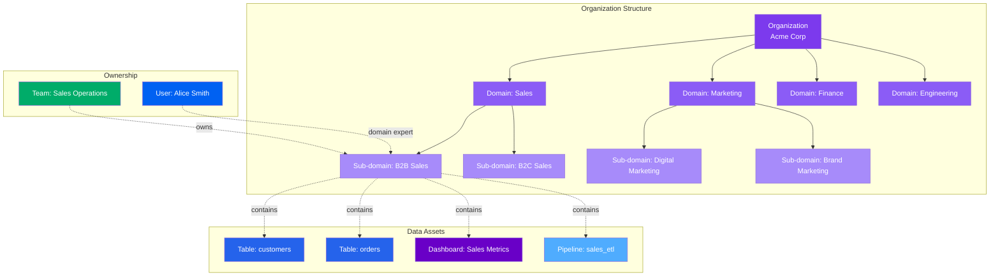
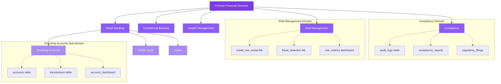
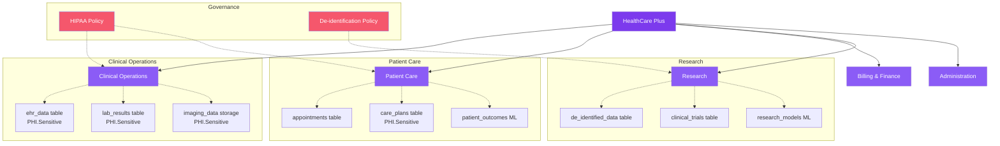
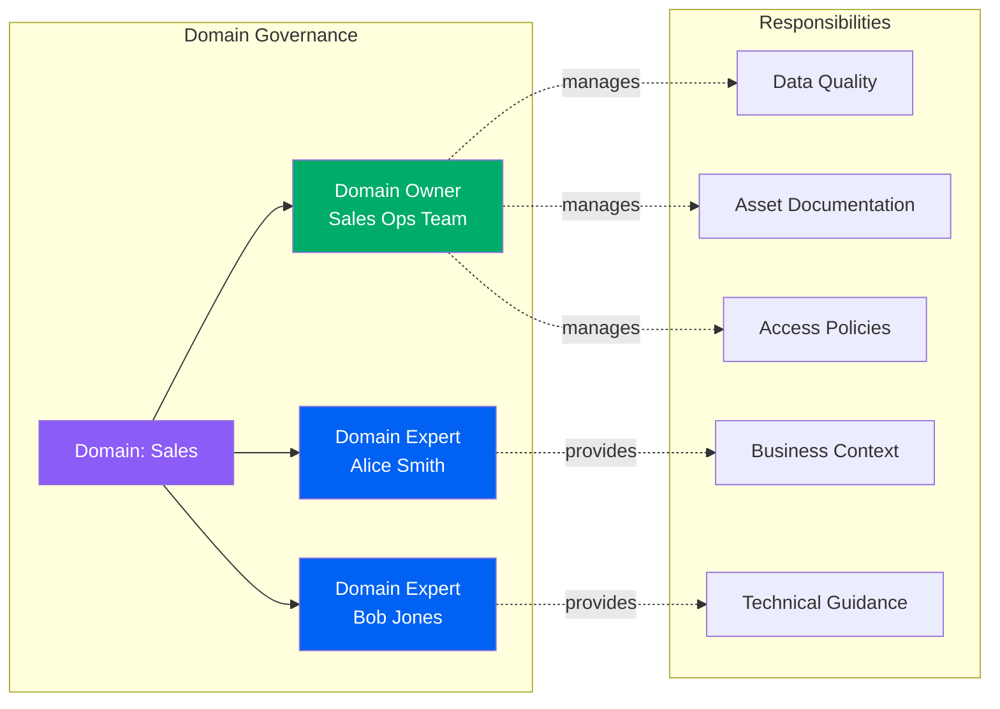

# Domains

**Organizing data assets by business domain and ownership**

Domains in OpenMetadata provide a framework for organizing data assets by business function, team ownership, and organizational structure. This domain-driven approach enables federated data governance, clear accountability, and scalable data management across large organizations.

---

## Hierarchy Overview

OpenMetadata's domain structure enables hierarchical organization of data assets aligned with business functions:



---

## Why Use Domains?

### Domain-Driven Data Organization

Domains enable you to organize your data assets by business function rather than technical structure. Instead of navigating through databases and tables, users can discover data through familiar business contexts like "Sales", "Marketing", or "Customer Service".

**Traditional Approach**:
```
postgres_prod
├── ecommerce
│   ├── customers
│   ├── orders
│   └── products
├── analytics
│   ├── sales_metrics
│   └── customer_360
└── staging
    └── raw_data
```

**Domain-Driven Approach**:
```
Sales Domain
├── customers table
├── orders table
├── sales_metrics dashboard
├── revenue_forecast ML model
└── sales_etl pipeline

Marketing Domain
├── campaigns table
├── leads table
├── conversion_metrics dashboard
└── campaign_performance pipeline
```

### Federated Data Governance

Domains enable federated governance where different teams own and manage their domain-specific data assets, while maintaining organization-wide standards and policies.

### Clear Accountability

Each domain has explicit owners and domain experts, creating clear accountability for data quality, documentation, and governance within that business area.

### Scalability

As organizations grow, domains provide a scalable way to organize thousands of data assets without creating overwhelming complexity.

---

## Domain Types

### Business Domains

**Purpose**: Align with business functions or departments

**Examples**:

- `Sales` - All sales-related data assets
- `Marketing` - Marketing campaigns, leads, analytics
- `Finance` - Financial reporting, accounting data
- `CustomerService` - Support tickets, customer interactions
- `HumanResources` - Employee data, payroll, recruiting

**When to use**: When organizing data by business function or department

---

### Product Domains

**Purpose**: Align with product lines or offerings

**Examples**:

- `ECommercePlatform` - Online shopping product data
- `MobileApp` - Mobile application analytics
- `B2BPortal` - Business customer portal data
- `PaymentServices` - Payment processing data

**When to use**: When your organization is product-centric

---

### Data Platform Domains

**Purpose**: Align with data platform capabilities

**Examples**:

- `DataWarehouse` - Analytical data warehouse assets
- `DataLake` - Raw data lake storage
- `StreamingPlatform` - Real-time streaming data
- `MachineLearning` - ML models and feature stores

**When to use**: For platform-focused data organization

---

### Geographical Domains

**Purpose**: Organize by geography or region

**Examples**:

- `NorthAmerica` - North American operations data
- `Europe` - European market data
- `AsiaPacific` - APAC region data

**When to use**: For multi-regional organizations with data residency requirements

---

## Real-World Examples

### Example 1: E-Commerce Company

```mermaid
graph TB
    ORG[Acme E-Commerce]

    D1[Sales Domain]
    D2[Marketing Domain]
    D3[Product Domain]
    D4[Operations Domain]

    ORG --> D1
    ORG --> D2
    ORG --> D3
    ORG --> D4

    subgraph "Sales Domain Assets"
        D1 -.-> A1[customers table]
        D1 -.-> A2[orders table]
        D1 -.-> A3[sales_metrics dashboard]
        D1 -.-> A4[revenue_etl pipeline]
    end

    subgraph "Marketing Domain Assets"
        D2 -.-> B1[campaigns table]
        D2 -.-> B2[leads table]
        D2 -.-> B3[attribution_model ML]
        D2 -.-> B4[marketing_dashboard]
    end

    subgraph "Product Domain Assets"
        D3 -.-> C1[catalog table]
        D3 -.-> C2[inventory table]
        D3 -.-> C3[recommendations ML]
    end

    subgraph "Operations Domain Assets"
        D4 -.-> D1A[warehouse table]
        D4 -.-> D2A[shipments table]
        D4 -.-> D3A[logistics_dashboard]
    end

    subgraph "Ownership"
        T1[Team: Sales Ops] -.-> D1
        T2[Team: Marketing Analytics] -.-> D2
        T3[Team: Product Management] -.-> D3
        T4[Team: Operations] -.-> D4
    end

    style ORG fill:#7C3AED,color:#fff
    style D1 fill:#8B5CF6,color:#fff
    style D2 fill:#8B5CF6,color:#fff
    style D3 fill:#8B5CF6,color:#fff
    style D4 fill:#8B5CF6,color:#fff
    style T1 fill:#00ac69,color:#fff
    style T2 fill:#00ac69,color:#fff
    style T3 fill:#00ac69,color:#fff
    style T4 fill:#00ac69,color:#fff
```



**Domain Structure**:

1. **Sales Domain** (Owner: Sales Operations Team)
   - Contains: Customer data, order transactions, revenue metrics
   - Assets: 15 tables, 5 dashboards, 8 pipelines
   - Domain experts: Sales analytics team

2. **Marketing Domain** (Owner: Marketing Analytics Team)
   - Contains: Campaign data, lead tracking, attribution models
   - Assets: 12 tables, 7 dashboards, 3 ML models
   - Domain experts: Marketing data scientists

3. **Product Domain** (Owner: Product Management Team)
   - Contains: Product catalog, inventory, recommendations
   - Assets: 10 tables, 2 ML models, 4 dashboards
   - Domain experts: Product analysts

4. **Operations Domain** (Owner: Operations Team)
   - Contains: Warehouse operations, logistics, fulfillment
   - Assets: 8 tables, 6 pipelines, 3 dashboards
   - Domain experts: Operations analytics

---

### Example 2: Financial Services Company



**Domain Organization**:

- **Top-level Domains**: Business lines (Retail, Commercial, Wealth Management)
- **Cross-functional Domains**: Risk and Compliance
- **Sub-domains**: Product-specific (Checking, Credit Cards, Loans)
- **Data Governance**: Domain-specific glossaries and policies
- **Compliance**: Domain-scoped access controls and audit trails

---

### Example 3: Healthcare Organization



**Compliance-Driven Domains**:

- **Sensitivity Classification**: PHI tags automatically applied at domain level
- **Access Control**: Domain-scoped policies enforce HIPAA compliance
- **Data Governance**: Domain-specific data stewards ensure regulatory compliance
- **De-identification**: Research domain uses de-identified data only
- **Audit Trails**: All access to clinical domains logged for compliance

---

## Benefits

### 1. Simplified Discovery

Users find data by business context, not technical location. Sales analysts browse the "Sales Domain" instead of searching through database schemas.

### 2. Clear Ownership

Each domain has designated owners and experts, eliminating confusion about who is responsible for data quality and governance.

### 3. Federated Governance

Domain owners manage governance within their area while maintaining organization-wide standards. This scales as organizations grow.

### 4. Contextual Understanding

Data assets within a domain share business context, making it easier to understand relationships and usage patterns.

### 5. Access Control

Domain-scoped permissions enable fine-grained access control based on business need-to-know.

### 6. Data Products

Domains naturally group related assets into data products that can be discovered, understood, and consumed as cohesive units.

### 7. Organizational Alignment

Domains mirror organizational structure, making data governance align with existing business processes.

### 8. Scalability

Hierarchical domain structure scales from small teams to enterprise organizations with thousands of assets.

---

## Domain Hierarchy Patterns

### Pattern 1: Business Function Hierarchy

```
Organization
├── Sales
│   ├── B2B Sales
│   │   ├── Enterprise
│   │   └── Mid-Market
│   └── B2C Sales
│       ├── Direct
│       └── Channel
├── Marketing
│   ├── Digital Marketing
│   ├── Brand Marketing
│   └── Partner Marketing
└── Finance
    ├── Accounting
    ├── FP&A
    └── Treasury
```

**Use case**: Aligning domains with organizational chart

---

### Pattern 2: Product-Centric Hierarchy

```
Organization
├── E-Commerce Platform
│   ├── Storefront
│   ├── Checkout
│   └── Recommendations
├── Mobile App
│   ├── iOS
│   └── Android
└── B2B Portal
    ├── Self-Service
    └── Managed Services
```

**Use case**: Product-focused organization

---

### Pattern 3: Geographic Hierarchy

```
Organization
├── North America
│   ├── United States
│   │   ├── East Region
│   │   └── West Region
│   └── Canada
├── Europe
│   ├── UK
│   └── EU
└── Asia Pacific
    ├── Japan
    └── Australia
```

**Use case**: Multi-regional organization with data residency requirements

---

### Pattern 4: Hybrid Hierarchy

```
Organization
├── Sales (Business Function)
│   ├── North America (Geography)
│   │   ├── B2B (Customer Segment)
│   │   └── B2C (Customer Segment)
│   └── Europe (Geography)
│       ├── B2B (Customer Segment)
│       └── B2C (Customer Segment)
└── Engineering (Business Function)
    ├── Data Platform (Product)
    └── ML Platform (Product)
```

**Use case**: Complex organizations with multiple organizing principles

---

## Common Patterns

### Pattern 1: Domain with Sub-domains

```
Domain: Sales
├── Owner: Sales Operations Team
├── Domain Experts: [alice.smith, bob.jones]
├── Sub-domains:
│   ├── B2B Sales
│   │   └── Owner: Enterprise Sales Team
│   └── B2C Sales
│       └── Owner: Consumer Sales Team
└── Data Products:
    ├── Customer 360
    └── Sales Analytics
```

Hierarchical organization with clear ownership at each level.

---

### Pattern 2: Cross-Functional Domain Assets

```
Domain: Customer Data
├── Owner: Customer Data Team
├── Assets from multiple sources:
│   ├── CRM Database (from Sales)
│   ├── Support Tickets (from Customer Service)
│   ├── Product Usage (from Engineering)
│   └── Marketing Campaigns (from Marketing)
└── Consumers:
    ├── Sales Team (customer insights)
    ├── Marketing Team (segmentation)
    └── Product Team (usage analytics)
```

Domain consolidates related assets from across the organization.

---

### Pattern 3: Data Product Domain

```
Domain: Customer 360
├── Type: Data Product
├── Owner: Customer Analytics Team
├── Components:
│   ├── customer_unified table (source of truth)
│   ├── customer_segmentation ML model
│   ├── customer_360_dashboard
│   └── customer_enrichment pipeline
└── SLA:
    ├── Freshness: < 1 hour
    ├── Quality: > 99.5%
    └── Availability: 99.9%
```

Domain represents a complete data product with SLA guarantees.

---

## Domain Governance

### Domain Ownership Model



**Roles**:

- **Domain Owner**: Accountable for all assets in domain
- **Domain Experts**: Provide subject matter expertise
- **Asset Owners**: Responsible for individual assets within domain

---

## Entity Specifications

Explore the complete domain entity specification:

| Entity | Description | Specification |
|--------|-------------|---------------|
| **Domain** | Business domain container for data assets | [View Spec](domain.md) |

The domain specification includes:
- Complete field reference
- JSON Schema definition
- RDF/OWL ontology representation
- JSON-LD context and examples
- Relationship mappings
- API operations

[**View Domain Entity Specification →**](domain.md){ .md-button }

---

## Best Practices

### 1. Align with Organization Structure

Create domains that match your organization's natural boundaries. If you have a Sales department, create a Sales domain.

### 2. Clear Ownership

Always assign explicit owners to domains. Avoid shared or ambiguous ownership.

### 3. Limit Hierarchy Depth

Keep domain hierarchy to 2-3 levels maximum. Deeper hierarchies become difficult to navigate.

### 4. Consistent Naming

Use consistent naming conventions across all domains (e.g., always use singular or always use plural).

### 5. Document Domain Scope

Clearly document what types of assets belong in each domain to avoid confusion.

### 6. Domain Experts

Assign domain experts who can provide business context and answer questions about domain assets.

### 7. Regular Reviews

Quarterly review domain structure to ensure it still aligns with organizational changes.

### 8. Start Simple

Begin with top-level domains aligned with major business functions. Add sub-domains as needed.

---

## Next Steps

1. **Explore Domain Entity** - See [complete domain specification](domain.md)
2. **Plan Domain Structure** - Map your organization's business functions to domains
3. **Assign Ownership** - Identify domain owners and experts for each domain
4. **Create Domains** - Use the API or UI to create your domain hierarchy
5. **Organize Assets** - Assign existing data assets to appropriate domains
6. **Define Governance** - Establish domain-specific governance policies
