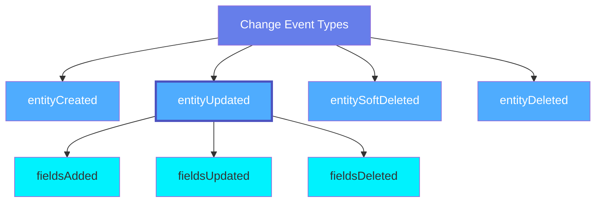
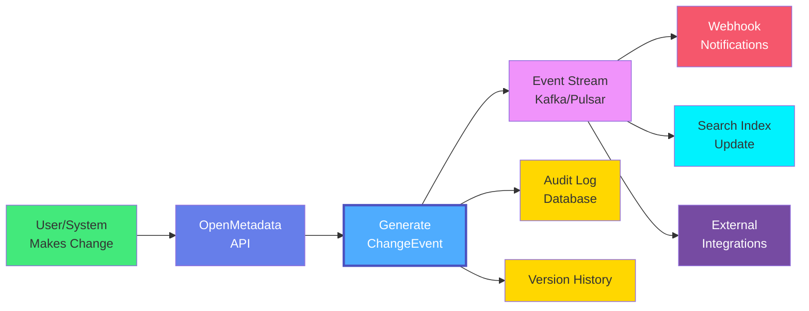

# Change Event

A **Change Event** captures metadata changes in OpenMetadata, providing a complete audit trail of all modifications to entities. Change events enable real-time notifications, audit logging, data lineage tracking, and integration with external systems through webhooks.

## Overview

Change Events in OpenMetadata provide:

- **Complete Audit Trail**: Track who changed what, when, and why
- **Real-time Notifications**: Trigger webhooks and alerts on metadata changes
- **Change History**: Maintain version history for all entities
- **Impact Analysis**: Understand downstream effects of schema changes
- **Compliance**: Demonstrate regulatory compliance through change tracking
- **Rollback Capability**: Restore previous entity versions when needed

Change events are generated for:
- Entity creation
- Entity updates (field additions, modifications, deletions)
- Entity soft deletion
- Entity hard deletion
- Tag assignments/removals
- Ownership changes
- Relationship modifications

## Event Types



**Click on any node to learn more about that event type.**

## Change Event Flow



## Schema Specifications

=== "JSON Schema"

    ```json
    {
      "$id": "https://open-metadata.org/schema/type/changeEvent.json",
      "$schema": "http://json-schema.org/draft-07/schema#",
      "title": "ChangeEvent",
      "description": "This schema defines the change event type to capture the changes to entities. Entities change due to user activity, such as updating description of a dataset, changing ownership, or adding new tags. Entity also changes due to activities at the metadata sources, such as a new dataset was created, a datasets was deleted, or schema of a dataset is modified. When state of entity changes, an event is produced. These events can be used to build apps and bots that respond to the change from activities.",
      "type": "object",
      "javaType": "org.openmetadata.schema.type.ChangeEvent",
      "properties": {
        "id": {
          "description": "Unique identifier for the event.",
          "$ref": "basic.json#/definitions/uuid"
        },
        "eventType": {
          "$ref": "./changeEventType.json"
        },
        "entityType": {
          "description": "Entity type that changed. Use the schema of this entity to process the entity attribute.",
          "type": "string"
        },
        "entityId": {
          "description": "Identifier of entity that was modified by the operation.",
          "$ref": "basic.json#/definitions/uuid"
        },
        "domains": {
          "description": "Domain the entity belongs to.",
          "type": "array",
          "items": {
            "$ref": "../type/basic.json#/definitions/uuid"
          },
          "default": null
        },
        "entityFullyQualifiedName": {
          "description": "Fully Qualified Name of entity that was modified by the operation.",
          "type": "string"
        },
        "previousVersion": {
          "description": "Version of the entity before this change. Note that not all changes result in entity version change. When entity version is not changed, `previousVersion` is same as `currentVersion`.",
          "$ref": "entityHistory.json#/definitions/entityVersion"
        },
        "currentVersion": {
          "description": "Current version of the entity after this change. Note that not all changes result in entity version change. When entity version is not changed, `previousVersion` is same as `currentVersion`.",
          "$ref": "entityHistory.json#/definitions/entityVersion"
        },
        "userName": {
          "description": "Name of the user whose activity resulted in the change.",
          "type": "string"
        },
        "impersonatedBy": {
          "description": "Bot user that performed the action on behalf of the actual user.",
          "$ref": "../type/basic.json#/definitions/impersonatedBy"
        },
        "timestamp": {
          "description": "Timestamp when the change was made in Unix epoch time milliseconds.",
          "$ref": "basic.json#/definitions/timestamp"
        },
        "changeDescription": {
          "description": "For `eventType` `entityUpdated` this field captures details about what fields were added/updated/deleted. For `eventType` `entityCreated` or `entityDeleted` this field is null.",
          "$ref": "entityHistory.json#/definitions/changeDescription"
        },
        "incrementalChangeDescription": {
          "description": "Change that lead to this version of the entity.",
          "$ref": "../type/entityHistory.json#/definitions/changeDescription"
        },
        "entity": {
          "description": "For `eventType` `entityCreated`, this field captures JSON coded string of the entity using the schema corresponding to `entityType`."
        }
      },
      "required": ["id", "eventType", "entityType", "entityId", "timestamp"],
      "additionalProperties": false
    }
    ```

=== "RDF (Turtle)"

    ```turtle
    @prefix om: <https://open-metadata.org/schema/> .
    @prefix om-type: <https://open-metadata.org/schema/type/> .
    @prefix om-event: <https://open-metadata.org/schema/type/changeEvent/> .
    @prefix rdf: <http://www.w3.org/1999/02/22-rdf-syntax-ns#> .
    @prefix rdfs: <http://www.w3.org/2000/01/rdf-schema#> .
    @prefix owl: <http://www.w3.org/2002/07/owl#> .
    @prefix xsd: <http://www.w3.org/2001/XMLSchema#> .
    @prefix dcterms: <http://purl.org/dc/terms/> .
    @prefix skos: <http://www.w3.org/2004/02/skos/core#> .
    @prefix prov: <http://www.w3.org/ns/prov#> .

    # Change Event Class Definition
    om-event:ChangeEvent a owl:Class ;
        rdfs:label "Change Event" ;
        rdfs:comment "This schema defines the change event type to capture the changes to entities" ;
        rdfs:subClassOf prov:Activity ;
        rdfs:isDefinedBy om: .

    # Event Type Class
    om-event:EventType a owl:Class ;
        rdfs:label "Event Type" ;
        rdfs:comment "Type of change event" ;
        rdfs:isDefinedBy om: .

    # Field Change Class
    om-event:FieldChange a owl:Class ;
        rdfs:label "Field Change" ;
        rdfs:comment "Change to a specific field" ;
        rdfs:isDefinedBy om: .

    # Change Description Class
    om-event:ChangeDescription a owl:Class ;
        rdfs:label "Change Description" ;
        rdfs:comment "Detailed description of changes" ;
        rdfs:isDefinedBy om: .

    # Properties
    om-event:id a owl:DatatypeProperty ;
        rdfs:label "id" ;
        rdfs:comment "Unique identifier for the event" ;
        rdfs:domain om-event:ChangeEvent ;
        rdfs:range xsd:string .

    om-event:eventType a owl:ObjectProperty ;
        rdfs:label "event type" ;
        rdfs:comment "Type of the change event" ;
        rdfs:domain om-event:ChangeEvent ;
        rdfs:range om-event:EventType .

    om-event:entityType a owl:DatatypeProperty ;
        rdfs:label "entity type" ;
        rdfs:comment "Entity type that changed. Use the schema of this entity to process the entity attribute" ;
        rdfs:domain om-event:ChangeEvent ;
        rdfs:range xsd:string .

    om-event:entityId a owl:DatatypeProperty ;
        rdfs:label "entity ID" ;
        rdfs:comment "Identifier of entity that was modified by the operation" ;
        rdfs:domain om-event:ChangeEvent ;
        rdfs:range xsd:string .

    om-event:domains a owl:DatatypeProperty ;
        rdfs:label "domains" ;
        rdfs:comment "Domain the entity belongs to" ;
        rdfs:domain om-event:ChangeEvent ;
        rdfs:range xsd:string .

    om-event:entityFullyQualifiedName a owl:DatatypeProperty ;
        rdfs:label "entity fully qualified name" ;
        rdfs:comment "Fully Qualified Name of entity that was modified by the operation" ;
        rdfs:domain om-event:ChangeEvent ;
        rdfs:range xsd:string .

    om-event:previousVersion a owl:DatatypeProperty ;
        rdfs:label "previous version" ;
        rdfs:comment "Version of the entity before this change. Note that not all changes result in entity version change" ;
        rdfs:domain om-event:ChangeEvent ;
        rdfs:range xsd:decimal .

    om-event:currentVersion a owl:DatatypeProperty ;
        rdfs:label "current version" ;
        rdfs:comment "Current version of the entity after this change. Note that not all changes result in entity version change" ;
        rdfs:domain om-event:ChangeEvent ;
        rdfs:range xsd:decimal .

    om-event:timestamp a owl:DatatypeProperty ;
        rdfs:label "timestamp" ;
        rdfs:comment "Timestamp when the change was made in Unix epoch time milliseconds" ;
        rdfs:domain om-event:ChangeEvent ;
        rdfs:range xsd:integer .

    om-event:userName a owl:DatatypeProperty ;
        rdfs:label "user name" ;
        rdfs:comment "Name of the user whose activity resulted in the change" ;
        rdfs:domain om-event:ChangeEvent ;
        rdfs:range xsd:string .

    om-event:impersonatedBy a owl:DatatypeProperty ;
        rdfs:label "impersonated by" ;
        rdfs:comment "Bot user that performed the action on behalf of the actual user" ;
        rdfs:domain om-event:ChangeEvent ;
        rdfs:range xsd:string .

    om-event:hasChangeDescription a owl:ObjectProperty ;
        rdfs:label "has change description" ;
        rdfs:comment "For eventType entityUpdated this field captures details about what fields were added/updated/deleted" ;
        rdfs:domain om-event:ChangeEvent ;
        rdfs:range om-event:ChangeDescription .

    om-event:hasIncrementalChangeDescription a owl:ObjectProperty ;
        rdfs:label "has incremental change description" ;
        rdfs:comment "Change that lead to this version of the entity" ;
        rdfs:domain om-event:ChangeEvent ;
        rdfs:range om-event:ChangeDescription .

    om-event:affectsEntity a owl:ObjectProperty ;
        rdfs:label "affects entity" ;
        rdfs:comment "Entity affected by this change" ;
        rdfs:domain om-event:ChangeEvent ;
        rdfs:subPropertyOf prov:used .

    om-event:performedBy a owl:ObjectProperty ;
        rdfs:label "performed by" ;
        rdfs:comment "User who performed the change" ;
        rdfs:domain om-event:ChangeEvent ;
        rdfs:subPropertyOf prov:wasAssociatedWith .

    om-event:fieldName a owl:DatatypeProperty ;
        rdfs:label "field name" ;
        rdfs:comment "Name of the field that changed" ;
        rdfs:domain om-event:FieldChange ;
        rdfs:range xsd:string .

    om-event:oldValue a owl:DatatypeProperty ;
        rdfs:label "old value" ;
        rdfs:comment "Previous value of the field" ;
        rdfs:domain om-event:FieldChange .

    om-event:newValue a owl:DatatypeProperty ;
        rdfs:label "new value" ;
        rdfs:comment "New value of the field" ;
        rdfs:domain om-event:FieldChange .

    om-event:fieldsAdded a owl:ObjectProperty ;
        rdfs:label "fields added" ;
        rdfs:comment "Fields that were added" ;
        rdfs:domain om-event:ChangeDescription ;
        rdfs:range om-event:FieldChange .

    om-event:fieldsUpdated a owl:ObjectProperty ;
        rdfs:label "fields updated" ;
        rdfs:comment "Fields that were updated" ;
        rdfs:domain om-event:ChangeDescription ;
        rdfs:range om-event:FieldChange .

    om-event:fieldsDeleted a owl:ObjectProperty ;
        rdfs:label "fields deleted" ;
        rdfs:comment "Fields that were deleted" ;
        rdfs:domain om-event:ChangeDescription ;
        rdfs:range om-event:FieldChange .

    # Event Type Individuals
    om-event:EntityCreated a om-event:EventType ;
        rdfs:label "Entity Created" ;
        skos:definition "A new entity was created" .

    om-event:EntityUpdated a om-event:EventType ;
        rdfs:label "Entity Updated" ;
        skos:definition "An existing entity was updated" .

    om-event:EntitySoftDeleted a om-event:EventType ;
        rdfs:label "Entity Soft Deleted" ;
        skos:definition "An entity was soft deleted (marked as deleted)" .

    om-event:EntityDeleted a om-event:EventType ;
        rdfs:label "Entity Deleted" ;
        skos:definition "An entity was permanently deleted" .
    ```

=== "JSON-LD Context"

    ```json
    {
      "@context": {
        "@vocab": "https://open-metadata.org/schema/type/changeEvent/",
        "rdf": "http://www.w3.org/1999/02/22-rdf-syntax-ns#",
        "rdfs": "http://www.w3.org/2000/01/rdf-schema#",
        "owl": "http://www.w3.org/2002/07/owl#",
        "xsd": "http://www.w3.org/2001/XMLSchema#",
        "dcterms": "http://purl.org/dc/terms/",
        "skos": "http://www.w3.org/2004/02/skos/core#",
        "prov": "http://www.w3.org/ns/prov#",
        "om": "https://open-metadata.org/schema/",

        "ChangeEvent": {
          "@id": "om:ChangeEvent",
          "@type": "@id"
        },
        "id": {
          "@id": "om:id",
          "@type": "xsd:string"
        },
        "eventType": {
          "@id": "om:eventType",
          "@type": "@id"
        },
        "entityType": {
          "@id": "om:entityType",
          "@type": "xsd:string"
        },
        "entityId": {
          "@id": "om:entityId",
          "@type": "xsd:string"
        },
        "domains": {
          "@id": "om:domains",
          "@type": "xsd:string"
        },
        "entityFullyQualifiedName": {
          "@id": "om:entityFullyQualifiedName",
          "@type": "xsd:string"
        },
        "previousVersion": {
          "@id": "om:previousVersion",
          "@type": "xsd:decimal"
        },
        "currentVersion": {
          "@id": "om:currentVersion",
          "@type": "xsd:decimal"
        },
        "timestamp": {
          "@id": "om:timestamp",
          "@type": "xsd:integer"
        },
        "userName": {
          "@id": "om:userName",
          "@type": "xsd:string"
        },
        "impersonatedBy": {
          "@id": "om:impersonatedBy",
          "@type": "xsd:string"
        },
        "changeDescription": {
          "@id": "om:hasChangeDescription",
          "@type": "@id"
        },
        "incrementalChangeDescription": {
          "@id": "om:hasIncrementalChangeDescription",
          "@type": "@id"
        },
        "affectsEntity": {
          "@id": "om:affectsEntity",
          "@type": "@id"
        },
        "performedBy": {
          "@id": "prov:wasAssociatedWith",
          "@type": "@id"
        },
        "entity": {
          "@id": "om:entity"
        }
      }
    }
    ```

## Change Event Examples

### Entity Created Event

```json
{
  "id": "abc12345-e89b-12d3-a456-426614174999",
  "eventType": "entityCreated",
  "entityType": "table",
  "entityId": "123e4567-e89b-12d3-a456-426614174000",
  "entityFullyQualifiedName": "snowflake_prod.sales.public.customers",
  "previousVersion": null,
  "currentVersion": 0.1,
  "userName": "john.doe",
  "timestamp": 1705320000000,
  "changeDescription": {
    "fieldsAdded": [
      {
        "name": "name",
        "newValue": "customers"
      },
      {
        "name": "columns",
        "newValue": [
          {
            "name": "customer_id",
            "dataType": "BIGINT"
          },
          {
            "name": "email",
            "dataType": "VARCHAR"
          }
        ]
      }
    ],
    "fieldsUpdated": [],
    "fieldsDeleted": []
  },
  "entity": {
    "id": "123e4567-e89b-12d3-a456-426614174000",
    "name": "customers",
    "fullyQualifiedName": "snowflake_prod.sales.public.customers",
    "columns": [
      {
        "name": "customer_id",
        "dataType": "BIGINT"
      },
      {
        "name": "email",
        "dataType": "VARCHAR"
      }
    ]
  }
}
```

### Entity Updated Event - Description Change

```json
{
  "id": "def67890-e89b-12d3-a456-426614174998",
  "eventType": "entityUpdated",
  "entityType": "table",
  "entityId": "123e4567-e89b-12d3-a456-426614174000",
  "entityFullyQualifiedName": "snowflake_prod.sales.public.customers",
  "previousVersion": 0.1,
  "currentVersion": 0.2,
  "userName": "jane.smith",
  "timestamp": 1705406400000,
  "changeDescription": {
    "fieldsAdded": [],
    "fieldsUpdated": [
      {
        "name": "description",
        "oldValue": null,
        "newValue": "Customer master table containing all active customers"
      }
    ],
    "fieldsDeleted": [],
    "previousVersion": 0.1
  }
}
```

### Entity Updated Event - Tag Assignment

```json
{
  "id": "ghi23456-e89b-12d3-a456-426614174997",
  "eventType": "entityUpdated",
  "entityType": "table",
  "entityId": "123e4567-e89b-12d3-a456-426614174000",
  "entityFullyQualifiedName": "snowflake_prod.sales.public.customers",
  "previousVersion": 0.2,
  "currentVersion": 0.3,
  "userName": "compliance.officer",
  "timestamp": 1705492800000,
  "changeDescription": {
    "fieldsAdded": [
      {
        "name": "tags",
        "newValue": [
          {
            "tagFQN": "PII.Sensitive",
            "source": "Classification"
          }
        ]
      }
    ],
    "fieldsUpdated": [],
    "fieldsDeleted": [],
    "previousVersion": 0.2
  }
}
```

### Entity Updated Event - Column Added

```json
{
  "id": "jkl34567-e89b-12d3-a456-426614174996",
  "eventType": "entityUpdated",
  "entityType": "table",
  "entityId": "123e4567-e89b-12d3-a456-426614174000",
  "entityFullyQualifiedName": "snowflake_prod.sales.public.customers",
  "previousVersion": 0.3,
  "currentVersion": 0.4,
  "userName": "system",
  "timestamp": 1705579200000,
  "changeDescription": {
    "fieldsAdded": [
      {
        "name": "columns",
        "newValue": {
          "name": "phone_number",
          "dataType": "VARCHAR",
          "dataLength": 20
        }
      }
    ],
    "fieldsUpdated": [],
    "fieldsDeleted": [],
    "previousVersion": 0.3
  }
}
```

### Entity Updated Event - Ownership Change

```json
{
  "id": "mno45678-e89b-12d3-a456-426614174995",
  "eventType": "entityUpdated",
  "entityType": "table",
  "entityId": "123e4567-e89b-12d3-a456-426614174000",
  "entityFullyQualifiedName": "snowflake_prod.sales.public.customers",
  "previousVersion": 0.4,
  "currentVersion": 0.5,
  "userName": "admin",
  "timestamp": 1705665600000,
  "changeDescription": {
    "fieldsAdded": [],
    "fieldsUpdated": [
      {
        "name": "owner",
        "oldValue": {
          "type": "user",
          "name": "john.doe"
        },
        "newValue": {
          "type": "team",
          "name": "DataEngineering"
        }
      }
    ],
    "fieldsDeleted": [],
    "previousVersion": 0.4
  }
}
```

### Entity Soft Deleted Event

```json
{
  "id": "pqr56789-e89b-12d3-a456-426614174994",
  "eventType": "entitySoftDeleted",
  "entityType": "table",
  "entityId": "123e4567-e89b-12d3-a456-426614174000",
  "entityFullyQualifiedName": "snowflake_prod.sales.public.customers",
  "previousVersion": 0.5,
  "currentVersion": 0.6,
  "userName": "admin",
  "timestamp": 1705752000000,
  "changeDescription": {
    "fieldsAdded": [],
    "fieldsUpdated": [
      {
        "name": "deleted",
        "oldValue": false,
        "newValue": true
      }
    ],
    "fieldsDeleted": [],
    "previousVersion": 0.5
  }
}
```

### Entity Deleted Event

```json
{
  "id": "stu67890-e89b-12d3-a456-426614174993",
  "eventType": "entityDeleted",
  "entityType": "table",
  "entityId": "123e4567-e89b-12d3-a456-426614174000",
  "entityFullyQualifiedName": "snowflake_prod.sales.public.customers",
  "previousVersion": 0.6,
  "currentVersion": null,
  "userName": "admin",
  "timestamp": 1705838400000,
  "changeDescription": {
    "fieldsAdded": [],
    "fieldsUpdated": [],
    "fieldsDeleted": [
      {
        "name": "entity",
        "oldValue": "<entire entity object>"
      }
    ],
    "previousVersion": 0.6
  }
}
```

## Event Generation Process

### 1. Change Detection

When an API call modifies an entity:

```java
// Simplified pseudocode
public Entity updateEntity(Entity oldEntity, Entity newEntity) {
    // Compare old and new versions
    ChangeDescription changes = compareEntities(oldEntity, newEntity);

    // Increment version
    newEntity.setVersion(oldEntity.getVersion() + 0.1);

    // Generate change event
    ChangeEvent event = new ChangeEvent()
        .withEventType(EventType.ENTITY_UPDATED)
        .withEntityType(newEntity.getType())
        .withEntityId(newEntity.getId())
        .withPreviousVersion(oldEntity.getVersion())
        .withCurrentVersion(newEntity.getVersion())
        .withChangeDescription(changes)
        .withTimestamp(System.currentTimeMillis())
        .withUserName(getCurrentUser().getName())
        .withEntity(newEntity);

    // Publish event
    eventPublisher.publish(event);

    return newEntity;
}
```

### 2. Change Comparison

The system compares old and new entity versions:

```java
ChangeDescription compareEntities(Entity old, Entity new) {
    ChangeDescription changes = new ChangeDescription();

    // Compare each field
    for (Field field : getAllFields(new)) {
        Object oldValue = getFieldValue(old, field);
        Object newValue = getFieldValue(new, field);

        if (oldValue == null && newValue != null) {
            changes.addFieldAdded(field.getName(), newValue);
        } else if (oldValue != null && newValue == null) {
            changes.addFieldDeleted(field.getName(), oldValue);
        } else if (!equals(oldValue, newValue)) {
            changes.addFieldUpdated(field.getName(), oldValue, newValue);
        }
    }

    return changes;
}
```

### 3. Event Publishing

Events are published to message brokers:

```java
public void publish(ChangeEvent event) {
    // Serialize event to JSON
    String json = toJson(event);

    // Publish to Kafka/Pulsar topic
    producer.send("metadata-change-events", json);

    // Store in audit log
    auditLog.save(event);

    // Update search index
    searchIndexer.update(event);

    // Trigger webhooks
    webhookManager.trigger(event);
}
```

## Event Consumption

### Webhook Integration

Webhooks receive change events in real-time:

```http
POST https://your-endpoint.com/webhook
Content-Type: application/json
X-OpenMetadata-Signature: sha256=abc123...

{
  "eventType": "entityUpdated",
  "entityType": "table",
  "entityId": "123e4567-e89b-12d3-a456-426614174000",
  "timestamp": 1705320000000,
  "changeDescription": {
    "fieldsUpdated": [
      {
        "name": "tags",
        "oldValue": [],
        "newValue": [{"tagFQN": "PII.Sensitive"}]
      }
    ]
  }
}
```

### Kafka/Pulsar Consumer

External systems can consume from the event stream:

```python
from kafka import KafkaConsumer
import json

consumer = KafkaConsumer(
    'metadata-change-events',
    bootstrap_servers=['localhost:9092'],
    value_deserializer=lambda m: json.loads(m.decode('utf-8'))
)

for message in consumer:
    event = message.value

    if event['eventType'] == 'entityUpdated':
        handle_update(event)
    elif event['eventType'] == 'entityCreated':
        handle_creation(event)
    elif event['eventType'] == 'entityDeleted':
        handle_deletion(event)
```

## Use Cases

### 1. Audit Trail and Compliance

Track all changes for regulatory compliance:

```sql
SELECT
    entityFullyQualifiedName,
    userName,
    timestamp,
    changeDescription
FROM change_events
WHERE entityType = 'table'
  AND timestamp > '2024-01-01'
ORDER BY timestamp DESC;
```

### 2. Real-time Notifications

Send Slack notifications for critical changes:

```javascript
if (event.eventType === 'entityUpdated' &&
    event.changeDescription.fieldsDeleted.length > 0) {
    slack.notify({
        channel: '#data-alerts',
        message: `⚠️ Column deleted from ${event.entityFullyQualifiedName} by ${event.userName}`
    });
}
```

### 3. Impact Analysis

Understand downstream effects:

```javascript
async function analyzeImpact(changeEvent) {
    if (changeEvent.eventType === 'entityUpdated') {
        const downstream = await getDownstreamAssets(
            changeEvent.entityId
        );

        return {
            affectedDashboards: downstream.dashboards,
            affectedPipelines: downstream.pipelines,
            affectedModels: downstream.mlModels
        };
    }
}
```

### 4. Data Lineage Tracking

Build lineage graphs from change events:

```javascript
function updateLineage(changeEvent) {
    if (changeEvent.changeDescription.fieldsAdded) {
        changeEvent.changeDescription.fieldsAdded.forEach(field => {
            if (field.name === 'lineage') {
                addLineageEdge(field.newValue);
            }
        });
    }
}
```

### 5. Rollback Capability

Restore previous versions using change history:

```javascript
async function rollbackToVersion(entityId, targetVersion) {
    const events = await getChangeEvents(entityId);
    const entity = reconstructEntityAtVersion(events, targetVersion);
    return updateEntity(entity);
}
```

## Event Retention

Change events can be retained for different durations:

| Event Type | Default Retention | Use Case |
|------------|------------------|----------|
| **entityCreated** | Indefinite | Audit trail |
| **entityUpdated** | 90 days to indefinite | Compliance, rollback |
| **entitySoftDeleted** | 30 days | Recovery period |
| **entityDeleted** | 7 days | Compliance verification |

## Best Practices

### 1. Filter Events Efficiently
Subscribe only to events you need:

```javascript
const filter = {
    eventTypes: ['entityUpdated', 'entityDeleted'],
    entityTypes: ['table', 'dashboard'],
    includeFields: ['tags', 'owner']
};
```

### 2. Handle Idempotency
Use event IDs to avoid duplicate processing:

```javascript
const processedEvents = new Set();

function handleEvent(event) {
    const eventId = `${event.entityId}:${event.currentVersion}`;

    if (processedEvents.has(eventId)) {
        return; // Already processed
    }

    // Process event
    processEvent(event);
    processedEvents.add(eventId);
}
```

### 3. Monitor Event Lag
Track consumption lag for event streams:

```javascript
const lag = consumerGroup.lag('metadata-change-events');
if (lag > 10000) {
    alert('High event processing lag detected');
}
```

### 4. Batch Event Processing
Process events in batches for efficiency:

```javascript
async function processBatch(events) {
    const grouped = groupBy(events, 'entityType');

    for (const [type, typeEvents] of Object.entries(grouped)) {
        await bulkProcess(type, typeEvents);
    }
}
```

## Related Entities

- **[Webhook](../operations/webhook.md)**: Delivers change events to external systems
- **[Alert](../data-quality/alert.md)**: Triggers alerts based on change events
- **[User](../teams-users/user.md)**: Users who generate change events
- **[AuditLog](../governance/audit-log.md)**: Stores complete audit trail
- **All Entities**: Every entity generates change events
