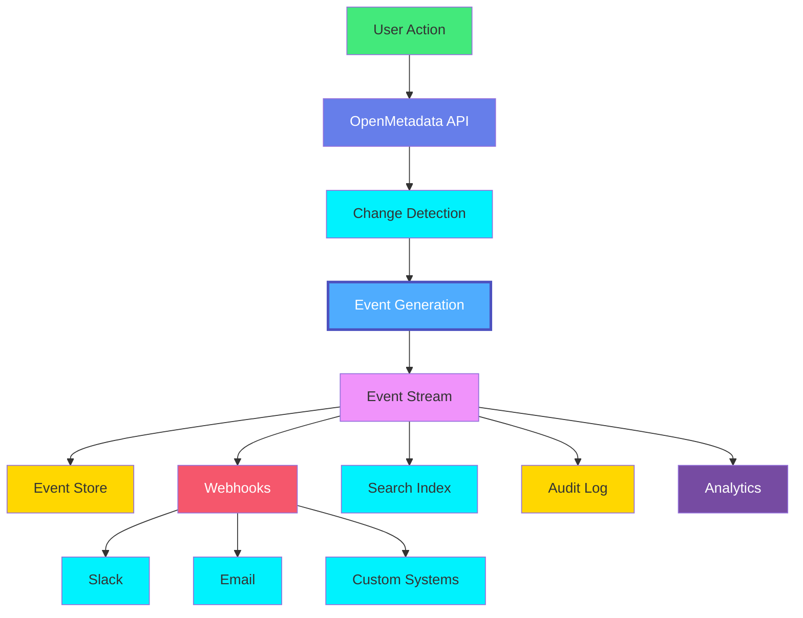
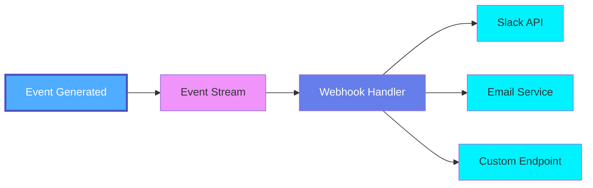
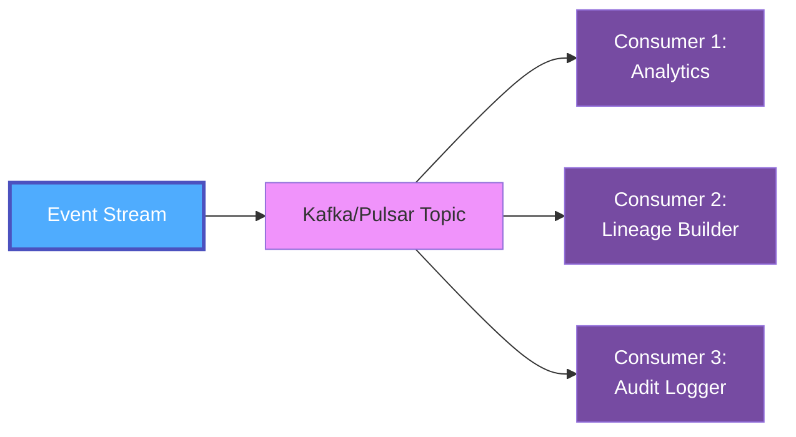
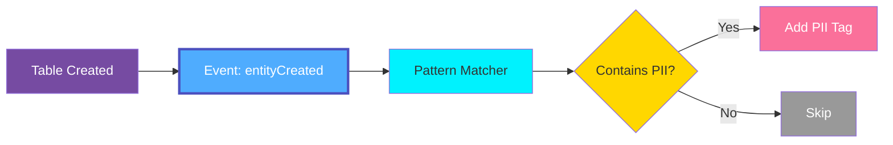
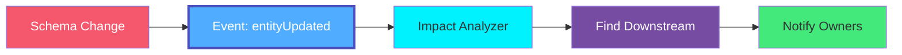
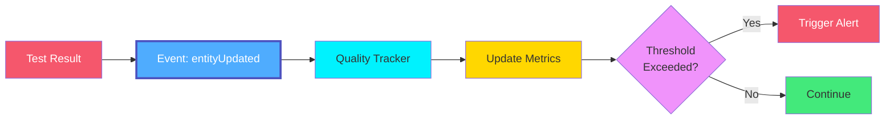

# Events Overview

**Events** in OpenMetadata represent changes and activities that occur within the metadata platform. The event system provides a complete audit trail, enables real-time notifications, and powers integrations with external systems.

## What are Events?

Events capture every change to metadata entities:

- **Entity Lifecycle**: Creation, updates, and deletion of entities
- **Metadata Changes**: Modifications to properties, tags, descriptions
- **Relationship Changes**: Ownership, domain, glossary term assignments
- **Schema Evolution**: Column additions, deletions, type changes
- **Access Events**: Permission changes, policy updates
- **Quality Events**: Test results, profiling outcomes

## Event System Architecture



## Event Types

### Entity Lifecycle Events

#### entityCreated
Fired when a new entity is created:
```json
{
  "eventType": "entityCreated",
  "entityType": "table",
  "entityId": "uuid",
  "timestamp": 1705320000000
}
```

#### entityUpdated
Fired when an entity is modified:
```json
{
  "eventType": "entityUpdated",
  "entityType": "table",
  "changeDescription": {
    "fieldsUpdated": [
      {
        "name": "description",
        "oldValue": null,
        "newValue": "Customer master table"
      }
    ]
  }
}
```

#### entitySoftDeleted
Fired when an entity is soft deleted:
```json
{
  "eventType": "entitySoftDeleted",
  "entityType": "table",
  "deleted": true
}
```

#### entityDeleted
Fired when an entity is permanently deleted:
```json
{
  "eventType": "entityDeleted",
  "entityType": "table"
}
```

### Change Categories

Events track different types of changes:

```mermaid
graph TB
    A[Change Events] --> B1[Schema Changes]
    A --> B2[Metadata Changes]
    A --> B3[Relationship Changes]
    A --> B4[Access Changes]

    B1 --> C1[Columns Added]
    B1 --> C2[Columns Deleted]
    B1 --> C3[Type Changes]

    B2 --> D1[Description Updates]
    B2 --> D2[Tag Assignments]
    B2 --> D3[Custom Properties]

    B3 --> E1[Ownership Changes]
    B3 --> E2[Domain Assignment]
    B3 --> E3[Lineage Updates]

    B4 --> F1[Permission Changes]
    B4 --> F2[Policy Updates]
    B4 --> F3[Access Grants]

    style A fill:#4facfe,color:#fff,stroke:#4c51bf,stroke-width:3px
    style B1 fill:#f5576c,color:#fff
    style B2 fill:#00f2fe,color:#333
    style B3 fill:#43e97b,color:#333
    style B4 fill:#fa709a,color:#fff
    style C1 fill:#ffd700,color:#333
    style C2 fill:#ffd700,color:#333
    style C3 fill:#ffd700,color:#333
    style D1 fill:#ffd700,color:#333
    style D2 fill:#ffd700,color:#333
    style D3 fill:#ffd700,color:#333
    style E1 fill:#ffd700,color:#333
    style E2 fill:#ffd700,color:#333
    style E3 fill:#ffd700,color:#333
    style F1 fill:#ffd700,color:#333
    style F2 fill:#ffd700,color:#333
    style F3 fill:#ffd700,color:#333
```



## Event Schema

Every event contains:

```json
{
  "eventId": "unique-event-id",
  "eventType": "entityUpdated",
  "entityType": "table",
  "entityId": "uuid",
  "entityFullyQualifiedName": "db.schema.table",
  "userName": "user@company.com",
  "userId": "user-uuid",
  "timestamp": 1705320000000,
  "previousVersion": 0.1,
  "currentVersion": 0.2,
  "changeDescription": {
    "fieldsAdded": [],
    "fieldsUpdated": [...],
    "fieldsDeleted": []
  },
  "entity": { /* current entity state */ }
}
```

## Use Cases

### Real-time Notifications
Notify teams immediately when critical changes occur:

- **Schema Changes**: Alert when production tables change
- **Tag Updates**: Notify when PII data is classified
- **Ownership Changes**: Alert teams about responsibility changes
- **Quality Issues**: Immediate notification of test failures
- **Policy Violations**: Alert on compliance breaches

### Audit Trail & Compliance
Maintain complete history of all changes:

- Track who changed what and when
- Demonstrate regulatory compliance (GDPR, HIPAA, SOC2)
- Investigate incidents and issues
- Support data governance workflows
- Enable rollback capabilities

### Data Lineage
Build comprehensive lineage from events:

- Track data transformations
- Map dependencies
- Understand impact of changes
- Validate data accuracy
- Support impact analysis

### Analytics & Insights
Analyze metadata usage patterns:

- Popular tables and queries
- Team activity patterns
- Change velocity metrics
- Quality trend analysis
- Adoption metrics

### Integration & Automation
Power external systems and workflows:

- Sync with ITSM tools (ServiceNow, Jira)
- Trigger CI/CD pipelines
- Update data catalogs
- Feed dashboards and reports
- Enable workflow automation

## Event Consumption Patterns

### Push Model (Webhooks)
Real-time event delivery to HTTP endpoints:



### Pull Model (Event API)
Query historical events:

```http
GET /api/v1/events?entityType=table&eventType=entityUpdated&startDate=2024-01-01
```

### Stream Processing
Consume events from message brokers:



## Event Filtering

Filter events by various criteria:

### By Event Type
```json
{
  "eventTypes": ["entityCreated", "entityDeleted"]
}
```

### By Entity Type
```json
{
  "entityTypes": ["table", "dashboard"]
}
```

### By Entity
```json
{
  "entities": ["db.schema.customers", "db.schema.orders"]
}
```

### By Change Type
```json
{
  "includeFields": ["tags", "owner", "description"]
}
```

### By Domain
```json
{
  "domains": ["CustomerData", "Finance"]
}
```

## Event Retention

Events are retained according to policies:

| Event Type | Default Retention | Use Case |
|------------|------------------|----------|
| **entityCreated** | Indefinite | Audit trail |
| **entityUpdated** | 90 days - 1 year | Version history |
| **entitySoftDeleted** | 30 days | Recovery window |
| **entityDeleted** | 7 days | Compliance verification |

## Best Practices

### 1. Filter Events Strategically
Subscribe only to relevant events to avoid noise:
```json
{
  "eventTypes": ["entityUpdated"],
  "entityTypes": ["table"],
  "includeFields": ["schema", "columns"]
}
```

### 2. Handle Idempotency
Use event IDs to avoid duplicate processing:
```javascript
if (processedEvents.has(event.eventId)) {
  return; // Already processed
}
```

### 3. Implement Retry Logic
Handle transient failures gracefully:
```javascript
async function processEvent(event, maxRetries = 3) {
  for (let i = 0; i < maxRetries; i++) {
    try {
      await handleEvent(event);
      return;
    } catch (error) {
      if (i === maxRetries - 1) throw error;
      await sleep(Math.pow(2, i) * 1000);
    }
  }
}
```

### 4. Monitor Event Lag
Track consumption lag to ensure timely processing:
```javascript
const lag = currentTime - event.timestamp;
if (lag > threshold) {
  alert('High event processing lag detected');
}
```

### 5. Batch Processing
Process events in batches for efficiency:
```javascript
async function processBatch(events) {
  const grouped = groupBy(events, 'entityType');
  for (const [type, batch] of Object.entries(grouped)) {
    await bulkProcess(type, batch);
  }
}
```

### 6. Dead Letter Queues
Handle failed events appropriately:
```javascript
try {
  await processEvent(event);
} catch (error) {
  await deadLetterQueue.send(event);
  await notifyOperations(error);
}
```

### 7. Event Versioning
Support schema evolution:
```javascript
function handleEvent(event) {
  const handler = eventHandlers[event.version] || defaultHandler;
  return handler(event);
}
```

## Event-Driven Workflows

### Automated Tagging
Auto-tag entities based on patterns:



### Change Notification
Notify stakeholders of changes:



### Quality Monitoring
Track quality trends:



## Related Entities

- **[Change Event](./change-event.md)**: Detailed specification for change events
- **[Webhook](../operations/webhook.md)**: Event delivery via webhooks
- **[Alert](../data-quality/alert.md)**: Alerts triggered by events
- **[Audit Log](../governance/audit-log.md)**: Persistent audit trail
- **All Entities**: Every entity generates change events

## Next Steps

- **[Change Event Entity](./change-event.md)**: Detailed specification for change events
- **[Webhook Configuration](../operations/webhook.md)**: Set up event notifications
- **[Operations Overview](../operations/overview.md)**: Understanding operational workflows
