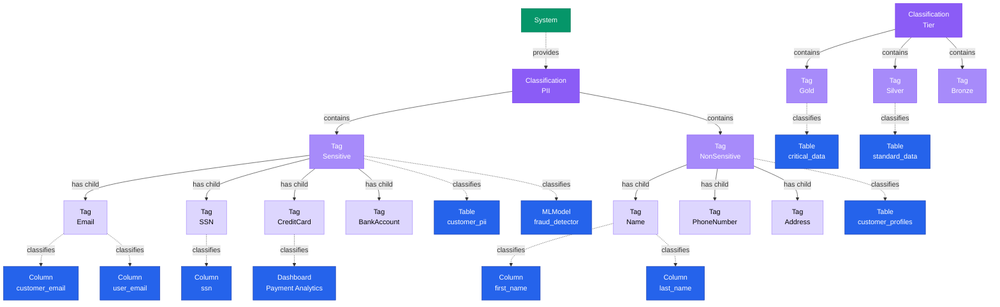

# Classification

**Hierarchical taxonomies for data governance - organizing tags into meaningful categories**

---

## Overview

The **Classification** entity contains hierarchical terms called tags used for categorizing and classifying data assets and other entities. Classifications enable structured governance through categories like PII, Compliance, Data Quality, and Tier. Each classification contains a hierarchy of tags.

## Relationship Diagram



---

## Schema Specifications

View the complete Classification schema in your preferred format:

=== "JSON Schema"

    **Complete JSON Schema Definition**

    ```json
    {
      "$id": "https://open-metadata.org/schema/entity/classification/classification.json",
      "$schema": "http://json-schema.org/draft-07/schema#",
      "title": "Classification",
      "$comment": "@om-entity-type",
      "description": "A `Classification` entity contains hierarchical terms called tags used for categorizing and classifying data assets and other entities.",
      "type": "object",
      "javaType": "org.openmetadata.schema.entity.classification.Classification",
      "javaInterfaces": ["org.openmetadata.schema.EntityInterface"],

      "properties": {
        "id": {
          "description": "Unique identifier of this entity instance.",
          "$ref": "../../type/basic.json#/definitions/uuid"
        },
        "name": {
          "$ref": "../../type/basic.json#/definitions/entityName"
        },
        "fullyQualifiedName": {
          "description": "FullyQualifiedName same as `name`.",
          "$ref": "../../type/basic.json#/definitions/fullyQualifiedEntityName"
        },
        "displayName": {
          "description": "Display Name that identifies this entity.",
          "type": "string"
        },
        "description": {
          "description": "Description of the classification.",
          "$ref": "../../type/basic.json#/definitions/markdown"
        },
        "version": {
          "description": "Metadata version of the entity.",
          "$ref": "../../type/entityHistory.json#/definitions/entityVersion"
        },
        "termCount": {
          "description": "Total number of children tag terms under this classification. This includes all the children in the hierarchy.",
          "type": "integer",
          "minimum": 0
        },
        "updatedAt": {
          "description": "Last update time corresponding to the new version of the entity in Unix epoch time milliseconds.",
          "$ref": "../../type/basic.json#/definitions/timestamp"
        },
        "updatedBy": {
          "description": "User who made the update.",
          "type": "string"
        },
        "impersonatedBy": {
          "description": "Bot user that performed the action on behalf of the actual user.",
          "$ref": "../../type/basic.json#/definitions/impersonatedBy"
        },
        "href": {
          "description": "Link to the resource corresponding to the classification.",
          "$ref": "../../type/basic.json#/definitions/href"
        },
        "usageCount": {
          "description": "Count of how many times the tags from this classification are used.",
          "type": "integer"
        },
        "changeDescription": {
          "description": "Change that lead to this version of the entity.",
          "$ref": "../../type/entityHistory.json#/definitions/changeDescription"
        },
        "incrementalChangeDescription": {
          "description": "Change that lead to this version of the entity.",
          "$ref": "../../type/entityHistory.json#/definitions/changeDescription"
        },
        "deleted": {
          "description": "When `true` indicates the entity has been soft deleted.",
          "type": "boolean",
          "default": false
        },
        "provider": {
          "$ref": "../../type/basic.json#/definitions/providerType"
        },
        "disabled": {
          "description": "System classifications can't be deleted. Use this flag to disable them.",
          "type": "boolean",
          "default": false
        },
        "mutuallyExclusive": {
          "description": "Tags under this classification are mutually exclusive. When mutually exclusive is `true` the tags from this classification are used to **classify** an entity. An entity can only be in one class - example, it can only be either `tier1` or `tier2` and not both. When mutually exclusive is `false`, the tags from this classification are used to **categorize** an entity. An entity have multiple tags simultaneously - example a customer can be `newCustomer` and `atRisk` simultaneously.",
          "type": "boolean",
          "default": "false"
        },
        "domains": {
          "description": "Domains the asset belongs to. When not set, the asset inherits the domain from the parent it belongs to.",
          "$ref": "../../type/entityReferenceList.json"
        },
        "owners": {
          "description": "Owners of this Classification.",
          "$ref": "../../type/entityReferenceList.json"
        },
        "reviewers": {
          "description": "User references of the reviewers for this tag.",
          "$ref": "../../type/entityReferenceList.json"
        },
        "entityStatus": {
          "description": "Status of the tag.",
          "$ref": "../../type/status.json"
        },
        "autoClassificationConfig": {
          "description": "Configuration for automatic classification behavior",
          "type": "object",
          "properties": {
            "enabled": {
              "description": "Whether automatic classification is enabled for this classification",
              "type": "boolean",
              "default": false
            },
            "conflictResolution": {
              "description": "Strategy for resolving conflicts when multiple tags match",
              "type": "string",
              "enum": ["highest_confidence", "highest_priority", "most_specific"],
              "default": "highest_confidence"
            },
            "minimumConfidence": {
              "description": "Minimum confidence score required to apply a tag",
              "type": "number",
              "minimum": 0.0,
              "maximum": 1.0,
              "default": 0.6
            },
            "requireExplicitMatch": {
              "description": "Only apply tags when recognizers explicitly match (no default tagging)",
              "type": "boolean",
              "default": true
            }
          },
          "additionalProperties": false
        }
      },

      "required": ["id", "name", "description"],
      "additionalProperties": false
    }
    ```

    **[View Full JSON Schema →](https://github.com/open-metadata/OpenMetadataStandards/blob/main/schemas/entity/classification/classification.json)**

=== "RDF"

    **RDF/OWL Ontology Definition**

    ```turtle
    @prefix om: <https://open-metadata.org/schema/> .
    @prefix rdfs: <http://www.w3.org/2000/01/rdf-schema#> .
    @prefix owl: <http://www.w3.org/2002/07/owl#> .
    @prefix xsd: <http://www.w3.org/2001/XMLSchema#> .
    @prefix skos: <http://www.w3.org/2004/02/skos/core#> .

    # Classification Class Definition
    om:Classification a owl:Class ;
        rdfs:subClassOf om:Entity, skos:ConceptScheme ;
        rdfs:label "Classification" ;
        rdfs:comment "A Classification entity contains hierarchical terms called tags used for categorizing and classifying data assets and other entities" .

    # Datatype Properties
    om:classificationName a owl:DatatypeProperty ;
        rdfs:domain om:Classification ;
        rdfs:range xsd:string ;
        rdfs:label "name" ;
        rdfs:comment "Name of the classification" .

    om:fullyQualifiedName a owl:DatatypeProperty ;
        rdfs:domain om:Classification ;
        rdfs:range xsd:string ;
        rdfs:label "fullyQualifiedName" ;
        rdfs:comment "FullyQualifiedName same as name" .

    om:displayName a owl:DatatypeProperty ;
        rdfs:domain om:Classification ;
        rdfs:range xsd:string ;
        rdfs:label "displayName" ;
        rdfs:comment "Display Name that identifies this entity" .

    om:description a owl:DatatypeProperty ;
        rdfs:domain om:Classification ;
        rdfs:range xsd:string ;
        rdfs:label "description" ;
        rdfs:comment "Description of the classification" .

    om:termCount a owl:DatatypeProperty ;
        rdfs:domain om:Classification ;
        rdfs:range xsd:integer ;
        rdfs:label "termCount" ;
        rdfs:comment "Total number of children tag terms under this classification" .

    om:usageCount a owl:DatatypeProperty ;
        rdfs:domain om:Classification ;
        rdfs:range xsd:integer ;
        rdfs:label "usageCount" ;
        rdfs:comment "Count of how many times the tags from this classification are used" .

    om:mutuallyExclusive a owl:DatatypeProperty ;
        rdfs:domain om:Classification ;
        rdfs:range xsd:boolean ;
        rdfs:label "mutuallyExclusive" ;
        rdfs:comment "Tags under this classification are mutually exclusive" .

    om:disabled a owl:DatatypeProperty ;
        rdfs:domain om:Classification ;
        rdfs:range xsd:boolean ;
        rdfs:label "disabled" ;
        rdfs:comment "System classifications can't be deleted. Use this flag to disable them" .

    om:deleted a owl:DatatypeProperty ;
        rdfs:domain om:Classification ;
        rdfs:range xsd:boolean ;
        rdfs:label "deleted" ;
        rdfs:comment "When true indicates the entity has been soft deleted" .

    # Object Properties
    om:hasProvider a owl:ObjectProperty ;
        rdfs:domain om:Classification ;
        rdfs:range om:ProviderType ;
        rdfs:label "provider" ;
        rdfs:comment "Provider type of the classification" .

    om:hasDomain a owl:ObjectProperty ;
        rdfs:domain om:Classification ;
        rdfs:range om:Domain ;
        rdfs:label "domains" ;
        rdfs:comment "Domains the asset belongs to" .

    om:hasOwner a owl:ObjectProperty ;
        rdfs:domain om:Classification ;
        rdfs:range om:EntityReference ;
        rdfs:label "owners" ;
        rdfs:comment "Owners of this Classification" .

    om:hasReviewer a owl:ObjectProperty ;
        rdfs:domain om:Classification ;
        rdfs:range om:EntityReference ;
        rdfs:label "reviewers" ;
        rdfs:comment "User references of the reviewers for this tag" .

    om:hasAutoClassificationConfig a owl:ObjectProperty ;
        rdfs:domain om:Classification ;
        rdfs:range om:AutoClassificationConfig ;
        rdfs:label "autoClassificationConfig" ;
        rdfs:comment "Configuration for automatic classification behavior" .

    # Example Instances
    ex:piiClassification a om:Classification, skos:ConceptScheme ;
        om:classificationName "PII" ;
        om:fullyQualifiedName "PII" ;
        om:displayName "Personally Identifiable Information" ;
        om:description "Classification for personally identifiable information" ;
        om:hasProvider om:SystemProvider ;
        om:mutuallyExclusive false ;
        om:disabled false ;
        om:deleted false ;
        om:termCount 8 ;
        om:usageCount 145 .

    ex:tierClassification a om:Classification, skos:ConceptScheme ;
        om:classificationName "Tier" ;
        om:fullyQualifiedName "Tier" ;
        om:displayName "Data Tier" ;
        om:description "Data tier classification for priority and criticality" ;
        om:hasProvider om:SystemProvider ;
        om:mutuallyExclusive true ;
        om:disabled false ;
        om:termCount 3 ;
        om:usageCount 523 .
    ```

    **[View Full RDF Ontology →](https://github.com/open-metadata/OpenMetadataStandards/blob/main/rdf/ontology/openmetadata.ttl)**

=== "JSON-LD"

    **JSON-LD Context and Example**

    ```json
    {
      "@context": {
        "@vocab": "https://open-metadata.org/schema/",
        "om": "https://open-metadata.org/schema/",
        "skos": "http://www.w3.org/2004/02/skos/core#",
        "rdfs": "http://www.w3.org/2000/01/rdf-schema#",
        "xsd": "http://www.w3.org/2001/XMLSchema#",

        "Classification": "om:Classification",
        "ConceptScheme": "skos:ConceptScheme",
        "id": {
          "@id": "@id",
          "@type": "@id"
        },
        "name": {
          "@id": "om:classificationName",
          "@type": "xsd:string"
        },
        "fullyQualifiedName": {
          "@id": "om:fullyQualifiedName",
          "@type": "xsd:string"
        },
        "displayName": {
          "@id": "om:displayName",
          "@type": "xsd:string"
        },
        "description": {
          "@id": "om:description",
          "@type": "xsd:string"
        },
        "version": {
          "@id": "om:version",
          "@type": "xsd:double"
        },
        "termCount": {
          "@id": "om:termCount",
          "@type": "xsd:integer"
        },
        "updatedAt": {
          "@id": "om:updatedAt",
          "@type": "xsd:long"
        },
        "updatedBy": {
          "@id": "om:updatedBy",
          "@type": "xsd:string"
        },
        "href": {
          "@id": "om:href",
          "@type": "@id"
        },
        "usageCount": {
          "@id": "om:usageCount",
          "@type": "xsd:integer"
        },
        "deleted": {
          "@id": "om:deleted",
          "@type": "xsd:boolean"
        },
        "provider": {
          "@id": "om:hasProvider",
          "@type": "@vocab"
        },
        "disabled": {
          "@id": "om:disabled",
          "@type": "xsd:boolean"
        },
        "mutuallyExclusive": {
          "@id": "om:mutuallyExclusive",
          "@type": "xsd:boolean"
        },
        "domains": {
          "@id": "om:hasDomain",
          "@type": "@id",
          "@container": "@set"
        },
        "owners": {
          "@id": "om:hasOwner",
          "@type": "@id",
          "@container": "@set"
        },
        "reviewers": {
          "@id": "om:hasReviewer",
          "@type": "@id",
          "@container": "@set"
        },
        "entityStatus": {
          "@id": "om:entityStatus",
          "@type": "@id"
        },
        "autoClassificationConfig": {
          "@id": "om:hasAutoClassificationConfig",
          "@type": "@id"
        }
      }
    }
    ```

    **Example JSON-LD Instance**:

    ```json
    {
      "@context": "https://open-metadata.org/context/classification.jsonld",
      "@type": ["Classification", "ConceptScheme"],
      "@id": "https://open-metadata.org/classifications/3c4d5e6f-7a8b-4c9d-0e1f-2a3b4c5d6e7f",

      "id": "3c4d5e6f-7a8b-4c9d-0e1f-2a3b4c5d6e7f",
      "name": "PII",
      "fullyQualifiedName": "PII",
      "displayName": "Personally Identifiable Information",
      "description": "# PII Classification\n\nClassification for personally identifiable information to ensure compliance with privacy regulations.\n\n## Categories\n- **Sensitive**: Data requiring strict protection (SSN, financial info)\n- **NonSensitive**: Less critical personal data (name, public contact info)",
      "version": 1.5,
      "termCount": 8,
      "updatedAt": 1704240000000,
      "updatedBy": "admin",
      "href": "https://open-metadata.org/api/v1/classifications/3c4d5e6f-7a8b-4c9d-0e1f-2a3b4c5d6e7f",
      "usageCount": 145,
      "deleted": false,
      "provider": "System",
      "disabled": false,
      "mutuallyExclusive": false,
      "owners": [
        {
          "@id": "https://open-metadata.org/users/admin",
          "@type": "User"
        }
      ],
      "domains": [
        {
          "@id": "https://open-metadata.org/domains/DataGovernance",
          "@type": "Domain"
        }
      ]
    }
    ```

    **[View Full JSON-LD Context →](https://github.com/open-metadata/OpenMetadataStandards/blob/main/rdf/contexts/classification.jsonld)**

---

## Use Cases

- Organize data governance tags into hierarchical categories
- Implement PII (Personally Identifiable Information) taxonomy
- Define compliance classifications (GDPR, HIPAA, PCI-DSS)
- Create data tier systems (Gold, Silver, Bronze)
- Establish data quality categories
- Build domain-specific taxonomies
- Enforce mutually exclusive tag selection (e.g., only one tier per asset)
- Support automated tag suggestions and propagation
- Enable faceted search and filtering

---

## JSON Schema Specification

### Core Properties

#### `id` (uuid)
**Type**: `string` (UUID format)
**Required**: Yes (system-generated)
**Description**: Unique identifier of this entity instance

```json
{
  "id": "3c4d5e6f-7a8b-4c9d-0e1f-2a3b4c5d6e7f"
}
```

---

#### `name` (entityName)
**Type**: `string`
**Required**: Yes
**Pattern**: `^[^.]*$` (no dots allowed)
**Min Length**: 1
**Max Length**: 256
**Description**: Name of the classification

```json
{
  "name": "PII"
}
```

---

#### `fullyQualifiedName` (fullyQualifiedEntityName)
**Type**: `string`
**Required**: Yes (system-generated)
**Pattern**: `^((?!::).)*$`
**Description**: FullyQualifiedName same as `name`

```json
{
  "fullyQualifiedName": "PII"
}
```

---

#### `displayName`
**Type**: `string`
**Required**: No
**Description**: Display Name that identifies this entity

```json
{
  "displayName": "Personally Identifiable Information"
}
```

---

#### `description` (markdown)
**Type**: `string` (Markdown format)
**Required**: Yes
**Description**: Description of the classification

```json
{
  "description": "# PII Classification\n\nClassification for personally identifiable information to ensure compliance with privacy regulations like GDPR, CCPA, and HIPAA.\n\n## Usage Guidelines\n- Apply to any data containing personal information\n- Use Sensitive subcategory for high-risk data\n- Triggers automated privacy scanning"
}
```

---

### Configuration Properties

#### `provider` (providerType)
**Type**: Reference to providerType
**Required**: No
**Description**: Provider type of the classification (System or User)

```json
{
  "provider": "System"
}
```

---

#### `mutuallyExclusive` (boolean)
**Type**: `boolean`
**Required**: No (default: false)
**Description**: Tags under this classification are mutually exclusive. When mutually exclusive is `true` the tags from this classification are used to **classify** an entity. An entity can only be in one class - example, it can only be either `tier1` or `tier2` and not both. When mutually exclusive is `false`, the tags from this classification are used to **categorize** an entity. An entity have multiple tags simultaneously - example a customer can be `newCustomer` and `atRisk` simultaneously.

```json
{
  "mutuallyExclusive": true
}
```

**Example Use Case**: Tier classification where an asset can only be Gold, Silver, or Bronze (not multiple)

---

#### `disabled` (boolean)
**Type**: `boolean`
**Required**: No (default: false)
**Description**: System classifications can't be deleted. Use this flag to disable them.

```json
{
  "disabled": false
}
```

---

#### `deleted` (boolean)
**Type**: `boolean`
**Required**: No (default: false)
**Description**: When `true` indicates the entity has been soft deleted

```json
{
  "deleted": false
}
```

---

### Metadata Properties

#### `version` (entityVersion)
**Type**: `number`
**Required**: Yes (system-managed)
**Description**: Metadata version of the entity

```json
{
  "version": 1.5
}
```

---

#### `termCount` (integer)
**Type**: `integer`
**Required**: No (system-managed)
**Minimum**: 0
**Description**: Total number of children tag terms under this classification. This includes all the children in the hierarchy.

```json
{
  "termCount": 8
}
```

---

#### `usageCount` (integer)
**Type**: `integer`
**Required**: No (system-managed)
**Description**: Count of how many times the tags from this classification are used

```json
{
  "usageCount": 145
}
```

---

#### `updatedAt` (timestamp)
**Type**: `integer` (Unix epoch milliseconds)
**Required**: No (system-managed)
**Description**: Last update time corresponding to the new version of the entity in Unix epoch time milliseconds

```json
{
  "updatedAt": 1704240000000
}
```

---

#### `updatedBy` (string)
**Type**: `string`
**Required**: No (system-managed)
**Description**: User who made the update

```json
{
  "updatedBy": "admin"
}
```

---

#### `impersonatedBy` (impersonatedBy)
**Type**: Reference to impersonatedBy
**Required**: No (system-managed)
**Description**: Bot user that performed the action on behalf of the actual user

```json
{
  "impersonatedBy": "ingestion-bot"
}
```

---

#### `href` (href)
**Type**: `string` (URI format)
**Required**: No (system-managed)
**Description**: Link to the resource corresponding to the classification

```json
{
  "href": "https://open-metadata.org/api/v1/classifications/3c4d5e6f-7a8b-4c9d-0e1f-2a3b4c5d6e7f"
}
```

---

#### `changeDescription` (changeDescription)
**Type**: Reference to changeDescription
**Required**: No (system-managed)
**Description**: Change that lead to this version of the entity

```json
{
  "changeDescription": {
    "fieldsAdded": [],
    "fieldsUpdated": ["mutuallyExclusive"],
    "fieldsDeleted": [],
    "previousVersion": 1.4
  }
}
```

---

#### `incrementalChangeDescription` (changeDescription)
**Type**: Reference to changeDescription
**Required**: No (system-managed)
**Description**: Change that lead to this version of the entity

---

### Relationship Properties

#### `domains` (entityReferenceList)
**Type**: Array of entity references
**Required**: No
**Description**: Domains the asset belongs to. When not set, the asset inherits the domain from the parent it belongs to.

```json
{
  "domains": [
    {
      "id": "5d6e7f8a-9b0c-1d2e-3f4a-5b6c7d8e9f0a",
      "type": "domain",
      "name": "DataGovernance",
      "fullyQualifiedName": "DataGovernance"
    }
  ]
}
```

---

#### `owners` (entityReferenceList)
**Type**: Array of entity references
**Required**: No
**Description**: Owners of this Classification

```json
{
  "owners": [
    {
      "id": "6e7f8a9b-0c1d-2e3f-4a5b-6c7d8e9f0a1b",
      "type": "user",
      "name": "admin",
      "fullyQualifiedName": "admin"
    }
  ]
}
```

---

#### `reviewers` (entityReferenceList)
**Type**: Array of entity references
**Required**: No
**Description**: User references of the reviewers for this tag

```json
{
  "reviewers": [
    {
      "id": "7f8a9b0c-1d2e-3f4a-5b6c-7d8e9f0a1b2c",
      "type": "user",
      "name": "data-steward",
      "fullyQualifiedName": "data-steward"
    }
  ]
}
```

---

#### `entityStatus` (status)
**Type**: Reference to status
**Required**: No
**Description**: Status of the tag

```json
{
  "entityStatus": "Active"
}
```

---

### Auto-Classification Configuration

#### `autoClassificationConfig` (object)
**Type**: `object`
**Required**: No
**Description**: Configuration for automatic classification behavior

**Properties**:

- **`enabled`** (boolean, default: false): Whether automatic classification is enabled for this classification
- **`conflictResolution`** (string enum, default: "highest_confidence"): Strategy for resolving conflicts when multiple tags match
  - `highest_confidence` - Use tag with highest confidence score
  - `highest_priority` - Use tag with highest priority
  - `most_specific` - Use most specific tag in hierarchy
- **`minimumConfidence`** (number, default: 0.6): Minimum confidence score required to apply a tag (range: 0.0-1.0)
- **`requireExplicitMatch`** (boolean, default: true): Only apply tags when recognizers explicitly match (no default tagging)

```json
{
  "autoClassificationConfig": {
    "enabled": true,
    "conflictResolution": "highest_confidence",
    "minimumConfidence": 0.8,
    "requireExplicitMatch": true
  }
}
```

---

## Complete Example

### PII Classification (Non-Mutually Exclusive)

```json
{
  "id": "3c4d5e6f-7a8b-4c9d-0e1f-2a3b4c5d6e7f",
  "name": "PII",
  "fullyQualifiedName": "PII",
  "displayName": "Personally Identifiable Information",
  "description": "Classification for personally identifiable information to ensure compliance with privacy regulations like GDPR, CCPA, and HIPAA.",
  "version": 1.5,
  "termCount": 8,
  "updatedAt": 1704240000000,
  "updatedBy": "admin",
  "href": "https://open-metadata.org/api/v1/classifications/3c4d5e6f-7a8b-4c9d-0e1f-2a3b4c5d6e7f",
  "usageCount": 145,
  "deleted": false,
  "provider": "System",
  "disabled": false,
  "mutuallyExclusive": false,
  "domains": [
    {
      "id": "5d6e7f8a-9b0c-1d2e-3f4a-5b6c7d8e9f0a",
      "type": "domain",
      "name": "DataGovernance",
      "fullyQualifiedName": "DataGovernance"
    }
  ],
  "owners": [
    {
      "id": "6e7f8a9b-0c1d-2e3f-4a5b-6c7d8e9f0a1b",
      "type": "user",
      "name": "admin",
      "fullyQualifiedName": "admin"
    }
  ],
  "reviewers": [
    {
      "id": "7f8a9b0c-1d2e-3f4a-5b6c-7d8e9f0a1b2c",
      "type": "user",
      "name": "data-steward",
      "fullyQualifiedName": "data-steward"
    }
  ],
  "entityStatus": "Active",
  "autoClassificationConfig": {
    "enabled": true,
    "conflictResolution": "highest_confidence",
    "minimumConfidence": 0.8,
    "requireExplicitMatch": true
  }
}
```

**Note**: Tags are managed separately via the Tag entity API. See [Tag](tag.md) documentation for managing the hierarchical tag structure under this classification.

### Tier Classification (Mutually Exclusive)

```json
{
  "id": "4d5e6f7a-8b9c-4d0e-1f2a-3b4c5d6e7f8a",
  "name": "Tier",
  "fullyQualifiedName": "Tier",
  "displayName": "Data Tier",
  "description": "Data tier classification for priority and criticality. Only one tier can be assigned per asset.",
  "version": 1.0,
  "termCount": 3,
  "updatedAt": 1704240000000,
  "updatedBy": "admin",
  "href": "https://open-metadata.org/api/v1/classifications/4d5e6f7a-8b9c-4d0e-1f2a-3b4c5d6e7f8a",
  "usageCount": 523,
  "deleted": false,
  "provider": "System",
  "disabled": false,
  "mutuallyExclusive": true,
  "owners": [
    {
      "id": "6e7f8a9b-0c1d-2e3f-4a5b-6c7d8e9f0a1b",
      "type": "user",
      "name": "admin",
      "fullyQualifiedName": "admin"
    }
  ]
}
```

---

## RDF Representation

### Ontology Class

```turtle
@prefix om: <https://open-metadata.org/schema/> .
@prefix rdfs: <http://www.w3.org/2000/01/rdf-schema#> .
@prefix owl: <http://www.w3.org/2002/07/owl#> .
@prefix xsd: <http://www.w3.org/2001/XMLSchema#> .
@prefix skos: <http://www.w3.org/2004/02/skos/core#> .

om:Classification a owl:Class ;
    rdfs:subClassOf om:Entity, skos:ConceptScheme ;
    rdfs:label "Classification" ;
    rdfs:comment "A Classification entity contains hierarchical terms called tags used for categorizing and classifying data assets and other entities" .
```

### Instance Example

```turtle
@prefix om: <https://open-metadata.org/schema/> .
@prefix ex: <https://open-metadata.org/classifications/> .
@prefix skos: <http://www.w3.org/2004/02/skos/core#> .
@prefix xsd: <http://www.w3.org/2001/XMLSchema#> .

ex:PII a om:Classification, skos:ConceptScheme ;
    om:classificationName "PII" ;
    om:fullyQualifiedName "PII" ;
    om:displayName "Personally Identifiable Information" ;
    om:description "Classification for personally identifiable information to ensure compliance with privacy regulations like GDPR, CCPA, and HIPAA." ;
    om:hasProvider om:SystemProvider ;
    om:mutuallyExclusive false ;
    om:disabled false ;
    om:deleted false ;
    om:termCount 8 ;
    om:usageCount 145 ;
    om:version "1.5"^^xsd:double ;
    om:updatedAt "1704240000000"^^xsd:long ;
    om:updatedBy "admin" ;
    om:href <https://open-metadata.org/api/v1/classifications/3c4d5e6f-7a8b-4c9d-0e1f-2a3b4c5d6e7f> ;
    om:hasOwner ex:admin ;
    om:hasDomain ex:DataGovernance .

ex:Tier a om:Classification, skos:ConceptScheme ;
    om:classificationName "Tier" ;
    om:fullyQualifiedName "Tier" ;
    om:displayName "Data Tier" ;
    om:description "Data tier classification for priority and criticality. Only one tier can be assigned per asset." ;
    om:hasProvider om:SystemProvider ;
    om:mutuallyExclusive true ;
    om:disabled false ;
    om:termCount 3 ;
    om:usageCount 523 .
```

---

## JSON-LD Context

```json
{
  "@context": {
    "@vocab": "https://open-metadata.org/schema/",
    "om": "https://open-metadata.org/schema/",
    "skos": "http://www.w3.org/2004/02/skos/core#",
    "xsd": "http://www.w3.org/2001/XMLSchema#",
    "Classification": "om:Classification",
    "ConceptScheme": "skos:ConceptScheme",
    "name": "om:classificationName",
    "description": "om:description",
    "provider": "om:hasProvider",
    "mutuallyExclusive": "om:mutuallyExclusive",
    "disabled": "om:disabled",
    "deleted": "om:deleted",
    "termCount": "om:termCount",
    "usageCount": "om:usageCount",
    "domains": "om:hasDomain",
    "owners": "om:hasOwner",
    "reviewers": "om:hasReviewer"
  }
}
```

### JSON-LD Example

```json
{
  "@context": "https://open-metadata.org/context/classification.jsonld",
  "@type": ["Classification", "ConceptScheme"],
  "@id": "https://open-metadata.org/classifications/3c4d5e6f-7a8b-4c9d-0e1f-2a3b4c5d6e7f",
  "name": "PII",
  "fullyQualifiedName": "PII",
  "displayName": "Personally Identifiable Information",
  "description": "Classification for personally identifiable information to ensure compliance with privacy regulations like GDPR, CCPA, and HIPAA.",
  "provider": "System",
  "mutuallyExclusive": false,
  "disabled": false,
  "deleted": false,
  "termCount": 8,
  "usageCount": 145,
  "version": 1.5,
  "updatedAt": 1704240000000,
  "updatedBy": "admin",
  "domains": ["DataGovernance"],
  "owners": ["admin"]
}
```

---

## Relationships

### Child Entities
- **Tag**: Primary category tags in this classification
  - **Tag** (nested): Sub-category tags

### Associated Entities
- **DataAsset**: Tables, columns, dashboards, etc. tagged with tags from this classification

---

## Custom Properties

This entity supports custom properties through the `extension` field.
Common custom properties include:

- **Data Classification**: Sensitivity level
- **Cost Center**: Billing allocation
- **Retention Period**: Data retention requirements
- **Application Owner**: Owning application/team

See [Custom Properties](../metadata-specifications/custom-properties.md)
for details on defining and using custom properties.

---

## API Operations

### Create Classification

```http
POST /api/v1/classifications
Content-Type: application/json

{
  "name": "Compliance",
  "displayName": "Compliance & Regulatory",
  "description": "Classification for compliance and regulatory requirements",
  "provider": "User",
  "mutuallyExclusive": false,
  "tags": [
    {
      "name": "GDPR",
      "description": "General Data Protection Regulation"
    },
    {
      "name": "HIPAA",
      "description": "Health Insurance Portability and Accountability Act"
    }
  ]
}
```

### Get Classification

```http
GET /api/v1/classifications/name/PII?fields=tags
```

### Update Classification

```http
PATCH /api/v1/classifications/{id}
Content-Type: application/json-patch+json

[
  {
    "op": "add",
    "path": "/tags/-",
    "value": {
      "name": "Financial",
      "description": "Financial personal information"
    }
  }
]
```

### List Classifications

```http
GET /api/v1/classifications?fields=tags&limit=25
```

### Disable Classification

```http
PATCH /api/v1/classifications/{id}
Content-Type: application/json-patch+json

[
  {
    "op": "replace",
    "path": "/disabled",
    "value": true
  }
]
```

---

## Common Classification Examples

### System Classifications

1. **PII** - Personally Identifiable Information
2. **Tier** - Data criticality (Gold/Silver/Bronze)
3. **Compliance** - Regulatory frameworks
4. **DataQuality** - Data quality indicators
5. **Sensitivity** - Data sensitivity levels

### User-Defined Classifications

1. **BusinessDomain** - Business area categorization
2. **DataLifecycle** - Data lifecycle stages
3. **AccessControl** - Access restriction levels
4. **DataSource** - Source system categorization

---

## Related Documentation

- **[Tag](tag.md)** - Individual tags within classifications
- **[GlossaryTerm](glossary-term.md)** - Business terminology
- **[Glossary](glossary.md)** - Business vocabulary containers
- **[Table](../data-assets/databases/table.md)** - Applying tags to tables
- **[SKOS Standard](https://www.w3.org/TR/skos-reference/)** - W3C Simple Knowledge Organization System
