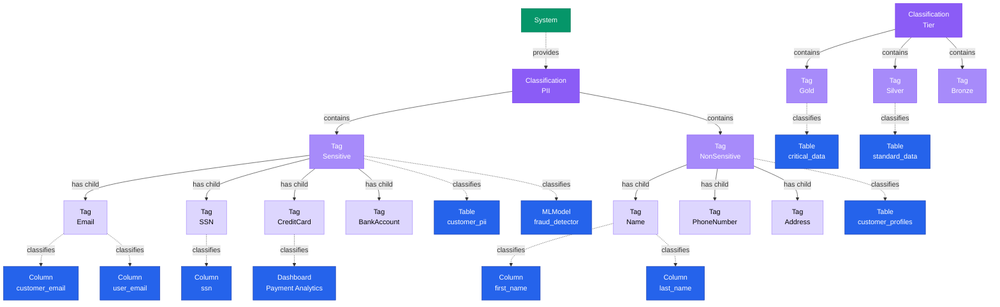

# Classification

**Hierarchical taxonomies for data governance - organizing tags into meaningful categories**

---

## Overview

The **Classification** entity represents a hierarchical taxonomy system for organizing tags. Classifications enable structured governance through categories like PII, Compliance, Data Quality, and Tier. Each classification contains a hierarchy of tags.

## Relationship Diagram



---

## Schema Specifications

View the complete Classification schema in your preferred format:

=== "JSON Schema"

    **Complete JSON Schema Definition**

    ```json
    {
      "$id": "https://open-metadata.org/schema/entity/classification/classification.json",
      "$schema": "http://json-schema.org/draft-07/schema#",
      "title": "Classification",
      "description": "A `Classification` defines a hierarchical taxonomy of tags for data governance and organization.",
      "type": "object",
      "javaType": "org.openmetadata.schema.entity.classification.Classification",

      "definitions": {
        "provider": {
          "description": "Provider of the classification",
          "type": "string",
          "enum": ["System", "User"]
        },
        "mutuallyExclusive": {
          "description": "Tags in this classification are mutually exclusive",
          "type": "boolean",
          "default": false
        }
      },

      "properties": {
        "id": {
          "description": "Unique identifier",
          "$ref": "../../type/basic.json#/definitions/uuid"
        },
        "name": {
          "description": "Classification name",
          "$ref": "../../type/basic.json#/definitions/entityName"
        },
        "fullyQualifiedName": {
          "description": "Fully qualified name of the classification",
          "$ref": "../../type/basic.json#/definitions/fullyQualifiedEntityName"
        },
        "displayName": {
          "description": "Display name",
          "type": "string"
        },
        "description": {
          "description": "Markdown description of the classification purpose",
          "$ref": "../../type/basic.json#/definitions/markdown"
        },
        "provider": {
          "$ref": "#/definitions/provider"
        },
        "mutuallyExclusive": {
          "$ref": "#/definitions/mutuallyExclusive"
        },
        "tags": {
          "description": "Tags in this classification",
          "type": "array",
          "items": {
            "$ref": "../classification/tag.json"
          }
        },
        "disabled": {
          "description": "Whether this classification is disabled",
          "type": "boolean",
          "default": false
        },
        "version": {
          "description": "Metadata version",
          "$ref": "../../type/entityHistory.json#/definitions/entityVersion"
        }
      },

      "required": ["id", "name", "description"]
    }
    ```

    **[View Full JSON Schema →](https://github.com/open-metadata/OpenMetadataStandards/blob/main/schemas/entity/classification/classification.json)**

=== "RDF"

    **RDF/OWL Ontology Definition**

    ```turtle
    @prefix om: <https://open-metadata.org/schema/> .
    @prefix rdfs: <http://www.w3.org/2000/01/rdf-schema#> .
    @prefix owl: <http://www.w3.org/2001/XMLSchema#> .
    @prefix xsd: <http://www.w3.org/2001/XMLSchema#> .
    @prefix skos: <http://www.w3.org/2004/02/skos/core#> .

    # Classification Class Definition
    om:Classification a owl:Class ;
        rdfs:subClassOf om:GovernanceAsset, skos:ConceptScheme ;
        rdfs:label "Classification" ;
        rdfs:comment "A hierarchical taxonomy system for organizing tags" ;
        om:hierarchyLevel 1 .

    # Properties
    om:classificationName a owl:DatatypeProperty ;
        rdfs:domain om:Classification ;
        rdfs:range xsd:string ;
        rdfs:label "name" ;
        rdfs:comment "Name of the classification" .

    om:fullyQualifiedName a owl:DatatypeProperty ;
        rdfs:domain om:Classification ;
        rdfs:range xsd:string ;
        rdfs:label "fullyQualifiedName" ;
        rdfs:comment "Complete name of the classification" .

    om:classificationProvider a owl:DatatypeProperty ;
        rdfs:domain om:Classification ;
        rdfs:range om:ClassificationProvider ;
        rdfs:label "provider" ;
        rdfs:comment "Provider: System or User" .

    om:mutuallyExclusive a owl:DatatypeProperty ;
        rdfs:domain om:Classification ;
        rdfs:range xsd:boolean ;
        rdfs:label "mutuallyExclusive" ;
        rdfs:comment "Whether tags in this classification are mutually exclusive" .

    om:isDisabled a owl:DatatypeProperty ;
        rdfs:domain om:Classification ;
        rdfs:range xsd:boolean ;
        rdfs:label "disabled" ;
        rdfs:comment "Whether this classification is disabled" .

    om:hasTag a owl:ObjectProperty ;
        rdfs:domain om:Classification ;
        rdfs:range om:Tag ;
        rdfs:label "hasTag" ;
        rdfs:comment "Tags in this classification" ;
        owl:equivalentProperty skos:hasTopConcept .

    # Provider Enumeration
    om:ClassificationProvider a owl:Class ;
        owl:oneOf (
            om:SystemProvider
            om:UserProvider
        ) .

    # Example Instances
    ex:piiClassification a om:Classification, skos:ConceptScheme ;
        om:classificationName "PII" ;
        om:fullyQualifiedName "PII" ;
        om:displayName "Personally Identifiable Information" ;
        om:description "Classification for personally identifiable information" ;
        om:classificationProvider om:SystemProvider ;
        om:mutuallyExclusive false ;
        om:isDisabled false ;
        skos:hasTopConcept ex:sensitiveTag ;
        skos:hasTopConcept ex:nonSensitiveTag .

    ex:tierClassification a om:Classification, skos:ConceptScheme ;
        om:classificationName "Tier" ;
        om:fullyQualifiedName "Tier" ;
        om:displayName "Data Tier" ;
        om:description "Data tier classification for priority and criticality" ;
        om:classificationProvider om:SystemProvider ;
        om:mutuallyExclusive true ;
        skos:hasTopConcept ex:goldTag ;
        skos:hasTopConcept ex:silverTag ;
        skos:hasTopConcept ex:bronzeTag .
    ```

    **[View Full RDF Ontology →](https://github.com/open-metadata/OpenMetadataStandards/blob/main/rdf/ontology/openmetadata.ttl)**

=== "JSON-LD"

    **JSON-LD Context and Example**

    ```json
    {
      "@context": {
        "@vocab": "https://open-metadata.org/schema/",
        "om": "https://open-metadata.org/schema/",
        "skos": "http://www.w3.org/2004/02/skos/core#",
        "rdfs": "http://www.w3.org/2000/01/rdf-schema#",
        "xsd": "http://www.w3.org/2001/XMLSchema#",

        "Classification": "om:Classification",
        "ConceptScheme": "skos:ConceptScheme",
        "name": {
          "@id": "om:classificationName",
          "@type": "xsd:string"
        },
        "fullyQualifiedName": {
          "@id": "om:fullyQualifiedName",
          "@type": "xsd:string"
        },
        "displayName": {
          "@id": "om:displayName",
          "@type": "xsd:string"
        },
        "description": {
          "@id": "om:description",
          "@type": "xsd:string"
        },
        "provider": {
          "@id": "om:classificationProvider",
          "@type": "@vocab"
        },
        "mutuallyExclusive": {
          "@id": "om:mutuallyExclusive",
          "@type": "xsd:boolean"
        },
        "disabled": {
          "@id": "om:isDisabled",
          "@type": "xsd:boolean"
        },
        "tags": {
          "@id": "skos:hasTopConcept",
          "@type": "@id",
          "@container": "@set"
        }
      }
    }
    ```

    **Example JSON-LD Instance**:

    ```json
    {
      "@context": "https://open-metadata.org/context/classification.jsonld",
      "@type": ["Classification", "ConceptScheme"],
      "@id": "https://open-metadata.org/classifications/PII",

      "name": "PII",
      "fullyQualifiedName": "PII",
      "displayName": "Personally Identifiable Information",
      "description": "# PII Classification\n\nClassification for personally identifiable information to ensure compliance with privacy regulations.\n\n## Categories\n- **Sensitive**: Data requiring strict protection (SSN, financial info)\n- **NonSensitive**: Less critical personal data (name, public contact info)",
      "provider": "System",
      "mutuallyExclusive": false,
      "disabled": false,

      "tags": [
        {
          "@type": "Tag",
          "@id": "https://open-metadata.org/tags/PII/Sensitive",
          "name": "Sensitive",
          "fullyQualifiedName": "PII.Sensitive",
          "description": "Highly sensitive personal information",
          "children": [
            {
              "@type": "Tag",
              "@id": "https://open-metadata.org/tags/PII/Sensitive/Email",
              "name": "Email",
              "fullyQualifiedName": "PII.Sensitive.Email"
            },
            {
              "@type": "Tag",
              "@id": "https://open-metadata.org/tags/PII/Sensitive/SSN",
              "name": "SSN",
              "fullyQualifiedName": "PII.Sensitive.SSN"
            }
          ]
        },
        {
          "@type": "Tag",
          "@id": "https://open-metadata.org/tags/PII/NonSensitive",
          "name": "NonSensitive",
          "fullyQualifiedName": "PII.NonSensitive",
          "description": "Less sensitive personal information",
          "children": [
            {
              "@type": "Tag",
              "@id": "https://open-metadata.org/tags/PII/NonSensitive/Name",
              "name": "Name",
              "fullyQualifiedName": "PII.NonSensitive.Name"
            }
          ]
        }
      ]
    }
    ```

    **[View Full JSON-LD Context →](https://github.com/open-metadata/OpenMetadataStandards/blob/main/rdf/contexts/classification.jsonld)**

---

## Use Cases

- Organize data governance tags into hierarchical categories
- Implement PII (Personally Identifiable Information) taxonomy
- Define compliance classifications (GDPR, HIPAA, PCI-DSS)
- Create data tier systems (Gold, Silver, Bronze)
- Establish data quality categories
- Build domain-specific taxonomies
- Enforce mutually exclusive tag selection (e.g., only one tier per asset)
- Support automated tag suggestions and propagation
- Enable faceted search and filtering

---

## JSON Schema Specification

### Core Properties

#### `id` (uuid)
**Type**: `string` (UUID format)
**Required**: Yes (system-generated)
**Description**: Unique identifier for this classification

```json
{
  "id": "3c4d5e6f-7a8b-4c9d-0e1f-2a3b4c5d6e7f"
}
```

---

#### `name` (entityName)
**Type**: `string`
**Required**: Yes
**Pattern**: `^[^.]*$` (no dots allowed)
**Min Length**: 1
**Max Length**: 256
**Description**: Name of the classification

```json
{
  "name": "PII"
}
```

---

#### `fullyQualifiedName` (fullyQualifiedEntityName)
**Type**: `string`
**Required**: Yes (system-generated)
**Pattern**: `^((?!::).)*$`
**Description**: Fully qualified name of the classification

```json
{
  "fullyQualifiedName": "PII"
}
```

---

#### `displayName`
**Type**: `string`
**Required**: No
**Description**: Human-readable display name

```json
{
  "displayName": "Personally Identifiable Information"
}
```

---

#### `description` (markdown)
**Type**: `string` (Markdown format)
**Required**: Yes
**Description**: Rich text description of the classification's purpose

```json
{
  "description": "# PII Classification\n\nClassification for personally identifiable information to ensure compliance with privacy regulations like GDPR, CCPA, and HIPAA.\n\n## Usage Guidelines\n- Apply to any data containing personal information\n- Use Sensitive subcategory for high-risk data\n- Triggers automated privacy scanning"
}
```

---

### Configuration Properties

#### `provider` (Provider enum)
**Type**: `string` enum
**Required**: No (default: `User`)
**Allowed Values**:

- `System` - System-provided classification (cannot be deleted)
- `User` - User-defined classification (can be modified/deleted)

```json
{
  "provider": "System"
}
```

---

#### `mutuallyExclusive` (boolean)
**Type**: `boolean`
**Required**: No (default: false)
**Description**: Whether only one tag from this classification can be applied to an asset

```json
{
  "mutuallyExclusive": true
}
```

**Example Use Case**: Tier classification where an asset can only be Gold, Silver, or Bronze (not multiple)

---

#### `disabled` (boolean)
**Type**: `boolean`
**Required**: No (default: false)
**Description**: Whether this classification is disabled and hidden from users

```json
{
  "disabled": false
}
```

---

### Structure Properties

#### `tags[]` (Tag[])
**Type**: `array` of Tag objects
**Required**: No
**Description**: Hierarchical tags in this classification

**Tag Object Properties** (see [Tag](tag.md) for full specification):

| Property | Type | Required | Description |
|----------|------|----------|-------------|
| `name` | string | Yes | Tag name |
| `displayName` | string | No | Display name |
| `description` | markdown | No | Tag description |
| `fullyQualifiedName` | string | Yes | Full tag path (e.g., PII.Sensitive.Email) |
| `classification` | reference | Yes | Parent classification |
| `parent` | reference | No | Parent tag (for nested tags) |
| `children` | Tag[] | No | Child tags |
| `disabled` | boolean | No | Whether tag is disabled |

**Example with Nested Hierarchy**:

```json
{
  "tags": [
    {
      "name": "Sensitive",
      "fullyQualifiedName": "PII.Sensitive",
      "displayName": "Sensitive PII",
      "description": "Highly sensitive personal information requiring strict access controls",
      "children": [
        {
          "name": "Email",
          "fullyQualifiedName": "PII.Sensitive.Email",
          "description": "Email addresses"
        },
        {
          "name": "SSN",
          "fullyQualifiedName": "PII.Sensitive.SSN",
          "description": "Social Security Numbers"
        },
        {
          "name": "CreditCard",
          "fullyQualifiedName": "PII.Sensitive.CreditCard",
          "description": "Credit card numbers and payment information"
        }
      ]
    },
    {
      "name": "NonSensitive",
      "fullyQualifiedName": "PII.NonSensitive",
      "displayName": "Non-Sensitive PII",
      "description": "Less critical personal information",
      "children": [
        {
          "name": "Name",
          "fullyQualifiedName": "PII.NonSensitive.Name",
          "description": "Person names"
        },
        {
          "name": "PhoneNumber",
          "fullyQualifiedName": "PII.NonSensitive.PhoneNumber",
          "description": "Phone numbers"
        }
      ]
    }
  ]
}
```

---

### Versioning Properties

#### `version` (entityVersion)
**Type**: `number`
**Required**: Yes (system-managed)
**Description**: Metadata version number, incremented on changes

```json
{
  "version": 1.5
}
```

---

#### `updatedAt` (timestamp)
**Type**: `integer` (Unix epoch milliseconds)
**Required**: Yes (system-managed)
**Description**: Last update timestamp

```json
{
  "updatedAt": 1704240000000
}
```

---

#### `updatedBy` (string)
**Type**: `string`
**Required**: Yes (system-managed)
**Description**: User who made the update

```json
{
  "updatedBy": "admin"
}
```

---

## Complete Example

### PII Classification (Non-Mutually Exclusive)

```json
{
  "id": "3c4d5e6f-7a8b-4c9d-0e1f-2a3b4c5d6e7f",
  "name": "PII",
  "fullyQualifiedName": "PII",
  "displayName": "Personally Identifiable Information",
  "description": "Classification for personally identifiable information",
  "provider": "System",
  "mutuallyExclusive": false,
  "disabled": false,
  "tags": [
    {
      "name": "Sensitive",
      "fullyQualifiedName": "PII.Sensitive",
      "description": "Highly sensitive personal information",
      "children": [
        {
          "name": "Email",
          "fullyQualifiedName": "PII.Sensitive.Email"
        },
        {
          "name": "SSN",
          "fullyQualifiedName": "PII.Sensitive.SSN"
        }
      ]
    },
    {
      "name": "NonSensitive",
      "fullyQualifiedName": "PII.NonSensitive",
      "description": "Less sensitive personal information",
      "children": [
        {
          "name": "Name",
          "fullyQualifiedName": "PII.NonSensitive.Name"
        }
      ]
    }
  ],
  "version": 1.5,
  "updatedAt": 1704240000000,
  "updatedBy": "admin"
}
```

### Tier Classification (Mutually Exclusive)

```json
{
  "id": "4d5e6f7a-8b9c-4d0e-1f2a-3b4c5d6e7f8a",
  "name": "Tier",
  "fullyQualifiedName": "Tier",
  "displayName": "Data Tier",
  "description": "Data tier classification for priority and criticality",
  "provider": "System",
  "mutuallyExclusive": true,
  "disabled": false,
  "tags": [
    {
      "name": "Gold",
      "fullyQualifiedName": "Tier.Gold",
      "description": "Mission-critical data with highest priority"
    },
    {
      "name": "Silver",
      "fullyQualifiedName": "Tier.Silver",
      "description": "Important data with medium priority"
    },
    {
      "name": "Bronze",
      "fullyQualifiedName": "Tier.Bronze",
      "description": "Standard data with normal priority"
    }
  ],
  "version": 1.0,
  "updatedAt": 1704240000000,
  "updatedBy": "admin"
}
```

---

## RDF Representation

### Ontology Class

```turtle
@prefix om: <https://open-metadata.org/schema/> .
@prefix rdfs: <http://www.w3.org/2000/01/rdf-schema#> .
@prefix owl: <http://www.w3.org/2001/XMLSchema#> .
@prefix skos: <http://www.w3.org/2004/02/skos/core#> .

om:Classification a owl:Class ;
    rdfs:subClassOf om:GovernanceAsset, skos:ConceptScheme ;
    rdfs:label "Classification" ;
    rdfs:comment "A hierarchical taxonomy system for organizing tags" ;
    om:hasProperties [
        om:name "string" ;
        om:description "string" ;
        om:provider "ClassificationProvider" ;
        om:mutuallyExclusive "boolean" ;
        om:tags "Tag[]" ;
    ] .
```

### Instance Example

```turtle
@prefix om: <https://open-metadata.org/schema/> .
@prefix ex: <https://open-metadata.org/classifications/> .
@prefix skos: <http://www.w3.org/2004/02/skos/core#> .

ex:PII a om:Classification, skos:ConceptScheme ;
    om:classificationName "PII" ;
    om:fullyQualifiedName "PII" ;
    om:displayName "Personally Identifiable Information" ;
    om:description "Classification for personally identifiable information" ;
    om:classificationProvider om:SystemProvider ;
    om:mutuallyExclusive false ;
    om:isDisabled false ;
    skos:hasTopConcept ex:PII_Sensitive ;
    skos:hasTopConcept ex:PII_NonSensitive .

ex:PII_Sensitive a om:Tag, skos:Concept ;
    skos:inScheme ex:PII ;
    skos:prefLabel "Sensitive" ;
    skos:narrower ex:PII_Sensitive_Email ;
    skos:narrower ex:PII_Sensitive_SSN .
```

---

## JSON-LD Context

```json
{
  "@context": {
    "@vocab": "https://open-metadata.org/schema/",
    "om": "https://open-metadata.org/schema/",
    "skos": "http://www.w3.org/2004/02/skos/core#",
    "Classification": "om:Classification",
    "ConceptScheme": "skos:ConceptScheme",
    "name": "om:classificationName",
    "description": "om:description",
    "provider": "om:classificationProvider",
    "mutuallyExclusive": "om:mutuallyExclusive",
    "tags": "skos:hasTopConcept"
  }
}
```

### JSON-LD Example

```json
{
  "@context": "https://open-metadata.org/context/classification.jsonld",
  "@type": ["Classification", "ConceptScheme"],
  "@id": "https://open-metadata.org/classifications/PII",
  "name": "PII",
  "fullyQualifiedName": "PII",
  "displayName": "Personally Identifiable Information",
  "provider": "System",
  "mutuallyExclusive": false,
  "tags": [
    {
      "@type": "Tag",
      "@id": "https://open-metadata.org/tags/PII/Sensitive"
    }
  ]
}
```

---

## Relationships

### Child Entities
- **Tag**: Primary category tags in this classification
  - **Tag** (nested): Sub-category tags

### Associated Entities
- **DataAsset**: Tables, columns, dashboards, etc. tagged with tags from this classification

---

## Custom Properties

This entity supports custom properties through the `extension` field.
Common custom properties include:

- **Data Classification**: Sensitivity level
- **Cost Center**: Billing allocation
- **Retention Period**: Data retention requirements
- **Application Owner**: Owning application/team

See [Custom Properties](../metadata-specifications/custom-properties.md)
for details on defining and using custom properties.

---

## API Operations

### Create Classification

```http
POST /api/v1/classifications
Content-Type: application/json

{
  "name": "Compliance",
  "displayName": "Compliance & Regulatory",
  "description": "Classification for compliance and regulatory requirements",
  "provider": "User",
  "mutuallyExclusive": false,
  "tags": [
    {
      "name": "GDPR",
      "description": "General Data Protection Regulation"
    },
    {
      "name": "HIPAA",
      "description": "Health Insurance Portability and Accountability Act"
    }
  ]
}
```

### Get Classification

```http
GET /api/v1/classifications/name/PII?fields=tags
```

### Update Classification

```http
PATCH /api/v1/classifications/{id}
Content-Type: application/json-patch+json

[
  {
    "op": "add",
    "path": "/tags/-",
    "value": {
      "name": "Financial",
      "description": "Financial personal information"
    }
  }
]
```

### List Classifications

```http
GET /api/v1/classifications?fields=tags&limit=25
```

### Disable Classification

```http
PATCH /api/v1/classifications/{id}
Content-Type: application/json-patch+json

[
  {
    "op": "replace",
    "path": "/disabled",
    "value": true
  }
]
```

---

## Common Classification Examples

### System Classifications

1. **PII** - Personally Identifiable Information
2. **Tier** - Data criticality (Gold/Silver/Bronze)
3. **Compliance** - Regulatory frameworks
4. **DataQuality** - Data quality indicators
5. **Sensitivity** - Data sensitivity levels

### User-Defined Classifications

1. **BusinessDomain** - Business area categorization
2. **DataLifecycle** - Data lifecycle stages
3. **AccessControl** - Access restriction levels
4. **DataSource** - Source system categorization

---

## Related Documentation

- **[Tag](tag.md)** - Individual tags within classifications
- **[GlossaryTerm](glossary-term.md)** - Business terminology
- **[Glossary](glossary.md)** - Business vocabulary containers
- **[Table](../data-assets/databases/table.md)** - Applying tags to tables
- **[SKOS Standard](https://www.w3.org/TR/skos-reference/)** - W3C Simple Knowledge Organization System
