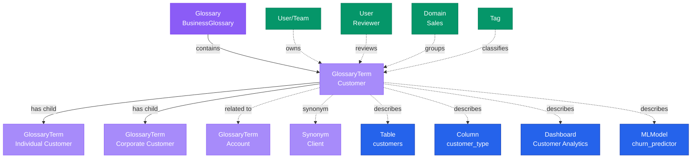

# GlossaryTerm

**Business concepts and definitions - the foundation of business vocabulary**

---

## Overview

The **GlossaryTerm** entity represents a business concept with its definition, synonyms, related terms, and relationships to data assets. It is the primary mechanism for linking business context to technical data assets.

## Relationship Diagram

```mermaid
graph TD
    %% Main entity
    GT[GlossaryTerm<br/>Customer]

    %% Parent glossary
    GLOSS[Glossary<br/>BusinessGlossary] -->|contains| GT

    %% Parent term hierarchy
    PARENT[GlossaryTerm<br/>Party] -->|parent of| GT

    %% Child terms
    GT -->|has child| CHILD1[GlossaryTerm<br/>EnterpriseCustomer]
    GT -->|has child| CHILD2[GlossaryTerm<br/>IndividualCustomer]
    GT -->|has child| CHILD3[GlossaryTerm<br/>VIPCustomer]

    %% Related terms
    GT -.->|related to| REL1[GlossaryTerm<br/>Order]
    GT -.->|related to| REL2[GlossaryTerm<br/>Revenue]
    GT -.->|related to| REL3[GlossaryTerm<br/>Account]

    %% Synonyms
    GT -.->|synonym| SYN1[Synonym<br/>Client]
    GT -.->|synonym| SYN2[Synonym<br/>Buyer]
    GT -.->|synonym| SYN3[Synonym<br/>Purchaser]

    %% Governance relationships
    USR[User<br/>Jane Doe] -.->|owns| GT
    REV[Team<br/>DataGovernance] -.->|reviews| GT
    DOM[Domain<br/>Sales] -.->|groups| GT

    %% Classification tags
    TAG1[Tag<br/>Governance.Approved] -.->|classifies| GT
    TAG2[Tag<br/>PII.NonSensitive] -.->|classifies| GT

    %% Applied to data assets
    GT -.->|describes| TBL1[Table<br/>customers]
    GT -.->|describes| TBL2[Table<br/>customer_accounts]
    GT -.->|describes| COL1[Column<br/>customer_id]
    GT -.->|describes| COL2[Column<br/>customer_type]
    GT -.->|describes| DASH[Dashboard<br/>Customer Analytics]
    GT -.->|describes| ML[MLModel<br/>customer_churn]

    %% External references
    GT -.->|references| REF1[External Link<br/>Wikipedia]
    GT -.->|references| REF2[External Link<br/>GDPR Docs]

    %% Styling
    classDef glossary fill:#8B5CF6,stroke:#7C3AED,color:#fff
    classDef term fill:#A78BFA,stroke:#8B5CF6,color:#fff
    classDef synonym fill:#DDD6FE,stroke:#A78BFA,color:#000
    classDef governance fill:#059669,stroke:#047857,color:#fff
    classDef data fill:#2563EB,stroke:#1E40AF,color:#fff
    classDef external fill:#64748B,stroke:#475569,color:#fff

    class GLOSS glossary
    class GT,PARENT,CHILD1,CHILD2,CHILD3,REL1,REL2,REL3 term
    class SYN1,SYN2,SYN3 synonym
    class USR,REV,DOM,TAG1,TAG2 governance
    class TBL1,TBL2,COL1,COL2,DASH,ML data
    class REF1,REF2 external
```



---

## Schema Specifications

View the complete GlossaryTerm schema in your preferred format:

=== "JSON Schema"

    **Complete JSON Schema Definition**

    ```json
    {
      "$id": "https://open-metadata.org/schema/entity/data/glossaryTerm.json",
      "$schema": "http://json-schema.org/draft-07/schema#",
      "title": "GlossaryTerm",
      "description": "A `GlossaryTerm` defines a business concept with its definition, synonyms, and relationships.",
      "type": "object",
      "javaType": "org.openmetadata.schema.entity.data.GlossaryTerm",

      "definitions": {
        "termReference": {
          "type": "object",
          "properties": {
            "name": {
              "type": "string"
            },
            "endpoint": {
              "type": "string",
              "format": "uri"
            }
          }
        },
        "status": {
          "description": "Status of the glossary term",
          "type": "string",
          "enum": ["Draft", "Approved", "Deprecated", "Rejected"]
        }
      },

      "properties": {
        "id": {
          "description": "Unique identifier",
          "$ref": "../../type/basic.json#/definitions/uuid"
        },
        "name": {
          "description": "Term name",
          "$ref": "../../type/basic.json#/definitions/entityName"
        },
        "fullyQualifiedName": {
          "description": "Fully qualified name: glossary.term",
          "$ref": "../../type/basic.json#/definitions/fullyQualifiedEntityName"
        },
        "displayName": {
          "description": "Display name",
          "type": "string"
        },
        "description": {
          "description": "Markdown definition of the term",
          "$ref": "../../type/basic.json#/definitions/markdown"
        },
        "glossary": {
          "description": "Parent glossary",
          "$ref": "../../type/entityReference.json"
        },
        "parent": {
          "description": "Parent glossary term",
          "$ref": "../../type/entityReference.json"
        },
        "children": {
          "description": "Child glossary terms",
          "type": "array",
          "items": {
            "$ref": "../../type/entityReference.json"
          }
        },
        "synonyms": {
          "description": "Alternate names for this term",
          "type": "array",
          "items": {
            "type": "string"
          }
        },
        "relatedTerms": {
          "description": "Related glossary terms",
          "type": "array",
          "items": {
            "$ref": "../../type/entityReference.json"
          }
        },
        "references": {
          "description": "External references",
          "type": "array",
          "items": {
            "$ref": "#/definitions/termReference"
          }
        },
        "status": {
          "$ref": "#/definitions/status"
        },
        "owner": {
          "description": "Owner (user or team)",
          "$ref": "../../type/entityReference.json"
        },
        "domain": {
          "description": "Data domain",
          "$ref": "../../type/entityReference.json"
        },
        "tags": {
          "description": "Classification tags",
          "type": "array",
          "items": {
            "$ref": "../../type/tagLabel.json"
          }
        },
        "reviewers": {
          "description": "Users or teams that can review this term",
          "type": "array",
          "items": {
            "$ref": "../../type/entityReference.json"
          }
        },
        "usageCount": {
          "description": "Number of data assets using this term",
          "type": "integer"
        },
        "version": {
          "description": "Metadata version",
          "$ref": "../../type/entityHistory.json#/definitions/entityVersion"
        }
      },

      "required": ["id", "name", "glossary", "description"]
    }
    ```

    **[View Full JSON Schema →](https://github.com/open-metadata/OpenMetadataStandards/blob/main/schemas/entity/data/glossaryTerm.json)**

=== "RDF"

    **RDF/OWL Ontology Definition**

    ```turtle
    @prefix om: <https://open-metadata.org/schema/> .
    @prefix rdfs: <http://www.w3.org/2000/01/rdf-schema#> .
    @prefix owl: <http://www.w3.org/2001/XMLSchema#> .
    @prefix xsd: <http://www.w3.org/2001/XMLSchema#> .
    @prefix skos: <http://www.w3.org/2004/02/skos/core#> .

    # GlossaryTerm Class Definition
    om:GlossaryTerm a owl:Class ;
        rdfs:subClassOf om:GovernanceAsset, skos:Concept ;
        rdfs:label "GlossaryTerm" ;
        rdfs:comment "A business concept with definition and relationships" ;
        om:hierarchyLevel 2 .

    # Properties
    om:termName a owl:DatatypeProperty ;
        rdfs:domain om:GlossaryTerm ;
        rdfs:range xsd:string ;
        rdfs:label "name" ;
        rdfs:comment "Name of the glossary term" .

    om:fullyQualifiedName a owl:DatatypeProperty ;
        rdfs:domain om:GlossaryTerm ;
        rdfs:range xsd:string ;
        rdfs:label "fullyQualifiedName" ;
        rdfs:comment "Complete hierarchical name: glossary.term" .

    om:termDefinition a owl:DatatypeProperty ;
        rdfs:domain om:GlossaryTerm ;
        rdfs:range xsd:string ;
        rdfs:label "definition" ;
        rdfs:comment "Definition of the business term" ;
        owl:equivalentProperty skos:definition .

    om:synonym a owl:DatatypeProperty ;
        rdfs:domain om:GlossaryTerm ;
        rdfs:range xsd:string ;
        rdfs:label "synonym" ;
        rdfs:comment "Alternate name for this term" ;
        owl:equivalentProperty skos:altLabel .

    om:termStatus a owl:DatatypeProperty ;
        rdfs:domain om:GlossaryTerm ;
        rdfs:range om:TermStatus ;
        rdfs:label "status" ;
        rdfs:comment "Approval status: Draft, Approved, Deprecated, Rejected" .

    om:belongsToGlossary a owl:ObjectProperty ;
        rdfs:domain om:GlossaryTerm ;
        rdfs:range om:Glossary ;
        rdfs:label "belongsToGlossary" ;
        rdfs:comment "Parent glossary" ;
        owl:equivalentProperty skos:inScheme .

    om:hasParentTerm a owl:ObjectProperty ;
        rdfs:domain om:GlossaryTerm ;
        rdfs:range om:GlossaryTerm ;
        rdfs:label "hasParentTerm" ;
        rdfs:comment "Parent term in hierarchy" ;
        owl:equivalentProperty skos:broader .

    om:hasChildTerm a owl:ObjectProperty ;
        rdfs:domain om:GlossaryTerm ;
        rdfs:range om:GlossaryTerm ;
        rdfs:label "hasChildTerm" ;
        rdfs:comment "Child term in hierarchy" ;
        owl:equivalentProperty skos:narrower .

    om:relatedTo a owl:ObjectProperty ;
        rdfs:domain om:GlossaryTerm ;
        rdfs:range om:GlossaryTerm ;
        rdfs:label "relatedTo" ;
        rdfs:comment "Related glossary term" ;
        owl:equivalentProperty skos:related .

    om:appliedToAsset a owl:ObjectProperty ;
        rdfs:domain om:GlossaryTerm ;
        rdfs:range om:DataAsset ;
        rdfs:label "appliedToAsset" ;
        rdfs:comment "Data assets tagged with this term" .

    # Term Status Enumeration
    om:TermStatus a owl:Class ;
        owl:oneOf (
            om:DraftStatus
            om:ApprovedStatus
            om:DeprecatedStatus
            om:RejectedStatus
        ) .

    # Example Instance
    ex:customerTerm a om:GlossaryTerm, skos:Concept ;
        om:termName "Customer" ;
        om:fullyQualifiedName "BusinessGlossary.Customer" ;
        om:displayName "Customer" ;
        om:termDefinition "An individual or organization that purchases goods or services" ;
        om:synonym "Client" ;
        om:synonym "Account" ;
        om:termStatus om:ApprovedStatus ;
        om:belongsToGlossary ex:businessGlossary ;
        om:relatedTo ex:orderTerm ;
        om:hasChildTerm ex:enterpriseCustomerTerm ;
        om:appliedToAsset ex:customersTable ;
        om:ownedBy ex:janeDoe .
    ```

    **[View Full RDF Ontology →](https://github.com/open-metadata/OpenMetadataStandards/blob/main/rdf/ontology/openmetadata.ttl)**

=== "JSON-LD"

    **JSON-LD Context and Example**

    ```json
    {
      "@context": {
        "@vocab": "https://open-metadata.org/schema/",
        "om": "https://open-metadata.org/schema/",
        "skos": "http://www.w3.org/2004/02/skos/core#",
        "rdfs": "http://www.w3.org/2000/01/rdf-schema#",
        "xsd": "http://www.w3.org/2001/XMLSchema#",

        "GlossaryTerm": "om:GlossaryTerm",
        "Concept": "skos:Concept",
        "name": {
          "@id": "om:termName",
          "@type": "xsd:string"
        },
        "fullyQualifiedName": {
          "@id": "om:fullyQualifiedName",
          "@type": "xsd:string"
        },
        "displayName": {
          "@id": "om:displayName",
          "@type": "xsd:string"
        },
        "description": {
          "@id": "om:termDefinition",
          "@type": "xsd:string"
        },
        "definition": {
          "@id": "skos:definition",
          "@type": "xsd:string"
        },
        "synonyms": {
          "@id": "skos:altLabel",
          "@type": "xsd:string",
          "@container": "@set"
        },
        "status": {
          "@id": "om:termStatus",
          "@type": "@vocab"
        },
        "glossary": {
          "@id": "skos:inScheme",
          "@type": "@id"
        },
        "parent": {
          "@id": "skos:broader",
          "@type": "@id"
        },
        "children": {
          "@id": "skos:narrower",
          "@type": "@id",
          "@container": "@set"
        },
        "relatedTerms": {
          "@id": "skos:related",
          "@type": "@id",
          "@container": "@set"
        },
        "owner": {
          "@id": "om:ownedBy",
          "@type": "@id"
        },
        "reviewers": {
          "@id": "om:hasReviewer",
          "@type": "@id",
          "@container": "@set"
        },
        "tags": {
          "@id": "om:hasTag",
          "@type": "@id",
          "@container": "@set"
        }
      }
    }
    ```

    **Example JSON-LD Instance**:

    ```json
    {
      "@context": "https://open-metadata.org/context/glossaryTerm.jsonld",
      "@type": ["GlossaryTerm", "Concept"],
      "@id": "https://example.com/glossary/business/Customer",

      "name": "Customer",
      "fullyQualifiedName": "BusinessGlossary.Customer",
      "displayName": "Customer",
      "description": "# Customer\n\nAn individual or organization that purchases goods or services from the company.\n\n## Key Attributes\n- Must have a unique customer ID\n- Can be individual or business entity\n- Has associated contact information",
      "definition": "An individual or organization that purchases goods or services",
      "status": "Approved",

      "synonyms": ["Client", "Account", "Buyer"],

      "glossary": {
        "@id": "https://example.com/glossary/business",
        "@type": "Glossary",
        "name": "BusinessGlossary"
      },

      "parent": {
        "@id": "https://example.com/glossary/business/Party",
        "@type": "GlossaryTerm",
        "name": "Party"
      },

      "children": [
        {
          "@id": "https://example.com/glossary/business/EnterpriseCustomer",
          "@type": "GlossaryTerm",
          "name": "EnterpriseCustomer"
        },
        {
          "@id": "https://example.com/glossary/business/IndividualCustomer",
          "@type": "GlossaryTerm",
          "name": "IndividualCustomer"
        }
      ],

      "relatedTerms": [
        {
          "@id": "https://example.com/glossary/business/Order",
          "@type": "GlossaryTerm",
          "name": "Order"
        },
        {
          "@id": "https://example.com/glossary/business/Revenue",
          "@type": "GlossaryTerm",
          "name": "Revenue"
        }
      ],

      "references": [
        {
          "name": "Customer Definition - Wikipedia",
          "endpoint": "https://en.wikipedia.org/wiki/Customer"
        }
      ],

      "owner": {
        "@id": "https://example.com/users/jane.doe",
        "@type": "User",
        "name": "jane.doe",
        "displayName": "Jane Doe"
      },

      "reviewers": [
        {
          "@id": "https://example.com/teams/data-governance",
          "@type": "Team",
          "name": "DataGovernance"
        }
      ],

      "tags": [
        {
          "@id": "https://open-metadata.org/tags/Governance/Approved",
          "tagFQN": "Governance.Approved"
        }
      ],

      "usageCount": 45
    }
    ```

    **[View Full JSON-LD Context →](https://github.com/open-metadata/OpenMetadataStandards/blob/main/rdf/contexts/glossaryTerm.jsonld)**

---

## Use Cases

- Define business concepts with clear definitions
- Link business terms to technical data assets (tables, columns, dashboards)
- Build hierarchical business vocabularies (parent-child relationships)
- Document synonyms and alternate names
- Track term approval status and lifecycle
- Enable business-oriented data discovery
- Support regulatory compliance with standardized terminology
- Facilitate cross-team understanding of business concepts
- Document relationships between business concepts

---

## JSON Schema Specification

### Core Properties

#### `id` (uuid)
**Type**: `string` (UUID format)
**Required**: Yes (system-generated)
**Description**: Unique identifier for this glossary term

```json
{
  "id": "2b3c4d5e-6f7a-4b8c-9d0e-1f2a3b4c5d6e"
}
```

---

#### `name` (entityName)
**Type**: `string`
**Required**: Yes
**Pattern**: `^[^.]*$` (no dots allowed)
**Min Length**: 1
**Max Length**: 256
**Description**: Name of the glossary term

```json
{
  "name": "Customer"
}
```

---

#### `fullyQualifiedName` (fullyQualifiedEntityName)
**Type**: `string`
**Required**: Yes (system-generated)
**Pattern**: `^((?!::).)*$`
**Description**: Fully qualified name in the format `glossary.term` or `glossary.parentTerm.term`

```json
{
  "fullyQualifiedName": "BusinessGlossary.Customer"
}
```

---

#### `displayName`
**Type**: `string`
**Required**: No
**Description**: Human-readable display name

```json
{
  "displayName": "Customer"
}
```

---

#### `description` (markdown)
**Type**: `string` (Markdown format)
**Required**: Yes
**Description**: Rich text definition of the business term

```json
{
  "description": "# Customer\n\nAn individual or organization that purchases goods or services from the company.\n\n## Key Attributes\n- Must have a unique customer ID\n- Can be individual or business entity\n- Has associated contact information\n\n## Usage Guidelines\nUse this term when referring to entities that have a purchasing relationship with the company."
}
```

---

### Relationship Properties

#### `glossary` (EntityReference)
**Type**: `object`
**Required**: Yes
**Description**: Reference to parent glossary

```json
{
  "glossary": {
    "id": "glossary-uuid",
    "type": "glossary",
    "name": "BusinessGlossary",
    "fullyQualifiedName": "BusinessGlossary"
  }
}
```

---

#### `parent` (EntityReference)
**Type**: `object`
**Required**: No
**Description**: Parent glossary term in hierarchy

```json
{
  "parent": {
    "id": "parent-term-uuid",
    "type": "glossaryTerm",
    "name": "Party",
    "fullyQualifiedName": "BusinessGlossary.Party"
  }
}
```

---

#### `children[]` (GlossaryTerm[])
**Type**: `array` of GlossaryTerm references
**Required**: No
**Description**: Child glossary terms

```json
{
  "children": [
    {
      "id": "child-term-uuid-1",
      "type": "glossaryTerm",
      "name": "EnterpriseCustomer",
      "fullyQualifiedName": "BusinessGlossary.Customer.EnterpriseCustomer"
    },
    {
      "id": "child-term-uuid-2",
      "type": "glossaryTerm",
      "name": "IndividualCustomer",
      "fullyQualifiedName": "BusinessGlossary.Customer.IndividualCustomer"
    }
  ]
}
```

---

#### `relatedTerms[]` (GlossaryTerm[])
**Type**: `array` of GlossaryTerm references
**Required**: No
**Description**: Related glossary terms (non-hierarchical relationships)

```json
{
  "relatedTerms": [
    {
      "id": "related-term-uuid-1",
      "type": "glossaryTerm",
      "name": "Order",
      "fullyQualifiedName": "BusinessGlossary.Order"
    },
    {
      "id": "related-term-uuid-2",
      "type": "glossaryTerm",
      "name": "Revenue",
      "fullyQualifiedName": "BusinessGlossary.Revenue"
    }
  ]
}
```

---

### Semantic Properties

#### `synonyms[]` (string[])
**Type**: `array` of strings
**Required**: No
**Description**: Alternate names for this term

```json
{
  "synonyms": ["Client", "Account", "Buyer", "Purchaser"]
}
```

---

#### `references[]` (TermReference[])
**Type**: `array` of reference objects
**Required**: No
**Description**: External references and documentation

**TermReference Object**:

| Property | Type | Required | Description |
|----------|------|----------|-------------|
| `name` | string | Yes | Reference name |
| `endpoint` | uri | Yes | URL to external resource |

```json
{
  "references": [
    {
      "name": "Customer Definition - Wikipedia",
      "endpoint": "https://en.wikipedia.org/wiki/Customer"
    },
    {
      "name": "GDPR Customer Rights",
      "endpoint": "https://gdpr-info.eu/art-15-gdpr/"
    }
  ]
}
```

---

#### `status` (Status enum)
**Type**: `string` enum
**Required**: No (default: `Draft`)
**Allowed Values**:

- `Draft` - Term is being defined
- `Approved` - Term has been reviewed and approved
- `Deprecated` - Term is no longer recommended for use
- `Rejected` - Term was rejected during review

```json
{
  "status": "Approved"
}
```

---

### Governance Properties

#### `owner` (EntityReference)
**Type**: `object`
**Required**: No
**Description**: User or team that owns this term

```json
{
  "owner": {
    "id": "owner-uuid",
    "type": "user",
    "name": "jane.doe",
    "displayName": "Jane Doe"
  }
}
```

---

#### `reviewers[]` (EntityReference[])
**Type**: `array` of User or Team references
**Required**: No
**Description**: Users or teams that can review and approve this term

```json
{
  "reviewers": [
    {
      "id": "reviewer-uuid",
      "type": "team",
      "name": "DataGovernance",
      "displayName": "Data Governance Team"
    }
  ]
}
```

---

#### `domain` (EntityReference)
**Type**: `object`
**Required**: No
**Description**: Data domain this term belongs to

```json
{
  "domain": {
    "id": "domain-uuid",
    "type": "domain",
    "name": "Sales",
    "fullyQualifiedName": "Sales"
  }
}
```

---

#### `tags[]` (TagLabel[])
**Type**: `array`
**Required**: No
**Description**: Classification tags applied to the term

```json
{
  "tags": [
    {
      "tagFQN": "Governance.Approved",
      "source": "Classification",
      "labelType": "Manual",
      "state": "Confirmed"
    }
  ]
}
```

---

### Usage Properties

#### `usageCount` (integer)
**Type**: `integer`
**Required**: No (system-generated)
**Description**: Number of data assets tagged with this term

```json
{
  "usageCount": 45
}
```

---

### Versioning Properties

#### `version` (entityVersion)
**Type**: `number`
**Required**: Yes (system-managed)
**Description**: Metadata version number, incremented on changes

```json
{
  "version": 2.1
}
```

---

#### `updatedAt` (timestamp)
**Type**: `integer` (Unix epoch milliseconds)
**Required**: Yes (system-managed)
**Description**: Last update timestamp

```json
{
  "updatedAt": 1704240000000
}
```

---

#### `updatedBy` (string)
**Type**: `string`
**Required**: Yes (system-managed)
**Description**: User who made the update

```json
{
  "updatedBy": "jane.doe"
}
```

---

## Complete Example

```json
{
  "id": "2b3c4d5e-6f7a-4b8c-9d0e-1f2a3b4c5d6e",
  "name": "Customer",
  "fullyQualifiedName": "BusinessGlossary.Customer",
  "displayName": "Customer",
  "description": "# Customer\n\nAn individual or organization that purchases goods or services from the company.",
  "status": "Approved",
  "synonyms": ["Client", "Account", "Buyer"],
  "glossary": {
    "id": "glossary-uuid",
    "type": "glossary",
    "name": "BusinessGlossary"
  },
  "parent": {
    "id": "parent-uuid",
    "type": "glossaryTerm",
    "name": "Party",
    "fullyQualifiedName": "BusinessGlossary.Party"
  },
  "children": [
    {
      "id": "child-uuid-1",
      "type": "glossaryTerm",
      "name": "EnterpriseCustomer",
      "fullyQualifiedName": "BusinessGlossary.Customer.EnterpriseCustomer"
    }
  ],
  "relatedTerms": [
    {
      "id": "related-uuid-1",
      "type": "glossaryTerm",
      "name": "Order",
      "fullyQualifiedName": "BusinessGlossary.Order"
    }
  ],
  "references": [
    {
      "name": "Customer Definition - Wikipedia",
      "endpoint": "https://en.wikipedia.org/wiki/Customer"
    }
  ],
  "owner": {
    "id": "owner-uuid",
    "type": "user",
    "name": "jane.doe",
    "displayName": "Jane Doe"
  },
  "reviewers": [
    {
      "id": "reviewer-uuid",
      "type": "team",
      "name": "DataGovernance"
    }
  ],
  "domain": {
    "id": "domain-uuid",
    "type": "domain",
    "name": "Sales"
  },
  "tags": [
    {
      "tagFQN": "Governance.Approved"
    }
  ],
  "usageCount": 45,
  "version": 2.1,
  "updatedAt": 1704240000000,
  "updatedBy": "jane.doe"
}
```

---

## RDF Representation

### Ontology Class

```turtle
@prefix om: <https://open-metadata.org/schema/> .
@prefix rdfs: <http://www.w3.org/2000/01/rdf-schema#> .
@prefix owl: <http://www.w3.org/2001/XMLSchema#> .
@prefix skos: <http://www.w3.org/2004/02/skos/core#> .

om:GlossaryTerm a owl:Class ;
    rdfs:subClassOf om:GovernanceAsset, skos:Concept ;
    rdfs:label "GlossaryTerm" ;
    rdfs:comment "A business concept with definition and relationships" ;
    om:hasProperties [
        om:name "string" ;
        om:definition "string" ;
        om:synonyms "string[]" ;
        om:status "TermStatus" ;
        om:parent "GlossaryTerm" ;
        om:children "GlossaryTerm[]" ;
        om:relatedTerms "GlossaryTerm[]" ;
    ] .
```

### Instance Example

```turtle
@prefix om: <https://open-metadata.org/schema/> .
@prefix ex: <https://example.com/glossary/> .
@prefix skos: <http://www.w3.org/2004/02/skos/core#> .

ex:customerTerm a om:GlossaryTerm, skos:Concept ;
    om:termName "Customer" ;
    om:fullyQualifiedName "BusinessGlossary.Customer" ;
    om:displayName "Customer" ;
    skos:definition "An individual or organization that purchases goods or services" ;
    skos:altLabel "Client" ;
    skos:altLabel "Account" ;
    om:termStatus om:ApprovedStatus ;
    skos:inScheme ex:businessGlossary ;
    skos:broader ex:partyTerm ;
    skos:narrower ex:enterpriseCustomerTerm ;
    skos:related ex:orderTerm ;
    om:ownedBy ex:janeDoe ;
    om:hasReviewer ex:dataGovernanceTeam ;
    om:appliedToAsset ex:customersTable .
```

---

## JSON-LD Context

```json
{
  "@context": {
    "@vocab": "https://open-metadata.org/schema/",
    "om": "https://open-metadata.org/schema/",
    "skos": "http://www.w3.org/2004/02/skos/core#",
    "GlossaryTerm": "om:GlossaryTerm",
    "Concept": "skos:Concept",
    "name": "om:termName",
    "description": "skos:definition",
    "synonyms": "skos:altLabel",
    "glossary": "skos:inScheme",
    "parent": "skos:broader",
    "children": "skos:narrower",
    "relatedTerms": "skos:related"
  }
}
```

### JSON-LD Example

```json
{
  "@context": "https://open-metadata.org/context/glossaryTerm.jsonld",
  "@type": ["GlossaryTerm", "Concept"],
  "@id": "https://example.com/glossary/business/Customer",
  "name": "Customer",
  "fullyQualifiedName": "BusinessGlossary.Customer",
  "description": "An individual or organization that purchases goods or services",
  "status": "Approved",
  "synonyms": ["Client", "Account"],
  "glossary": {
    "@id": "https://example.com/glossary/business",
    "@type": "Glossary"
  },
  "parent": {
    "@id": "https://example.com/glossary/business/Party",
    "@type": "GlossaryTerm"
  }
}
```

---

## Relationships

### Parent Entities
- **Glossary**: The glossary this term belongs to
- **GlossaryTerm**: Parent term (for hierarchical terms)

### Child Entities
- **GlossaryTerm**: Child terms in hierarchy

### Associated Entities
- **Owner**: User or team owning this term
- **Reviewer**: Users or teams that can review
- **Domain**: Business domain assignment
- **Tag**: Classification tags
- **DataAsset**: Tables, columns, dashboards, etc. tagged with this term

### Relationship Diagram



---

## Custom Properties

This entity supports custom properties through the `extension` field.
Common custom properties include:

- **Data Classification**: Sensitivity level
- **Cost Center**: Billing allocation
- **Retention Period**: Data retention requirements
- **Application Owner**: Owning application/team

See [Custom Properties](../metadata-specifications/custom-properties.md)
for details on defining and using custom properties.

---

## API Operations

### List Glossary Terms

```http
GET /v1/glossaryTerms
Query Parameters:
  - glossary: Filter by glossary ID or name
  - parent: Filter by parent term ID
  - directChildrenOf: List immediate children of specified term
  - fields: Fields to include (children, relatedTerms, reviewers, owners, tags, usageCount, domains, extension, childrenCount)
  - limit: Number of results (1-1000000, default 10)
  - before: Cursor for previous page
  - after: Cursor for next page
  - include: all | deleted | non-deleted (default: non-deleted)

Response: GlossaryTermList
```

**Example Request**:

```http
GET /v1/glossaryTerms?glossary=BusinessGlossary&fields=children,relatedTerms,owners,status&limit=50
```

---

### Create Glossary Term

```http
POST /v1/glossaryTerms
Content-Type: application/json

{
  "name": "Customer",
  "displayName": "Customer",
  "description": "# Customer\n\nAn individual or organization that purchases goods or services from a business.\n\n## Key Attributes\n- Unique customer identifier\n- Contact information\n- Purchase history\n- Account status",
  "glossary": "BusinessGlossary",
  "parent": {
    "id": "parent-term-uuid",
    "type": "glossaryTerm"
  },
  "synonyms": [
    {
      "name": "Client",
      "source": "Business"
    },
    {
      "name": "Account",
      "source": "CRM"
    },
    {
      "name": "Buyer",
      "source": "Sales"
    }
  ],
  "relatedTerms": [
    {
      "id": "order-term-uuid",
      "type": "glossaryTerm"
    },
    {
      "id": "revenue-term-uuid",
      "type": "glossaryTerm"
    }
  ],
  "references": [
    {
      "name": "CRM Documentation",
      "endpoint": "https://docs.example.com/crm/customer"
    }
  ],
  "status": "Draft",
  "owner": {
    "id": "user-uuid",
    "type": "user"
  },
  "reviewers": [
    {
      "id": "reviewer-uuid",
      "type": "user"
    }
  ],
  "tags": [
    {"tagFQN": "Governance.Approved"},
    {"tagFQN": "PII.NonSensitive"}
  ],
  "domain": {
    "id": "domain-uuid",
    "type": "domain"
  }
}

Response: GlossaryTerm
```

---

### Create Multiple Glossary Terms

```http
POST /v1/glossaryTerms/createMany
Content-Type: application/json

[
  {
    "name": "Order",
    "displayName": "Order",
    "description": "A customer's request to purchase products or services",
    "glossary": "BusinessGlossary"
  },
  {
    "name": "Invoice",
    "displayName": "Invoice",
    "description": "A document requesting payment for goods or services",
    "glossary": "BusinessGlossary"
  }
]

Response: List of created GlossaryTerms
```

---

### Get Glossary Term by Name

```http
GET /v1/glossaryTerms/name/{fqn}
Query Parameters:
  - fields: Fields to include (parent, children, relatedTerms, reviewers, owners, tags, usageCount, domains, childrenCount)
  - include: all | deleted | non-deleted (default: non-deleted)

Response: GlossaryTerm
```

**Example Request**:

```http
GET /v1/glossaryTerms/name/BusinessGlossary.Customer?fields=parent,children,relatedTerms,usageCount
```

---

### Get Glossary Term by ID

```http
GET /v1/glossaryTerms/{id}
Query Parameters:
  - fields: Fields to include
  - include: all | deleted | non-deleted (default: non-deleted)

Response: GlossaryTerm
```

---

### Update Glossary Term (Partial)

```http
PATCH /v1/glossaryTerms/{id}
Content-Type: application/json-patch+json

[
  {
    "op": "replace",
    "path": "/status",
    "value": "Approved"
  },
  {
    "op": "add",
    "path": "/synonyms/-",
    "value": {
      "name": "Purchaser",
      "source": "eCommerce"
    }
  },
  {
    "op": "replace",
    "path": "/description",
    "value": "Updated term description with additional details"
  },
  {
    "op": "add",
    "path": "/tags/-",
    "value": {"tagFQN": "BusinessCritical"}
  }
]

Response: GlossaryTerm
```

---

### Create or Update Glossary Term

```http
PUT /v1/glossaryTerms
Content-Type: application/json

{
  "name": "Revenue",
  "displayName": "Revenue",
  "description": "Income generated from normal business operations",
  "glossary": "BusinessGlossary",
  "synonyms": [{"name": "Income"}, {"name": "Sales"}],
  "status": "Approved"
}

Response: GlossaryTerm
```

---

### Delete Glossary Term

```http
DELETE /v1/glossaryTerms/{id}
Query Parameters:
  - hardDelete: true | false (default: false - soft delete)
  - recursive: true | false (default: false)

Response: GlossaryTerm
```

---

### Delete Glossary Term (Async)

```http
DELETE /v1/glossaryTerms/async/{id}
Query Parameters:
  - hardDelete: true | false (default: false)
  - recursive: true | false (default: false)

Response: Async deletion job details
```

---

### Get Assets for Term

```http
GET /v1/glossaryTerms/{id}/assets
Query Parameters:
  - limit: Number of results (1-1000000, default 10)
  - before: Cursor for previous page
  - after: Cursor for next page

Response: List of data assets tagged with this term
```

---

### Get Assets for Term by Name

```http
GET /v1/glossaryTerms/name/{fqn}/assets
Query Parameters:
  - limit: Number of results (1-1000000, default 10)
  - before: Cursor for previous page
  - after: Cursor for next page

Response: List of data assets tagged with this term
```

---

### Add Assets to Term

```http
PUT /v1/glossaryTerms/{id}/assets/add
Content-Type: application/json

{
  "assets": [
    {
      "id": "table-uuid-1",
      "type": "table"
    },
    {
      "id": "dashboard-uuid-1",
      "type": "dashboard"
    },
    {
      "id": "column-uuid-1",
      "type": "column"
    }
  ]
}

Response: ChangeEvent
```

---

### Remove Assets from Term

```http
PUT /v1/glossaryTerms/{id}/assets/remove
Content-Type: application/json

{
  "assets": [
    {
      "id": "table-uuid-1",
      "type": "table"
    }
  ]
}

Response: ChangeEvent
```

---

### Move Glossary Term (Async)

```http
PUT /v1/glossaryTerms/{id}/moveAsync
Content-Type: application/json

{
  "newParent": {
    "id": "new-parent-uuid",
    "type": "glossaryTerm"
  }
}

Response: Async move operation details
```

---

### Get Glossary Term Version

```http
GET /v1/glossaryTerms/{id}/versions/{version}

Response: GlossaryTerm (specific version)
```

---

### Get Glossary Term Versions

```http
GET /v1/glossaryTerms/{id}/versions

Response: EntityHistory (all versions)
```

---

### Search Glossary Terms

```http
GET /v1/glossaryTerms/search
Query Parameters:
  - q: Search query
  - glossary: Filter by glossary
  - status: Filter by status (Draft, Approved, Deprecated)
  - fields: Fields to include
  - limit: Number of results
  - from: Offset for pagination

Response: SearchResults with GlossaryTerms
```

**Example Request**:

```http
GET /v1/glossaryTerms/search?q=customer&glossary=BusinessGlossary&status=Approved&limit=20
```

---

### Restore Glossary Term

```http
PUT /v1/glossaryTerms/restore
Content-Type: application/json

{
  "id": "term-uuid"
}

Response: GlossaryTerm (restored)
```

---

### Vote on Glossary Term

```http
PUT /v1/glossaryTerms/{id}/vote
Content-Type: application/json

{
  "vote": "upvote"
}

Response: ChangeEvent
```

---

### Validate Tags on Term

```http
GET /v1/glossaryTerms/{id}/tags/validate
Query Parameters:
  - includeChildren: true | false (default: false)

Response: Validation results for tags applied to the term
```

---

## Related Documentation

- **[Glossary](glossary.md)** - Glossary containers
- **[Classification](classification.md)** - Tag hierarchies
- **[Tag](tag.md)** - Individual tags
- **[Table](../data-assets/databases/table.md)** - Linking terms to tables
- **[SKOS Standard](https://www.w3.org/2004/02/skos/)** - W3C Simple Knowledge Organization System
