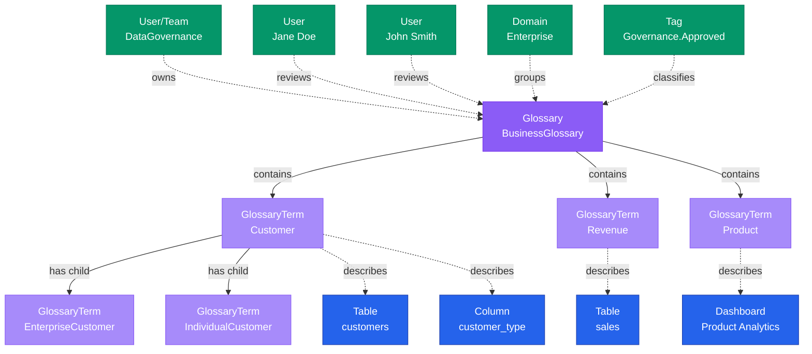

# Glossary

**Business vocabulary containers - organizing and standardizing business terminology**

---

## Overview

The **Glossary** entity represents a container for organizing business terms and definitions. It provides a structured way to manage business vocabulary, ensuring consistent understanding of terms across the organization.

## Relationship Diagram



---

## Schema Specifications

View the complete Glossary schema in your preferred format:

=== "JSON Schema"

    **Complete JSON Schema Definition**

    ```json
    {
      "$id": "https://open-metadata.org/schema/entity/data/glossary.json",
      "$schema": "http://json-schema.org/draft-07/schema#",
      "title": "Glossary",
      "description": "A `Glossary` is a collection of hierarchical `GlossaryTerm` entities that define business concepts and terminology.",
      "type": "object",
      "javaType": "org.openmetadata.schema.entity.data.Glossary",

      "definitions": {
        "mutuallyExclusive": {
          "description": "Glossary terms in this glossary are mutually exclusive",
          "type": "boolean",
          "default": false
        }
      },

      "properties": {
        "id": {
          "description": "Unique identifier",
          "$ref": "../../type/basic.json#/definitions/uuid"
        },
        "name": {
          "description": "Glossary name",
          "$ref": "../../type/basic.json#/definitions/entityName"
        },
        "fullyQualifiedName": {
          "description": "Fully qualified name of the glossary",
          "$ref": "../../type/basic.json#/definitions/fullyQualifiedEntityName"
        },
        "displayName": {
          "description": "Display name",
          "type": "string"
        },
        "description": {
          "description": "Markdown description of the glossary purpose",
          "$ref": "../../type/basic.json#/definitions/markdown"
        },
        "terms": {
          "description": "Terms in this glossary",
          "type": "array",
          "items": {
            "$ref": "../../type/entityReference.json"
          }
        },
        "owner": {
          "description": "Owner (user or team)",
          "$ref": "../../type/entityReference.json"
        },
        "domain": {
          "description": "Data domain",
          "$ref": "../../type/entityReference.json"
        },
        "tags": {
          "description": "Classification tags",
          "type": "array",
          "items": {
            "$ref": "../../type/tagLabel.json"
          }
        },
        "reviewers": {
          "description": "Users or teams that can review and approve glossary term changes",
          "type": "array",
          "items": {
            "$ref": "../../type/entityReference.json"
          }
        },
        "mutuallyExclusive": {
          "$ref": "#/definitions/mutuallyExclusive"
        },
        "version": {
          "description": "Metadata version",
          "$ref": "../../type/entityHistory.json#/definitions/entityVersion"
        }
      },

      "required": ["id", "name", "description"]
    }
    ```

    **[View Full JSON Schema →](https://github.com/open-metadata/OpenMetadataStandards/blob/main/schemas/entity/data/glossary.json)**

=== "RDF"

    **RDF/OWL Ontology Definition**

    ```turtle
    @prefix om: <https://open-metadata.org/schema/> .
    @prefix rdfs: <http://www.w3.org/2000/01/rdf-schema#> .
    @prefix owl: <http://www.w3.org/2001/XMLSchema#> .
    @prefix xsd: <http://www.w3.org/2001/XMLSchema#> .

    # Glossary Class Definition
    om:Glossary a owl:Class ;
        rdfs:subClassOf om:GovernanceAsset ;
        rdfs:label "Glossary" ;
        rdfs:comment "A container for organizing business terminology and glossary terms" ;
        om:hierarchyLevel 1 .

    # Properties
    om:glossaryName a owl:DatatypeProperty ;
        rdfs:domain om:Glossary ;
        rdfs:range xsd:string ;
        rdfs:label "name" ;
        rdfs:comment "Name of the glossary" .

    om:fullyQualifiedName a owl:DatatypeProperty ;
        rdfs:domain om:Glossary ;
        rdfs:range xsd:string ;
        rdfs:label "fullyQualifiedName" ;
        rdfs:comment "Complete name of the glossary" .

    om:mutuallyExclusive a owl:DatatypeProperty ;
        rdfs:domain om:Glossary ;
        rdfs:range xsd:boolean ;
        rdfs:label "mutuallyExclusive" ;
        rdfs:comment "Whether terms in this glossary are mutually exclusive" .

    om:hasTerm a owl:ObjectProperty ;
        rdfs:domain om:Glossary ;
        rdfs:range om:GlossaryTerm ;
        rdfs:label "hasTerm" ;
        rdfs:comment "Glossary terms in this glossary" .

    om:ownedBy a owl:ObjectProperty ;
        rdfs:domain om:Glossary ;
        rdfs:range om:Owner ;
        rdfs:label "ownedBy" ;
        rdfs:comment "User or team that owns this glossary" .

    om:hasReviewer a owl:ObjectProperty ;
        rdfs:domain om:Glossary ;
        rdfs:range om:User ;
        rdfs:label "hasReviewer" ;
        rdfs:comment "Users or teams that can review glossary terms" .

    # Example Instance
    ex:businessGlossary a om:Glossary ;
        om:glossaryName "BusinessGlossary" ;
        om:fullyQualifiedName "BusinessGlossary" ;
        om:displayName "Business Glossary" ;
        om:description "Standard business terminology for the organization" ;
        om:mutuallyExclusive false ;
        om:ownedBy ex:dataGovernanceTeam ;
        om:hasReviewer ex:janeDoe ;
        om:hasTerm ex:customerTerm ;
        om:hasTerm ex:revenueTerm .
    ```

    **[View Full RDF Ontology →](https://github.com/open-metadata/OpenMetadataStandards/blob/main/rdf/ontology/openmetadata.ttl)**

=== "JSON-LD"

    **JSON-LD Context and Example**

    ```json
    {
      "@context": {
        "@vocab": "https://open-metadata.org/schema/",
        "om": "https://open-metadata.org/schema/",
        "rdfs": "http://www.w3.org/2000/01/rdf-schema#",
        "xsd": "http://www.w3.org/2001/XMLSchema#",

        "Glossary": "om:Glossary",
        "name": {
          "@id": "om:glossaryName",
          "@type": "xsd:string"
        },
        "fullyQualifiedName": {
          "@id": "om:fullyQualifiedName",
          "@type": "xsd:string"
        },
        "displayName": {
          "@id": "om:displayName",
          "@type": "xsd:string"
        },
        "description": {
          "@id": "om:description",
          "@type": "xsd:string"
        },
        "mutuallyExclusive": {
          "@id": "om:mutuallyExclusive",
          "@type": "xsd:boolean"
        },
        "terms": {
          "@id": "om:hasTerm",
          "@type": "@id",
          "@container": "@set"
        },
        "owner": {
          "@id": "om:ownedBy",
          "@type": "@id"
        },
        "domain": {
          "@id": "om:inDomain",
          "@type": "@id"
        },
        "reviewers": {
          "@id": "om:hasReviewer",
          "@type": "@id",
          "@container": "@set"
        },
        "tags": {
          "@id": "om:hasTag",
          "@type": "@id",
          "@container": "@set"
        }
      }
    }
    ```

    **Example JSON-LD Instance**:

    ```json
    {
      "@context": "https://open-metadata.org/context/glossary.jsonld",
      "@type": "Glossary",
      "@id": "https://example.com/glossary/business",

      "name": "BusinessGlossary",
      "fullyQualifiedName": "BusinessGlossary",
      "displayName": "Business Glossary",
      "description": "# Business Glossary\n\nStandard business terminology and definitions for the organization.\n\n## Purpose\n- Ensure consistent understanding of business terms\n- Document business concepts and relationships\n- Support data governance initiatives",
      "mutuallyExclusive": false,

      "owner": {
        "@id": "https://example.com/teams/data-governance",
        "@type": "Team",
        "name": "DataGovernance",
        "displayName": "Data Governance Team"
      },

      "reviewers": [
        {
          "@id": "https://example.com/users/jane.doe",
          "@type": "User",
          "name": "jane.doe",
          "displayName": "Jane Doe"
        },
        {
          "@id": "https://example.com/users/john.smith",
          "@type": "User",
          "name": "john.smith",
          "displayName": "John Smith"
        }
      ],

      "domain": {
        "@id": "https://example.com/domains/enterprise",
        "@type": "Domain",
        "name": "Enterprise"
      },

      "tags": [
        {
          "@id": "https://open-metadata.org/tags/Governance/Approved",
          "tagFQN": "Governance.Approved"
        }
      ],

      "terms": [
        {
          "@id": "https://example.com/glossary/business/Customer",
          "@type": "GlossaryTerm",
          "fullyQualifiedName": "BusinessGlossary.Customer"
        },
        {
          "@id": "https://example.com/glossary/business/Revenue",
          "@type": "GlossaryTerm",
          "fullyQualifiedName": "BusinessGlossary.Revenue"
        }
      ]
    }
    ```

    **[View Full JSON-LD Context →](https://github.com/open-metadata/OpenMetadataStandards/blob/main/rdf/contexts/glossary.jsonld)**

---

## Use Cases

- Create domain-specific glossaries (Sales, Finance, Marketing, etc.)
- Establish organization-wide business terminology standards
- Document regulatory and compliance terminology
- Support data governance programs
- Enable self-service data discovery through business context
- Facilitate cross-team communication with shared vocabulary
- Maintain hierarchical term relationships

---

## JSON Schema Specification

### Core Properties

#### `id` (uuid)
**Type**: `string` (UUID format)
**Required**: Yes (system-generated)
**Description**: Unique identifier for this glossary instance

```json
{
  "id": "1a2b3c4d-5e6f-4a7b-8c9d-0e1f2a3b4c5d"
}
```

---

#### `name` (entityName)
**Type**: `string`
**Required**: Yes
**Pattern**: `^[^.]*$` (no dots allowed)
**Min Length**: 1
**Max Length**: 256
**Description**: Name of the glossary

```json
{
  "name": "BusinessGlossary"
}
```

---

#### `fullyQualifiedName` (fullyQualifiedEntityName)
**Type**: `string`
**Required**: Yes (system-generated)
**Pattern**: `^((?!::).)*$`
**Description**: Fully qualified name of the glossary

```json
{
  "fullyQualifiedName": "BusinessGlossary"
}
```

---

#### `displayName`
**Type**: `string`
**Required**: No
**Description**: Human-readable display name

```json
{
  "displayName": "Business Glossary"
}
```

---

#### `description` (markdown)
**Type**: `string` (Markdown format)
**Required**: Yes
**Description**: Rich text description of the glossary's purpose and scope

```json
{
  "description": "# Business Glossary\n\nStandard business terminology and definitions for the organization.\n\n## Purpose\n- Ensure consistent understanding of business terms\n- Document business concepts and relationships\n- Support data governance initiatives"
}
```

---

### Structure Properties

#### `terms[]` (GlossaryTerm[])
**Type**: `array` of GlossaryTerm references
**Required**: No
**Description**: List of glossary terms in this glossary

```json
{
  "terms": [
    {
      "id": "term-uuid-1",
      "type": "glossaryTerm",
      "name": "Customer",
      "fullyQualifiedName": "BusinessGlossary.Customer"
    },
    {
      "id": "term-uuid-2",
      "type": "glossaryTerm",
      "name": "Revenue",
      "fullyQualifiedName": "BusinessGlossary.Revenue"
    }
  ]
}
```

---

#### `mutuallyExclusive` (boolean)
**Type**: `boolean`
**Required**: No (default: false)
**Description**: Whether terms in this glossary are mutually exclusive (only one can apply)

```json
{
  "mutuallyExclusive": false
}
```

---

### Governance Properties

#### `owner` (EntityReference)
**Type**: `object`
**Required**: No
**Description**: User or team that owns this glossary

```json
{
  "owner": {
    "id": "owner-uuid",
    "type": "team",
    "name": "DataGovernance",
    "displayName": "Data Governance Team"
  }
}
```

---

#### `reviewers[]` (EntityReference[])
**Type**: `array` of User or Team references
**Required**: No
**Description**: Users or teams that can review and approve glossary term changes

```json
{
  "reviewers": [
    {
      "id": "reviewer-uuid-1",
      "type": "user",
      "name": "jane.doe",
      "displayName": "Jane Doe"
    },
    {
      "id": "reviewer-uuid-2",
      "type": "user",
      "name": "john.smith",
      "displayName": "John Smith"
    }
  ]
}
```

---

#### `domain` (EntityReference)
**Type**: `object`
**Required**: No
**Description**: Data domain this glossary belongs to

```json
{
  "domain": {
    "id": "domain-uuid",
    "type": "domain",
    "name": "Enterprise",
    "fullyQualifiedName": "Enterprise"
  }
}
```

---

#### `tags[]` (TagLabel[])
**Type**: `array`
**Required**: No
**Description**: Classification tags applied to the glossary

```json
{
  "tags": [
    {
      "tagFQN": "Governance.Approved",
      "description": "Approved by governance team",
      "source": "Classification",
      "labelType": "Manual",
      "state": "Confirmed"
    }
  ]
}
```

---

### Versioning Properties

#### `version` (entityVersion)
**Type**: `number`
**Required**: Yes (system-managed)
**Description**: Metadata version number, incremented on changes

```json
{
  "version": 1.2
}
```

---

#### `updatedAt` (timestamp)
**Type**: `integer` (Unix epoch milliseconds)
**Required**: Yes (system-managed)
**Description**: Last update timestamp

```json
{
  "updatedAt": 1704240000000
}
```

---

#### `updatedBy` (string)
**Type**: `string`
**Required**: Yes (system-managed)
**Description**: User who made the update

```json
{
  "updatedBy": "jane.doe"
}
```

---

## Complete Example

```json
{
  "id": "1a2b3c4d-5e6f-4a7b-8c9d-0e1f2a3b4c5d",
  "name": "BusinessGlossary",
  "fullyQualifiedName": "BusinessGlossary",
  "displayName": "Business Glossary",
  "description": "# Business Glossary\n\nStandard business terminology and definitions for the organization.",
  "mutuallyExclusive": false,
  "owner": {
    "id": "owner-uuid",
    "type": "team",
    "name": "DataGovernance",
    "displayName": "Data Governance Team"
  },
  "reviewers": [
    {
      "id": "reviewer-uuid-1",
      "type": "user",
      "name": "jane.doe",
      "displayName": "Jane Doe"
    }
  ],
  "domain": {
    "id": "domain-uuid",
    "type": "domain",
    "name": "Enterprise"
  },
  "tags": [
    {
      "tagFQN": "Governance.Approved"
    }
  ],
  "terms": [
    {
      "id": "term-uuid-1",
      "type": "glossaryTerm",
      "name": "Customer",
      "fullyQualifiedName": "BusinessGlossary.Customer"
    },
    {
      "id": "term-uuid-2",
      "type": "glossaryTerm",
      "name": "Revenue",
      "fullyQualifiedName": "BusinessGlossary.Revenue"
    }
  ],
  "version": 1.2,
  "updatedAt": 1704240000000,
  "updatedBy": "jane.doe"
}
```

---

## RDF Representation

### Ontology Class

```turtle
@prefix om: <https://open-metadata.org/schema/> .
@prefix rdfs: <http://www.w3.org/2000/01/rdf-schema#> .
@prefix owl: <http://www.w3.org/2001/XMLSchema#> .

om:Glossary a owl:Class ;
    rdfs:subClassOf om:GovernanceAsset ;
    rdfs:label "Glossary" ;
    rdfs:comment "A container for organizing business terminology" ;
    om:hasProperties [
        om:name "string" ;
        om:description "string" ;
        om:terms "GlossaryTerm[]" ;
        om:owner "Owner" ;
        om:reviewers "User[]" ;
        om:mutuallyExclusive "boolean" ;
    ] .
```

### Instance Example

```turtle
@prefix om: <https://open-metadata.org/schema/> .
@prefix ex: <https://example.com/glossary/> .

ex:businessGlossary a om:Glossary ;
    om:name "BusinessGlossary" ;
    om:fullyQualifiedName "BusinessGlossary" ;
    om:displayName "Business Glossary" ;
    om:description "Standard business terminology for the organization" ;
    om:mutuallyExclusive false ;
    om:ownedBy ex:dataGovernanceTeam ;
    om:hasReviewer ex:janeDoe ;
    om:hasReviewer ex:johnSmith ;
    om:hasTerm ex:customerTerm ;
    om:hasTerm ex:revenueTerm ;
    om:hasTag ex:governanceApproved .
```

---

## JSON-LD Context

```json
{
  "@context": {
    "@vocab": "https://open-metadata.org/schema/",
    "om": "https://open-metadata.org/schema/",
    "Glossary": "om:Glossary",
    "name": "om:name",
    "fullyQualifiedName": "om:fullyQualifiedName",
    "displayName": "om:displayName",
    "description": "om:description",
    "mutuallyExclusive": "om:mutuallyExclusive",
    "terms": {
      "@id": "om:hasTerm",
      "@type": "@id",
      "@container": "@set"
    },
    "owner": {
      "@id": "om:ownedBy",
      "@type": "@id"
    },
    "reviewers": {
      "@id": "om:hasReviewer",
      "@type": "@id",
      "@container": "@set"
    }
  }
}
```

### JSON-LD Example

```json
{
  "@context": "https://open-metadata.org/context/glossary.jsonld",
  "@type": "Glossary",
  "@id": "https://example.com/glossary/business",
  "name": "BusinessGlossary",
  "fullyQualifiedName": "BusinessGlossary",
  "displayName": "Business Glossary",
  "description": "Standard business terminology for the organization",
  "mutuallyExclusive": false,
  "owner": {
    "@id": "https://example.com/teams/data-governance",
    "@type": "Team"
  },
  "reviewers": [
    {
      "@id": "https://example.com/users/jane.doe",
      "@type": "User"
    }
  ],
  "terms": [
    {
      "@id": "https://example.com/glossary/business/Customer",
      "@type": "GlossaryTerm"
    }
  ]
}
```

---

## Relationships

### Child Entities
- **GlossaryTerm**: Terms defined in this glossary

### Associated Entities
- **Owner**: User or team owning this glossary
- **Reviewer**: Users or teams that can review terms
- **Domain**: Business domain assignment
- **Tag**: Classification tags

---

## Custom Properties

This entity supports custom properties through the `extension` field.
Common custom properties include:

- **Data Classification**: Sensitivity level
- **Cost Center**: Billing allocation
- **Retention Period**: Data retention requirements
- **Application Owner**: Owning application/team

See [Custom Properties](../metadata-specifications/custom-properties.md)
for details on defining and using custom properties.

---

## API Operations

### List Glossaries

```http
GET /v1/glossaries
Query Parameters:
  - fields: Fields to include (owners, tags, reviewers, usageCount, termCount, domains, extension)
  - limit: Number of results (1-1000000, default 10)
  - before: Cursor for previous page
  - after: Cursor for next page
  - include: all | deleted | non-deleted (default: non-deleted)

Response: GlossaryList
```

**Example Request**:

```http
GET /v1/glossaries?fields=owners,termCount,reviewers&limit=20
```

---

### Create Glossary

```http
POST /v1/glossaries
Content-Type: application/json

{
  "name": "BusinessGlossary",
  "displayName": "Business Glossary",
  "description": "# Business Glossary\n\nStandard business terminology and definitions for enterprise-wide consistency.",
  "owner": {
    "id": "team-uuid",
    "type": "team"
  },
  "reviewers": [
    {
      "id": "user-uuid-1",
      "type": "user"
    },
    {
      "id": "user-uuid-2",
      "type": "user"
    }
  ],
  "tags": [
    {"tagFQN": "Governance.Approved"},
    {"tagFQN": "BusinessCritical"}
  ],
  "domain": {
    "id": "domain-uuid",
    "type": "domain"
  },
  "mutuallyExclusive": false
}

Response: Glossary
```

---

### Get Glossary by Name

```http
GET /v1/glossaries/name/{name}
Query Parameters:
  - fields: Fields to include (owners, tags, reviewers, usageCount, termCount, domains)
  - include: all | deleted | non-deleted (default: non-deleted)

Response: Glossary
```

**Example Request**:

```http
GET /v1/glossaries/name/BusinessGlossary?fields=owners,termCount,reviewers
```

---

### Get Glossary by FQN

```http
GET /v1/glossaries/name/{fqn}
Query Parameters:
  - fields: Fields to include
  - include: all | deleted | non-deleted (default: non-deleted)

Response: Glossary
```

---

### Get Glossary by ID

```http
GET /v1/glossaries/{id}
Query Parameters:
  - fields: Fields to include
  - include: all | deleted | non-deleted (default: non-deleted)

Response: Glossary
```

---

### Update Glossary (Partial)

```http
PATCH /v1/glossaries/{id}
Content-Type: application/json-patch+json

[
  {
    "op": "add",
    "path": "/reviewers/-",
    "value": {
      "id": "new-reviewer-uuid",
      "type": "user"
    }
  },
  {
    "op": "replace",
    "path": "/description",
    "value": "Updated glossary description"
  },
  {
    "op": "add",
    "path": "/tags/-",
    "value": {"tagFQN": "Governance.Published"}
  }
]

Response: Glossary
```

---

### Create or Update Glossary

```http
PUT /v1/glossaries
Content-Type: application/json

{
  "name": "BusinessGlossary",
  "displayName": "Business Glossary",
  "description": "Standard business terminology",
  "owner": {
    "id": "team-uuid",
    "type": "team"
  }
}

Response: Glossary
```

---

### Delete Glossary

```http
DELETE /v1/glossaries/{id}
Query Parameters:
  - hardDelete: true | false (default: false - soft delete)
  - recursive: true | false (default: false)

Response: Glossary
```

---

### Delete Glossary (Async)

```http
DELETE /v1/glossaries/async/{id}
Query Parameters:
  - hardDelete: true | false (default: false)
  - recursive: true | false (default: false)

Response: Async deletion job details
```

---

### Export Glossary

```http
GET /v1/glossaries/name/{name}/export

Response: CSV file with glossary terms
```

---

### Export Glossary (Async)

```http
GET /v1/glossaries/name/{name}/exportAsync

Response: Async export job details
```

---

### Get CSV Documentation

```http
GET /v1/glossaries/documentation/csv

Response: CSV template documentation
```

---

### Import Glossary

```http
PUT /v1/glossaries/name/{name}/import
Content-Type: multipart/form-data

file: [CSV file with glossary terms]
dryRun: false

Response: Import result
```

---

### Import Glossary (Async)

```http
PUT /v1/glossaries/name/{name}/importAsync
Content-Type: multipart/form-data

file: [CSV file with glossary terms]
dryRun: false

Response: Async import job details
```

---

### Get Glossary Version

```http
GET /v1/glossaries/{id}/versions/{version}

Response: Glossary (specific version)
```

---

### Get Glossary Versions

```http
GET /v1/glossaries/{id}/versions

Response: EntityHistory (all versions)
```

---

### Restore Glossary

```http
PUT /v1/glossaries/restore
Content-Type: application/json

{
  "id": "glossary-uuid"
}

Response: Glossary (restored)
```

---

### Vote on Glossary

```http
PUT /v1/glossaries/{id}/vote
Content-Type: application/json

{
  "vote": "upvote"
}

Response: ChangeEvent
```

---

## Related Documentation

- **[GlossaryTerm](glossary-term.md)** - Individual business terms
- **[Classification](classification.md)** - Tag hierarchies
- **[Domain](../domains/domain.md)** - Business domains
- **[Governance](overview.md)** - Governance framework
