# Metric

**Business metrics and KPIs - tracking organizational performance**

---

## Overview

The **Metric** entity represents business metrics, key performance indicators (KPIs), and quantitative measures used to track organizational performance. It captures metric definitions, calculation logic, source data, targets, and relationships to dashboards and business concepts. Metrics bridge the gap between raw data and business outcomes, providing a standardized way to measure success across the organization.

**Hierarchy**:


---

## Relationships

Metric has comprehensive relationships with entities across the metadata platform:

```mermaid
graph TD
    subgraph Metric Definition
        M[Metric:<br/>Monthly Recurring Revenue]
    end

    subgraph Calculation Source
        M -.->|calculated from| T1[Table:<br/>subscriptions]
        M -.->|uses column| C1[Column:<br/>subscription_amount]
        M -.->|uses column| C2[Column:<br/>subscription_date]
        M -.->|uses column| C3[Column:<br/>subscription_status]

        M -.->|has SQL| SQL[SQL Expression:<br/>SUM CASE WHEN...]
        M -.->|defined in code| CODE[Code:<br/>metric_definition.sql]
    end

    subgraph Related Metrics
        M -.->|related to| M1[Metric:<br/>Annual Recurring Revenue]
        M -.->|related to| M2[Metric:<br/>Customer Churn Rate]
        M -.->|parent of| M3[Metric:<br/>MRR Growth Rate]
    end

    subgraph Visualization & Display
        M -.->|displayed in| D1[Dashboard:<br/>Revenue Dashboard]
        M -.->|displayed in| D2[Dashboard:<br/>Executive Summary]
        M -.->|visualized in| CH1[Chart:<br/>MRR Trend Line]
        M -.->|visualized in| CH2[Chart:<br/>MRR by Region]
    end

    subgraph Business Context
        M -.->|defined by| GT1[GlossaryTerm:<br/>Revenue]
        M -.->|defined by| GT2[GlossaryTerm:<br/>Subscription]
        M -.->|in domain| DOM[Domain:<br/>Finance]
    end

    subgraph Ownership & Governance
        M -.->|owned by| O1[Team:<br/>Finance Team]
        M -.->|certified by| O2[User:<br/>cfo]
        M -.->|has tags| TAG1[Tag:<br/>Tier.Gold]
        M -.->|has tags| TAG2[Tag:<br/>Executive]
        M -.->|has tags| TAG3[Tag:<br/>Financial]
    end

    subgraph Targets & Thresholds
        M -.->|has target| TGT[Target:<br/>$1M/month]
        M -.->|has threshold| THR1[Threshold:<br/>Warning < $800K]
        M -.->|has threshold| THR2[Threshold:<br/>Critical < $600K]
    end

    subgraph Upstream Data
        P1[Pipeline:<br/>subscription_etl] -.->|feeds| T1
        P2[Pipeline:<br/>revenue_aggregation] -.->|calculates| T1
    end

    subgraph Quality & Validation
        Q1[TestCase:<br/>metric_accuracy] -.->|validates| M
        Q2[TestCase:<br/>data_freshness] -.->|validates| T1
    end

    subgraph Usage
        U1[User:<br/>executives] -.->|monitors| M
        U2[User:<br/>analysts] -.->|analyzes| M
        R1[Report:<br/>Monthly Board Report] -.->|includes| M
    end

    style M fill:#f59e0b,color:#fff,stroke:#d97706,stroke-width:3px
    style T1 fill:#764ba2,color:#fff
    style C1 fill:#9b59b6,color:#fff
    style C2 fill:#9b59b6,color:#fff
    style C3 fill:#9b59b6,color:#fff
    style SQL fill:#34495e,color:#fff
    style CODE fill:#34495e,color:#fff
    style M1 fill:#fb923c,color:#fff
    style M2 fill:#fb923c,color:#fff
    style M3 fill:#fb923c,color:#fff
    style D1 fill:#4facfe,color:#fff
    style D2 fill:#4facfe,color:#fff
    style CH1 fill:#00f2fe,color:#333
    style CH2 fill:#00f2fe,color:#333
    style GT1 fill:#ffd700,color:#333
    style GT2 fill:#ffd700,color:#333
    style DOM fill:#fa709a,color:#fff
    style O1 fill:#43e97b,color:#fff
    style O2 fill:#43e97b,color:#fff
    style TAG1 fill:#f093fb,color:#fff
    style TAG2 fill:#f093fb,color:#fff
    style TAG3 fill:#f093fb,color:#fff
    style TGT fill:#22c55e,color:#fff
    style THR1 fill:#eab308,color:#333
    style THR2 fill:#ef4444,color:#fff
    style P1 fill:#f5576c,color:#fff
    style P2 fill:#f5576c,color:#fff
    style Q1 fill:#9b59b6,color:#fff
    style Q2 fill:#9b59b6,color:#fff
    style U1 fill:#ff6b6b,color:#fff
    style U2 fill:#ff6b6b,color:#fff
    style R1 fill:#ff6b6b,color:#fff
```



**Relationship Types**:

- **Solid lines (→)**: Hierarchical containment (Domain contains Metric, Metric powers visualizations)
- **Dashed lines (-.->)**: References and associations (ownership, governance, data sources, usage, lineage, quality)

---

### Parent Entities
- **Domain**: Business domain organizing metrics

### Child Entities
- **Metric**: Child metrics (e.g., growth rates derived from base metrics)

### Associated Entities
- **Owner**: User or team owning this metric
- **Domain**: Business domain assignment
- **Tag**: Classification tags
- **GlossaryTerm**: Business terminology defining the metric
- **Table**: Source tables used in calculation
- **Column**: Specific columns used in calculation
- **Dashboard**: Dashboards displaying this metric
- **Chart**: Charts visualizing this metric
- **Pipeline**: ETL pipelines feeding source data
- **User**: Users monitoring this metric
- **Report**: Reports including this metric
- **TestCase**: Data quality tests validating metric accuracy

---

## Schema Specifications

View the complete Metric schema in your preferred format:

=== "JSON Schema"

    **Complete JSON Schema Definition**

    ```json
    {
      "$id": "https://open-metadata.org/schema/entity/data/metrics.json",
      "$schema": "http://json-schema.org/draft-07/schema#",
      "title": "Metric",
      "description": "This schema defines the Metrics entity. `Metrics` are measurements computed from data such as `Monthly Active Users`. Some of the metrics that measures used to determine performance against an objective are called KPIs or Key Performance Indicators, such as `User Retention`.",
      "$comment": "@om-entity-type",
      "type": "object",
      "javaType": "org.openmetadata.schema.entity.data.Metric",
      "javaInterfaces": ["org.openmetadata.schema.EntityInterface"],

      "definitions": {
        "metricExpression": {
          "type": "object",
          "properties": {
            "language": {
              "javaType": "org.openmetadata.schema.type.MetricExpressionLanguage",
              "description": "This schema defines the type of the language used for Metric Expression Code.",
              "type": "string",
              "enum": [
                "SQL",
                "Java",
                "JavaScript",
                "Python",
                "External"
              ]
            },
            "code": {
              "javaType": "org.openmetadata.schema.type.MetricExpressionCode",
              "description": "This schema defines the type of the language used for Metric Formula's Code.",
              "type": "string"
            }
          },
          "additionalProperties": false
        },
        "metricType": {
          "javaType": "org.openmetadata.schema.type.MetricType",
          "description": "This schema defines the type of Metric.",
          "type": "string",
          "enum": [
            "COUNT",
            "SUM",
            "AVERAGE",
            "RATIO",
            "PERCENTAGE",
            "MIN",
            "MAX",
            "MEDIAN",
            "MODE",
            "STANDARD_DEVIATION",
            "VARIANCE",
            "OTHER"
          ]
        },
        "unitOfMeasurement": {
          "javaType": "org.openmetadata.schema.type.MetricUnitOfMeasurement",
          "description": "This schema defines the type of Metric's unit of measurement.",
          "type": "string",
          "enum": [
            "COUNT",
            "DOLLARS",
            "PERCENTAGE",
            "TIMESTAMP",
            "SIZE",
            "REQUESTS",
            "EVENTS",
            "TRANSACTIONS",
            "OTHER"
          ]
        },
        "metricGranularity": {
          "javaType": "org.openmetadata.schema.type.MetricGranularity",
          "description": "This schema defines the type of Metric's granularity.",
          "type": "string",
          "enum": [
            "SECOND",
            "MINUTE",
            "HOUR",
            "DAY",
            "WEEK",
            "MONTH",
            "QUARTER",
            "YEAR"
          ]
        }
      },

      "properties": {
        "id": {
          "description": "Unique identifier that identifies this Metric instance.",
          "$ref": "../../type/basic.json#/definitions/uuid"
        },
        "name": {
          "description": "Name that identifies this Metric instance uniquely.",
          "$ref": "../../type/basic.json#/definitions/entityName"
        },
        "fullyQualifiedName": {
          "description": "A unique name that identifies a metric in the format 'ServiceName.MetricName'.",
          "$ref": "../../type/basic.json#/definitions/fullyQualifiedEntityName"
        },
        "displayName": {
          "description": "Display Name that identifies this metric.",
          "type": "string"
        },
        "description": {
          "description": "Description of metrics instance, what it is, and how to use it.",
          "$ref": "../../type/basic.json#/definitions/markdown"
        },
        "metricExpression": {
          "description": "Expression used to compute the metric.",
          "$ref": "#/definitions/metricExpression"
        },
        "metricType": {
          "description": "Type of the metric.",
          "$ref": "#/definitions/metricType"
        },
        "unitOfMeasurement": {
          "description": "Unit of measurement for the metric.",
          "$ref": "#/definitions/unitOfMeasurement"
        },
        "customUnitOfMeasurement": {
          "description": "Custom unit of measurement when unitOfMeasurement is OTHER.",
          "type": "string"
        },
        "granularity": {
          "description": "Metric's granularity.",
          "$ref": "#/definitions/metricGranularity"
        },
        "relatedMetrics": {
          "description": "Related Metrics.",
          "$ref": "../../type/entityReferenceList.json"
        },
        "version": {
          "description": "Metadata version of the entity.",
          "$ref": "../../type/entityHistory.json#/definitions/entityVersion"
        },
        "updatedAt": {
          "description": "Last update time corresponding to the new version of the entity in Unix epoch time milliseconds.",
          "$ref": "../../type/basic.json#/definitions/timestamp"
        },
        "updatedBy": {
          "description": "User who made the update.",
          "type": "string"
        },
        "impersonatedBy": {
          "description": "Bot user that performed the action on behalf of the actual user.",
          "$ref": "../../type/basic.json#/definitions/impersonatedBy"
        },
        "href": {
          "description": "Link to the resource corresponding to this entity.",
          "$ref": "../../type/basic.json#/definitions/href"
        },
        "owners": {
          "description": "Owners of this metrics.",
          "$ref": "../../type/entityReferenceList.json"
        },
        "reviewers": {
          "description": "Reviewers of this Metric.",
          "$ref": "../../type/entityReferenceList.json"
        },
        "followers": {
          "description": "Followers of this API Collection.",
          "$ref": "../../type/entityReferenceList.json"
        },
        "tags": {
          "description": "Tags for this chart.",
          "type": "array",
          "items": {
            "$ref": "../../type/tagLabel.json"
          },
          "default": []
        },
        "changeDescription": {
          "description": "Change that lead to this version of the entity.",
          "$ref": "../../type/entityHistory.json#/definitions/changeDescription"
        },
        "incrementalChangeDescription": {
          "description": "Change that lead to this version of the entity.",
          "$ref": "../../type/entityHistory.json#/definitions/changeDescription"
        },
        "deleted": {
          "description": "When `true` indicates the entity has been soft deleted.",
          "type": "boolean",
          "default": false
        },
        "domains": {
          "description": "Domains the Glossary belongs to.",
          "$ref": "../../type/entityReferenceList.json"
        },
        "dataProducts": {
          "description": "List of data products this entity is part of.",
          "$ref" : "../../type/entityReferenceList.json"
        },
        "votes": {
          "description": "Votes on the entity.",
          "$ref": "../../type/votes.json"
        },
        "extension": {
          "description": "Entity extension data with custom attributes added to the entity.",
          "$ref": "../../type/basic.json#/definitions/entityExtension"
        },
        "certification": {
          "$ref": "../../type/assetCertification.json"
        },
        "entityStatus": {
          "description": "Status of the Metric.",
          "$ref": "../../type/status.json"
        }
      },

      "required": ["id", "name"],
      "additionalProperties": false
    }
    ```

    **[View Full JSON Schema →](https://github.com/open-metadata/OpenMetadataStandards/blob/main/schemas/entity/data/metric.json)**

=== "RDF"

    **RDF/OWL Ontology Definition**

    ```turtle
    @prefix om: <https://open-metadata.org/schema/> .
    @prefix rdfs: <http://www.w3.org/2000/01/rdf-schema#> .
    @prefix owl: <http://www.w3.org/2002/07/owl#> .
    @prefix xsd: <http://www.w3.org/2001/XMLSchema#> .

    # Metric Class Definition
    om:Metric a owl:Class ;
        rdfs:subClassOf om:DataAsset ;
        rdfs:label "Metric" ;
        rdfs:comment "Metrics are measurements computed from data such as Monthly Active Users. Some metrics measure performance against an objective and are called KPIs or Key Performance Indicators." ;
        om:hierarchyLevel 1 .

    # Properties
    om:metricName a owl:DatatypeProperty ;
        rdfs:domain om:Metric ;
        rdfs:range xsd:string ;
        rdfs:label "name" ;
        rdfs:comment "Name that identifies this Metric instance uniquely" .

    om:metricType a owl:DatatypeProperty ;
        rdfs:domain om:Metric ;
        rdfs:range om:MetricType ;
        rdfs:label "metricType" ;
        rdfs:comment "Type of the metric" .

    om:metricExpression a owl:ObjectProperty ;
        rdfs:domain om:Metric ;
        rdfs:range om:MetricExpression ;
        rdfs:label "metricExpression" ;
        rdfs:comment "Expression used to compute the metric" .

    om:unitOfMeasurement a owl:DatatypeProperty ;
        rdfs:domain om:Metric ;
        rdfs:range om:MetricUnitOfMeasurement ;
        rdfs:label "unitOfMeasurement" ;
        rdfs:comment "Unit of measurement for the metric" .

    om:customUnitOfMeasurement a owl:DatatypeProperty ;
        rdfs:domain om:Metric ;
        rdfs:range xsd:string ;
        rdfs:label "customUnitOfMeasurement" ;
        rdfs:comment "Custom unit of measurement when unitOfMeasurement is OTHER" .

    om:granularity a owl:DatatypeProperty ;
        rdfs:domain om:Metric ;
        rdfs:range om:MetricGranularity ;
        rdfs:label "granularity" ;
        rdfs:comment "Metric's granularity" .

    om:relatedMetric a owl:ObjectProperty ;
        rdfs:domain om:Metric ;
        rdfs:range om:Metric ;
        rdfs:label "relatedMetric" ;
        rdfs:comment "Related Metrics" .

    om:hasOwner a owl:ObjectProperty ;
        rdfs:domain om:Metric ;
        rdfs:range om:EntityReference ;
        rdfs:label "owners" ;
        rdfs:comment "Owners of this metrics" .

    om:hasReviewer a owl:ObjectProperty ;
        rdfs:domain om:Metric ;
        rdfs:range om:EntityReference ;
        rdfs:label "reviewers" ;
        rdfs:comment "Reviewers of this Metric" .

    om:hasFollower a owl:ObjectProperty ;
        rdfs:domain om:Metric ;
        rdfs:range om:EntityReference ;
        rdfs:label "followers" ;
        rdfs:comment "Followers of this Metric" .

    om:inDomain a owl:ObjectProperty ;
        rdfs:domain om:Metric ;
        rdfs:range om:Domain ;
        rdfs:label "domains" ;
        rdfs:comment "Domains the Metric belongs to" .

    om:inDataProduct a owl:ObjectProperty ;
        rdfs:domain om:Metric ;
        rdfs:range om:DataProduct ;
        rdfs:label "dataProducts" ;
        rdfs:comment "List of data products this entity is part of" .

    om:hasCertification a owl:ObjectProperty ;
        rdfs:domain om:Metric ;
        rdfs:range om:AssetCertification ;
        rdfs:label "certification" ;
        rdfs:comment "Asset certification for this metric" .

    om:hasVotes a owl:ObjectProperty ;
        rdfs:domain om:Metric ;
        rdfs:range om:Votes ;
        rdfs:label "votes" ;
        rdfs:comment "Votes on the entity" .

    om:entityStatus a owl:DatatypeProperty ;
        rdfs:domain om:Metric ;
        rdfs:range om:Status ;
        rdfs:label "entityStatus" ;
        rdfs:comment "Status of the Metric" .

    # Metric Expression Class
    om:MetricExpression a owl:Class ;
        rdfs:label "MetricExpression" ;
        rdfs:comment "Expression used to compute the metric" .

    om:expressionLanguage a owl:DatatypeProperty ;
        rdfs:domain om:MetricExpression ;
        rdfs:range om:MetricExpressionLanguage ;
        rdfs:label "language" ;
        rdfs:comment "Language used for Metric Expression Code" .

    om:expressionCode a owl:DatatypeProperty ;
        rdfs:domain om:MetricExpression ;
        rdfs:range xsd:string ;
        rdfs:label "code" ;
        rdfs:comment "Code for the metric expression" .

    # Metric Type Enumeration
    om:MetricType a owl:Class ;
        owl:oneOf (
            om:MetricType_COUNT
            om:MetricType_SUM
            om:MetricType_AVERAGE
            om:MetricType_RATIO
            om:MetricType_PERCENTAGE
            om:MetricType_MIN
            om:MetricType_MAX
            om:MetricType_MEDIAN
            om:MetricType_MODE
            om:MetricType_STANDARD_DEVIATION
            om:MetricType_VARIANCE
            om:MetricType_OTHER
        ) .

    # Unit of Measurement Enumeration
    om:MetricUnitOfMeasurement a owl:Class ;
        owl:oneOf (
            om:UnitOfMeasurement_COUNT
            om:UnitOfMeasurement_DOLLARS
            om:UnitOfMeasurement_PERCENTAGE
            om:UnitOfMeasurement_TIMESTAMP
            om:UnitOfMeasurement_SIZE
            om:UnitOfMeasurement_REQUESTS
            om:UnitOfMeasurement_EVENTS
            om:UnitOfMeasurement_TRANSACTIONS
            om:UnitOfMeasurement_OTHER
        ) .

    # Granularity Enumeration
    om:MetricGranularity a owl:Class ;
        owl:oneOf (
            om:Granularity_SECOND
            om:Granularity_MINUTE
            om:Granularity_HOUR
            om:Granularity_DAY
            om:Granularity_WEEK
            om:Granularity_MONTH
            om:Granularity_QUARTER
            om:Granularity_YEAR
        ) .

    # Expression Language Enumeration
    om:MetricExpressionLanguage a owl:Class ;
        owl:oneOf (
            om:ExpressionLanguage_SQL
            om:ExpressionLanguage_Java
            om:ExpressionLanguage_JavaScript
            om:ExpressionLanguage_Python
            om:ExpressionLanguage_External
        ) .

    # Example Instance
    ex:mauMetric a om:Metric ;
        om:metricName "monthly_active_users" ;
        om:fullyQualifiedName "Product.MonthlyActiveUsers" ;
        om:displayName "Monthly Active Users (MAU)" ;
        om:description "Count of unique users who performed any action in the last 30 days" ;
        om:metricType om:MetricType_COUNT ;
        om:unitOfMeasurement om:UnitOfMeasurement_COUNT ;
        om:granularity om:Granularity_MONTH ;
        om:metricExpression [
            om:expressionLanguage om:ExpressionLanguage_SQL ;
            om:expressionCode "SELECT COUNT(DISTINCT user_id) FROM user_activity WHERE activity_date >= CURRENT_DATE - INTERVAL '30 days'"
        ] ;
        om:hasOwner ex:productTeam ;
        om:inDomain ex:productDomain .
    ```

    **[View Full RDF Ontology →](https://github.com/open-metadata/OpenMetadataStandards/blob/main/rdf/ontology/openmetadata.ttl)**

=== "JSON-LD"

    **JSON-LD Context and Example**

    ```json
    {
      "@context": {
        "@vocab": "https://open-metadata.org/schema/",
        "om": "https://open-metadata.org/schema/",
        "rdfs": "http://www.w3.org/2000/01/rdf-schema#",
        "xsd": "http://www.w3.org/2001/XMLSchema#",

        "Metric": "om:Metric",
        "name": {
          "@id": "om:metricName",
          "@type": "xsd:string"
        },
        "fullyQualifiedName": {
          "@id": "om:fullyQualifiedName",
          "@type": "xsd:string"
        },
        "displayName": {
          "@id": "om:displayName",
          "@type": "xsd:string"
        },
        "description": {
          "@id": "om:description",
          "@type": "xsd:string"
        },
        "metricType": {
          "@id": "om:metricType",
          "@type": "@vocab"
        },
        "metricExpression": {
          "@id": "om:metricExpression",
          "@type": "@id"
        },
        "unitOfMeasurement": {
          "@id": "om:unitOfMeasurement",
          "@type": "@vocab"
        },
        "customUnitOfMeasurement": {
          "@id": "om:customUnitOfMeasurement",
          "@type": "xsd:string"
        },
        "granularity": {
          "@id": "om:granularity",
          "@type": "@vocab"
        },
        "relatedMetrics": {
          "@id": "om:relatedMetric",
          "@type": "@id",
          "@container": "@set"
        },
        "owners": {
          "@id": "om:hasOwner",
          "@type": "@id",
          "@container": "@set"
        },
        "reviewers": {
          "@id": "om:hasReviewer",
          "@type": "@id",
          "@container": "@set"
        },
        "followers": {
          "@id": "om:hasFollower",
          "@type": "@id",
          "@container": "@set"
        },
        "domains": {
          "@id": "om:inDomain",
          "@type": "@id",
          "@container": "@set"
        },
        "dataProducts": {
          "@id": "om:inDataProduct",
          "@type": "@id",
          "@container": "@set"
        },
        "certification": {
          "@id": "om:hasCertification",
          "@type": "@id"
        },
        "votes": {
          "@id": "om:hasVotes",
          "@type": "@id"
        },
        "entityStatus": {
          "@id": "om:entityStatus",
          "@type": "@vocab"
        }
      }
    }
    ```

    **Example JSON-LD Instance**:

    ```json
    {
      "@context": "https://open-metadata.org/context/metric.jsonld",
      "@type": "Metric",
      "@id": "https://example.com/metrics/monthly_active_users",

      "name": "monthly_active_users",
      "fullyQualifiedName": "Product.MonthlyActiveUsers",
      "displayName": "Monthly Active Users (MAU)",
      "description": "Count of unique users who performed any action in the last 30 days",
      "metricType": "COUNT",
      "granularity": "MONTH",
      "unitOfMeasurement": "COUNT",

      "metricExpression": {
        "language": "SQL",
        "code": "SELECT COUNT(DISTINCT user_id) FROM user_activity WHERE activity_date >= CURRENT_DATE - INTERVAL '30 days'"
      },

      "relatedMetrics": [
        {
          "@id": "https://example.com/metrics/daily_active_users",
          "@type": "Metric",
          "name": "daily_active_users"
        }
      ],

      "owners": [
        {
          "@id": "https://example.com/teams/product",
          "@type": "Team",
          "name": "product"
        }
      ],

      "domains": [
        {
          "@id": "https://example.com/domains/product",
          "@type": "Domain",
          "name": "Product"
        }
      ],

      "tags": [
        {
          "tagFQN": "Tier.Gold",
          "source": "Classification"
        }
      ],

      "version": 1.0,
      "updatedAt": 1704240000000,
      "updatedBy": "product.analyst"
    }
    ```

    **[View Full JSON-LD Context →](https://github.com/open-metadata/OpenMetadataStandards/blob/main/rdf/contexts/metric.jsonld)**

---

## Use Cases

- Define and catalog business metrics and KPIs across the organization
- Document metric calculation logic and data sources
- Track metric ownership and business stakeholders
- Capture lineage from source data to metrics to dashboards
- Set targets and thresholds for metric monitoring
- Enable discovery of metrics by business domain or purpose
- Link metrics to business glossary terms for standardization
- Monitor metric quality and data freshness
- Track metric changes and version history
- Support regulatory compliance with standardized metric definitions

---

## JSON Schema Specification

### Core Properties

#### `id` (uuid)
**Type**: `string` (UUID format)
**Required**: Yes (system-generated)
**Description**: Unique identifier for this metric instance

```json
{
  "id": "5e6f7a8b-9c0d-1e2f-3a4b-5c6d7e8f9a0b"
}
```

---

#### `name` (entityName)
**Type**: `string`
**Required**: Yes
**Pattern**: `^[^.]*$` (no dots allowed)
**Min Length**: 1
**Max Length**: 256
**Description**: Name of the metric (unqualified)

```json
{
  "name": "monthly_recurring_revenue"
}
```

---

#### `fullyQualifiedName` (fullyQualifiedEntityName)
**Type**: `string`
**Required**: Yes (system-generated)
**Pattern**: `^((?!::).)*$`
**Description**: Fully qualified name (e.g., `Domain.MetricName`)

```json
{
  "fullyQualifiedName": "Finance.MonthlyRecurringRevenue"
}
```

---

#### `displayName`
**Type**: `string`
**Required**: No
**Description**: Human-readable display name

```json
{
  "displayName": "Monthly Recurring Revenue (MRR)"
}
```

---

#### `description` (markdown)
**Type**: `string` (Markdown format)
**Required**: Yes
**Description**: Rich text description of the metric's purpose and calculation

```json
{
  "description": "# Monthly Recurring Revenue (MRR)\n\nTotal monthly revenue from all active subscription customers.\n\n## Calculation\nSum of subscription amounts for all active subscriptions as of the end of each month.\n\n## Business Use\nKey metric for tracking business growth and forecasting revenue.\n\n## Data Quality Notes\n- Updated daily\n- Excludes one-time charges\n- Includes only active subscriptions"
}
```

---

### Metric Configuration

#### `metricType` (MetricType enum)
**Type**: `string` enum
**Required**: No
**Allowed Values**:

- `COUNT` - Count of items
- `SUM` - Sum of values
- `AVERAGE` - Average of values
- `RATIO` - Ratio between values
- `PERCENTAGE` - Percentage value
- `MIN` - Minimum value
- `MAX` - Maximum value
- `MEDIAN` - Median value
- `MODE` - Mode value
- `STANDARD_DEVIATION` - Standard deviation
- `VARIANCE` - Variance
- `OTHER` - Other metric type

```json
{
  "metricType": "COUNT"
}
```

---

#### `granularity` (MetricGranularity enum)
**Type**: `string` enum
**Required**: No
**Allowed Values**:

- `SECOND` - Second-level granularity
- `MINUTE` - Minute-level granularity
- `HOUR` - Hour-level granularity
- `DAY` - Day-level granularity
- `WEEK` - Week-level granularity
- `MONTH` - Month-level granularity
- `QUARTER` - Quarter-level granularity
- `YEAR` - Year-level granularity

```json
{
  "granularity": "MONTH"
}
```

---

#### `unitOfMeasurement` (MetricUnitOfMeasurement enum)
**Type**: `string` enum
**Required**: No
**Allowed Values**:

- `COUNT` - Count
- `DOLLARS` - Dollars
- `PERCENTAGE` - Percentage
- `TIMESTAMP` - Timestamp
- `SIZE` - Size
- `REQUESTS` - Requests
- `EVENTS` - Events
- `TRANSACTIONS` - Transactions
- `OTHER` - Other unit

```json
{
  "unitOfMeasurement": "DOLLARS"
}
```

---

#### `customUnitOfMeasurement` (string)
**Type**: `string`
**Required**: No
**Description**: Custom unit of measurement when unitOfMeasurement is OTHER

```json
{
  "customUnitOfMeasurement": "API Calls per Second"
}
```

---

### Calculation Definition

#### `metricExpression` (MetricExpression)
**Type**: `object`
**Required**: No
**Description**: Expression used to compute the metric

**MetricExpression Properties**:

| Property | Type | Required | Description |
|----------|------|----------|-------------|
| `language` | enum | No | Language for expression code: SQL, Java, JavaScript, Python, External |
| `code` | string | No | Code for the metric expression |

```json
{
  "metricExpression": {
    "language": "SQL",
    "code": "SELECT COUNT(DISTINCT user_id) FROM user_activity WHERE activity_date >= CURRENT_DATE - INTERVAL '30 days'"
  }
}
```

---

### Related Entities

#### `relatedMetrics` (EntityReferenceList)
**Type**: `EntityReferenceList`
**Required**: No
**Description**: Related Metrics

```json
{
  "relatedMetrics": [
    {
      "id": "metric-uuid",
      "type": "metric",
      "name": "daily_active_users",
      "fullyQualifiedName": "Product.DailyActiveUsers"
    },
    {
      "id": "metric-uuid-2",
      "type": "metric",
      "name": "weekly_active_users",
      "fullyQualifiedName": "Product.WeeklyActiveUsers"
    }
  ]
}
```

---

### Governance Properties

#### `owners` (EntityReferenceList)
**Type**: `EntityReferenceList`
**Required**: No
**Description**: Owners of this metrics

```json
{
  "owners": [
    {
      "id": "owner-uuid",
      "type": "team",
      "name": "product-team",
      "displayName": "Product Team"
    }
  ]
}
```

---

#### `reviewers` (EntityReferenceList)
**Type**: `EntityReferenceList`
**Required**: No
**Description**: Reviewers of this Metric

```json
{
  "reviewers": [
    {
      "id": "reviewer-uuid",
      "type": "user",
      "name": "data.steward",
      "displayName": "Data Steward"
    }
  ]
}
```

---

#### `followers` (EntityReferenceList)
**Type**: `EntityReferenceList`
**Required**: No
**Description**: Followers of this Metric

```json
{
  "followers": [
    {
      "id": "follower-uuid",
      "type": "user",
      "name": "analyst.user",
      "displayName": "Analyst User"
    }
  ]
}
```

---

#### `domains` (EntityReferenceList)
**Type**: `EntityReferenceList`
**Required**: No
**Description**: Domains the Metric belongs to

```json
{
  "domains": [
    {
      "id": "domain-uuid",
      "type": "domain",
      "name": "Product",
      "fullyQualifiedName": "Product"
    }
  ]
}
```

---

#### `dataProducts` (EntityReferenceList)
**Type**: `EntityReferenceList`
**Required**: No
**Description**: List of data products this entity is part of

```json
{
  "dataProducts": [
    {
      "id": "dataproduct-uuid",
      "type": "dataProduct",
      "name": "UserEngagementMetrics",
      "fullyQualifiedName": "Product.UserEngagementMetrics"
    }
  ]
}
```

---

#### `tags[]` (TagLabel[])
**Type**: `array` of TagLabel
**Required**: No
**Default**: `[]`
**Description**: Tags for this metric

```json
{
  "tags": [
    {
      "tagFQN": "Tier.Gold",
      "description": "Critical business metric",
      "source": "Classification",
      "labelType": "Manual",
      "state": "Confirmed"
    },
    {
      "tagFQN": "Executive",
      "source": "Classification",
      "labelType": "Manual",
      "state": "Confirmed"
    }
  ]
}
```

---

#### `certification` (AssetCertification)
**Type**: `AssetCertification`
**Required**: No
**Description**: Asset certification for this metric

```json
{
  "certification": {
    "tagLabel": {
      "tagFQN": "Certified.Gold"
    },
    "certifiedBy": "data.governance.team",
    "certifiedAt": 1704240000000
  }
}
```

---

#### `votes` (Votes)
**Type**: `Votes`
**Required**: No
**Description**: Votes on the entity

```json
{
  "votes": {
    "upVotes": 15,
    "downVotes": 2,
    "upVoters": ["user1", "user2"],
    "downVoters": ["user3"]
  }
}
```

---

#### `entityStatus` (Status)
**Type**: `Status` enum
**Required**: No
**Description**: Status of the Metric

```json
{
  "entityStatus": "Active"
}
```

---

### System Properties

#### `version` (EntityVersion)
**Type**: `number`
**Required**: No (system-managed)
**Description**: Metadata version of the entity

```json
{
  "version": 1.5
}
```

---

#### `updatedAt` (timestamp)
**Type**: `number` (Unix epoch time milliseconds)
**Required**: No (system-managed)
**Description**: Last update time corresponding to the new version of the entity

```json
{
  "updatedAt": 1704240000000
}
```

---

#### `updatedBy` (string)
**Type**: `string`
**Required**: No (system-managed)
**Description**: User who made the update

```json
{
  "updatedBy": "product.analyst"
}
```

---

#### `impersonatedBy` (impersonatedBy)
**Type**: `impersonatedBy`
**Required**: No
**Description**: Bot user that performed the action on behalf of the actual user

```json
{
  "impersonatedBy": "automation.bot"
}
```

---

#### `href` (href)
**Type**: `string` (URI)
**Required**: No (system-generated)
**Description**: Link to the resource corresponding to this entity

```json
{
  "href": "https://example.com/api/v1/metrics/5e6f7a8b-9c0d-1e2f-3a4b-5c6d7e8f9a0b"
}
```

---

#### `changeDescription` (ChangeDescription)
**Type**: `ChangeDescription`
**Required**: No (system-managed)
**Description**: Change that lead to this version of the entity

```json
{
  "changeDescription": {
    "fieldsAdded": [],
    "fieldsUpdated": [
      {
        "name": "metricExpression",
        "oldValue": "...",
        "newValue": "..."
      }
    ],
    "fieldsDeleted": [],
    "previousVersion": 1.4
  }
}
```

---

#### `incrementalChangeDescription` (ChangeDescription)
**Type**: `ChangeDescription`
**Required**: No (system-managed)
**Description**: Incremental change that lead to this version of the entity

```json
{
  "incrementalChangeDescription": {
    "fieldsAdded": [],
    "fieldsUpdated": [],
    "fieldsDeleted": []
  }
}
```

---

#### `deleted` (boolean)
**Type**: `boolean`
**Required**: No
**Default**: `false`
**Description**: When true indicates the entity has been soft deleted

```json
{
  "deleted": false
}
```

---

#### `extension` (entityExtension)
**Type**: `object`
**Required**: No
**Description**: Entity extension data with custom attributes added to the entity

```json
{
  "extension": {
    "customField1": "value1",
    "customField2": 123
  }
}
```

---

## Complete Example

```json
{
  "id": "5e6f7a8b-9c0d-1e2f-3a4b-5c6d7e8f9a0b",
  "name": "monthly_active_users",
  "fullyQualifiedName": "Product.MonthlyActiveUsers",
  "displayName": "Monthly Active Users (MAU)",
  "description": "# Monthly Active Users (MAU)\n\nCount of unique users who performed any action in the last 30 days.",
  "metricType": "COUNT",
  "granularity": "MONTH",
  "unitOfMeasurement": "COUNT",
  "metricExpression": {
    "language": "SQL",
    "code": "SELECT COUNT(DISTINCT user_id) FROM user_activity WHERE activity_date >= CURRENT_DATE - INTERVAL '30 days'"
  },
  "relatedMetrics": [
    {
      "id": "metric-uuid-1",
      "type": "metric",
      "name": "daily_active_users",
      "fullyQualifiedName": "Product.DailyActiveUsers"
    },
    {
      "id": "metric-uuid-2",
      "type": "metric",
      "name": "weekly_active_users",
      "fullyQualifiedName": "Product.WeeklyActiveUsers"
    }
  ],
  "owners": [
    {
      "id": "owner-uuid",
      "type": "team",
      "name": "product-team",
      "displayName": "Product Team"
    }
  ],
  "reviewers": [
    {
      "id": "reviewer-uuid",
      "type": "user",
      "name": "data.steward"
    }
  ],
  "followers": [
    {
      "id": "follower-uuid-1",
      "type": "user",
      "name": "analyst.user"
    }
  ],
  "domains": [
    {
      "id": "domain-uuid",
      "type": "domain",
      "name": "Product",
      "fullyQualifiedName": "Product"
    }
  ],
  "dataProducts": [
    {
      "id": "dataproduct-uuid",
      "type": "dataProduct",
      "name": "UserEngagementMetrics"
    }
  ],
  "tags": [
    {
      "tagFQN": "Tier.Gold",
      "source": "Classification"
    },
    {
      "tagFQN": "Executive",
      "source": "Classification"
    }
  ],
  "certification": {
    "tagLabel": {
      "tagFQN": "Certified.Gold"
    }
  },
  "votes": {
    "upVotes": 15,
    "downVotes": 2
  },
  "entityStatus": "Active",
  "version": 1.5,
  "updatedAt": 1704240000000,
  "updatedBy": "product.analyst",
  "href": "https://example.com/api/v1/metrics/5e6f7a8b-9c0d-1e2f-3a4b-5c6d7e8f9a0b",
  "deleted": false
}
```

---

## Examples by Type

### Count Metric - Active Users

```json
{
  "name": "daily_active_users",
  "fullyQualifiedName": "Product.DailyActiveUsers",
  "displayName": "Daily Active Users",
  "description": "Count of unique users who performed any action in the last 24 hours",
  "metricType": "COUNT",
  "granularity": "DAY",
  "unitOfMeasurement": "COUNT",
  "metricExpression": {
    "language": "SQL",
    "code": "SELECT COUNT(DISTINCT user_id) FROM user_activity WHERE activity_date >= CURRENT_DATE - INTERVAL '1 day'"
  }
}
```

---

### Sum Metric - Revenue

```json
{
  "name": "total_revenue",
  "fullyQualifiedName": "Sales.TotalRevenue",
  "displayName": "Total Revenue",
  "description": "Total revenue from all sales transactions",
  "metricType": "SUM",
  "granularity": "DAY",
  "unitOfMeasurement": "DOLLARS",
  "metricExpression": {
    "language": "SQL",
    "code": "SELECT SUM(order_total) FROM orders WHERE order_date >= CURRENT_DATE"
  }
}
```

---

### Percentage Metric - Conversion Rate

```json
{
  "name": "conversion_rate",
  "fullyQualifiedName": "Marketing.ConversionRate",
  "displayName": "Conversion Rate",
  "description": "Percentage of website visitors who make a purchase",
  "metricType": "PERCENTAGE",
  "granularity": "WEEK",
  "unitOfMeasurement": "PERCENTAGE",
  "metricExpression": {
    "language": "SQL",
    "code": "SELECT (COUNT(DISTINCT purchase_id)::DECIMAL / COUNT(DISTINCT visitor_id)) * 100 FROM events"
  }
}
```

---

### Average Metric - Session Duration

```json
{
  "name": "avg_session_duration",
  "fullyQualifiedName": "Analytics.AverageSessionDuration",
  "displayName": "Average Session Duration",
  "description": "Average time users spend in a session",
  "metricType": "AVERAGE",
  "granularity": "DAY",
  "unitOfMeasurement": "TIMESTAMP",
  "metricExpression": {
    "language": "SQL",
    "code": "SELECT AVG(session_duration_seconds) FROM user_sessions WHERE session_date >= CURRENT_DATE"
  }
}
```

---

### Custom Unit Metric - API Throughput

```json
{
  "name": "api_throughput",
  "fullyQualifiedName": "Engineering.APIThroughput",
  "displayName": "API Throughput",
  "description": "Number of API requests processed per second",
  "metricType": "RATIO",
  "granularity": "MINUTE",
  "unitOfMeasurement": "OTHER",
  "customUnitOfMeasurement": "requests/second",
  "metricExpression": {
    "language": "Python",
    "code": "def calculate_throughput(requests, time_window):\n    return requests / time_window"
  }
}
```

---

## Custom Properties

This entity supports custom properties through the `extension` field.
Common custom properties include:

- **Data Classification**: Sensitivity level
- **Cost Center**: Billing allocation
- **Retention Period**: Data retention requirements
- **Application Owner**: Owning application/team

See [Custom Properties](../metadata-specifications/custom-properties.md)
for details on defining and using custom properties.

---

## API Operations

### Create Metric

```http
POST /api/v1/metrics
Content-Type: application/json

{
  "name": "monthly_active_users",
  "displayName": "Monthly Active Users (MAU)",
  "description": "Count of unique users who performed any action in the last 30 days",
  "metricType": "COUNT",
  "granularity": "MONTH",
  "unitOfMeasurement": "COUNT",
  "metricExpression": {
    "language": "SQL",
    "code": "SELECT COUNT(DISTINCT user_id) FROM user_activity WHERE activity_date >= CURRENT_DATE - INTERVAL '30 days'"
  }
}
```

### Get Metric

```http
GET /api/v1/metrics/name/Product.MonthlyActiveUsers?fields=relatedMetrics,owners,reviewers,followers,domains,dataProducts,certification,votes
```

### Update Metric

```http
PATCH /api/v1/metrics/{id}
Content-Type: application/json-patch+json

[
  {
    "op": "add",
    "path": "/tags/-",
    "value": {"tagFQN": "Tier.Gold"}
  },
  {
    "op": "add",
    "path": "/owners/-",
    "value": {
      "id": "team-uuid",
      "type": "team"
    }
  }
]
```

### Add Owners to Metric

```http
PUT /api/v1/metrics/{id}/owners
Content-Type: application/json

{
  "owners": [
    {
      "id": "team-uuid",
      "type": "team"
    }
  ]
}
```

### Get Metric Version History

```http
GET /api/v1/metrics/{id}/versions
```

---

## Related Documentation

- **[Dashboard](../data-assets/dashboards/dashboard.md)** - Dashboard entity specification
- **[Chart](../data-assets/dashboards/chart.md)** - Chart entity specification
- **[Table](../data-assets/databases/table.md)** - Source table specification
- **[GlossaryTerm](glossary-term.md)** - Business term definitions
- **[Domain](domain.md)** - Domain organization
- **[Lineage](../lineage/overview.md)** - Data lineage tracking
