# Metric

**Business metrics and KPIs - tracking organizational performance**

---

## Overview

The **Metric** entity represents business metrics, key performance indicators (KPIs), and quantitative measures used to track organizational performance. It captures metric definitions, calculation logic, source data, targets, and relationships to dashboards and business concepts. Metrics bridge the gap between raw data and business outcomes, providing a standardized way to measure success across the organization.

**Hierarchy**:


---

## Relationships

Metric has comprehensive relationships with entities across the metadata platform:

```mermaid
graph TD
    subgraph Metric Definition
        M[Metric:<br/>Monthly Recurring Revenue]
    end

    subgraph Calculation Source
        M -.->|calculated from| T1[Table:<br/>subscriptions]
        M -.->|uses column| C1[Column:<br/>subscription_amount]
        M -.->|uses column| C2[Column:<br/>subscription_date]
        M -.->|uses column| C3[Column:<br/>subscription_status]

        M -.->|has SQL| SQL[SQL Expression:<br/>SUM CASE WHEN...]
        M -.->|defined in code| CODE[Code:<br/>metric_definition.sql]
    end

    subgraph Related Metrics
        M -.->|related to| M1[Metric:<br/>Annual Recurring Revenue]
        M -.->|related to| M2[Metric:<br/>Customer Churn Rate]
        M -.->|parent of| M3[Metric:<br/>MRR Growth Rate]
    end

    subgraph Visualization & Display
        M -.->|displayed in| D1[Dashboard:<br/>Revenue Dashboard]
        M -.->|displayed in| D2[Dashboard:<br/>Executive Summary]
        M -.->|visualized in| CH1[Chart:<br/>MRR Trend Line]
        M -.->|visualized in| CH2[Chart:<br/>MRR by Region]
    end

    subgraph Business Context
        M -.->|defined by| GT1[GlossaryTerm:<br/>Revenue]
        M -.->|defined by| GT2[GlossaryTerm:<br/>Subscription]
        M -.->|in domain| DOM[Domain:<br/>Finance]
    end

    subgraph Ownership & Governance
        M -.->|owned by| O1[Team:<br/>Finance Team]
        M -.->|certified by| O2[User:<br/>cfo]
        M -.->|has tags| TAG1[Tag:<br/>Tier.Gold]
        M -.->|has tags| TAG2[Tag:<br/>Executive]
        M -.->|has tags| TAG3[Tag:<br/>Financial]
    end

    subgraph Targets & Thresholds
        M -.->|has target| TGT[Target:<br/>$1M/month]
        M -.->|has threshold| THR1[Threshold:<br/>Warning < $800K]
        M -.->|has threshold| THR2[Threshold:<br/>Critical < $600K]
    end

    subgraph Upstream Data
        P1[Pipeline:<br/>subscription_etl] -.->|feeds| T1
        P2[Pipeline:<br/>revenue_aggregation] -.->|calculates| T1
    end

    subgraph Quality & Validation
        Q1[TestCase:<br/>metric_accuracy] -.->|validates| M
        Q2[TestCase:<br/>data_freshness] -.->|validates| T1
    end

    subgraph Usage
        U1[User:<br/>executives] -.->|monitors| M
        U2[User:<br/>analysts] -.->|analyzes| M
        R1[Report:<br/>Monthly Board Report] -.->|includes| M
    end

    style M fill:#f59e0b,color:#fff,stroke:#d97706,stroke-width:3px
    style T1 fill:#764ba2,color:#fff
    style C1 fill:#9b59b6,color:#fff
    style C2 fill:#9b59b6,color:#fff
    style C3 fill:#9b59b6,color:#fff
    style SQL fill:#34495e,color:#fff
    style CODE fill:#34495e,color:#fff
    style M1 fill:#fb923c,color:#fff
    style M2 fill:#fb923c,color:#fff
    style M3 fill:#fb923c,color:#fff
    style D1 fill:#4facfe,color:#fff
    style D2 fill:#4facfe,color:#fff
    style CH1 fill:#00f2fe,color:#333
    style CH2 fill:#00f2fe,color:#333
    style GT1 fill:#ffd700,color:#333
    style GT2 fill:#ffd700,color:#333
    style DOM fill:#fa709a,color:#fff
    style O1 fill:#43e97b,color:#fff
    style O2 fill:#43e97b,color:#fff
    style TAG1 fill:#f093fb,color:#fff
    style TAG2 fill:#f093fb,color:#fff
    style TAG3 fill:#f093fb,color:#fff
    style TGT fill:#22c55e,color:#fff
    style THR1 fill:#eab308,color:#333
    style THR2 fill:#ef4444,color:#fff
    style P1 fill:#f5576c,color:#fff
    style P2 fill:#f5576c,color:#fff
    style Q1 fill:#9b59b6,color:#fff
    style Q2 fill:#9b59b6,color:#fff
    style U1 fill:#ff6b6b,color:#fff
    style U2 fill:#ff6b6b,color:#fff
    style R1 fill:#ff6b6b,color:#fff
```



**Relationship Types**:

- **Solid lines (→)**: Hierarchical containment (Domain contains Metric, Metric powers visualizations)
- **Dashed lines (-.->)**: References and associations (ownership, governance, data sources, usage, lineage, quality)

---

### Parent Entities
- **Domain**: Business domain organizing metrics

### Child Entities
- **Metric**: Child metrics (e.g., growth rates derived from base metrics)

### Associated Entities
- **Owner**: User or team owning this metric
- **Domain**: Business domain assignment
- **Tag**: Classification tags
- **GlossaryTerm**: Business terminology defining the metric
- **Table**: Source tables used in calculation
- **Column**: Specific columns used in calculation
- **Dashboard**: Dashboards displaying this metric
- **Chart**: Charts visualizing this metric
- **Pipeline**: ETL pipelines feeding source data
- **User**: Users monitoring this metric
- **Report**: Reports including this metric
- **TestCase**: Data quality tests validating metric accuracy

---

## Schema Specifications

View the complete Metric schema in your preferred format:

=== "JSON Schema"

    **Complete JSON Schema Definition**

    ```json
    {
      "$id": "https://open-metadata.org/schema/entity/data/metric.json",
      "$schema": "http://json-schema.org/draft-07/schema#",
      "title": "Metric",
      "description": "A `Metric` represents a business metric or KPI used to measure organizational performance.",
      "type": "object",
      "javaType": "org.openmetadata.schema.entity.data.Metric",

      "definitions": {
        "metricType": {
          "description": "Type of metric",
          "type": "string",
          "enum": [
            "COUNT", "SUM", "AVERAGE", "PERCENTAGE", "RATIO",
            "DURATION", "CURRENCY", "SCORE", "OTHER"
          ]
        },
        "metricGranularity": {
          "description": "Time granularity for the metric",
          "type": "string",
          "enum": [
            "HOURLY", "DAILY", "WEEKLY", "MONTHLY",
            "QUARTERLY", "YEARLY", "REAL_TIME"
          ]
        },
        "metricTarget": {
          "description": "Target or goal for the metric",
          "type": "object",
          "properties": {
            "value": {
              "description": "Target value",
              "type": "number"
            },
            "targetType": {
              "description": "Type of target",
              "type": "string",
              "enum": ["MINIMUM", "MAXIMUM", "EXACT", "RANGE"]
            },
            "startDate": {
              "description": "Target start date",
              "type": "string",
              "format": "date-time"
            },
            "endDate": {
              "description": "Target end date",
              "type": "string",
              "format": "date-time"
            }
          },
          "required": ["value", "targetType"]
        }
      },

      "properties": {
        "id": {
          "description": "Unique identifier",
          "$ref": "../../type/basic.json#/definitions/uuid"
        },
        "name": {
          "description": "Metric name",
          "$ref": "../../type/basic.json#/definitions/entityName"
        },
        "fullyQualifiedName": {
          "description": "Fully qualified name",
          "$ref": "../../type/basic.json#/definitions/fullyQualifiedEntityName"
        },
        "displayName": {
          "description": "Display name",
          "type": "string"
        },
        "description": {
          "description": "Markdown description",
          "$ref": "../../type/basic.json#/definitions/markdown"
        },
        "metricType": {
          "$ref": "#/definitions/metricType"
        },
        "granularity": {
          "$ref": "#/definitions/metricGranularity"
        },
        "unitOfMeasurement": {
          "description": "Unit of measurement (USD, %, count, etc.)",
          "type": "string"
        },
        "formula": {
          "description": "Calculation formula or expression",
          "type": "string"
        },
        "sql": {
          "description": "SQL query to calculate the metric",
          "type": "string"
        },
        "tables": {
          "description": "Source tables used in calculation",
          "type": "array",
          "items": {
            "$ref": "../../type/entityReference.json"
          }
        },
        "columns": {
          "description": "Source columns used in calculation",
          "type": "array",
          "items": {
            "$ref": "../../type/entityReference.json"
          }
        },
        "relatedMetrics": {
          "description": "Related metrics",
          "type": "array",
          "items": {
            "$ref": "../../type/entityReference.json"
          }
        },
        "dashboards": {
          "description": "Dashboards displaying this metric",
          "type": "array",
          "items": {
            "$ref": "../../type/entityReference.json"
          }
        },
        "charts": {
          "description": "Charts visualizing this metric",
          "type": "array",
          "items": {
            "$ref": "../../type/entityReference.json"
          }
        },
        "targets": {
          "description": "Metric targets or goals",
          "type": "array",
          "items": {
            "$ref": "#/definitions/metricTarget"
          }
        },
        "owner": {
          "description": "Owner (user or team)",
          "$ref": "../../type/entityReference.json"
        },
        "domain": {
          "description": "Data domain",
          "$ref": "../../type/entityReference.json"
        },
        "tags": {
          "description": "Classification tags",
          "type": "array",
          "items": {
            "$ref": "../../type/tagLabel.json"
          }
        },
        "glossaryTerms": {
          "description": "Business glossary terms",
          "type": "array",
          "items": {
            "$ref": "../../type/entityReference.json"
          }
        },
        "version": {
          "description": "Metadata version",
          "$ref": "../../type/entityHistory.json#/definitions/entityVersion"
        }
      },

      "required": ["id", "name", "metricType", "description"]
    }
    ```

    **[View Full JSON Schema →](https://github.com/open-metadata/OpenMetadataStandards/blob/main/schemas/entity/data/metric.json)**

=== "RDF"

    **RDF/OWL Ontology Definition**

    ```turtle
    @prefix om: <https://open-metadata.org/schema/> .
    @prefix rdfs: <http://www.w3.org/2000/01/rdf-schema#> .
    @prefix owl: <http://www.w3.org/2001/XMLSchema#> .
    @prefix xsd: <http://www.w3.org/2001/XMLSchema#> .

    # Metric Class Definition
    om:Metric a owl:Class ;
        rdfs:subClassOf om:DataAsset ;
        rdfs:label "Metric" ;
        rdfs:comment "A business metric or KPI measuring organizational performance" ;
        om:hierarchyLevel 1 .

    # Properties
    om:metricName a owl:DatatypeProperty ;
        rdfs:domain om:Metric ;
        rdfs:range xsd:string ;
        rdfs:label "name" ;
        rdfs:comment "Name of the metric" .

    om:metricType a owl:DatatypeProperty ;
        rdfs:domain om:Metric ;
        rdfs:range om:MetricType ;
        rdfs:label "metricType" ;
        rdfs:comment "Type: COUNT, SUM, AVERAGE, PERCENTAGE, etc." .

    om:metricFormula a owl:DatatypeProperty ;
        rdfs:domain om:Metric ;
        rdfs:range xsd:string ;
        rdfs:label "formula" ;
        rdfs:comment "Calculation formula or expression" .

    om:metricSQL a owl:DatatypeProperty ;
        rdfs:domain om:Metric ;
        rdfs:range xsd:string ;
        rdfs:label "sql" ;
        rdfs:comment "SQL query to calculate the metric" .

    om:unitOfMeasurement a owl:DatatypeProperty ;
        rdfs:domain om:Metric ;
        rdfs:range xsd:string ;
        rdfs:label "unitOfMeasurement" ;
        rdfs:comment "Unit (USD, %, count, etc.)" .

    om:usesTable a owl:ObjectProperty ;
        rdfs:domain om:Metric ;
        rdfs:range om:Table ;
        rdfs:label "usesTable" ;
        rdfs:comment "Source tables used in calculation" .

    om:usesColumn a owl:ObjectProperty ;
        rdfs:domain om:Metric ;
        rdfs:range om:Column ;
        rdfs:label "usesColumn" ;
        rdfs:comment "Source columns used in calculation" .

    om:displayedInDashboard a owl:ObjectProperty ;
        rdfs:domain om:Metric ;
        rdfs:range om:Dashboard ;
        rdfs:label "displayedInDashboard" ;
        rdfs:comment "Dashboards displaying this metric" .

    om:visualizedInChart a owl:ObjectProperty ;
        rdfs:domain om:Metric ;
        rdfs:range om:Chart ;
        rdfs:label "visualizedInChart" ;
        rdfs:comment "Charts visualizing this metric" .

    om:relatedMetric a owl:ObjectProperty ;
        rdfs:domain om:Metric ;
        rdfs:range om:Metric ;
        rdfs:label "relatedMetric" ;
        rdfs:comment "Related metrics" .

    om:hasTarget a owl:ObjectProperty ;
        rdfs:domain om:Metric ;
        rdfs:range om:MetricTarget ;
        rdfs:label "hasTarget" ;
        rdfs:comment "Target or goal for this metric" .

    # Metric Type Enumeration
    om:MetricType a owl:Class ;
        owl:oneOf (
            om:MetricType_COUNT
            om:MetricType_SUM
            om:MetricType_AVERAGE
            om:MetricType_PERCENTAGE
            om:MetricType_RATIO
            om:MetricType_CURRENCY
        ) .

    # Example Instance
    ex:mrrMetric a om:Metric ;
        om:metricName "monthly_recurring_revenue" ;
        om:fullyQualifiedName "Finance.MonthlyRecurringRevenue" ;
        om:displayName "Monthly Recurring Revenue (MRR)" ;
        om:metricType om:MetricType_CURRENCY ;
        om:unitOfMeasurement "USD" ;
        om:metricFormula "SUM(subscription_amount) WHERE subscription_status = 'active'" ;
        om:usesTable ex:subscriptionsTable ;
        om:usesColumn ex:subscriptionAmountColumn ;
        om:displayedInDashboard ex:revenueDashboard ;
        om:ownedBy ex:financeTeam ;
        om:inDomain ex:financeDomain .
    ```

    **[View Full RDF Ontology →](https://github.com/open-metadata/OpenMetadataStandards/blob/main/rdf/ontology/openmetadata.ttl)**

=== "JSON-LD"

    **JSON-LD Context and Example**

    ```json
    {
      "@context": {
        "@vocab": "https://open-metadata.org/schema/",
        "om": "https://open-metadata.org/schema/",
        "rdfs": "http://www.w3.org/2000/01/rdf-schema#",
        "xsd": "http://www.w3.org/2001/XMLSchema#",

        "Metric": "om:Metric",
        "name": {
          "@id": "om:metricName",
          "@type": "xsd:string"
        },
        "fullyQualifiedName": {
          "@id": "om:fullyQualifiedName",
          "@type": "xsd:string"
        },
        "displayName": {
          "@id": "om:displayName",
          "@type": "xsd:string"
        },
        "description": {
          "@id": "om:description",
          "@type": "xsd:string"
        },
        "metricType": {
          "@id": "om:metricType",
          "@type": "@vocab"
        },
        "formula": {
          "@id": "om:metricFormula",
          "@type": "xsd:string"
        },
        "sql": {
          "@id": "om:metricSQL",
          "@type": "xsd:string"
        },
        "unitOfMeasurement": {
          "@id": "om:unitOfMeasurement",
          "@type": "xsd:string"
        },
        "tables": {
          "@id": "om:usesTable",
          "@type": "@id",
          "@container": "@set"
        },
        "columns": {
          "@id": "om:usesColumn",
          "@type": "@id",
          "@container": "@set"
        },
        "dashboards": {
          "@id": "om:displayedInDashboard",
          "@type": "@id",
          "@container": "@set"
        },
        "charts": {
          "@id": "om:visualizedInChart",
          "@type": "@id",
          "@container": "@set"
        },
        "relatedMetrics": {
          "@id": "om:relatedMetric",
          "@type": "@id",
          "@container": "@set"
        },
        "owner": {
          "@id": "om:ownedBy",
          "@type": "@id"
        },
        "domain": {
          "@id": "om:inDomain",
          "@type": "@id"
        }
      }
    }
    ```

    **Example JSON-LD Instance**:

    ```json
    {
      "@context": "https://open-metadata.org/context/metric.jsonld",
      "@type": "Metric",
      "@id": "https://example.com/metrics/monthly_recurring_revenue",

      "name": "monthly_recurring_revenue",
      "fullyQualifiedName": "Finance.MonthlyRecurringRevenue",
      "displayName": "Monthly Recurring Revenue (MRR)",
      "description": "# Monthly Recurring Revenue\n\nTotal monthly revenue from active subscriptions.",
      "metricType": "CURRENCY",
      "granularity": "MONTHLY",
      "unitOfMeasurement": "USD",
      "formula": "SUM(subscription_amount) WHERE subscription_status = 'active'",

      "tables": [
        {
          "@id": "https://example.com/tables/subscriptions",
          "@type": "Table",
          "fullyQualifiedName": "postgres_prod.finance.subscriptions"
        }
      ],

      "columns": [
        {
          "@id": "https://example.com/columns/subscription_amount",
          "@type": "Column",
          "fullyQualifiedName": "postgres_prod.finance.subscriptions.subscription_amount"
        }
      ],

      "dashboards": [
        {
          "@id": "https://example.com/dashboards/revenue_dashboard",
          "@type": "Dashboard",
          "name": "revenue_dashboard"
        }
      ],

      "owner": {
        "@id": "https://example.com/teams/finance",
        "@type": "Team",
        "name": "finance"
      },

      "domain": {
        "@id": "https://example.com/domains/finance",
        "@type": "Domain",
        "name": "Finance"
      },

      "targets": [
        {
          "value": 1000000,
          "targetType": "MINIMUM",
          "startDate": "2024-01-01T00:00:00Z",
          "endDate": "2024-12-31T23:59:59Z"
        }
      ]
    }
    ```

    **[View Full JSON-LD Context →](https://github.com/open-metadata/OpenMetadataStandards/blob/main/rdf/contexts/metric.jsonld)**

---

## Use Cases

- Define and catalog business metrics and KPIs across the organization
- Document metric calculation logic and data sources
- Track metric ownership and business stakeholders
- Capture lineage from source data to metrics to dashboards
- Set targets and thresholds for metric monitoring
- Enable discovery of metrics by business domain or purpose
- Link metrics to business glossary terms for standardization
- Monitor metric quality and data freshness
- Track metric changes and version history
- Support regulatory compliance with standardized metric definitions

---

## JSON Schema Specification

### Core Properties

#### `id` (uuid)
**Type**: `string` (UUID format)
**Required**: Yes (system-generated)
**Description**: Unique identifier for this metric instance

```json
{
  "id": "5e6f7a8b-9c0d-1e2f-3a4b-5c6d7e8f9a0b"
}
```

---

#### `name` (entityName)
**Type**: `string`
**Required**: Yes
**Pattern**: `^[^.]*$` (no dots allowed)
**Min Length**: 1
**Max Length**: 256
**Description**: Name of the metric (unqualified)

```json
{
  "name": "monthly_recurring_revenue"
}
```

---

#### `fullyQualifiedName` (fullyQualifiedEntityName)
**Type**: `string`
**Required**: Yes (system-generated)
**Pattern**: `^((?!::).)*$`
**Description**: Fully qualified name (e.g., `Domain.MetricName`)

```json
{
  "fullyQualifiedName": "Finance.MonthlyRecurringRevenue"
}
```

---

#### `displayName`
**Type**: `string`
**Required**: No
**Description**: Human-readable display name

```json
{
  "displayName": "Monthly Recurring Revenue (MRR)"
}
```

---

#### `description` (markdown)
**Type**: `string` (Markdown format)
**Required**: Yes
**Description**: Rich text description of the metric's purpose and calculation

```json
{
  "description": "# Monthly Recurring Revenue (MRR)\n\nTotal monthly revenue from all active subscription customers.\n\n## Calculation\nSum of subscription amounts for all active subscriptions as of the end of each month.\n\n## Business Use\nKey metric for tracking business growth and forecasting revenue.\n\n## Data Quality Notes\n- Updated daily\n- Excludes one-time charges\n- Includes only active subscriptions"
}
```

---

### Metric Configuration

#### `metricType` (MetricType enum)
**Type**: `string` enum
**Required**: Yes
**Allowed Values**:

- `COUNT` - Count of items
- `SUM` - Sum of values
- `AVERAGE` - Average of values
- `PERCENTAGE` - Percentage value
- `RATIO` - Ratio between values
- `DURATION` - Time duration
- `CURRENCY` - Monetary value
- `SCORE` - Score or rating
- `OTHER` - Other metric type

```json
{
  "metricType": "CURRENCY"
}
```

---

#### `granularity` (MetricGranularity enum)
**Type**: `string` enum
**Required**: No
**Allowed Values**:

- `HOURLY` - Hourly metric
- `DAILY` - Daily metric
- `WEEKLY` - Weekly metric
- `MONTHLY` - Monthly metric
- `QUARTERLY` - Quarterly metric
- `YEARLY` - Yearly metric
- `REAL_TIME` - Real-time metric

```json
{
  "granularity": "MONTHLY"
}
```

---

#### `unitOfMeasurement` (string)
**Type**: `string`
**Required**: No
**Description**: Unit of measurement (USD, %, count, seconds, etc.)

```json
{
  "unitOfMeasurement": "USD"
}
```

---

### Calculation Definition

#### `formula` (string)
**Type**: `string`
**Required**: No
**Description**: Business formula or expression for calculating the metric

```json
{
  "formula": "SUM(subscription_amount) WHERE subscription_status = 'active'"
}
```

---

#### `sql` (string)
**Type**: `string`
**Required**: No
**Description**: SQL query to calculate the metric

```json
{
  "sql": "SELECT SUM(subscription_amount) AS mrr\nFROM subscriptions\nWHERE subscription_status = 'active'\n  AND DATE_TRUNC('month', subscription_date) = DATE_TRUNC('month', CURRENT_DATE)"
}
```

---

### Data Source Properties

#### `tables[]` (Table[])
**Type**: `array` of Table entity references
**Required**: No
**Description**: Source tables used in metric calculation

```json
{
  "tables": [
    {
      "id": "table-uuid",
      "type": "table",
      "name": "subscriptions",
      "fullyQualifiedName": "postgres_prod.finance.subscriptions"
    },
    {
      "id": "table-uuid-2",
      "type": "table",
      "name": "customers",
      "fullyQualifiedName": "postgres_prod.finance.customers"
    }
  ]
}
```

---

#### `columns[]` (Column[])
**Type**: `array` of Column entity references
**Required**: No
**Description**: Specific columns used in metric calculation

```json
{
  "columns": [
    {
      "id": "column-uuid",
      "type": "column",
      "name": "subscription_amount",
      "fullyQualifiedName": "postgres_prod.finance.subscriptions.subscription_amount"
    },
    {
      "id": "column-uuid-2",
      "type": "column",
      "name": "subscription_status",
      "fullyQualifiedName": "postgres_prod.finance.subscriptions.subscription_status"
    }
  ]
}
```

---

### Related Entities

#### `relatedMetrics[]` (Metric[])
**Type**: `array` of Metric entity references
**Required**: No
**Description**: Related or derived metrics

```json
{
  "relatedMetrics": [
    {
      "id": "metric-uuid",
      "type": "metric",
      "name": "annual_recurring_revenue",
      "fullyQualifiedName": "Finance.AnnualRecurringRevenue"
    },
    {
      "id": "metric-uuid-2",
      "type": "metric",
      "name": "mrr_growth_rate",
      "fullyQualifiedName": "Finance.MRRGrowthRate"
    }
  ]
}
```

---

#### `dashboards[]` (Dashboard[])
**Type**: `array` of Dashboard entity references
**Required**: No
**Description**: Dashboards displaying this metric

```json
{
  "dashboards": [
    {
      "id": "dashboard-uuid",
      "type": "dashboard",
      "name": "revenue_dashboard",
      "fullyQualifiedName": "tableau_prod.revenue_dashboard"
    }
  ]
}
```

---

#### `charts[]` (Chart[])
**Type**: `array` of Chart entity references
**Required**: No
**Description**: Charts visualizing this metric

```json
{
  "charts": [
    {
      "id": "chart-uuid",
      "type": "chart",
      "name": "mrr_trend",
      "fullyQualifiedName": "tableau_prod.revenue_dashboard.mrr_trend"
    }
  ]
}
```

---

### Targets and Thresholds

#### `targets[]` (MetricTarget[])
**Type**: `array` of MetricTarget objects
**Required**: No
**Description**: Metric targets or goals

**MetricTarget Object**:

| Property | Type | Required | Description |
|----------|------|----------|-------------|
| `value` | number | Yes | Target value |
| `targetType` | enum | Yes | MINIMUM, MAXIMUM, EXACT, RANGE |
| `startDate` | datetime | No | Target start date |
| `endDate` | datetime | No | Target end date |

```json
{
  "targets": [
    {
      "value": 1000000,
      "targetType": "MINIMUM",
      "startDate": "2024-01-01T00:00:00Z",
      "endDate": "2024-12-31T23:59:59Z"
    },
    {
      "value": 1500000,
      "targetType": "MAXIMUM",
      "startDate": "2024-01-01T00:00:00Z",
      "endDate": "2024-12-31T23:59:59Z"
    }
  ]
}
```

---

### Governance Properties

#### `owner` (EntityReference)
**Type**: `object`
**Required**: No
**Description**: User or team that owns this metric

```json
{
  "owner": {
    "id": "owner-uuid",
    "type": "team",
    "name": "finance-team",
    "displayName": "Finance Team"
  }
}
```

---

#### `domain` (EntityReference)
**Type**: `object`
**Required**: No
**Description**: Data domain this metric belongs to

```json
{
  "domain": {
    "id": "domain-uuid",
    "type": "domain",
    "name": "Finance",
    "fullyQualifiedName": "Finance"
  }
}
```

---

#### `tags[]` (TagLabel[])
**Type**: `array`
**Required**: No
**Description**: Classification tags applied to the metric

```json
{
  "tags": [
    {
      "tagFQN": "Tier.Gold",
      "description": "Critical business metric",
      "source": "Classification",
      "labelType": "Manual",
      "state": "Confirmed"
    },
    {
      "tagFQN": "Executive",
      "source": "Classification",
      "labelType": "Manual",
      "state": "Confirmed"
    }
  ]
}
```

---

#### `glossaryTerms[]` (GlossaryTerm[])
**Type**: `array`
**Required**: No
**Description**: Business glossary terms linked to this metric

```json
{
  "glossaryTerms": [
    {
      "fullyQualifiedName": "BusinessGlossary.Revenue"
    },
    {
      "fullyQualifiedName": "BusinessGlossary.Subscription"
    }
  ]
}
```

---

## Complete Example

```json
{
  "id": "5e6f7a8b-9c0d-1e2f-3a4b-5c6d7e8f9a0b",
  "name": "monthly_recurring_revenue",
  "fullyQualifiedName": "Finance.MonthlyRecurringRevenue",
  "displayName": "Monthly Recurring Revenue (MRR)",
  "description": "# Monthly Recurring Revenue (MRR)\n\nTotal monthly revenue from all active subscription customers.",
  "metricType": "CURRENCY",
  "granularity": "MONTHLY",
  "unitOfMeasurement": "USD",
  "formula": "SUM(subscription_amount) WHERE subscription_status = 'active'",
  "sql": "SELECT SUM(subscription_amount) AS mrr FROM subscriptions WHERE subscription_status = 'active'",
  "tables": [
    {
      "id": "table-uuid",
      "type": "table",
      "name": "subscriptions",
      "fullyQualifiedName": "postgres_prod.finance.subscriptions"
    }
  ],
  "columns": [
    {
      "id": "column-uuid",
      "type": "column",
      "name": "subscription_amount",
      "fullyQualifiedName": "postgres_prod.finance.subscriptions.subscription_amount"
    }
  ],
  "relatedMetrics": [
    {
      "id": "metric-uuid",
      "type": "metric",
      "name": "annual_recurring_revenue"
    }
  ],
  "dashboards": [
    {
      "id": "dashboard-uuid",
      "type": "dashboard",
      "name": "revenue_dashboard"
    }
  ],
  "targets": [
    {
      "value": 1000000,
      "targetType": "MINIMUM",
      "startDate": "2024-01-01T00:00:00Z",
      "endDate": "2024-12-31T23:59:59Z"
    }
  ],
  "owner": {
    "id": "owner-uuid",
    "type": "team",
    "name": "finance-team"
  },
  "domain": {
    "id": "domain-uuid",
    "type": "domain",
    "name": "Finance"
  },
  "tags": [
    {"tagFQN": "Tier.Gold"},
    {"tagFQN": "Executive"}
  ],
  "glossaryTerms": [
    {"fullyQualifiedName": "BusinessGlossary.Revenue"}
  ],
  "version": 1.5,
  "updatedAt": 1704240000000,
  "updatedBy": "finance.analyst"
}
```

---

## Examples by Type

### Revenue Metric

```json
{
  "name": "total_revenue",
  "fullyQualifiedName": "Sales.TotalRevenue",
  "displayName": "Total Revenue",
  "description": "Total revenue from all sales transactions",
  "metricType": "CURRENCY",
  "granularity": "DAILY",
  "unitOfMeasurement": "USD",
  "formula": "SUM(order_total)",
  "sql": "SELECT SUM(order_total) FROM orders WHERE order_date >= CURRENT_DATE",
  "tables": [
    {
      "type": "table",
      "fullyQualifiedName": "postgres_prod.sales.orders"
    }
  ]
}
```

---

### Customer Count Metric

```json
{
  "name": "active_customers",
  "fullyQualifiedName": "Customer.ActiveCustomers",
  "displayName": "Active Customers",
  "description": "Count of customers with activity in the last 30 days",
  "metricType": "COUNT",
  "granularity": "DAILY",
  "unitOfMeasurement": "count",
  "formula": "COUNT(DISTINCT customer_id) WHERE last_activity_date >= CURRENT_DATE - 30",
  "tables": [
    {
      "type": "table",
      "fullyQualifiedName": "postgres_prod.crm.customers"
    }
  ]
}
```

---

### Conversion Rate Metric

```json
{
  "name": "conversion_rate",
  "fullyQualifiedName": "Marketing.ConversionRate",
  "displayName": "Conversion Rate",
  "description": "Percentage of website visitors who make a purchase",
  "metricType": "PERCENTAGE",
  "granularity": "WEEKLY",
  "unitOfMeasurement": "%",
  "formula": "(purchases / visitors) * 100",
  "sql": "SELECT (COUNT(DISTINCT purchase_id)::DECIMAL / COUNT(DISTINCT visitor_id)) * 100 FROM events",
  "tables": [
    {
      "type": "table",
      "fullyQualifiedName": "postgres_prod.analytics.events"
    }
  ],
  "targets": [
    {
      "value": 3.5,
      "targetType": "MINIMUM"
    }
  ]
}
```

---

### Customer Lifetime Value (CLV)

```json
{
  "name": "customer_lifetime_value",
  "fullyQualifiedName": "Finance.CustomerLifetimeValue",
  "displayName": "Customer Lifetime Value (CLV)",
  "description": "Average total revenue expected from a customer over their lifetime",
  "metricType": "CURRENCY",
  "granularity": "MONTHLY",
  "unitOfMeasurement": "USD",
  "formula": "AVG(total_customer_revenue)",
  "sql": "SELECT AVG(total_revenue) FROM customer_revenue_summary",
  "relatedMetrics": [
    {
      "type": "metric",
      "name": "customer_acquisition_cost"
    }
  ]
}
```

---

## Custom Properties

This entity supports custom properties through the `extension` field.
Common custom properties include:

- **Data Classification**: Sensitivity level
- **Cost Center**: Billing allocation
- **Retention Period**: Data retention requirements
- **Application Owner**: Owning application/team

See [Custom Properties](../metadata-specifications/custom-properties.md)
for details on defining and using custom properties.

---

## API Operations

### Create Metric

```http
POST /api/v1/metrics
Content-Type: application/json

{
  "name": "monthly_recurring_revenue",
  "displayName": "Monthly Recurring Revenue (MRR)",
  "description": "Total monthly revenue from active subscriptions",
  "metricType": "CURRENCY",
  "granularity": "MONTHLY",
  "unitOfMeasurement": "USD",
  "formula": "SUM(subscription_amount) WHERE subscription_status = 'active'"
}
```

### Get Metric

```http
GET /api/v1/metrics/name/Finance.MonthlyRecurringRevenue?fields=tables,columns,dashboards,owner,targets
```

### Update Metric

```http
PATCH /api/v1/metrics/{id}
Content-Type: application/json-patch+json

[
  {
    "op": "add",
    "path": "/tags/-",
    "value": {"tagFQN": "Tier.Gold"}
  },
  {
    "op": "add",
    "path": "/targets/-",
    "value": {
      "value": 1000000,
      "targetType": "MINIMUM"
    }
  }
]
```

### Link Metric to Dashboard

```http
PUT /api/v1/metrics/{id}/dashboards
Content-Type: application/json

{
  "dashboards": [
    {
      "id": "dashboard-uuid",
      "type": "dashboard"
    }
  ]
}
```

### Get Metric Lineage

```http
GET /api/v1/metrics/{id}/lineage?upstreamDepth=3&downstreamDepth=2
```

---

## Related Documentation

- **[Dashboard](../data-assets/dashboards/dashboard.md)** - Dashboard entity specification
- **[Chart](../data-assets/dashboards/chart.md)** - Chart entity specification
- **[Table](../data-assets/databases/table.md)** - Source table specification
- **[GlossaryTerm](glossary-term.md)** - Business term definitions
- **[Domain](domain.md)** - Domain organization
- **[Lineage](../lineage/overview.md)** - Data lineage tracking
