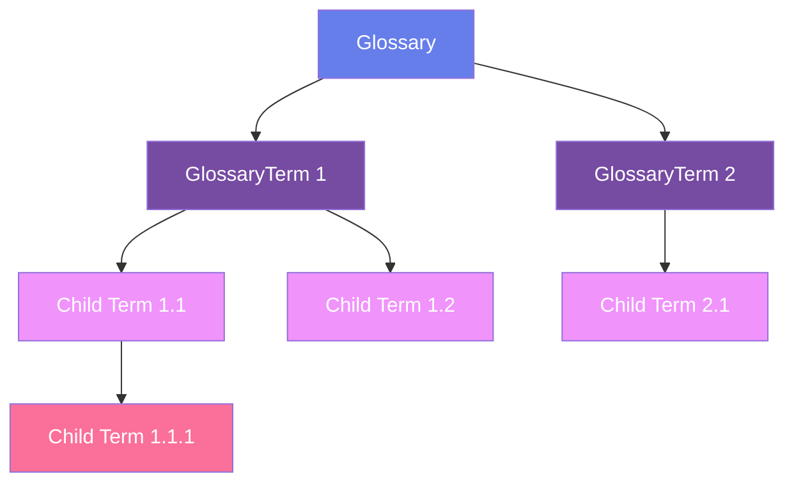
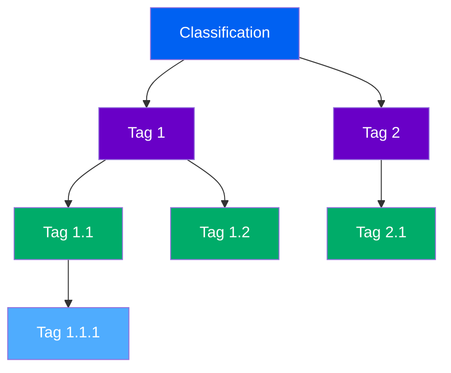
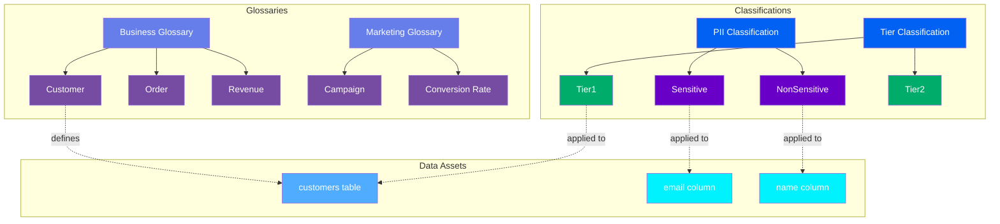

# Governance Assets

**Business vocabulary and classification systems for data governance**

Governance assets in OpenMetadata provide the foundation for organizing, standardizing, and controlling business terminology and data classifications. The governance framework consists of two parallel hierarchies: Glossaries for business vocabulary and Classifications for data tagging.

---

## Hierarchy Overview

OpenMetadata governance uses two complementary hierarchies:

### Glossary Hierarchy



### Classification Hierarchy



---

## Why This Hierarchy?

### Glossary
**Purpose**: Container for organizing business terms and definitions

A Glossary is a collection of business terms that define concepts, processes, and entities used across your organization. Glossaries provide a controlled vocabulary that ensures everyone speaks the same language when discussing data.

**Examples**:

- `BusinessGlossary` - Core business terminology
- `FinanceGlossary` - Financial terms and metrics
- `MarketingGlossary` - Marketing campaign and segment definitions
- `RegulatoryGlossary` - Compliance and legal terminology

**Why needed**: Organizations often have thousands of data assets but lack a common understanding of business concepts. Different teams may use different names for the same concept (e.g., "customer" vs. "client" vs. "account"). Glossaries establish the single source of truth for business definitions.

**Key Features**:

- **Reviewers**: Designated users who approve term changes
- **Mutually Exclusive Terms**: Option to enforce that only one term can apply
- **Domain Assignment**: Link glossary to business domains
- **Ownership**: Team or user responsible for maintaining the glossary

[**View Glossary Specification →**](glossary.md){ .md-button }

---

### GlossaryTerm
**Purpose**: Individual business concept with definition and relationships

A GlossaryTerm represents a single business concept with its formal definition, synonyms, related terms, and references. Terms can have parent-child relationships to create hierarchical taxonomies.

**Examples**:

- `Customer` - "An individual or organization that purchases products or services"
- `MonthlyRecurringRevenue` - "Revenue that recurs every month from subscriptions"
- `ChurnRate` - "Percentage of customers who cancel in a given period"

**Why needed**: Terms provide the atomic unit of business vocabulary. Each term documents:
- **Formal Definition**: What the term means
- **Synonyms**: Alternative names used in different contexts
- **Related Terms**: Connections to other business concepts
- **Asset Links**: Tables, columns, or dashboards using this term
- **References**: Documentation or standards that define the term

**Hierarchical Structure**: Terms can be nested to create taxonomies:
```
CustomerSegment (parent)
├── EnterpriseCustomer (child)
├── SMBCustomer (child)
└── IndividualCustomer (child)
```

[**View GlossaryTerm Specification →**](glossary-term.md){ .md-button }

---

### Classification
**Purpose**: System for organizing and applying tags to data assets

A Classification is a category system that contains tags for labeling data assets. Classifications enable governance policies like access control, data quality rules, and retention policies based on data characteristics.

**Examples**:

- `PII` - Personal Identifiable Information classification
- `DataQuality` - Quality assessment tags
- `Tier` - Data importance levels
- `Sensitivity` - Data sensitivity classifications

**Why needed**: Tags enable:
- **Access Control**: Restrict access based on sensitivity tags
- **Compliance**: Mark data requiring special handling (GDPR, HIPAA, etc.)
- **Quality Management**: Track data quality levels
- **Lifecycle Management**: Define retention and archival policies

**Mutually Exclusive**: Classifications can enforce that only one tag from the set can be applied (e.g., Tier 1, Tier 2, or Tier 3 - not multiple).

[**View Classification Specification →**](classification.md){ .md-button }

---

### Tag
**Purpose**: Individual label that can be applied to data assets

A Tag is a label within a Classification that can be attached to tables, columns, dashboards, and other data assets. Tags flow through lineage, enabling automatic propagation of governance metadata.

**Examples**:

- `PII.Sensitive` - Contains sensitive personal information
- `PII.NonSensitive` - Contains non-sensitive personal information
- `Tier.Tier1` - Critical business data
- `Tier.Tier2` - Important business data

**Why needed**: Tags provide the mechanism to:
- **Label Data**: Mark assets with governance metadata
- **Enforce Policies**: Apply rules based on tags (e.g., mask PII columns)
- **Track Lineage**: See how sensitive data flows through pipelines
- **Enable Discovery**: Filter and find assets by governance attributes

**Hierarchical Structure**: Tags can be nested within classifications:
```
PII (classification)
├── Sensitive (tag)
│   ├── Email (tag)
│   └── SSN (tag)
└── NonSensitive (tag)
    ├── Name (tag)
    └── ZipCode (tag)
```

[**View Tag Specification →**](tag.md){ .md-button }

---

## Common Patterns

### Pattern 1: Business Glossary Structure
```
Business Glossary → Customer (term)
                 → Revenue (term) → AnnualRecurringRevenue (child term)
                                  → MonthlyRecurringRevenue (child term)
                 → Churn (term)
```

Organize business concepts hierarchically with parent-child relationships.

### Pattern 2: Data Classification System
```
PII Classification → Sensitive (tag) → Email (tag)
                                    → SSN (tag)
                  → NonSensitive (tag) → Name (tag)
                                      → ZipCode (tag)
```

Create nested tag hierarchies for fine-grained governance.

### Pattern 3: Domain-Specific Glossaries
```
Finance Glossary → EBITDA (term)
                 → CashFlow (term)

Marketing Glossary → ConversionRate (term)
                   → CustomerLifetimeValue (term)

Engineering Glossary → Uptime (term)
                     → Latency (term)
```

Multiple glossaries for different business domains or teams.

---

## Real-World Example

Here's how an e-commerce company implements governance:



**Governance Implementation**:

1. **Business Glossary**:
   - Defines key business concepts like "Customer", "Order", "Revenue"
   - Marketing team maintains separate glossary for campaign terminology
   - Terms link to actual data assets (tables, dashboards)

2. **PII Classification**:
   - "Sensitive" tags applied to email, SSN, phone numbers
   - "NonSensitive" tags applied to names, zip codes
   - Enables automated masking and access control policies

3. **Tier Classification**:
   - "Tier1" marks critical business data requiring high availability
   - "Tier2" marks important data with standard SLAs
   - Drives backup, replication, and monitoring policies

4. **Integration**:
   - Glossary terms define what data means
   - Classification tags control how data is handled
   - Both flow through lineage automatically

---

## Glossary vs Classification

Understanding when to use each:

| Aspect | Glossary | Classification |
|--------|----------|----------------|
| **Purpose** | Define business concepts | Categorize and label data |
| **Content** | Definitions, synonyms, relationships | Tags for governance policies |
| **Applied To** | Can be associated with assets | Directly tagged to assets |
| **Hierarchy** | Parent-child terms | Parent-child tags |
| **Use Case** | Business understanding | Policy enforcement |
| **Example** | "What is a Customer?" | "This column contains PII" |
| **Mutability** | Definitions evolve slowly | Tags change as data evolves |
| **Ownership** | Business analysts, domain experts | Data governance team |

**Best Practice**: Use glossaries to establish shared business vocabulary and classifications to implement governance policies.

---

## Comprehensive Governance Example

A financial services company's complete governance structure:

```mermaid
graph TB
    subgraph "Business Context (Glossaries)"
        BG[Business Glossary]
        FG[Finance Glossary]
        CG[Compliance Glossary]

        BG --> BT1[Customer]
        BG --> BT2[Account]

        FG --> FT1[Asset Under Management]
        FG --> FT2[Net Asset Value]

        CG --> CT1[KYC]
        CG --> CT2[AML Check]

        BT1 --> BT1A[Retail Customer]
        BT1 --> BT1B[Institutional Customer]
    end

    subgraph "Data Control (Classifications)"
        PC[PII Classification]
        DC[Data Tier Classification]
        RC[Regulatory Classification]

        PC --> PT1[Sensitive PII]
        PC --> PT2[Standard PII]

        DC --> DT1[Tier 1 - Critical]
        DC --> DT2[Tier 2 - Important]
        DC --> DT3[Tier 3 - Standard]

        RC --> RT1[GDPR]
        RC --> RT2[SOX]
        RC --> RT3[FINRA]
    end

    subgraph "Data Assets"
        T1[customer_profiles table]
        T2[transactions table]
        T3[account_balances table]

        C1[ssn column]
        C2[email column]
        C3[name column]
    end

    BT1 -.->|defines| T1
    FT2 -.->|defines| T3

    PT1 -.->|applied to| C1
    PT2 -.->|applied to| C2
    DT1 -.->|applied to| T1
    DT1 -.->|applied to| T3
    RT1 -.->|applied to| T1
    RT2 -.->|applied to| T3

    style BG fill:#667eea,color:#fff
    style FG fill:#667eea,color:#fff
    style CG fill:#667eea,color:#fff
    style PC fill:#0061f2,color:#fff
    style DC fill:#0061f2,color:#fff
    style RC fill:#0061f2,color:#fff
    style T1 fill:#4facfe,color:#fff
    style T2 fill:#4facfe,color:#fff
    style T3 fill:#4facfe,color:#fff
```



**Implementation**:

1. **Glossaries** establish shared vocabulary across teams
2. **Classifications** enforce governance policies
3. **Tags** flow through lineage automatically
4. **Policies** trigger based on tags (access control, masking, retention)
5. **Ownership** assigned at glossary and classification levels

**Benefits**:

- Automated policy enforcement based on tags
- Consistent business definitions across the organization
- Regulatory compliance through classification tracking
- Impact analysis through term-to-asset relationships

---

## Entity Specifications

Each entity in the governance framework has complete specifications:

| Entity | Description | Specification |
|--------|-------------|---------------|
| **Glossary** | Business vocabulary container | [View Spec](glossary.md) |
| **GlossaryTerm** | Individual business concept | [View Spec](glossary-term.md) |
| **Classification** | Tag category system | [View Spec](classification.md) |
| **Tag** | Individual data label | [View Spec](tag.md) |

Each specification includes:
- Complete field reference
- JSON Schema definition
- RDF/OWL ontology representation
- JSON-LD context and examples
- Real-world use cases
- API operations

---

## Governance Best Practices

### 1. Start with Core Glossaries
Begin with a single business glossary containing 20-30 essential terms. Expand gradually as teams adopt the framework.

### 2. Align Classifications with Policies
Create classifications that map directly to governance policies (PII for masking, Tier for SLAs, Retention for archival).

### 3. Establish Ownership
Assign reviewers to glossaries and owners to classifications. Clear ownership ensures quality and consistency.

### 4. Link Terms to Assets
Connect glossary terms to actual tables and columns. This bridges business and technical metadata.

### 5. Automate Tag Propagation
Use lineage to propagate tags automatically. When a source column has a PII tag, derived columns inherit it.

### 6. Review Regularly
Schedule quarterly reviews of glossaries and classifications to ensure they remain current and relevant.

---

## Next Steps

1. **Explore entities** - Click through each specification above
2. **See examples** - Check out [governance examples](../examples/governance/index.md)
3. **Understand lineage** - Learn how [tags flow through lineage](../lineage/overview.md)
4. **Implementation guide** - Review [getting started with governance](../getting-started/governance.md)
