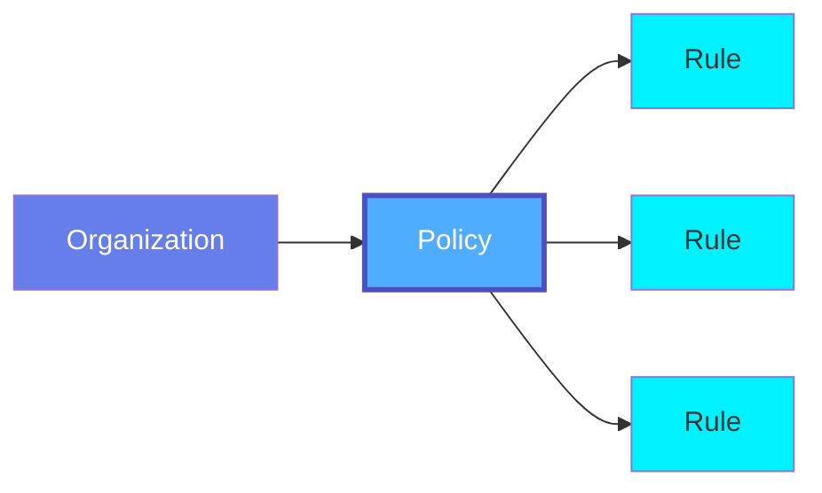

# Policy

A **Policy** defines access control rules, data governance policies, and compliance requirements for data assets in OpenMetadata. Policies enable organizations to manage permissions, enforce data handling rules, and maintain compliance with regulations like GDPR, HIPAA, and SOC2.

## Overview

Policies in OpenMetadata provide a centralized mechanism for:

- **Access Control**: Define who can access what data and what operations they can perform
- **Data Governance**: Enforce rules for data classification, retention, and usage
- **Compliance Management**: Ensure adherence to regulatory requirements
- **Audit Trail**: Track policy changes and enforcement history
- **Role-Based Access**: Apply policies based on user roles and team membership

Policies can be applied to:
- Individual data assets (Tables, Dashboards, Topics, etc.)
- Asset collections (Databases, Schemas, Services)
- Teams and users
- Domains and data products

## Hierarchy



**Click on any node to learn more about that entity.**

## Relationships

Policies have relationships with various entities in the metadata ecosystem:

```mermaid
graph TD
    subgraph Policy Structure
        A[Policy:<br/>Data Access Policy] --> B1[Rule:<br/>Read Access]
        A --> B2[Rule:<br/>Write Access]
        A --> B3[Rule:<br/>Delete Access]
    end

    subgraph Applied To
        A -.->|applies to| C1[Table:<br/>customer_data]
        A -.->|applies to| C2[Database:<br/>production]
        A -.->|applies to| C3[Domain:<br/>Customer Analytics]
    end

    subgraph Subjects
        A -.->|affects| D1[Team:<br/>Data Science]
        A -.->|affects| D2[Role:<br/>Data Analyst]
        A -.->|affects| D3[User:<br/>john.doe]
    end

    subgraph Governance
        A -.->|owned by| E1[User:<br/>Chief Data Officer]
        A -.->|tagged with| E2[Tag:<br/>PII]
        A -.->|tagged with| E3[Tag:<br/>Compliance]
        A -.->|in domain| E4[Domain:<br/>Governance]
    end

    subgraph Related Policies
        A -.->|depends on| F1[Policy:<br/>Base Access Policy]
        A -.->|conflicts with| F2[Policy:<br/>Legacy Policy]
    end

    subgraph Enforcement
        A -.->|triggers| G1[Alert:<br/>Policy Violation]
        A -.->|logged in| G2[AuditLog]
    end

    style A fill:#4facfe,color:#fff,stroke:#4c51bf,stroke-width:3px
    style B1 fill:#00f2fe,color:#333
    style B2 fill:#00f2fe,color:#333
    style B3 fill:#00f2fe,color:#333
    style C1 fill:#764ba2,color:#fff
    style C2 fill:#764ba2,color:#fff
    style C3 fill:#764ba2,color:#fff
    style D1 fill:#43e97b,color:#333
    style D2 fill:#43e97b,color:#333
    style D3 fill:#43e97b,color:#333
    style E1 fill:#43e97b,color:#333
    style E2 fill:#fa709a,color:#fff
    style E3 fill:#fa709a,color:#fff
    style E4 fill:#f093fb,color:#333
    style F1 fill:#667eea,color:#fff
    style F2 fill:#667eea,color:#fff
    style G1 fill:#f5576c,color:#fff
    style G2 fill:#ffd700,color:#333

    click A "#policy" "Policy"
    click B1 "#rule" "Rule"
    click C1 "../../data-assets/databases/table/" "Table"
    click C2 "../../data-assets/databases/database/" "Database"
    click C3 "../../domains/domain/" "Domain"
    click D1 "../../teams-users/team/" "Team"
    click D2 "../../teams-users/role/" "Role"
    click D3 "../../teams-users/user/" "User"
    click E1 "../../teams-users/user/" "Owner"
    click E2 "./tag/" "Tag"
    click E4 "../../domains/domain/" "Domain"
    click F1 "#policy" "Policy"
    click G1 "../../data-quality/alert/" "Alert"
```



**Key Relationships:**

- **Policy Structure**: Contains multiple Rules that define specific permissions
- **Applied To**: Can be applied to Tables, Databases, Dashboards, Topics, Domains, Data Products, etc.
- **Subjects**: Affects Teams, Roles, and Users who are granted or denied access
- **Governance**: Owned by users, tagged for classification, organized by domain
- **Related Policies**: Can depend on or conflict with other policies
- **Enforcement**: Triggers alerts on violations, creates audit logs

## Schema Specifications

=== "JSON Schema"

    ```json
    {
      "$id": "https://open-metadata.org/schema/entity/policies/policy.json",
      "$schema": "http://json-schema.org/draft-07/schema#",
      "title": "Policy",
      "description": "A Policy defines access control rules and governance policies for data assets.",
      "type": "object",
      "javaType": "org.openmetadata.schema.entity.policies.Policy",
      "javaInterfaces": [
        "org.openmetadata.schema.EntityInterface"
      ],
      "definitions": {
        "policyType": {
          "description": "Type of policy",
          "type": "string",
          "enum": [
            "AccessControl",
            "Lifecycle",
            "Masking",
            "Compliance",
            "Custom"
          ],
          "javaEnums": [
            {
              "name": "AccessControl"
            },
            {
              "name": "Lifecycle"
            },
            {
              "name": "Masking"
            },
            {
              "name": "Compliance"
            },
            {
              "name": "Custom"
            }
          ]
        },
        "effect": {
          "description": "Effect of the rule - Allow or Deny",
          "type": "string",
          "enum": [
            "allow",
            "deny"
          ]
        },
        "rule": {
          "type": "object",
          "description": "A rule within a policy",
          "properties": {
            "name": {
              "description": "Name of the rule",
              "type": "string"
            },
            "description": {
              "description": "Description of the rule",
              "type": "string"
            },
            "effect": {
              "$ref": "#/definitions/effect"
            },
            "operations": {
              "description": "Operations allowed or denied by this rule",
              "type": "array",
              "items": {
                "type": "string",
                "enum": [
                  "ViewBasic",
                  "ViewAll",
                  "ViewUsage",
                  "ViewTests",
                  "ViewQueries",
                  "ViewDataProfile",
                  "ViewSampleData",
                  "EditAll",
                  "EditDescription",
                  "EditTags",
                  "EditOwner",
                  "EditTier",
                  "EditCustomFields",
                  "EditLineage",
                  "EditReviewers",
                  "Delete",
                  "EditPolicy",
                  "EditRole"
                ]
              }
            },
            "resources": {
              "description": "Resources to which this rule applies",
              "type": "array",
              "items": {
                "type": "string"
              }
            },
            "condition": {
              "description": "Condition expression for the rule",
              "type": "string"
            }
          },
          "required": [
            "name",
            "effect",
            "operations"
          ],
          "additionalProperties": false
        }
      },
      "properties": {
        "id": {
          "description": "Unique identifier of the policy",
          "$ref": "../../type/basic.json#/definitions/uuid"
        },
        "name": {
          "description": "Name that identifies this policy",
          "$ref": "../../type/basic.json#/definitions/entityName"
        },
        "fullyQualifiedName": {
          "description": "Fully qualified name of the policy",
          "$ref": "../../type/basic.json#/definitions/fullyQualifiedEntityName"
        },
        "displayName": {
          "description": "Display name for the policy",
          "type": "string"
        },
        "description": {
          "description": "Description of the policy",
          "$ref": "../../type/basic.json#/definitions/markdown"
        },
        "policyType": {
          "$ref": "#/definitions/policyType"
        },
        "policyUrl": {
          "description": "Link to the policy document",
          "$ref": "../../type/basic.json#/definitions/href"
        },
        "enabled": {
          "description": "Is the policy enabled",
          "type": "boolean",
          "default": true
        },
        "rules": {
          "description": "Set of rules that make up the policy",
          "type": "array",
          "items": {
            "$ref": "#/definitions/rule"
          }
        },
        "owner": {
          "description": "Owner of this policy",
          "$ref": "../../type/entityReference.json"
        },
        "location": {
          "description": "Reference to the location/team to which this policy belongs",
          "$ref": "../../type/entityReference.json"
        },
        "tags": {
          "description": "Tags for this policy",
          "type": "array",
          "items": {
            "$ref": "../../type/tagLabel.json"
          },
          "default": null
        },
        "version": {
          "description": "Metadata version of the entity",
          "$ref": "../../type/entityHistory.json#/definitions/entityVersion"
        },
        "updatedAt": {
          "description": "Last update time corresponding to the new version of the entity in Unix epoch time milliseconds",
          "$ref": "../../type/basic.json#/definitions/timestamp"
        },
        "updatedBy": {
          "description": "User who made the update",
          "type": "string"
        },
        "href": {
          "description": "Link to this policy resource",
          "$ref": "../../type/basic.json#/definitions/href"
        },
        "changeDescription": {
          "description": "Change that led to this version of the entity",
          "$ref": "../../type/entityHistory.json#/definitions/changeDescription"
        },
        "deleted": {
          "description": "When true indicates the entity has been soft deleted",
          "type": "boolean",
          "default": false
        },
        "domain": {
          "description": "Domain the policy belongs to",
          "$ref": "../../type/entityReference.json"
        }
      },
      "required": [
        "id",
        "name",
        "policyType"
      ],
      "additionalProperties": false
    }
    ```

=== "RDF (Turtle)"

    ```turtle
    @prefix om: <https://open-metadata.org/schema/> .
    @prefix om-entity: <https://open-metadata.org/schema/entity/> .
    @prefix om-policy: <https://open-metadata.org/schema/entity/policies/> .
    @prefix rdf: <http://www.w3.org/1999/02/22-rdf-syntax-ns#> .
    @prefix rdfs: <http://www.w3.org/2000/01/rdf-schema#> .
    @prefix owl: <http://www.w3.org/2002/07/owl#> .
    @prefix xsd: <http://www.w3.org/2001/XMLSchema#> .
    @prefix dcat: <http://www.w3.org/ns/dcat#> .
    @prefix dcterms: <http://purl.org/dc/terms/> .
    @prefix skos: <http://www.w3.org/2004/02/skos/core#> .
    @prefix prov: <http://www.w3.org/ns/prov#> .

    # Policy Class Definition
    om-policy:Policy a owl:Class ;
        rdfs:label "Policy" ;
        rdfs:comment "A Policy defines access control rules and governance policies for data assets" ;
        rdfs:subClassOf om-entity:Entity ;
        rdfs:isDefinedBy om: .

    # Policy Type Class
    om-policy:PolicyType a owl:Class ;
        rdfs:label "Policy Type" ;
        rdfs:comment "Type of policy (AccessControl, Lifecycle, Masking, Compliance, Custom)" ;
        rdfs:isDefinedBy om: .

    # Rule Class Definition
    om-policy:Rule a owl:Class ;
        rdfs:label "Rule" ;
        rdfs:comment "A rule within a policy that defines specific permissions" ;
        rdfs:isDefinedBy om: .

    # Effect Class
    om-policy:Effect a owl:Class ;
        rdfs:label "Effect" ;
        rdfs:comment "Effect of the rule - Allow or Deny" ;
        rdfs:isDefinedBy om: .

    # Properties
    om-policy:policyType a owl:ObjectProperty ;
        rdfs:label "policy type" ;
        rdfs:comment "Type of the policy" ;
        rdfs:domain om-policy:Policy ;
        rdfs:range om-policy:PolicyType .

    om-policy:policyUrl a owl:DatatypeProperty ;
        rdfs:label "policy URL" ;
        rdfs:comment "Link to the policy document" ;
        rdfs:domain om-policy:Policy ;
        rdfs:range xsd:anyURI .

    om-policy:enabled a owl:DatatypeProperty ;
        rdfs:label "enabled" ;
        rdfs:comment "Indicates if the policy is enabled" ;
        rdfs:domain om-policy:Policy ;
        rdfs:range xsd:boolean .

    om-policy:hasRule a owl:ObjectProperty ;
        rdfs:label "has rule" ;
        rdfs:comment "Rules that make up the policy" ;
        rdfs:domain om-policy:Policy ;
        rdfs:range om-policy:Rule .

    om-policy:appliesTo a owl:ObjectProperty ;
        rdfs:label "applies to" ;
        rdfs:comment "Data assets to which the policy applies" ;
        rdfs:domain om-policy:Policy ;
        rdfs:range om-entity:Entity .

    om-policy:affects a owl:ObjectProperty ;
        rdfs:label "affects" ;
        rdfs:comment "Users, teams, or roles affected by the policy" ;
        rdfs:domain om-policy:Policy .

    om-policy:ruleName a owl:DatatypeProperty ;
        rdfs:label "rule name" ;
        rdfs:comment "Name of the rule" ;
        rdfs:domain om-policy:Rule ;
        rdfs:range xsd:string .

    om-policy:ruleEffect a owl:ObjectProperty ;
        rdfs:label "rule effect" ;
        rdfs:comment "Effect of the rule (allow or deny)" ;
        rdfs:domain om-policy:Rule ;
        rdfs:range om-policy:Effect .

    om-policy:operations a owl:DatatypeProperty ;
        rdfs:label "operations" ;
        rdfs:comment "Operations allowed or denied by this rule" ;
        rdfs:domain om-policy:Rule ;
        rdfs:range xsd:string .

    om-policy:resources a owl:DatatypeProperty ;
        rdfs:label "resources" ;
        rdfs:comment "Resources to which this rule applies" ;
        rdfs:domain om-policy:Rule ;
        rdfs:range xsd:string .

    om-policy:condition a owl:DatatypeProperty ;
        rdfs:label "condition" ;
        rdfs:comment "Condition expression for the rule" ;
        rdfs:domain om-policy:Rule ;
        rdfs:range xsd:string .

    om-policy:triggersAlert a owl:ObjectProperty ;
        rdfs:label "triggers alert" ;
        rdfs:comment "Alerts triggered by policy violations" ;
        rdfs:domain om-policy:Policy ;
        rdfs:range om-entity:Alert .

    # Policy Type Individuals
    om-policy:AccessControl a om-policy:PolicyType ;
        rdfs:label "Access Control" ;
        skos:definition "Policy for controlling access to data assets" .

    om-policy:Lifecycle a om-policy:PolicyType ;
        rdfs:label "Lifecycle" ;
        skos:definition "Policy for data lifecycle management and retention" .

    om-policy:Masking a om-policy:PolicyType ;
        rdfs:label "Masking" ;
        skos:definition "Policy for data masking and anonymization" .

    om-policy:Compliance a om-policy:PolicyType ;
        rdfs:label "Compliance" ;
        skos:definition "Policy for regulatory compliance" .

    om-policy:Custom a om-policy:PolicyType ;
        rdfs:label "Custom" ;
        skos:definition "Custom policy type" .

    # Effect Individuals
    om-policy:Allow a om-policy:Effect ;
        rdfs:label "Allow" ;
        skos:definition "Allow the specified operations" .

    om-policy:Deny a om-policy:Effect ;
        rdfs:label "Deny" ;
        skos:definition "Deny the specified operations" .
    ```

=== "JSON-LD Context"

    ```json
    {
      "@context": {
        "@vocab": "https://open-metadata.org/schema/entity/policies/",
        "rdf": "http://www.w3.org/1999/02/22-rdf-syntax-ns#",
        "rdfs": "http://www.w3.org/2000/01/rdf-schema#",
        "owl": "http://www.w3.org/2002/07/owl#",
        "xsd": "http://www.w3.org/2001/XMLSchema#",
        "dcat": "http://www.w3.org/ns/dcat#",
        "dcterms": "http://purl.org/dc/terms/",
        "skos": "http://www.w3.org/2004/02/skos/core#",
        "prov": "http://www.w3.org/ns/prov#",
        "om": "https://open-metadata.org/schema/",

        "Policy": {
          "@id": "om:Policy",
          "@type": "@id"
        },
        "id": {
          "@id": "om:id",
          "@type": "xsd:string"
        },
        "name": {
          "@id": "om:name",
          "@type": "xsd:string"
        },
        "fullyQualifiedName": {
          "@id": "om:fullyQualifiedName",
          "@type": "xsd:string"
        },
        "displayName": {
          "@id": "om:displayName",
          "@type": "xsd:string"
        },
        "description": {
          "@id": "dcterms:description",
          "@type": "xsd:string"
        },
        "policyType": {
          "@id": "om:policyType",
          "@type": "@id"
        },
        "policyUrl": {
          "@id": "om:policyUrl",
          "@type": "xsd:anyURI"
        },
        "enabled": {
          "@id": "om:enabled",
          "@type": "xsd:boolean"
        },
        "rules": {
          "@id": "om:hasRule",
          "@type": "@id",
          "@container": "@set"
        },
        "owner": {
          "@id": "om:owner",
          "@type": "@id"
        },
        "tags": {
          "@id": "om:tags",
          "@type": "@id",
          "@container": "@set"
        },
        "domain": {
          "@id": "om:domain",
          "@type": "@id"
        },
        "appliesTo": {
          "@id": "om:appliesTo",
          "@type": "@id",
          "@container": "@set"
        },
        "affects": {
          "@id": "om:affects",
          "@type": "@id",
          "@container": "@set"
        },
        "triggersAlert": {
          "@id": "om:triggersAlert",
          "@type": "@id",
          "@container": "@set"
        },
        "version": {
          "@id": "om:version",
          "@type": "xsd:string"
        },
        "updatedAt": {
          "@id": "dcterms:modified",
          "@type": "xsd:dateTime"
        },
        "updatedBy": {
          "@id": "prov:wasAttributedTo",
          "@type": "xsd:string"
        },
        "href": {
          "@id": "om:href",
          "@type": "xsd:anyURI"
        }
      }
    }
    ```

## Use Cases

### Access Control Policy

Define who can access specific databases and what operations they can perform:

```json
{
  "name": "ProductionDatabaseAccess",
  "displayName": "Production Database Access Policy",
  "policyType": "AccessControl",
  "description": "Controls access to production databases",
  "enabled": true,
  "rules": [
    {
      "name": "DataAnalystReadAccess",
      "description": "Allow data analysts to read from production databases",
      "effect": "allow",
      "operations": ["ViewBasic", "ViewAll", "ViewDataProfile"],
      "resources": ["database:production.*"],
      "condition": "hasRole('DataAnalyst')"
    },
    {
      "name": "DenyProductionWrite",
      "description": "Deny write access to production for analysts",
      "effect": "deny",
      "operations": ["EditAll", "Delete"],
      "resources": ["database:production.*"],
      "condition": "hasRole('DataAnalyst')"
    }
  ],
  "owner": {
    "type": "user",
    "name": "chief.data.officer"
  },
  "tags": [
    {
      "tagFQN": "Governance.AccessControl"
    }
  ]
}
```

### Data Masking Policy

Automatically mask PII data for certain user roles:

```json
{
  "name": "PIIMaskingPolicy",
  "displayName": "PII Data Masking Policy",
  "policyType": "Masking",
  "description": "Masks PII data for non-privileged users",
  "enabled": true,
  "rules": [
    {
      "name": "MaskSensitiveColumns",
      "description": "Mask columns tagged as PII",
      "effect": "allow",
      "operations": ["ViewSampleData"],
      "resources": ["column:*.*.*.{email,ssn,phone,address}"],
      "condition": "hasTag('PII.Sensitive') AND NOT hasRole('DataSteward')"
    }
  ],
  "owner": {
    "type": "team",
    "name": "DataGovernance"
  },
  "tags": [
    {
      "tagFQN": "Governance.DataPrivacy"
    },
    {
      "tagFQN": "Compliance.GDPR"
    }
  ]
}
```

### Compliance Policy

Ensure compliance with GDPR data retention requirements:

```json
{
  "name": "GDPRRetentionPolicy",
  "displayName": "GDPR Data Retention Policy",
  "policyType": "Compliance",
  "description": "Enforces GDPR data retention requirements",
  "enabled": true,
  "policyUrl": "https://company.com/policies/gdpr-retention",
  "rules": [
    {
      "name": "DeleteCustomerDataAfter7Years",
      "description": "Delete customer data after 7 years",
      "effect": "allow",
      "operations": ["Delete"],
      "resources": ["table:*.customer_*"],
      "condition": "dataAge > 2555 DAYS AND hasTag('PII')"
    },
    {
      "name": "AlertOnRetentionViolation",
      "description": "Alert when retention period is exceeded",
      "effect": "deny",
      "operations": ["ViewAll"],
      "resources": ["table:*.customer_*"],
      "condition": "dataAge > 2555 DAYS AND hasTag('PII')"
    }
  ],
  "owner": {
    "type": "user",
    "name": "compliance.officer"
  },
  "domain": {
    "type": "domain",
    "name": "Governance"
  },
  "tags": [
    {
      "tagFQN": "Compliance.GDPR"
    },
    {
      "tagFQN": "Governance.Retention"
    }
  ]
}
```

### Domain-Based Access

Control access based on data domains:

```json
{
  "name": "DomainBasedAccess",
  "displayName": "Domain-Based Access Policy",
  "policyType": "AccessControl",
  "description": "Users can only access data in their domain",
  "enabled": true,
  "rules": [
    {
      "name": "SalesDomainAccess",
      "description": "Sales team can access Sales domain data",
      "effect": "allow",
      "operations": ["ViewAll", "EditDescription", "EditTags"],
      "resources": ["domain:Sales.*"],
      "condition": "inTeam('Sales')"
    },
    {
      "name": "DenyCrossDomainAccess",
      "description": "Deny access to data outside user's domain",
      "effect": "deny",
      "operations": ["ViewAll"],
      "resources": ["*"],
      "condition": "NOT inUserDomain(resource.domain)"
    }
  ],
  "owner": {
    "type": "team",
    "name": "DataGovernance"
  }
}
```

## Policy Operations

Supported operations that can be controlled by policies:

### View Operations
- `ViewBasic`: View basic metadata (name, description)
- `ViewAll`: View all metadata including tags and ownership
- `ViewUsage`: View usage statistics
- `ViewTests`: View test results
- `ViewQueries`: View sample queries
- `ViewDataProfile`: View data profile and statistics
- `ViewSampleData`: View sample data

### Edit Operations
- `EditAll`: Edit all metadata
- `EditDescription`: Edit description only
- `EditTags`: Edit tags
- `EditOwner`: Edit ownership
- `EditTier`: Edit tier
- `EditCustomFields`: Edit custom properties
- `EditLineage`: Edit lineage information
- `EditReviewers`: Edit reviewers

### Administrative Operations
- `Delete`: Delete the entity
- `EditPolicy`: Edit policies
- `EditRole`: Edit roles

## Policy Evaluation

Policies are evaluated in the following order:

1. **Explicit Deny**: If any rule explicitly denies access, access is denied
2. **Explicit Allow**: If any rule explicitly allows access, access is allowed
3. **Default Deny**: If no rule matches, access is denied by default

### Condition Expressions

Rules can include condition expressions using a simple expression language:

- `hasRole('RoleName')`: Check if user has a specific role
- `inTeam('TeamName')`: Check if user is in a specific team
- `hasTag('TagName')`: Check if resource has a specific tag
- `dataAge > N DAYS`: Check age of data
- `inUserDomain(domain)`: Check if resource is in user's domain

## Best Practices

### 1. Principle of Least Privilege
Grant only the minimum permissions necessary for users to perform their jobs.

### 2. Use Policy Hierarchy
Create base policies and extend them with specific rules rather than duplicating rules.

### 3. Document Policy Intent
Always include clear descriptions explaining why a policy exists and what it aims to achieve.

### 4. Regular Policy Reviews
Periodically review policies to ensure they remain relevant and effective.

### 5. Test Before Enabling
Test policies in a non-production environment before enabling them in production.

### 6. Use Tags for Classification
Tag policies with their purpose (AccessControl, Compliance, etc.) for easier management.

### 7. Monitor Policy Violations
Set up alerts to monitor policy violations and take corrective action.

### 8. Version Control
Maintain version history of policy changes for audit and rollback purposes.

## Custom Properties

This entity supports custom properties through the `extension` field.
Common custom properties include:

- **Data Classification**: Sensitivity level
- **Cost Center**: Billing allocation
- **Retention Period**: Data retention requirements
- **Application Owner**: Owning application/team

See [Custom Properties](../metadata-specifications/custom-properties.md)
for details on defining and using custom properties.

---

## API Operations

### Create Policy

```http
POST /api/v1/policies
Content-Type: application/json

{
  "name": "SamplePolicy",
  "policyType": "AccessControl",
  "description": "Sample access control policy",
  "enabled": true,
  "rules": [...]
}
```

### Get Policy by ID

```http
GET /api/v1/policies/{id}
```

### Update Policy

```http
PATCH /api/v1/policies/{id}
Content-Type: application/json-patch+json

[
  {
    "op": "add",
    "path": "/rules/-",
    "value": {
      "name": "NewRule",
      "effect": "allow",
      "operations": ["ViewAll"]
    }
  }
]
```

### Delete Policy

```http
DELETE /api/v1/policies/{id}
```

### List Policies

```http
GET /api/v1/policies?limit=10&policyType=AccessControl
```

### Enable/Disable Policy

```http
PATCH /api/v1/policies/{id}
Content-Type: application/json-patch+json

[
  {
    "op": "replace",
    "path": "/enabled",
    "value": false
  }
]
```

## Related Entities

- **[Role](../teams-users/role.md)**: Roles that policies are assigned to
- **[Team](../teams-users/team.md)**: Teams affected by policies
- **[User](../teams-users/user.md)**: Users affected by policies
- **[Domain](../domains/domain.md)**: Domains to which policies can be scoped
- **[Tag](./tag.md)**: Tags used for policy-based access control
- **[Alert](../data-quality/alert.md)**: Alerts triggered by policy violations
