# Tag

**Individual classification labels - enabling precise data governance and discovery**

---

## Overview

The **Tag** entity represents an individual classification label within a hierarchical taxonomy. Tags are organized under Classifications and can have parent-child relationships, enabling precise categorization of data assets for governance, compliance, and discovery.

## Relationship Diagram

```mermaid
graph TD
    %% Parent classification
    CLASS[Classification<br/>PII]

    %% Main tag entity
    CLASS -->|contains| TAG[Tag<br/>Sensitive]

    %% Parent tag relationship
    TAG_PARENT[Tag<br/>PersonalData] -.->|broader than| TAG

    %% Child tags
    TAG -->|has child| CHILD1[Tag<br/>Email]
    TAG -->|has child| CHILD2[Tag<br/>SSN]
    TAG -->|has child| CHILD3[Tag<br/>CreditCard]
    TAG -->|has child| CHILD4[Tag<br/>BankAccount]

    %% Grandchild tags
    CHILD1 -->|has child| GRAND1[Tag<br/>WorkEmail]
    CHILD1 -->|has child| GRAND2[Tag<br/>PersonalEmail]

    %% Sibling tags
    CLASS -->|contains| SIBLING1[Tag<br/>NonSensitive]
    SIBLING1 -->|has child| SIB_CHILD1[Tag<br/>Name]
    SIBLING1 -->|has child| SIB_CHILD2[Tag<br/>Address]

    %% Applied to columns
    TAG -.->|classifies| COL1[Column<br/>customer_email]
    CHILD1 -.->|classifies| COL2[Column<br/>user_email]
    CHILD1 -.->|classifies| COL3[Column<br/>contact_email]
    CHILD2 -.->|classifies| COL4[Column<br/>ssn]
    CHILD3 -.->|classifies| COL5[Column<br/>card_number]

    %% Applied to tables
    TAG -.->|classifies| TBL1[Table<br/>customer_pii]
    TAG -.->|classifies| TBL2[Table<br/>employee_data]

    %% Applied to other assets
    TAG -.->|classifies| DASH[Dashboard<br/>PII Report]
    TAG -.->|classifies| ML[MLModel<br/>pii_detector]
    TAG -.->|classifies| PIPE[Pipeline<br/>anonymization_job]

    %% Visual styling properties
    STYLE[Style Properties] -.->|color: #FF0000| TAG
    STYLE -.->|icon| TAG

    %% State indicators
    STATE1[Status<br/>Active] -.->|state| TAG

    %% Governance
    OWNER[User/Team] -.->|owns| TAG

    %% Styling
    classDef classification fill:#8B5CF6,stroke:#7C3AED,color:#fff
    classDef tag fill:#A78BFA,stroke:#8B5CF6,color:#fff
    classDef childTag fill:#DDD6FE,stroke:#A78BFA,color:#000
    classDef governance fill:#059669,stroke:#047857,color:#fff
    classDef data fill:#2563EB,stroke:#1E40AF,color:#fff
    classDef metadata fill:#F59E0B,stroke:#D97706,color:#fff

    class CLASS classification
    class TAG,SIBLING1,TAG_PARENT tag
    class CHILD1,CHILD2,CHILD3,CHILD4,GRAND1,GRAND2,SIB_CHILD1,SIB_CHILD2 childTag
    class OWNER,STATE1 governance
    class COL1,COL2,COL3,COL4,COL5,TBL1,TBL2,DASH,ML,PIPE data
    class STYLE metadata
```



---

## Schema Specifications

View the complete Tag schema in your preferred format:

=== "JSON Schema"

    **Complete JSON Schema Definition**

    ```json
    {
      "$id": "https://open-metadata.org/schema/entity/classification/tag.json",
      "$schema": "http://json-schema.org/draft-07/schema#",
      "title": "Tag",
      "$comment": "@om-entity-type",
      "description": "A `Tag` entity is used for classification or categorization. It is a term defined under `Classification` entity. Tags are used to label the entities and entity fields, such as Tables, and Columns.",
      "type": "object",
      "javaType": "org.openmetadata.schema.entity.classification.Tag",
      "javaInterfaces": [
        "org.openmetadata.schema.EntityInterface"
      ],

      "definitions": {},

      "properties": {
        "id": {
          "description": "Unique identifier of this entity instance.",
          "$ref": "../../type/basic.json#/definitions/uuid"
        },
        "name": {
          "description": "Name of the tag.",
          "$ref": "../../type/basic.json#/definitions/entityName"
        },
        "displayName": {
          "description": "Display Name that identifies this tag.",
          "type": "string"
        },
        "fullyQualifiedName": {
          "description": "Unique name of the tag of format `Classification.tag1.tag2`.",
          "type": "string"
        },
        "description": {
          "description": "Description of the tag.",
          "$ref": "../../type/basic.json#/definitions/markdown"
        },
        "style": {
          "$ref": "../../type/basic.json#/definitions/style"
        },
        "classification": {
          "description": "Reference to the classification that this tag is part of.",
          "$ref": "../../type/entityReference.json"
        },
        "parent": {
          "description": "Reference to the parent tag. When null, the term is at the root of the Classification.",
          "$ref": "../../type/entityReference.json"
        },
        "children": {
          "description": "Children tags under this tag.",
          "$ref": "../../type/entityReferenceList.json"
        },
        "version": {
          "description": "Metadata version of the entity.",
          "$ref": "../../type/entityHistory.json#/definitions/entityVersion"
        },
        "updatedAt": {
          "description": "Last update time corresponding to the new version of the entity in Unix epoch time milliseconds.",
          "$ref": "../../type/basic.json#/definitions/timestamp"
        },
        "updatedBy": {
          "description": "User who made the update.",
          "type": "string"
        },
        "impersonatedBy": {
          "description": "Bot user that performed the action on behalf of the actual user.",
          "$ref": "../../type/basic.json#/definitions/impersonatedBy"
        },
        "href": {
          "description": "Link to the resource corresponding to the tag.",
          "$ref": "../../type/basic.json#/definitions/href"
        },
        "usageCount": {
          "description": "Count of how many times this tag and children tags are used.",
          "type": "integer"
        },
        "deprecated": {
          "description": "If the tag is deprecated.",
          "type": "boolean",
          "default": false
        },
        "deleted": {
          "description": "When `true` indicates the entity has been soft deleted.",
          "type": "boolean",
          "default": false
        },
        "changeDescription": {
          "description": "Change that lead to this version of the entity.",
          "$ref": "../../type/entityHistory.json#/definitions/changeDescription"
        },
        "incrementalChangeDescription": {
          "description": "Change that lead to this version of the entity.",
          "$ref": "../../type/entityHistory.json#/definitions/changeDescription"
        },
        "provider": {
          "$ref": "../../type/basic.json#/definitions/providerType"
        },
        "disabled": {
          "description": "System tags can't be deleted. Use this flag to disable them.",
          "type": "boolean",
          "default": false
        },
        "mutuallyExclusive": {
          "description": "Children tags under this group are mutually exclusive. When mutually exclusive is `true` the tags from this group are used to **classify** an entity. An entity can only be in one class - example, it can only be either `tier1` or `tier2` and not both. When mutually exclusive is `false`, the tags from this group are used to **categorize** an entity. An entity can be in multiple categories simultaneously - example a customer can be `newCustomer` and `atRisk` simultaneously.",
          "type": "boolean",
          "default": "false"
        },
        "domains": {
          "description": "Domains the asset belongs to. When not set, the asset inherits the domain from the parent it belongs to.",
          "$ref": "../../type/entityReferenceList.json"
        },
        "dataProducts": {
          "description": "List of data products this entity is part of.",
          "$ref": "../../type/entityReferenceList.json"
        },
        "owners": {
          "description": "Owners of this glossary term.",
          "$ref": "../../type/entityReferenceList.json"
        },
        "reviewers": {
          "description": "User references of the reviewers for this tag.",
          "$ref": "../../type/entityReferenceList.json"
        },
        "entityStatus": {
          "description": "Status of the tag.",
          "$ref": "../../type/status.json"
        },
        "recognizers": {
          "description": "List of recognizers configured for automatic detection of this tag",
          "type": "array",
          "items": {
            "$ref": "../../type/recognizer.json"
          }
        },
        "autoClassificationEnabled": {
          "description": "Whether automatic classification is enabled for this tag",
          "type": "boolean",
          "default": false
        },
        "autoClassificationPriority": {
          "description": "Priority for conflict resolution when multiple tags match (higher number = higher priority)",
          "type": "integer",
          "minimum": 0,
          "maximum": 100,
          "default": 50
        }
      },

      "required": ["id", "name", "description"]
    }
    ```

    **[View Full JSON Schema →](https://github.com/open-metadata/OpenMetadataStandards/blob/main/schemas/entity/classification/tag.json)**

=== "RDF"

    **RDF/OWL Ontology Definition**

    ```turtle
    @prefix om: <https://open-metadata.org/schema/> .
    @prefix rdfs: <http://www.w3.org/2000/01/rdf-schema#> .
    @prefix owl: <http://www.w3.org/2002/07/owl#> .
    @prefix xsd: <http://www.w3.org/2001/XMLSchema#> .
    @prefix skos: <http://www.w3.org/2004/02/skos/core#> .

    # Tag Class Definition
    om:Tag a owl:Class ;
        rdfs:subClassOf om:GovernanceAsset, skos:Concept ;
        rdfs:label "Tag" ;
        rdfs:comment "A Tag entity is used for classification or categorization. It is a term defined under Classification entity. Tags are used to label the entities and entity fields, such as Tables, and Columns." ;
        om:hierarchyLevel 2 .

    # Datatype Properties
    om:tagName a owl:DatatypeProperty ;
        rdfs:domain om:Tag ;
        rdfs:range xsd:string ;
        rdfs:label "name" ;
        rdfs:comment "Name of the tag" ;
        owl:equivalentProperty skos:prefLabel .

    om:displayName a owl:DatatypeProperty ;
        rdfs:domain om:Tag ;
        rdfs:range xsd:string ;
        rdfs:label "displayName" ;
        rdfs:comment "Display Name that identifies this tag" .

    om:fullyQualifiedName a owl:DatatypeProperty ;
        rdfs:domain om:Tag ;
        rdfs:range xsd:string ;
        rdfs:label "fullyQualifiedName" ;
        rdfs:comment "Unique name of the tag of format Classification.tag1.tag2" ;
        owl:equivalentProperty skos:notation .

    om:tagDescription a owl:DatatypeProperty ;
        rdfs:domain om:Tag ;
        rdfs:range xsd:string ;
        rdfs:label "description" ;
        rdfs:comment "Description of the tag" ;
        owl:equivalentProperty skos:definition .

    om:isDisabled a owl:DatatypeProperty ;
        rdfs:domain om:Tag ;
        rdfs:range xsd:boolean ;
        rdfs:label "disabled" ;
        rdfs:comment "System tags can't be deleted. Use this flag to disable them" .

    om:isDeprecated a owl:DatatypeProperty ;
        rdfs:domain om:Tag ;
        rdfs:range xsd:boolean ;
        rdfs:label "deprecated" ;
        rdfs:comment "If the tag is deprecated" .

    om:isDeleted a owl:DatatypeProperty ;
        rdfs:domain om:Tag ;
        rdfs:range xsd:boolean ;
        rdfs:label "deleted" ;
        rdfs:comment "When true indicates the entity has been soft deleted" .

    om:usageCount a owl:DatatypeProperty ;
        rdfs:domain om:Tag ;
        rdfs:range xsd:integer ;
        rdfs:label "usageCount" ;
        rdfs:comment "Count of how many times this tag and children tags are used" .

    om:mutuallyExclusive a owl:DatatypeProperty ;
        rdfs:domain om:Tag ;
        rdfs:range xsd:boolean ;
        rdfs:label "mutuallyExclusive" ;
        rdfs:comment "Children tags under this group are mutually exclusive" .

    om:autoClassificationEnabled a owl:DatatypeProperty ;
        rdfs:domain om:Tag ;
        rdfs:range xsd:boolean ;
        rdfs:label "autoClassificationEnabled" ;
        rdfs:comment "Whether automatic classification is enabled for this tag" .

    om:autoClassificationPriority a owl:DatatypeProperty ;
        rdfs:domain om:Tag ;
        rdfs:range xsd:integer ;
        rdfs:label "autoClassificationPriority" ;
        rdfs:comment "Priority for conflict resolution when multiple tags match (higher number = higher priority)" .

    # Object Properties
    om:belongsToClassification a owl:ObjectProperty ;
        rdfs:domain om:Tag ;
        rdfs:range om:Classification ;
        rdfs:label "belongsToClassification" ;
        rdfs:comment "Reference to the classification that this tag is part of" ;
        owl:equivalentProperty skos:inScheme .

    om:hasParentTag a owl:ObjectProperty ;
        rdfs:domain om:Tag ;
        rdfs:range om:Tag ;
        rdfs:label "hasParentTag" ;
        rdfs:comment "Reference to the parent tag. When null, the term is at the root of the Classification" ;
        owl:equivalentProperty skos:broader .

    om:hasChildTag a owl:ObjectProperty ;
        rdfs:domain om:Tag ;
        rdfs:range om:Tag ;
        rdfs:label "hasChildTag" ;
        rdfs:comment "Children tags under this tag" ;
        owl:equivalentProperty skos:narrower .

    om:hasOwner a owl:ObjectProperty ;
        rdfs:domain om:Tag ;
        rdfs:range om:EntityReference ;
        rdfs:label "hasOwner" ;
        rdfs:comment "Owners of this tag" .

    om:hasDomain a owl:ObjectProperty ;
        rdfs:domain om:Tag ;
        rdfs:range om:Domain ;
        rdfs:label "hasDomain" ;
        rdfs:comment "Domains the asset belongs to" .

    om:hasDataProduct a owl:ObjectProperty ;
        rdfs:domain om:Tag ;
        rdfs:range om:DataProduct ;
        rdfs:label "hasDataProduct" ;
        rdfs:comment "Data products this entity is part of" .

    om:hasReviewer a owl:ObjectProperty ;
        rdfs:domain om:Tag ;
        rdfs:range om:EntityReference ;
        rdfs:label "hasReviewer" ;
        rdfs:comment "User references of the reviewers for this tag" .

    om:hasRecognizer a owl:ObjectProperty ;
        rdfs:domain om:Tag ;
        rdfs:range om:Recognizer ;
        rdfs:label "hasRecognizer" ;
        rdfs:comment "List of recognizers configured for automatic detection of this tag" .

    om:appliedTo a owl:ObjectProperty ;
        rdfs:domain om:Tag ;
        rdfs:range om:DataAsset ;
        rdfs:label "appliedTo" ;
        rdfs:comment "Data assets tagged with this tag" .

    # Example Instances
    ex:sensitiveTag a om:Tag, skos:Concept ;
        skos:prefLabel "Sensitive" ;
        om:displayName "Sensitive PII" ;
        om:fullyQualifiedName "PII.Sensitive" ;
        skos:definition "Highly sensitive personal information requiring strict access controls and encryption" ;
        skos:inScheme ex:piiClassification ;
        om:isDisabled false ;
        om:isDeprecated false ;
        om:isDeleted false ;
        om:usageCount 342 ;
        skos:narrower ex:emailTag ;
        skos:narrower ex:ssnTag .

    ex:emailTag a om:Tag, skos:Concept ;
        skos:prefLabel "Email" ;
        om:displayName "Email Address" ;
        om:fullyQualifiedName "PII.Sensitive.Email" ;
        skos:definition "Email addresses requiring privacy protection" ;
        skos:inScheme ex:piiClassification ;
        skos:broader ex:sensitiveTag ;
        om:usageCount 127 ;
        om:appliedTo ex:emailColumn .
    ```

    **[View Full RDF Ontology →](https://github.com/open-metadata/OpenMetadataStandards/blob/main/rdf/ontology/openmetadata.ttl)**

=== "JSON-LD"

    **JSON-LD Context and Example**

    ```json
    {
      "@context": {
        "@vocab": "https://open-metadata.org/schema/",
        "om": "https://open-metadata.org/schema/",
        "skos": "http://www.w3.org/2004/02/skos/core#",
        "rdfs": "http://www.w3.org/2000/01/rdf-schema#",
        "xsd": "http://www.w3.org/2001/XMLSchema#",

        "Tag": "om:Tag",
        "Concept": "skos:Concept",
        "name": {
          "@id": "skos:prefLabel",
          "@type": "xsd:string"
        },
        "fullyQualifiedName": {
          "@id": "skos:notation",
          "@type": "xsd:string"
        },
        "displayName": {
          "@id": "om:displayName",
          "@type": "xsd:string"
        },
        "description": {
          "@id": "skos:definition",
          "@type": "xsd:string"
        },
        "classification": {
          "@id": "skos:inScheme",
          "@type": "@id"
        },
        "parent": {
          "@id": "skos:broader",
          "@type": "@id"
        },
        "children": {
          "@id": "skos:narrower",
          "@type": "@id",
          "@container": "@set"
        },
        "disabled": {
          "@id": "om:isDisabled",
          "@type": "xsd:boolean"
        },
        "deprecated": {
          "@id": "om:isDeprecated",
          "@type": "xsd:boolean"
        },
        "deleted": {
          "@id": "om:isDeleted",
          "@type": "xsd:boolean"
        },
        "usageCount": {
          "@id": "om:usageCount",
          "@type": "xsd:integer"
        },
        "mutuallyExclusive": {
          "@id": "om:mutuallyExclusive",
          "@type": "xsd:boolean"
        },
        "owners": {
          "@id": "om:hasOwner",
          "@type": "@id",
          "@container": "@set"
        },
        "domains": {
          "@id": "om:hasDomain",
          "@type": "@id",
          "@container": "@set"
        },
        "dataProducts": {
          "@id": "om:hasDataProduct",
          "@type": "@id",
          "@container": "@set"
        },
        "reviewers": {
          "@id": "om:hasReviewer",
          "@type": "@id",
          "@container": "@set"
        },
        "recognizers": {
          "@id": "om:hasRecognizer",
          "@type": "@id",
          "@container": "@set"
        },
        "autoClassificationEnabled": {
          "@id": "om:autoClassificationEnabled",
          "@type": "xsd:boolean"
        },
        "autoClassificationPriority": {
          "@id": "om:autoClassificationPriority",
          "@type": "xsd:integer"
        }
      }
    }
    ```

    **Example JSON-LD Instance**:

    ```json
    {
      "@context": "https://open-metadata.org/context/tag.jsonld",
      "@type": ["Tag", "Concept"],
      "@id": "https://open-metadata.org/tags/PII/Sensitive/Email",

      "name": "Email",
      "fullyQualifiedName": "PII.Sensitive.Email",
      "displayName": "Email Address",
      "description": "# Email Address Tag\n\nIdentifies data containing email addresses.\n\n## Usage\n- Applied to columns storing email addresses\n- Triggers privacy protection measures\n- Subject to GDPR right to erasure",

      "classification": {
        "@id": "https://open-metadata.org/classifications/PII",
        "@type": "Classification",
        "name": "PII"
      },

      "parent": {
        "@id": "https://open-metadata.org/tags/PII/Sensitive",
        "@type": "Tag",
        "name": "Sensitive",
        "fullyQualifiedName": "PII.Sensitive"
      },

      "children": [],

      "style": {
        "color": "#FF6600",
        "iconURL": "https://example.com/icons/email.svg"
      },

      "disabled": false,
      "deprecated": false,
      "deleted": false,
      "usageCount": 127,
      "mutuallyExclusive": false,

      "owners": [
        {
          "@id": "https://open-metadata.org/users/admin",
          "@type": "User",
          "name": "admin"
        }
      ],

      "domains": [],
      "dataProducts": [],
      "reviewers": [],

      "recognizers": [
        {
          "@type": "Recognizer",
          "name": "email_pattern",
          "patternType": "regex",
          "pattern": "[a-zA-Z0-9._%+-]+@[a-zA-Z0-9.-]+\\.[a-zA-Z]{2,}"
        }
      ],

      "autoClassificationEnabled": true,
      "autoClassificationPriority": 75
    }
    ```

    **[View Full JSON-LD Context →](https://github.com/open-metadata/OpenMetadataStandards/blob/main/rdf/contexts/tag.jsonld)**

---

## Use Cases

- Tag tables and columns with governance classifications (PII, PHI, etc.)
- Apply data tier labels (Gold, Silver, Bronze)
- Mark data quality levels
- Label compliance requirements (GDPR, HIPAA, PCI-DSS)
- Enable faceted search and filtering
- Automate data policies based on tags
- Track tag usage across data assets
- Deprecate tags while maintaining history
- Create custom domain-specific taxonomies
- Support automated tag propagation (column → table)

---

## JSON Schema Specification

### Core Properties

#### `id` (uuid)
**Type**: `string` (UUID format)
**Required**: Yes (system-generated)
**Description**: Unique identifier of this entity instance.

```json
{
  "id": "4d5e6f7a-8b9c-4d0e-1f2a-3b4c5d6e7f8a"
}
```

---

#### `name` (entityName)
**Type**: `string`
**Required**: Yes
**Pattern**: `^[^.]*$` (no dots allowed)
**Min Length**: 1
**Max Length**: 256
**Description**: Name of the tag.

```json
{
  "name": "Email"
}
```

---

#### `fullyQualifiedName`
**Type**: `string`
**Required**: No (system-generated)
**Description**: Unique name of the tag of format `Classification.tag1.tag2`.

```json
{
  "fullyQualifiedName": "PII.Sensitive.Email"
}
```

---

#### `displayName`
**Type**: `string`
**Required**: No
**Description**: Display Name that identifies this tag.

```json
{
  "displayName": "Email Address"
}
```

---

#### `description` (markdown)
**Type**: `string` (Markdown format)
**Required**: Yes
**Description**: Description of the tag.

```json
{
  "description": "# Email Address Tag\n\nIdentifies data containing email addresses.\n\n## Usage Guidelines\n- Applied to columns storing email addresses\n- Triggers privacy protection measures\n- Subject to GDPR right to erasure\n\n## Examples\n- user_email\n- contact_email\n- billing_email"
}
```

---

### Relationship Properties

#### `classification` (EntityReference)
**Type**: `object`
**Required**: No
**Description**: Reference to the classification that this tag is part of.

```json
{
  "classification": {
    "id": "classification-uuid",
    "type": "classification",
    "name": "PII",
    "fullyQualifiedName": "PII"
  }
}
```

---

#### `parent` (EntityReference)
**Type**: `object`
**Required**: No
**Description**: Reference to the parent tag. When null, the term is at the root of the Classification.

```json
{
  "parent": {
    "id": "parent-tag-uuid",
    "type": "tag",
    "name": "Sensitive",
    "fullyQualifiedName": "PII.Sensitive"
  }
}
```

---

#### `children` (EntityReferenceList)
**Type**: `array` of Tag references
**Required**: No
**Description**: Children tags under this tag.

```json
{
  "children": [
    {
      "id": "child-tag-uuid-1",
      "type": "tag",
      "name": "WorkEmail",
      "fullyQualifiedName": "PII.Sensitive.Email.WorkEmail"
    },
    {
      "id": "child-tag-uuid-2",
      "type": "tag",
      "name": "PersonalEmail",
      "fullyQualifiedName": "PII.Sensitive.Email.PersonalEmail"
    }
  ]
}
```

---

### Visual Properties

#### `style` (Style)
**Type**: `object`
**Required**: No
**Reference**: `../../type/basic.json#/definitions/style`
**Description**: Visual styling for displaying the tag

**Style Object**:

| Property | Type | Required | Description |
|----------|------|----------|-------------|
| `color` | string | No | Hex color code (e.g., "#FF6600") |
| `iconURL` | uri | No | URL to tag icon image |

```json
{
  "style": {
    "color": "#FF6600",
    "iconURL": "https://example.com/icons/email.svg"
  }
}
```

**Common Color Schemes**:

- **Red (#FF0000)**: High sensitivity, critical
- **Orange (#FF6600)**: Medium sensitivity
- **Yellow (#FFCC00)**: Low sensitivity
- **Green (#00CC00)**: Public, non-sensitive
- **Blue (#0066FF)**: Informational
- **Purple (#9933FF)**: Compliance-related

---

### State Properties

#### `disabled` (boolean)
**Type**: `boolean`
**Required**: No (default: false)
**Description**: System tags can't be deleted. Use this flag to disable them.

```json
{
  "disabled": false
}
```

---

#### `deprecated` (boolean)
**Type**: `boolean`
**Required**: No (default: false)
**Description**: If the tag is deprecated.

```json
{
  "deprecated": false
}
```

---

#### `deleted` (boolean)
**Type**: `boolean`
**Required**: No (default: false)
**Description**: When `true` indicates the entity has been soft deleted.

```json
{
  "deleted": false
}
```

---

#### `mutuallyExclusive` (boolean)
**Type**: `boolean`
**Required**: No (default: false)
**Description**: Children tags under this group are mutually exclusive. When mutually exclusive is `true` the tags from this group are used to **classify** an entity. An entity can only be in one class - example, it can only be either `tier1` or `tier2` and not both. When mutually exclusive is `false`, the tags from this group are used to **categorize** an entity. An entity can be in multiple categories simultaneously - example a customer can be `newCustomer` and `atRisk` simultaneously.

```json
{
  "mutuallyExclusive": false
}
```

---

### Usage Properties

#### `usageCount` (integer)
**Type**: `integer`
**Required**: No (system-generated)
**Description**: Count of how many times this tag and children tags are used.

```json
{
  "usageCount": 127
}
```

---

### Governance Properties

#### `owners` (EntityReferenceList)
**Type**: `array` of EntityReference
**Required**: No
**Description**: Owners of this glossary term.

```json
{
  "owners": [
    {
      "id": "user-uuid",
      "type": "user",
      "name": "admin"
    }
  ]
}
```

---

#### `domains` (EntityReferenceList)
**Type**: `array` of EntityReference
**Required**: No
**Description**: Domains the asset belongs to. When not set, the asset inherits the domain from the parent it belongs to.

```json
{
  "domains": [
    {
      "id": "domain-uuid",
      "type": "domain",
      "name": "Marketing"
    }
  ]
}
```

---

#### `dataProducts` (EntityReferenceList)
**Type**: `array` of EntityReference
**Required**: No
**Description**: List of data products this entity is part of.

```json
{
  "dataProducts": [
    {
      "id": "product-uuid",
      "type": "dataProduct",
      "name": "CustomerAnalytics"
    }
  ]
}
```

---

#### `reviewers` (EntityReferenceList)
**Type**: `array` of EntityReference
**Required**: No
**Description**: User references of the reviewers for this tag.

```json
{
  "reviewers": [
    {
      "id": "user-uuid",
      "type": "user",
      "name": "data-steward"
    }
  ]
}
```

---

#### `entityStatus` (Status)
**Type**: `object`
**Required**: No
**Reference**: `../../type/status.json`
**Description**: Status of the tag.

```json
{
  "entityStatus": "Active"
}
```

---

### Auto-Classification Properties

#### `recognizers` (Recognizer[])
**Type**: `array` of Recognizer objects
**Required**: No
**Description**: List of recognizers configured for automatic detection of this tag

```json
{
  "recognizers": [
    {
      "name": "email_pattern",
      "patternType": "regex",
      "pattern": "[a-zA-Z0-9._%+-]+@[a-zA-Z0-9.-]+\\.[a-zA-Z]{2,}"
    }
  ]
}
```

---

#### `autoClassificationEnabled` (boolean)
**Type**: `boolean`
**Required**: No (default: false)
**Description**: Whether automatic classification is enabled for this tag

```json
{
  "autoClassificationEnabled": true
}
```

---

#### `autoClassificationPriority` (integer)
**Type**: `integer`
**Required**: No (default: 50)
**Min**: 0
**Max**: 100
**Description**: Priority for conflict resolution when multiple tags match (higher number = higher priority)

```json
{
  "autoClassificationPriority": 75
}
```

---

### Versioning Properties

#### `version` (entityVersion)
**Type**: `number`
**Required**: No (system-managed)
**Description**: Metadata version of the entity.

```json
{
  "version": 1.3
}
```

---

#### `updatedAt` (timestamp)
**Type**: `integer` (Unix epoch milliseconds)
**Required**: No (system-managed)
**Description**: Last update time corresponding to the new version of the entity in Unix epoch time milliseconds.

```json
{
  "updatedAt": 1704240000000
}
```

---

#### `updatedBy` (string)
**Type**: `string`
**Required**: No (system-managed)
**Description**: User who made the update.

```json
{
  "updatedBy": "admin"
}
```

---

#### `impersonatedBy` (impersonatedBy)
**Type**: `object`
**Required**: No
**Reference**: `../../type/basic.json#/definitions/impersonatedBy`
**Description**: Bot user that performed the action on behalf of the actual user.

```json
{
  "impersonatedBy": {
    "id": "bot-uuid",
    "type": "bot",
    "name": "ingestion-bot"
  }
}
```

---

#### `href` (href)
**Type**: `string` (URI)
**Required**: No (system-generated)
**Reference**: `../../type/basic.json#/definitions/href`
**Description**: Link to the resource corresponding to the tag.

```json
{
  "href": "https://open-metadata.org/api/v1/tags/PII.Sensitive.Email"
}
```

---

#### `changeDescription` (changeDescription)
**Type**: `object`
**Required**: No (system-managed)
**Reference**: `../../type/entityHistory.json#/definitions/changeDescription`
**Description**: Change that lead to this version of the entity.

```json
{
  "changeDescription": {
    "fieldsAdded": [],
    "fieldsUpdated": [
      {
        "name": "description",
        "oldValue": "Old description",
        "newValue": "New description"
      }
    ],
    "fieldsDeleted": []
  }
}
```

---

#### `incrementalChangeDescription` (changeDescription)
**Type**: `object`
**Required**: No (system-managed)
**Reference**: `../../type/entityHistory.json#/definitions/changeDescription`
**Description**: Change that lead to this version of the entity.

```json
{
  "incrementalChangeDescription": {
    "fieldsAdded": [],
    "fieldsUpdated": [],
    "fieldsDeleted": []
  }
}
```

---

#### `provider` (providerType)
**Type**: `string` (enum)
**Required**: No
**Reference**: `../../type/basic.json#/definitions/providerType`
**Description**: Provider of the entity (e.g., "system", "user").

```json
{
  "provider": "system"
}
```

---

## Complete Example

### Primary Tag with Children

```json
{
  "id": "4d5e6f7a-8b9c-4d0e-1f2a-3b4c5d6e7f8a",
  "name": "Sensitive",
  "fullyQualifiedName": "PII.Sensitive",
  "displayName": "Sensitive PII",
  "description": "# Sensitive Personal Information\n\nHighly sensitive personal information requiring strict access controls and encryption.",
  "classification": {
    "id": "classification-uuid",
    "type": "classification",
    "name": "PII",
    "fullyQualifiedName": "PII"
  },
  "parent": null,
  "children": [
    {
      "id": "child-uuid-1",
      "type": "tag",
      "name": "Email",
      "fullyQualifiedName": "PII.Sensitive.Email"
    },
    {
      "id": "child-uuid-2",
      "type": "tag",
      "name": "SSN",
      "fullyQualifiedName": "PII.Sensitive.SSN"
    },
    {
      "id": "child-uuid-3",
      "type": "tag",
      "name": "CreditCard",
      "fullyQualifiedName": "PII.Sensitive.CreditCard"
    }
  ],
  "style": {
    "color": "#FF0000",
    "iconURL": "https://example.com/icons/sensitive.svg"
  },
  "disabled": false,
  "deprecated": false,
  "deleted": false,
  "mutuallyExclusive": false,
  "usageCount": 342,
  "owners": [],
  "domains": [],
  "dataProducts": [],
  "reviewers": [],
  "recognizers": [],
  "autoClassificationEnabled": false,
  "autoClassificationPriority": 50,
  "version": 1.3,
  "updatedAt": 1704240000000,
  "updatedBy": "admin",
  "href": "https://open-metadata.org/api/v1/tags/PII.Sensitive"
}
```

### Nested Child Tag with Auto-Classification

```json
{
  "id": "5e6f7a8b-9c0d-4e1f-2a3b-4c5d6e7f8a9b",
  "name": "Email",
  "fullyQualifiedName": "PII.Sensitive.Email",
  "displayName": "Email Address",
  "description": "Email addresses requiring privacy protection",
  "classification": {
    "id": "classification-uuid",
    "type": "classification",
    "name": "PII",
    "fullyQualifiedName": "PII"
  },
  "parent": {
    "id": "parent-uuid",
    "type": "tag",
    "name": "Sensitive",
    "fullyQualifiedName": "PII.Sensitive"
  },
  "children": [],
  "style": {
    "color": "#FF6600"
  },
  "disabled": false,
  "deprecated": false,
  "deleted": false,
  "mutuallyExclusive": false,
  "usageCount": 127,
  "owners": [
    {
      "id": "user-uuid",
      "type": "user",
      "name": "admin"
    }
  ],
  "domains": [],
  "dataProducts": [],
  "reviewers": [
    {
      "id": "steward-uuid",
      "type": "user",
      "name": "data-steward"
    }
  ],
  "recognizers": [
    {
      "name": "email_pattern",
      "patternType": "regex",
      "pattern": "[a-zA-Z0-9._%+-]+@[a-zA-Z0-9.-]+\\.[a-zA-Z]{2,}",
      "confidence": 0.9
    }
  ],
  "autoClassificationEnabled": true,
  "autoClassificationPriority": 75,
  "version": 1.1,
  "updatedAt": 1704240000000,
  "updatedBy": "admin",
  "href": "https://open-metadata.org/api/v1/tags/PII.Sensitive.Email"
}
```

---

## RDF Representation

### Ontology Class

```turtle
@prefix om: <https://open-metadata.org/schema/> .
@prefix rdfs: <http://www.w3.org/2000/01/rdf-schema#> .
@prefix owl: <http://www.w3.org/2002/07/owl#> .
@prefix xsd: <http://www.w3.org/2001/XMLSchema#> .
@prefix skos: <http://www.w3.org/2004/02/skos/core#> .

om:Tag a owl:Class ;
    rdfs:subClassOf om:GovernanceAsset, skos:Concept ;
    rdfs:label "Tag" ;
    rdfs:comment "A Tag entity is used for classification or categorization. It is a term defined under Classification entity. Tags are used to label the entities and entity fields, such as Tables, and Columns." .
```

### Instance Example

```turtle
@prefix om: <https://open-metadata.org/schema/> .
@prefix ex: <https://open-metadata.org/tags/> .
@prefix skos: <http://www.w3.org/2004/02/skos/core#> .

ex:PII_Sensitive a om:Tag, skos:Concept ;
    skos:prefLabel "Sensitive" ;
    om:displayName "Sensitive PII" ;
    skos:notation "PII.Sensitive" ;
    skos:definition "Highly sensitive personal information requiring strict access controls and encryption" ;
    skos:inScheme ex:PII ;
    om:isDisabled false ;
    om:isDeprecated false ;
    om:isDeleted false ;
    om:mutuallyExclusive false ;
    om:usageCount 342 ;
    om:autoClassificationEnabled false ;
    om:autoClassificationPriority 50 ;
    skos:narrower ex:PII_Sensitive_Email ;
    skos:narrower ex:PII_Sensitive_SSN .

ex:PII_Sensitive_Email a om:Tag, skos:Concept ;
    skos:prefLabel "Email" ;
    om:displayName "Email Address" ;
    skos:notation "PII.Sensitive.Email" ;
    skos:definition "Email addresses requiring privacy protection" ;
    skos:inScheme ex:PII ;
    skos:broader ex:PII_Sensitive ;
    om:isDisabled false ;
    om:isDeprecated false ;
    om:isDeleted false ;
    om:usageCount 127 ;
    om:autoClassificationEnabled true ;
    om:autoClassificationPriority 75 .
```

---

## JSON-LD Context

```json
{
  "@context": {
    "@vocab": "https://open-metadata.org/schema/",
    "om": "https://open-metadata.org/schema/",
    "skos": "http://www.w3.org/2004/02/skos/core#",
    "xsd": "http://www.w3.org/2001/XMLSchema#",
    "Tag": "om:Tag",
    "Concept": "skos:Concept",
    "name": {
      "@id": "skos:prefLabel",
      "@type": "xsd:string"
    },
    "displayName": {
      "@id": "om:displayName",
      "@type": "xsd:string"
    },
    "fullyQualifiedName": {
      "@id": "skos:notation",
      "@type": "xsd:string"
    },
    "description": {
      "@id": "skos:definition",
      "@type": "xsd:string"
    },
    "classification": {
      "@id": "skos:inScheme",
      "@type": "@id"
    },
    "parent": {
      "@id": "skos:broader",
      "@type": "@id"
    },
    "children": {
      "@id": "skos:narrower",
      "@type": "@id",
      "@container": "@set"
    },
    "disabled": {
      "@id": "om:isDisabled",
      "@type": "xsd:boolean"
    },
    "deprecated": {
      "@id": "om:isDeprecated",
      "@type": "xsd:boolean"
    },
    "deleted": {
      "@id": "om:isDeleted",
      "@type": "xsd:boolean"
    },
    "usageCount": {
      "@id": "om:usageCount",
      "@type": "xsd:integer"
    },
    "mutuallyExclusive": {
      "@id": "om:mutuallyExclusive",
      "@type": "xsd:boolean"
    },
    "owners": {
      "@id": "om:hasOwner",
      "@type": "@id",
      "@container": "@set"
    },
    "domains": {
      "@id": "om:hasDomain",
      "@type": "@id",
      "@container": "@set"
    },
    "dataProducts": {
      "@id": "om:hasDataProduct",
      "@type": "@id",
      "@container": "@set"
    },
    "reviewers": {
      "@id": "om:hasReviewer",
      "@type": "@id",
      "@container": "@set"
    },
    "recognizers": {
      "@id": "om:hasRecognizer",
      "@type": "@id",
      "@container": "@set"
    },
    "autoClassificationEnabled": {
      "@id": "om:autoClassificationEnabled",
      "@type": "xsd:boolean"
    },
    "autoClassificationPriority": {
      "@id": "om:autoClassificationPriority",
      "@type": "xsd:integer"
    }
  }
}
```

### JSON-LD Example

```json
{
  "@context": "https://open-metadata.org/context/tag.jsonld",
  "@type": ["Tag", "Concept"],
  "@id": "https://open-metadata.org/tags/PII/Sensitive/Email",
  "name": "Email",
  "displayName": "Email Address",
  "fullyQualifiedName": "PII.Sensitive.Email",
  "description": "Email addresses requiring privacy protection",
  "classification": {
    "@id": "https://open-metadata.org/classifications/PII",
    "@type": "Classification"
  },
  "parent": {
    "@id": "https://open-metadata.org/tags/PII/Sensitive",
    "@type": "Tag"
  },
  "children": [],
  "style": {
    "color": "#FF6600"
  },
  "disabled": false,
  "deprecated": false,
  "deleted": false,
  "mutuallyExclusive": false,
  "usageCount": 127,
  "owners": [
    {
      "@id": "https://open-metadata.org/users/admin",
      "@type": "User"
    }
  ],
  "domains": [],
  "dataProducts": [],
  "reviewers": [],
  "recognizers": [
    {
      "@type": "Recognizer",
      "name": "email_pattern",
      "patternType": "regex",
      "pattern": "[a-zA-Z0-9._%+-]+@[a-zA-Z0-9.-]+\\.[a-zA-Z]{2,}"
    }
  ],
  "autoClassificationEnabled": true,
  "autoClassificationPriority": 75
}
```

---

## Tag Hierarchies

### PII Classification Example

```
PII
├── Sensitive
│   ├── Email
│   ├── SSN
│   ├── CreditCard
│   ├── BankAccount
│   └── Biometric
└── NonSensitive
    ├── Name
    ├── PhoneNumber
    ├── Address
    └── DateOfBirth
```

### Tier Classification Example (Mutually Exclusive)

```
Tier
├── Gold
├── Silver
└── Bronze
```

### Compliance Classification Example

```
Compliance
├── GDPR
│   ├── PersonalData
│   ├── SensitiveData
│   └── RightToErasure
├── HIPAA
│   ├── PHI
│   └── ePHI
└── PCI-DSS
    ├── CardholderData
    └── SensitiveAuthenticationData
```

---

## Relationships

### Parent Entities
- **Classification**: The classification this tag belongs to
- **Tag**: Parent tag (for nested tags)

### Child Entities
- **Tag**: Child tags in hierarchy

### Associated Entities
- **DataAsset**: Tables, columns, dashboards, etc. tagged with this tag
- **Column**: Table columns with this tag
- **Table**: Tables with this tag
- **Dashboard**: Dashboards with this tag

---

## Custom Properties

This entity supports custom properties through the `extension` field.
Common custom properties include:

- **Data Classification**: Sensitivity level
- **Cost Center**: Billing allocation
- **Retention Period**: Data retention requirements
- **Application Owner**: Owning application/team

See [Custom Properties](../metadata-specifications/custom-properties.md)
for details on defining and using custom properties.

---

## API Operations

### Create Tag

```http
POST /api/v1/classifications/{classificationId}/tags
Content-Type: application/json

{
  "name": "Email",
  "displayName": "Email Address",
  "description": "Email addresses requiring privacy protection",
  "parent": "PII.Sensitive",
  "style": {
    "color": "#FF6600"
  }
}
```

### Get Tag

```http
GET /api/v1/tags/name/PII.Sensitive.Email?fields=parent,children,usageCount
```

### Update Tag

```http
PATCH /api/v1/tags/{id}
Content-Type: application/json-patch+json

[
  {
    "op": "replace",
    "path": "/description",
    "value": "Updated description for email tag"
  },
  {
    "op": "replace",
    "path": "/style/color",
    "value": "#FF9900"
  }
]
```

### Deprecate Tag

```http
PATCH /api/v1/tags/{id}
Content-Type: application/json-patch+json

[
  {
    "op": "replace",
    "path": "/deprecated",
    "value": true
  }
]
```

### Apply Tag to Table

```http
PUT /api/v1/tables/{tableId}/tags
Content-Type: application/json

{
  "tags": [
    {
      "tagFQN": "PII.Sensitive.Email",
      "source": "Classification",
      "labelType": "Manual"
    }
  ]
}
```

### Apply Tag to Column

```http
PUT /api/v1/tables/{tableId}/columns/{columnName}/tags
Content-Type: application/json

{
  "tags": [
    {
      "tagFQN": "PII.Sensitive.Email",
      "source": "Classification",
      "labelType": "Manual"
    }
  ]
}
```

### List Tags by Classification

```http
GET /api/v1/classifications/{classificationId}/tags?fields=parent,children,usageCount
```

### Get Tag Usage

```http
GET /api/v1/tags/name/PII.Sensitive.Email/usage
```

---

## TagLabel Application

When a tag is applied to a data asset, it creates a **TagLabel** with additional metadata:

```json
{
  "tagFQN": "PII.Sensitive.Email",
  "description": "Email addresses",
  "source": "Classification",
  "labelType": "Manual",
  "state": "Confirmed"
}
```

**TagLabel Properties**:

| Property | Type | Description |
|----------|------|-------------|
| `tagFQN` | string | Fully qualified tag name |
| `description` | string | Tag description (inherited) |
| `source` | enum | Source: `Classification`, `Glossary` |
| `labelType` | enum | Type: `Manual`, `Propagated`, `Automated`, `Derived` |
| `state` | enum | State: `Suggested`, `Confirmed` |

---

## Related Documentation

- **[Classification](classification.md)** - Parent classification hierarchies
- **[GlossaryTerm](glossary-term.md)** - Business terminology
- **[Table](../data-assets/databases/table.md)** - Applying tags to tables
- **[Column](../data-assets/databases/column.md)** - Applying tags to columns
- **[SKOS Standard](https://www.w3.org/TR/skos-reference/)** - W3C Simple Knowledge Organization System
- **[Data Governance](overview.md)** - Governance framework
