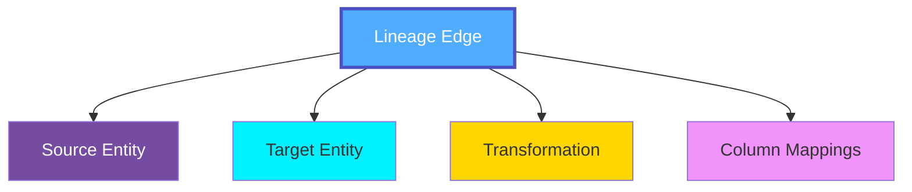
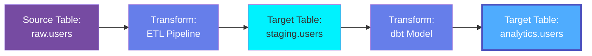
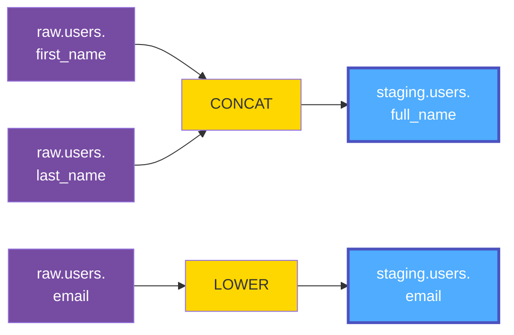
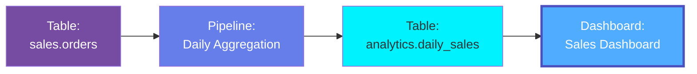
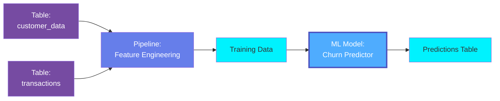

# Lineage

**Lineage** in OpenMetadata represents the data flow and dependencies between entities, showing how data moves from sources through transformations to destinations. Lineage enables impact analysis, root cause analysis, compliance tracking, and understanding of data provenance.

## Overview

Lineage in OpenMetadata captures:

- **Data Flow**: How data moves between tables, pipelines, dashboards, and models
- **Column-Level Lineage**: Detailed mappings showing column-to-column transformations
- **Transformation Logic**: SQL queries, pipeline code, functions that transform data
- **Dependencies**: Upstream sources and downstream consumers for any entity
- **Processing History**: When and how data was transformed
- **Impact Analysis**: What will be affected by changes to an entity

Lineage is essential for:
- Understanding data origins (provenance)
- Assessing impact of schema changes
- Debugging data quality issues
- Regulatory compliance (GDPR, CCPA)
- Data governance and trust
- Optimizing data pipelines

## Hierarchy



**Click on any node to learn more about that entity.**

## Lineage Types

### Table-Level Lineage

Shows relationships between tables:



### Column-Level Lineage

Shows how columns are derived and transformed:



### Pipeline Lineage

Shows data flow through pipelines:



### ML Model Lineage

Shows training data and model deployment:



## Schema Specifications

=== "JSON Schema"

    ```json
    {
      "$id": "https://open-metadata.org/schema/type/entityLineage.json",
      "$schema": "http://json-schema.org/draft-07/schema#",
      "title": "Entity Lineage",
      "description": "The `Lineage` for a given data asset, has information of the input datasets used and the ETL pipeline that created it.",
      "type": "object",
      "javaType": "org.openmetadata.schema.type.EntityLineage",
      "definitions": {
        "columnLineage": {
          "type": "object",
          "properties": {
            "fromColumns": {
              "description": "One or more source columns identified by fully qualified column name used by transformation function to create destination column.",
              "type": "array",
              "items": {
                "$ref": "../type/basic.json#/definitions/fullyQualifiedEntityName"
              }
            },
            "toColumn": {
              "description": "Destination column identified by fully qualified column name created by the transformation of source columns.",
              "$ref": "../type/basic.json#/definitions/fullyQualifiedEntityName"
            },
            "function": {
              "description": "Transformation function applied to source columns to create destination column. That is `function(fromColumns) -> toColumn`.",
              "$ref": "../type/basic.json#/definitions/sqlFunction"
            }
          }
        },
        "lineageDetails": {
          "description": "Lineage details including sqlQuery + pipeline + columnLineage.",
          "type": "object",
          "properties": {
            "sqlQuery": {
              "description": "SQL used for transformation.",
              "$ref": "../type/basic.json#/definitions/sqlQuery"
            },
            "columnsLineage": {
              "description": "Lineage information of how upstream columns were combined to get downstream column.",
              "type": "array",
              "items": {
                "$ref": "#/definitions/columnLineage"
              }
            },
            "pipeline": {
              "description": "Pipeline where the sqlQuery is periodically run.",
              "$ref": "../type/entityReference.json"
            },
            "description": {
              "description": "description of lineage",
              "type": "string"
            },
            "source": {
              "description": "Lineage type describes how a lineage was created.",
              "type": "string",
              "enum": [
                "Manual",
                "ViewLineage",
                "QueryLineage",
                "PipelineLineage",
                "DashboardLineage",
                "DbtLineage",
                "SparkLineage",
                "OpenLineage",
                "ExternalTableLineage",
                "CrossDatabaseLineage",
                "ChildAssets"
              ],
              "default": "Manual"
            },
            "createdAt": {
              "description": "Last update time corresponding to the new version of the entity in Unix epoch time milliseconds.",
              "$ref": "../type/basic.json#/definitions/timestamp"
            },
            "createdBy": {
              "description": "User who created the node.",
              "type": "string"
            },
            "updatedAt": {
              "description": "Last update time corresponding to the new version of the entity in Unix epoch time milliseconds.",
              "$ref": "../type/basic.json#/definitions/timestamp"
            },
            "updatedBy": {
              "description": "User who made the update.",
              "type": "string"
            },
            "assetEdges": {
              "description": "Asset count in case of child assets lineage.",
              "type": "integer",
              "default": null
            }
          }
        },
        "edge": {
          "description": "Edge in the lineage graph from one entity to another by entity IDs.",
          "type": "object",
          "javaType": "org.openmetadata.schema.type.Edge",
          "properties": {
            "fromEntity": {
              "description": "From entity that is upstream of lineage edge.",
              "$ref": "basic.json#/definitions/uuid"
            },
            "toEntity": {
              "description": "To entity that is downstream of lineage edge.",
              "$ref": "basic.json#/definitions/uuid"
            },
            "description": {
              "$ref": "basic.json#/definitions/markdown"
            },
            "lineageDetails": {
              "description": "Optional lineageDetails provided only for table to table lineage edge.",
              "$ref": "#/definitions/lineageDetails"
            }
          },
          "required": ["fromEntity", "toEntity"],
          "additionalProperties": false
        },
        "entitiesEdge": {
          "description": "Edge in the lineage graph from one entity to another using entity references.",
          "type": "object",
          "javaType": "org.openmetadata.schema.type.EntitiesEdge",
          "properties": {
            "fromEntity": {
              "description": "From entity that is upstream of lineage edge.",
              "$ref": "entityReference.json"
            },
            "toEntity": {
              "description": "To entity that is downstream of lineage edge.",
              "$ref": "entityReference.json"
            },
            "description": {
              "$ref": "basic.json#/definitions/markdown"
            },
            "lineageDetails": {
              "description": "Optional lineageDetails provided only for table to table lineage edge.",
              "$ref": "#/definitions/lineageDetails"
            }
          },
          "required": ["fromEntity", "toEntity"],
          "additionalProperties": false
        }
      },
      "properties": {
        "entity": {
          "description": "Primary entity for which this lineage graph is created.",
          "$ref": "entityReference.json"
        },
        "nodes": {
          "description": "All the entities that are the nodes in the lineage graph excluding the primary entity.",
          "type": "array",
          "items": {
            "$ref": "entityReference.json"
          },
          "default": null
        },
        "upstreamEdges": {
          "description": "All the edges in the lineage graph that are upstream from the primary entity.",
          "type": "array",
          "items": {
            "$ref": "#/definitions/edge"
          },
          "default": null
        },
        "downstreamEdges": {
          "description": "All the edges in the lineage graph that are downstream from the primary entity.",
          "type": "array",
          "items": {
            "$ref": "#/definitions/edge"
          },
          "default": null
        }
      },
      "required": ["entity"],
      "additionalProperties": false
    }
    ```

=== "RDF (Turtle)"

    ```turtle
    @prefix om: <https://open-metadata.org/schema/> .
    @prefix om-lineage: <https://open-metadata.org/schema/type/> .
    @prefix rdf: <http://www.w3.org/1999/02/22-rdf-syntax-ns#> .
    @prefix rdfs: <http://www.w3.org/2000/01/rdf-schema#> .
    @prefix owl: <http://www.w3.org/2002/07/owl#> .
    @prefix xsd: <http://www.w3.org/2001/XMLSchema#> .
    @prefix prov: <http://www.w3.org/ns/prov#> .

    # Entity Lineage Class
    om-lineage:EntityLineage a owl:Class ;
        rdfs:label "Entity Lineage" ;
        rdfs:comment "The Lineage for a given data asset, has information of the input datasets used and the ETL pipeline that created it." ;
        rdfs:isDefinedBy om: .

    # Edge Class Definition
    om-lineage:Edge a owl:Class ;
        rdfs:label "Edge" ;
        rdfs:comment "Edge in the lineage graph from one entity to another by entity IDs" ;
        rdfs:subClassOf prov:Entity ;
        rdfs:isDefinedBy om: .

    # Entities Edge Class
    om-lineage:EntitiesEdge a owl:Class ;
        rdfs:label "Entities Edge" ;
        rdfs:comment "Edge in the lineage graph from one entity to another using entity references" ;
        rdfs:subClassOf prov:Entity ;
        rdfs:isDefinedBy om: .

    # Column Lineage Class
    om-lineage:ColumnLineage a owl:Class ;
        rdfs:label "Column Lineage" ;
        rdfs:comment "Column-level lineage mapping" ;
        rdfs:isDefinedBy om: .

    # Lineage Details Class
    om-lineage:LineageDetails a owl:Class ;
        rdfs:label "Lineage Details" ;
        rdfs:comment "Lineage details including sqlQuery + pipeline + columnLineage" ;
        rdfs:isDefinedBy om: .

    # Properties for EntityLineage
    om-lineage:entity a owl:ObjectProperty ;
        rdfs:label "entity" ;
        rdfs:comment "Primary entity for which this lineage graph is created" ;
        rdfs:domain om-lineage:EntityLineage .

    om-lineage:nodes a owl:ObjectProperty ;
        rdfs:label "nodes" ;
        rdfs:comment "All the entities that are the nodes in the lineage graph excluding the primary entity" ;
        rdfs:domain om-lineage:EntityLineage .

    om-lineage:upstreamEdges a owl:ObjectProperty ;
        rdfs:label "upstream edges" ;
        rdfs:comment "All the edges in the lineage graph that are upstream from the primary entity" ;
        rdfs:domain om-lineage:EntityLineage ;
        rdfs:range om-lineage:Edge .

    om-lineage:downstreamEdges a owl:ObjectProperty ;
        rdfs:label "downstream edges" ;
        rdfs:comment "All the edges in the lineage graph that are downstream from the primary entity" ;
        rdfs:domain om-lineage:EntityLineage ;
        rdfs:range om-lineage:Edge .

    # Properties for Edge
    om-lineage:fromEntity a owl:DatatypeProperty ;
        rdfs:label "from entity" ;
        rdfs:comment "From entity that is upstream of lineage edge" ;
        rdfs:domain om-lineage:Edge ;
        rdfs:range xsd:string ;
        rdfs:subPropertyOf prov:used .

    om-lineage:toEntity a owl:DatatypeProperty ;
        rdfs:label "to entity" ;
        rdfs:comment "To entity that is downstream of lineage edge" ;
        rdfs:domain om-lineage:Edge ;
        rdfs:range xsd:string ;
        rdfs:subPropertyOf prov:wasGeneratedBy .

    om-lineage:lineageDetails a owl:ObjectProperty ;
        rdfs:label "lineage details" ;
        rdfs:comment "Optional lineageDetails provided only for table to table lineage edge" ;
        rdfs:domain om-lineage:Edge ;
        rdfs:range om-lineage:LineageDetails .

    # Properties for LineageDetails
    om-lineage:sqlQuery a owl:DatatypeProperty ;
        rdfs:label "SQL query" ;
        rdfs:comment "SQL used for transformation" ;
        rdfs:domain om-lineage:LineageDetails ;
        rdfs:range xsd:string .

    om-lineage:columnsLineage a owl:ObjectProperty ;
        rdfs:label "columns lineage" ;
        rdfs:comment "Lineage information of how upstream columns were combined to get downstream column" ;
        rdfs:domain om-lineage:LineageDetails ;
        rdfs:range om-lineage:ColumnLineage .

    om-lineage:pipeline a owl:ObjectProperty ;
        rdfs:label "pipeline" ;
        rdfs:comment "Pipeline where the sqlQuery is periodically run" ;
        rdfs:domain om-lineage:LineageDetails ;
        rdfs:subPropertyOf prov:wasGeneratedBy .

    om-lineage:source a owl:DatatypeProperty ;
        rdfs:label "source" ;
        rdfs:comment "Lineage type describes how a lineage was created" ;
        rdfs:domain om-lineage:LineageDetails ;
        rdfs:range xsd:string .

    om-lineage:createdAt a owl:DatatypeProperty ;
        rdfs:label "created at" ;
        rdfs:comment "Last update time corresponding to the new version of the entity in Unix epoch time milliseconds" ;
        rdfs:domain om-lineage:LineageDetails ;
        rdfs:range xsd:long .

    om-lineage:createdBy a owl:DatatypeProperty ;
        rdfs:label "created by" ;
        rdfs:comment "User who created the node" ;
        rdfs:domain om-lineage:LineageDetails ;
        rdfs:range xsd:string .

    om-lineage:updatedAt a owl:DatatypeProperty ;
        rdfs:label "updated at" ;
        rdfs:comment "Last update time corresponding to the new version of the entity in Unix epoch time milliseconds" ;
        rdfs:domain om-lineage:LineageDetails ;
        rdfs:range xsd:long .

    om-lineage:updatedBy a owl:DatatypeProperty ;
        rdfs:label "updated by" ;
        rdfs:comment "User who made the update" ;
        rdfs:domain om-lineage:LineageDetails ;
        rdfs:range xsd:string .

    om-lineage:assetEdges a owl:DatatypeProperty ;
        rdfs:label "asset edges" ;
        rdfs:comment "Asset count in case of child assets lineage" ;
        rdfs:domain om-lineage:LineageDetails ;
        rdfs:range xsd:integer .

    # Properties for ColumnLineage
    om-lineage:fromColumns a owl:DatatypeProperty ;
        rdfs:label "from columns" ;
        rdfs:comment "One or more source columns identified by fully qualified column name" ;
        rdfs:domain om-lineage:ColumnLineage ;
        rdfs:range xsd:string .

    om-lineage:toColumn a owl:DatatypeProperty ;
        rdfs:label "to column" ;
        rdfs:comment "Destination column identified by fully qualified column name" ;
        rdfs:domain om-lineage:ColumnLineage ;
        rdfs:range xsd:string .

    om-lineage:function a owl:DatatypeProperty ;
        rdfs:label "function" ;
        rdfs:comment "Transformation function applied to source columns to create destination column" ;
        rdfs:domain om-lineage:ColumnLineage ;
        rdfs:range xsd:string .
    ```

=== "JSON-LD Context"

    ```json
    {
      "@context": {
        "@vocab": "https://open-metadata.org/schema/type/",
        "rdf": "http://www.w3.org/1999/02/22-rdf-syntax-ns#",
        "rdfs": "http://www.w3.org/2000/01/rdf-schema#",
        "owl": "http://www.w3.org/2002/07/owl#",
        "xsd": "http://www.w3.org/2001/XMLSchema#",
        "prov": "http://www.w3.org/ns/prov#",
        "om": "https://open-metadata.org/schema/",

        "EntityLineage": {
          "@id": "om:EntityLineage",
          "@type": "@id"
        },
        "Edge": {
          "@id": "om:Edge",
          "@type": "@id"
        },
        "EntitiesEdge": {
          "@id": "om:EntitiesEdge",
          "@type": "@id"
        },
        "ColumnLineage": {
          "@id": "om:ColumnLineage",
          "@type": "@id"
        },
        "LineageDetails": {
          "@id": "om:LineageDetails",
          "@type": "@id"
        },
        "entity": {
          "@id": "om:entity",
          "@type": "@id"
        },
        "nodes": {
          "@id": "om:nodes",
          "@type": "@id",
          "@container": "@set"
        },
        "upstreamEdges": {
          "@id": "om:upstreamEdges",
          "@type": "@id",
          "@container": "@set"
        },
        "downstreamEdges": {
          "@id": "om:downstreamEdges",
          "@type": "@id",
          "@container": "@set"
        },
        "fromEntity": {
          "@id": "prov:used",
          "@type": "xsd:string"
        },
        "toEntity": {
          "@id": "prov:wasGeneratedBy",
          "@type": "xsd:string"
        },
        "lineageDetails": {
          "@id": "om:lineageDetails",
          "@type": "@id"
        },
        "sqlQuery": {
          "@id": "om:sqlQuery",
          "@type": "xsd:string"
        },
        "columnsLineage": {
          "@id": "om:columnsLineage",
          "@type": "@id",
          "@container": "@set"
        },
        "pipeline": {
          "@id": "om:pipeline",
          "@type": "@id"
        },
        "description": {
          "@id": "om:description",
          "@type": "xsd:string"
        },
        "source": {
          "@id": "om:source",
          "@type": "xsd:string"
        },
        "createdAt": {
          "@id": "om:createdAt",
          "@type": "xsd:long"
        },
        "createdBy": {
          "@id": "om:createdBy",
          "@type": "xsd:string"
        },
        "updatedAt": {
          "@id": "om:updatedAt",
          "@type": "xsd:long"
        },
        "updatedBy": {
          "@id": "om:updatedBy",
          "@type": "xsd:string"
        },
        "assetEdges": {
          "@id": "om:assetEdges",
          "@type": "xsd:integer"
        },
        "fromColumns": {
          "@id": "om:fromColumns",
          "@type": "xsd:string",
          "@container": "@set"
        },
        "toColumn": {
          "@id": "om:toColumn",
          "@type": "xsd:string"
        },
        "function": {
          "@id": "om:function",
          "@type": "xsd:string"
        }
      }
    }
    ```

## Lineage Examples

### Simple Table Lineage

```json
{
  "entity": {
    "type": "table",
    "name": "analytics.customer_summary"
  },
  "upstreamEdges": [
    {
      "fromEntity": "2fa85f64-5717-4562-b3fc-2c963f66afa5",
      "toEntity": "3fa85f64-5717-4562-b3fc-2c963f66afa6",
      "lineageDetails": {
        "pipeline": {
          "type": "pipeline",
          "name": "CustomerAggregationPipeline"
        },
        "source": "PipelineLineage"
      }
    }
  ],
  "downstreamEdges": [
    {
      "fromEntity": "3fa85f64-5717-4562-b3fc-2c963f66afa6",
      "toEntity": "4fa85f64-5717-4562-b3fc-2c963f66afa7",
      "lineageDetails": {
        "source": "DashboardLineage"
      }
    }
  ]
}
```

### Column-Level Lineage

```json
{
  "entity": {
    "type": "table",
    "name": "staging.users"
  },
  "upstreamEdges": [
    {
      "fromEntity": "3fa85f64-5717-4562-b3fc-2c963f66afa6",
      "toEntity": "7fa85f64-5717-4562-b3fc-2c963f66afa8",
      "lineageDetails": {
        "sqlQuery": "SELECT CONCAT(first_name, ' ', last_name) as full_name, LOWER(email) as email FROM raw.users",
        "source": "QueryLineage",
        "columnsLineage": [
          {
            "fromColumns": ["raw.users.first_name", "raw.users.last_name"],
            "toColumn": "staging.users.full_name",
            "function": "CONCAT"
          },
          {
            "fromColumns": ["raw.users.email"],
            "toColumn": "staging.users.email",
            "function": "LOWER"
          }
        ]
      }
    }
  ]
}
```

### Multi-Hop Lineage

```json
{
  "entity": {
    "type": "dashboard",
    "name": "SalesDashboard",
    "id": "8fa85f64-5717-4562-b3fc-2c963f66afab"
  },
  "nodes": [
    {"type": "table", "name": "raw.orders", "id": "5fa85f64-5717-4562-b3fc-2c963f66afa8"},
    {"type": "table", "name": "staging.orders", "id": "6fa85f64-5717-4562-b3fc-2c963f66afa9"},
    {"type": "table", "name": "analytics.daily_sales", "id": "7fa85f64-5717-4562-b3fc-2c963f66afaa"}
  ],
  "upstreamEdges": [
    {
      "fromEntity": "5fa85f64-5717-4562-b3fc-2c963f66afa8",
      "toEntity": "6fa85f64-5717-4562-b3fc-2c963f66afa9",
      "lineageDetails": {
        "pipeline": {
          "type": "pipeline",
          "name": "ETLPipeline",
          "id": "9fa85f64-5717-4562-b3fc-2c963f66afac"
        },
        "source": "PipelineLineage"
      }
    },
    {
      "fromEntity": "6fa85f64-5717-4562-b3fc-2c963f66afa9",
      "toEntity": "7fa85f64-5717-4562-b3fc-2c963f66afaa",
      "lineageDetails": {
        "sqlQuery": "SELECT DATE(order_date) as date, SUM(amount) as total FROM staging.orders GROUP BY DATE(order_date)",
        "source": "QueryLineage"
      }
    },
    {
      "fromEntity": "7fa85f64-5717-4562-b3fc-2c963f66afaa",
      "toEntity": "8fa85f64-5717-4562-b3fc-2c963f66afab",
      "lineageDetails": {
        "source": "DashboardLineage"
      }
    }
  ]
}
```

## Lineage Sources

Lineage can be captured from multiple sources:

### Manual
User-defined relationships:
- Custom mappings
- External processes
- Spreadsheet derivations
- Manual documentation

### ViewLineage
Automatically from view definitions:
- Database views
- Materialized views
- Temporary views

### QueryLineage
Automatically extracted from SQL queries:
- `CREATE VIEW` statements
- `INSERT INTO ... SELECT` queries
- ETL SQL transformations
- Query logs and history

### PipelineLineage
Extracted from pipeline metadata:
- Apache Airflow DAGs
- Custom pipeline definitions
- ETL pipeline workflows

### DashboardLineage
Extracted from dashboard metadata:
- Dashboard to table relationships
- Chart data sources
- Dashboard dependencies

### DbtLineage
Comprehensive lineage from dbt:
- Model dependencies
- Source references
- Test relationships
- Macro transformations

### SparkLineage
Extracted from Spark jobs:
- Spark dataframe transformations
- RDD operations
- Dataset lineage

### OpenLineage
Integration with OpenLineage standard:
- Cross-platform lineage
- Standardized lineage events
- Integration with OpenLineage-compatible tools

### ExternalTableLineage
Lineage for external tables:
- External table references
- Cloud storage sources
- External data sources

### CrossDatabaseLineage
Lineage across different databases:
- Cross-database queries
- Multi-database transformations
- Federated queries

### ChildAssets
Lineage for child assets:
- Parent-child relationships
- Nested structures
- Aggregated asset lineage

## Use Cases

### Impact Analysis

Assess the impact of schema changes:

```javascript
async function assessImpact(tableId) {
  const lineage = await getLineage(tableId, { depth: 5, direction: 'downstream' });

  return {
    affectedTables: lineage.nodes.filter(n => n.type === 'table'),
    affectedDashboards: lineage.nodes.filter(n => n.type === 'dashboard'),
    affectedMLModels: lineage.nodes.filter(n => n.type === 'mlmodel'),
    affectedPipelines: lineage.edges.map(e => e.pipeline).filter(Boolean)
  };
}
```

### Root Cause Analysis

Trace data quality issues to source:

```javascript
async function findRootCause(tableId) {
  const lineage = await getLineage(tableId, { depth: 10, direction: 'upstream' });

  // Find the original source tables
  const sources = lineage.nodes.filter(node => {
    return !lineage.upstreamEdges.some(edge => edge.toEntity.id === node.id);
  });

  return sources;
}
```

### Data Provenance

Track data origins for compliance:

```javascript
async function getDataProvenance(columnName, tableId) {
  const lineage = await getColumnLineage(tableId, columnName, { depth: 10 });

  return lineage.map(edge => ({
    source: edge.fromColumns,
    target: edge.toColumn,
    transformation: edge.function,
    query: edge.sqlQuery
  }));
}
```

### Pipeline Optimization

Identify redundant transformations:

```javascript
async function findRedundantPaths(targetTable) {
  const lineage = await getLineage(targetTable, { depth: 5 });

  // Find tables that appear in multiple paths
  const pathCounts = {};
  lineage.edges.forEach(edge => {
    const key = `${edge.fromEntity.id}->${edge.toEntity.id}`;
    pathCounts[key] = (pathCounts[key] || 0) + 1;
  });

  return Object.entries(pathCounts).filter(([_, count]) => count > 1);
}
```

## Best Practices

### 1. Capture Lineage at Source
Automate lineage extraction from queries and pipelines.

### 2. Maintain Column-Level Detail
Capture column mappings for precise impact analysis.

### 3. Document Transformations
Include SQL queries or transformation logic in lineage.

### 4. Regular Updates
Keep lineage current with automated ingestion.

### 5. Validate Lineage
Periodically verify lineage accuracy.

### 6. Use Appropriate Depth
Balance completeness with query performance.

### 7. Tag Critical Paths
Identify and tag critical data flows.

### 8. Combine Multiple Sources
Use query, pipeline, and manual lineage together.

## API Operations

### Get Entity Lineage

```http
GET /api/v1/lineage/{entityType}/{id}?upstreamDepth=3&downstreamDepth=2
```

### Get Column Lineage

```http
GET /api/v1/lineage/table/{id}/column/{columnName}?depth=5
```

### Add Manual Lineage

```http
PUT /api/v1/lineage
Content-Type: application/json

{
  "edge": {
    "fromEntity": "3fa85f64-5717-4562-b3fc-2c963f66afa6",
    "toEntity": "7fa85f64-5717-4562-b3fc-2c963f66afa8",
    "description": "Manual mapping between source and target tables",
    "lineageDetails": {
      "source": "Manual",
      "description": "Custom lineage relationship",
      "columnsLineage": [
        {
          "fromColumns": ["source.table.column1"],
          "toColumn": "target.table.column1",
          "function": "DIRECT"
        }
      ]
    }
  }
}
```

### Delete Lineage Edge

```http
DELETE /api/v1/lineage?fromId=source-id&toId=target-id
```

## Related Entities

- **[Table](../data-assets/databases/table.md)**: Tables in lineage graphs
- **[Pipeline](../data-assets/pipelines/pipeline.md)**: Pipelines transforming data
- **[Dashboard](../data-assets/dashboards/dashboard.md)**: Dashboards consuming data
- **[ML Model](../data-assets/ml/mlmodel.md)**: Models using training data
- **[Column](../data-assets/databases/column.md)**: Column-level lineage
- **[Query](../data-assets/databases/query.md)**: SQL queries defining lineage
- **[Change Event](../events/change-event.md)**: Events updating lineage
