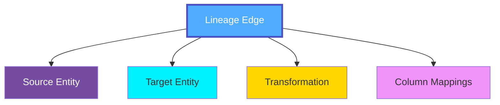
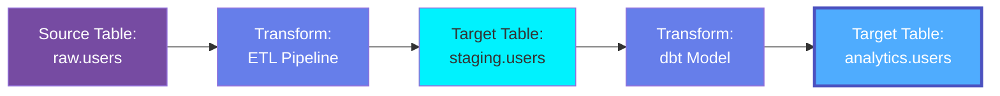
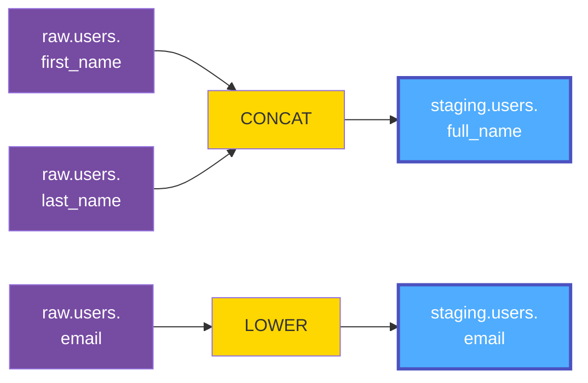
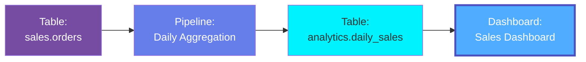
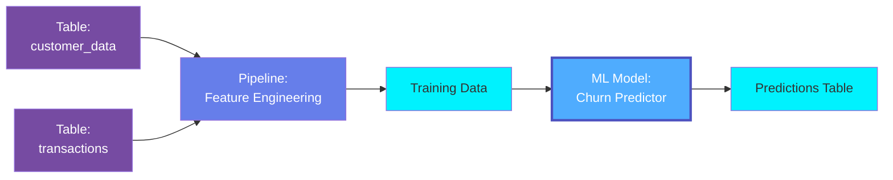

# Lineage

**Lineage** in OpenMetadata represents the data flow and dependencies between entities, showing how data moves from sources through transformations to destinations. Lineage enables impact analysis, root cause analysis, compliance tracking, and understanding of data provenance.

## Overview

Lineage in OpenMetadata captures:

- **Data Flow**: How data moves between tables, pipelines, dashboards, and models
- **Column-Level Lineage**: Detailed mappings showing column-to-column transformations
- **Transformation Logic**: SQL queries, pipeline code, functions that transform data
- **Dependencies**: Upstream sources and downstream consumers for any entity
- **Processing History**: When and how data was transformed
- **Impact Analysis**: What will be affected by changes to an entity

Lineage is essential for:
- Understanding data origins (provenance)
- Assessing impact of schema changes
- Debugging data quality issues
- Regulatory compliance (GDPR, CCPA)
- Data governance and trust
- Optimizing data pipelines

## Hierarchy



**Click on any node to learn more about that entity.**

## Lineage Types

### Table-Level Lineage

Shows relationships between tables:



### Column-Level Lineage

Shows how columns are derived and transformed:



### Pipeline Lineage

Shows data flow through pipelines:



### ML Model Lineage

Shows training data and model deployment:



## Schema Specifications

=== "JSON Schema"

    ```json
    {
      "$id": "https://open-metadata.org/schema/type/entityLineage.json",
      "$schema": "http://json-schema.org/draft-07/schema#",
      "title": "EntityLineage",
      "description": "Lineage information for an entity showing upstream and downstream dependencies.",
      "type": "object",
      "javaType": "org.openmetadata.schema.type.EntityLineage",
      "definitions": {
        "lineageEdge": {
          "type": "object",
          "description": "Edge in the lineage graph",
          "properties": {
            "fromEntity": {
              "description": "Source entity reference",
              "$ref": "../type/entityReference.json"
            },
            "toEntity": {
              "description": "Target entity reference",
              "$ref": "../type/entityReference.json"
            },
            "description": {
              "description": "Description of the relationship",
              "type": "string"
            },
            "sqlQuery": {
              "description": "SQL query that defines the transformation",
              "type": "string"
            },
            "pipeline": {
              "description": "Pipeline that performs the transformation",
              "$ref": "../type/entityReference.json"
            },
            "columns": {
              "description": "Column-level lineage mappings",
              "type": "array",
              "items": {
                "$ref": "#/definitions/columnLineage"
              }
            },
            "function": {
              "description": "Transformation function applied",
              "type": "string"
            }
          },
          "required": [
            "fromEntity",
            "toEntity"
          ]
        },
        "columnLineage": {
          "type": "object",
          "description": "Column-level lineage mapping",
          "properties": {
            "fromColumns": {
              "description": "Source column names",
              "type": "array",
              "items": {
                "type": "string"
              }
            },
            "toColumn": {
              "description": "Target column name",
              "type": "string"
            },
            "function": {
              "description": "Transformation function (CONCAT, SUM, etc.)",
              "type": "string"
            }
          },
          "required": [
            "toColumn"
          ]
        },
        "lineageDetails": {
          "type": "object",
          "description": "Additional lineage metadata",
          "properties": {
            "pipeline": {
              "description": "Pipeline performing the transformation",
              "$ref": "../type/entityReference.json"
            },
            "source": {
              "description": "How lineage was captured",
              "type": "string",
              "enum": [
                "Manual",
                "QueryLineage",
                "PipelineLineage",
                "DbtLineage",
                "ViewLineage"
              ]
            },
            "sqlQuery": {
              "description": "SQL query defining the transformation",
              "type": "string"
            },
            "columnsLineage": {
              "description": "Column-level lineage",
              "type": "array",
              "items": {
                "$ref": "#/definitions/columnLineage"
              }
            }
          }
        }
      },
      "properties": {
        "entity": {
          "description": "Entity for which lineage is being captured",
          "$ref": "../type/entityReference.json"
        },
        "nodes": {
          "description": "All nodes in the lineage graph",
          "type": "array",
          "items": {
            "$ref": "../type/entityReference.json"
          }
        },
        "upstreamEdges": {
          "description": "Edges from upstream sources to this entity",
          "type": "array",
          "items": {
            "$ref": "#/definitions/lineageEdge"
          }
        },
        "downstreamEdges": {
          "description": "Edges from this entity to downstream targets",
          "type": "array",
          "items": {
            "$ref": "#/definitions/lineageEdge"
          }
        },
        "depth": {
          "description": "Depth of lineage traversal",
          "type": "integer",
          "default": 1
        }
      },
      "required": [
        "entity"
      ],
      "additionalProperties": false
    }
    ```

=== "RDF (Turtle)"

    ```turtle
    @prefix om: <https://open-metadata.org/schema/> .
    @prefix om-lineage: <https://open-metadata.org/schema/type/> .
    @prefix rdf: <http://www.w3.org/1999/02/22-rdf-syntax-ns#> .
    @prefix rdfs: <http://www.w3.org/2000/01/rdf-schema#> .
    @prefix owl: <http://www.w3.org/2002/07/owl#> .
    @prefix xsd: <http://www.w3.org/2001/XMLSchema#> .
    @prefix prov: <http://www.w3.org/ns/prov#> .

    # Lineage Edge Class Definition
    om-lineage:LineageEdge a owl:Class ;
        rdfs:label "Lineage Edge" ;
        rdfs:comment "Edge in the lineage graph showing data flow" ;
        rdfs:subClassOf prov:Entity ;
        rdfs:isDefinedBy om: .

    # Column Lineage Class
    om-lineage:ColumnLineage a owl:Class ;
        rdfs:label "Column Lineage" ;
        rdfs:comment "Column-level lineage mapping" ;
        rdfs:isDefinedBy om: .

    # Entity Lineage Class
    om-lineage:EntityLineage a owl:Class ;
        rdfs:label "Entity Lineage" ;
        rdfs:comment "Complete lineage graph for an entity" ;
        rdfs:isDefinedBy om: .

    # Properties
    om-lineage:fromEntity a owl:ObjectProperty ;
        rdfs:label "from entity" ;
        rdfs:comment "Source entity in lineage" ;
        rdfs:domain om-lineage:LineageEdge ;
        rdfs:subPropertyOf prov:used .

    om-lineage:toEntity a owl:ObjectProperty ;
        rdfs:label "to entity" ;
        rdfs:comment "Target entity in lineage" ;
        rdfs:domain om-lineage:LineageEdge ;
        rdfs:subPropertyOf prov:wasGeneratedBy .

    om-lineage:sqlQuery a owl:DatatypeProperty ;
        rdfs:label "SQL query" ;
        rdfs:comment "SQL transformation query" ;
        rdfs:domain om-lineage:LineageEdge ;
        rdfs:range xsd:string .

    om-lineage:pipeline a owl:ObjectProperty ;
        rdfs:label "pipeline" ;
        rdfs:comment "Pipeline performing transformation" ;
        rdfs:domain om-lineage:LineageEdge ;
        rdfs:subPropertyOf prov:wasGeneratedBy .

    om-lineage:hasColumnLineage a owl:ObjectProperty ;
        rdfs:label "has column lineage" ;
        rdfs:comment "Column-level lineage mappings" ;
        rdfs:domain om-lineage:LineageEdge ;
        rdfs:range om-lineage:ColumnLineage .

    om-lineage:fromColumn a owl:DatatypeProperty ;
        rdfs:label "from column" ;
        rdfs:comment "Source column" ;
        rdfs:domain om-lineage:ColumnLineage ;
        rdfs:range xsd:string .

    om-lineage:toColumn a owl:DatatypeProperty ;
        rdfs:label "to column" ;
        rdfs:comment "Target column" ;
        rdfs:domain om-lineage:ColumnLineage ;
        rdfs:range xsd:string .

    om-lineage:transformationFunction a owl:DatatypeProperty ;
        rdfs:label "transformation function" ;
        rdfs:comment "Function applied in transformation" ;
        rdfs:domain om-lineage:ColumnLineage ;
        rdfs:range xsd:string .

    om-lineage:upstreamEdge a owl:ObjectProperty ;
        rdfs:label "upstream edge" ;
        rdfs:comment "Edge from upstream source" ;
        rdfs:domain om-lineage:EntityLineage ;
        rdfs:range om-lineage:LineageEdge .

    om-lineage:downstreamEdge a owl:ObjectProperty ;
        rdfs:label "downstream edge" ;
        rdfs:comment "Edge to downstream target" ;
        rdfs:domain om-lineage:EntityLineage ;
        rdfs:range om-lineage:LineageEdge .

    om-lineage:lineageDepth a owl:DatatypeProperty ;
        rdfs:label "lineage depth" ;
        rdfs:comment "Depth of lineage traversal" ;
        rdfs:domain om-lineage:EntityLineage ;
        rdfs:range xsd:integer .
    ```

=== "JSON-LD Context"

    ```json
    {
      "@context": {
        "@vocab": "https://open-metadata.org/schema/type/",
        "rdf": "http://www.w3.org/1999/02/22-rdf-syntax-ns#",
        "rdfs": "http://www.w3.org/2000/01/rdf-schema#",
        "owl": "http://www.w3.org/2002/07/owl#",
        "xsd": "http://www.w3.org/2001/XMLSchema#",
        "prov": "http://www.w3.org/ns/prov#",
        "om": "https://open-metadata.org/schema/",

        "EntityLineage": {
          "@id": "om:EntityLineage",
          "@type": "@id"
        },
        "LineageEdge": {
          "@id": "om:LineageEdge",
          "@type": "@id"
        },
        "entity": {
          "@id": "om:entity",
          "@type": "@id"
        },
        "fromEntity": {
          "@id": "prov:used",
          "@type": "@id"
        },
        "toEntity": {
          "@id": "prov:wasGeneratedBy",
          "@type": "@id"
        },
        "sqlQuery": {
          "@id": "om:sqlQuery",
          "@type": "xsd:string"
        },
        "pipeline": {
          "@id": "om:pipeline",
          "@type": "@id"
        },
        "upstreamEdges": {
          "@id": "om:upstreamEdge",
          "@type": "@id",
          "@container": "@set"
        },
        "downstreamEdges": {
          "@id": "om:downstreamEdge",
          "@type": "@id",
          "@container": "@set"
        },
        "columns": {
          "@id": "om:hasColumnLineage",
          "@type": "@id",
          "@container": "@set"
        },
        "fromColumns": {
          "@id": "om:fromColumn",
          "@type": "xsd:string",
          "@container": "@set"
        },
        "toColumn": {
          "@id": "om:toColumn",
          "@type": "xsd:string"
        },
        "function": {
          "@id": "om:transformationFunction",
          "@type": "xsd:string"
        },
        "depth": {
          "@id": "om:lineageDepth",
          "@type": "xsd:integer"
        }
      }
    }
    ```

## Lineage Examples

### Simple Table Lineage

```json
{
  "entity": {
    "type": "table",
    "name": "analytics.customer_summary"
  },
  "upstreamEdges": [
    {
      "fromEntity": {
        "type": "table",
        "name": "staging.customers"
      },
      "toEntity": {
        "type": "table",
        "name": "analytics.customer_summary"
      },
      "pipeline": {
        "type": "pipeline",
        "name": "CustomerAggregationPipeline"
      }
    }
  ],
  "downstreamEdges": [
    {
      "fromEntity": {
        "type": "table",
        "name": "analytics.customer_summary"
      },
      "toEntity": {
        "type": "dashboard",
        "name": "CustomerDashboard"
      }
    }
  ]
}
```

### Column-Level Lineage

```json
{
  "entity": {
    "type": "table",
    "name": "staging.users"
  },
  "upstreamEdges": [
    {
      "fromEntity": {
        "type": "table",
        "name": "raw.users"
      },
      "toEntity": {
        "type": "table",
        "name": "staging.users"
      },
      "sqlQuery": "SELECT CONCAT(first_name, ' ', last_name) as full_name, LOWER(email) as email FROM raw.users",
      "columns": [
        {
          "fromColumns": ["first_name", "last_name"],
          "toColumn": "full_name",
          "function": "CONCAT"
        },
        {
          "fromColumns": ["email"],
          "toColumn": "email",
          "function": "LOWER"
        }
      ]
    }
  ]
}
```

### Multi-Hop Lineage

```json
{
  "entity": {
    "type": "dashboard",
    "name": "SalesDashboard"
  },
  "nodes": [
    {"type": "table", "name": "raw.orders"},
    {"type": "table", "name": "staging.orders"},
    {"type": "table", "name": "analytics.daily_sales"},
    {"type": "dashboard", "name": "SalesDashboard"}
  ],
  "upstreamEdges": [
    {
      "fromEntity": {"type": "table", "name": "raw.orders"},
      "toEntity": {"type": "table", "name": "staging.orders"},
      "pipeline": {"type": "pipeline", "name": "ETLPipeline"}
    },
    {
      "fromEntity": {"type": "table", "name": "staging.orders"},
      "toEntity": {"type": "table", "name": "analytics.daily_sales"},
      "sqlQuery": "SELECT DATE(order_date) as date, SUM(amount) as total FROM staging.orders GROUP BY DATE(order_date)"
    },
    {
      "fromEntity": {"type": "table", "name": "analytics.daily_sales"},
      "toEntity": {"type": "dashboard", "name": "SalesDashboard"}
    }
  ],
  "depth": 3
}
```

## Lineage Sources

Lineage can be captured from multiple sources:

### Query-Based Lineage
Automatically extracted from SQL queries:
- `CREATE VIEW` statements
- `INSERT INTO ... SELECT` queries
- ETL SQL transformations
- Query logs and history

### Pipeline Lineage
Extracted from pipeline metadata:
- Apache Airflow DAGs
- dbt models and dependencies
- Spark job lineage
- Custom pipeline definitions

### dbt Lineage
Comprehensive lineage from dbt:
- Model dependencies
- Source references
- Test relationships
- Macro transformations

### View Lineage
Automatically from view definitions:
- Database views
- Materialized views
- Temporary views

### Manual Lineage
User-defined relationships:
- Custom mappings
- External processes
- Spreadsheet derivations
- Manual documentation

## Use Cases

### Impact Analysis

Assess the impact of schema changes:

```javascript
async function assessImpact(tableId) {
  const lineage = await getLineage(tableId, { depth: 5, direction: 'downstream' });

  return {
    affectedTables: lineage.nodes.filter(n => n.type === 'table'),
    affectedDashboards: lineage.nodes.filter(n => n.type === 'dashboard'),
    affectedMLModels: lineage.nodes.filter(n => n.type === 'mlmodel'),
    affectedPipelines: lineage.edges.map(e => e.pipeline).filter(Boolean)
  };
}
```

### Root Cause Analysis

Trace data quality issues to source:

```javascript
async function findRootCause(tableId) {
  const lineage = await getLineage(tableId, { depth: 10, direction: 'upstream' });

  // Find the original source tables
  const sources = lineage.nodes.filter(node => {
    return !lineage.upstreamEdges.some(edge => edge.toEntity.id === node.id);
  });

  return sources;
}
```

### Data Provenance

Track data origins for compliance:

```javascript
async function getDataProvenance(columnName, tableId) {
  const lineage = await getColumnLineage(tableId, columnName, { depth: 10 });

  return lineage.map(edge => ({
    source: edge.fromColumns,
    target: edge.toColumn,
    transformation: edge.function,
    query: edge.sqlQuery
  }));
}
```

### Pipeline Optimization

Identify redundant transformations:

```javascript
async function findRedundantPaths(targetTable) {
  const lineage = await getLineage(targetTable, { depth: 5 });

  // Find tables that appear in multiple paths
  const pathCounts = {};
  lineage.edges.forEach(edge => {
    const key = `${edge.fromEntity.id}->${edge.toEntity.id}`;
    pathCounts[key] = (pathCounts[key] || 0) + 1;
  });

  return Object.entries(pathCounts).filter(([_, count]) => count > 1);
}
```

## Best Practices

### 1. Capture Lineage at Source
Automate lineage extraction from queries and pipelines.

### 2. Maintain Column-Level Detail
Capture column mappings for precise impact analysis.

### 3. Document Transformations
Include SQL queries or transformation logic in lineage.

### 4. Regular Updates
Keep lineage current with automated ingestion.

### 5. Validate Lineage
Periodically verify lineage accuracy.

### 6. Use Appropriate Depth
Balance completeness with query performance.

### 7. Tag Critical Paths
Identify and tag critical data flows.

### 8. Combine Multiple Sources
Use query, pipeline, and manual lineage together.

## API Operations

### Get Entity Lineage

```http
GET /api/v1/lineage/{entityType}/{id}?upstreamDepth=3&downstreamDepth=2
```

### Get Column Lineage

```http
GET /api/v1/lineage/table/{id}/column/{columnName}?depth=5
```

### Add Manual Lineage

```http
PUT /api/v1/lineage
Content-Type: application/json

{
  "edge": {
    "fromEntity": {"type": "table", "id": "source-id"},
    "toEntity": {"type": "table", "id": "target-id"},
    "description": "Manual mapping",
    "columns": [...]
  }
}
```

### Delete Lineage Edge

```http
DELETE /api/v1/lineage?fromId=source-id&toId=target-id
```

## Related Entities

- **[Table](../data-assets/databases/table.md)**: Tables in lineage graphs
- **[Pipeline](../data-assets/pipelines/pipeline.md)**: Pipelines transforming data
- **[Dashboard](../data-assets/dashboards/dashboard.md)**: Dashboards consuming data
- **[ML Model](../data-assets/ml/mlmodel.md)**: Models using training data
- **[Column](../data-assets/databases/column.md)**: Column-level lineage
- **[Query](../data-assets/databases/query.md)**: SQL queries defining lineage
- **[Change Event](../events/change-event.md)**: Events updating lineage
