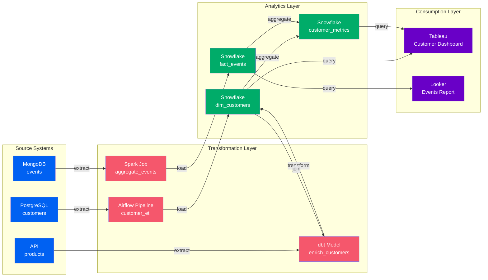
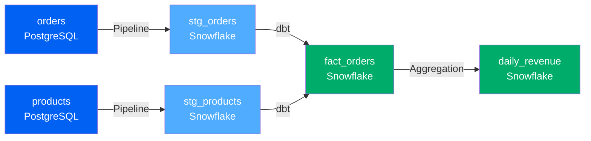
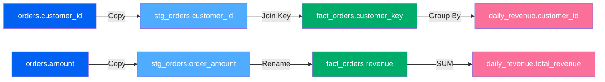
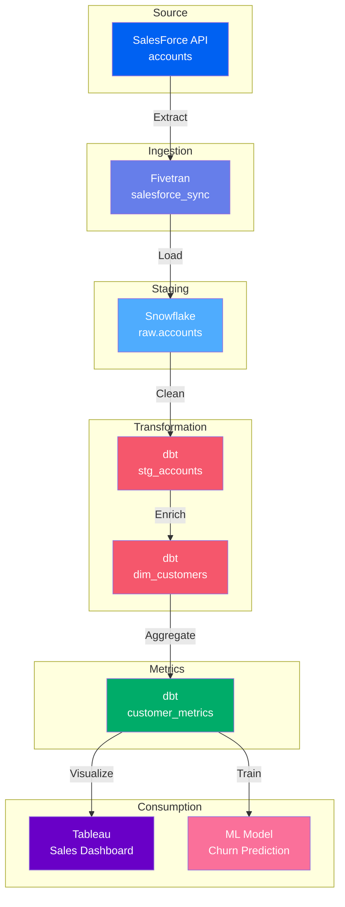
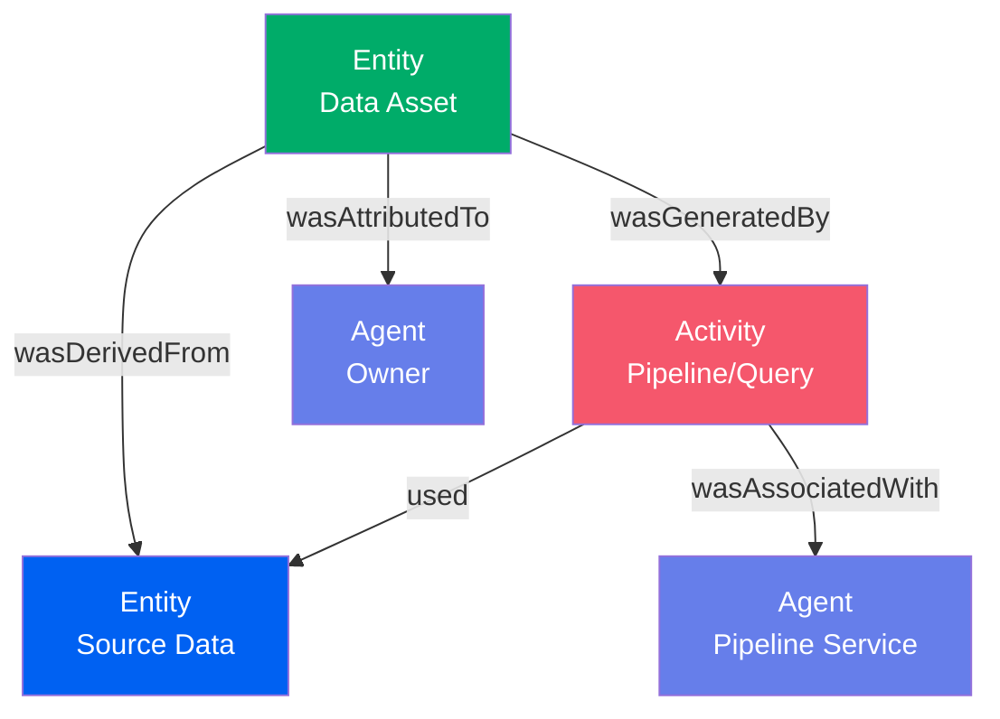
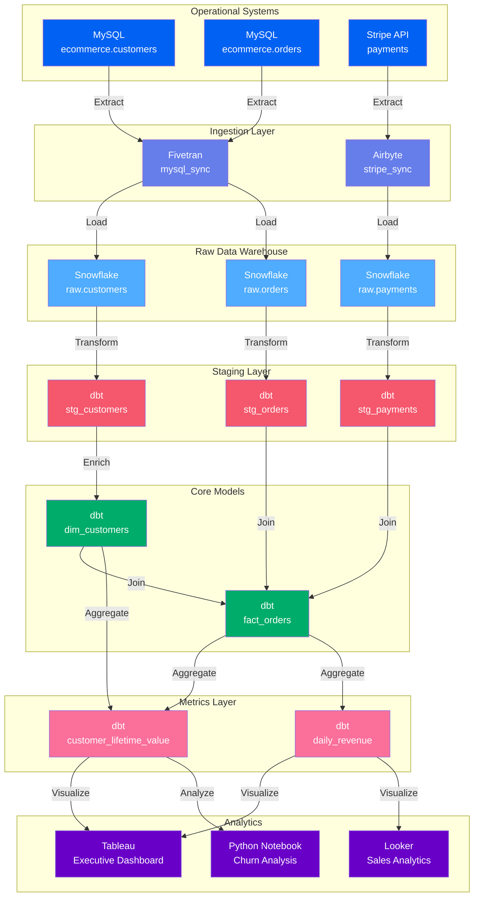
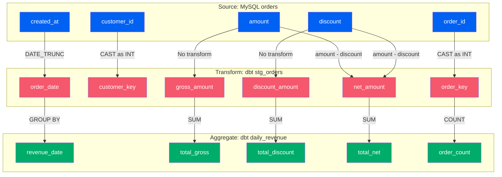
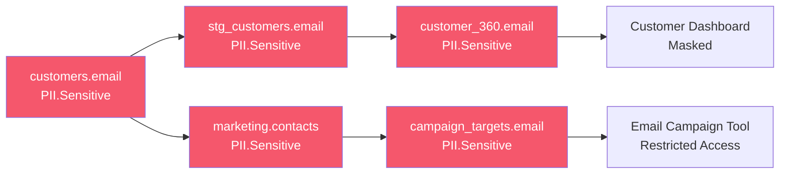
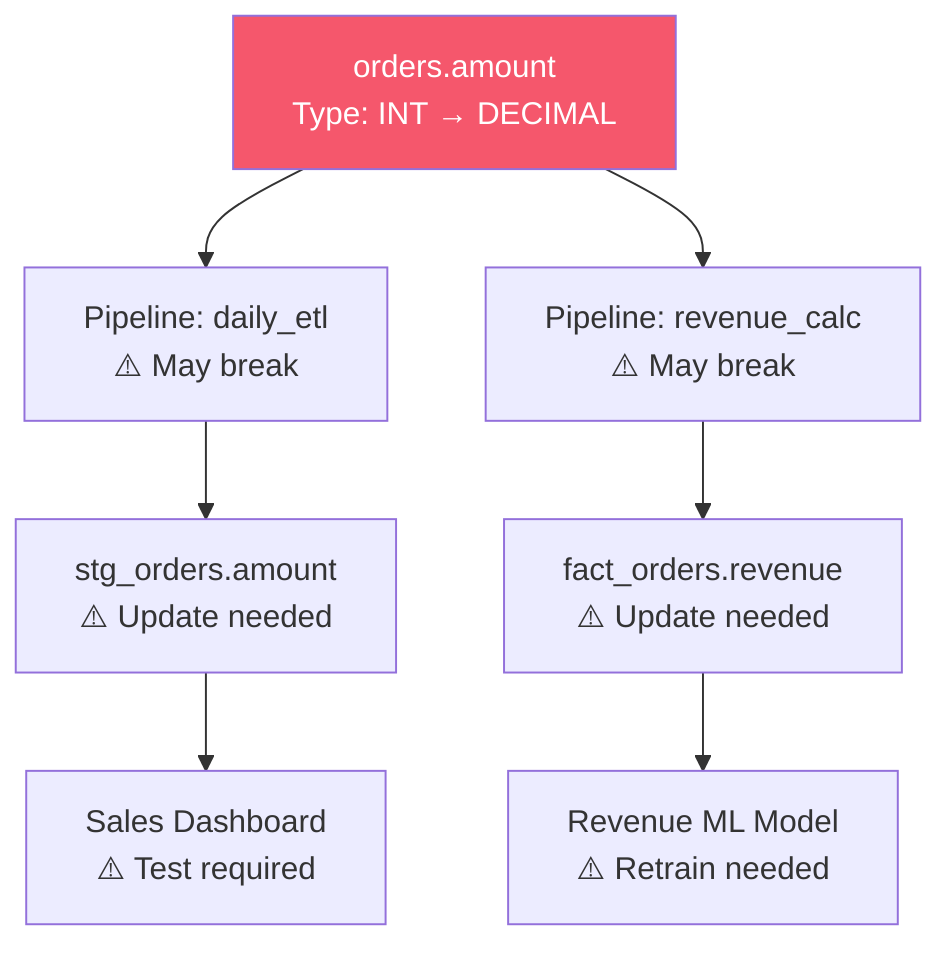
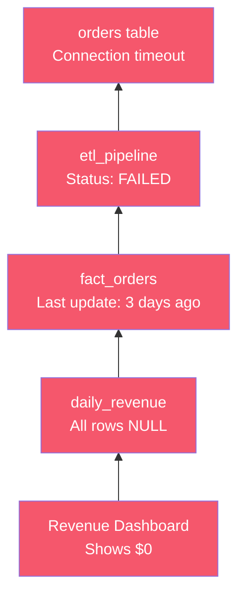

# Data Lineage

**End-to-end tracking of data flow, transformations, and dependencies**

Data lineage in OpenMetadata provides comprehensive tracking of how data moves and transforms across your entire data ecosystem. Built on W3C PROV-O (Provenance Ontology) standards, OpenMetadata's lineage captures table-level, column-level, and cross-system data flows to enable impact analysis, root cause debugging, and regulatory compliance.

---

## Lineage Overview

OpenMetadata captures three levels of lineage:



---

## Why Lineage Matters

### Impact Analysis
**Question**: "If I change this source table, what breaks?"

Lineage shows all downstream dependencies:
- Which pipelines read from this table
- What analytics tables depend on it
- Which dashboards will be affected
- What ML models consume this data

### Root Cause Analysis
**Question**: "Why is this dashboard showing wrong data?"

Trace backwards through lineage:
- Which pipeline produced this data
- What source tables were used
- When did the data last refresh
- What transformations were applied

### Compliance and Auditing
**Question**: "Where does this customer PII flow?"

Track sensitive data movement:
- All systems that store customer data
- Transformations that process PII
- Who has access at each stage
- Retention and deletion compliance

### Data Discovery
**Question**: "What can I learn from this data?"

Explore relationships:
- Related datasets and metrics
- Similar transformations elsewhere
- Trusted data sources
- Expert owners and documentation

---

## Lineage Types

### 1. Table-Level Lineage

**Tracks relationships between entire tables/datasets**



**Use Cases**:

- Understand pipeline dependencies
- Identify data freshness bottlenecks
- Plan schema changes and migrations
- Visualize data architecture

---

### 2. Column-Level Lineage

**Tracks how specific columns flow and transform**



**Use Cases**:

- Trace PII and sensitive data flows
- Debug incorrect column values
- Understand metric calculations
- Validate transformations

**Transformation Types**:

- **Identity**: Column copied unchanged
- **Derived**: Column transformed (UPPER, CONCAT, etc.)
- **Aggregate**: Column aggregated (SUM, COUNT, AVG)
- **Join**: Column used in join conditions

---

### 3. End-to-End Lineage

**Complete data journey from source to consumption**



**Use Cases**:

- Understand complete data journey
- Identify bottlenecks and inefficiencies
- Plan optimization strategies
- Document data architecture for compliance

---

## PROV-O Foundation

OpenMetadata lineage is based on W3C PROV-O (Provenance Ontology), providing standardized semantics for data provenance.

### Core PROV-O Concepts



**PROV-O Mapping**:

| PROV-O Concept | OpenMetadata Entity | Example |
|----------------|---------------------|---------|
| **Entity** | Tables, Columns, Datasets | `dim_customers` table |
| **Activity** | Pipelines, Queries, Jobs | `customer_etl` pipeline |
| **Agent** | Users, Services, Teams | `airflow-prod` service |
| **wasGeneratedBy** | Pipeline output | Table created by pipeline |
| **used** | Pipeline input | Pipeline reads from table |
| **wasDerivedFrom** | Direct lineage | Table derived from source |
| **wasAttributedTo** | Ownership | Table owned by Data Team |

---

## Real-World Example: E-Commerce Analytics

Complete lineage for customer analytics:



**Lineage Insights**:

1. **Source-to-Target Flow**:
   - Operational data → Ingestion → Raw → Staging → Core → Metrics → Analytics
   - 7-layer architecture with clear separation of concerns

2. **Impact Analysis**:
   - Change to `ecommerce.customers` affects:
     - 3 downstream pipelines
     - 4 analytics tables
     - 3 dashboards/reports

3. **Root Cause Debugging**:
   - If Executive Dashboard shows wrong CLV:
     - Trace back through `customer_lifetime_value` → `fact_orders` → `stg_orders` → `raw.orders`
     - Identify which pipeline or transformation introduced the issue

4. **Data Governance**:
   - PII in `customers.email` flows through lineage
   - Automatically tag all downstream uses
   - Ensure masking policies apply everywhere

---

## Column-Level Lineage Example

Detailed column transformations for revenue calculation:



**Transformation Details**:

| Source Column | Transformation | Target Column | SQL Logic |
|---------------|----------------|---------------|-----------|
| `amount` | Identity | `gross_amount` | `amount` |
| `discount` | Identity | `discount_amount` | `discount` |
| `amount`, `discount` | Derived | `net_amount` | `amount - discount` |
| `created_at` | Derived | `order_date` | `DATE_TRUNC('day', created_at)` |
| `gross_amount` | Aggregate | `total_gross` | `SUM(gross_amount)` |
| `net_amount` | Aggregate | `total_net` | `SUM(net_amount)` |

---

## Lineage Capture Methods

OpenMetadata captures lineage from multiple sources:

### 1. SQL Parsing
**Automatic lineage from SQL queries**

```sql
-- SQL Query in dbt model
SELECT
    c.customer_id,
    c.email,
    COUNT(o.order_id) as order_count,
    SUM(o.amount) as total_spent
FROM raw.customers c
LEFT JOIN raw.orders o ON c.customer_id = o.customer_id
GROUP BY c.customer_id, c.email
```

**Captured Lineage**:

- `raw.customers.customer_id` → `customer_metrics.customer_id` (identity)
- `raw.customers.email` → `customer_metrics.email` (identity)
- `raw.orders.order_id` → `customer_metrics.order_count` (aggregate)
- `raw.orders.amount` → `customer_metrics.total_spent` (aggregate)

### 2. API Integration
**Lineage from orchestration platforms**

```python
# Airflow DAG lineage
from openmetadata.api import OpenMetadata

client = OpenMetadata(...)

# Report lineage from pipeline task
client.add_lineage(
    source="mysql.ecommerce.customers",
    target="snowflake.analytics.dim_customers",
    pipeline="customer_etl",
    pipeline_service="airflow-prod"
)
```

### 3. Query Log Analysis
**Automatic lineage from database query logs**

OpenMetadata analyzes query logs from:
- Snowflake query history
- BigQuery audit logs
- Redshift system tables
- PostgreSQL pg_stat_statements

### 4. Metadata Extraction
**Lineage from transformation tools**

- **dbt**: Parses `manifest.json` for model dependencies
- **Databricks**: Reads notebook lineage
- **Spark**: Analyzes execution plans
- **Tableau**: Extracts data source relationships

---

## Lineage Use Cases

### Use Case 1: PII Compliance

**Scenario**: Track all uses of customer email addresses



**Benefits**:

- Automatically propagate PII tags through lineage
- Ensure masking policies apply to all downstream uses
- Generate compliance reports showing PII data flow
- Alert on unauthorized PII access

### Use Case 2: Schema Change Impact

**Scenario**: Plan to change `orders.amount` column from INT to DECIMAL



**Action Plan**:
1. Identify 2 affected pipelines
2. Update 2 downstream tables
3. Test 1 dashboard
4. Retrain 1 ML model

### Use Case 3: Root Cause Analysis

**Scenario**: Dashboard shows revenue dropped to zero



**Root Cause**:

- Dashboard → Metric table → Fact table → Pipeline → Source
- Pipeline failed 3 days ago due to connection timeout
- Fix connection and re-run pipeline

---

## Best Practices

### 1. Enable Automatic Lineage Capture
Use SQL parsing and query log analysis for automatic lineage instead of manual documentation.

### 2. Validate Lineage Accuracy
Regularly review lineage graphs to ensure they match actual data flows.

### 3. Tag Source Data
Apply governance tags (PII, Tier, Sensitivity) to source data; let lineage propagate them downstream.

### 4. Document Transformations
Add descriptions to pipeline tasks explaining what transformations occur.

### 5. Monitor Lineage Health
Alert when lineage shows stale data (source updated but downstream hasn't refreshed).

### 6. Use Column Lineage for Critical Data
Enable column-level lineage for PII, financial data, and key business metrics.

### 7. Plan Changes with Lineage
Before schema changes, use lineage to identify all impacted assets and plan updates.

---

## Next Steps

1. **Explore examples** - See [lineage examples](../examples/lineage/index.md)
2. **Learn PROV-O** - Understand [PROV-O ontology](../standards/prov-o.md)
3. **Integration guides** - [Enable lineage capture](../getting-started/lineage.md)
4. **API reference** - [Lineage API documentation](../reference/api/lineage.md)
