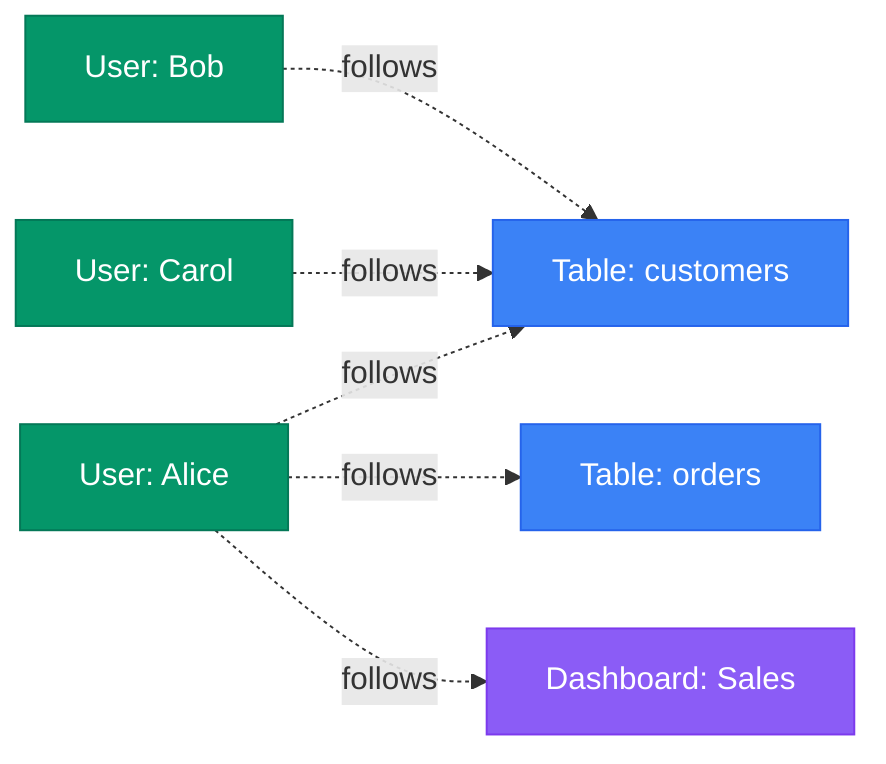

# Followers

**Stay informed about changes to data assets you care about**

---

## Overview

The **Followers** feature allows users to "follow" data assets and receive notifications when those assets change. Following is a lightweight way to stay informed about specific tables, dashboards, pipelines, or other data assets without being the owner.

Think of it like following a topic on social media - you get updates about things you care about without having to actively check for changes.

---

## What is Following?

Following is a many-to-many relationship between **users** and **data assets**. Any user can follow any data asset, and any data asset can have multiple followers.



---

## Following vs Ownership

| Aspect | Owner | Follower |
|--------|-------|----------|
| **Relationship** | 1 owner (user or team) | Many followers |
| **Responsibility** | Accountable for the asset | Interested in the asset |
| **Permissions** | May have special edit rights | Standard view permissions |
| **Notifications** | All changes | All changes |
| **Assignment** | Manually assigned or inherited | User self-selects |
| **Visibility** | Shown prominently in UI | Listed in followers section |
| **Use Case** | Data stewardship | Staying informed |

**Key Distinction**: Ownership implies **responsibility and accountability**, while following indicates **interest and awareness**.

---

## Why Follow Data Assets?

### 1. **Stay Informed About Dependencies**
If your application depends on a table, follow it to be notified when the schema changes or if it's deprecated.

**Example**: A data scientist follows the `customer_features` table that powers their ML model, so they're alerted to any schema changes that might break their pipeline.

### 2. **Monitor Data Quality**
Follow tables with critical data to receive alerts about quality test failures or data freshness issues.

**Example**: An analyst follows the `daily_revenue` table to be notified if data quality tests fail or if the data becomes stale.

### 3. **Track Important Metrics**
Follow dashboards or reports that track key business metrics to be notified of updates or changes.

**Example**: A product manager follows the "User Growth Dashboard" to stay informed about any changes to metric definitions.

### 4. **Collaborate on Data Assets**
Follow assets you're working on with others to stay in sync with changes and discussions.

**Example**: A data engineer follows a pipeline they're helping to debug, even though they don't own it.

### 5. **Audit Compliance Requirements**
Follow assets with compliance requirements to be notified of any changes that might affect regulatory compliance.

**Example**: A compliance officer follows all tables tagged with PII to monitor access and changes.

---

## What Notifications Do Followers Receive?

Followers are notified about:

### Metadata Changes
- Description updates
- Schema changes (new columns, column type changes)
- Tag additions or removals
- Ownership changes
- Display name changes

### Quality & Reliability
- Data quality test failures
- Data freshness issues
- Profile anomalies (unusual null rates, distribution changes)
- SLA violations

### Governance Changes
- Classification or tier changes
- Domain reassignments
- Policy violations
- Deprecation notices

### Structural Changes
- Asset soft deletion
- Asset restoration
- Major version changes

### Activity & Usage
- Major query pattern changes (configurable)
- Significant usage drops (configurable)

!!! note "Notification Preferences"
    Users can configure which types of changes trigger notifications in their user preferences. For example, you might want immediate alerts for schema changes but only daily summaries of description updates.

---

## How to Follow Data Assets

### Via Web UI

1. Navigate to any data asset (table, dashboard, pipeline, etc.)
2. Click the **"Follow"** button (usually a star or bell icon)
3. You're now following that asset and will receive notifications

### Via API

Add yourself as a follower:

```http
PUT /v1/tables/{id}/followers/{userId}
```

Add another user as a follower (requires permissions):

```http
PUT /v1/tables/{id}/followers/{otherUserId}
```

### Via Bulk Operations

Follow multiple assets at once:

```http
PUT /v1/users/{userId}/follows/bulk
Content-Type: application/json

{
  "entities": [
    {"id": "table-uuid-1", "type": "table"},
    {"id": "dashboard-uuid-2", "type": "dashboard"},
    {"id": "pipeline-uuid-3", "type": "pipeline"}
  ]
}
```

---

## How to Unfollow Data Assets

### Via Web UI

1. Navigate to the data asset
2. Click the **"Following"** button (it should be highlighted/active)
3. You're no longer following that asset

### Via API

Remove yourself as a follower:

```http
DELETE /v1/tables/{id}/followers/{userId}
```

---

## Managing Followers

### View All Followers of an Asset

```http
GET /v1/tables/{id}/followers
```

**Response**:
```json
{
  "data": [
    {
      "id": "user-uuid-1",
      "type": "user",
      "name": "alice.smith",
      "displayName": "Alice Smith"
    },
    {
      "id": "user-uuid-2",
      "type": "user",
      "name": "bob.jones",
      "displayName": "Bob Jones"
    }
  ]
}
```

### View All Assets a User Follows

```http
GET /v1/users/{userId}/follows?fields=tables,dashboards,pipelines
```

**Response**:
```json
{
  "tables": [
    {"id": "...", "fullyQualifiedName": "postgres_prod.ecommerce.public.customers"},
    {"id": "...", "fullyQualifiedName": "postgres_prod.ecommerce.public.orders"}
  ],
  "dashboards": [
    {"id": "...", "fullyQualifiedName": "superset.sales_dashboard"}
  ],
  "pipelines": [
    {"id": "...", "fullyQualifiedName": "airflow.customer_etl"}
  ]
}
```

---

## Use Cases & Patterns

### Pattern 1: Dependency Tracking
**Scenario**: Your data pipeline depends on 5 upstream tables.

**Action**: Follow all 5 tables to be notified of:
- Schema changes that might break your pipeline
- Data quality issues in source data
- Deprecation notices

### Pattern 2: Stakeholder Awareness
**Scenario**: You're a product manager who needs to stay informed about data definitions but doesn't own the data.

**Action**: Follow all tables and dashboards related to your product area to receive updates about:
- Metric definition changes
- New data availability
- Dashboard updates

### Pattern 3: Data Quality Monitoring
**Scenario**: You're responsible for ensuring data quality for critical business metrics.

**Action**: Follow all tables involved in calculating those metrics to be alerted to:
- Test failures
- Anomalies in data profiles
- Freshness issues

### Pattern 4: Collaborative Projects
**Scenario**: A cross-functional team is working on a data migration project.

**Action**: All team members follow the tables being migrated to stay informed about:
- Migration progress
- Schema changes
- Validation results

### Pattern 5: Compliance Monitoring
**Scenario**: You need to track changes to all PII-containing tables for compliance.

**Action**: Follow all tables tagged with PII to monitor:
- Access changes
- Schema modifications
- Policy updates

---

## Best Practices

### 1. **Follow Strategically**
Don't follow everything - focus on assets that are:
- Critical to your work
- Dependencies of your applications
- Subject to frequent changes
- Under active development

### 2. **Configure Notification Preferences**
Adjust notification settings to avoid alert fatigue:
- Immediate alerts for critical changes (schema, quality)
- Daily digests for minor updates (descriptions, tags)
- Weekly summaries for usage statistics

### 3. **Review Your Following List Regularly**
Periodically review and unfollow assets that are no longer relevant to avoid notification overload.

### 4. **Use Following for Onboarding**
New team members should follow key data assets to learn what changes and why.

### 5. **Combine with Search Subscriptions**
Follow individual assets, but also set up search subscriptions for patterns:
- All tables in a specific domain
- All dashboards with specific tags
- All pipelines in a particular service

### 6. **Team Patterns**
Establish team conventions:
- Data engineers follow all production tables they deploy
- Analysts follow source tables for their reports
- Product managers follow dashboards tracking their KPIs

---

## Technical Details

### Storage

Followers are stored as many-to-many relationships in the metadata database:

```json
{
  "entityType": "table",
  "entityId": "table-uuid",
  "followers": [
    {
      "id": "user-uuid-1",
      "type": "user",
      "name": "alice.smith"
    },
    {
      "id": "user-uuid-2",
      "type": "user",
      "name": "bob.jones"
    }
  ]
}
```

### Event Stream

When a user follows/unfollows an asset, a change event is generated:

```json
{
  "eventType": "entityUpdated",
  "entityType": "table",
  "entityId": "table-uuid",
  "changeDescription": {
    "fieldsAdded": [
      {
        "name": "followers",
        "newValue": [{"id": "user-uuid", "type": "user"}]
      }
    ]
  }
}
```

### Notification Delivery

Notifications to followers are delivered via:
1. **In-app notifications**: Bell icon in the UI
2. **Email**: Configurable digest or immediate
3. **Slack/Teams**: Via webhook integrations
4. **Custom webhooks**: For integration with other systems

---

## Integration with Other Features

### Webhooks
Configure webhooks to trigger on changes to followed assets:

```json
{
  "name": "Follower Notifications",
  "eventFilters": ["entityUpdated", "entityDeleted"],
  "batchSize": 10,
  "endpoint": "https://your-system.com/notifications",
  "condition": "user.follows(entity)"
}
```

### Activity Feeds
Followed assets appear in your personalized activity feed, showing recent changes and discussions.

### Recommendations
The system uses your following patterns to recommend:
- Similar assets you might want to follow
- Related assets in the same domain
- Assets frequently followed together

---

## Programmatic Usage

### Follow Assets Matching a Pattern

```python
from openmetadata.client import OpenMetadata

client = OpenMetadata(...)
user_id = "my-user-uuid"

# Follow all tables in production with PII
tables = client.list_tables(
    database="postgres_prod",
    tags=["PII.Sensitive"]
)

for table in tables:
    client.add_follower(
        entity_type="table",
        entity_id=table.id,
        follower_id=user_id
    )
```

### Get Notification Summary

```python
# Get all changes to followed assets in the last 24 hours
changes = client.get_follower_activity(
    user_id=user_id,
    since=datetime.now() - timedelta(days=1),
    event_types=["entityUpdated", "testCaseFailure"]
)

for change in changes:
    print(f"{change.entity_name}: {change.change_type}")
```

---

## Related Features

- **[Custom Properties](custom-properties.md)**: Extend entities with custom fields
- **[Ownership](../teams-users/overview.md#ownership)**: Formal responsibility for data assets
- **[Webhooks](../operations/webhook.md)**: Real-time event notifications
- **[Alerts](../data-quality/alert.md)**: Data quality and operational alerts
- **[Change Events](../events/overview.md)**: Understanding metadata change events

---

## FAQ

**Q: What's the difference between following and owning?**
A: Ownership indicates responsibility and accountability, while following indicates interest. Owners are typically assigned, followers self-select.

**Q: Can I follow assets I don't have permission to view?**
A: No, you can only follow assets you have at least read permission for.

**Q: How many assets can I follow?**
A: There's no hard limit, but we recommend following fewer than 100 assets to avoid notification overload.

**Q: Can I automatically follow all assets in a domain?**
A: Not directly, but you can use the API to bulk follow assets or set up a subscription to a domain search query.

**Q: Do I get notified about every single change?**
A: You can configure notification preferences to control which types of changes trigger notifications and how they're delivered (immediate, digest, etc.).

**Q: Can teams follow assets?**
A: No, following is a personal feature. For team-level awareness, use ownership or create shared alerts.

**Q: How do I stop getting notifications?**
A: Either unfollow the asset or adjust your notification preferences to reduce frequency or filter event types.

---

## Next Steps

- **[Teams & Users](../teams-users/overview.md)**: Learn about user management and permissions
- **[Webhooks](../operations/webhook.md)**: Set up custom notifications
- **[Change Events](../events/overview.md)**: Understanding metadata change events
- **[Data Quality Alerts](../data-quality/alert.md)**: Configure quality-based notifications
