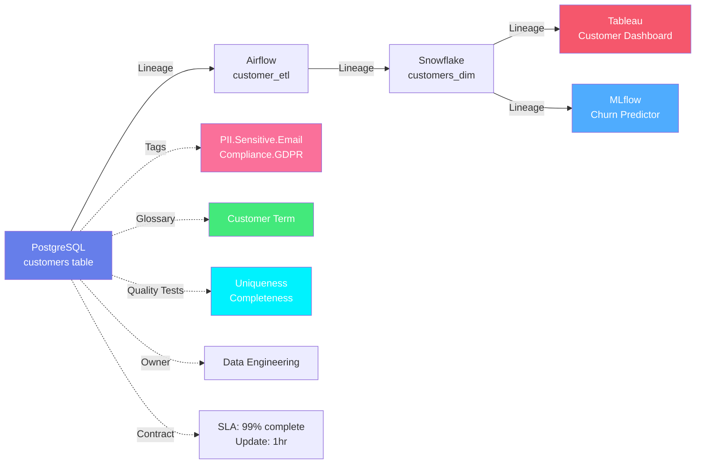

# OpenMetadata Specifications

**Comprehensive metadata specifications for the modern data ecosystem**

OpenMetadata Standards define metadata models across six key areas. Click any card to explore detailed specifications with JSON Schema, RDF, and JSON-LD representations.

---

## :material-folder-multiple: Data Assets

**10+ asset types across your data ecosystem**

Model databases, pipelines, dashboards, ML models, topics, storage, APIs, and search indexes with complete hierarchical structures.

**Entities**: [Table](../data-assets/databases/table.md), [Pipeline](../data-assets/pipelines/pipeline.md), [Topic](../data-assets/messaging/topic.md), [Dashboard](../data-assets/dashboards/dashboard.md), [Chart](../data-assets/dashboards/chart.md), [ML Model](../data-assets/ml/mlmodel.md), [Container](../data-assets/storage/container.md), [API Endpoint](../data-assets/apis/api-endpoint.md), [Search Index](../data-assets/search/search-index.md)

**Specifications**: JSON Schema, RDF/OWL, JSON-LD

[**Explore Data Assets →**](../data-assets/overview.md){ .md-button .md-button--primary }

---

## :material-bookshelf: Governance

**Business context and data classification**

Define business glossaries, classify sensitive data with hierarchical tags, and apply governance policies across all assets.

**Entities**: [Glossary](../governance/glossary.md), [Glossary Term](../governance/glossary-term.md), [Classification](../governance/classification.md), [Tag](../governance/tag.md)

**Features**: PII/PHI detection, GDPR compliance, business terminology, hierarchical taxonomies

[**Explore Governance →**](../governance/overview.md){ .md-button .md-button--primary }

---

## :material-check-circle: Data Quality

**Comprehensive testing and profiling framework**

Define quality tests, execute validation, profile data distributions, and track quality metrics over time.

**Entities**: [Test Definition](../data-quality/test-definition.md), [Test Case](../data-quality/test-case.md), [Test Suite](../data-quality/test-suite.md)

**Platforms**: OpenMetadata, Great Expectations, dbt, Deequ, Soda

[**Explore Data Quality →**](../data-quality/overview.md){ .md-button .md-button--primary }

---

## :material-family-tree: Lineage

**End-to-end data flow tracking**

Capture column-level and table-level lineage using W3C PROV-O provenance ontology. Track data from source to dashboard to ML model.

**Standards**: PROV-O, RDF provenance graphs, column-level lineage

**Examples**: API → Pipeline → Table → Dashboard

[**Explore Lineage →**](../lineage/overview.md){ .md-button .md-button--primary }

---

## :material-file-document: Data Contracts

**Formal SLAs for data assets**

Define schema requirements, quality expectations, and service level agreements for any data asset - not just tables.

**Apply to**: Tables, Topics, Dashboards, ML Models, APIs, Storage

**Includes**: Schema contracts, quality SLAs, freshness guarantees

[**Explore Data Contracts →**](../data-contracts/overview.md){ .md-button .md-button--primary }

---

## :material-account-group: Teams & Users

**Organizational structure and ownership**

Model users, teams, roles, and hierarchies. Assign ownership and define access policies across all assets.

**Entities**: [User](../teams-users/user.md), [Team](../teams-users/team.md), [Role](../teams-users/role.md), [Persona](../teams-users/persona.md)

**Features**: Ownership, hierarchies, permissions, collaboration

[**Explore Teams & Users →**](../teams-users/overview.md){ .md-button .md-button--primary }

---

## Standards Representation

Every entity in OpenMetadata Standards is expressed in three complementary formats:

### :material-code-json: JSON Schema

**Draft-07 validation schemas**

- 700+ entity schemas
- Strongly typed definitions
- Required/optional fields
- Constraints and patterns
- IDE autocomplete support

[View JSON Schemas →](../metadata-standards/json-schemas.md){ .md-button }

### :material-graph: RDF & OWL

**Semantic web ontology**

- W3C OWL ontology
- RDFS classes & properties
- Formal semantics
- SPARQL queryable
- Reasoning & inference

[View RDF Ontology →](../metadata-standards/rdf-ontology.md){ .md-button }

### :material-web: JSON-LD

**Linked data contexts**

- JSON-LD 1.1 contexts
- Maps JSON to RDF
- Semantic annotations
- Schema.org compatible
- Web-scale integration

[View JSON-LD →](../metadata-standards/jsonld-contexts.md){ .md-button }

---

## Example: Customer Data Pipeline

See how all concepts work together:

**Data Assets**: Table (PostgreSQL), Pipeline (Airflow), Table (Snowflake), Dashboard (Tableau), ML Model (MLflow)

**Governance**: Email column tagged as `PII.Sensitive.Email` and `Compliance.GDPR`, table linked to "Customer" glossary term

**Data Quality**: Tests for uniqueness of customer_id, completeness of email

**Lineage**: Source table → ETL → Warehouse → Dashboard & ML Model

**Ownership**: Data Engineering team owns pipeline and tables

**Data Contract**: Table must be 99% complete, updated within 1 hour

---

## Getting Started

### 1. Understand the Specifications
Browse the sections above to explore each metadata concept

### 2. Read Entity Specifications
Each entity has comprehensive documentation with:

- Overview and use cases
- Complete field reference
- JSON Schema, RDF, and JSON-LD specifications
- Real-world examples

### 3. See Standards in Action
Check out the [Examples](../examples/index.md) for complete use cases

### 4. Integrate with Your Tools
Use the [API Reference](../schemas/api/rest-api.md) to integrate OpenMetadata Standards

---

## Why OpenMetadata Standards?

!!! success "Key Benefits"

    - **Comprehensive** - Covers all data assets, governance, quality, lineage, and contracts
    - **Open Source** - Freely available, community-driven, transparent
    - **Semantic** - RDF ontologies enable reasoning and knowledge graphs
    - **Interoperable** - JSON-LD enables integration with semantic web
    - **Extensible** - Custom properties for your specific needs
    - **Battle-Tested** - Used in production managing petabytes of data

---

## Community

- **GitHub**: [open-metadata/OpenMetadataStandards](https://github.com/open-metadata/OpenMetadataStandards)
- **Slack**: [#openmetadata-standards](https://slack.open-metadata.org)
- **Contribute**: [Contributing Guide](../developer/contributing.md)
