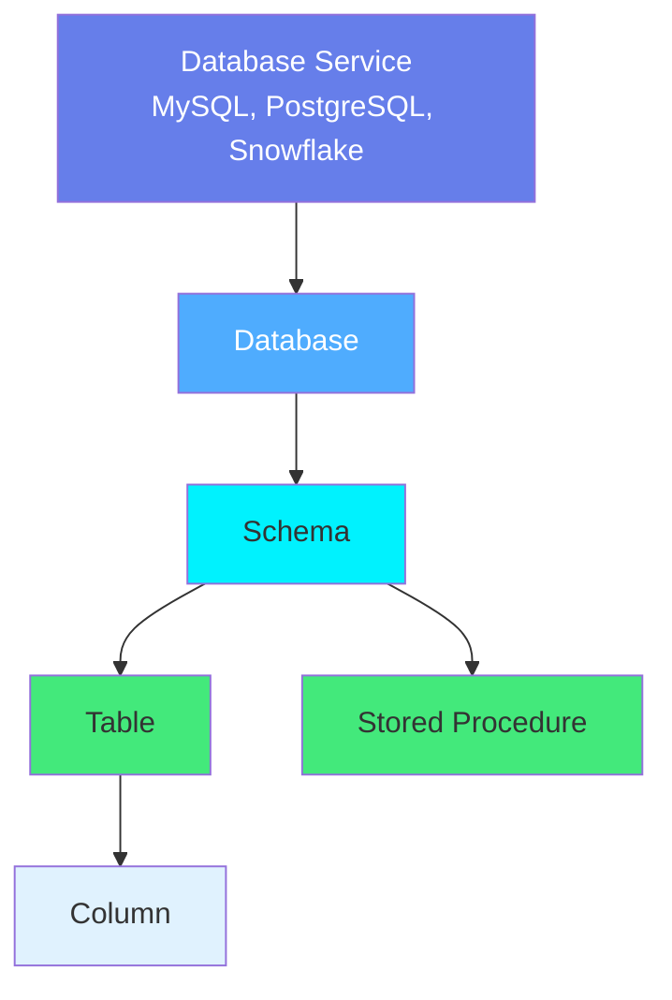
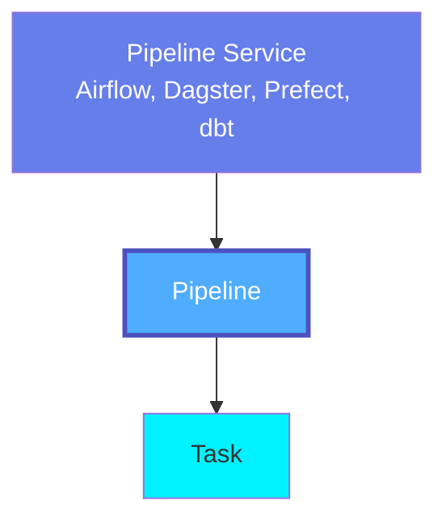
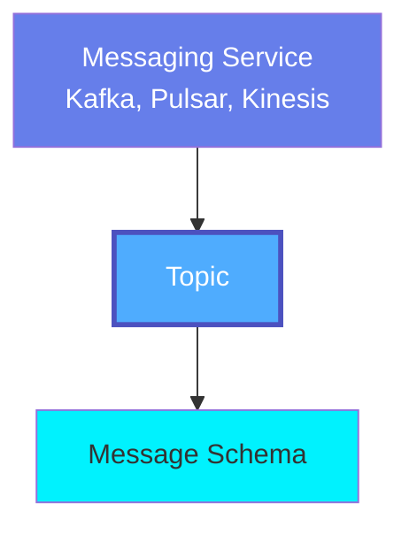
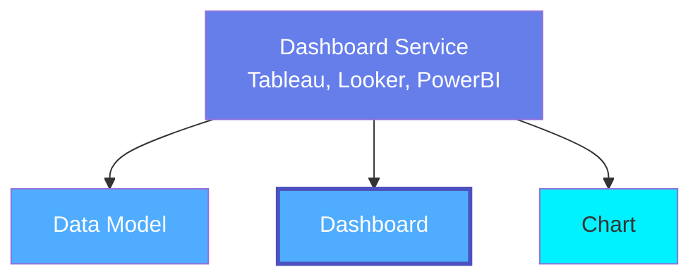
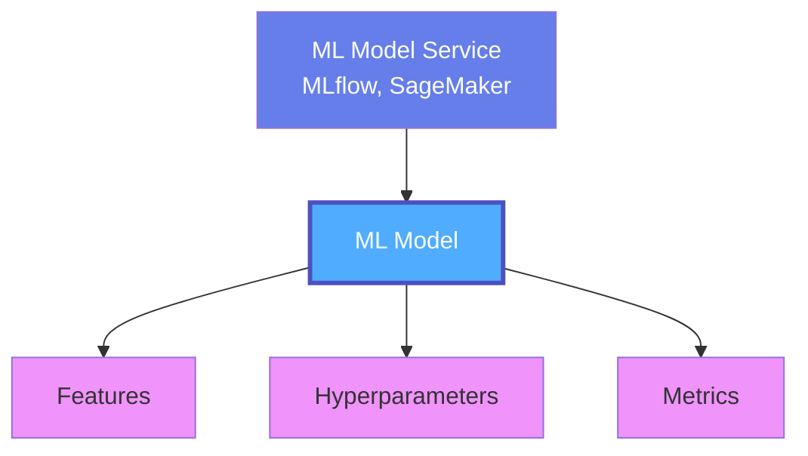
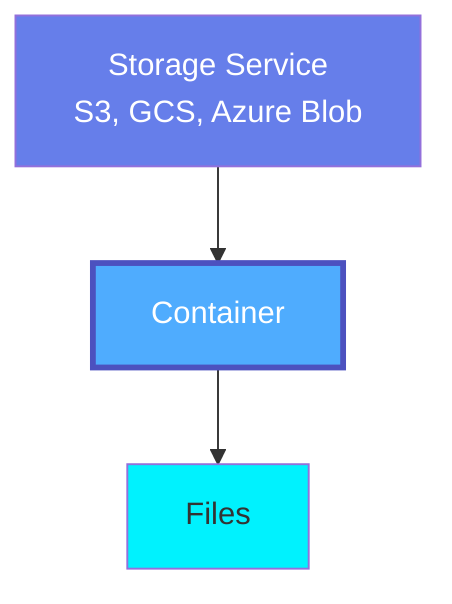

# OpenMetadata Standards

**A comprehensive metadata standard for the modern data and AI ecosystem**

## What Are We Modeling?

OpenMetadata Standards provide a **unified, open-source metadata model** that describes every aspect of your **data and AI ecosystem** - from traditional data assets to modern AI systems, covering both structured and unstructured data across your entire organization.

### Comprehensive Coverage

**Traditional Data Assets:**
- Databases, tables, schemas, and stored procedures
- Data pipelines, workflows, and DAGs
- Dashboards, reports, and visualizations
- Message queues, topics, and event streams
- APIs, endpoints, and service contracts

**Unstructured Data & Documents:**
- Drive services (Google Drive, OneDrive, SharePoint)
- Spreadsheets, worksheets, and collaborative documents
- File systems, containers, and object storage
- Directories, files, and document repositories

**AI Governance & LLM Systems:**
- Large Language Models (LLMs) and foundation models
- AI Agents and autonomous systems
- Model Context Protocol (MCP) servers and tools
- Prompts, templates, and prompt engineering
- Vector databases and embeddings
- AI applications and integrations

**Data Governance & Quality:**
- Data quality tests, suites, and profiles
- Classification, tags, and glossaries
- Data contracts and SLAs
- Lineage from source to consumption
- Teams, users, roles, and ownership
- Domains and data products

!!! info "AI Governance Initiative"
    OpenMetadata is pioneering **AI Governance** by extending metadata standards to cover the entire AI lifecycle - from LLMs and agents to prompts and vector databases. This enables organizations to govern AI systems with the same rigor as traditional data assets.

    **Learn more**: [AI Governance Roadmap](https://github.com/open-metadata/OpenMetadata/issues/23853)

### What This Enables

Our standards enable:
- **Universal Interoperability** across data, document, and AI platforms
- **Semantic Understanding** through RDF ontologies and knowledge graphs
- **AI Governance** with comprehensive LLM and agent metadata
- **Unified Data Governance** spanning structured and unstructured data
- **Data Quality** with comprehensive testing and profiling frameworks
- **Complete Lineage** from raw data through transformations to AI applications
- **Clear Ownership** and organizational structure across all assets

---

## The Metadata Stack

OpenMetadata Standards are expressed in multiple complementary formats:

<div markdown style="background: linear-gradient(135deg, #f5f7fa 0%, #c3cfe2 100%); padding: 2rem; border-radius: 8px; margin: 2rem 0;">

### 📋 JSON Schema
**Human-readable, machine-validatable schemas**

- JSON Schema Draft-07 specification
- 700+ schemas covering all metadata entities
- Strongly typed with validation rules
- IDE autocomplete support
- Used by OpenMetadata APIs

[Explore JSON Schemas →](json-schemas.md)

---

### 🔗 RDF & OWL Ontology
**Semantic web standards for knowledge graphs**

- W3C OWL ontology for formal semantics
- RDFS classes and properties
- Reasoning and inference capabilities
- SPARQL queryable
- Integration with semantic web tools

[Explore RDF Ontology →](rdf-ontology.md)

---

### 🌐 JSON-LD Contexts
**Linked data for interoperability**

- JSON-LD 1.1 contexts
- Maps JSON to RDF
- Enables semantic annotations
- Web-scale data integration
- Compatible with schema.org

[Explore JSON-LD →](jsonld-contexts.md)

---

### ✅ SHACL Shapes
**Validation constraints for RDF graphs**

- SHACL shapes for validation
- Constraint checking
- Data quality rules
- Graph validation
- Compliance verification

[Explore SHACL →](shacl-validation.md)

</div>

---

## The Hierarchical Model

OpenMetadata organizes entities in hierarchical service-based structures:

### Database Stack



### Pipeline Stack



### Messaging Stack



### Dashboard Stack



### ML Stack



### Storage Stack



[Explore All Data Assets →](../data-assets/overview.md)

---

## Cross-Cutting Concepts

Beyond data assets, OpenMetadata Standards model:

### 🔄 Lineage
**Complete data flow tracking**

Track transformations from source to dashboard to ML model using:
- Column-level lineage
- Asset-level lineage
- W3C PROV-O provenance ontology
- Pipeline execution lineage

**Example**: API Service → ETL Pipeline → Table → Dashboard

[Explore Lineage Specification →](../lineage/overview.md)

---

### 📚 Governance
**Business context and classification**

Model business knowledge and data sensitivity:
- **Glossaries**: Business terminology
- **Glossary Terms**: Definitions with relationships
- **Classifications**: Hierarchical taxonomies (PII, PHI, Tier)
- **Tags**: Labels for categorization

**Example**: Link "Customer" glossary term to customer table, tag email column as PII.Sensitive.Email

[Explore Governance Specification →](../governance/overview.md)

---

### ✓ Data Quality
**Testing and profiling framework**

Define and track data quality:
- **Test Definitions**: Reusable test templates
- **Test Cases**: Applied to tables/columns
- **Test Suites**: Organized test execution
- **Profiling**: Statistical analysis

**Example**: Define uniqueness test for customer_id, run daily, track results

[Explore Data Quality Specification →](../data-quality/overview.md)

---

### 👥 Teams & Users
**Organizational structure and ownership**

Model your organization:
- **Users**: Individual people
- **Teams**: Groups with hierarchies
- **Roles**: Permission sets
- **Ownership**: Asset assignments

**Example**: Data Engineering team owns customer_etl pipeline, Jane Doe is the owner

[Explore Teams & Users Specification →](../teams-users/overview.md)

---

### 📜 Data Contracts
**Formal agreements across all assets**

Define expectations for any data asset:
- Schema requirements
- Quality SLAs
- Freshness guarantees
- Ownership commitments

**Not just tables** - contracts apply to Topics, Dashboards, ML Models, APIs, and more

[Explore Data Contract Specification →](../data-contracts/overview.md)

---

### 🏢 Domains
**Business domain organization**

Organize data assets by business area or function:

- **Domain Hierarchy**: Top-level and sub-domains
- **Asset Assignment**: Assign tables, dashboards, pipelines to domains
- **Domain Ownership**: Domain-specific owners and experts
- **Cross-Domain Dependencies**: Track data flows across domains

**Example**: Sales domain contains customer tables, revenue dashboards, and sales pipelines

[Explore Domain Specification →](../domains/overview.md)

---

### 📦 Data Products
**Packaged data for consumption**

Define curated data products for specific use cases:

- **Product Definition**: Packaged collection of data assets
- **Assets**: Tables, dashboards, ML models working together
- **SLAs**: Quality, freshness, and availability guarantees
- **Consumers**: Teams and applications using the product

**Example**: "Customer 360" data product includes customer tables, enrichment pipelines, and analytics dashboards

[Explore Data Product Specification →](../data-products/overview.md)

---

## Deep Dive Documentation

Each metadata entity has comprehensive documentation explaining:

- **Overview**: What it models and why
- **JSON Schema**: Complete field reference
- **RDF Representation**: Ontology classes and properties
- **JSON-LD**: Semantic annotations
- **Examples**: Real-world use cases
- **Relationships**: How it connects to other entities

### Example: Table Entity

<div markdown style="border-left: 4px solid #0061f2; padding-left: 1rem; margin: 1rem 0;">

**Table** is the core entity representing database tables and views.

**Key Fields**:

- `name`, `fullyQualifiedName`, `description`
- `columns[]`: Array of column definitions with types, constraints
- `tableType`: Regular, View, MaterializedView, External
- `owner`, `domain`, `tags`, `glossaryTerms`
- `dataModel`: SQL query for views
- `tableConstraints`: Primary/foreign keys
- `tableProfilerConfig`: Profiling settings

**Relationships**:

- Belongs to `databaseSchema`
- Contains `columns`
- Referenced by `dashboards`, `mlModels`
- Has `testCases` for quality
- Participates in `lineage`

[View Complete Table Specification →](../data-assets/databases/table.md)

</div>

---

## Standards in Action

### Use Case: Customer Data Pipeline

**Assets Modeled**:
```
PostgreSQL Database Service
  └── crm_database
        └── public schema
              └── customers table
                    ├── customer_id (PK)
                    ├── email
                    ├── name
                    └── created_date

Airflow Pipeline Service
  └── customer_etl pipeline
        ├── extract_customers task
        ├── transform_customers task
        └── load_customers task

Tableau Dashboard Service
  └── Customer Analytics dashboard
        ├── Customer Growth chart
        └── Customer Segments chart
```

**Lineage**:
```
customers table
  → customer_etl pipeline
    → warehouse.customers_dim table
      → Customer Analytics dashboard
```

**Governance**:

- `customers.email` tagged as `PII.Sensitive.Email`
- `customers` table linked to "Customer" glossary term
- GDPR compliance tag applied

**Data Quality**:

- Test: `customer_id` is unique
- Test: `email` matches regex pattern
- Test: `created_date` <= today
- Profile: Track row count daily

**Ownership**:

- Data Engineering team owns `customer_etl`
- Analytics team owns `Customer Analytics`
- Jane Doe is data steward

**Data Contract**:

- `customers` table must update within 1 hour
- Email completeness >= 99%
- Row count between 10,000 - 10,000,000

**All modeled in**:

- ✅ JSON Schema with full validation
- ✅ RDF ontology for semantic queries
- ✅ JSON-LD for linked data
- ✅ SHACL for constraint validation

---

## Getting Started

### 1. Understand the Standards
Start with the [JSON Schema overview](json-schemas.md) to understand the core structures.

### 2. Explore Data Assets
Browse the [hierarchical data assets](../data-assets/overview.md) organized by service type.

### 3. Learn Cross-Cutting Concepts
Understand [lineage](../lineage/overview.md), [governance](../governance/overview.md), and [data quality](../data-quality/overview.md).

### 4. Deep Dive
Read detailed specifications for entities like [Table](../data-assets/databases/table.md), [Pipeline](../data-assets/pipelines/pipeline.md), or [Dashboard](../data-assets/dashboards/dashboard.md).

### 5. Use the Standards
Integrate OpenMetadata Standards into your tools using the [API reference](../schemas/api/rest-api.md).

---

## Why OpenMetadata Standards?

### Open Source
Freely available, community-driven, transparent development

### Comprehensive
Covers databases, pipelines, dashboards, ML, governance, quality, and more

### Semantic
RDF and ontologies enable reasoning and knowledge graphs

### Interoperable
JSON-LD enables integration with any semantic web tool

### Extensible
Custom properties and types for your specific needs

### Battle-Tested
Used in production by organizations managing petabytes of data

---

## Community & Contribution

- **GitHub**: [open-metadata/OpenMetadataStandards](https://github.com/open-metadata/OpenMetadataStandards)
- **Slack**: [#openmetadata-standards](https://slack.open-metadata.org)
- **Contribute**: See [Contributing Guide](../developer/contributing.md)

---

## Next Steps

<div markdown style="display: grid; grid-template-columns: repeat(auto-fit, minmax(250px, 1fr)); gap: 1rem; margin: 2rem 0;">

<div markdown style="border: 1px solid #e0e0e0; padding: 1rem; border-radius: 4px;">

### 📋 JSON Schemas

Explore the complete JSON Schema reference

[Go to JSON Schemas →](json-schemas.md)

</div>

<div markdown style="border: 1px solid #e0e0e0; padding: 1rem; border-radius: 4px;">

### 🗂️ Data Assets

Browse all data asset types by service

[Go to Data Assets →](../data-assets/overview.md)

</div>

<div markdown style="border: 1px solid #e0e0e0; padding: 1rem; border-radius: 4px;">

### 🔗 RDF Ontology

Understand the semantic web representation

[Go to RDF →](rdf-ontology.md)

</div>

<div markdown style="border: 1px solid #e0e0e0; padding: 1rem; border-radius: 4px;">

### 📖 Examples

See real-world use cases and examples

[Go to Examples →](../examples/index.md)

</div>

</div>
