# Application

**Applications that interact with OpenMetadata - metadata consumers, governance automation, integrations, and extensions**

---

## Overview

The **Application** entity represents software systems and tools that interact with the OpenMetadata platform. This includes:

1. **Metadata-Driven Applications**: Systems that consume metadata via OpenMetadata APIs
2. **Governance Automation**: Tools that automate tagging, classification, and policy enforcement
3. **Integration Applications**: Systems that sync metadata with external platforms (CMDB, ITSM, catalogs)
4. **Custom Extensions**: Applications built on top of OpenMetadata to extend capabilities
5. **Data Applications**: While primarily operational, this also tracks data-consuming applications (web apps, mobile apps, microservices) that use both data and metadata to understand their dependencies and contracts

**Hierarchy**:
```
Domain → Application → Components/Services
```

---

## Relationships

Application has comprehensive relationships with entities across the metadata platform:

```mermaid
graph TD
    subgraph Application Layer
        APP[Application<br/>ecommerce_web_app]
    end

    subgraph Components
        APP --> COMP1[Component<br/>User Service]
        APP --> COMP2[Component<br/>Order Service]
        APP --> COMP3[Component<br/>Payment Service]
        APP --> COMP4[Component<br/>Recommendation Engine]
    end

    subgraph Data Sources - Tables
        APP -.->|reads| TBL1[Table<br/>customers]
        APP -.->|reads| TBL2[Table<br/>products]
        APP -.->|reads| TBL3[Table<br/>orders]
        APP -.->|writes| TBL4[Table<br/>user_sessions]
        APP -.->|writes| TBL5[Table<br/>order_events]
    end

    subgraph Data Sources - APIs
        APP -.->|calls| API1[APIEndpoint<br/>GET /users]
        APP -.->|calls| API2[APIEndpoint<br/>POST /orders]
        APP -.->|exposes| API3[APIEndpoint<br/>GET /products]
        APP -.->|exposes| API4[APIEndpoint<br/>POST /cart]
    end

    subgraph Databases
        APP -.->|connects to| DB1[Database<br/>postgres_prod]
        APP -.->|connects to| DB2[Database<br/>redis_cache]
        APP -.->|connects to| DB3[Database<br/>mongodb_sessions]
    end

    subgraph Messaging
        APP -.->|publishes to| TOPIC1[Topic<br/>order_created]
        APP -.->|subscribes to| TOPIC2[Topic<br/>payment_processed]
        APP -.->|subscribes to| TOPIC3[Topic<br/>inventory_updated]
    end

    subgraph Analytics & Dashboards
        APP -.->|embeds| DASH1[Dashboard<br/>Sales Overview]
        APP -.->|embeds| DASH2[Dashboard<br/>User Metrics]
        APP -.->|tracked by| DASH3[Dashboard<br/>App Performance]
    end

    subgraph ML Models
        APP -.->|uses| ML1[MLModel<br/>product_recommender]
        APP -.->|uses| ML2[MLModel<br/>fraud_detector]
        APP -.->|uses| ML3[MLModel<br/>search_ranker]
    end

    subgraph Storage
        APP -.->|reads from| CONT1[Container<br/>product_images]
        APP -.->|writes to| CONT2[Container<br/>user_uploads]
        APP -.->|writes to| CONT3[Container<br/>application_logs]
    end

    subgraph Ownership
        APP -.->|owned by| TEAM1[Team<br/>E-commerce Platform]
        APP -.->|developed by| TEAM2[Team<br/>Frontend Team]
        APP -.->|supported by| TEAM3[Team<br/>DevOps]
    end

    subgraph Users
        USER1[User<br/>customer1] -.->|uses| APP
        USER2[User<br/>customer2] -.->|uses| APP
        USER3[User<br/>admin] -.->|administers| APP
    end

    subgraph Dependencies
        APP -.->|depends on| APP2[Application<br/>auth_service]
        APP -.->|depends on| APP3[Application<br/>payment_gateway]
        APP -.->|depends on| APP4[Application<br/>notification_service]
    end

    subgraph Governance
        APP -.->|in domain| DOM[Domain<br/>E-commerce]
        APP -.->|tagged| TAG1[Tag<br/>Tier.Production]
        APP -.->|tagged| TAG2[Tag<br/>PII.Sensitive]
        APP -.->|tagged| TAG3[Tag<br/>Compliance.SOC2]
        APP -.->|linked to| GT[GlossaryTerm<br/>Customer Facing Application]
    end

    subgraph Data Contracts
        APP -.->|enforces| DC1[DataContract<br/>Order Schema]
        APP -.->|enforces| DC2[DataContract<br/>User Event Schema]
    end

    subgraph Quality & Monitoring
        TC1[TestCase<br/>data_quality_check] -.->|validates| TBL4
        TC2[TestCase<br/>api_response_time] -.->|monitors| APP
        TC3[TestCase<br/>uptime_sla] -.->|monitors| APP
    end

    subgraph Pipelines
        PIPE1[Pipeline<br/>data_sync] -.->|feeds| APP
        APP -.->|triggers| PIPE2[Pipeline<br/>analytics_export]
    end

    style APP fill:#4facfe,color:#fff,stroke:#4c51bf,stroke-width:3px
    style COMP1 fill:#00f2fe,color:#333
    style COMP2 fill:#00f2fe,color:#333
    style COMP3 fill:#00f2fe,color:#333
    style COMP4 fill:#00f2fe,color:#333
    style TBL1 fill:#764ba2,color:#fff
    style TBL2 fill:#764ba2,color:#fff
    style TBL3 fill:#764ba2,color:#fff
    style TBL4 fill:#764ba2,color:#fff
    style TBL5 fill:#764ba2,color:#fff
    style API1 fill:#43e97b,color:#fff
    style API2 fill:#43e97b,color:#fff
    style API3 fill:#43e97b,color:#fff
    style API4 fill:#43e97b,color:#fff
    style DB1 fill:#667eea,color:#fff
    style DB2 fill:#667eea,color:#fff
    style DB3 fill:#667eea,color:#fff
    style TOPIC1 fill:#fa709a,color:#fff
    style TOPIC2 fill:#fa709a,color:#fff
    style TOPIC3 fill:#fa709a,color:#fff
    style DASH1 fill:#ff6b6b,color:#fff
    style DASH2 fill:#ff6b6b,color:#fff
    style DASH3 fill:#ff6b6b,color:#fff
    style ML1 fill:#f093fb,color:#fff
    style ML2 fill:#f093fb,color:#fff
    style ML3 fill:#f093fb,color:#fff
    style CONT1 fill:#ffd700,color:#333
    style CONT2 fill:#ffd700,color:#333
    style CONT3 fill:#ffd700,color:#333
    style TEAM1 fill:#43e97b,color:#fff
    style TEAM2 fill:#43e97b,color:#fff
    style TEAM3 fill:#43e97b,color:#fff
    style USER1 fill:#43e97b,color:#fff
    style USER2 fill:#43e97b,color:#fff
    style USER3 fill:#43e97b,color:#fff
    style APP2 fill:#4facfe,color:#fff
    style APP3 fill:#4facfe,color:#fff
    style APP4 fill:#4facfe,color:#fff
    style DOM fill:#fa709a,color:#fff
    style TAG1 fill:#f093fb,color:#fff
    style TAG2 fill:#f093fb,color:#fff
    style TAG3 fill:#f093fb,color:#fff
    style GT fill:#ffd700,color:#333
    style DC1 fill:#9b59b6,color:#fff
    style DC2 fill:#9b59b6,color:#fff
    style TC1 fill:#9b59b6,color:#fff
    style TC2 fill:#9b59b6,color:#fff
    style TC3 fill:#9b59b6,color:#fff
    style PIPE1 fill:#f5576c,color:#fff
    style PIPE2 fill:#f5576c,color:#fff
```



**Relationship Types**:

- **Solid lines (→)**: Hierarchical containment (Application contains Components)
- **Dashed lines (-.->)**: References and associations (ownership, governance, data access, dependencies)

### Parent Entities
- **Domain**: Business domain grouping

### Child Entities
- **Component**: Microservices, modules, or sub-components of the application

### Associated Entities
- **Owner**: Team or user owning this application
- **Domain**: Business domain assignment
- **Tag**: Classification tags
- **GlossaryTerm**: Business terminology
- **Table**: Database tables read/written by the application
- **Database**: Databases connected to by the application
- **APIEndpoint**: APIs called or exposed by the application
- **Topic**: Message topics published to or subscribed from
- **Dashboard**: Dashboards embedded in or monitoring the application
- **MLModel**: ML models used by the application
- **Container**: Storage containers for files, logs, uploads
- **User**: Users of the application
- **Application**: Other applications this app depends on or integrates with
- **DataContract**: Data schemas and contracts enforced
- **Pipeline**: Data pipelines feeding or triggered by the application
- **TestCase**: Quality and monitoring tests

---

## Schema Specifications

View the complete Application schema in your preferred format:

=== "JSON Schema"

    **Complete JSON Schema Definition**

    ```json
    {
      "$id": "https://open-metadata.org/schema/entity/data/application.json",
      "$schema": "http://json-schema.org/draft-07/schema#",
      "title": "Application",
      "description": "An `Application` represents a software application or service that consumes or produces data.",
      "type": "object",
      "javaType": "org.openmetadata.schema.entity.data.Application",

      "definitions": {
        "applicationType": {
          "type": "string",
          "enum": [
            "WebApplication", "MobileApp", "DesktopApp",
            "Microservice", "API", "BatchJob",
            "StreamingApp", "DataPipeline", "Other"
          ],
          "description": "Type of application"
        },
        "deploymentType": {
          "type": "string",
          "enum": ["Cloud", "OnPremise", "Hybrid", "Edge"],
          "description": "Deployment type"
        },
        "component": {
          "type": "object",
          "properties": {
            "name": {
              "type": "string",
              "description": "Component name"
            },
            "type": {
              "type": "string",
              "enum": ["Service", "Module", "Library", "Plugin"],
              "description": "Component type"
            },
            "description": {
              "type": "string",
              "description": "Component description"
            },
            "version": {
              "type": "string",
              "description": "Component version"
            },
            "repository": {
              "type": "string",
              "format": "uri",
              "description": "Component source repository"
            }
          },
          "required": ["name", "type"]
        },
        "dataSource": {
          "type": "object",
          "properties": {
            "entity": {
              "$ref": "../../type/entityReference.json",
              "description": "Reference to data entity (table, topic, etc.)"
            },
            "accessType": {
              "type": "string",
              "enum": ["read", "write", "readWrite"],
              "description": "Type of data access"
            },
            "purpose": {
              "type": "string",
              "description": "Purpose of data access"
            }
          },
          "required": ["entity", "accessType"]
        },
        "dependency": {
          "type": "object",
          "properties": {
            "application": {
              "$ref": "../../type/entityReference.json",
              "description": "Dependent application or service"
            },
            "type": {
              "type": "string",
              "enum": ["required", "optional"],
              "description": "Dependency type"
            },
            "description": {
              "type": "string",
              "description": "Dependency description"
            }
          },
          "required": ["application"]
        },
        "endpoint": {
          "type": "object",
          "properties": {
            "url": {
              "type": "string",
              "format": "uri",
              "description": "Endpoint URL"
            },
            "type": {
              "type": "string",
              "enum": ["REST", "GraphQL", "gRPC", "WebSocket", "SOAP"],
              "description": "Endpoint type"
            },
            "description": {
              "type": "string",
              "description": "Endpoint description"
            }
          },
          "required": ["url"]
        }
      },

      "properties": {
        "id": {
          "description": "Unique identifier",
          "$ref": "../../type/basic.json#/definitions/uuid"
        },
        "name": {
          "description": "Application name",
          "$ref": "../../type/basic.json#/definitions/entityName"
        },
        "fullyQualifiedName": {
          "description": "Fully qualified name: domain.application or just application",
          "$ref": "../../type/basic.json#/definitions/fullyQualifiedEntityName"
        },
        "displayName": {
          "description": "Display name",
          "type": "string"
        },
        "description": {
          "description": "Markdown description",
          "$ref": "../../type/basic.json#/definitions/markdown"
        },
        "applicationType": {
          "description": "Type of application",
          "$ref": "#/definitions/applicationType"
        },
        "deploymentType": {
          "description": "Deployment type",
          "$ref": "#/definitions/deploymentType"
        },
        "version": {
          "description": "Application version",
          "type": "string"
        },
        "components": {
          "description": "Application components or services",
          "type": "array",
          "items": {
            "$ref": "#/definitions/component"
          }
        },
        "dataSources": {
          "description": "Data sources accessed by application",
          "type": "array",
          "items": {
            "$ref": "#/definitions/dataSource"
          }
        },
        "dependencies": {
          "description": "Application dependencies",
          "type": "array",
          "items": {
            "$ref": "#/definitions/dependency"
          }
        },
        "endpoints": {
          "description": "Application endpoints",
          "type": "array",
          "items": {
            "$ref": "#/definitions/endpoint"
          }
        },
        "repository": {
          "description": "Source code repository",
          "type": "string",
          "format": "uri"
        },
        "documentation": {
          "description": "Documentation URL",
          "type": "string",
          "format": "uri"
        },
        "owner": {
          "description": "Owner (user or team)",
          "$ref": "../../type/entityReference.json"
        },
        "domain": {
          "description": "Data domain",
          "$ref": "../../type/entityReference.json"
        },
        "tags": {
          "description": "Classification tags",
          "type": "array",
          "items": {
            "$ref": "../../type/tagLabel.json"
          }
        },
        "glossaryTerms": {
          "description": "Business glossary terms",
          "type": "array",
          "items": {
            "$ref": "../../type/entityReference.json"
          }
        }
      },

      "required": ["id", "name", "applicationType"]
    }
    ```

    **[View Full JSON Schema →](https://github.com/open-metadata/OpenMetadataStandards/blob/main/schemas/entity/data/application.json)**

=== "RDF"

    **RDF/OWL Ontology Definition**

    ```turtle
    @prefix om: <https://open-metadata.org/schema/> .
    @prefix rdfs: <http://www.w3.org/2000/01/rdf-schema#> .
    @prefix owl: <http://www.w3.org/2001/XMLSchema#> .
    @prefix xsd: <http://www.w3.org/2001/XMLSchema#> .

    # Application Class Definition
    om:Application a owl:Class ;
        rdfs:subClassOf om:DataAsset ;
        rdfs:label "Application" ;
        rdfs:comment "A software application or service that consumes or produces data" ;
        om:hierarchyLevel 1 .

    # Properties
    om:applicationName a owl:DatatypeProperty ;
        rdfs:domain om:Application ;
        rdfs:range xsd:string ;
        rdfs:label "name" ;
        rdfs:comment "Name of the application" .

    om:fullyQualifiedName a owl:DatatypeProperty ;
        rdfs:domain om:Application ;
        rdfs:range xsd:string ;
        rdfs:label "fullyQualifiedName" ;
        rdfs:comment "Complete hierarchical name: domain.application" .

    om:applicationType a owl:DatatypeProperty ;
        rdfs:domain om:Application ;
        rdfs:range om:ApplicationType ;
        rdfs:label "applicationType" ;
        rdfs:comment "Type (WebApplication, MobileApp, Microservice, etc.)" .

    om:deploymentType a owl:DatatypeProperty ;
        rdfs:domain om:Application ;
        rdfs:range om:DeploymentType ;
        rdfs:label "deploymentType" ;
        rdfs:comment "Deployment type (Cloud, OnPremise, Hybrid, Edge)" .

    om:applicationVersion a owl:DatatypeProperty ;
        rdfs:domain om:Application ;
        rdfs:range xsd:string ;
        rdfs:label "version" ;
        rdfs:comment "Application version" .

    om:hasComponent a owl:ObjectProperty ;
        rdfs:domain om:Application ;
        rdfs:range om:Component ;
        rdfs:label "hasComponent" ;
        rdfs:comment "Components or services of this application" .

    om:accessesDataSource a owl:ObjectProperty ;
        rdfs:domain om:Application ;
        rdfs:range om:DataAsset ;
        rdfs:label "accessesDataSource" ;
        rdfs:comment "Data sources accessed by application" .

    om:readsFrom a owl:ObjectProperty ;
        rdfs:domain om:Application ;
        rdfs:range om:Table ;
        rdfs:label "readsFrom" ;
        rdfs:comment "Tables read by application" .

    om:writesTo a owl:ObjectProperty ;
        rdfs:domain om:Application ;
        rdfs:range om:Table ;
        rdfs:label "writesTo" ;
        rdfs:comment "Tables written by application" .

    om:callsAPI a owl:ObjectProperty ;
        rdfs:domain om:Application ;
        rdfs:range om:APIEndpoint ;
        rdfs:label "callsAPI" ;
        rdfs:comment "APIs called by application" .

    om:exposesAPI a owl:ObjectProperty ;
        rdfs:domain om:Application ;
        rdfs:range om:APIEndpoint ;
        rdfs:label "exposesAPI" ;
        rdfs:comment "APIs exposed by application" .

    om:publishesTo a owl:ObjectProperty ;
        rdfs:domain om:Application ;
        rdfs:range om:Topic ;
        rdfs:label "publishesTo" ;
        rdfs:comment "Topics published to" .

    om:subscribesTo a owl:ObjectProperty ;
        rdfs:domain om:Application ;
        rdfs:range om:Topic ;
        rdfs:label "subscribesTo" ;
        rdfs:comment "Topics subscribed to" .

    om:usesModel a owl:ObjectProperty ;
        rdfs:domain om:Application ;
        rdfs:range om:MlModel ;
        rdfs:label "usesModel" ;
        rdfs:comment "ML models used by application" .

    om:embedsDashboard a owl:ObjectProperty ;
        rdfs:domain om:Application ;
        rdfs:range om:Dashboard ;
        rdfs:label "embedsDashboard" ;
        rdfs:comment "Dashboards embedded in application" .

    om:dependsOnApplication a owl:ObjectProperty ;
        rdfs:domain om:Application ;
        rdfs:range om:Application ;
        rdfs:label "dependsOnApplication" ;
        rdfs:comment "Other applications this app depends on" .

    om:ownedBy a owl:ObjectProperty ;
        rdfs:domain om:Application ;
        rdfs:range om:Owner ;
        rdfs:label "ownedBy" ;
        rdfs:comment "User or team that owns this application" .

    om:hasTag a owl:ObjectProperty ;
        rdfs:domain om:Application ;
        rdfs:range om:Tag ;
        rdfs:label "hasTag" ;
        rdfs:comment "Classification tags applied to application" .

    # Component Class
    om:Component a owl:Class ;
        rdfs:label "Application Component" ;
        rdfs:comment "A component or service within an application" .

    om:componentName a owl:DatatypeProperty ;
        rdfs:domain om:Component ;
        rdfs:range xsd:string .

    om:componentType a owl:DatatypeProperty ;
        rdfs:domain om:Component ;
        rdfs:range om:ComponentType .

    # Example Instance
    ex:ecommerce_web_app a om:Application ;
        om:applicationName "ecommerce_web_app" ;
        om:fullyQualifiedName "ecommerce.ecommerce_web_app" ;
        om:displayName "E-commerce Web Application" ;
        om:applicationType "WebApplication" ;
        om:deploymentType "Cloud" ;
        om:applicationVersion "2.5.0" ;
        om:ownedBy ex:ecommerceTeam ;
        om:hasTag ex:tierProduction ;
        om:hasComponent ex:userService ;
        om:hasComponent ex:orderService ;
        om:readsFrom ex:customersTable ;
        om:readsFrom ex:productsTable ;
        om:writesTo ex:ordersTable ;
        om:usesModel ex:productRecommender ;
        om:embedsDashboard ex:salesDashboard .
    ```

    **[View Full RDF Ontology →](https://github.com/open-metadata/OpenMetadataStandards/blob/main/rdf/ontology/openmetadata.ttl)**

=== "JSON-LD"

    **JSON-LD Context and Example**

    ```json
    {
      "@context": {
        "@vocab": "https://open-metadata.org/schema/",
        "om": "https://open-metadata.org/schema/",
        "rdfs": "http://www.w3.org/2000/01/rdf-schema#",
        "xsd": "http://www.w3.org/2001/XMLSchema#",

        "Application": "om:Application",
        "name": {
          "@id": "om:applicationName",
          "@type": "xsd:string"
        },
        "fullyQualifiedName": {
          "@id": "om:fullyQualifiedName",
          "@type": "xsd:string"
        },
        "displayName": {
          "@id": "om:displayName",
          "@type": "xsd:string"
        },
        "description": {
          "@id": "om:description",
          "@type": "xsd:string"
        },
        "applicationType": {
          "@id": "om:applicationType",
          "@type": "@vocab"
        },
        "deploymentType": {
          "@id": "om:deploymentType",
          "@type": "@vocab"
        },
        "version": {
          "@id": "om:applicationVersion",
          "@type": "xsd:string"
        },
        "components": {
          "@id": "om:hasComponent",
          "@type": "@id",
          "@container": "@list"
        },
        "dataSources": {
          "@id": "om:accessesDataSource",
          "@type": "@id",
          "@container": "@set"
        },
        "dependencies": {
          "@id": "om:dependsOnApplication",
          "@type": "@id",
          "@container": "@set"
        },
        "endpoints": {
          "@id": "om:hasEndpoint",
          "@type": "@id",
          "@container": "@set"
        },
        "owner": {
          "@id": "om:ownedBy",
          "@type": "@id"
        },
        "domain": {
          "@id": "om:inDomain",
          "@type": "@id"
        },
        "tags": {
          "@id": "om:hasTag",
          "@type": "@id",
          "@container": "@set"
        },
        "glossaryTerms": {
          "@id": "om:linkedToGlossaryTerm",
          "@type": "@id",
          "@container": "@set"
        }
      }
    }
    ```

    **Example JSON-LD Instance**:

    ```json
    {
      "@context": "https://open-metadata.org/context/application.jsonld",
      "@type": "Application",
      "@id": "https://example.com/applications/ecommerce_web_app",

      "name": "ecommerce_web_app",
      "fullyQualifiedName": "ecommerce.ecommerce_web_app",
      "displayName": "E-commerce Web Application",
      "description": "Customer-facing e-commerce platform for online shopping",
      "applicationType": "WebApplication",
      "deploymentType": "Cloud",
      "version": "2.5.0",

      "components": [
        {
          "@type": "Component",
          "name": "user-service",
          "type": "Service",
          "description": "User authentication and management"
        },
        {
          "@type": "Component",
          "name": "order-service",
          "type": "Service",
          "description": "Order processing and fulfillment"
        },
        {
          "@type": "Component",
          "name": "recommendation-engine",
          "type": "Service",
          "description": "Product recommendation service"
        }
      ],

      "dataSources": [
        {
          "entity": {
            "@id": "https://example.com/tables/customers",
            "@type": "Table"
          },
          "accessType": "read",
          "purpose": "User profile data"
        },
        {
          "entity": {
            "@id": "https://example.com/tables/orders",
            "@type": "Table"
          },
          "accessType": "readWrite",
          "purpose": "Order management"
        }
      ],

      "endpoints": [
        {
          "url": "https://api.ecommerce.example.com",
          "type": "REST",
          "description": "Main REST API"
        }
      ],

      "owner": {
        "@id": "https://example.com/teams/ecommerce-platform",
        "@type": "Team",
        "name": "ecommerce-platform"
      },

      "domain": {
        "@id": "https://example.com/domains/ecommerce",
        "@type": "Domain",
        "name": "E-commerce"
      },

      "tags": [
        {
          "@id": "https://open-metadata.org/tags/Tier/Production",
          "tagFQN": "Tier.Production"
        },
        {
          "@id": "https://open-metadata.org/tags/PII/Sensitive",
          "tagFQN": "PII.Sensitive"
        }
      ]
    }
    ```

    **[View Full JSON-LD Context →](https://github.com/open-metadata/OpenMetadataStandards/blob/main/rdf/contexts/application.jsonld)**

---

## Use Cases

- Catalog all applications consuming data across the organization
- Document application architecture and data dependencies
- Track which applications access which data sources
- Discover applications by business domain or data usage
- Map data lineage from sources through applications to outputs
- Monitor application data access patterns
- Apply governance tags to customer-facing or PII-handling apps
- Track application dependencies and integration points
- Document APIs exposed and consumed
- Enable impact analysis (what breaks if a table schema changes?)
- Enforce data contracts between applications and data sources
- Monitor application health and data quality

---

## JSON Schema Specification

### Core Properties

#### `id` (uuid)
**Type**: `string` (UUID format)
**Required**: Yes (system-generated)
**Description**: Unique identifier for this application instance

```json
{
  "id": "6f7a8b9c-0d1e-2f3a-4b5c-6d7e8f9a0b1c"
}
```

---

#### `name` (entityName)
**Type**: `string`
**Required**: Yes
**Pattern**: `^[^.]*$` (no dots allowed)
**Min Length**: 1
**Max Length**: 256
**Description**: Name of the application (unqualified)

```json
{
  "name": "ecommerce_web_app"
}
```

---

#### `fullyQualifiedName` (fullyQualifiedEntityName)
**Type**: `string`
**Required**: Yes (system-generated)
**Pattern**: `^((?!::).)*$`
**Description**: Fully qualified name in the format `domain.application` or just `application`

```json
{
  "fullyQualifiedName": "ecommerce.ecommerce_web_app"
}
```

---

#### `displayName`
**Type**: `string`
**Required**: No
**Description**: Human-readable display name

```json
{
  "displayName": "E-commerce Web Application"
}
```

---

#### `description` (markdown)
**Type**: `string` (Markdown format)
**Required**: No
**Description**: Rich text description of the application's purpose and functionality

```json
{
  "description": "# E-commerce Web Application\n\nCustomer-facing web application for online shopping.\n\n## Features\n- Product browsing and search\n- Shopping cart and checkout\n- User account management\n- Order tracking\n- Product recommendations\n\n## Technology Stack\n- Frontend: React + TypeScript\n- Backend: Node.js + Express\n- Database: PostgreSQL\n- Cache: Redis\n\n## SLA\n- Availability: 99.9%\n- Response time: < 200ms (p95)"
}
```

---

### Application Configuration

#### `applicationType` (ApplicationType enum)
**Type**: `string` enum
**Required**: Yes
**Allowed Values**:

- `WebApplication` - Web-based application
- `MobileApp` - Mobile application (iOS, Android)
- `DesktopApp` - Desktop application
- `Microservice` - Microservice
- `API` - API service
- `BatchJob` - Batch processing job
- `StreamingApp` - Stream processing application
- `DataPipeline` - Data pipeline
- `Other` - Other application type

```json
{
  "applicationType": "WebApplication"
}
```

---

#### `deploymentType` (DeploymentType enum)
**Type**: `string` enum
**Required**: No
**Allowed Values**:

- `Cloud` - Cloud deployment (AWS, Azure, GCP)
- `OnPremise` - On-premise deployment
- `Hybrid` - Hybrid cloud/on-premise
- `Edge` - Edge computing deployment

```json
{
  "deploymentType": "Cloud"
}
```

---

#### `version` (string)
**Type**: `string`
**Required**: No
**Description**: Current version of the application

```json
{
  "version": "2.5.0"
}
```

---

#### `repository` (uri)
**Type**: `string` (URI format)
**Required**: No
**Description**: Source code repository URL

```json
{
  "repository": "https://github.com/organization/ecommerce-web-app"
}
```

---

#### `documentation` (uri)
**Type**: `string` (URI format)
**Required**: No
**Description**: Documentation URL

```json
{
  "documentation": "https://docs.example.com/ecommerce-app"
}
```

---

### Components

#### `components[]` (Component[])
**Type**: `array` of Component objects
**Required**: No
**Description**: Application components, microservices, or modules

**Component Object Properties**:

| Property | Type | Required | Description |
|----------|------|----------|-------------|
| `name` | string | Yes | Component name |
| `type` | enum | Yes | Type: Service, Module, Library, Plugin |
| `description` | string | No | Component description |
| `version` | string | No | Component version |
| `repository` | string (uri) | No | Component source repository |

**Example**:

```json
{
  "components": [
    {
      "name": "user-service",
      "type": "Service",
      "description": "User authentication and management service",
      "version": "1.3.0",
      "repository": "https://github.com/org/user-service"
    },
    {
      "name": "order-service",
      "type": "Service",
      "description": "Order processing and fulfillment service",
      "version": "2.1.0",
      "repository": "https://github.com/org/order-service"
    },
    {
      "name": "payment-service",
      "type": "Service",
      "description": "Payment processing integration",
      "version": "1.5.2",
      "repository": "https://github.com/org/payment-service"
    },
    {
      "name": "recommendation-engine",
      "type": "Service",
      "description": "ML-powered product recommendations",
      "version": "3.0.1"
    }
  ]
}
```

---

### Data Sources

#### `dataSources[]` (DataSource[])
**Type**: `array` of DataSource objects
**Required**: No
**Description**: Data sources accessed by the application

**DataSource Object Properties**:

| Property | Type | Required | Description |
|----------|------|----------|-------------|
| `entity` | EntityReference | Yes | Reference to data entity (Table, Topic, etc.) |
| `accessType` | enum | Yes | Access type: read, write, readWrite |
| `purpose` | string | No | Purpose of data access |

**Example**:

```json
{
  "dataSources": [
    {
      "entity": {
        "id": "table-uuid-1",
        "type": "table",
        "name": "customers",
        "fullyQualifiedName": "postgres_prod.ecommerce.public.customers"
      },
      "accessType": "read",
      "purpose": "User profile data and authentication"
    },
    {
      "entity": {
        "id": "table-uuid-2",
        "type": "table",
        "name": "products",
        "fullyQualifiedName": "postgres_prod.ecommerce.public.products"
      },
      "accessType": "read",
      "purpose": "Product catalog display"
    },
    {
      "entity": {
        "id": "table-uuid-3",
        "type": "table",
        "name": "orders",
        "fullyQualifiedName": "postgres_prod.ecommerce.public.orders"
      },
      "accessType": "readWrite",
      "purpose": "Order creation and management"
    },
    {
      "entity": {
        "id": "table-uuid-4",
        "type": "table",
        "name": "user_sessions",
        "fullyQualifiedName": "postgres_prod.ecommerce.public.user_sessions"
      },
      "accessType": "write",
      "purpose": "User session tracking"
    },
    {
      "entity": {
        "id": "topic-uuid-1",
        "type": "topic",
        "name": "order_created",
        "fullyQualifiedName": "kafka_prod.order_created"
      },
      "accessType": "write",
      "purpose": "Publish order events"
    },
    {
      "entity": {
        "id": "topic-uuid-2",
        "type": "topic",
        "name": "payment_processed",
        "fullyQualifiedName": "kafka_prod.payment_processed"
      },
      "accessType": "read",
      "purpose": "Subscribe to payment events"
    }
  ]
}
```

---

### Dependencies

#### `dependencies[]` (Dependency[])
**Type**: `array` of Dependency objects
**Required**: No
**Description**: Other applications or services this application depends on

**Dependency Object**:

```json
{
  "dependencies": [
    {
      "application": {
        "id": "app-uuid-1",
        "type": "application",
        "name": "auth_service",
        "fullyQualifiedName": "infrastructure.auth_service"
      },
      "type": "required",
      "description": "Authentication and authorization"
    },
    {
      "application": {
        "id": "app-uuid-2",
        "type": "application",
        "name": "payment_gateway",
        "fullyQualifiedName": "payments.payment_gateway"
      },
      "type": "required",
      "description": "Payment processing"
    },
    {
      "application": {
        "id": "app-uuid-3",
        "type": "application",
        "name": "notification_service",
        "fullyQualifiedName": "infrastructure.notification_service"
      },
      "type": "optional",
      "description": "Email and SMS notifications"
    },
    {
      "application": {
        "id": "app-uuid-4",
        "type": "application",
        "name": "analytics_service",
        "fullyQualifiedName": "analytics.analytics_service"
      },
      "type": "optional",
      "description": "User behavior analytics"
    }
  ]
}
```

---

### Endpoints

#### `endpoints[]` (Endpoint[])
**Type**: `array` of Endpoint objects
**Required**: No
**Description**: Application endpoints and URLs

**Endpoint Object**:

```json
{
  "endpoints": [
    {
      "url": "https://app.ecommerce.example.com",
      "type": "REST",
      "description": "Main web application"
    },
    {
      "url": "https://api.ecommerce.example.com/v1",
      "type": "REST",
      "description": "Public REST API"
    },
    {
      "url": "https://api.ecommerce.example.com/graphql",
      "type": "GraphQL",
      "description": "GraphQL API"
    },
    {
      "url": "wss://ws.ecommerce.example.com",
      "type": "WebSocket",
      "description": "Real-time updates WebSocket"
    }
  ]
}
```

---

### Governance Properties

#### `owner` (EntityReference)
**Type**: `object`
**Required**: No
**Description**: User or team that owns this application

```json
{
  "owner": {
    "id": "team-uuid",
    "type": "team",
    "name": "ecommerce-platform",
    "displayName": "E-commerce Platform Team"
  }
}
```

---

#### `domain` (EntityReference)
**Type**: `object`
**Required**: No
**Description**: Data domain this application belongs to

```json
{
  "domain": {
    "id": "domain-uuid",
    "type": "domain",
    "name": "E-commerce",
    "fullyQualifiedName": "E-commerce"
  }
}
```

---

#### `tags[]` (TagLabel[])
**Type**: `array`
**Required**: No
**Description**: Classification tags applied to the application

```json
{
  "tags": [
    {
      "tagFQN": "Tier.Production",
      "description": "Production application",
      "source": "Classification",
      "labelType": "Manual",
      "state": "Confirmed"
    },
    {
      "tagFQN": "PII.Sensitive",
      "description": "Handles customer PII",
      "source": "Classification",
      "labelType": "Manual",
      "state": "Confirmed"
    },
    {
      "tagFQN": "Compliance.SOC2",
      "description": "SOC 2 compliant",
      "source": "Classification",
      "labelType": "Manual",
      "state": "Confirmed"
    },
    {
      "tagFQN": "CustomerFacing",
      "source": "Classification",
      "labelType": "Manual",
      "state": "Confirmed"
    }
  ]
}
```

---

#### `glossaryTerms[]` (GlossaryTerm[])
**Type**: `array`
**Required**: No
**Description**: Business glossary terms linked to this application

```json
{
  "glossaryTerms": [
    {
      "fullyQualifiedName": "BusinessGlossary.CustomerFacingApplication"
    },
    {
      "fullyQualifiedName": "BusinessGlossary.OnlineShopping"
    }
  ]
}
```

---

## Complete Examples

### Example 1: E-commerce Web Application

```json
{
  "id": "6f7a8b9c-0d1e-2f3a-4b5c-6d7e8f9a0b1c",
  "name": "ecommerce_web_app",
  "fullyQualifiedName": "ecommerce.ecommerce_web_app",
  "displayName": "E-commerce Web Application",
  "description": "Customer-facing e-commerce platform",
  "applicationType": "WebApplication",
  "deploymentType": "Cloud",
  "version": "2.5.0",
  "repository": "https://github.com/org/ecommerce-web-app",
  "documentation": "https://docs.example.com/ecommerce-app",
  "components": [
    {
      "name": "user-service",
      "type": "Service",
      "description": "User authentication service"
    },
    {
      "name": "order-service",
      "type": "Service",
      "description": "Order processing service"
    }
  ],
  "dataSources": [
    {
      "entity": {
        "type": "table",
        "name": "customers",
        "fullyQualifiedName": "postgres_prod.ecommerce.public.customers"
      },
      "accessType": "read",
      "purpose": "User profile data"
    },
    {
      "entity": {
        "type": "table",
        "name": "orders",
        "fullyQualifiedName": "postgres_prod.ecommerce.public.orders"
      },
      "accessType": "readWrite",
      "purpose": "Order management"
    }
  ],
  "dependencies": [
    {
      "application": {
        "type": "application",
        "name": "auth_service"
      },
      "type": "required",
      "description": "Authentication"
    }
  ],
  "endpoints": [
    {
      "url": "https://app.ecommerce.example.com",
      "type": "REST",
      "description": "Main web app"
    }
  ],
  "owner": {
    "type": "team",
    "name": "ecommerce-platform"
  },
  "domain": {
    "type": "domain",
    "name": "E-commerce"
  },
  "tags": [
    {"tagFQN": "Tier.Production"},
    {"tagFQN": "PII.Sensitive"}
  ]
}
```

### Example 2: Mobile App

```json
{
  "id": "7a8b9c0d-1e2f-3a4b-5c6d-7e8f9a0b1c2d",
  "name": "shopping_mobile_app",
  "fullyQualifiedName": "ecommerce.shopping_mobile_app",
  "displayName": "Shopping Mobile App",
  "description": "iOS and Android mobile shopping application",
  "applicationType": "MobileApp",
  "deploymentType": "Cloud",
  "version": "3.2.1",
  "dataSources": [
    {
      "entity": {
        "type": "apiEndpoint",
        "name": "GET /products",
        "fullyQualifiedName": "ecommerce_api.v1.products.get"
      },
      "accessType": "read",
      "purpose": "Fetch product catalog"
    },
    {
      "entity": {
        "type": "apiEndpoint",
        "name": "POST /orders",
        "fullyQualifiedName": "ecommerce_api.v1.orders.post"
      },
      "accessType": "write",
      "purpose": "Create orders"
    }
  ],
  "dependencies": [
    {
      "application": {
        "type": "application",
        "name": "ecommerce_api"
      },
      "type": "required",
      "description": "Backend API"
    }
  ],
  "owner": {
    "type": "team",
    "name": "mobile-team"
  },
  "tags": [
    {"tagFQN": "Tier.Production"},
    {"tagFQN": "CustomerFacing"}
  ]
}
```

### Example 3: Recommendation Microservice

```json
{
  "id": "8b9c0d1e-2f3a-4b5c-6d7e-8f9a0b1c2d3e",
  "name": "recommendation_service",
  "fullyQualifiedName": "ml_services.recommendation_service",
  "displayName": "Product Recommendation Service",
  "description": "ML-powered product recommendation microservice",
  "applicationType": "Microservice",
  "deploymentType": "Cloud",
  "version": "1.8.0",
  "dataSources": [
    {
      "entity": {
        "type": "table",
        "name": "user_interactions",
        "fullyQualifiedName": "postgres_prod.analytics.user_interactions"
      },
      "accessType": "read",
      "purpose": "User behavior data"
    },
    {
      "entity": {
        "type": "mlmodel",
        "name": "product_recommender",
        "fullyQualifiedName": "sagemaker.product_recommender"
      },
      "accessType": "read",
      "purpose": "ML model inference"
    }
  ],
  "endpoints": [
    {
      "url": "https://recommendations.api.example.com/v1",
      "type": "REST",
      "description": "Recommendations API"
    }
  ],
  "owner": {
    "type": "team",
    "name": "ml-platform"
  },
  "tags": [
    {"tagFQN": "Tier.Production"},
    {"tagFQN": "MLService"}
  ]
}
```

---

## Custom Properties

This entity supports custom properties through the `extension` field.
Common custom properties include:

- **Data Classification**: Sensitivity level
- **Cost Center**: Billing allocation
- **Retention Period**: Data retention requirements
- **Application Owner**: Owning application/team

See [Custom Properties](../../metadata-specifications/custom-properties.md)
for details on defining and using custom properties.

---

## Related Documentation

- **[Table](../../data-assets/databases/table.md)** - Database tables accessed
- **[API Endpoint](../../data-assets/apis/api-endpoint.md)** - APIs called and exposed
- **[Topic](../../data-assets/messaging/topic.md)** - Message topics
- **[Dashboard](../../data-assets/dashboards/dashboard.md)** - Embedded dashboards
- **[ML Model](../../data-assets/ml/mlmodel.md)** - ML models used
- **[Container](../../data-assets/storage/container.md)** - Storage containers
- **[Domain](../../governance/domain.md)** - Business domains
- **[Lineage](../../lineage/overview.md)** - Application lineage
- **[Data Contracts](../../governance/data-contracts.md)** - Data contracts
- **[Governance](../../governance/overview.md)** - Governance policies
