# App

**OpenMetadata Applications - metadata consumers, governance automation, integrations, and platform extensions**

---

## Overview

The **App** entity represents applications that extend and integrate with the OpenMetadata platform. These are installable applications that can be:

1. **Internal Applications**: Built-in OpenMetadata applications that run within the platform
2. **External Applications**: Custom applications that integrate with OpenMetadata via external runners
3. **Scheduled Applications**: Applications that run on a schedule (hourly, daily, weekly, etc.)
4. **Live Applications**: Applications with custom trigger mechanisms
5. **Manual Applications**: Applications that are triggered manually by users
6. **Agent Applications**: AI-powered agents like CollateAI for automated metadata management

**Hierarchy**:
```
Domain → App → Pipelines/EventSubscriptions
```

---

## Relationships

App has relationships with entities across the OpenMetadata platform:

```mermaid
graph TD
    subgraph App Layer
        APP[App<br/>DataQualityApp]
    end

    subgraph Execution
        APP --> PIPE1[Pipeline<br/>quality_checks_pipeline]
        APP --> PIPE2[Pipeline<br/>profiling_pipeline]
        APP --> RUNTIME[Runtime<br/>Execution Context]
    end

    subgraph Events
        APP -.->|subscribes to| EVT1[EventSubscription<br/>entityCreated]
        APP -.->|subscribes to| EVT2[EventSubscription<br/>entityUpdated]
    end

    subgraph Configuration
        APP -.->|configured by| CONFIG[AppConfiguration<br/>quality_config]
        APP -.->|private config| PCONFIG[PrivateConfiguration<br/>credentials]
        APP -.->|schedule| SCHED[AppSchedule<br/>Daily 2AM]
    end

    subgraph Bot & Permissions
        APP -.->|uses| BOT[Bot<br/>quality_bot]
        APP -.->|permissions| PERM[Permission<br/>All]
    end

    subgraph Ownership
        APP -.->|owned by| OWNER[Owner<br/>DataGovernanceTeam]
    end

    subgraph Domains
        APP -.->|belongs to| DOM[Domain<br/>DataQuality]
    end

    subgraph Ingestion
        APP -.->|uses| RUNNER[IngestionRunner<br/>ExternalRunner]
        APP -.->|connects via| CONN[OpenMetadataConnection<br/>server_connection]
    end

    style APP fill:#4facfe,color:#fff,stroke:#4c51bf,stroke-width:3px
    style PIPE1 fill:#f5576c,color:#fff
    style PIPE2 fill:#f5576c,color:#fff
    style RUNTIME fill:#00f2fe,color:#333
    style EVT1 fill:#fa709a,color:#fff
    style EVT2 fill:#fa709a,color:#fff
    style CONFIG fill:#43e97b,color:#333
    style PCONFIG fill:#43e97b,color:#333
    style SCHED fill:#ffd700,color:#333
    style BOT fill:#667eea,color:#fff
    style PERM fill:#9b59b6,color:#fff
    style OWNER fill:#43e97b,color:#fff
    style DOM fill:#fa709a,color:#fff
    style RUNNER fill:#764ba2,color:#fff
    style CONN fill:#667eea,color:#fff
```



**Relationship Types**:

- **Solid lines (→)**: Direct containment (App contains Pipelines and Runtime)
- **Dashed lines (-.->)**: References and associations (ownership, configuration, events)

### Parent Entities
- **Domain**: Business domain grouping (optional, inherited if not set)

### Child Entities
- **Pipeline**: Pipelines deployed for this app to execute metadata operations
- **Runtime**: Execution context (Live or Scheduled)

### Associated Entities
- **Owners**: Teams or users owning this app (plural)
- **Domains**: Business domains this app belongs to (plural)
- **Bot**: Bot user associated with this app for authentication
- **EventSubscriptions**: Event subscriptions for the app
- **IngestionRunner**: External runner executing the app (if supported)
- **AppConfiguration**: Public configuration settings
- **PrivateConfiguration**: Private configuration (credentials, secrets)
- **AppSchedule**: Schedule configuration for scheduled apps
- **OpenMetadataConnection**: Connection to OpenMetadata server

---

## Schema Specifications

View the complete Application schema in your preferred format:

=== "JSON Schema"

    **Complete JSON Schema Definition**

    ```json
    {
      "$id": "https://open-metadata.org/schema/entity/applications/app.json",
      "$schema": "http://json-schema.org/draft-07/schema#",
      "title": "App",
      "description": "This schema defines the applications for Open-Metadata.",
      "type": "object",
      "javaType": "org.openmetadata.schema.entity.app.App",

      "definitions": {
        "scheduleType": {
          "description": "This schema defines the type of application.",
          "type": "string",
          "enum": ["Live", "Scheduled", "ScheduledOrManual", "NoSchedule", "OnlyManual"]
        },
        "scheduleTimeline": {
          "description": "This schema defines the Application ScheduleTimeline Options",
          "type": "string",
          "enum": ["Hourly", "Daily", "Weekly", "Monthly", "Custom", "None"],
          "default": "Weekly"
        },
        "appSchedule": {
          "description": "This schema defines the type of application.",
          "properties": {
            "scheduleTimeline": {
              "$ref": "#/definitions/scheduleTimeline"
            },
            "cronExpression": {
              "description": "Cron Expression in case of Custom scheduled Trigger",
              "type": "string"
            }
          },
          "required": ["scheduleTimeline"]
        },
        "appType": {
          "description": "This schema defines the type of application.",
          "type": "string",
          "enum": ["internal", "external"]
        },
        "agentType": {
          "description": "This schema defines the type of application.",
          "type": "string",
          "enum": ["CollateAI", "CollateAITierAgent", "CollateAIQualityAgent", "Metadata"]
        },
        "permissions": {
          "description": "This schema defines the Permission used by Native Application.",
          "type": "string",
          "enum": ["All"]
        },
        "executionContext": {
          "description": "Execution Configuration.",
          "oneOf": [
            {"$ref": "./liveExecutionContext.json"},
            {"$ref": "./scheduledExecutionContext.json"}
          ]
        }
      },

      "properties": {
        "id": {
          "description": "Unique identifier of this application.",
          "$ref": "../../type/basic.json#/definitions/uuid"
        },
        "name": {
          "description": "Name of the Application.",
          "$ref": "../../type/basic.json#/definitions/entityName"
        },
        "displayName": {
          "description": "Display Name for the application.",
          "type": "string"
        },
        "description": {
          "description": "Description of the Application.",
          "$ref": "../../type/basic.json#/definitions/markdown"
        },
        "features": {
          "description": "Features of the Application.",
          "$ref": "../../type/basic.json#/definitions/markdown"
        },
        "fullyQualifiedName": {
          "description": "FullyQualifiedName same as `name`.",
          "$ref": "../../type/basic.json#/definitions/fullyQualifiedEntityName"
        },
        "owners": {
          "description": "Owners of this workflow.",
          "$ref": "../../type/entityReferenceList.json",
          "default": null
        },
        "version": {
          "description": "Metadata version of the entity.",
          "$ref": "../../type/entityHistory.json#/definitions/entityVersion"
        },
        "updatedAt": {
          "description": "Last update time corresponding to the new version of the entity in Unix epoch time milliseconds.",
          "$ref": "../../type/basic.json#/definitions/timestamp"
        },
        "updatedBy": {
          "description": "User who made the update.",
          "type": "string"
        },
        "impersonatedBy": {
          "description": "Bot user that performed the action on behalf of the actual user.",
          "$ref": "../../type/basic.json#/definitions/impersonatedBy"
        },
        "href": {
          "description": "Link to the resource corresponding to this entity.",
          "$ref": "../../type/basic.json#/definitions/href"
        },
        "changeDescription": {
          "description": "Change that lead to this version of the entity.",
          "$ref": "../../type/entityHistory.json#/definitions/changeDescription"
        },
        "deleted": {
          "description": "When `true` indicates the entity has been soft deleted.",
          "type": "boolean",
          "default": false
        },
        "provider": {
          "$ref": "../../type/basic.json#/definitions/providerType"
        },
        "developer": {
          "description": "Developer For the Application.",
          "type": "string"
        },
        "developerUrl": {
          "description": "Url for the developer",
          "type": "string"
        },
        "privacyPolicyUrl": {
          "description": "Privacy Policy for the developer",
          "type": "string"
        },
        "supportEmail": {
          "description": "Support Email for the application",
          "type": "string"
        },
        "className": {
          "description": "Fully Qualified ClassName for the Schedule",
          "type": "string"
        },
        "sourcePythonClass": {
          "description": "Fully Qualified class name for the Python source that will execute the external application.",
          "type": "string"
        },
        "appType": {
          "description": "This schema defines the type of application.",
          "$ref": "#/definitions/appType"
        },
        "agentType": {
          "description": "This schema defines the type of the agent.",
          "$ref": "#/definitions/agentType"
        },
        "scheduleType": {
          "description": "This schema defines the Schedule Type of Application.",
          "$ref": "#/definitions/scheduleType"
        },
        "permission": {
          "description": "Permission used by Native Applications.",
          "$ref": "#/definitions/permissions"
        },
        "bot": {
          "description": "Bot User Associated with this application.",
          "$ref": "../../type/entityReference.json",
          "default": null
        },
        "runtime": {
          "description": "Execution Configuration.",
          "$ref": "#/definitions/executionContext"
        },
        "allowConfiguration": {
          "description": "Allow users to configure the app from the UI. If `false`, the `configure` step will be hidden.",
          "type": "boolean",
          "default": true
        },
        "system": {
          "description": "A system app cannot be uninstalled or modified.",
          "type": "boolean",
          "default": false
        },
        "appConfiguration": {
          "description": "Application Configuration object.",
          "$ref": "./configuration/applicationConfig.json#/definitions/appConfig"
        },
        "privateConfiguration": {
          "description": "Application Private configuration loaded at runtime.",
          "$ref": "./configuration/applicationConfig.json#/definitions/privateConfig"
        },
        "preview": {
          "type": "boolean",
          "description": "Flag to enable/disable preview for the application. If the app is in preview mode, it can't be installed.",
          "default": false
        },
        "pipelines": {
          "description": "References to pipelines deployed for this database service to extract metadata, usage, lineage etc..",
          "$ref": "../../type/entityReferenceList.json"
        },
        "appSchedule": {
          "description": "In case the app supports scheduling, list of different app schedules",
          "$ref": "#/definitions/appSchedule"
        },
        "openMetadataServerConnection": {
          "$ref": "../services/connections/metadata/openMetadataConnection.json"
        },
        "appLogoUrl": {
          "description": "Application Logo Url.",
          "type": "string",
          "format": "uri"
        },
        "appScreenshots": {
          "description": "Application Screenshots.",
          "type": "array",
          "items": {
            "type": "string"
          },
          "uniqueItems": true
        },
        "domains": {
          "description": "Domains the asset belongs to. When not set, the asset inherits the domain from the parent it belongs to.",
          "$ref": "../../type/entityReferenceList.json"
        },
        "supportsInterrupt": {
          "description": "If the app run can be interrupted as part of the execution.",
          "type": "boolean",
          "default": false
        },
        "eventSubscriptions": {
          "description": "Event Subscriptions for the Application.",
          "$ref": "../../type/entityReferenceList.json"
        },
        "supportsIngestionRunner": {
          "description": "If the app support execution through the external runner.",
          "type": "boolean",
          "default": false
        },
        "ingestionRunner": {
          "description": "The ingestion agent responsible for executing the ingestion pipeline. It will be defined at runtime based on the Ingestion Agent of the service.",
          "$ref": "../../type/entityReference.json"
        },
        "allowConcurrentExecution": {
          "description": "If true, multiple instances of this app can run concurrently. This is useful for apps like QueryRunner that support parallel executions with different configurations.",
          "type": "boolean",
          "default": false
        }
      },

      "required": ["id", "name", "appType", "className", "scheduleType", "permission", "runtime"]
    }
    ```

    **[View Full JSON Schema →](https://github.com/open-metadata/OpenMetadata/blob/main/openmetadata-spec/src/main/resources/json/schema/entity/applications/app.json)**

=== "RDF"

    **RDF/OWL Ontology Definition**

    ```turtle
    @prefix om: <https://open-metadata.org/schema/> .
    @prefix rdfs: <http://www.w3.org/2000/01/rdf-schema#> .
    @prefix owl: <http://www.w3.org/2002/07/owl#> .
    @prefix xsd: <http://www.w3.org/2001/XMLSchema#> .

    # App Class Definition
    om:App a owl:Class ;
        rdfs:subClassOf om:Entity ;
        rdfs:label "App" ;
        rdfs:comment "An OpenMetadata application that extends and integrates with the platform" ;
        om:hierarchyLevel 1 .

    # Core Properties
    om:appName a owl:DatatypeProperty ;
        rdfs:domain om:App ;
        rdfs:range xsd:string ;
        rdfs:label "name" ;
        rdfs:comment "Name of the app" .

    om:displayName a owl:DatatypeProperty ;
        rdfs:domain om:App ;
        rdfs:range xsd:string ;
        rdfs:label "displayName" ;
        rdfs:comment "Display name for the app" .

    om:appDescription a owl:DatatypeProperty ;
        rdfs:domain om:App ;
        rdfs:range xsd:string ;
        rdfs:label "description" ;
        rdfs:comment "Description of the app" .

    om:features a owl:DatatypeProperty ;
        rdfs:domain om:App ;
        rdfs:range xsd:string ;
        rdfs:label "features" ;
        rdfs:comment "Features of the app" .

    om:fullyQualifiedName a owl:DatatypeProperty ;
        rdfs:domain om:App ;
        rdfs:range xsd:string ;
        rdfs:label "fullyQualifiedName" ;
        rdfs:comment "Fully qualified name same as name" .

    # App Type Properties
    om:appType a owl:DatatypeProperty ;
        rdfs:domain om:App ;
        rdfs:range om:AppType ;
        rdfs:label "appType" ;
        rdfs:comment "Type of app (internal or external)" .

    om:agentType a owl:DatatypeProperty ;
        rdfs:domain om:App ;
        rdfs:range om:AgentType ;
        rdfs:label "agentType" ;
        rdfs:comment "Type of agent (CollateAI, Metadata, etc.)" .

    om:scheduleType a owl:DatatypeProperty ;
        rdfs:domain om:App ;
        rdfs:range om:ScheduleType ;
        rdfs:label "scheduleType" ;
        rdfs:comment "Schedule type (Live, Scheduled, ScheduledOrManual, NoSchedule, OnlyManual)" .

    om:className a owl:DatatypeProperty ;
        rdfs:domain om:App ;
        rdfs:range xsd:string ;
        rdfs:label "className" ;
        rdfs:comment "Fully qualified class name for the schedule" .

    om:sourcePythonClass a owl:DatatypeProperty ;
        rdfs:domain om:App ;
        rdfs:range xsd:string ;
        rdfs:label "sourcePythonClass" ;
        rdfs:comment "Fully qualified Python class for external app" .

    # Developer Properties
    om:developer a owl:DatatypeProperty ;
        rdfs:domain om:App ;
        rdfs:range xsd:string ;
        rdfs:label "developer" ;
        rdfs:comment "Developer of the app" .

    om:developerUrl a owl:DatatypeProperty ;
        rdfs:domain om:App ;
        rdfs:range xsd:anyURI ;
        rdfs:label "developerUrl" ;
        rdfs:comment "URL for the developer" .

    om:privacyPolicyUrl a owl:DatatypeProperty ;
        rdfs:domain om:App ;
        rdfs:range xsd:anyURI ;
        rdfs:label "privacyPolicyUrl" ;
        rdfs:comment "Privacy policy URL" .

    om:supportEmail a owl:DatatypeProperty ;
        rdfs:domain om:App ;
        rdfs:range xsd:string ;
        rdfs:label "supportEmail" ;
        rdfs:comment "Support email for the app" .

    om:appLogoUrl a owl:DatatypeProperty ;
        rdfs:domain om:App ;
        rdfs:range xsd:anyURI ;
        rdfs:label "appLogoUrl" ;
        rdfs:comment "Logo URL for the app" .

    # Configuration Properties
    om:allowConfiguration a owl:DatatypeProperty ;
        rdfs:domain om:App ;
        rdfs:range xsd:boolean ;
        rdfs:label "allowConfiguration" ;
        rdfs:comment "Allow users to configure the app from UI" .

    om:system a owl:DatatypeProperty ;
        rdfs:domain om:App ;
        rdfs:range xsd:boolean ;
        rdfs:label "system" ;
        rdfs:comment "System app that cannot be uninstalled or modified" .

    om:preview a owl:DatatypeProperty ;
        rdfs:domain om:App ;
        rdfs:range xsd:boolean ;
        rdfs:label "preview" ;
        rdfs:comment "Preview mode flag; if true, app cannot be installed" .

    om:supportsInterrupt a owl:DatatypeProperty ;
        rdfs:domain om:App ;
        rdfs:range xsd:boolean ;
        rdfs:label "supportsInterrupt" ;
        rdfs:comment "If the app run can be interrupted during execution" .

    om:supportsIngestionRunner a owl:DatatypeProperty ;
        rdfs:domain om:App ;
        rdfs:range xsd:boolean ;
        rdfs:label "supportsIngestionRunner" ;
        rdfs:comment "If the app supports execution through external runner" .

    om:allowConcurrentExecution a owl:DatatypeProperty ;
        rdfs:domain om:App ;
        rdfs:range xsd:boolean ;
        rdfs:label "allowConcurrentExecution" ;
        rdfs:comment "If true, multiple instances can run concurrently" .

    # Object Properties - Relationships
    om:hasOwners a owl:ObjectProperty ;
        rdfs:domain om:App ;
        rdfs:range om:EntityReference ;
        rdfs:label "owners" ;
        rdfs:comment "Owners of this app" .

    om:belongsToDomains a owl:ObjectProperty ;
        rdfs:domain om:App ;
        rdfs:range om:EntityReference ;
        rdfs:label "domains" ;
        rdfs:comment "Domains the app belongs to" .

    om:hasBot a owl:ObjectProperty ;
        rdfs:domain om:App ;
        rdfs:range om:Bot ;
        rdfs:label "bot" ;
        rdfs:comment "Bot user associated with this app" .

    om:hasPipelines a owl:ObjectProperty ;
        rdfs:domain om:App ;
        rdfs:range om:Pipeline ;
        rdfs:label "pipelines" ;
        rdfs:comment "Pipelines deployed for this app" .

    om:hasEventSubscriptions a owl:ObjectProperty ;
        rdfs:domain om:App ;
        rdfs:range om:EventSubscription ;
        rdfs:label "eventSubscriptions" ;
        rdfs:comment "Event subscriptions for the app" .

    om:hasIngestionRunner a owl:ObjectProperty ;
        rdfs:domain om:App ;
        rdfs:range om:IngestionPipeline ;
        rdfs:label "ingestionRunner" ;
        rdfs:comment "Ingestion agent executing the pipeline" .

    om:hasRuntime a owl:ObjectProperty ;
        rdfs:domain om:App ;
        rdfs:range om:ExecutionContext ;
        rdfs:label "runtime" ;
        rdfs:comment "Execution configuration context" .

    om:hasAppSchedule a owl:ObjectProperty ;
        rdfs:domain om:App ;
        rdfs:range om:AppSchedule ;
        rdfs:label "appSchedule" ;
        rdfs:comment "Schedule configuration for the app" .

    # Example Instance
    ex:dataQualityApp a om:App ;
        om:appName "DataQualityApp" ;
        om:fullyQualifiedName "DataQualityApp" ;
        om:displayName "Data Quality Application" ;
        om:appDescription "Automated data quality checks and profiling" ;
        om:appType "internal" ;
        om:scheduleType "Scheduled" ;
        om:className "org.openmetadata.service.apps.DataQualityApp" ;
        om:developer "OpenMetadata" ;
        om:developerUrl "https://open-metadata.org" ;
        om:system true ;
        om:allowConfiguration true ;
        om:hasBot ex:dataQualityBot ;
        om:belongsToDomains ex:dataQualityDomain .
    ```

    **[View Full RDF Ontology →](https://github.com/open-metadata/OpenMetadataStandards/blob/main/rdf/ontology/openmetadata.ttl)**

=== "JSON-LD"

    **JSON-LD Context and Example**

    ```json
    {
      "@context": {
        "@vocab": "https://open-metadata.org/schema/",
        "om": "https://open-metadata.org/schema/",
        "rdfs": "http://www.w3.org/2000/01/rdf-schema#",
        "xsd": "http://www.w3.org/2001/XMLSchema#",

        "App": "om:App",
        "name": {
          "@id": "om:appName",
          "@type": "xsd:string"
        },
        "displayName": {
          "@id": "om:displayName",
          "@type": "xsd:string"
        },
        "description": {
          "@id": "om:appDescription",
          "@type": "xsd:string"
        },
        "features": {
          "@id": "om:features",
          "@type": "xsd:string"
        },
        "fullyQualifiedName": {
          "@id": "om:fullyQualifiedName",
          "@type": "xsd:string"
        },
        "appType": {
          "@id": "om:appType",
          "@type": "@vocab"
        },
        "agentType": {
          "@id": "om:agentType",
          "@type": "@vocab"
        },
        "scheduleType": {
          "@id": "om:scheduleType",
          "@type": "@vocab"
        },
        "className": {
          "@id": "om:className",
          "@type": "xsd:string"
        },
        "sourcePythonClass": {
          "@id": "om:sourcePythonClass",
          "@type": "xsd:string"
        },
        "developer": {
          "@id": "om:developer",
          "@type": "xsd:string"
        },
        "developerUrl": {
          "@id": "om:developerUrl",
          "@type": "xsd:anyURI"
        },
        "privacyPolicyUrl": {
          "@id": "om:privacyPolicyUrl",
          "@type": "xsd:anyURI"
        },
        "supportEmail": {
          "@id": "om:supportEmail",
          "@type": "xsd:string"
        },
        "appLogoUrl": {
          "@id": "om:appLogoUrl",
          "@type": "xsd:anyURI"
        },
        "allowConfiguration": {
          "@id": "om:allowConfiguration",
          "@type": "xsd:boolean"
        },
        "system": {
          "@id": "om:system",
          "@type": "xsd:boolean"
        },
        "preview": {
          "@id": "om:preview",
          "@type": "xsd:boolean"
        },
        "supportsInterrupt": {
          "@id": "om:supportsInterrupt",
          "@type": "xsd:boolean"
        },
        "supportsIngestionRunner": {
          "@id": "om:supportsIngestionRunner",
          "@type": "xsd:boolean"
        },
        "allowConcurrentExecution": {
          "@id": "om:allowConcurrentExecution",
          "@type": "xsd:boolean"
        },
        "owners": {
          "@id": "om:hasOwners",
          "@type": "@id",
          "@container": "@set"
        },
        "domains": {
          "@id": "om:belongsToDomains",
          "@type": "@id",
          "@container": "@set"
        },
        "bot": {
          "@id": "om:hasBot",
          "@type": "@id"
        },
        "pipelines": {
          "@id": "om:hasPipelines",
          "@type": "@id",
          "@container": "@set"
        },
        "eventSubscriptions": {
          "@id": "om:hasEventSubscriptions",
          "@type": "@id",
          "@container": "@set"
        },
        "ingestionRunner": {
          "@id": "om:hasIngestionRunner",
          "@type": "@id"
        },
        "runtime": {
          "@id": "om:hasRuntime",
          "@type": "@id"
        },
        "appSchedule": {
          "@id": "om:hasAppSchedule",
          "@type": "@id"
        }
      }
    }
    ```

    **Example JSON-LD Instance**:

    ```json
    {
      "@context": "https://open-metadata.org/context/app.jsonld",
      "@type": "App",
      "@id": "https://open-metadata.org/apps/DataQualityApp",

      "name": "DataQualityApp",
      "fullyQualifiedName": "DataQualityApp",
      "displayName": "Data Quality Application",
      "description": "Automated data quality checks and profiling for all data assets",
      "features": "- Data profiling\n- Quality metrics\n- Anomaly detection\n- Automated testing",

      "appType": "internal",
      "scheduleType": "Scheduled",
      "className": "org.openmetadata.service.apps.bundles.quality.DataQualityApp",

      "developer": "OpenMetadata",
      "developerUrl": "https://open-metadata.org",
      "privacyPolicyUrl": "https://open-metadata.org/privacy",
      "supportEmail": "support@open-metadata.org",
      "appLogoUrl": "https://open-metadata.org/images/apps/data-quality.png",

      "allowConfiguration": true,
      "system": false,
      "preview": false,
      "supportsInterrupt": true,
      "supportsIngestionRunner": false,
      "allowConcurrentExecution": false,

      "owners": [
        {
          "@id": "https://open-metadata.org/teams/data-governance",
          "@type": "Team",
          "name": "DataGovernanceTeam"
        }
      ],

      "domains": [
        {
          "@id": "https://open-metadata.org/domains/data-quality",
          "@type": "Domain",
          "name": "DataQuality"
        }
      ],

      "bot": {
        "@id": "https://open-metadata.org/bots/data-quality-bot",
        "@type": "Bot",
        "name": "data-quality-bot"
      },

      "pipelines": [
        {
          "@id": "https://open-metadata.org/pipelines/quality-checks",
          "@type": "Pipeline",
          "name": "quality_checks_pipeline"
        }
      ],

      "eventSubscriptions": [
        {
          "@id": "https://open-metadata.org/events/entity-created",
          "@type": "EventSubscription",
          "name": "entityCreated"
        }
      ],

      "runtime": {
        "@type": "ScheduledExecutionContext",
        "scheduleTimeline": "Daily"
      },

      "appSchedule": {
        "scheduleTimeline": "Daily",
        "cronExpression": "0 2 * * *"
      }
    }
    ```

    **[View Full JSON-LD Context →](https://github.com/open-metadata/OpenMetadataStandards/blob/main/rdf/contexts/app.jsonld)**

---

## Use Cases

- Install and manage OpenMetadata platform applications
- Schedule automated metadata operations (profiling, quality checks, lineage)
- Configure AI-powered agents for metadata management (CollateAI)
- Deploy custom external applications that integrate with OpenMetadata
- Automate governance workflows and policy enforcement
- Subscribe to metadata events and trigger actions
- Execute data quality checks on schedules
- Run metadata ingestion pipelines through apps
- Manage application lifecycles (install, configure, schedule, uninstall)
- Control app permissions and bot user access
- Preview apps before installation
- Support concurrent execution for parallel processing apps

---

## JSON Schema Specification

### Core Properties

#### `id` (uuid)
**Type**: `string` (UUID format)
**Required**: Yes (system-generated)
**Description**: Unique identifier of this application

```json
{
  "id": "6f7a8b9c-0d1e-2f3a-4b5c-6d7e8f9a0b1c"
}
```

---

#### `name` (entityName)
**Type**: `string`
**Required**: Yes
**Pattern**: `^[^.]*$` (no dots allowed)
**Min Length**: 1
**Max Length**: 256
**Description**: Name of the Application

```json
{
  "name": "DataQualityApp"
}
```

---

#### `displayName`
**Type**: `string`
**Required**: No
**Description**: Display Name for the application

```json
{
  "displayName": "Data Quality Application"
}
```

---

#### `fullyQualifiedName` (fullyQualifiedEntityName)
**Type**: `string`
**Required**: No (system-generated)
**Pattern**: `^((?!::).)*$`
**Description**: FullyQualifiedName same as `name`

```json
{
  "fullyQualifiedName": "DataQualityApp"
}
```

---

#### `description` (markdown)
**Type**: `string` (Markdown format)
**Required**: No
**Description**: Description of the Application

```json
{
  "description": "# Data Quality Application\n\nAutomated data quality checks and profiling for all data assets in OpenMetadata."
}
```

---

#### `features` (markdown)
**Type**: `string` (Markdown format)
**Required**: No
**Description**: Features of the Application

```json
{
  "features": "## Key Features\n- Automated data profiling\n- Quality metrics computation\n- Anomaly detection\n- Automated test case generation"
}
```

---

### App Type Configuration

#### `appType` (AppType enum)
**Type**: `string` enum
**Required**: Yes
**Allowed Values**:

- `internal` - Built-in OpenMetadata application
- `external` - Custom external application

```json
{
  "appType": "internal"
}
```

---

#### `agentType` (AgentType enum)
**Type**: `string` enum
**Required**: No
**Description**: Type of the agent

**Allowed Values**:

- `CollateAI` - CollateAI agent
- `CollateAITierAgent` - CollateAI Tier classification agent
- `CollateAIQualityAgent` - CollateAI Quality agent
- `Metadata` - Metadata agent

```json
{
  "agentType": "Metadata"
}
```

---

#### `scheduleType` (ScheduleType enum)
**Type**: `string` enum
**Required**: Yes
**Description**: Schedule Type of Application

**Allowed Values**:

- `Live` - App with other trigger mechanisms
- `Scheduled` - App with a schedule, cannot be run manually
- `ScheduledOrManual` - App with a schedule, can be run manually
- `NoSchedule` - App with no schedule, cannot be run manually
- `OnlyManual` - App with no schedule but can be run manually

```json
{
  "scheduleType": "Scheduled"
}
```

---

### Execution Configuration

#### `className`
**Type**: `string`
**Required**: Yes
**Description**: Fully Qualified ClassName for the Schedule

```json
{
  "className": "org.openmetadata.service.apps.bundles.quality.DataQualityApp"
}
```

---

#### `sourcePythonClass`
**Type**: `string`
**Required**: No
**Description**: Fully Qualified class name for the Python source that will execute the external application

```json
{
  "sourcePythonClass": "metadata.ingestion.source.pipeline.custom.MyCustomApp"
}
```

---

#### `permission` (permissions enum)
**Type**: `string` enum
**Required**: Yes
**Description**: Permission used by Native Applications

**Allowed Values**:

- `All` - Full permissions

```json
{
  "permission": "All"
}
```

---

#### `runtime` (executionContext)
**Type**: `object`
**Required**: Yes
**Description**: Execution Configuration (oneOf: LiveExecutionContext or ScheduledExecutionContext)

```json
{
  "runtime": {
    "type": "ScheduledExecutionContext",
    "scheduleTimeline": "Daily"
  }
}
```

---

### Developer Information

#### `developer`
**Type**: `string`
**Required**: No
**Description**: Developer For the Application

```json
{
  "developer": "OpenMetadata"
}
```

---

#### `developerUrl`
**Type**: `string`
**Required**: No
**Description**: Url for the developer

```json
{
  "developerUrl": "https://open-metadata.org"
}
```

---

#### `privacyPolicyUrl`
**Type**: `string`
**Required**: No
**Description**: Privacy Policy for the developer

```json
{
  "privacyPolicyUrl": "https://open-metadata.org/privacy-policy"
}
```

---

#### `supportEmail`
**Type**: `string`
**Required**: No
**Description**: Support Email for the application

```json
{
  "supportEmail": "support@open-metadata.org"
}
```

---

### UI and Branding

#### `appLogoUrl`
**Type**: `string` (URI format)
**Required**: No
**Description**: Application Logo Url

```json
{
  "appLogoUrl": "https://open-metadata.org/images/apps/data-quality.png"
}
```

---

#### `appScreenshots[]`
**Type**: `array` of strings
**Required**: No
**Description**: Application Screenshots (unique items)

```json
{
  "appScreenshots": [
    "https://example.com/screenshot1.png",
    "https://example.com/screenshot2.png"
  ]
}
```

---

### Configuration Options

#### `allowConfiguration`
**Type**: `boolean`
**Required**: No
**Default**: `true`
**Description**: Allow users to configure the app from the UI. If `false`, the `configure` step will be hidden

```json
{
  "allowConfiguration": true
}
```

---

#### `system`
**Type**: `boolean`
**Required**: No
**Default**: `false`
**Description**: A system app cannot be uninstalled or modified

```json
{
  "system": false
}
```

---

#### `preview`
**Type**: `boolean`
**Required**: No
**Default**: `false`
**Description**: Flag to enable/disable preview for the application. If the app is in preview mode, it can't be installed

```json
{
  "preview": false
}
```

---

#### `supportsInterrupt`
**Type**: `boolean`
**Required**: No
**Default**: `false`
**Description**: If the app run can be interrupted as part of the execution

```json
{
  "supportsInterrupt": true
}
```

---

#### `supportsIngestionRunner`
**Type**: `boolean`
**Required**: No
**Default**: `false`
**Description**: If the app support execution through the external runner

```json
{
  "supportsIngestionRunner": false
}
```

---

#### `allowConcurrentExecution`
**Type**: `boolean`
**Required**: No
**Default**: `false`
**Description**: If true, multiple instances of this app can run concurrently. This is useful for apps like QueryRunner that support parallel executions with different configurations

```json
{
  "allowConcurrentExecution": false
}
```

---

### Scheduling

#### `appSchedule` (AppSchedule)
**Type**: `object`
**Required**: No
**Description**: In case the app supports scheduling, list of different app schedules

**AppSchedule Properties**:

| Property | Type | Required | Description |
|----------|------|----------|-------------|
| `scheduleTimeline` | enum | Yes | Timeline: Hourly, Daily, Weekly, Monthly, Custom, None (default: Weekly) |
| `cronExpression` | string | No | Cron Expression in case of Custom scheduled Trigger |

**Example**:

```json
{
  "appSchedule": {
    "scheduleTimeline": "Daily",
    "cronExpression": "0 2 * * *"
  }
}
```

---

### Relationships

#### `owners[]` (EntityReferenceList)
**Type**: `array` of EntityReference
**Required**: No
**Default**: `null`
**Description**: Owners of this app (plural - note this is `owners` not `owner`)

```json
{
  "owners": [
    {
      "id": "team-uuid",
      "type": "team",
      "name": "data-governance-team",
      "displayName": "Data Governance Team"
    }
  ]
}
```

---

#### `domains[]` (EntityReferenceList)
**Type**: `array` of EntityReference
**Required**: No
**Description**: Domains the asset belongs to. When not set, the asset inherits the domain from the parent it belongs to (plural - note this is `domains` not `domain`)

```json
{
  "domains": [
    {
      "id": "domain-uuid",
      "type": "domain",
      "name": "DataQuality",
      "fullyQualifiedName": "DataQuality"
    }
  ]
}
```

---

#### `bot` (EntityReference)
**Type**: `object`
**Required**: No
**Default**: `null`
**Description**: Bot User Associated with this application

```json
{
  "bot": {
    "id": "bot-uuid",
    "type": "bot",
    "name": "data-quality-bot",
    "fullyQualifiedName": "data-quality-bot"
  }
}
```

---

#### `pipelines[]` (EntityReferenceList)
**Type**: `array` of EntityReference
**Required**: No
**Description**: References to pipelines deployed for this database service to extract metadata, usage, lineage etc.

```json
{
  "pipelines": [
    {
      "id": "pipeline-uuid",
      "type": "pipeline",
      "name": "quality_checks_pipeline",
      "fullyQualifiedName": "DataQualityApp.quality_checks_pipeline"
    }
  ]
}
```

---

#### `eventSubscriptions[]` (EntityReferenceList)
**Type**: `array` of EntityReference
**Required**: No
**Description**: Event Subscriptions for the Application

```json
{
  "eventSubscriptions": [
    {
      "id": "subscription-uuid",
      "type": "eventsubscription",
      "name": "entityCreated",
      "fullyQualifiedName": "entityCreated"
    }
  ]
}
```

---

#### `ingestionRunner` (EntityReference)
**Type**: `object`
**Required**: No
**Description**: The ingestion agent responsible for executing the ingestion pipeline. It will be defined at runtime based on the Ingestion Agent of the service

```json
{
  "ingestionRunner": {
    "id": "runner-uuid",
    "type": "ingestionPipeline",
    "name": "external-runner",
    "fullyQualifiedName": "external-runner"
  }
}
```

---

### Configuration

#### `appConfiguration` (appConfig)
**Type**: `object`
**Required**: No
**Description**: Application Configuration object

```json
{
  "appConfiguration": {
    "key1": "value1",
    "key2": "value2"
  }
}
```

---

#### `privateConfiguration` (privateConfig)
**Type**: `object`
**Required**: No
**Description**: Application Private configuration loaded at runtime

```json
{
  "privateConfiguration": {
    "apiKey": "secret-key",
    "credentials": "encrypted-credentials"
  }
}
```

---

#### `openMetadataServerConnection`
**Type**: `object`
**Required**: No
**Description**: Connection to OpenMetadata server

```json
{
  "openMetadataServerConnection": {
    "hostPort": "http://localhost:8585/api",
    "authProvider": "openmetadata",
    "securityConfig": {
      "jwtToken": "token"
    }
  }
}
```

---

### Metadata Properties

#### `version` (entityVersion)
**Type**: `number`
**Required**: No
**Description**: Metadata version of the entity

---

#### `updatedAt` (timestamp)
**Type**: `number`
**Required**: No
**Description**: Last update time corresponding to the new version of the entity in Unix epoch time milliseconds

---

#### `updatedBy`
**Type**: `string`
**Required**: No
**Description**: User who made the update

---

#### `impersonatedBy`
**Type**: `object`
**Required**: No
**Description**: Bot user that performed the action on behalf of the actual user

---

#### `href` (href)
**Type**: `string`
**Required**: No
**Description**: Link to the resource corresponding to this entity

---

#### `changeDescription`
**Type**: `object`
**Required**: No
**Description**: Change that lead to this version of the entity

---

#### `incrementalChangeDescription`
**Type**: `object`
**Required**: No
**Description**: Change that lead to this version of the entity

---

#### `deleted`
**Type**: `boolean`
**Required**: No
**Default**: `false`
**Description**: When `true` indicates the entity has been soft deleted

---

#### `provider` (providerType)
**Type**: `enum`
**Required**: No
**Description**: Provider type

---

## Complete Examples

### Example 1: Data Quality App (Internal, Scheduled)

```json
{
  "id": "6f7a8b9c-0d1e-2f3a-4b5c-6d7e8f9a0b1c",
  "name": "DataQualityApp",
  "fullyQualifiedName": "DataQualityApp",
  "displayName": "Data Quality Application",
  "description": "Automated data quality checks and profiling for all data assets",
  "features": "## Key Features\n- Data profiling\n- Quality metrics\n- Anomaly detection\n- Test case generation",

  "appType": "internal",
  "scheduleType": "Scheduled",
  "permission": "All",
  "className": "org.openmetadata.service.apps.bundles.quality.DataQualityApp",

  "developer": "OpenMetadata",
  "developerUrl": "https://open-metadata.org",
  "privacyPolicyUrl": "https://open-metadata.org/privacy",
  "supportEmail": "support@open-metadata.org",
  "appLogoUrl": "https://open-metadata.org/images/apps/data-quality.png",

  "allowConfiguration": true,
  "system": false,
  "preview": false,
  "supportsInterrupt": true,
  "supportsIngestionRunner": false,
  "allowConcurrentExecution": false,

  "runtime": {
    "type": "ScheduledExecutionContext",
    "scheduleTimeline": "Daily"
  },

  "appSchedule": {
    "scheduleTimeline": "Daily",
    "cronExpression": "0 2 * * *"
  },

  "owners": [
    {
      "id": "team-uuid",
      "type": "team",
      "name": "data-governance"
    }
  ],

  "domains": [
    {
      "id": "domain-uuid",
      "type": "domain",
      "name": "DataQuality"
    }
  ],

  "bot": {
    "id": "bot-uuid",
    "type": "bot",
    "name": "data-quality-bot"
  },

  "pipelines": [
    {
      "id": "pipeline-uuid",
      "type": "pipeline",
      "name": "quality_checks_pipeline"
    }
  ],

  "eventSubscriptions": [
    {
      "id": "subscription-uuid",
      "type": "eventsubscription",
      "name": "entityCreated"
    }
  ]
}
```

### Example 2: CollateAI Agent (AI-Powered, Live)

```json
{
  "id": "7a8b9c0d-1e2f-3a4b-5c6d-7e8f9a0b1c2d",
  "name": "CollateAIAgent",
  "fullyQualifiedName": "CollateAIAgent",
  "displayName": "CollateAI Metadata Agent",
  "description": "AI-powered metadata management and classification agent",
  "features": "## Features\n- Automated tagging\n- Description generation\n- PII detection\n- Tier classification",

  "appType": "internal",
  "agentType": "CollateAI",
  "scheduleType": "Live",
  "permission": "All",
  "className": "org.openmetadata.service.apps.bundles.ai.CollateAIApp",

  "developer": "Collate",
  "developerUrl": "https://getcollate.io",
  "supportEmail": "support@getcollate.io",
  "appLogoUrl": "https://getcollate.io/images/collate-ai-logo.png",

  "allowConfiguration": true,
  "system": true,
  "preview": false,
  "supportsInterrupt": false,
  "supportsIngestionRunner": false,
  "allowConcurrentExecution": true,

  "runtime": {
    "type": "LiveExecutionContext"
  },

  "owners": [
    {
      "type": "team",
      "name": "platform-team"
    }
  ],

  "bot": {
    "type": "bot",
    "name": "collate-ai-bot"
  },

  "eventSubscriptions": [
    {
      "type": "eventsubscription",
      "name": "entityCreated"
    },
    {
      "type": "eventsubscription",
      "name": "entityUpdated"
    }
  ]
}
```

### Example 3: Custom External App (External, Manual)

```json
{
  "id": "8b9c0d1e-2f3a-4b5c-6d7e-8f9a0b1c2d3e",
  "name": "CustomMetadataExporter",
  "fullyQualifiedName": "CustomMetadataExporter",
  "displayName": "Custom Metadata Exporter",
  "description": "Export metadata to external CMDB system",

  "appType": "external",
  "scheduleType": "OnlyManual",
  "permission": "All",
  "className": "org.openmetadata.service.apps.NativeApplication",
  "sourcePythonClass": "custom_apps.metadata_exporter.MetadataExporterApp",

  "developer": "Acme Corp",
  "developerUrl": "https://example.com",
  "supportEmail": "support@example.com",

  "allowConfiguration": true,
  "system": false,
  "preview": false,
  "supportsInterrupt": true,
  "supportsIngestionRunner": true,
  "allowConcurrentExecution": false,

  "runtime": {
    "type": "ScheduledExecutionContext",
    "scheduleTimeline": "None"
  },

  "appConfiguration": {
    "cmdbEndpoint": "https://cmdb.example.com/api",
    "exportFormat": "json",
    "includeLineage": true
  },

  "privateConfiguration": {
    "apiKey": "${CMDB_API_KEY}",
    "secretToken": "${CMDB_SECRET}"
  },

  "owners": [
    {
      "type": "team",
      "name": "data-engineering"
    }
  ],

  "bot": {
    "type": "bot",
    "name": "metadata-exporter-bot"
  },

  "ingestionRunner": {
    "type": "ingestionPipeline",
    "name": "external-runner-1"
  },

  "openMetadataServerConnection": {
    "hostPort": "http://openmetadata:8585/api",
    "authProvider": "openmetadata"
  }
}
```

---

## Custom Properties

This entity supports custom properties through the `extension` field.
Common custom properties for Apps include:

- **Cost Center**: Billing allocation for app execution
- **SLA Requirements**: Expected uptime and performance
- **Approval Required**: Whether app installation requires approval
- **Execution Priority**: Priority level for concurrent app execution

See [Custom Properties](../../metadata-specifications/custom-properties.md)
for details on defining and using custom properties.

---

## Related Documentation

- **[Pipeline](../../operations/pipelines/pipeline.md)** - Pipelines deployed by apps
- **[Bot](../../operations/bots/bot.md)** - Bot users for app authentication
- **[Domain](../../governance/domain.md)** - Business domains
- **[Event Subscriptions](../../operations/events/event-subscription.md)** - Event-driven app triggers
- **[Ingestion Pipeline](../../operations/pipelines/ingestion-pipeline.md)** - External ingestion runners
- **[Governance](../../governance/overview.md)** - Governance policies and permissions
