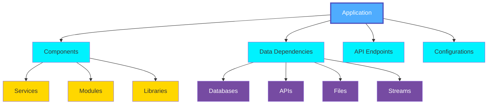
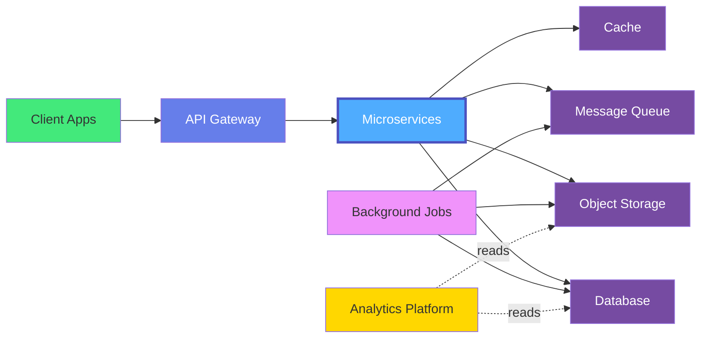
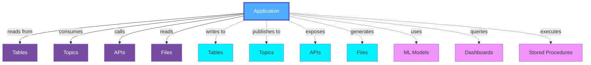
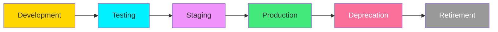

# Applications Overview

**Applications** in OpenMetadata represent software systems and tools that interact with the metadata platform - consuming metadata, automating governance workflows, extending OpenMetadata capabilities, or integrating metadata into other systems. These are operational applications that leverage OpenMetadata's APIs and events to build metadata-driven solutions.

## What are Applications?

Applications in the OpenMetadata operations context are systems that:

- **Consume Metadata**: Read entity metadata, lineage, quality metrics via APIs
- **Automate Governance**: Apply tags, assign owners, enforce policies automatically
- **Extend Capabilities**: Build custom features on top of OpenMetadata
- **Integrate Systems**: Sync metadata with catalogs, CMDB, ITSM tools
- **Enable Workflows**: Trigger actions based on metadata events and changes
- **Build Custom UIs**: Create specialized interfaces for metadata consumption

## Application Categories

### Metadata Consumers
Applications that read and use OpenMetadata:
- Custom data catalogs and portals
- Metadata-driven dashboards
- Data discovery applications
- Compliance reporting tools
- Cost optimization tools

### Governance Automation
Applications that automate metadata governance:
- Auto-tagging and classification engines
- Policy enforcement applications
- Data quality orchestrators
- Ownership assignment tools
- Compliance validators

### Integration Applications
Applications that sync metadata across systems:
- ServiceNow CMDB integrations
- Jira ticket automation
- Slack/Teams bots
- Corporate catalog sync
- Cloud platform integrations

## Application Types

OpenMetadata tracks various application types:

### Web Applications
- Customer-facing websites
- Internal portals and dashboards
- Admin interfaces
- Single-page applications (SPAs)

### Mobile Applications
- iOS and Android apps
- Progressive web apps (PWAs)
- Hybrid mobile applications

### Microservices
- REST APIs
- GraphQL services
- gRPC services
- Event-driven services

### Backend Services
- Authentication services
- Payment processing
- Email and notification services
- Search and recommendation engines

### Data Applications
- ETL/ELT tools
- Data ingestion services
- Stream processing applications
- Batch processing jobs

### Analytics Applications
- Business intelligence tools
- Reporting applications
- Data visualization platforms
- Analytics engines

## Application Entities

### Application Metadata

OpenMetadata captures:

- **Application Properties**: Name, version, repository, deployment
- **Technology Stack**: Programming languages, frameworks, libraries
- **Data Dependencies**: Databases, tables, APIs, files, topics consumed
- **Data Production**: Data created or published by the application
- **API Contracts**: Endpoints exposed and consumed
- **Infrastructure**: Hosting, compute resources, scaling configuration
- **Team Ownership**: Development team, product owner, SRE team
- **Documentation**: Architecture, runbooks, API documentation

## Use Cases

### Data Governance
Understanding which applications access sensitive data:
- Track PII and regulated data usage
- Enforce access policies
- Audit data access patterns
- Manage compliance requirements

### Impact Analysis
Assessing the impact of data changes:
- Identify affected applications when schemas change
- Understand downstream dependencies
- Plan migration strategies
- Prevent breaking changes

### Data Lineage
Mapping data flow through applications:
- Track data transformations
- Understand end-to-end data pipelines
- Identify data sources and destinations
- Validate data accuracy

### Cost Management
Optimizing data costs:
- Identify high-volume data consumers
- Optimize query patterns
- Right-size resources
- Reduce redundant data access

### Security & Compliance
Managing application security:
- Track credential usage
- Monitor data access patterns
- Enforce encryption requirements
- Audit application permissions

## Application Architecture

## Data Contracts for Applications

Applications can define and enforce data contracts:

### Consumer Contracts
What data the application expects:
- Schema requirements
- Data quality expectations
- Freshness requirements
- SLA agreements

### Producer Contracts
What data the application provides:
- Output schema guarantees
- Quality commitments
- Update frequency
- Deprecation policies

## Integration Points

Applications integrate with various data assets:

## Governance Practices

### Application Registration
- Centralized application catalog
- Ownership assignment
- Technology stack documentation
- Dependency mapping

### Access Management
- Service account tracking
- Credential rotation policies
- Least privilege access
- Regular access reviews

### Change Management
- Impact assessment for changes
- Breaking change notifications
- Deprecation policies
- Version management

### Monitoring & Observability
- Data access monitoring
- Performance metrics
- Error tracking
- Usage analytics

## Best Practices

### 1. Document Dependencies
Maintain a clear catalog of all data dependencies.

### 2. Use Data Contracts
Define explicit contracts for data consumption and production.

### 3. Version APIs
Use semantic versioning for application APIs.

### 4. Implement Graceful Degradation
Handle data source failures gracefully.

### 5. Monitor Data Quality
Track quality of consumed and produced data.

### 6. Log Data Access
Maintain audit logs of data access patterns.

### 7. Automate Discovery
Use automatic dependency discovery tools.

### 8. Regular Reviews
Periodically review and update application metadata.

## Application Lifecycle

## Related Entities

- **[Application](./application.md)**: Detailed application entity specification
- **[Table](../databases/table.md)**: Database tables accessed by applications
- **[API Endpoint](../apis/api-endpoint.md)**: APIs called by applications
- **[Topic](../messaging/topic.md)**: Message streams consumed/produced
- **[ML Model](../ml/mlmodel.md)**: Models used by applications
- **[Pipeline](../pipelines/pipeline.md)**: Data pipelines for application data
- **[Data Contract](../../data-contracts/data-contract.md)**: Contracts between applications and data
- **[Team](../../teams-users/team.md)**: Teams owning and operating applications

## Next Steps

- **[Application Entity](./application.md)**: Detailed specification for application entities
- **[Data Contracts](../../data-contracts/overview.md)**: Learn about data contracts for applications
